# ระบบบริหารสินทรัพย์อาคารเช่า (จป.)

## **บทที่ 1 หน้าหลัก**

เข้าใช้งานระบบ คลิกที่เมนู “แอปพลิเคชันของฉัน” จากนั้นคลิก “Asset Management”

<figure>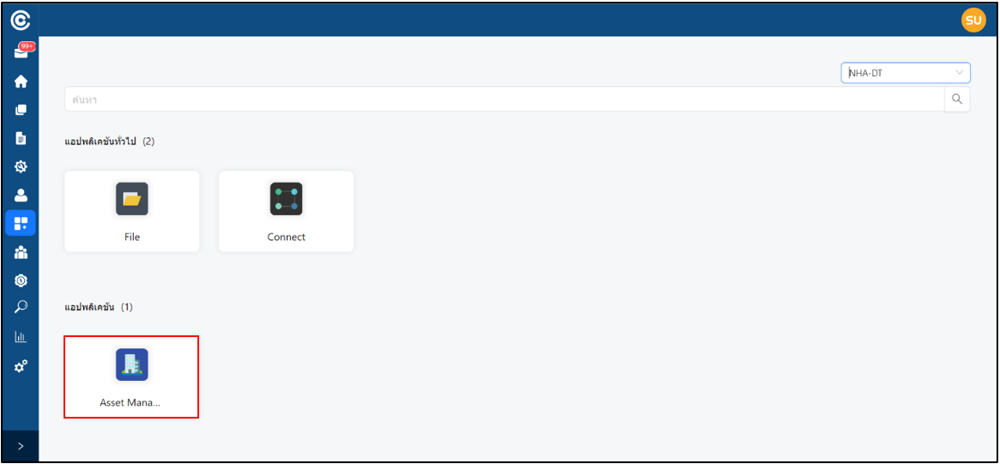<figcaption>
<strong>รูปภาพที่ 1</strong> หน้าจอแอปพลิเคของฉัน – Asset Management
</figcaption></figure>

### 1.1 ระบบแสดงหน้า Asset Management&#x20;

ผู้ใช้งานสามารถจัดการข้อมูลต่าง ๆ ได้ โดยมีเมนูดังนี้

* หน้าหลัก
* ค้นหา
* บริหารจัดการ QR Code
* บริหารสัญญาจัดประโยชน์
* Dashboard มีรายละเอียดรายงาน ดังนี้
  * ข้อมูลกลุ่มสัญญาจัดประโยชน์ร่วม
  * ข้อมูลที่ดินคงเหลือของการเคหะแห่งชาติ

<figure>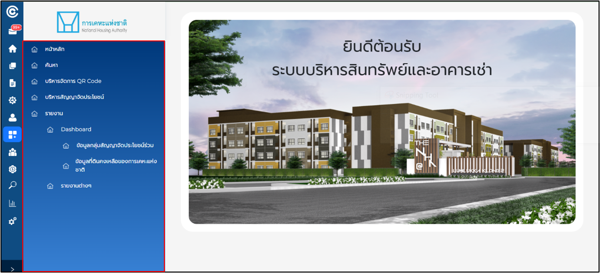<figcaption>
<strong>รูปภาพที่ 2</strong> หน้าจอ Asset Management
</figcaption></figure>

## บทที่ 2 การใช้งานในส่วนของการค้นหาโครงการ

คลิกเมนู “ค้นหา” เพื่อค้นหาโครงการ

<figure>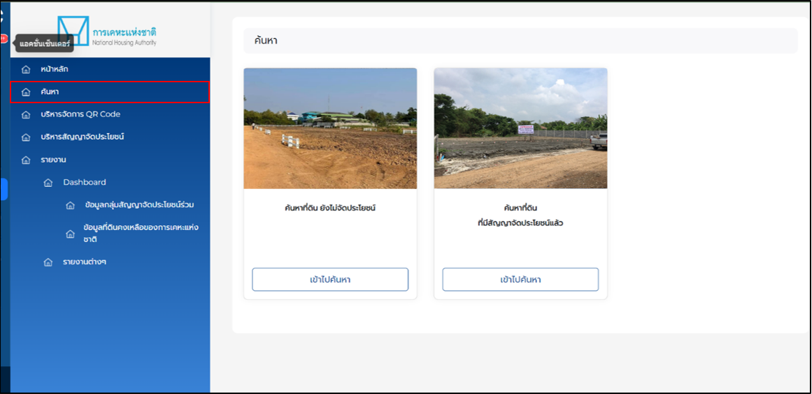<figcaption>
<strong>รูปภาพที่ 3</strong> หน้าจอค้นหา
</figcaption></figure>

### 2.1 ค้นหาที่ดิน ยังไม่จัดประโยชน์

คลิกปุ่ม “เข้าไปค้นหา” เพื่อเข้าไปค้นหาที่ดิน ยังไม่จัดประโยชน์

<figure>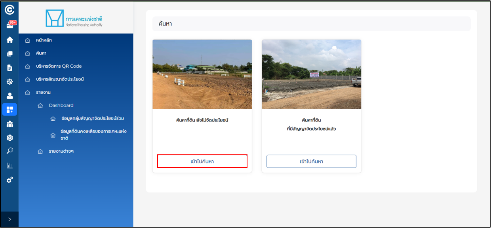<figcaption>
<strong>รูปภาพที่ 4</strong> หน้าจอค้นหาที่ดิน ยังไม่จัดประโยชน์
</figcaption></figure>

#### **2.1.1 ค้นหาที่ดิน ยังไม่จัดประโยชน์**

ค้นหาที่ดิน ยังไม่จัดประโยชน์ โดยกรอกข้อมูลที่ กล่องค้นหาโครงการ และคลิกปุ่ม “ตกลง”

<figure>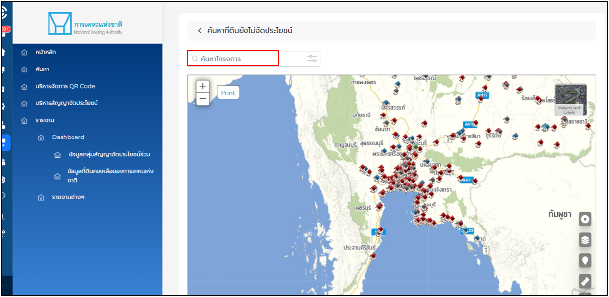<figcaption>
<strong>รูปภาพที่ 5</strong> หน้าจอที่ดิน ยังไม่จัดประโยชน์ – ช่องค้นหาโครงการ
</figcaption></figure>

#### **2.1.2 ตัวกรองโครงการ**

คลิกปุ่ม “ตัวกรอง” ระบบแสดงหน้าต่างป๊อบอัพ (Pop-up) ตัวกรอง

<figure>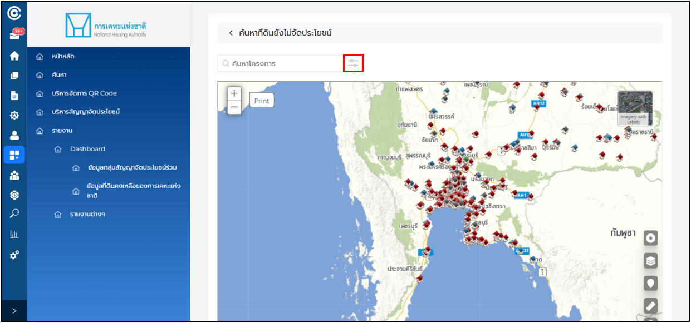<figcaption>
<strong>รูปภาพที่ 6</strong> หน้าจอที่ดิน ยังไม่จัดประโยชน์ – ปุ่มตัวกรองโครงการ
</figcaption></figure>

<figure>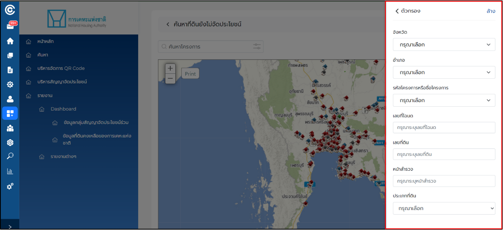<figcaption>
<strong>รูปภาพที่ 7</strong> หน้าจอที่ดิน ยังไม่จัดประโยชน์ - หน้าต่างป๊อบอัพ (Pop-up) ตัวกรอง
</figcaption></figure>

เลือกข้อมูลที่ต้องการกรอง จากนั้นคลิกปุ่ม “บันทึกตัวกรอง” ระบบกรองข้อมูลตามเงื่อนไขที่ระบุ

<figure>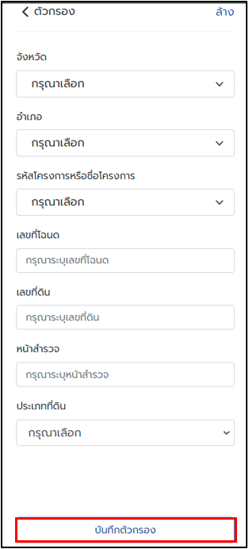<figcaption>
<strong>รูปภาพที่ 8</strong> หน้าจอที่ดิน ยังไม่จัดประโยชน์ - ปุ่มบันทึกตัวกรอง
</figcaption></figure>

คลิกที่ “ล้าง” เพื่อล้างข้อมูลที่เลือก

<figure>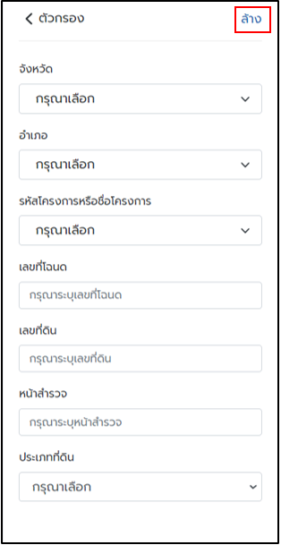<figcaption>
<strong>รูปภาพที่ 9</strong> หน้าจอที่ดิน ยังไม่จัดประโยชน์ – ปุ่มล้างตัวกรอง
</figcaption></figure>

คลิกปุ่ม “<” เพื่อปิดตัวกรอง

<figure><figcaption>
<strong>รูปภาพที่ 10</strong> หน้าจอที่ดิน ยังไม่จัดประโยชน์ – ปุ่มย้อนกลับเพื่อปิดตัวกรอง
</figcaption></figure>

คลิกปุ่ม “เปลี่ยนตัวกรอง” เพื่อเปลี่ยนข้อมูลการค้นหาโครงการ

<figure>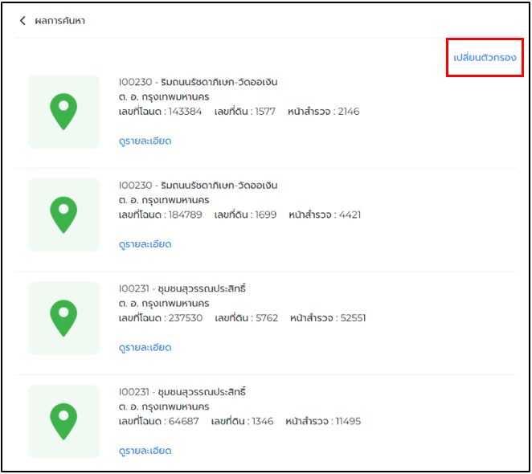<figcaption>
รูปภาพที่ 11 หน้าจอที่ดิน ยังไม่จัดประโยชน์ – ปุ่มเปลี่ยนตัวกรอง
</figcaption></figure>

#### **2.1.3 ดูรายละเอียดโครงการ**

คลิกปุ่ม “ดูรายละเอียด” เพื่อดูข้อมูลรายละเอียดของโครงการ

<figure><figcaption>
<strong>รูปภาพที่ 12</strong> หน้าจอดูรายละเอียดที่ดิน ยังไม่จัดประโยชน์
</figcaption></figure>

#### **2.1.4 ระบบแสดงหน้าจอรายละเอียดโครงการ**&#x20;

ผู้ใช้งานสามารถคลิกปุ่ม “แก้ไข” เพื่อแก้ไขข้อมูลเนื้อที่ตามแผนได้

<figure>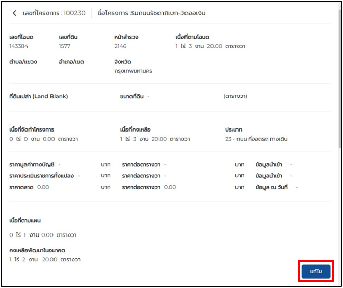<figcaption>
<strong>รูปภาพที่ 13</strong> หน้าจอดูรายละเอียดที่ดิน ยังไม่จัดประโยชน์ – ปุ่มแก้ไข
</figcaption></figure>

ผู้ใช้งานสามารถคลิกปุ่ม “บันทึก” เพื่อบันทึกข้อมูลเนื้อที่ตามแผนได้

<figure><figcaption>
<strong>รูปภาพที่ 14</strong> หน้าจอดูรายละเอียดที่ดิน ยังไม่จัดประโยชน์ – ปุ่มบันทึก
</figcaption></figure>

#### **2.1.5 ระบบแสดงหน้าจอรายละเอียดโครงการ**&#x20;

ผู้ใช้งานสามารถคลิกปุ่ม “แก้ไข” เพื่อแก้ไขข้อมูลโครงการได้

<figure>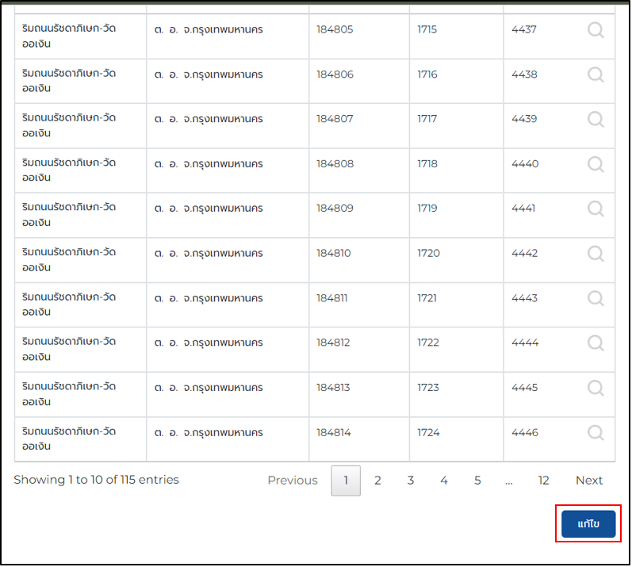<figcaption>
<strong>รูปภาพที่ 15</strong> หน้าจอดูรายละเอียดที่ดิน ยังไม่จัดประโยชน์ – ปุ่มแก้ไข
</figcaption></figure>

ผู้ใช้งานสามารถคลิกปุ่ม “แนบไฟล์” เพื่อแนบไฟล์ผังโครงการ

<figure>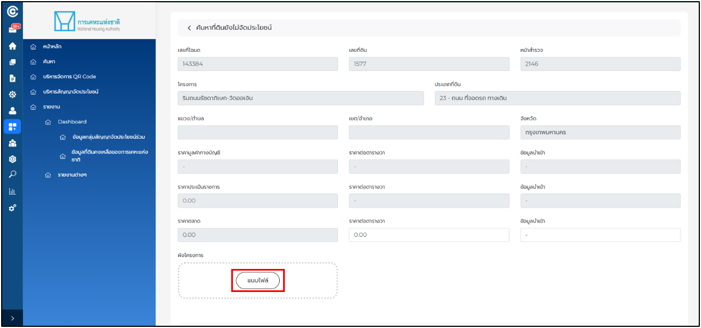<figcaption>
<strong>รูปภาพที่ 16</strong> หน้าจอดูรายละเอียดที่ดิน ยังไม่จัดประโยชน์ – ปุ่มแนบไฟล์
</figcaption></figure>

เพิ่ม “รูปภาพหลัก” โครงการ โดยคลิกที่ปุ่ม “+ อัปโหลดรูปภาพ”

<figure>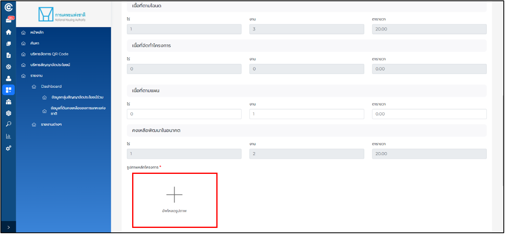<figcaption>
<strong>รูปภาพที่ 17</strong> หน้าจอดูรายละเอียดที่ดิน ยังไม่จัดประโยชน์ – อัปโหลดรูปภาพโครงการหลัก
</figcaption></figure>

เพิ่ม “รูปภาพโครงการเพิ่มเติม” โดยคลิกที่ปุ่ม “+ เพื่อการแสดงผลรูปที่สวยงามที่สุดแนะนำให้อัปโหลดรูปจำนวน 4 รูป”

<figure>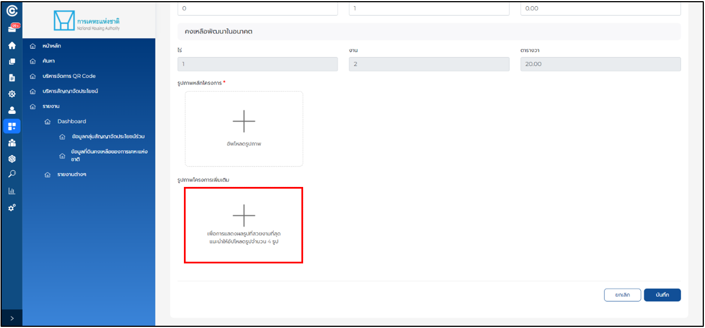<figcaption>
รูปภาพที่ 18 หน้าจอดูรายละเอียดที่ดิน ยังไม่จัดประโยชน์ - อัปโหลดรูปภาพโครงการเพิ่มเติม
</figcaption></figure>

บันทึกข้อมูลโครงการที่ยังไม่จัดประโยชน์ คลิกปุ่ม “บันทึก”

<figure>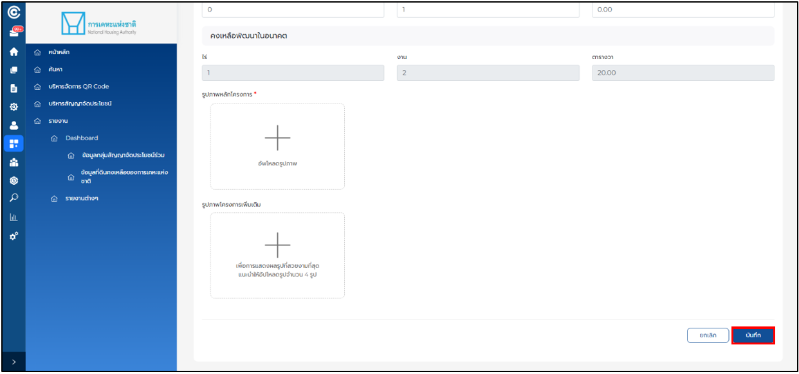<figcaption>
<strong>รูปภาพที่ 19</strong> หน้าจอดูรายละเอียดที่ดิน ยังไม่จัดประโยชน์ – ปุ่มบันทึก
</figcaption></figure>

ยกเลิกการแก้ไขโครงการที่ยังไม่จัดประโยชน์ คลิกปุ่ม “ยกเลิก”

<figure>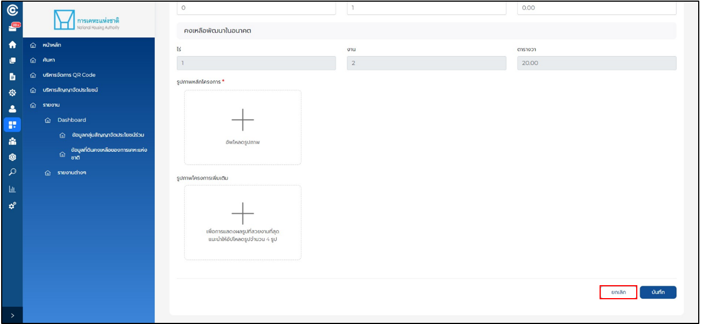<figcaption>
<strong>รูปภาพที่ 20</strong> หน้าจอดูรายละเอียดที่ดิน ยังไม่จัดประโยชน์ – ปุ่มยกเลิก
</figcaption></figure>

ผู้ใช้งานสามารถคลิกไอคอนแว่นขยายเพื่อดูรายละเอียดข้อมูลเลขหน้าสำรวจเลขที่โครงการได้

<figure>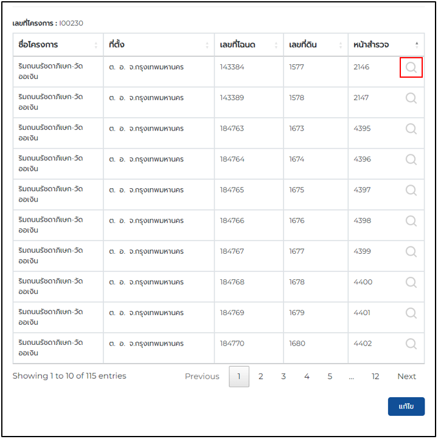<figcaption>
<strong>รูปภาพที่ 21</strong> หน้าจอดูรายละเอียดที่ดิน ยังไม่จัดประโยชน์ - รายละเอียดข้อมูลเลขหน้าสำรวจเลขที่โครงการ
</figcaption></figure>

### 2.2 ค้นหาข้อมูลค้นหาที่ดินที่มีสัญญาจัดประโยชน์แล้ว&#x20;

คลิกปุ่ม “เข้าไปค้นหา” เพื่อเข้าไปค้นหาข้อมูลค้นหาที่ดินที่มีสัญญาจัดประโยชน์แล้ว

<figure>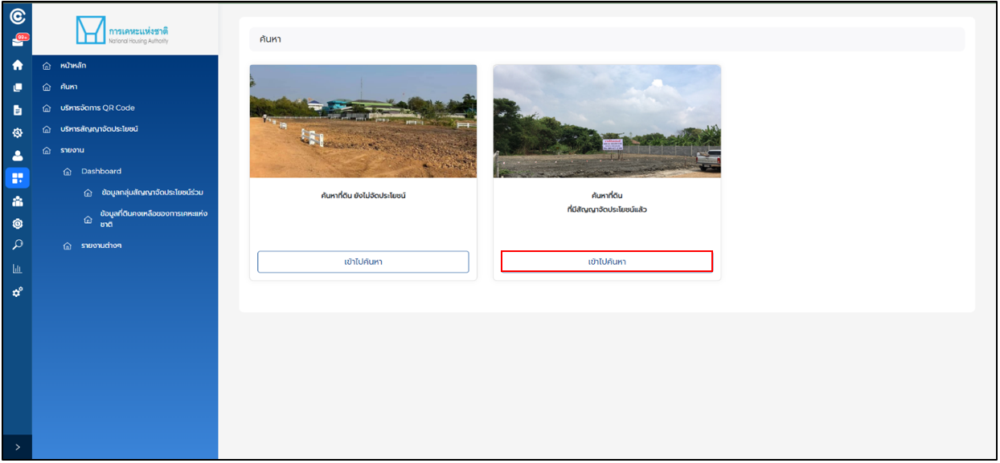<figcaption>
<strong>รูปภาพที่ 22</strong> หน้าจอค้นหาข้อมูลค้นหาที่ดินที่มีสัญญาจัดประโยชน์แล้ว
</figcaption></figure>

#### **2.2.1 ค้นหาที่ดินที่มีสัญญาจัดประโยชน์แล้ว**

ค้นหาที่ดินที่มีสัญญาจัดประโยชน์แล้ว โดยกรอกข้อมูลที่โดยกรอกข้อมูลที่กล่องค้นหาโครงการและคลิกปุ่ม “ตกลง”

<figure>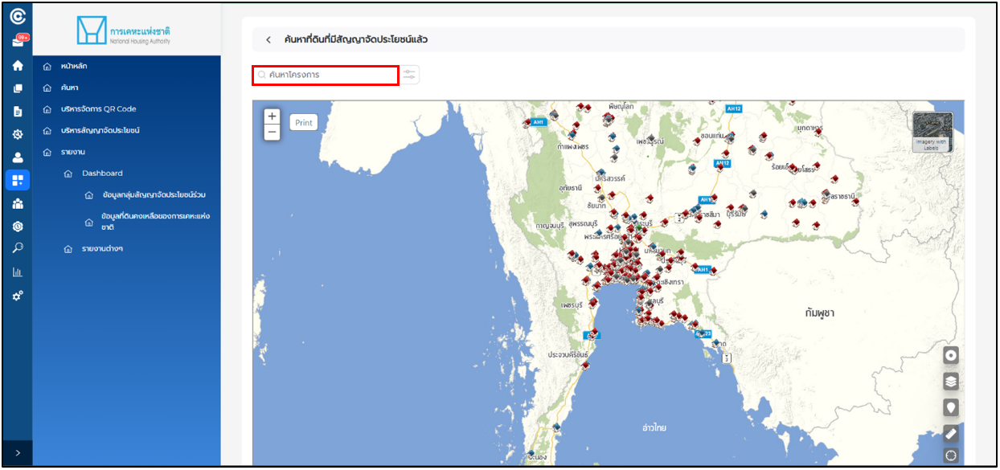<figcaption>
<strong>รูปภาพที่ 23</strong> หน้าจอค้นหาที่ดินที่มีสัญญาจัดประโยชน์แล้ว – ช่องค้นหาโครงการ
</figcaption></figure>

#### **2.2.2 ตัวกรองโครงการ**

คลิกปุ่ม “ตัวกรอง” ระบบแสดงหน้าต่างป๊อบอัพ (Pop-up) ตัวกรอง

<figure>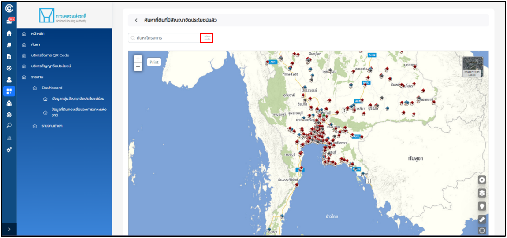<figcaption>
<strong>รูปภาพที่ 24</strong> หน้าจอค้นหาที่ดินที่มีสัญญาจัดประโยชน์แล้ว - ปุ่มตัวกรอง
</figcaption></figure>

<figure>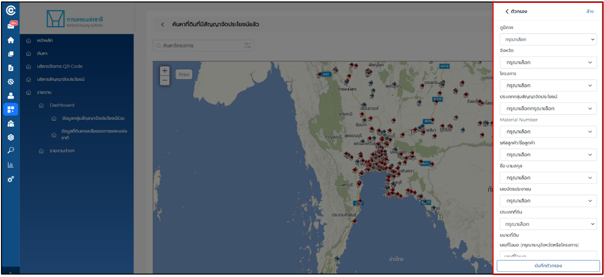<figcaption>
<strong>รูปภาพที่ 25</strong> หน้าจอค้นหาที่ดินที่มีสัญญาจัดประโยชน์แล้ว - หน้าต่างป๊อบอัพ (Pop-up) ตัวกรอง
</figcaption></figure>

เลือกข้อมูลที่ต้องการกรอง จากนั้นคลิกปุ่ม “บันทึกตัวกรอง” ระบบกรองข้อมูลตามเงื่อนไขที่ระบุ

<figure>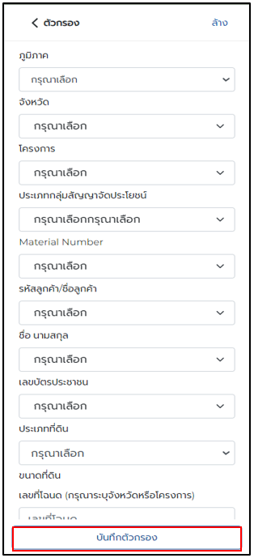<figcaption>
<strong>รูปภาพที่ 26</strong> หน้าจอค้นหาที่ดินที่มีสัญญาจัดประโยชน์แล้ว – ปุ่มบันทึกตัวกรอง
</figcaption></figure>

คลิกที่ “ล้าง” เพื่อล้างข้อมูลที่เลือก

<figure>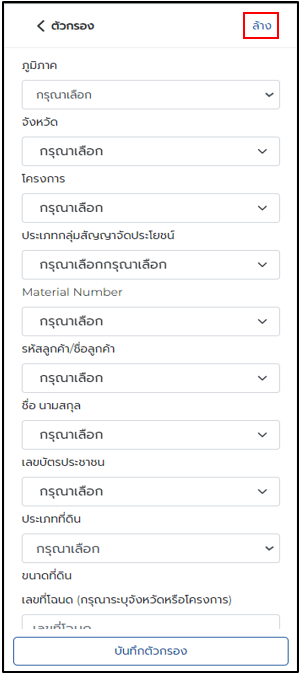<figcaption>
<strong>รูปภาพที่ 27</strong> หน้าจอค้นหาที่ดินที่มีสัญญาจัดประโยชน์แล้ว – ปุ่มล้างตัวกรอง
</figcaption></figure>

คลิกปุ่ม “<” เพื่อปิดตัวกรอง

<figure><figcaption>
<strong>รูปภาพที่ 28</strong> หน้าจอค้นหาที่ดินที่มีสัญญาจัดประโยชน์แล้ว – ปุ่มย้อนกลับ
</figcaption></figure>

คลิกปุ่ม “เปลี่ยนตัวกรอง” เพื่อเปลี่ยนข้อมูลการค้นหาโครงการ

<figure>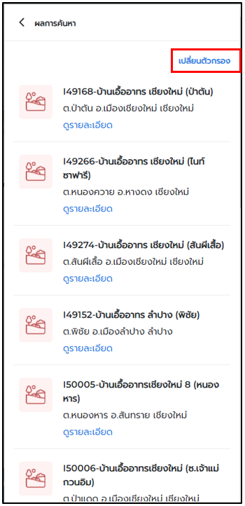<figcaption>
<strong>รูปภาพที่ 29</strong> หน้าจอค้นหาที่ดินที่มีสัญญาจัดประโยชน์แล้ว – ปุ่มเปลี่ยนตัวกรอง
</figcaption></figure>

#### **2.2.3 ดูรายละเอียดโครงการ**

คลิกปุ่ม “ดูรายละเอียด” เพื่อดูข้อมูลรายละเอียดของโครงการ

<figure>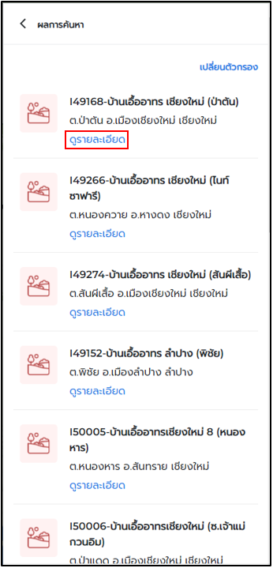<figcaption>
<strong>รูปภาพที่ 30</strong> หน้าจอดูรายละเอียดที่ดินที่มีสัญญาจัดประโยชน์แล้ว
</figcaption></figure>

#### **2.2.4 หน้าจอรายละเอียดโครงการ**

ผู้ใช้งานสามารถคลิกปุ่ม “ตัวกรอง” เพื่อค้นหารายละเอียดสัญญาได้

<figure>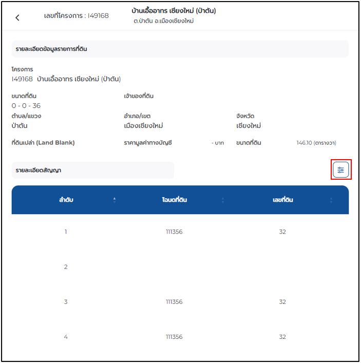<figcaption>
<strong>รูปภาพที่ 31</strong> หน้าจอดูรายละเอียดที่ดินที่มีสัญญาจัดประโยชน์แล้ว – ปุ่มตัวกรอง
</figcaption></figure>

เลือกข้อมูลที่ต้องการกรอง จากนั้นคลิกปุ่ม “บันทึกตัวกรอง” ระบบกรองข้อมูลตามเงื่อนไขที่ระบุ

<figure>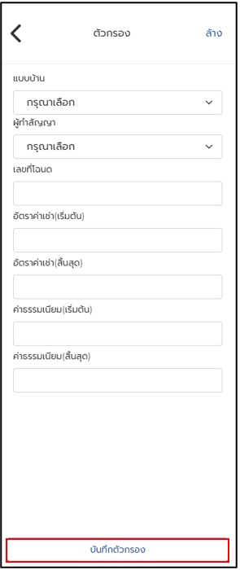<figcaption>
<strong>รูปภาพที่ 32</strong> หน้าจอดูรายละเอียดที่ดินที่มีสัญญาจัดประโยชน์แล้ว – ปุ่มบันทึกตัวกรอง
</figcaption></figure>

คลิกที่ “ล้าง” เพื่อล้างข้อมูลที่เลือก

<figure>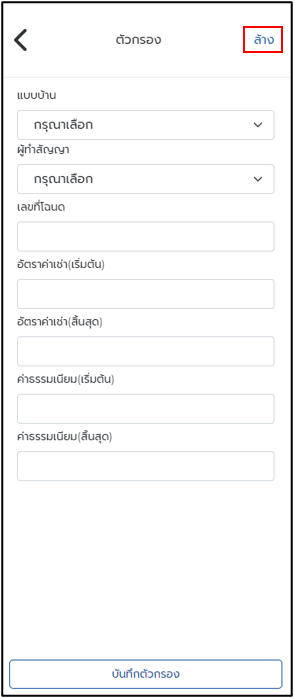<figcaption>
<strong>รูปภาพที่ 33</strong> หน้าจอดูรายละเอียดที่ดินที่มีสัญญาจัดประโยชน์แล้ว – ปุ่มล้างตัวกรอง
</figcaption></figure>

คลิกปุ่ม “<” เพื่อปิดตัวกรอง

<figure>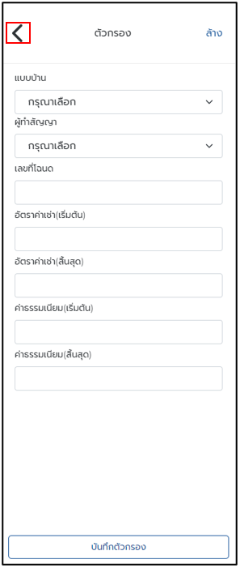<figcaption>
<strong>รูปภาพที่ 34</strong> หน้าจอดูรายละเอียดที่ดินที่มีสัญญาจัดประโยชน์แล้ว – ปุ่มย้อนกลับ
</figcaption></figure>

## บทที่ 3 บริหารจัดการ QR Code

คลิกเมนู “บริหารจัดการ QR Code” เพื่อเข้าสู่หน้าบริหารจัดการคิวอาร์โค้ด

<figure><figcaption>
<strong>รูปภาพที่ 35</strong> หน้าจอบริหารจัดการคิวอาร์โค้ด
</figcaption></figure>

### 3.1 ค้นหาคิวอาร์โค้ด

ค้นหาคิวอาร์โค้ดโดยกรอกข้อมูลที่ กล่องค้นหาข้อมูล และคลิกปุ่มตกลง

<figure>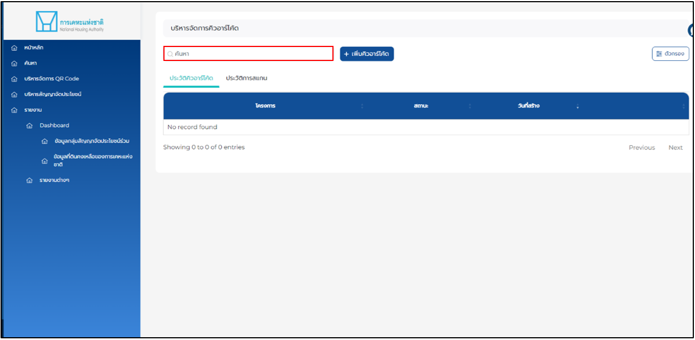<figcaption>
<strong>รูปภาพที่ 36</strong> หน้าจอบริหารจัดการคิวอาร์โค้ด – ค้นหาคิวอาร์โค้ด
</figcaption></figure>

#### **3.1.1 ตัวกรองคิวอาร์โค้ด**

คลิกปุ่ม “ตัวกรอง” ระบบแสดงหน้าต่างป๊อบอัพ (Pop-up) ตัวกรอง

<figure><figcaption>
<strong>รูปภาพที่ 37</strong> หน้าจอบริหารจัดการคิวอาร์โค้ด - ตัวกรอง
</figcaption></figure>

<figure><figcaption>
<strong>รูปภาพที่ 38</strong> หน้าจอบริหารจัดการคิวอาร์โค้ด - หน้าต่างป๊อบอัพ (Pop-up) ตัวกรอง
</figcaption></figure>

เลือกข้อมูลที่ต้องการกรอง จากนั้นคลิกปุ่ม “บันทึกตัวกรอง” ระบบกรองข้อมูลตามเงื่อนไขที่ระบุ

<figure>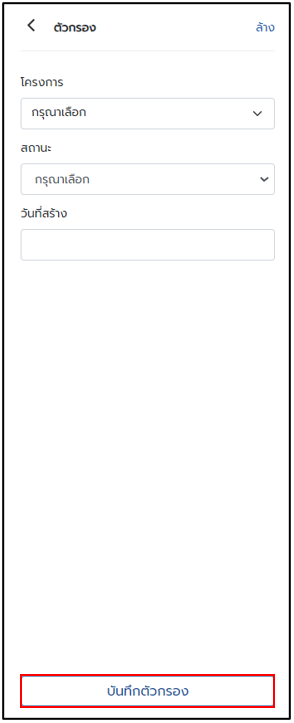<figcaption>
<strong>รูปภาพที่ 39</strong> หน้าจอบริหารจัดการคิวอาร์โค้ด – ปุ่มบันทึกตัวกรอง
</figcaption></figure>

คลิกที่ “ล้าง” เพื่อล้างข้อมูลที่เลือก

<figure>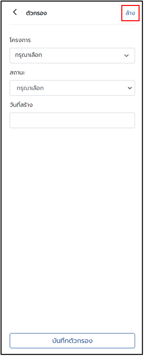<figcaption>
<strong>รูปภาพที่ 40</strong> หน้าจอบริหารจัดการคิวอาร์โค้ด – ปุ่มล้าง
</figcaption></figure>

คลิกปุ่ม “<” เพื่อปิดตัวกรอง

<figure>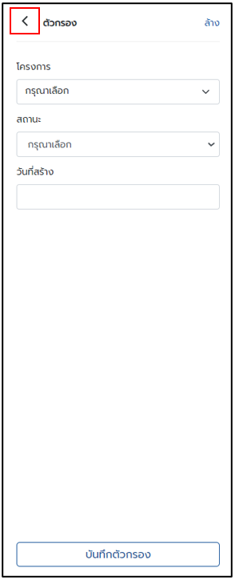<figcaption>
<strong>รูปภาพที่ 41</strong> หน้าจอบริหารจัดการคิวอาร์โค้ด – ปุ่มย้อนกลับ
</figcaption></figure>

#### **3.1.2 เพิ่มคิวอาร์โค้ด**

เพิ่มคิวอาร์โค้ด โดยคลิกปุ่ม “เพิ่มคิวอาร์โค้ด”

<figure><figcaption>
<strong>รูปภาพที่ 42</strong> หน้าจอบริหารจัดการคิวอาร์โค้ด – เพิ่มคิดอาร์โค้ด
</figcaption></figure>

การค้นหาข้อมูล โดยกรอกค้นหาข้อมูลเพื่อสร้างคิวอาร์โค้ด คลิกปุ่ม “ค้นหา”

<figure><figcaption>
<strong>รูปภาพที่ 43</strong> หน้าจอบริหารจัดการคิวอาร์โค้ด – ปุ่มค้นหา
</figcaption></figure>

การล้างค่าข้อมูล โดยล้างค่าข้อมูลที่กรอกไว้ คลิกปุ่ม “ล้างค่า”

<figure>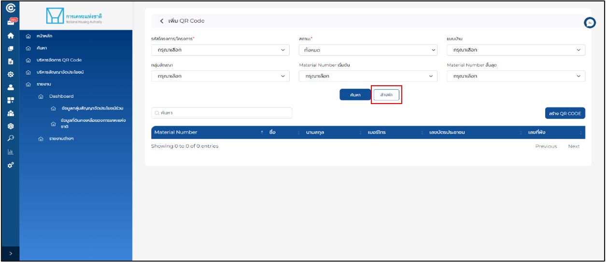<figcaption>
<strong>รูปภาพที่ 44</strong> หน้าจอบริหารจัดการคิวอาร์โค้ด - ปุ่มล้างค่า
</figcaption></figure>

การสร้างคิวอาร์โค้ด สามารถทำได้โดยคลิกปุ่ม “สร้างคิวอาร์โค้ด” เพื่อสร้างคิวอาร์โค้ด

<figure><figcaption>
<strong>รูปภาพที่ 45</strong> หน้าจอบริหารจัดการคิวอาร์โค้ด – ปุ่มสร้างคิวอาร์โค้ด
</figcaption></figure>

#### **3.1.3 ดูประวัติคิวอาร์โค้ด**

คลิกปุ่ม “ประวัติคิวอาร์โค้ด” ระบบแสดงประวัติคิวอาร์โค้ด

<figure>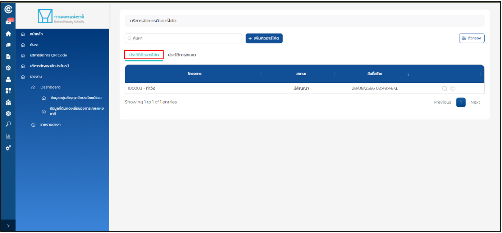<figcaption>
<strong>รูปภาพที่ 46</strong> หน้าจอบริหารจัดการคิวอาร์โค้ด – ปุ่มประวัติคิวอาร์โค้ด
</figcaption></figure>

การดูรายละเอียดประวัติคิวอาร์โค้ด ผู้ใช้คลิกไอคอนแว่นขยายเพื่อดูรายละเอียด

<figure><figcaption>
<strong>รูปภาพที่ 47</strong> หน้าจอบริหารจัดการคิวอาร์โค้ด – ดูรายละเอียดประวัติคิวอาร์โค้ด
</figcaption></figure>

การปริ้นต์คิวอาร์โค้ด ผู้ใช้คลิกที่ไอคอน “เครื่องปริ้นต์เอกสาร” เพื่อปริ้นต์คิวอาร์โค้ด

<figure>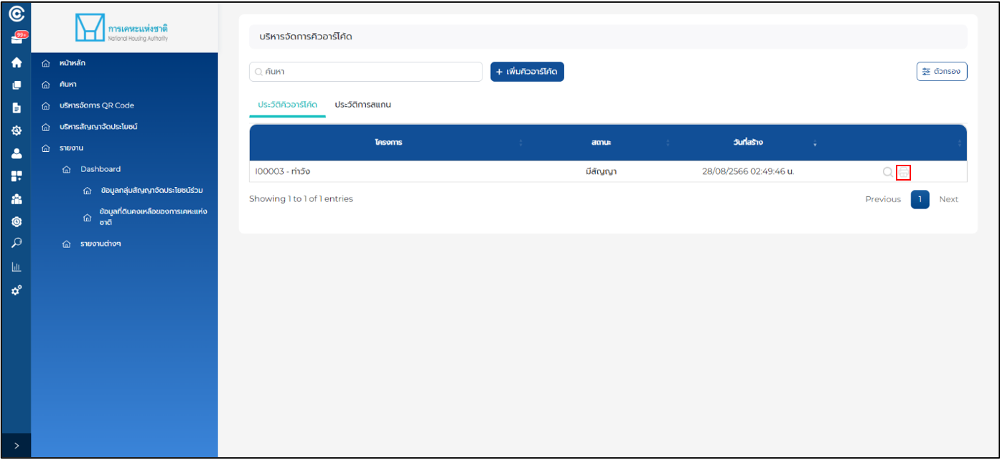<figcaption>
<strong>รูปภาพที่ 48</strong> หน้าจอบริหารจัดการคิวอาร์โค้ด – ปุ่มปริ้นต์
</figcaption></figure>

#### **3.1.4 ประวัติการแสกน**

ดูประวัติการแสกน คลิกปุ่ม “ประวัติการแสกน”

<figure>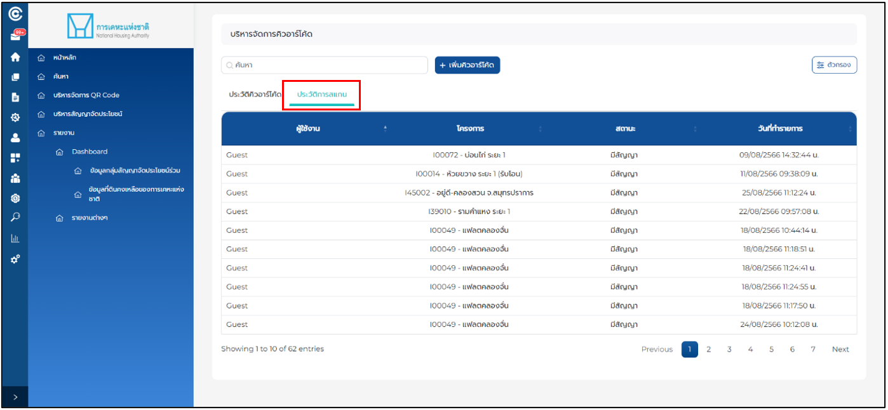<figcaption>
<strong>รูปภาพที่ 49</strong> หน้าจอบริหารจัดการคิวอาร์โค้ด – ดูประวัตการแสกน
</figcaption></figure>

## บทที่ 4 บริหารสัญญาจัดประโยชน์

คลิกเมนู “บริหารสัญญาจัดประโยชน์” เพื่อเข้าสู่หน้าบริหารสัญญาจัดประโยชน์

<figure>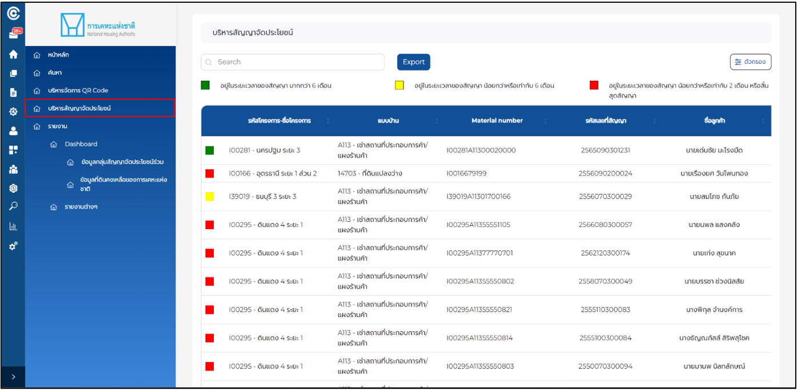<figcaption>
<strong>รูปภาพที่ 50</strong> หน้าจอบริหารสัญญาจัดประโยชน์
</figcaption></figure>

### 4.1 ค้นหาข้อมูลบริหารสัญญาจัดประโยชน์

ค้นหาข้อมูลบริหารสัญญาจัดประโยชน์ โดยกรอกข้อมูลที่ กล่องค้นหาข้อมูล และคลิกปุ่มตกลง

<figure><figcaption>
<strong>รูปภาพที่ 51</strong> หน้าจอบริหารสัญญาจัดประโยชน์ – ค้นหาบริหารสัญญาจัดประโยชน์
</figcaption></figure>

### 4.2 ออกรายงานหน้าจอบริหารสัญญาจัดประโยชน์

ออกรายงานหน้าจอบริหารสัญญาจัดประโยชน์ โดยคลิกปุ่ม “Export” เพื่อออกรายงาน

<figure><figcaption>
<strong>รูปภาพที่ 52</strong> หน้าจอบริหารสัญญาจัดประโยชน์ - ปุ่มออกรายงาน
</figcaption></figure>

### 4.3 ตัวกรองโครงการ

คลิกปุ่ม “ตัวกรอง” ระบบแสดงหน้าต่างป๊อบอัพ (Pop-up) ตัวกรอง

<figure><figcaption>
<strong>รูปภาพที่ 53</strong> หน้าจอบริหารสัญญาจัดประโยชน์ – ปุ่มตัวกรอง
</figcaption></figure>

<figure>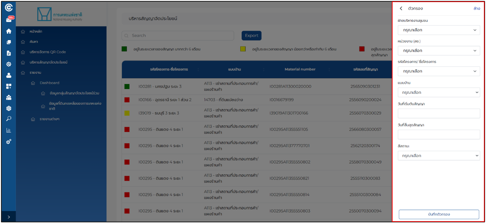<figcaption>
<strong>รูปภาพที่ 54</strong> หน้าจอบริหารสัญญาจัดประโยชน์ - หน้าต่างป๊อบอัพ (Pop-up) ตัวกรอง
</figcaption></figure>

เลือกข้อมูลที่ต้องการกรอง จากนั้นคลิกปุ่ม “บันทึกตัวกรอง” ระบบกรองข้อมูลตามเงื่อนไขที่ระบุ

<figure>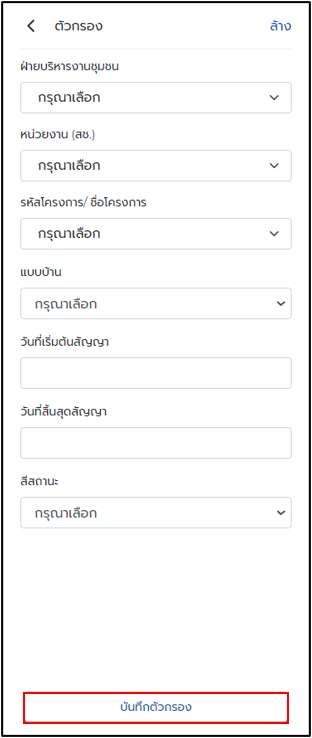<figcaption>
<strong>รูปภาพที่ 55</strong> หน้าจอบริหารสัญญาจัดประโยชน์ – ปุ่มบันทึกตัวกรอง
</figcaption></figure>

คลิกที่ “ล้าง” เพื่อล้างข้อมูลที่เลือก

<figure>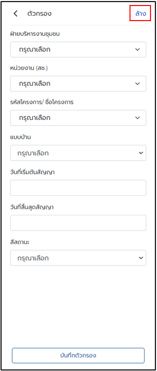<figcaption>
<strong>รูปภาพที่ 56</strong> หน้าจอบริหารสัญญาจัดประโยชน์ – ปุ่มล้างตัวกรอง
</figcaption></figure>

คลิกปุ่ม “<” เพื่อปิดตัวกรอง

<figure>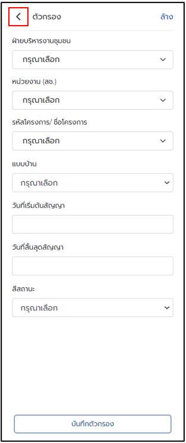<figcaption>
<strong>รูปภาพที่ 57</strong> หน้าจอบริหารสัญญาจัดประโยชน์ – ปุ่มย้อนกลับ
</figcaption></figure>

## บทที่ 5 รายงาน

### 5.1 หน้าจอข้อมูลกลุ่มสัญญาจัดประโยชน์ร่วม

ผู้ใช้งานสามารถดูสรุปข้อมูลกลุ่มสัญญาจัดประโยชน์ร่วมได้ โดยคลิกปุ่ม “ข้อมูลกลุ่มสัญญาจัดประโยชน์” เพื่อค้นหา

<figure>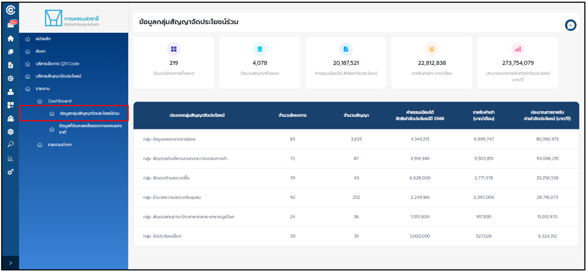<figcaption>
<strong>รูปภาพที่ 58</strong> หน้าจอข้อมูลกลุ่มสัญญาจัดประโยชน์ร่วม
</figcaption></figure>

### 5.2 ข้อมูลที่ดินคงเหลือของการเคหะแห่งชาติ

ผู้ใช้งานสามารถดูสรุปข้อมูลที่ดินคงเหลือของการเคหะแห่งชาติได้ โดยคลิกปุ่ม “สรุปรายงานข้อมูลยอดรวมหนี้อาคารเช่า”

<figure>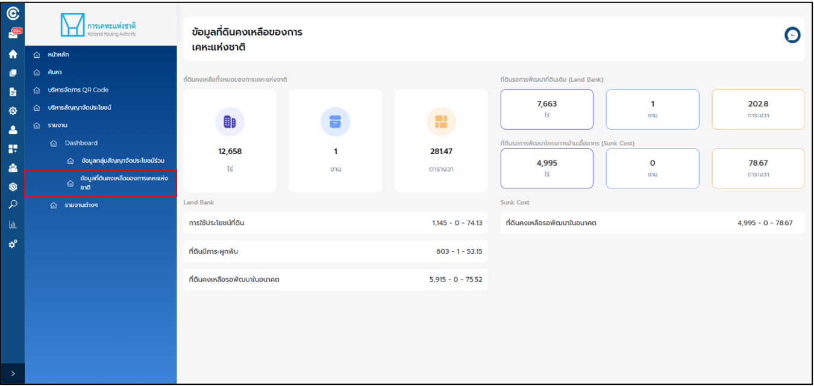<figcaption>
<strong>รูปภาพที่ 59</strong> หน้าจอดูข้อมูลที่ดินคงเหลือของการเคหะแห่งชาติ
</figcaption></figure>

## บทที่ 6 รายงานต่าง ๆ

### 6.1 เลือกดูรายงานต่าง ๆ

ผู้ใช้งานสามารถเลือกดูรายงานต่าง ๆ ได้ที่เมนู “รายงานต่างๆ”

<figure>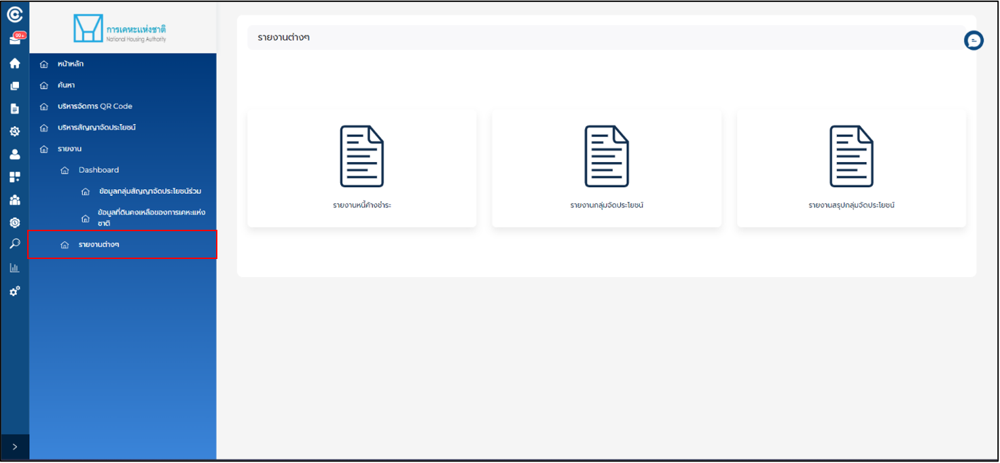<figcaption>
<strong>รูปภาพที่ 60</strong> หน้าจอรายงานต่าง ๆ
</figcaption></figure>

### 6.2 รายงานที่ต้องการดู

ผู้ใช้งานสามารถคลิกที่รายงานที่ต้องการดูได้

<figure>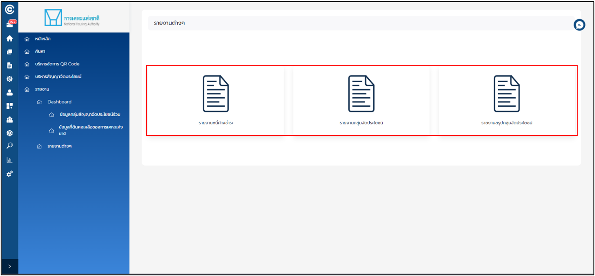<figcaption>
<strong>รูปภาพที่ 61</strong> หน้าจอรายงานต่าง ๆ - รายงานต่าง ๆ
</figcaption></figure>

### 6.3 การส่งออกเอกสาร

ผู้ใช้งานกรอกข้อมูลที่ต้องการและสามารถคลิกปุ่ม “ส่งออกเอกสาร” เพื่อส่งออกรายงานได้

<figure>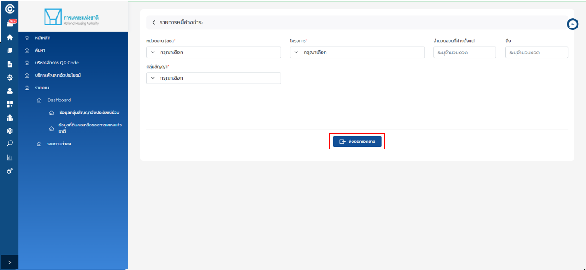<figcaption>
<strong>รูปภาพที่ 62</strong> หน้าจอรายงานต่าง ๆ - ส่งออกเอกสาร
</figcaption></figure>
