# ระบบบริหารสินทรัพย์อาคารเช่า (กอ.ทอ.)

## **บทที่ 1 หน้าหลัก**

เข้าใช้งานระบบ คลิกที่เมนู “แอปพลิเคชันของฉัน” จากนั้นคลิก “Asset Management”

<figure>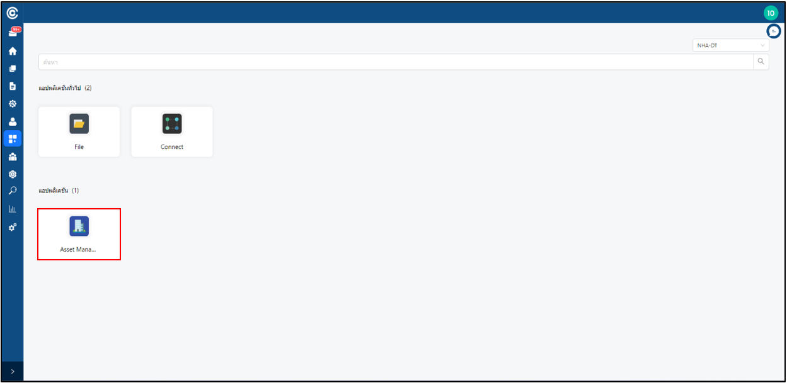<figcaption>
<strong>รูปภาพที่ 1</strong> หน้าจอแอปพลิเคของฉัน – Asset Management
</figcaption></figure>

### 1.1 ระบบแสดงหน้า Asset Management

ผู้ใช้งานสามารถจัดการข้อมูลต่าง ๆ ได้ โดยมีเมนู ดังนี้

* หน้าหลัก
* ค้นหา
* ทรัพย์สินอาคารเช่า
* Dashboard
  * สรุปข้อมูลอาคารเช่า
  * สรุปรายงานข้อมูลยอดรวมหนี้อาคารเช่า
* รายงานต่าง ๆ

<figure>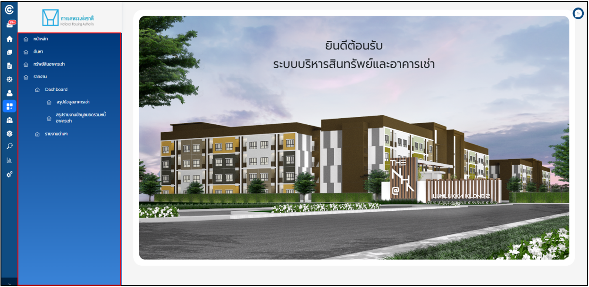<figcaption>
<strong>รูปภาพที่ 2</strong> หน้า Asset Management
</figcaption></figure>

## บทที่ 2 การใช้งานในส่วนของการค้นหาโครงการ

คลิกเมนู “ค้นหา” เพื่อค้นหาโครงการ

<figure>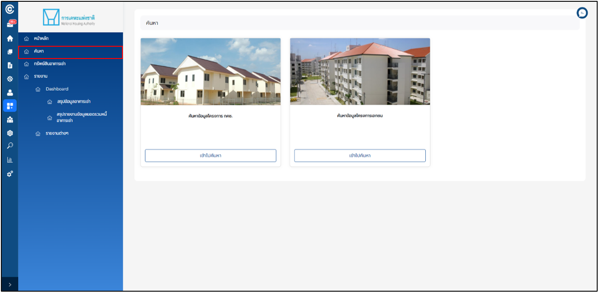<figcaption>
<strong>รูปภาพที่ 3</strong> หน้าจอค้นหา
</figcaption></figure>

### 2.1 ค้นหาข้อมูลโครงการ กคช.

คลิกปุ่ม “เข้าไปค้นหา” เพื่อเข้าไปค้นหาข้อมูลโครงการ กคช.

<figure>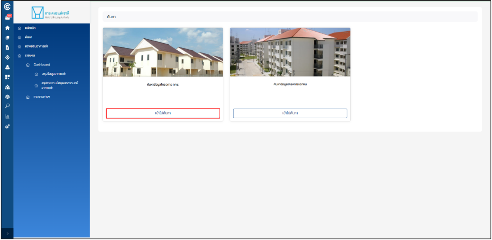<figcaption>
<strong>รูปภาพที่ 4</strong> หน้าจอค้นหาโครงการ กคช.
</figcaption></figure>

#### 2.1.1 ค้นหาโครงการ กคช.

ค้นหาโครงการ กคช. โดยกรอกข้อมูลที่ กล่องค้นหาโครงการ และคลิกปุ่ม “ตกลง”

<figure>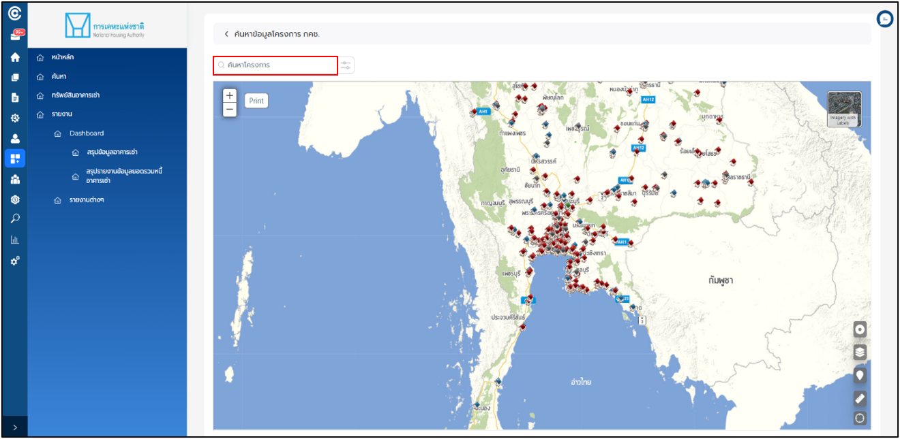<figcaption>
<strong>รูปภาพที่ 5</strong> หน้าจอค้นหาโครงการ กคช. – ช่องค้นหาโครงการ
</figcaption></figure>

#### 2.1.2 ตัวกรองโครงการ

คลิกปุ่ม “ตัวกรอง” ระบบแสดงหน้าต่างป๊อบอัพ (Pop-up) ตัวกรอง

<figure>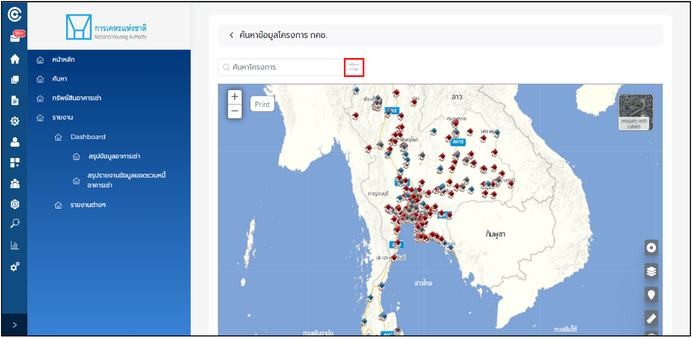<figcaption>
<strong>รูปภาพที่ 6</strong> หน้าจอค้นหาโครงการ กคช. – ปุ่มตัวกรองโครงการ
</figcaption></figure>

<figure>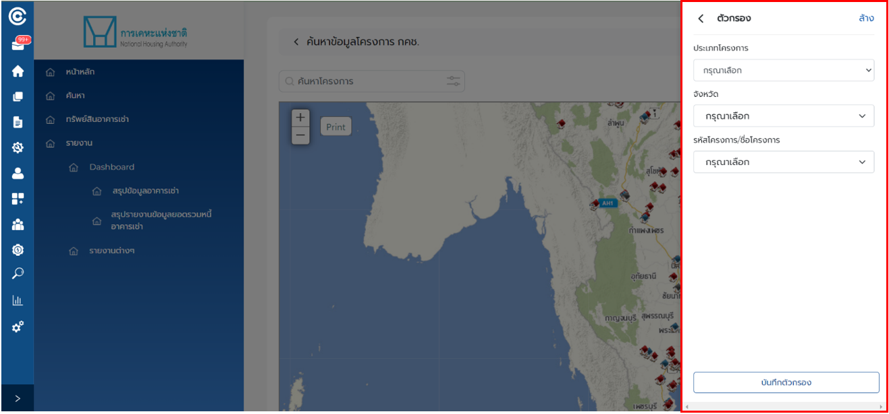<figcaption>
<strong>รูปภาพที่ 7</strong> หน้าจอค้นหาโครงการ กคช. - หน้าต่างป๊อบอัพ (Pop-up) ตัวกรอง
</figcaption></figure>

เลือกข้อมูลที่ต้องการกรอง จากนั้นคลิกปุ่ม “บันทึกตัวกรอง” ระบบกรองข้อมูลตามเงื่อนไขที่ระบุ

<figure>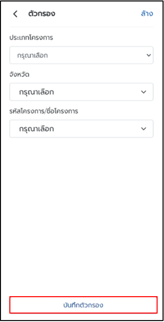<figcaption>
<strong>รูปภาพที่ 8</strong> หน้าจอค้นหาโครงการ กคช. - ปุ่มบันทึกตัวกรอง
</figcaption></figure>

คลิกที่ “ล้าง” เพื่อล้างข้อมูลที่เลือก

<figure>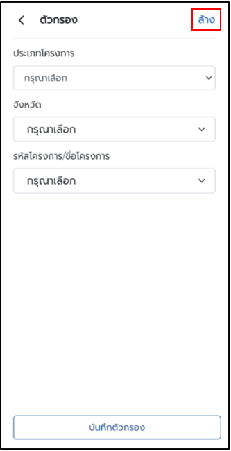<figcaption>
<strong>รูปภาพที่ 9</strong> หน้าจอค้นหาโครงการ กคช. – ปุ่มล้างตัวกรอง
</figcaption></figure>

คลิกปุ่ม “<” เพื่อปิดตัวกรอง

<figure>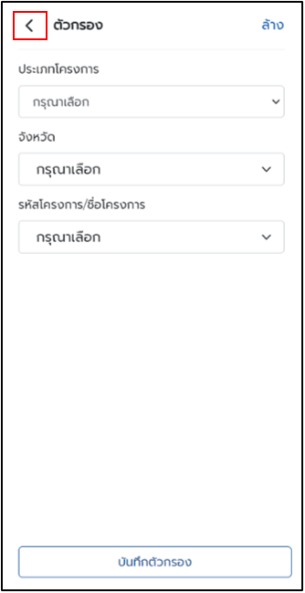<figcaption>
<strong>รูปภาพที่ 10</strong> หน้าจอค้นหาโครงการ กคช. – ปุ่มย้อนกลับ
</figcaption></figure>

คลิกปุ่ม “เปลี่ยนตัวกรอง” เพื่อเปลี่ยนข้อมูลการค้นหาโครงการ

<figure>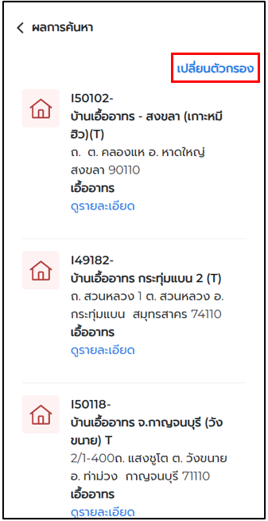<figcaption>
<strong>รูปภาพที่ 11</strong> หน้าจอค้นหาโครงการ กคช. – ปุ่มเปลี่ยนตัวกรอง
</figcaption></figure>

#### 2.1.3 ดูรายละเอียดโครงการ

คลิกปุ่ม “ดูรายละเอียด” เพื่อดูข้อมูลรายละเอียดของโครงการ

<figure><figcaption>
<strong>รูปภาพที่ 12</strong> หน้าจอดูรายละเอียดโครงการ กคช.
</figcaption></figure>

ระบบแสดงหน้าจอรายละเอียดโครงการ ผู้ใช้งานสามารถคลิกปุ่ม “แสดงแผนที่” เพื่อดูแผนที่โครงการได้

<figure>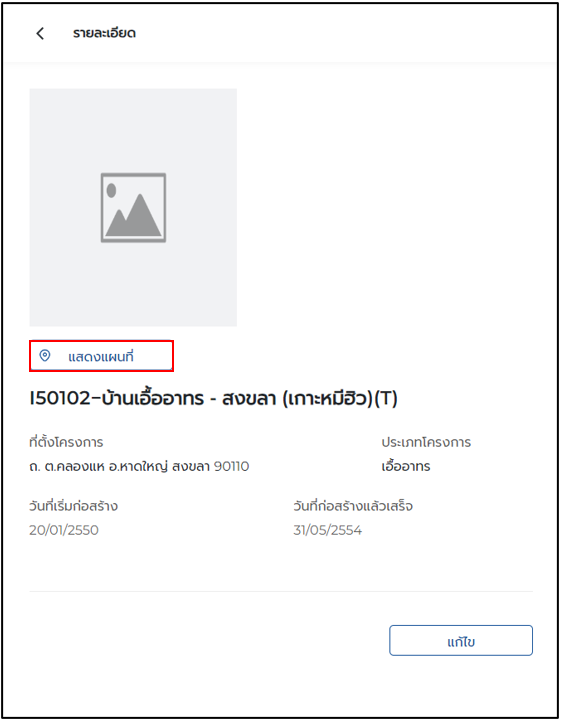<figcaption>
<strong>รูปภาพที่ 13</strong> หน้าจอดูรายละเอียดโครงการ กคช. – ปุ่มแสดงแผนที่
</figcaption></figure>

ระบบแสดงหน้าจอรายละเอียดโครงการ ผู้ใช้งานสามารถคลิกปุ่ม “แก้ไข” เพื่อแก้ไขข้อมูล โครงการ โดยคลิกปุ่ม “แก้ไข”

<figure>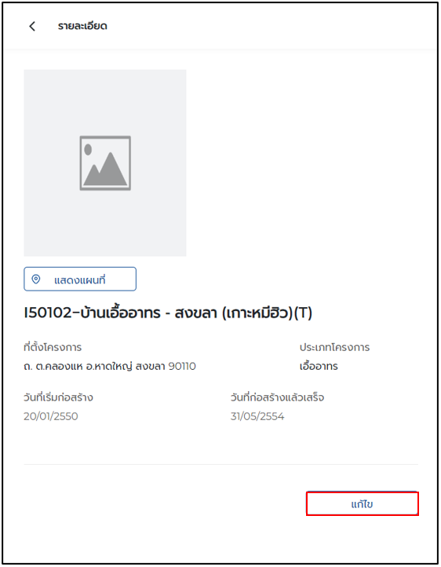<figcaption>
<strong>รูปภาพที่ 14</strong> หน้าจอดูรายละเอียดโครงการ – ปุ่มแก้ไขข้อมูล
</figcaption></figure>

#### 2.1.4 แก้ไขข้อมูลโครงการ

เพิ่ม “รูปภาพหลัก” โครงการ โดยคลิกที่ปุ่ม “+ อัปโหลดรูปภาพ”

<figure>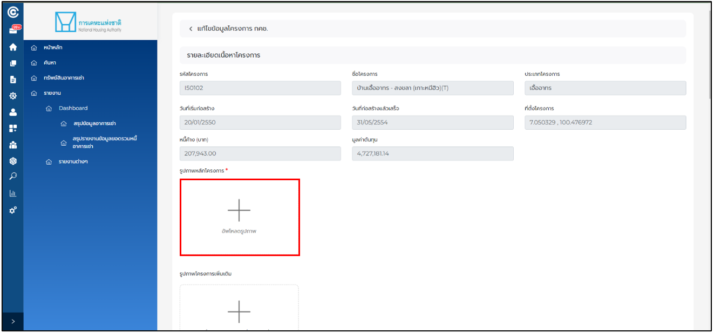<figcaption>
<strong>รูปภาพที่ 15</strong> หน้าจอแก้ไขข้อมูลโครงการ – รูปภาพโครงการหลัก
</figcaption></figure>

เพิ่ม “รูปภาพโครงการเพิ่มเติม” โดยคลิกที่ปุ่ม “+ เพื่อการแสดงผลรูปที่สวยงามที่สุดแนะนำให้อัปโหลดรูปจำนวน 4 รูป”

<figure>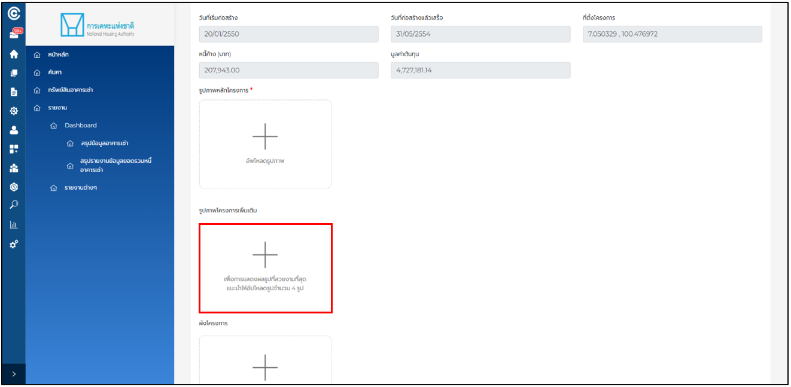<figcaption>
<strong>รูปภาพที่ 16</strong> หน้าจอแก้ไขข้อมูลโครงการ - รูปภาพโครงการเพิ่มเติม
</figcaption></figure>

เพิ่ม “รูปภาพผังโครงการ” โดยคลิกที่ปุ่ม “+ เพื่อการแสดงผลรูปที่สวยงามที่สุดแนะนำให้อัปโหลดรูปจำนวน 4 รูป”

<figure>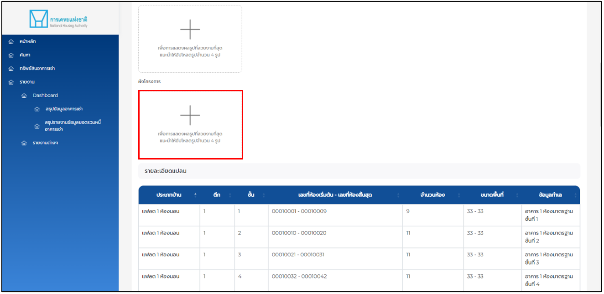<figcaption>
<strong>รูปภาพที่ 17</strong> หน้าจอแก้ไขข้อมูลโครงการ - ผังโครงการ
</figcaption></figure>

#### 2.1.5 ตัวกรองรายละเอียดห้อง

ค้นหา “รายละเอียดห้อง” โดยคลิกที่ปุ่ม “ตัวกรอง”

<figure>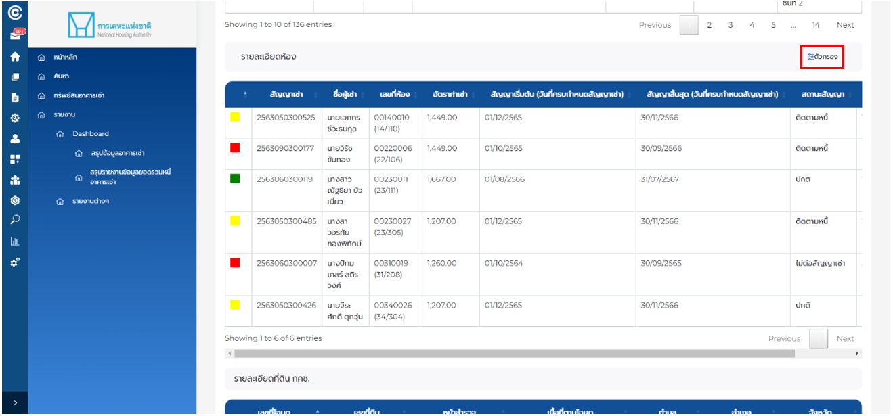<figcaption>
<strong>รูปภาพที่ 18</strong> หน้าจอแก้ไขข้อมูลโครงการ – ปุ่มตัวกรอง
</figcaption></figure>

<figure>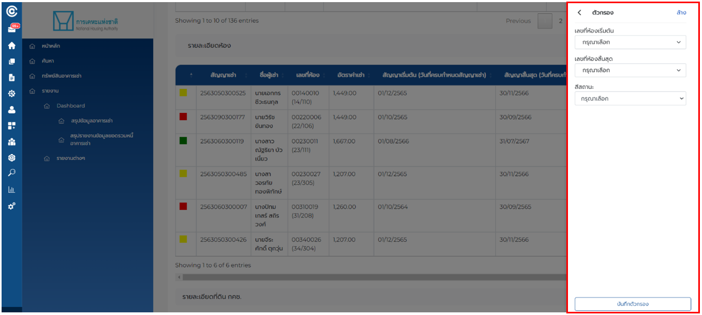<figcaption>
<strong>รูปภาพที่ 19</strong> แก้ไขข้อมูลโครงการ - หน้าต่างป๊อบอัพ (Pop-up) ตัวกรอง
</figcaption></figure>

เลือกข้อมูลที่ต้องการกรอง จากนั้นคลิกปุ่ม “บันทึกตัวกรอง” ระบบกรองข้อมูลตามเงื่อนไขที่ระบุ

<figure>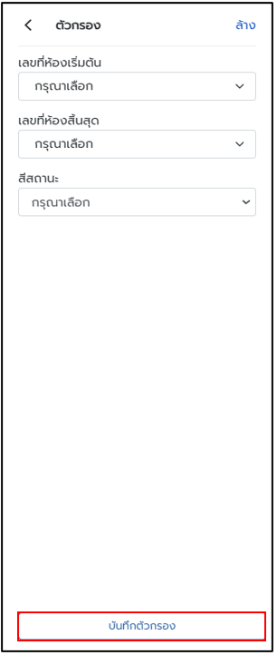<figcaption>
<strong>รูปภาพที่ 20</strong> หน้าค้นหารายละเอียดห้อง – ปุ่มบันทึกตัวกรอง
</figcaption></figure>

คลิกที่ “ล้าง” เพื่อล้างข้อมูลที่เลือกได้

<figure>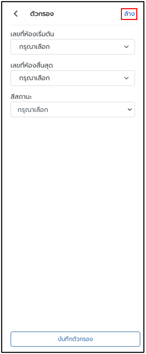<figcaption>
<strong>รูปภาพที่ 21</strong> หน้าจอค้นหารายละเอียดห้อง – ปุ่มล้างตัวกรอง
</figcaption></figure>

คลิกปุ่ม “<” เพื่อปิดตัวกรอง

<figure>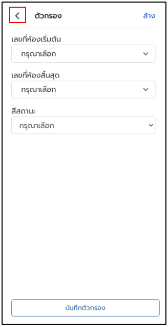<figcaption>
<strong>รูปภาพที่ 22</strong> หน้าจอค้นหารายละเอียดห้อง – ปุ่มปิดตัวกรอง
</figcaption></figure>

#### 2.1.6 รายการที่ดิน

เพิ่มรายการที่ดิน โดยกรอกข้อมูลรายละเอียดรายการที่ดิน และคลิกไอคอน “เครื่องหมายถูก”

<figure>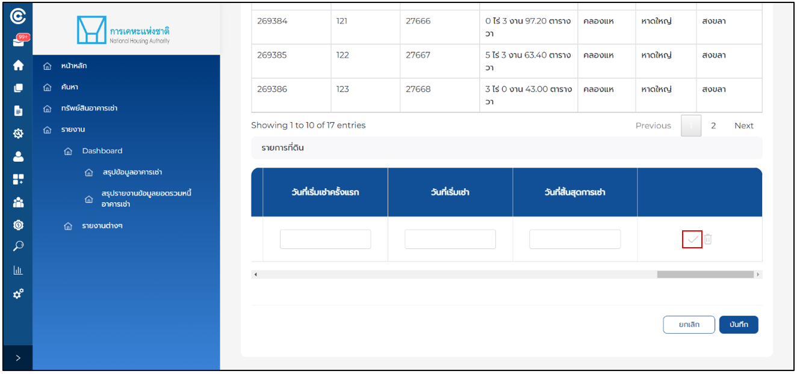<figcaption>
<strong>รูปภาพที่ 23</strong> หน้าจอแก้ไขข้อมูลโครงการ - ปุ่มเพิ่มรายการที่ดิน
</figcaption></figure>

ลบรายการรายละเอียดที่ดิน โดยคลิกไอคอน “ถังขยะ”

<figure><figcaption>
<strong>รูปภาพที่ 24</strong> แก้ไขข้อมูลโครงการ – ปุ่มลบรายการที่ดิน
</figcaption></figure>

บันทึกการแก้ไขข้อมูลโครงการ โดยคลิกที่ปุ่ม “บันทึก”

<figure><figcaption>
<strong>รูปภาพที่ 25</strong> แก้ไขข้อมูลโครงการ – ปุ่มบันทึก
</figcaption></figure>

ยกเลิกการแก้ไขข้อมูลโครงการ โดยคลิกที่ปุ่ม “ยกเลิก”

<figure>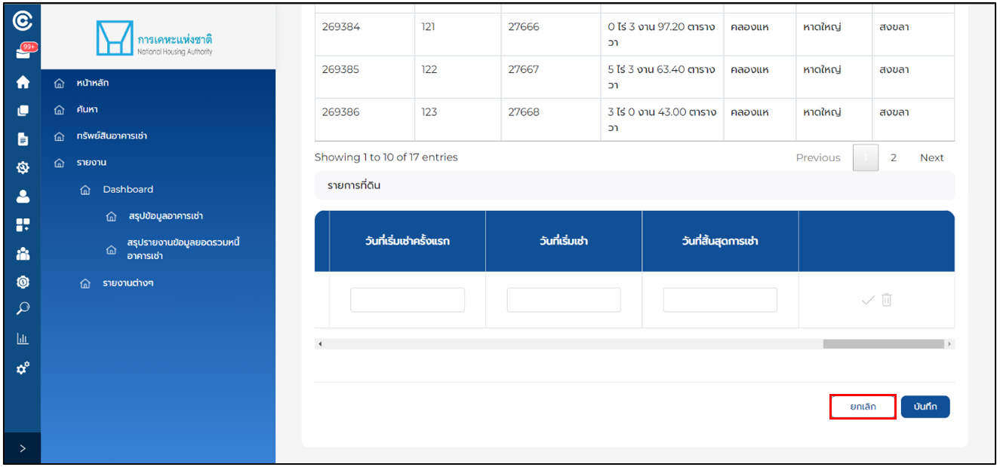<figcaption>
<strong>รูปภาพที่ 26</strong> แก้ไขข้อมูลโครงการ - ปุ่มยกเลิก
</figcaption></figure>

### 2.2 ค้นหาข้อมูลโครงการ เอกชน

คลิกปุ่ม “เข้าไปค้นหา” เพื่อเข้าไปค้นหาข้อมูลโครงการ เอกชน

<figure>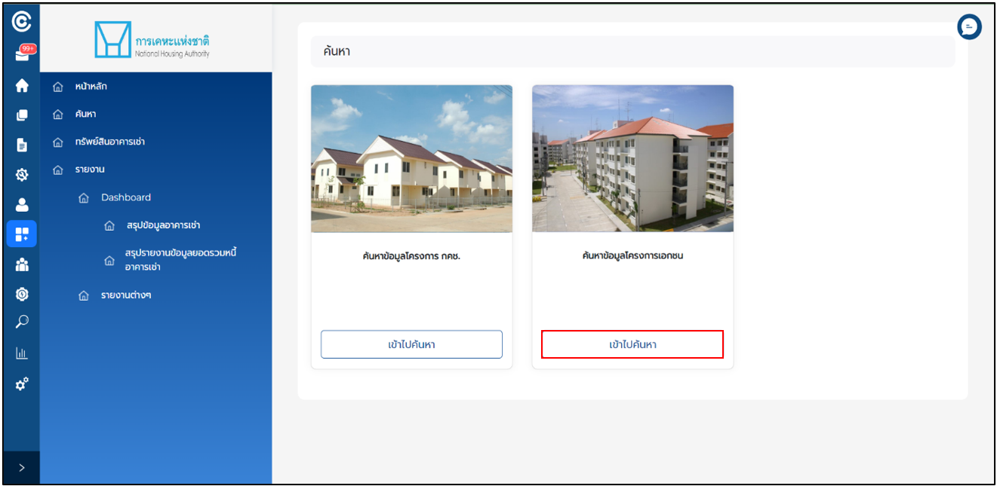<figcaption>
<strong>รูปภาพที่ 27</strong> หน้าจอค้นหาโครงการเอกชน
</figcaption></figure>

#### 2.2.1 ค้นหาโครงการเอกชน

ค้นหาโครงการเอกชน โดยกรอกข้อมูลที่โดยกรอกข้อมูลที่กล่องค้นหาโครงการและคลิกปุ่ม “ตกลง”

<figure>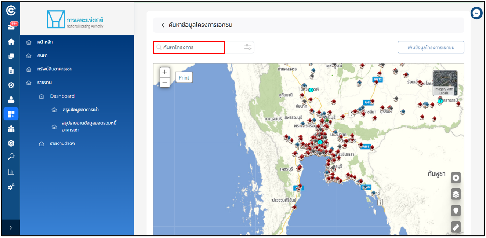<figcaption>
<strong>รูปภาพที่ 28</strong> หน้าจอค้นหาโครงการเอกชน – ช่องค้นหาโครงการ
</figcaption></figure>

#### 2.2.2 ตัวกรองโครงการ

คลิกปุ่ม “ตัวกรอง” ระบบแสดงหน้าต่างป๊อบอัพ (Pop-up) ตัวกรอง

<figure>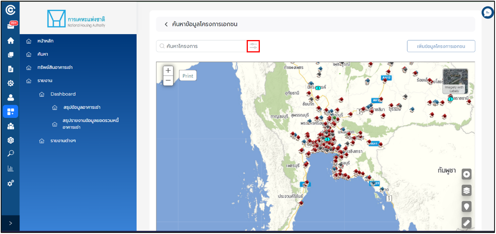<figcaption>
<strong>รูปภาพที่ 29</strong> หน้าจอค้นหาโครงการเอกชน - หน้าต่างป๊อบอัพ (Pop-up) ตัวกรอง
</figcaption></figure>

<figure>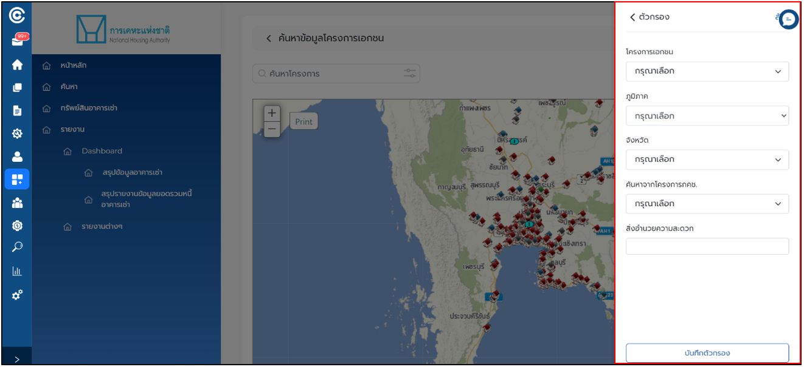<figcaption>
<strong>รูปภาพที่ 30</strong> หน้าจอค้นหาโครงการเอกชน - ปุ่มตัวกรอง
</figcaption></figure>

เลือกข้อมูลที่ต้องการกรอง จากนั้นคลิกปุ่ม “บันทึกตัวกรอง” ระบบจะกรองข้อมูลตามเงื่อนไขที่ระบุ

<figure>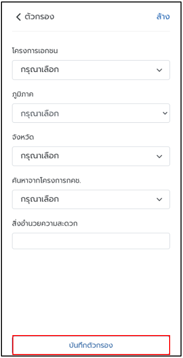<figcaption>
<strong>รูปภาพที่ 31</strong> หน้าจอค้นหาโครงการเอกชน – ปุ่มบันทึกตัวกรอง
</figcaption></figure>

คลิกที่ “ล้าง” เพื่อล้างข้อมูลที่เลือก

<figure>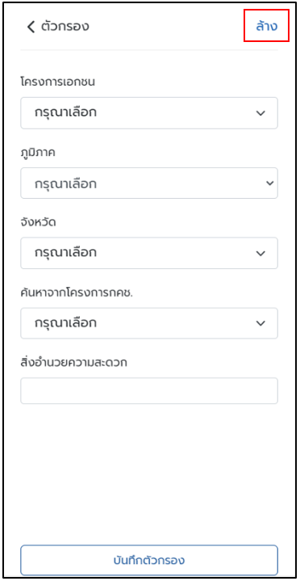<figcaption>
<strong>รูปภาพที่ 32</strong> หน้าจอค้นหาโครงการเอกชน – ปุ่มล้างตัวกรอง
</figcaption></figure>

คลิกปุ่ม “<” เพื่อปิดตัวกรอง

<figure>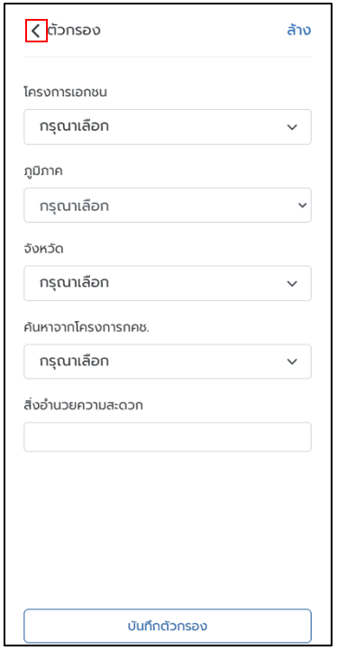<figcaption>
<strong>รูปภาพที่ 33</strong> หน้าจอค้นหาโครงการเอกชน – ปุ่มย้อนกลับ
</figcaption></figure>

คลิกปุ่ม “เปลี่ยนตัวกรอง” เพื่อเปลี่ยนข้อมูลการค้นหาโครงการ

<figure>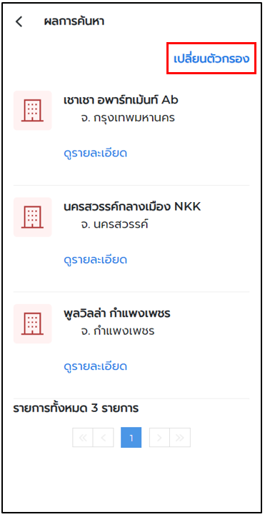<figcaption>
<strong>รูปภาพที่ 34</strong> หน้าจอค้นหาโครงการเอกชน – ปุ่มเปลี่ยนตัวกรอง
</figcaption></figure>

#### 2.2.3 ดูรายละเอียดโครงการ

คลิกปุ่ม “ดูรายละเอียด” เพื่อดูข้อมูลรายละเอียดของโครงการ

<figure><figcaption>
<strong>รูปภาพที่ 35</strong> หน้าจอดูรายละเอียดโครงการเอกชน
</figcaption></figure>

ผู้ใช้งานสามารถคลิกปุ่ม “แสดงแผนที่” เพื่อดูแผนที่โครงการได้

<figure>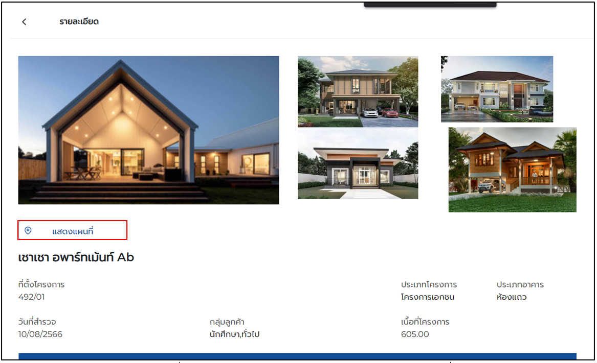<figcaption>
<strong>รูปภาพที่ 36</strong> หน้าจอดูรายละเอียดโครงการเอกชน - ปุ่มแสดงแผนที่
</figcaption></figure>

#### 2.2.4 การแก้ไขโครงการ

ผู้ใช้งานสามารถคลิกปุ่ม “แก้ไข” เพื่อแก้ไขโครงการได้

<figure>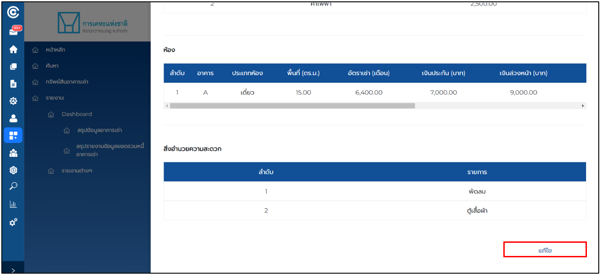<figcaption>
<strong>รูปภาพที่ 37</strong> หน้าจอดูรายละเอียดโครงการเอกชน – ปุ่มแก้ไข
</figcaption></figure>

เพิ่ม “รูปภาพหลัก” โครงการโดยคลิกที่ปุ่ม “+ อัปโหลดรูปภาพ”

<figure>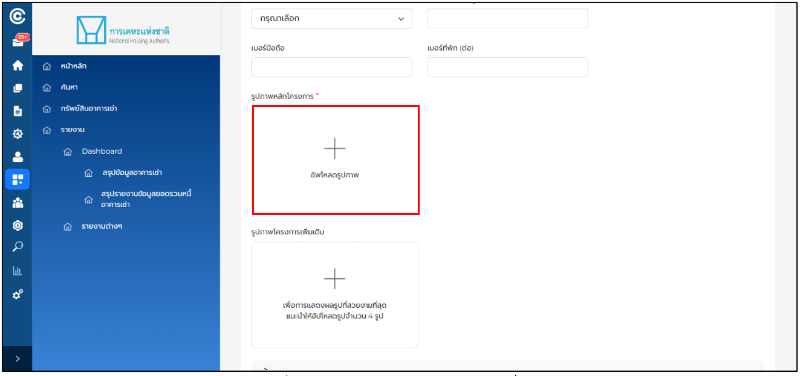<figcaption>
<strong>รูปภาพที่ 38</strong> หน้าจอแก้ไขข้อมูลโครงการ - เพิ่มรูปภาพหลัก
</figcaption></figure>

เพิ่ม“รูปภาพโครงการเพิ่มเติม” โดยคลิกที่ปุ่ม “+ เพื่อการแสดงผลรูปที่สวยงามที่สุดแนะนำให้อัปโหลดรูปจำนวน 4 รูป”

<figure>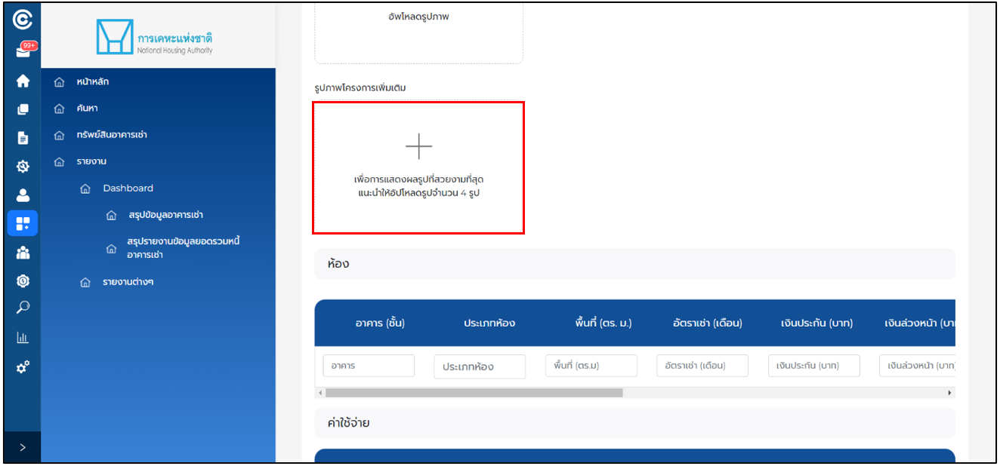<figcaption>
<strong>รูปภาพที่ 39</strong> หน้าจอแก้ไขโครงการ – เพิ่มรูปภาพโครงการเพิ่มเติม
</figcaption></figure>

#### 2.2.5 รายการค่าใช้จ่าย

เพิ่มค่าใช้จ่าย โดยคลิกที่ไอคอนดินสอ

<figure><figcaption>
<strong>รูปภาพที่ 40</strong> หน้าจอแก้ไขโครงการ - ปุ่มแก้ไขค่าใช้จ่าย
</figcaption></figure>

ลบค่าใช้จ่าย โดยคลิกที่ไอคอนถังขยะ

<figure>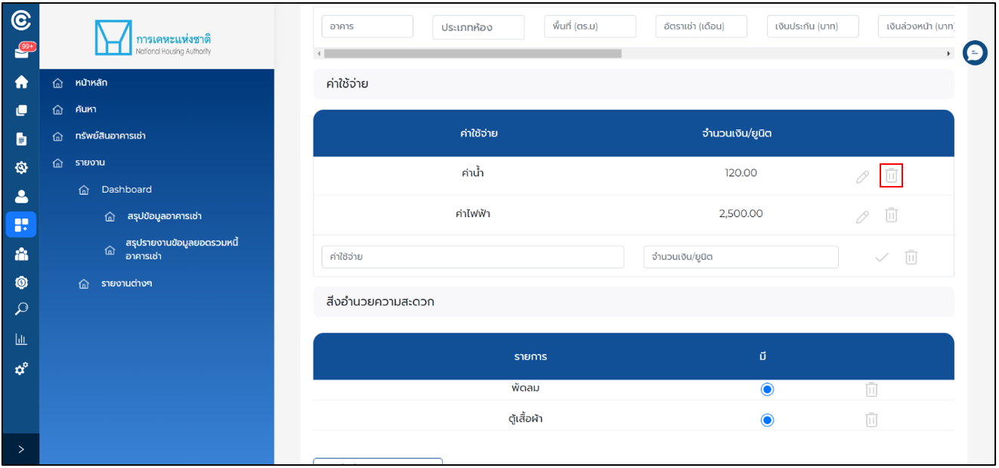<figcaption>
<strong>รูปภาพที่ 41</strong> หน้าจอแก้ไขโครงการ – ปุ่มลบค่าใช้จ่าย
</figcaption></figure>

#### 2.2.6 รายการสิ่งอำนวยความสะดวก

เพิ่มสิ่งอำนวยความสะดวก โดยคลิกปุ่ม “เพิ่มสิ่งอำนวยความสะดวก”

<figure>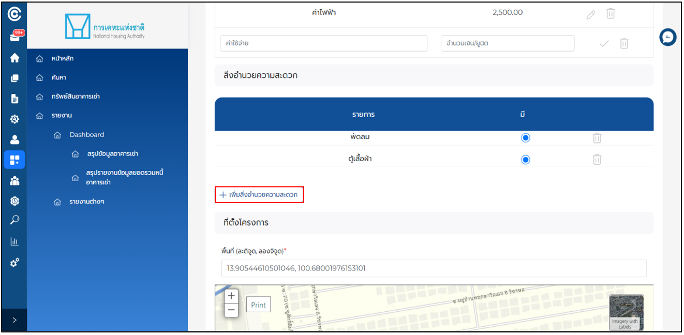<figcaption>
<strong>รูปภาพที่ 42</strong> หน้าจอแก้ไขโครงการ – ปุ่มเพิ่มสิ่งอำนวยความสะดวก
</figcaption></figure>

ลบสิ่งอำนวยความสะดวก โดยคลิกไอคอนถังขยะ

<figure><figcaption>
<strong>รูปภาพที่ 43</strong> หน้าจอแก้ไขโครงการ – ปุ่มลบสิ่งอำนวยความสะดวก
</figcaption></figure>

บันทึกการแก้ไขโครงการ โดยคลิกปุ่ม “บันทึก”

<figure>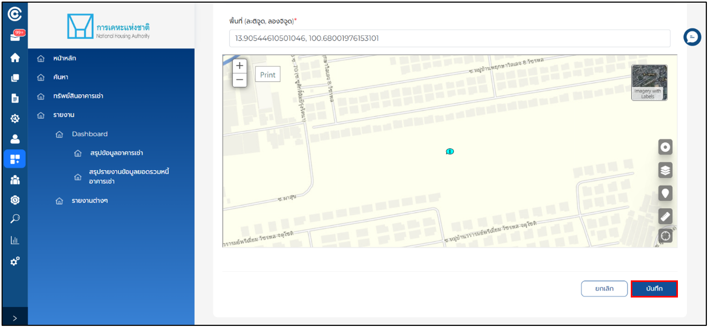<figcaption>
<strong>รูปภาพที่ 44</strong> หน้าจอแก้ไขโครงการ - ปุ่มบันทึก
</figcaption></figure>

ยกเลิกการแก้ไขโครงการ โดยคลิกปุ่ม “ยกเลิก”

<figure>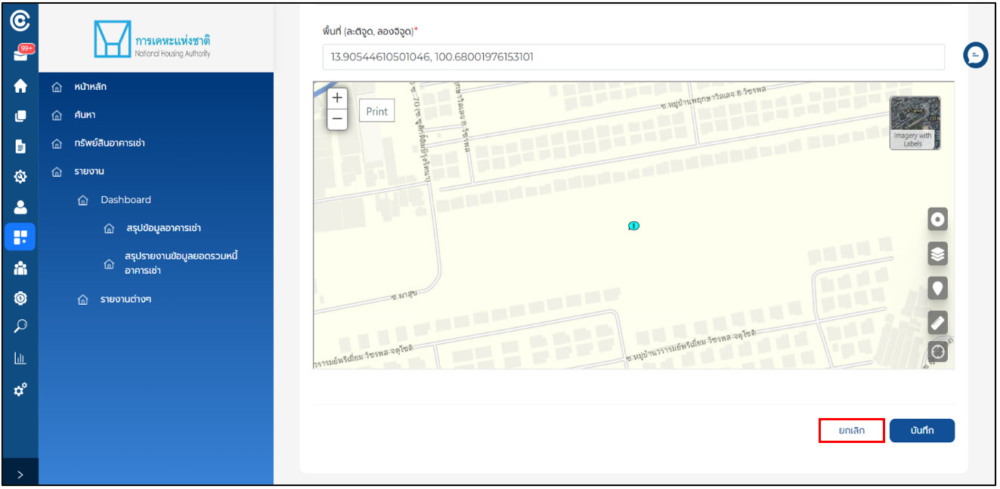<figcaption>
<strong>รูปภาพที่ 45</strong> หน้าจอแก้ไขโครงการ – ปุ่มยกเลิก
</figcaption></figure>

#### 2.2.7 การเพิ่มข้อมูลโครงการเอกชน

คลิกที่ไอคอนแผนที่

<figure><figcaption>
<strong>รูปภาพที่ 46</strong> เพิ่มข้อมูลโครงการเอกชน – ไอคอนแผนที่
</figcaption></figure>

คลิกปุ่ม “ยืนยัน” เพื่อยืนยันตำแหน่ง

<figure><figcaption>
<strong>รูปภาพที่ 47</strong> เพิ่มข้อมูลโครงการเอกชน – ปุ่มยืนยัน
</figcaption></figure>

คลิกปุ่ม “เพิ่มข้อมูลโครงการเอกชน”

<figure>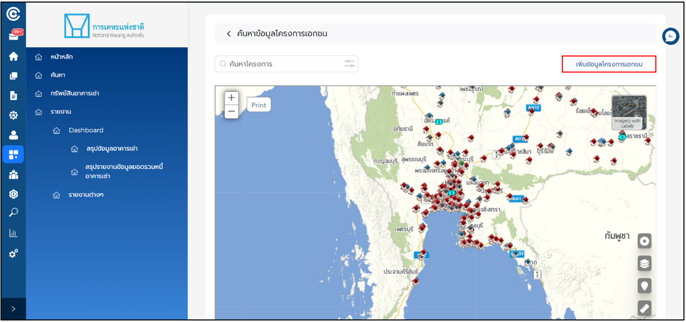<figcaption>
<strong>รูปภาพที่ 48</strong> เพิ่มข้อมูลโครงการเอกชน – ปุ่มเพิ่มข้อมูลโครงการ
</figcaption></figure>

คลิกปุ่ม “บันทึก” เมื่อผู้ใช้งานกรอกข้อมูลครบถ้วน

<figure>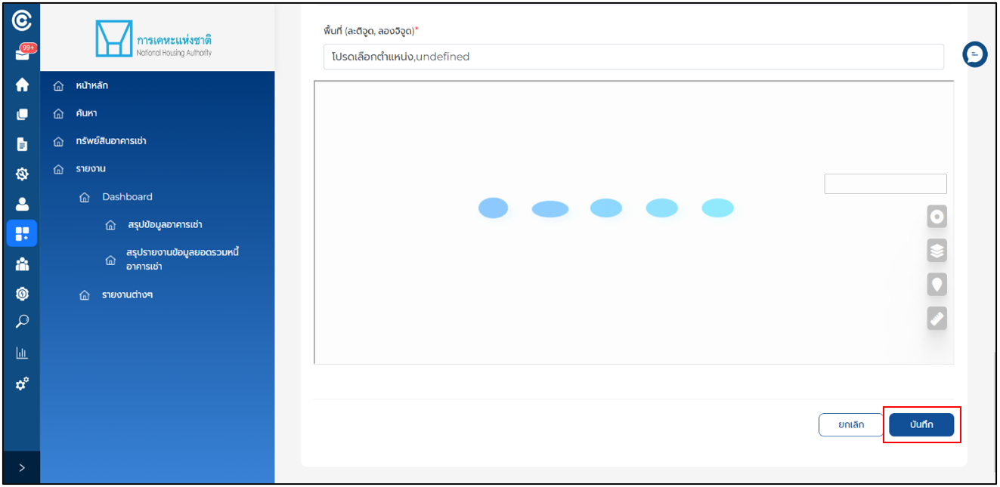<figcaption>
<strong>รูปภาพที่ 49</strong> เพิ่มข้อมูลโครงการเอกชน – ปุ่มบันทึก
</figcaption></figure>

คลิกปุ่ม “ยกเลิก” เมื่อผู้ใช้งานไม่ต้องการเพิ่มข้อมูลโครงการเอกชน

<figure>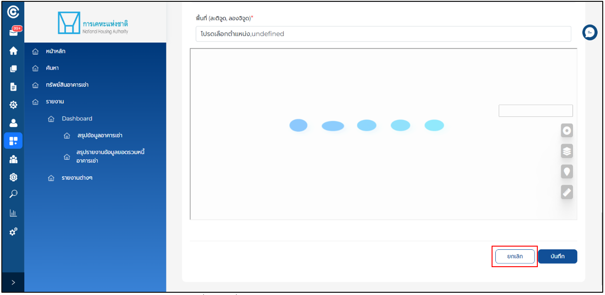<figcaption>
<strong>รูปภาพที่ 50</strong> เพิ่มข้อมูลโครงการเอกชน - ปุ่มยกเลิก
</figcaption></figure>

## บทที่ 3 การใช้งานในส่วนของทรัพย์สินอาคารเช่า

คลิกเมนู “ทรัพย์สินอาคารเช่า” เพื่อเข้าสู่หน้าทรัพย์สินอาคารเช่า

<figure>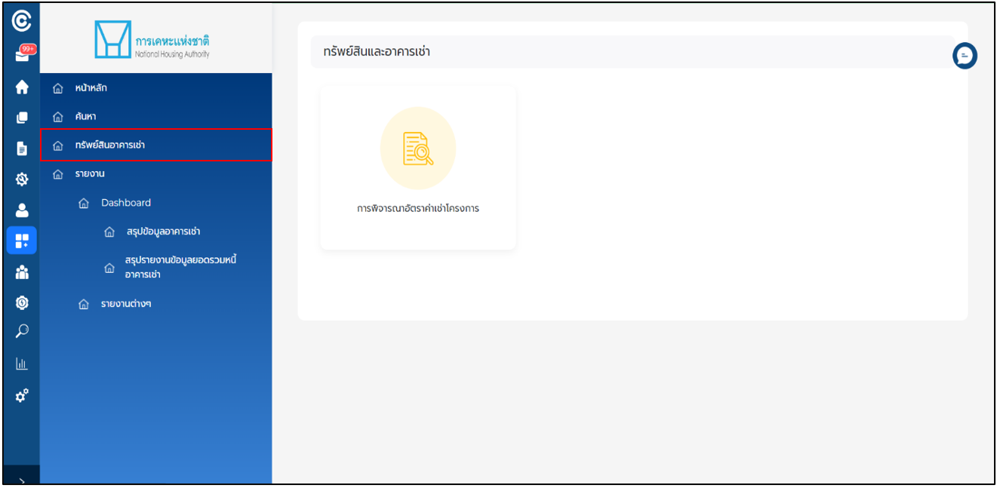<figcaption>
<strong>รูปภาพที่ 51</strong> หน้าจอทรัพย์สินอาคารเช่า
</figcaption></figure>

<figure>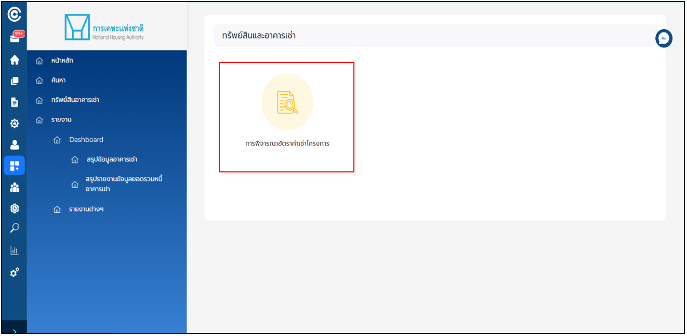<figcaption>
<strong>รูปภาพที่ 52</strong> หน้าจอทรัพย์สินอาคารเช่า – การพิจารณาอัตราค่าเช่า
</figcaption></figure>

### 3.1 ค้นหาโครงการการพิจารณาอัตราค่าโดยสาร

ค้นหาโครงการการพิจารณาอัตราค่าโดยสาร โดยกรอกข้อมูลที่ กล่องค้นหาข้อมูล และคลิกปุ่มตกลง

<figure>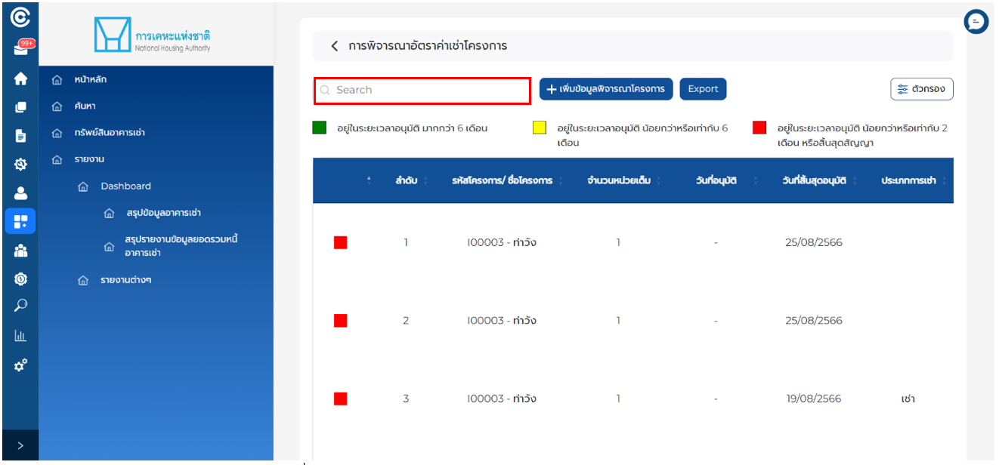<figcaption>
<strong>รูปภาพที่ 53</strong> หน้าจอพิจารณาอัตราค่าโดยสาร - ค้นหาโครงการ
</figcaption></figure>

#### 3.1.1 ออกรายงานหน้าจอพิจารณาอัตราค่าโดยสาร

ออกรายงานหน้าจอพิจารณาอัตราค่าโดยสาร โดยคลิกปุ่ม “Export” เพื่อออกรายงาน

<figure>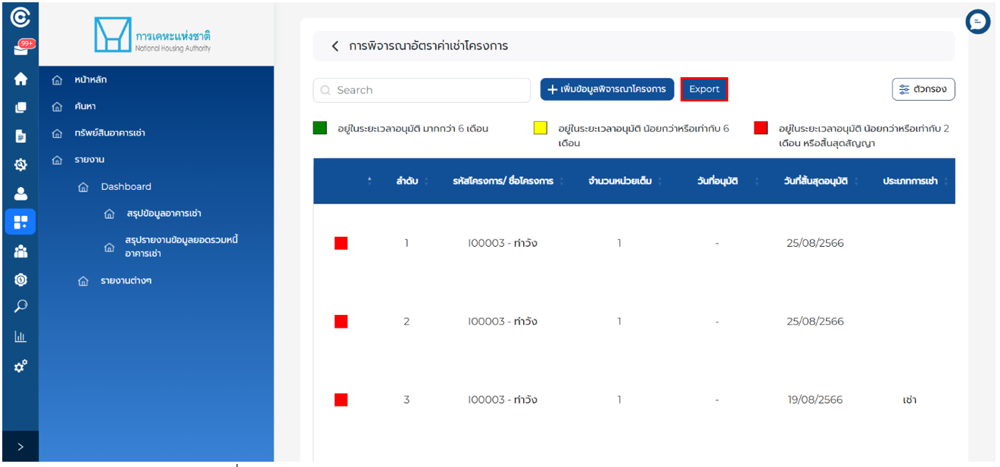<figcaption>
<strong>รูปภาพที่ 54</strong> หน้าจอพิจารณาอัตราค่าโดยสาร – ออกรายงานพิจารณาอัตราค่าโดยสาร
</figcaption></figure>

#### 3.1.2 ตัวกรองโครงการ

คลิกปุ่ม “ตัวกรอง” ระบบแสดงหน้าต่างป๊อบอัพ (Pop-up) ตัวกรอง

<figure>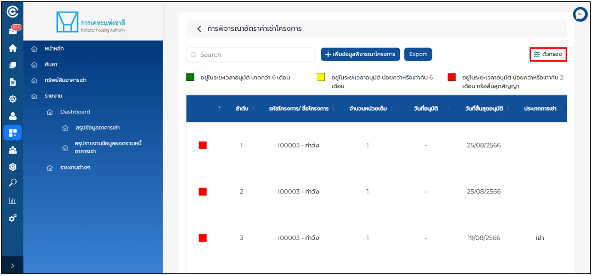<figcaption>
<strong>รูปภาพที่ 55</strong> หน้าจอพิจารณาอัตราค่าโดยสาร – ปุ่มตัวกรอง
</figcaption></figure>

<figure>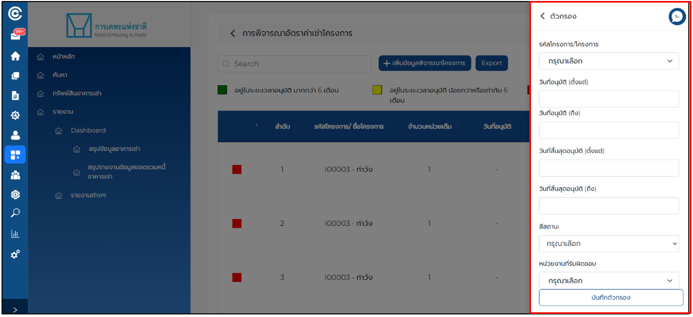<figcaption>
<strong>รูปภาพที่ 56</strong> หน้าจอพิจารณาอัตราค่าโดยสาร – หน้าต่างป๊อบอัพ (Pop-up) ตัวกรอง
</figcaption></figure>

เลือกข้อมูลที่ต้องการกรอง จากนั้นคลิกปุ่ม “บันทึกตัวกรอง” ระบบกรองข้อมูลตามเงื่อนไขที่ระบุ

<figure>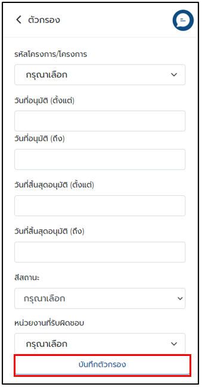<figcaption>
<strong>รูปภาพที่ 57</strong> หน้าจอค้นหาโครงการ – ปุ่มบันทึกตัวกรอง
</figcaption></figure>

คลิกที่ “ล้าง” เพื่อล้างข้อมูลที่เลือก

<figure>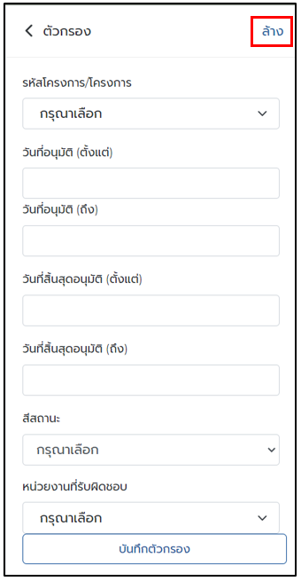<figcaption>
<strong>รูปภาพที่ 58</strong> หน้าจอค้นหาโครงการ – ปุ่มล้างตัวกรอง
</figcaption></figure>

คลิกปุ่ม “<” เพื่อปิดตัวกรอง

<figure>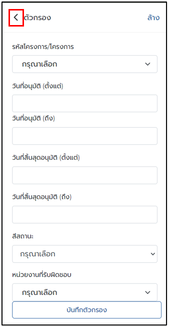<figcaption>
<strong>รูปภาพที่ 59</strong> หน้าจอค้นหาโครงการ – ปิดตัวกรอง
</figcaption></figure>

#### 3.1.3 เพิ่มข้อมูลพิจารณาโครงการ

เพิ่มข้อมูลพิจารณาโครงการ โดยคลิกปุ่ม “เพิ่มข้อมูลพิจารณาโครงการ”

<figure>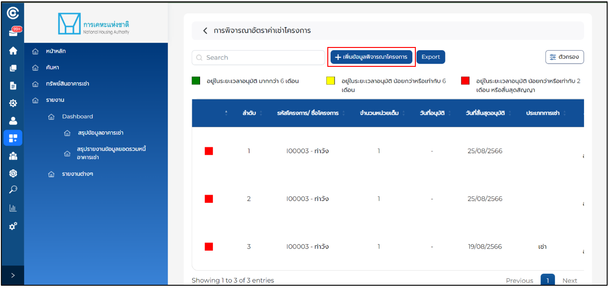<figcaption>
<strong>รูปภาพที่ 60</strong> หน้าจอการพิจารณาอัตราค่าเช่าโครงการ – เพิ่มข้อมูลพิจารณาโครงการ
</figcaption></figure>

เมื่อผู้ใช้งานกรอกข้อมูลแล้ว ต้องการเพิ่มไฟล์เอกสาร สามารถเพิ่มไฟล์เอกสารได้ โดยคลิกปุ่ม “แนบไฟล์เอกสาร”

<figure>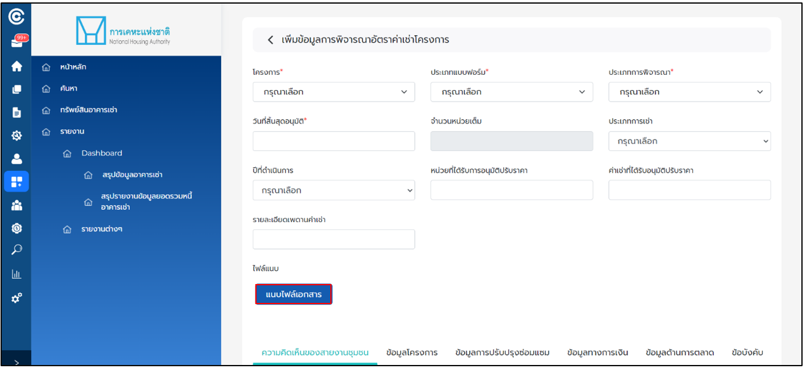<figcaption>
<strong>รูปภาพที่ 61</strong> เพิ่มข้อมูลพิจารณาโครงการ - แนบไฟล์เอกสาร
</figcaption></figure>

คลิกปุ่ม “ย้อนกลับ” เพื่อกลับไปยังหน้าก่อนหน้า

<figure><figcaption>
<strong>รูปภาพที่ 62</strong> เพิ่มข้อมูลพิจารณาโครงการ - ปุ่มย้อนกลับ
</figcaption></figure>

ไปหน้าถัดไป โดยคลิกปุ่ม “ถัดไป”

<figure><figcaption>
<strong>รูปภาพที่ 63</strong> เพิ่มข้อมูลพิจารณาโครงการ – ปุ่มถัดไป
</figcaption></figure>

ยกเลิกการเพิ่มข้อมูลพิจารณาโครงการ คลิกปุ่ม “ยกเลิก”

<figure><figcaption>
<strong>รูปภาพที่ 64</strong> เพิ่มข้อมูลพิจารณาโครงการ – ปุ่มยกเลิก
</figcaption></figure>

บันทึกร่างข้อมูลที่ทำการกรอกไว้ คลิกปุ่ม “บันทึกร่าง”

<figure><figcaption>
<strong>รูปภาพที่ 65</strong> เพิ่มข้อมูลพิจารณาโครงการ – ปุ่มบันทึกร่าง
</figcaption></figure>

บันทึกข้อมูลพิจารณาโครงการ คลิกปุ่ม “บันทึก”

<figure>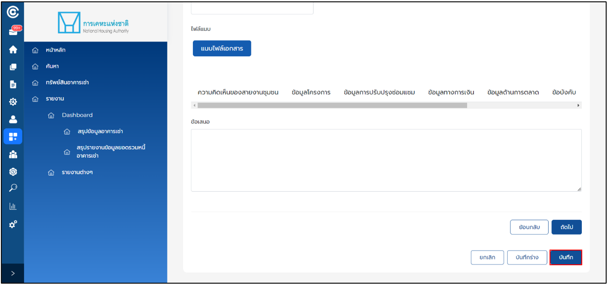<figcaption>
<strong>รูปภาพที่ 66</strong> เพิ่มข้อมูลพิจารณาโครงการ – ปุ่มบันทึก
</figcaption></figure>

## บทที่ 4 รายงาน

### 4.1 หน้าจอสรุปข้อมูลอาคารเช่า

#### 4.1.1 ชช.ทั้งหมด

ผู้ใช้งานสามารถดูสรุปข้อมูลอาคารเช่าได้ โดยคลิกปุ่ม “ชช.ทั้งหมด” เพื่อค้นหาฝ่ายที่ต้องการดู

<figure><figcaption>
<strong>รูปภาพที่ 67</strong> หน้าจอสรูปข้อมูลอาคารเช่า – ปุ่ม ชช.ทั้งหมด
</figcaption></figure>

#### 4.1.2 สคจ./สคล.ทั้งหมด

ผู้ใช้งานสามารถดูสรุปข้อมูลอาคารเช่าได้ โดยคลิกปุ่ม “สคจ./สคล.ทั้งหมด” เพื่อค้นหาสำนักงานที่ต้องการ

<figure><figcaption>
<strong>รูปภาพที่ 68</strong> หน้าจอสรุปข้อมูลอาคารเช่า - สคจ./สคล.ทั้งหมด
</figcaption></figure>

#### 4.1.3 โครงการทั้งหมด

ผู้ใช้งานสามารถดูสรุปข้อมูลอาคารเช่าได้ โดยคลิกปุ่ม “โครงการทั้งหมด” เพื่อค้นหาโครงการที่ต้องการ

<figure><figcaption>
<strong>รูปภาพที่ 69</strong> หน้าจอสรุปข้อมูลอาคารเช่า – โครงการทั้งหมด
</figcaption></figure>

### 4.2 สรุปรายงานข้อมูลยอดรวมหนี้อาคารเช่า

ผู้ใช้งานสามารถดูสรุปรายงานข้อมูลยอดรวมหนี้อาคารเช่าได้

<figure><figcaption>
<strong>รูปภาพที่ 70</strong> หน้าจอสรุปข้อมูลอาคารเช่า – สรุปรายงานข้อมูลยอดรวมหนี้อาคารเช่า
</figcaption></figure>

## บทที่ 5 รายงานต่าง ๆ

ผู้ใช้งานสามารถเลือกดูรายงานต่าง ๆ ได้ที่เมนู “รายงานต่างๆ”

<figure>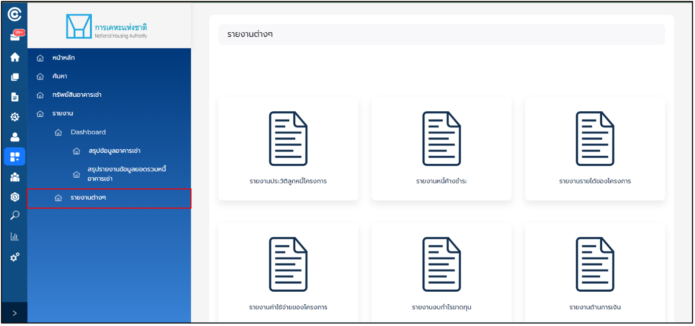<figcaption>
<strong>รูปภาพที่ 71</strong> หน้าจอรายงานต่าง ๆ
</figcaption></figure>

ผู้ใช้งานสามารถคลิกที่รายงานที่ต้องการดูได้

<figure>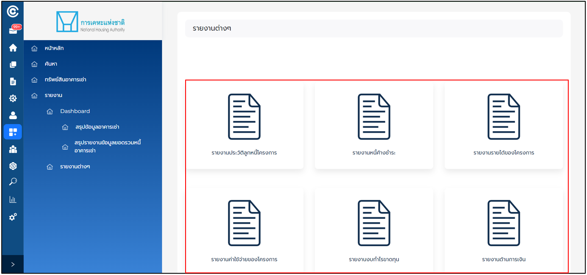<figcaption>
<strong>รูปภาพที่ 72</strong> หน้าจอรายงานต่าง ๆ - รายงานต่าง ๆ
</figcaption></figure>

ผู้ใช้งานกรอกข้อมูลที่ต้องการและสามารถคลิกปุ่ม “ส่งออกเอกสาร” เพื่อส่งออกรายงานได้

<figure>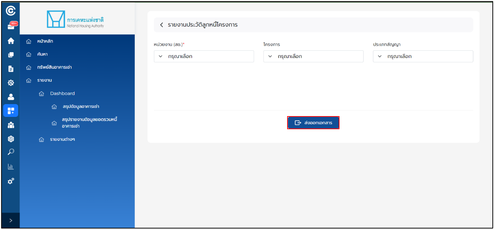<figcaption>
<strong>รูปภาพที่ 73</strong> หน้าจอรายงานต่าง ๆ - ส่งออกเอกสาร
</figcaption></figure>
