# เจ้าหน้าที่ (Back Office)

## บทที่ 1 หน้าหลัก

เข้าใช้งานระบบที่ คลิกที่เมนู “แอปพลิเคชันของฉัน” จากนั้นคลิก “Back Office”

ระบบจะแสดงหน้า Back office ผู้ใช้งานสามารถจัดการข้อมูลต่างๆได้ โดยมีหัวข้อดังต่อไปนี้

* จองบ้าน
* ลงทะเบียนความสนใจโครงการ
* ข้อมูลติดต่อจากผู้ใช้งาน
* ข่าวสาร
* ข้อมูลในโครงการ
* Market Place
* สิทธิประโยชน์และคูปอง
* คะแนน
* Event
* ใบแจ้งหนี้/ใบเสร็จรับเงิน

.png>)

## **บทที่ 2 การใช้งานในส่วนของการจัดการการจองบ้าน**

หัวข้อต่อไปนี้จะอธิบายถึงการใช้งานในส่วนของการจัดการการจองบ้าน

### 2.1 ตั้งค่าโครงการแนะนำ

ไปที่เมนูจองบ้าน จากนั้นคลิก “ตั้งค่าโครงการแนะนำ”

.png>)

#### **2.1.1 การค้นหาโครงการ**

ผู้ใช้งานสามารถระบุโครงการที่ต้องการค้นหา จากนั้นคลิกบริเวณอื่นเพื่อให้ระบบค้นหาข้อมูล

.png>)

#### **2.1.2 การเพิ่มโครงการแนะนำ**

คลิกปุ่ม “โครงการแนะนำ”

.png>)

ระบบจะแสดงหน้าจอโครงการแนะนำ ผู้ใช้งานเลือกโครงการที่ต้องการแนะนำ

.png>)

คลิกปุ่ม “บันทึก”

.png>)

#### **2.1.3 การลบโครงการแนะนำ**

คลิกไอคอน ถังขยะ ระบบจะทำการลบรายการออกจากโครงการแนะนำ

.png>)

### 2.2 ตั้งค่าจองบ้าน

ไปที่เมนูจองบ้าน จากนั้นคลิก “ตั้งค่าจองบ้าน”

.png>)

ผู้ใช้งานสามารถตั้งค่าข้อมูลต่าง ๆ ได้ ดังนี้

* ตั้งค่าเงื่อนไขการจองบ้าน
* ตั้งค่าจำนวนสูงสุดในการจองบ้าน
* ตั้งค่าการแสดงผลในใบจอง

.png>)

เมื่อตั้งค่าข้อมูลเรียบร้อยแล้ว คลิกปุ่ม “บันทึก”

.png>)

### 2.3 ตั้งค่าเปิด/ปิดโครงการ

ไปที่เมนูจองบ้าน จากนั้นคลิก “ตั้งค่าเปิด/ปิดโครงการ”

.png>)

#### **2.3.1 การค้นหาโครงการ**

ผู้ใช้งานสามารถระบุโครงการที่ต้องการค้นหา จากนั้นคลิกบริเวณอื่นเพื่อให้ระบบค้นหาข้อมูล

.png>)

#### **2.3.2 ตัวกรองโครงการ**

คลิกปุ่ม “ตัวกรอง” ระบบจะแสดงหน้าต่างป๊อบอัพ (Pop-up) ตัวกรอง

.png>)

.png>)

เลือกข้อมูลที่ต้องการกรอง จากนั้นคลิกปุ่ม “บันทึกตัวกรอง” ระบบจะกรองข้อมูลตามเงื่อนไขที่ระบุ

.png>)

คลิกที่ “ล้าง” เพื่อล้างข้อมูลที่เลือกได้

.png>)

คลิกปุ่ม “<” เพื่อปิดตัวกรอง

.png>)

#### **2.3.3 การเพิ่มกำหนดการเปิด/ปิดโครงการ**

คลิกปุ่ม เลือกโครงการ โดยติ๊กที่ช่องแรก “+ กำหนดการเปิด/ปิดการโครงการ”

.png>)

ระบบจะแสดงหน้ากำหนดค่าระบบจองบ้าน ผู้ใช้งานสามารถเลือก ประเภทเปิด/ปิด และเลือกหมายเหตุ เมื่อเลือกเรียบร้อย คลิกปุ่ม “ตกลง” สถานะของโครงการที่เลือกไว้ ก็จะเปลี่ยนตามที่ตั้งค่า แต่หากต้องการตั้งค่าเปิด/ปิดทุกโครงการ ก็ให้คลิกปุ่ม “กำหนดการเปิด/ปิดทุกโครงการ” แล้วตั้งค่า สถานะของทุกโครงการก็จะเปลี่ยนตามที่ตั้งไว้

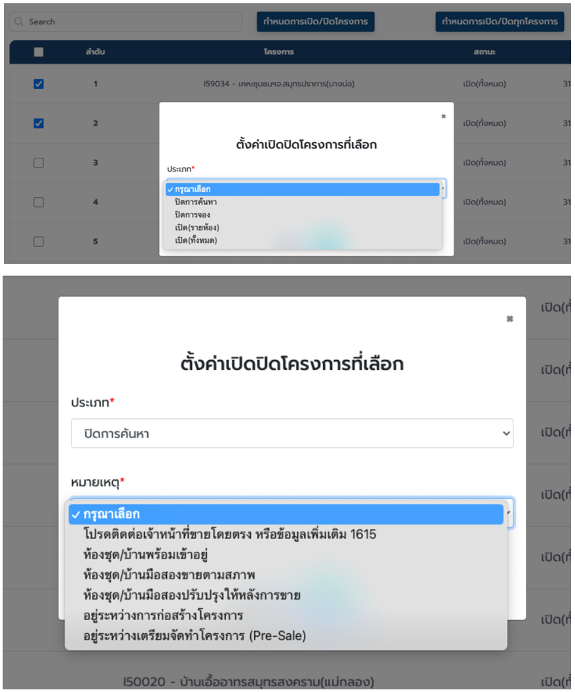

#### **2.3.4 การแก้ไขการกำหนดค่าระบบจองบ้าน**

คลิกไอคอน ดินสอ

<figure>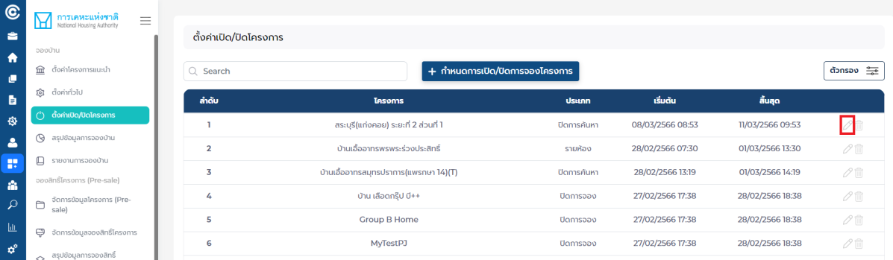<figcaption>
<strong>รูปภาพที่ 21</strong> หน้าจอการตั้งค่าเปิด/ปิดโครงการ – ปุ่มแก้ไขการกำหนดค่าระบบจองบ้าน
</figcaption></figure>

ระบบจะแสดงหน้ากำหนดค่าระบบจองบ้าน ผู้ใช้งานแก้ไขการกำหนดค่าระบบจองบ้าน จากนั้น คลิกปุ่ม “บันทึก” ระบบจะทำการแก้ไขการกำหนดค่าระบบจองบ้าน

<figure>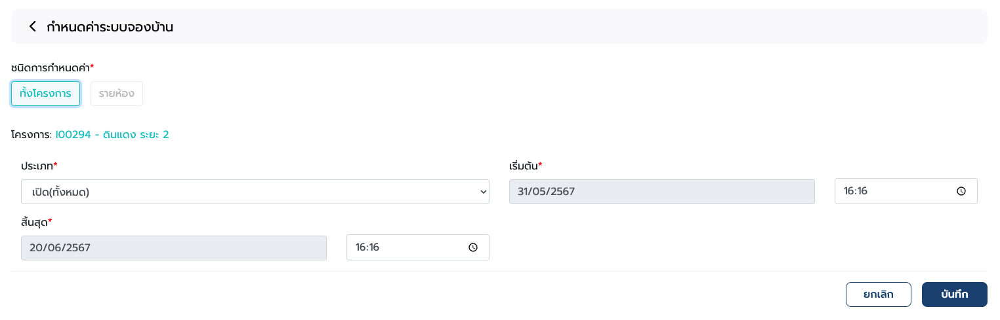<figcaption>
<strong>รูปภาพที่ 22</strong> หน้าจอการตั้งค่าเปิด/ปิดโครงการ –แก้ไขการกำหนดค่าระบบจองบ้าน
</figcaption></figure>

#### **2.3.5 การลบโครงการ**

คลิกไอคอน ถังขยะ ระบบจะทำการลบรายการออกจากระบบ

<figure>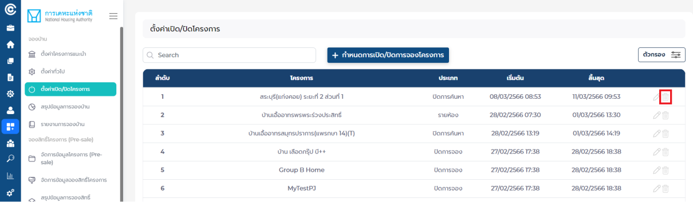<figcaption>
<strong>รูปภาพที่ 23</strong> หน้าจอการตั้งค่าเปิด/ปิดโครงการ – ลบโครงการ
</figcaption></figure>

### 2.4 สรุปข้อมูลการจองบ้าน

ไปที่เมนูจองบ้าน จากนั้นคลิก “สรุปข้อมูลการจองบ้าน”

<figure>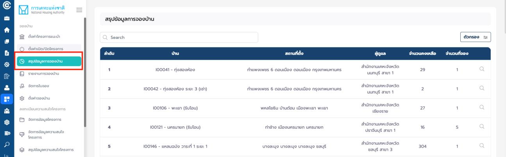<figcaption>
<strong>รูปภาพที่ 24</strong> หน้าจอสรุปข้อมูลการจองบ้าน
</figcaption></figure>

#### **2.4.1 การค้นหาโครงการ**

ผู้ใช้งานสามารถระบุโครงการที่ต้องการค้นหา จากนั้นคลิกบริเวณอื่นเพื่อให้ระบบค้นหาข้อมูล

<figure>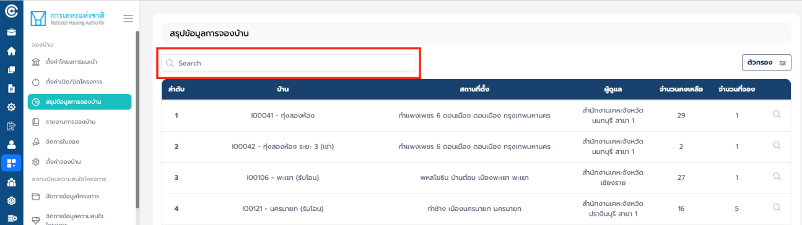<figcaption>
<strong>รูปภาพที่ 25</strong> หน้าจอสรุปข้อมูลการจองบ้าน - ช่องค้นหา
</figcaption></figure>

#### **2.4.2 ตัวกรองโครงการ**

คลิกปุ่ม “ตัวกรอง” ระบบจะแสดงหน้าต่างป๊อบอัพ (Pop-up) ตัวกรอง

<figure>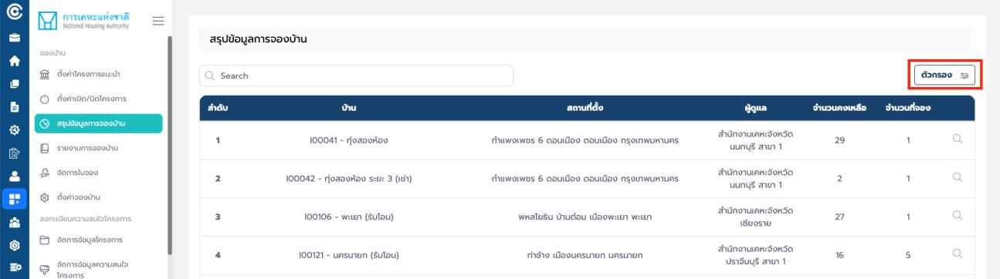<figcaption>
<strong>รูปภาพที่ 26</strong> หน้าจอสรุปข้อมูลการจองบ้าน – ปุ่มตัวกรอง
</figcaption></figure>

<figure>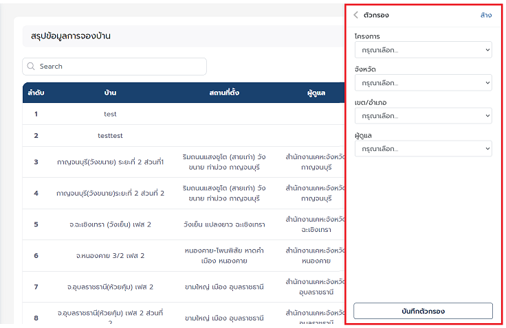<figcaption>
<strong>รูปภาพที่ 27</strong> หน้าจอสรุปข้อมูลการจองบ้าน – หน้าต่างป๊อบอัพ (Pop-up) ตัวกรอง
</figcaption></figure>

เลือกข้อมูลที่ต้องการกรอง จากนั้นคลิกปุ่ม “บันทึกตัวกรอง” ระบบจะกรองข้อมูลตามเงื่อนไขที่ระบุ

<figure><figcaption>
<strong>รูปภาพที่ 28</strong> หน้าจอสรุปข้อมูลการจองบ้าน – ตัวกรอง
</figcaption></figure>

คลิกที่ “ล้าง” เพื่อล้างข้อมูลที่เลือกได้

<figure>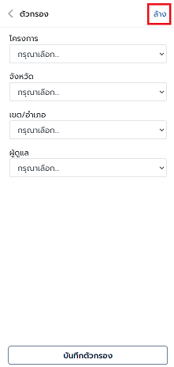<figcaption>
<strong>รูปภาพที่ 29</strong> หน้าจอสรุปข้อมูลการจองบ้าน – ปุ่มล้างตัวกรอง
</figcaption></figure>

คลิกปุ่ม “<” เพื่อปิดตัวกรอง

<figure>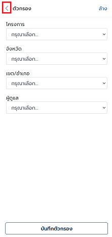<figcaption>
<strong>รูปภาพที่ 30</strong> หน้าจอสรุปข้อมูลการจองบ้าน – ปุ่มย้อนกลับเพื่อปิดตัวกรอง
</figcaption></figure>

#### **2.4.3 สรุปข้อมูลการจองบ้าน**

ผู้ใช้งานสามารถดูสรุปข้อมูลการจองบ้านได้ที่ตารางสรุปข้อมูลการจองบ้าน

<figure>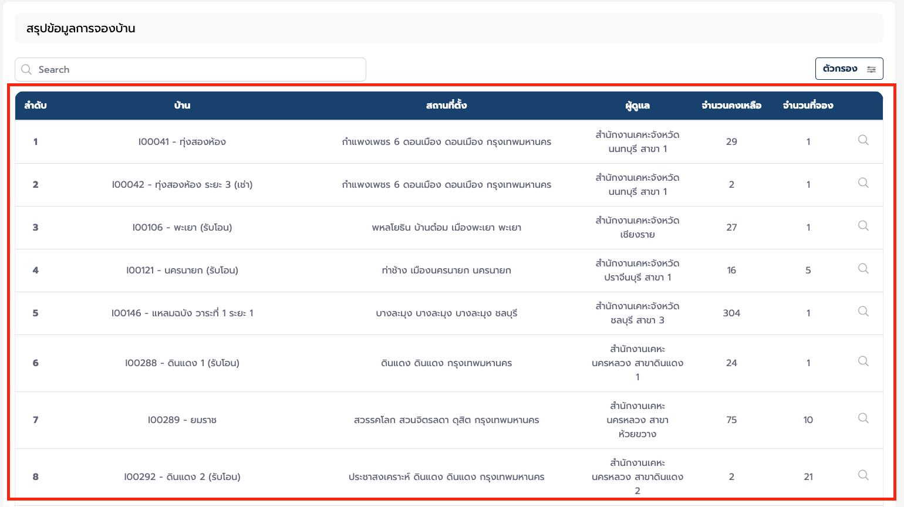<figcaption>
<strong>รูปภาพที่ 31</strong> หน้าจอสรุปข้อมูลการจองบ้าน – สรุปข้อมูลการจองบ้าน
</figcaption></figure>

ผู้ใช้งานสามารถดูรายละเอียดโครงการได้ โดยคลิกที่ไอคอน แว่นขยาย

<figure>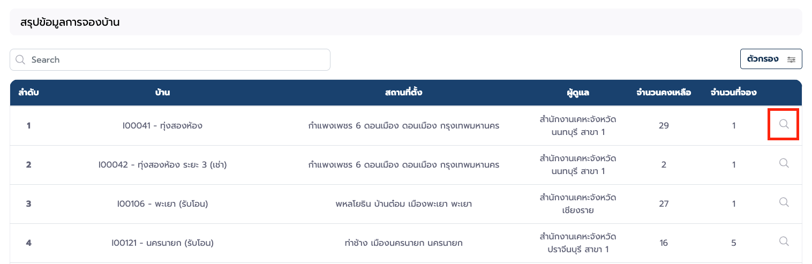<figcaption>
<strong>รูปภาพที่ 32</strong> หน้าจอสรุปข้อมูลการจองบ้าน – รายละเอียดโครงการ
</figcaption></figure>

### 2.5 รายงานการจองบ้าน

ไปที่เมนูจองบ้าน จากนั้นคลิก “รายงานการจองบ้าน”

<figure>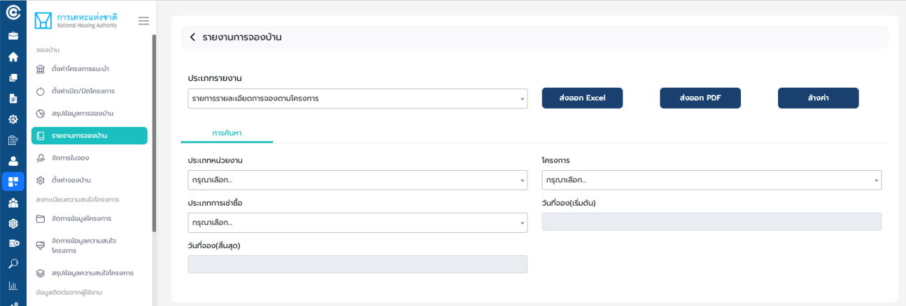<figcaption>
<strong>รูปภาพที่ 33</strong> หน้าจอรายงานการจองบ้าน
</figcaption></figure>

ผู้ใช้งานเลือกประเภทรายงาน การค้นหาเป็นไปตามเงื่อนไขการเลือกประเภทรายงาน จากนั้น คลิกปุ่ม ส่งออก “Excel”หรือ “ส่งออก PDF”

<figure>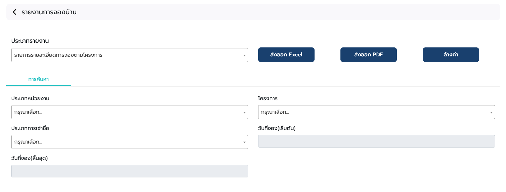<figcaption>
<strong>รูปภาพที่ 34</strong> หน้าจอออกรายงานการจองบ้าน
</figcaption></figure>

## **บทที่ 3 การใช้งานในส่วนของลงทะเบียนความสนใจในโครงการ**

หัวข้อต่อไปนี้จะอธิบายถึงการใช้งานในส่วนของการจัดการลงทะเบียนความสนใจในโครงการ

### 3.1 การจัดการข้อมูลลงทะเบียนความสนใจในโครงการ

ไปที่เมนูลงทะเบียนความสนใจในโครงการ (Pre-sale) จากนั้นคลิก “จัดการข้อมูลโครงการ”

<figure>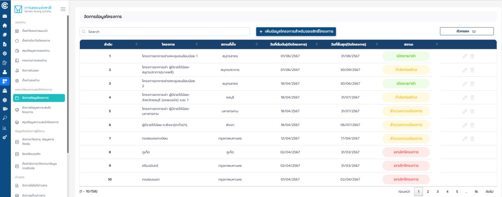<figcaption>
<strong>รูปภาพที่ 35</strong> หน้าจอการจัดการข้อมูลโครงการ (Pre-sale)
</figcaption></figure>

#### **3.1.1 การค้นหาข้อมูลโครงการ**

ผู้ใช้งานสามารถระบุโครงการที่ต้องการค้นหา จากนั้นคลิกบริเวณอื่นเพื่อให้ระบบค้นหาข้อมูล

<figure>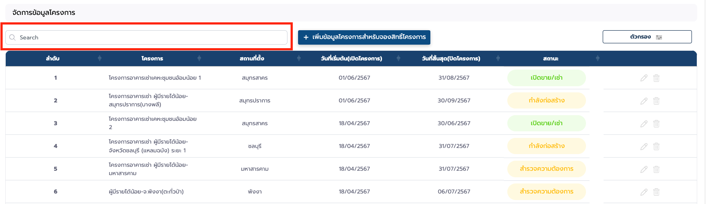<figcaption>
<strong>รูปภาพที่ 36</strong> หน้าจอจัดการข้อมูลโครงการ (Pre-sale) - ช่องค้นหาข้อมูลโครงการ (Pre-sale)
</figcaption></figure>

#### **3.1.2 การเพิ่มข้อมูลโครงการสำหรับจองสิทธิ์โครงการ**

คลิกปุ่ม “เพิ่มข้อมูลโครงการสำหรับจองสิทธิ์โครงการ”

<figure>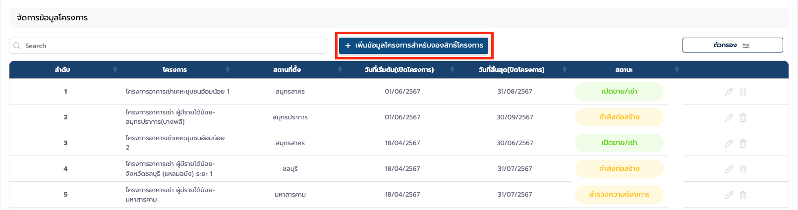<figcaption>
<strong>รูปภาพที่ 37</strong> หน้าจอจัดการข้อมูลโครงการ – ปุ่มเพิ่มข้อมูลโครงการ สำหรับจองสิทธิ์โครงการ
</figcaption></figure>

ระบบจะแสดงหน้าเพิ่มบริหารข้อมูลโครงการสำหรับจองสิทธิ์โครงการ ผู้ใช้งานกรอกรายละเอียดข้อมูลโครงการสำหรับจองสิทธิ์โครงการ

<figure>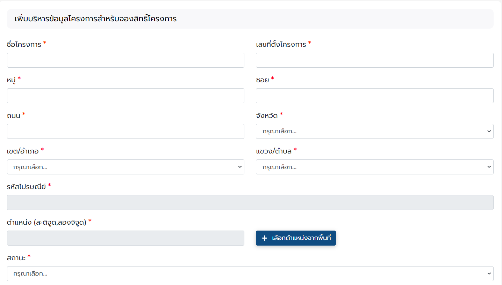<figcaption>
<strong>รูปภาพที่ 38</strong> หน้าจอจัดการข้อมูลโครงการ – การเพิ่มข้อมูลโครงการสำหรับจองสิทธิ์โครงการ
</figcaption></figure>

<figure>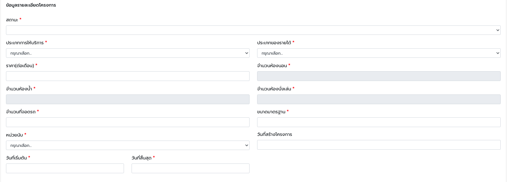<figcaption>
<strong>รูปภาพที่ 39</strong> หน้าจอจัดการข้อมูลโครงการสำหรับจองสิทธิ์– การเพิ่มข้อมูลโครงการ
</figcaption></figure>

<figure>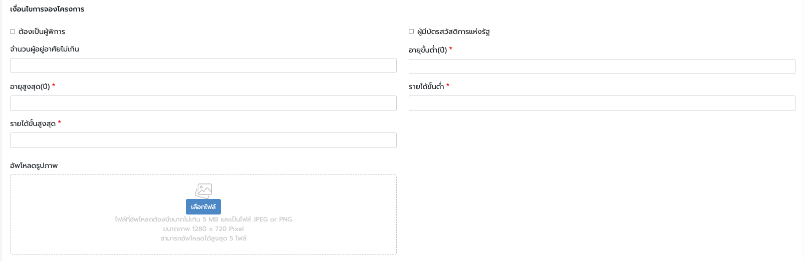<figcaption>
<strong>รูปภาพที่ 40</strong> หน้าจอจัดการข้อมูลโครงการสำหรับจองสิทธิ์ – การเพิ่มข้อมูลโครงการ
</figcaption></figure>

#### **3.1.3 การเพิ่มแบบแปลนชั้น**

ไปที่แท็บ แบบแปลนชั้น จากนั้นคลิกปุ่ม “เพิ่มข้อมูล”

<figure>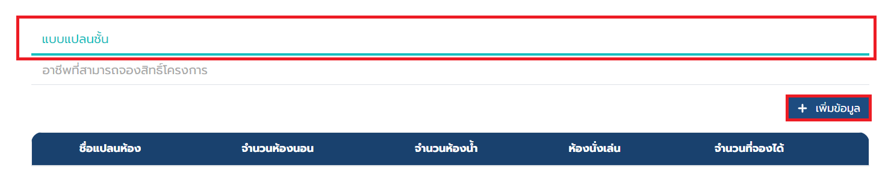<figcaption>
<strong>รูปภาพที่ 41</strong> หน้าจอจัดการข้อมูลโครงการ – การเพิ่มแบบแปลนชั้น
</figcaption></figure>

ระบบแสดงหน้าต่างป็อบอัพ (Pop-up) แบบแปลนชั้น ผู้ใช้งานกรอกรายละเอียดแบบแปลนชั้น จากนั้นคลิกปุ่ม “ยืนยัน”

<figure>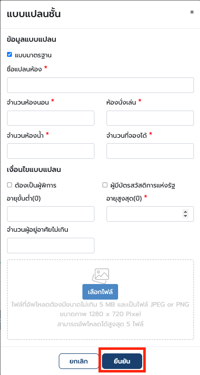<figcaption>
<strong>รูปภาพที่ 42</strong> หน้าจอจัดการข้อมูลโครงการสำหรับจองสิทธิ์ – หน้าต่างป็อบอัพ (Pop-up) แบบแปลนชั้น
</figcaption></figure>

ระบบจะทำการเพิ่มข้อมูลแปลนห้องที่ตารางรายการแบบแปลนชั้น ผู้ใช้งานสามารถแก้ไขและลบรายการได้ โดยการคลิกไอคอน “ดินสอ” และ “ถังขยะ”

<figure>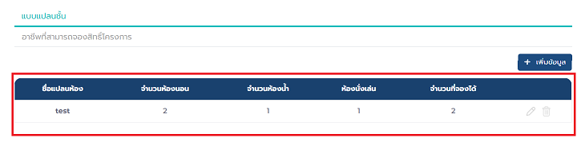<figcaption>
<strong>รูปภาพที่ 43</strong> หน้าจอจัดการข้อมูลโครงการสำหรับจองสิทธิ์ – ตารางรายการแบบแปลนชั้น
</figcaption></figure>

#### **3.1.4 การกำหนดอาชีพที่สามารถจองสิทธิ์โครงการ**

ไปที่แท็บ อาชีพที่สามารถจองสิทธิ์โครงการ จากนั้นคลิกปุ่ม “เพิ่มข้อมูล”

<figure>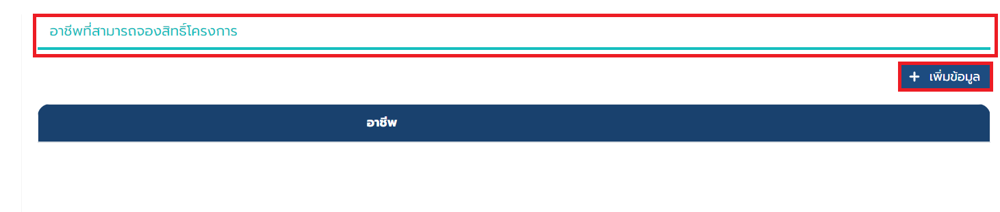<figcaption>
<strong>รูปภาพที่ 44</strong> หน้าจอจัดการข้อมูลโครงการสำหรับจองสิทธิ์ – ตารางรายการแบบแปลนชั้น
</figcaption></figure>

ระบบแสดงหน้าต่างป็อบอัพ (Pop-up) อาชีพที่สามารถจองสิทธิ์โครงการ ผู้ใช้งานเลือกอาชีพที่สามารถจองสิทธิ์โครงการ จากนั้นคลิกปุ่ม “ยืนยัน”

<figure>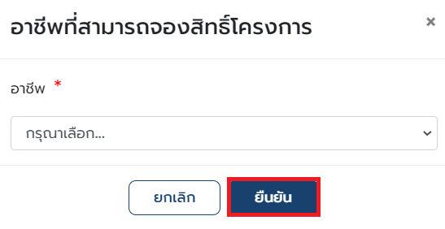<figcaption>
<strong>รูปภาพที่ 45</strong> หน้าจอจัดการข้อมูลโครงการสำหรับจองสิทธิ์ – หน้าต่างป็อบอัพ (Pop-up) อาชีพที่สามารถจองสิทธิ์โครงการ
</figcaption></figure>

ระบบจะทำการเพิ่มข้อมูลแปลนห้องที่ตารางรายการอาชีพที่สามารถจองสิทธิ์โครงการ ผู้ใช้งานสามารถแก้ไขและลบรายการได้ โดยการคลิกไอคอน “ดินสอ” และ “ถังขยะ”

<figure>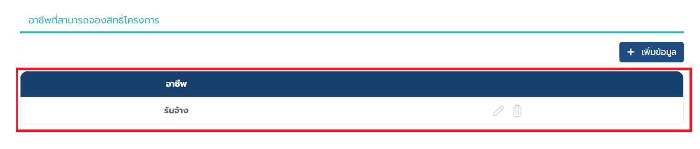<figcaption>
<strong>รูปภาพที่ 46</strong> หน้าจอจัดการข้อมูลโครงการ สำหรับจองสิทธิ์ – ตารางรายการอาชีพที่สามารถจองสิทธิ์โครงการ
</figcaption></figure>

เมื่อกรอกข้อมูลการเพิ่มข้อมูลโครงการสำหรับจองสิทธิ์โครงการเรียบร้อยแล้ว จากนั้นคลิกปุ่ม “บันทึก”

<figure>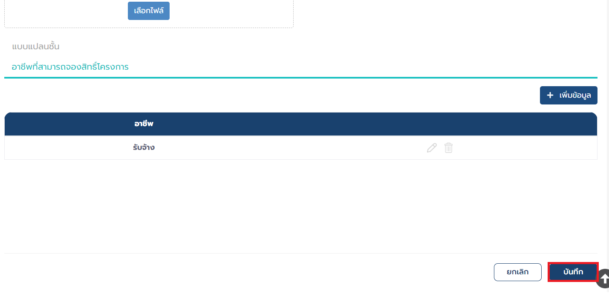<figcaption>
<strong>รูปภาพที่ 47</strong> หน้าจอจัดการข้อมูลโครงการสำหรับจองสิทธิ์ – การบันทึกการเพิ่มข้อมูลโครงการสำหรับจองสิทธิ์โครงการ
</figcaption></figure>

#### **3.1.5 การแก้ไขข้อมูลโครงการสำหรับจองสิทธิ์โครงการ**

ผู้ใช้งานสามารถแก้ไขข้อมูลโครงการสำหรับจองสิทธิ์โครงการได้ โดยคลิกที่ไอคอน “ดินสอ”

<figure>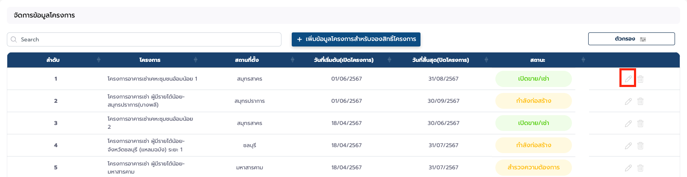<figcaption>
<strong>รูปภาพที่ 48</strong> หน้าจอจัดการข้อมูลโครงการสำหรับจองสิทธิ์ – การแก้ไขข้อมูลโครงการสำหรับจองสิทธิ์โครงการ
</figcaption></figure>

#### **3.1.6 การดูรายละเอียดโครงการสำหรับจองสิทธิ์โครงการ**

ผู้ใช้งานสามารถดูรายละเอียดโครงการสำหรับจองสิทธิ์โครงการได้ โดยคลิกที่ไอคอน แว่นขยาย

<figure>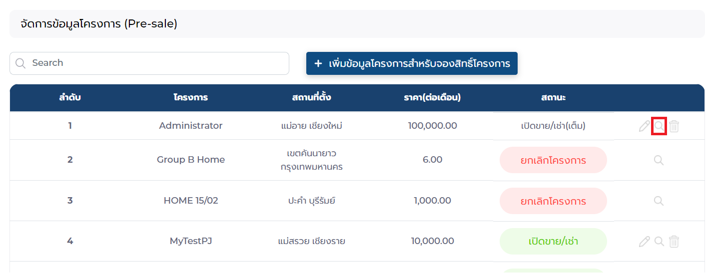<figcaption>
<strong>รูปภาพที่ 49</strong> หน้าจอจัดการข้อมูลโครงการสำหรับจองสิทธิ์ – การดูรายละเอียดข้อมูลโครงการสำหรับจองสิทธิ์โครงการ
</figcaption></figure>

#### **3.1.7 การลบข้อมูลโครงการสำหรับจองสิทธิ์โครงการ**

ผู้ใช้งานสามารถลบข้อมูลโครงการสำหรับจองสิทธิ์โครงการได้ โดยคลิกที่ไอคอน “ถังขยะ”

<figure>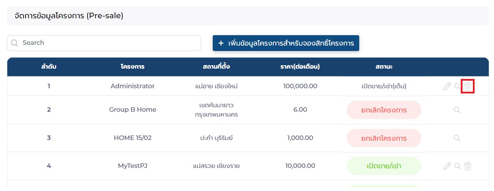<figcaption>
<strong>รูปภาพที่ 50</strong> หน้าจอจัดการข้อมูลโครงการสำหรับจองสิทธิ์ – การลบข้อมูลโครงการสำหรับจองสิทธิ์โครการ
</figcaption></figure>

### 3.2 การจัดการข้อมูลความสนใจโครงการ

ไปที่เมนูจองสิทธิ์โครงการ (Pre-sale) จากนั้นคลิก “จัดการข้อมูลจองสิทธิ์โครงการ”

<figure>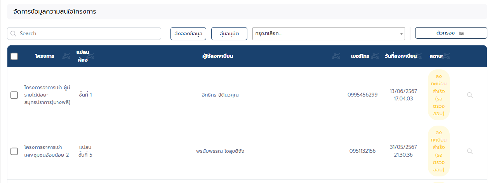<figcaption>
<strong>รูปภาพที่ 51</strong> หน้าจอจัดการข้อมูลจองสิทธิ์โครงการ
</figcaption></figure>

#### **3.2.1 การค้นหาข้อมูลจองสิทธิ์โครงการ**

ผู้ใช้งานสามารถระบุโครงการที่ต้องการค้นหา จากนั้นคลิกบริเวณอื่นเพื่อให้ระบบค้นหาข้อมูล

<figure>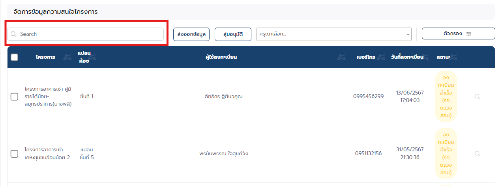<figcaption>
<strong>รูปภาพที่ 52</strong> หน้าจอจัดการข้อมูลจองสิทธิ์โครงการ - ช่องค้นหาข้อมูลจองสิทธิ์โครงการ
</figcaption></figure>

#### **3.2.2 ตัวกรองข้อมูลโครงการ**

คลิกปุ่ม “ตัวกรอง” ระบบจะแสดงหน้าต่างป๊อบอัพ (Pop-up) ตัวกรอง

<figure>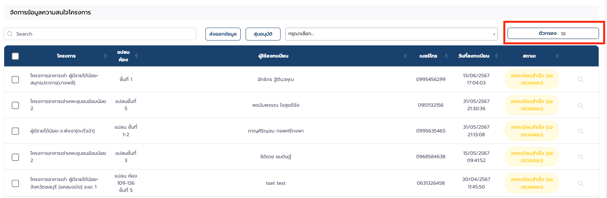<figcaption>
<strong>รูปภาพที่ 53</strong> หน้าจอจัดการข้อมูลจองสิทธิ์โครงการ – ปุ่มตัวกรอง
</figcaption></figure>

<figure>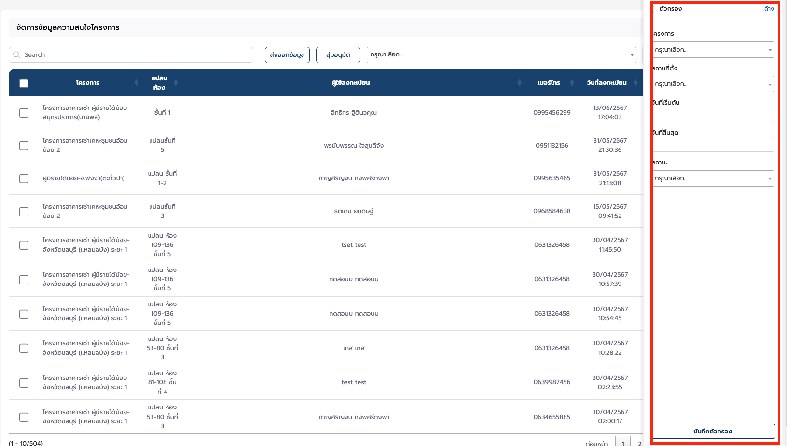<figcaption>
<strong>รูปภาพที่ 54</strong> หน้าจอจัดการข้อมูลจองสิทธิ์โครงการ – หน้าต่างป๊อบอัพ (Pop-up) ตัวกรอง
</figcaption></figure>

เลือกข้อมูลที่ต้องการกรอง จากนั้นคลิกปุ่ม “บันทึกตัวกรอง” ระบบจะกรองข้อมูลตามเงื่อนไขที่ระบุ

<figure>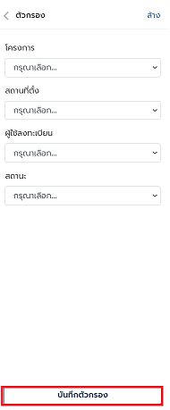<figcaption>
<strong>รูปภาพที่ 55</strong> หน้าจอจัดการข้อมูลจองสิทธิ์โครงการ – ตัวกรอง
</figcaption></figure>

คลิกที่ “ล้าง” เพื่อล้างข้อมูลที่เลือกได้

<figure><figcaption>
<strong>รูปภาพที่ 56</strong> หน้าจอจัดการข้อมูลจองสิทธิ์โครงการ – ปุ่มล้างตัวกรอง
</figcaption></figure>

คลิกปุ่ม “<” เพื่อปิดตัวกรอง

<figure>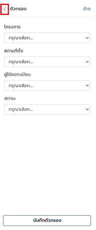<figcaption>
<strong>รูปภาพที่ 57</strong> หน้าจอจัดการข้อมูลจองสิทธิ์โครงการ – ปุ่มย้อนกลับเพื่อปิดตัวกรอง
</figcaption></figure>

#### **3.2.3 การส่งออกข้อมูล**

การส่งออกข้อมูล ผู้ใช้งานคลิกเลือกรายการที่ต้องการส่งออกข้อมูล จากนั้น คลิกปุ่ม “ส่งออกข้อมูล”

<figure>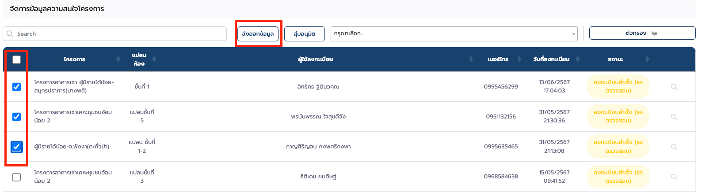<figcaption>
<strong>รูปภาพที่ 58</strong> หน้าจอจัดการข้อมูลจองสิทธิ์โครงการ – การส่งออกข้อมูล
</figcaption></figure>

#### **3.2.4 การสุ่มอนุมัติ**

การสุ่มอนุมัติ ผู้ใช้งานคลิกปุ่ม “สุ่มอนุมัติข้อมูล”

<figure>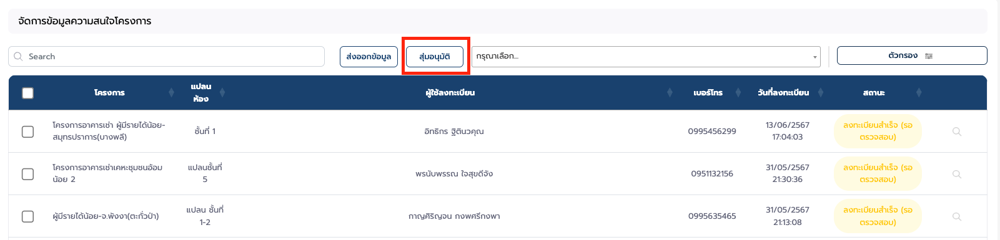<figcaption>
<strong>รูปภาพที่ 59</strong> หน้าจอจัดการข้อมูลจองสิทธิ์โครงการ – ปุ่มสุ่มอนุมัติข้อมูล
</figcaption></figure>

ระบบจะแสดงหน้าต่างป็อพอัพ (Pop-up) การสุ่มอนุมัติ ผู้ใช้งานเลือกโครงการ / แบบแปลนและจำนวนที่ต้องการสุ่ม จากนั้น คลิกปุ่ม “สุ่ม”

<figure>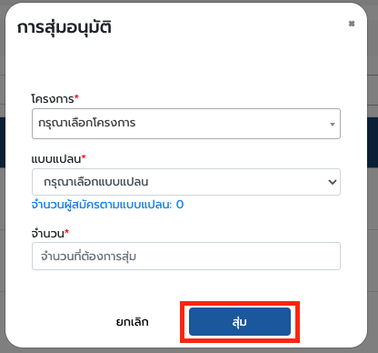<figcaption>
<strong>รูปภาพที่ 60</strong> หน้าจอจัดการข้อมูลจองสิทธิ์โครงการ – หน้าต่างป็อบอัพ (Pop-up) การสุ่มอนุมัติ
</figcaption></figure>

ระบบจะแสดงหน้าต่างป็อพอัพ (Pop-up) ยืนยันการสุ่มอนุมัติ จากนั้น คลิกปุ่ม “ยืนยัน”

<figure><figcaption>
<strong>รูปภาพที่ 61</strong> หน้าจอจัดการข้อมูลจองสิทธิ์โครงการ – หน้าต่างป็อบอัพ (Pop-up) ยืนยันการสุ่มอนุมัติ
</figcaption></figure>

#### **3.2.5 การอนุมัติและไม่อนุมัติการจองสิทธิ์โครงการ**

**การอนุมัติ** ผู้ใช้งานคลิกเลือกรายการที่ต้องการ จากนั้น คลิกเลือกเหตุผลการอนุมัติ ด้านหน้าปุ่ม “ตัวกรอง”

<figure>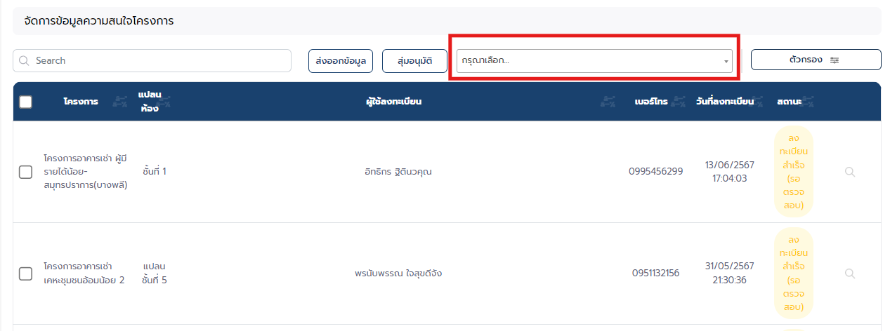<figcaption>
<strong>รูปภาพที่ 62</strong> หน้าจอจัดการข้อมูลจองสิทธิ์โครงการ – การอนุมัติ
</figcaption></figure>

**การไม่อนุมัติ** ผู้ใช้งานคลิกเลือกรายการที่ต้องการ จากนั้น คลิกปุ่ม “ไม่อนุมัติ”

<figure>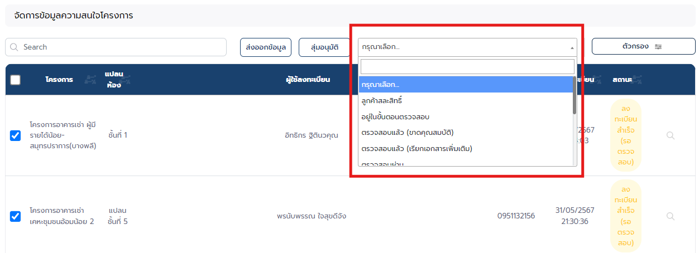<figcaption>
<strong>รูปภาพที่ 63</strong> หน้าจอจัดการข้อมูลจองสิทธิ์โครงการ – เลือกเหตุผลการอนุมัติ หรือ ไม่อนุมัติ
</figcaption></figure>

#### **3.2.6 การดูรายละเอียดโครงการ**

ผู้ใช้งานสามารถดูรายละเอียดโครงการได้ โดยคลิกที่ไอคอน“แว่นขยาย”

<figure>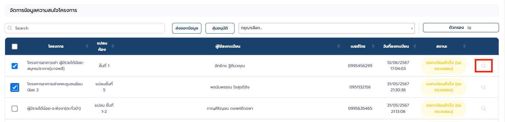<figcaption>
<strong>รูปภาพที่ 64</strong> หน้าจอจัดการข้อมูลจองสิทธิ์โครงการ – การดูรายละเอียดโครงการ
</figcaption></figure>

### 3.3 สรุปข้อมูลการความสนใจในโครงการ

ไปที่เมนูลงทะเบียนความสนใจในโครงการ จากนั้นคลิก “สรุปข้อมูลความสนใจในโครงการ”

<figure>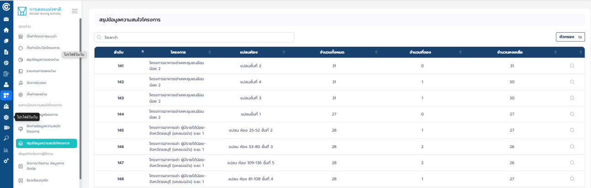<figcaption>
<strong>รูปภาพที่ 65</strong> หน้าจอสรุปข้อมูลความสนใจในโครงการ
</figcaption></figure>

#### **3.3.1 การค้นหาโครงการ**

ผู้ใช้งานสามารถระบุโครงการที่ต้องการค้นหา จากนั้นคลิกบริเวณอื่นเพื่อให้ระบบค้นหาข้อมูล

<figure>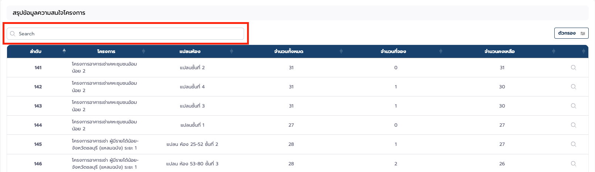<figcaption>
<strong>รูปภาพที่ 66</strong> หน้าจอสรุปข้อมูลความสนใจในโครงการ – ช่องค้นหาข้อมูลการจองสิทธิ์โครงการ
</figcaption></figure>

#### **3.3.2 ตัวกรองโครงการ**

คลิกปุ่ม “ตัวกรอง” ระบบจะแสดงหน้าต่างป๊อบอัพ (Pop-up) ตัวกรอง

<figure>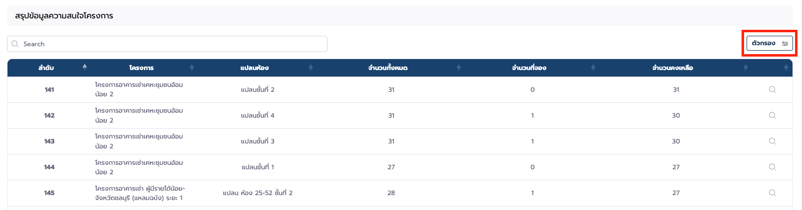<figcaption>
<strong>รูปภาพที่ 67</strong> หน้าจอสรุปข้อมูลการความสนใจในโครงการ – ปุ่มตัวกรอง
</figcaption></figure>

<figure>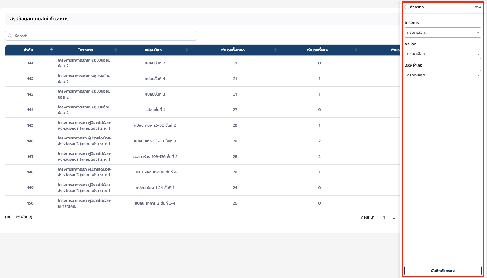<figcaption>
<strong>รูปภาพที่ 68</strong> หน้าจอสรุปข้อมูลความสนใจในโครงการ – หน้าต่างป๊อบอัพ (Pop-up) ตัวกรอง
</figcaption></figure>

เลือกข้อมูลที่ต้องการกรอง จากนั้นคลิกปุ่ม “บันทึกตัวกรอง” ระบบจะกรองข้อมูลตามเงื่อนไขที่ระบุ

<figure>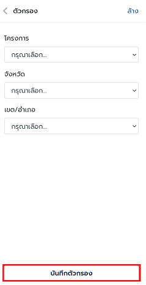<figcaption>
<strong>รูปภาพที่ 69</strong> หน้าจอสรุปข้อมูลความสนใจในโครงการ – ตัวกรอง
</figcaption></figure>

คลิกที่ “ล้าง” เพื่อล้างข้อมูลที่เลือกได้

<figure>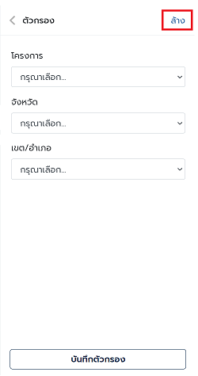<figcaption>
<strong>รูปภาพที่ 70</strong> หน้าจอสรุปข้อมูลความสนใจในโครงการ – ปุ่มล้างตัวกรอง
</figcaption></figure>

คลิกปุ่ม “<” เพื่อปิดตัวกรอง

<figure>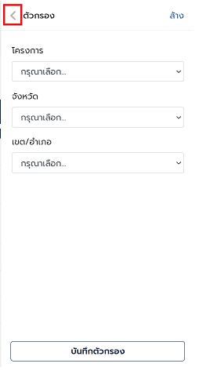<figcaption>
<strong>รูปภาพที่ 71</strong> หน้าจอสรุปข้อมูลความสนใจในโครงการ – ปุ่มย้อนกลับเพื่อปิดตัวกรอง
</figcaption></figure>

#### **3.3.3 สรุปข้อมูลการจองสิทธิ์โครงการ (Pre-sale)**

ผู้ใช้งานสามารถดูสรุปข้อมูลการจองบ้านได้ที่ตารางสรุปข้อมูลการจองสิทธิ์โครงการ (Pre-sale)

<figure>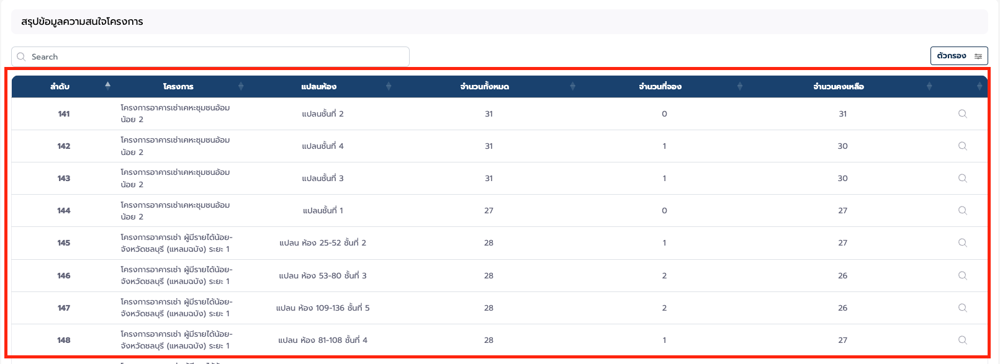<figcaption>
<strong>รูปภาพที่ 72</strong> หน้าจอสรุปข้อมูลความสนใจในโครงการ
</figcaption></figure>

ผู้ใช้งานสามารถดูรายละเอียดโครงการได้ โดยคลิกที่ไอคอน แว่นขยาย

<figure>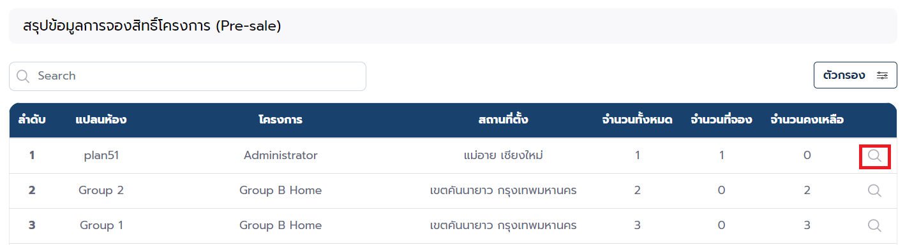<figcaption>
<strong>รูปภาพที่ 73</strong> หน้าจอสรุปข้อมูลการจองสิทธิ์โครงการ (Pre-sale) – รายละเอียดโครงการ
</figcaption></figure>

## **บทที่ 4 การใช้งานในส่วนของข้อมูลติดต่อจากผู้ใช้งาน**

หัวข้อต่อไปนี้จะอธิบายถึงการใช้งานในส่วนของการติดต่อสอบถาม

### 4.1 จัดการ/ติดตาม ข้อมูลการติดต่อจากผู้ใช้งาน

ไปที่เมนูข้อมูลติดต่อจากผู้ใช้งาน จากนั้นคลิก “จัดการ/ติดตาม ข้อมูลการติดต่อจากผู้ใช้งาน”

<figure>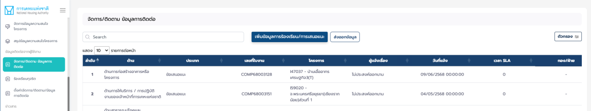<figcaption>
<strong>รูปภาพที่ 74</strong> หน้าจอจัดการ/ติดตาม ข้อมูลการติดต่อจากผู้ใช้งาน – รายละเอียดโครงการ
</figcaption></figure>

#### **4.1.1 การค้นหาข้อมูลการติดต่อจากผู้ใช้งาน**

ผู้ใช้งานสามารถระบุข้อมูลที่ต้องการค้นหา จากนั้นคลิกบริเวณอื่นเพื่อให้ระบบค้นหาข้อมูล

<figure>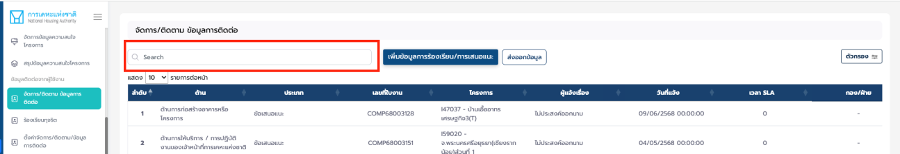<figcaption>
<strong>รูปภาพที่ 75</strong> หน้าจอจัดการ/ติดตาม ข้อมูลการติดต่อจากผู้ใช้งาน – ช่องค้นหาโครงการ
</figcaption></figure>

#### **4.1.2 ตัวกรองข้อมูลการติดต่อจากผู้ใช้งาน**

คลิกปุ่ม “ตัวกรอง” ระบบจะแสดงหน้าต่างป๊อบอัพ (Pop-up) ตัวกรอง

<figure>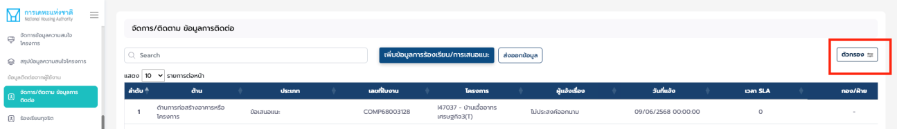<figcaption>
<strong>รูปภาพที่ 76</strong> หน้าจอจัดการ/ติดตาม ข้อมูลการติดต่อจากผู้ใช้งาน – ปุ่มตัวกรอง
</figcaption></figure>

<figure>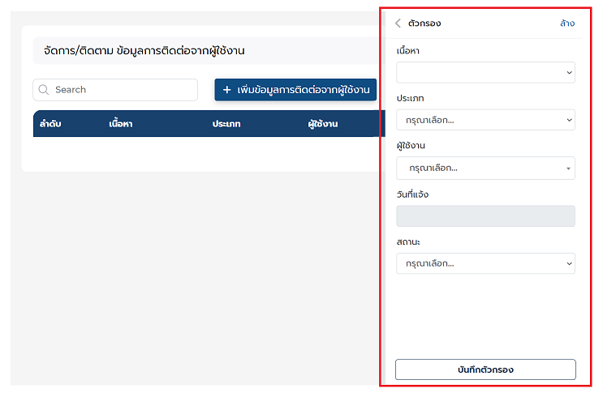<figcaption>
<strong>รูปภาพที่ 77</strong> หน้าจอจัดการ/ติดตาม ข้อมูลการติดต่อจากผู้ใช้งาน – หน้าต่างป๊อบอัพ (Pop-up) ตัวกรอง
</figcaption></figure>

เลือกข้อมูลที่ต้องการกรอง จากนั้นคลิกปุ่ม “บันทึกตัวกรอง” ระบบจะกรองข้อมูลตามเงื่อนไขที่ระบุ

<figure>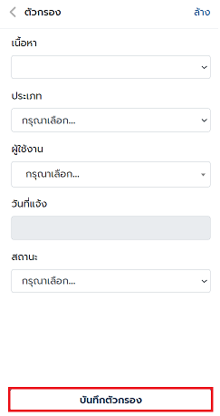<figcaption>
<strong>รูปภาพที่ 78</strong> หน้าจอจัดการ/ติดตาม ข้อมูลการติดต่อจากผู้ใช้งาน – ตัวกรอง
</figcaption></figure>

คลิกที่ “ล้าง” เพื่อล้างข้อมูลที่เลือกได้

<figure>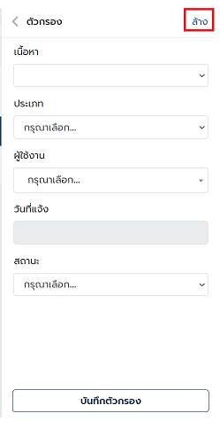<figcaption>
<strong>รูปภาพที่ 79</strong> หน้าจอจัดการ/ติดตาม ข้อมูลการติดต่อจากผู้ใช้งาน – ปุ่มล้างตัวกรอง
</figcaption></figure>

คลิกปุ่ม “<” เพื่อปิดตัวกรอง

<figure>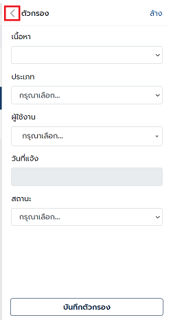<figcaption>
<strong>รูปภาพที่ 80</strong> หน้าจอจัดการ/ติดตาม ข้อมูลการติดต่อจากผู้ใช้งาน – ปุ่มย้อนกลับเพื่อปิดตัวกรอง
</figcaption></figure>

#### **4.1.3 การเพิ่มข้อมูลการติดต่อจากผู้ใช้งาน**

การเพิ่มข้อมูลติดต่อจากผู้ใช้งาน คลิกปุ่ม “เพิ่มข้อมูลติดต่อจากผู้ใช้งาน”

<figure>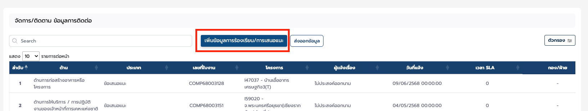<figcaption>
<strong>รูปภาพที่ 81</strong> หน้าจอจัดการ/ติดตาม ข้อมูลการติดต่อจากผู้ใช้งาน – ปุ่มเพิ่มข้อมูลการติดต่อจากผู้ใช้งาน
</figcaption></figure>

ระบบจะแสดงหน้าเพิ่มข้อมูลการติดต่อจากผู้ใช้งาน ผู้ใช้งานกรอกรายละเอียดข้อมูลการติดต่อจากผู้ใช้งาน

<figure><figcaption>
<strong>รูปภาพที่ 82</strong> หน้าจอจัดการ/ติดตาม ข้อมูลการติดต่อจากผู้ใช้งาน – เพิ่มข้อมูลการติดต่อจากผู้ใช้งาน
</figcaption></figure>

#### **4.1.4 การมอบหมายหน่วยงาน**

คลิกที่แท็บรายละเอียดเรื่องร้องเรียน จากนั้นให้เลือกหน่วยงานที่รับผิดชอบ และผู้รับผิดชอบ เพื่อเป็นการมอบหมาย แล้วกดปุ่ม “มอบหมาย”

<figure>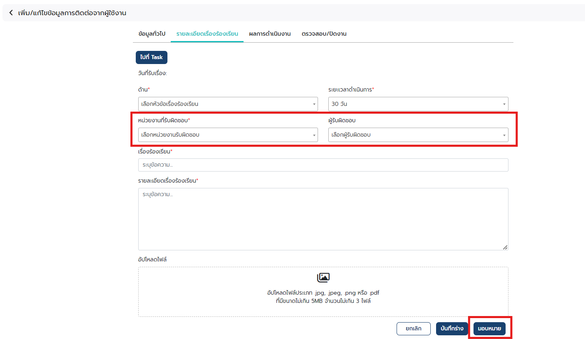<figcaption>
<strong>รูปภาพที่ 83</strong> หน้าจอจัดการ/ติดตาม ข้อมูลการติดต่อจากผู้ใช้งาน – การมอบหมายหน่วยงาน
</figcaption></figure>

ผู้ใช้งานสามารถติดตามผลการดำเนินงานได้ โดยคลิกไปที่แท็บ “ผลการดำเนินงาน”

<figure>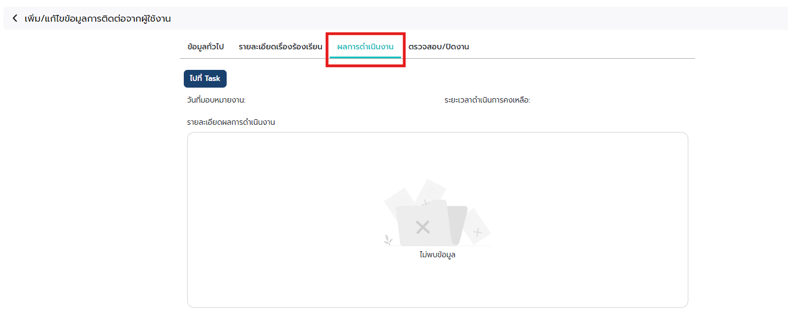<figcaption>
<strong>รูปภาพที่ 84</strong> หน้าจอจัดการ/ติดตาม ข้อมูลการติดต่อจากผู้ใช้งาน – ติดตามผลการดำเนินงาน
</figcaption></figure>

#### **4.1.5 การตรวจสอบ/ปิดงาน**

หากต้องการตรวจสอบงาน หรือต้องการปิดงานการติดต่อต่างๆ คลิกที่แท็บเมนู “ตรวจสอบ/ปิดงาน” จากนั้นคลิกปุ่ม “ปิดงาน” หากต้องการปิดงานนั้น

<figure>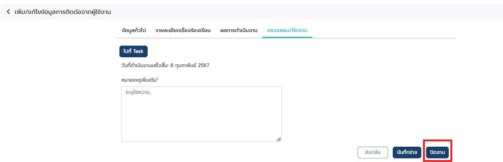<figcaption>
<strong>รูปภาพที่ 85</strong> หน้าจอจัดการ/ติดตาม ข้อมูลการติดต่อจากผู้ใช้งาน <em>–</em> ตรวจสอบ/ปิดงาน
</figcaption></figure>

### 4.2 ร้องเรียนทุจริต

ไปที่เมนูข้อมูลติดต่อจากผู้ใช้งาน จากนั้นคลิก “ร้องเรียนทุจริต”

<figure>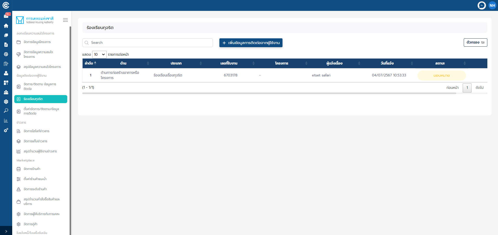<figcaption>
<strong>รูปภาพที่ 86</strong> หน้าจอจร้องเรียนทุจริต – รายละเอียดข้อมูลการร้องเรียนทุจริต
</figcaption></figure>

#### **4.2.1 การเพิ่มข้อมูลการติดต่อจากผู้ใช้งาน**

การเพิ่มข้อมูลติดต่อจากผู้ใช้งาน คลิกปุ่ม “เพิ่มข้อมูลติดต่อจากผู้ใช้งาน”

<figure>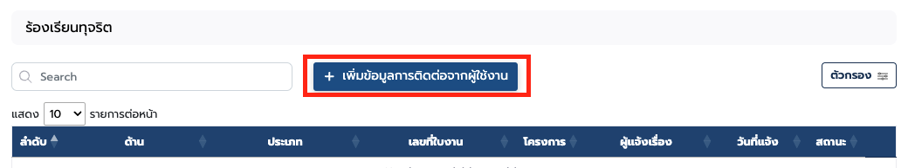<figcaption>
<strong>รูปภาพที่ 87</strong> หน้าจอร้องเรียนทุจริต– ปุ่มเพิ่มข้อมูลการติดต่อจากผู้ใช้งาน
</figcaption></figure>

ระบบจะแสดงหน้าเพิ่มข้อมูลการติดต่อจากผู้ใช้งาน ผู้ใช้งานกรอกรายละเอียดข้อมูลการ้องเรียนทุจริต แล้วกด “บันทึก”

<figure>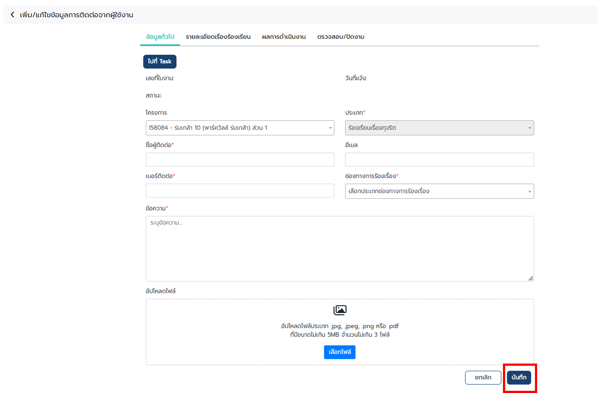<figcaption>
<strong>รูปภาพที่ 88</strong> หน้าจอร้องเรียนทุจริต – เพิ่มข้อมูลการติดต่อจากผู้ใช้งาน
</figcaption></figure>

#### **4.2.2 การมอบหมายหน่วยงาน**

คลิกที่แท็บรายละเอียดเรื่องร้องเรียน จากนั้นให้เลือกหน่วยงานที่รับผิดชอบ และผู้รับผิดชอบ เพื่อเป็นการมอบหมาย สุดท้ายคลิกปุ่ม “มอบหมาย”

<figure>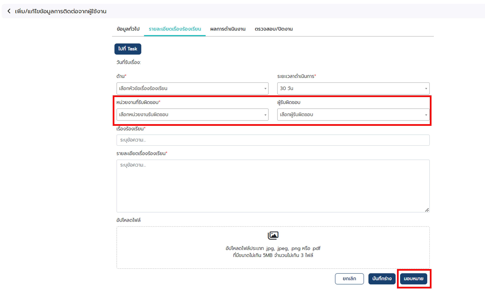<figcaption>
<strong>รูปภาพที่ 89</strong> หน้าจอร้องเรียนทุจริต <em>–</em> การมอบหมายหน่วยงาน
</figcaption></figure>

ผู้ใช้งานสามารถติดตามผลการดำเนินงานได้ โดยคลิกไปที่แท็บ “ผลการดำเนินงาน”

<figure>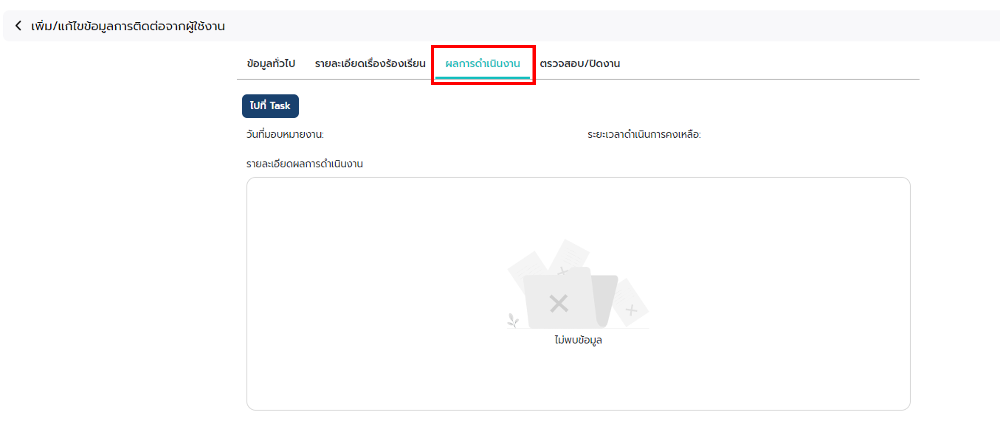<figcaption>
<strong>รูปภาพที่ 90</strong> หน้าจอจัดการ/ติดตาม ข้อมูลการติดต่อจากผู้ใช้งาน <em>–</em> ติดตามผลการดำเนินงาน
</figcaption></figure>

#### **4.2.3 การตรวจสอบ/ปิดงาน**

หากต้องการตรวจสอบงาน หรือต้องการปิดงานการติดต่อต่างๆ คลิกที่แท็บเมนู “ตรวจสอบ/ปิดงาน”

<figure>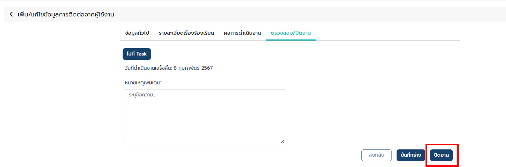<figcaption>
<strong>รูปภาพที่ 91</strong> หน้าจอร้องเรียนทุจริต <em>–</em> ตรวจสอบ/ปิดงาน
</figcaption></figure>

## **บทที่ 5 การใช้งานในส่วนของข่าวสาร**

### 5.1 จัดการไฮไลท์ข่าวสาร

ไปที่เมนูข่าวสารจากนั้นคลิก “จัดการไฮไลท์ข่าวสาร” ในเมนูนี้สามารถเพิ่มข่าวสารที่น่าสนใจ ในหน้าแรกของเว็บ Customer Service ได้&#x20;

<figure>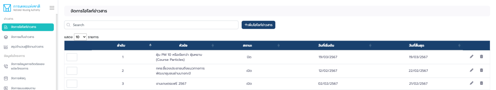<figcaption>
<strong>รูปภาพที่ 92</strong> หน้าจอสจัดการไฮไลท์ข่าวสาร <em>–</em> รายละเอียดข่าวไฮไลท์
</figcaption></figure>

#### **5.1.1 เพิ่มไฮไลท์ข่าวสาร**

ผู้ใช้สามารถเพิ่มข่าวได้ โดยคลิกที่ “เพิ่มไฮไลท์ข่าวสาร”

<figure>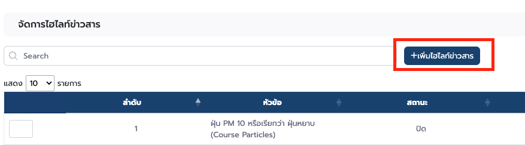<figcaption>
<strong>รูปภาพที่ 93</strong> หน้าจอสจัดการไฮไลท์ข่าวสาร <em>–</em> เพิ่มไฮไลท์ข่าวสาร
</figcaption></figure>

เมื่อมาที่หน้าจอกรอกข้อมูล “หัวข้อ” “วันเริ่มต้น” และ “วันที่สิ้นสุด” (การแสดงข่าวในหน้าเว็บ) นอกจากนี้หากต้องการปิด/เปิดการแสดงข่าว ให้เลือกที่ “สถานะ” เมื่อเรียบร้อยแล้ว คลิก “บันทึก”

<figure>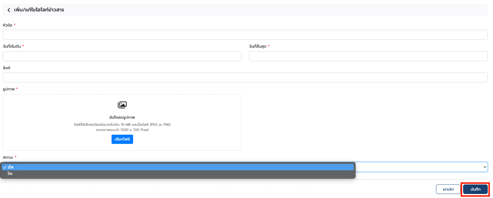<figcaption>
<strong>รูปภาพที่ 94</strong> หน้าจอสรุปจำนวนผู้ใช้งานข่าวสาร <em>–</em> เพิ่มไฮไลท์ข่าวสาร
</figcaption></figure>

#### **5.1.2 แก้ไขไฮไลท์ข่าวสาร**

ผู้ใช้งานสามารถแก้ไข ข่าวสาร โดยคลิก “ดินสอ” ด้านหลังของข่าวสารที่ต้องการ

<figure><figcaption>
<strong>รูปภาพที่ 95</strong> หน้าจอสรุปจำนวนผู้ใช้งานข่าวสาร – แก้ไขข่าวสาร
</figcaption></figure>

จากนั้นสามารถแก้ไขข้อมูลข่าวสาร รวมไปถึงสถานะการเปิด/ปิดการแสดงข่าวก็ได้เช่นกัน เมื่อแก้ไขเรียบร้อยแล้วคลิก “บันทึก”

<figure>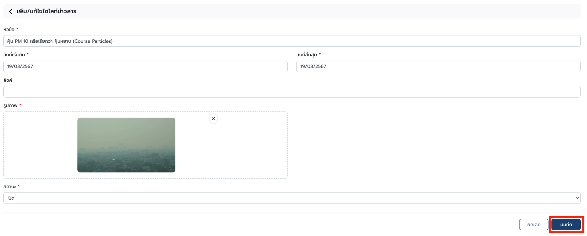<figcaption>
<strong>รูปภาพที่ 96</strong> หน้าจอสรุปจำนวนผู้ใช้งานข่าวสาร – แก้ไขข่าวสาร
</figcaption></figure>

### 5.2 จัดการแท็บข่าวสาร

ไปที่เมนูข่าวสารจากนั้นคลิก “จัดการแท็บข่าวสาร” ในเมนูนี้สามารถเพิ่มแท็บเมนูข่าวสารในหน้าแรกของเว็บ Customer Service ได้&#x20;

<figure>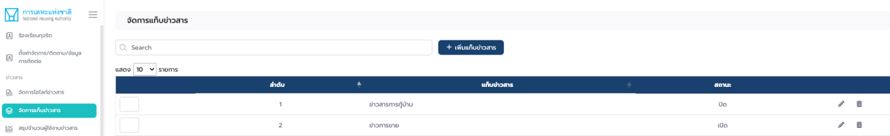<figcaption>
<strong>รูปภาพที่ 97</strong> หน้าจอสจัดการแท็บข่าวสาร <em>–</em> รายละเอียดแท็บข่าวสาร
</figcaption></figure>

#### **5.2.1 เพิ่มไฮไลท์ข่าวสาร**

ผู้ใช้สามารถเพิ่มแท็บข่าวสารได้ โดยคลิกที่ “เพิ่มแท็บข่าวสาร”

<figure>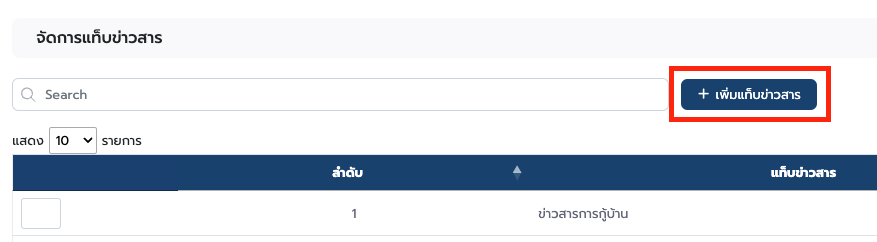<figcaption>
<strong>รูปภาพที่ 98</strong> หน้าจอสจัดการไฮไลท์ข่าวสาร <em>–</em> เพิ่มแท็บ์ข่าวสาร
</figcaption></figure>

เมื่อมาที่หน้าจอให้ตั้งชื่อแท็บ และสถานะ ปิด/เปิดการแสดงแท็บเมนูข่าว ให้เลือกที่ “สถานะ” เมื่อเรียบร้อยแล้ว คลิก “บันทึก”

<figure><figcaption>
<strong>รูปภาพที่ 99</strong> หน้าจอจัดการแท็บข่าวสาร <em>–</em> เพิ่มแท็บข่าวสาร
</figcaption></figure>

#### **5.2.2 แก้ไขแท็บข่าวสาร**

ผู้ใช้งานสามารถแก้ไข ข่าวสาร โดยคลิก “ดินสอ” ด้านหลังของแท็บข่าวที่ต้องการ

<figure>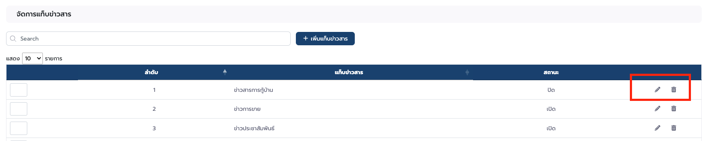<figcaption>
<strong>รูปภาพที่ 100</strong> หน้าจอแก้ไขแท็บข่าวสาร – แก้ไขข่าวสาร
</figcaption></figure>

จากนั้นสามารถแก้ไขชื่อแท็บ รวมไปถึงสถานะการเปิด/ปิดการแสดงก็ได้เช่นกัน เมื่อแก้ไขเรียบร้อยแล้วคลิก “บันทึก”

<figure><figcaption>
<strong>รูปภาพที่ 101</strong> หน้าจอจัดการแท็บข่าวสาร – แก้ไขแท็บ
</figcaption></figure>

### 5.3 สรุปจำนวนผู้ใช้งานข่าวสาร

ไปที่เมนูข่าวสารจากนั้นคลิก “สรุปจำนวนผู้ใช้งานข่าวสาร”

<figure>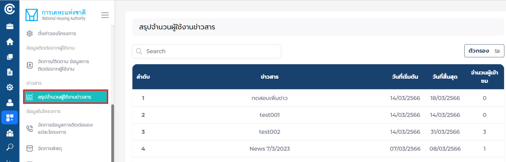<figcaption>
<strong>รูปภาพที่ 102</strong> หน้าจอสรุปจำนวนผู้ใช้งานข่าวสาร <em>–</em> การบันทึกเพิ่มข้อมูลการติดต่อจากผู้ใช้งาน
</figcaption></figure>

#### **5.3.1 การค้นหาข่าวสาร**

ผู้ใช้งานสามารถระบุข่าวสารที่ต้องการค้นหา จากนั้นคลิกบริเวณอื่นเพื่อให้ระบบค้นหาข้อมูล

<figure>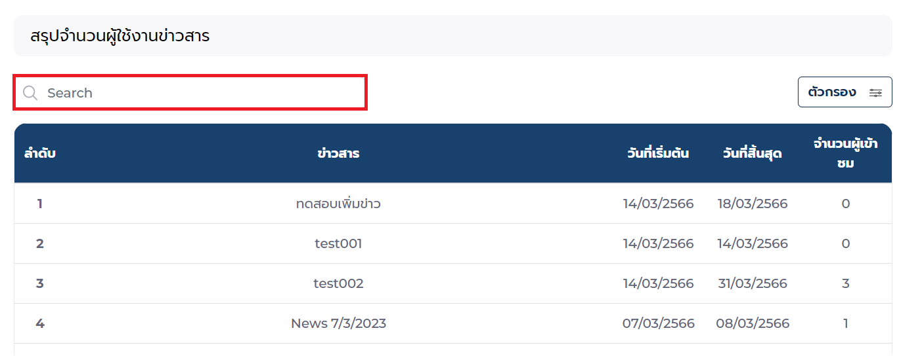<figcaption>
<strong>รูปภาพที่ 103</strong> หน้าจอสรุปจำนวนผู้ใช้งานข่าวสาร – ช่องค้นหาข่าวสาร
</figcaption></figure>

#### **5.3.2 ตัวกรองข่าวสาร**

คลิกปุ่ม “ตัวกรอง” ระบบจะแสดงหน้าต่างป๊อบอัพ (Pop-up) ตัวกรอง

<figure>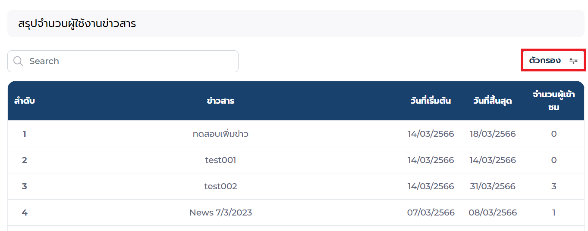<figcaption>
<strong>รูปภาพที่ 104</strong> หน้าจอสรุปจำนวนผู้ใช้งานข่าวสาร – ปุ่มตัวกรอง
</figcaption></figure>

<figure>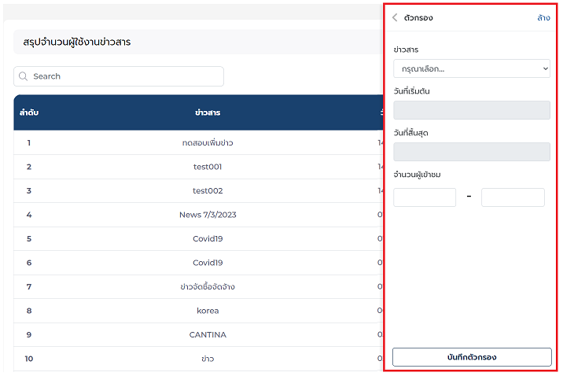<figcaption>
<strong>รูปภาพที่ 105</strong> หน้าจอสรุปจำนวนผู้ใช้งานข่าวสาร – หน้าต่างป๊อบอัพ (Pop-up) ตัวกรอง
</figcaption></figure>

เลือกข้อมูลที่ต้องการกรอง จากนั้นคลิกปุ่ม “บันทึกตัวกรอง” ระบบจะกรองข้อมูลตามเงื่อนไขที่ระบุ

<figure>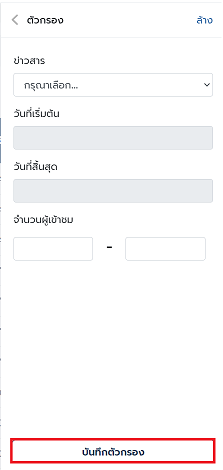<figcaption>
<strong>รูปภาพที่ 106</strong> หน้าจอสรุปจำนวนผู้ใช้งานข่าวสาร – ตัวกรอง
</figcaption></figure>

คลิกที่ “ล้าง” เพื่อล้างข้อมูลที่เลือกได้

<figure>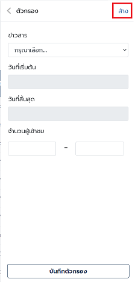<figcaption>
<strong>รูปภาพที่ 107</strong> หน้าจอสรุปจำนวนผู้ใช้งานข่าวสาร – ปุ่มล้างตัวกรอง
</figcaption></figure>

คลิกปุ่ม “<” เพื่อปิดตัวกรอง

<figure>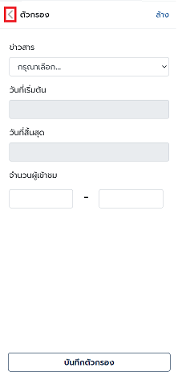<figcaption>
<strong>รูปภาพที่ 108</strong> หน้าจอสรุปจำนวนผู้ใช้งานข่าวสาร – ปุ่มย้อนกลับเพื่อปิดตัวกรอง
</figcaption></figure>

#### **5.3.3 สรุปจำนวนผู้ใช้งานข่าวสาร**

ผู้ใช้งานสามารถดูจำนวนผู้ใช้งานข่าวสาร ได้ที่ตารางสรุปจำนวนผู้ใช้งานข่าวสาร

<figure>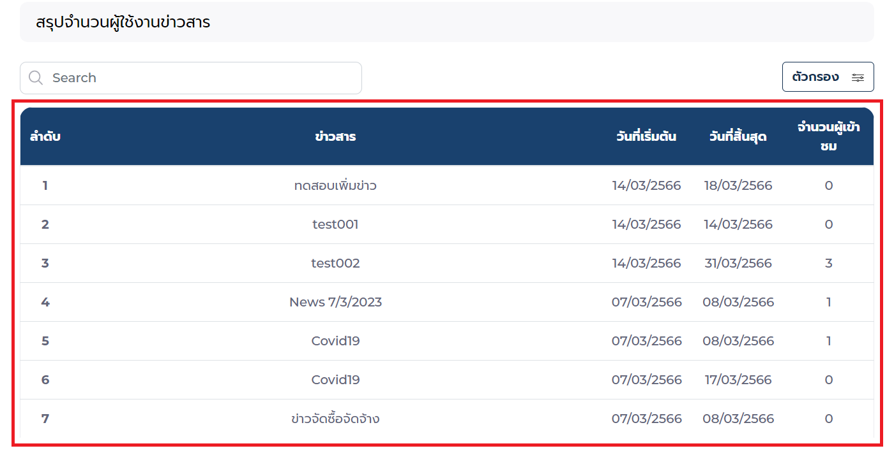<figcaption>
<strong>รูปภาพที่ 109</strong> หน้าจอสรุปจำนวนผู้ใช้งานข่าวสาร – ตารางสรุปจำนวนผู้ใช้งานช่าวสาร
</figcaption></figure>

## **บทที่ 6 การใช้งานในส่วนข้อมูลในโครงการ**

### 6.1 จัดการข้อมูลการติดต่อของแต่ละโครงการ

ไปที่เมนูข้อมูลในโครงการ จากนั้นคลิก “จัดการการติดต่อของแต่ละโครงการ”

<figure>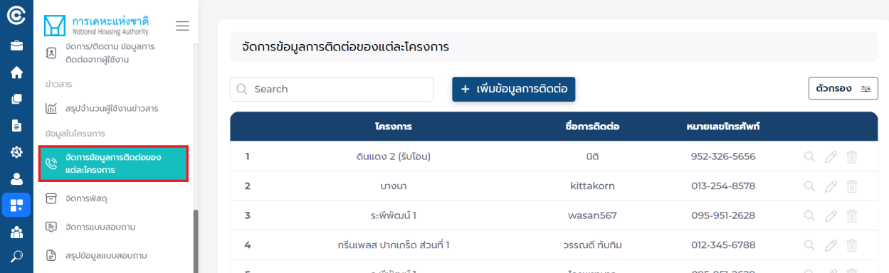<figcaption>
<strong>รูปภาพที่ 110</strong> หน้าจอจัดการการติดต่อของแต่ละโครงการ
</figcaption></figure>

#### **6.1.1 การค้นหาข้อมูลการติดต่อ**

ผู้ใช้งานสามารถระบุข้อมูลการติดต่อที่ต้องการค้นหา จากนั้นคลิกบริเวณอื่นเพื่อให้ระบบค้นหาข้อมูล

<figure>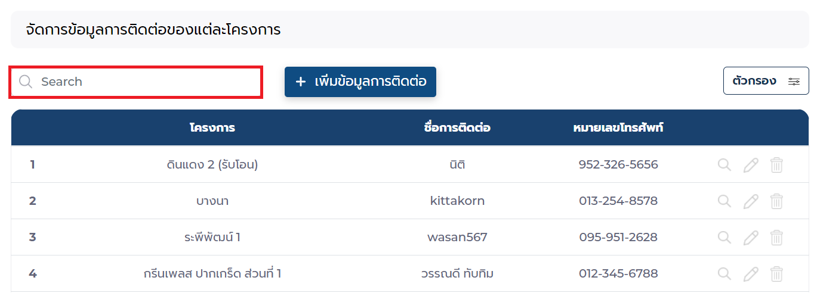<figcaption>
<strong>รูปภาพที่ 111</strong> หน้าจอจัดการการติดต่อของแต่ละโครงการ - ช่องค้นหา
</figcaption></figure>

#### **6.1.2 ตัวกรองข้อมูลการติดต่อ**

คลิกปุ่ม “ตัวกรอง” ระบบจะแสดงหน้าต่างป๊อบอัพ (Pop-up) ตัวกรอง

<figure>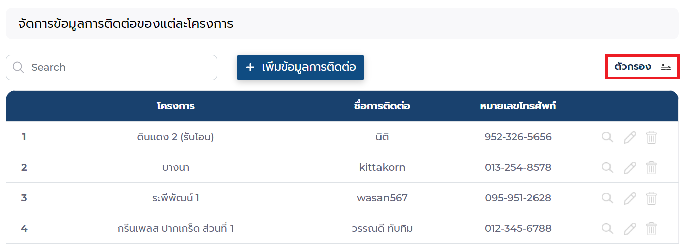<figcaption>
<strong>รูปภาพที่ 112</strong> หน้าจอจัดการการติดต่อของแต่ละโครงการ – ปุ่มตัวกรอง
</figcaption></figure>

<figure>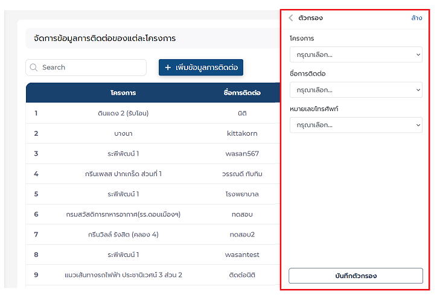<figcaption>
<strong>รูปภาพที่ 113</strong> หน้าจอจัดการการติดต่อของแต่ละโครงการ – หน้าต่างป๊อบอัพ (Pop-up) ตัวกรอง
</figcaption></figure>

เลือกข้อมูลที่ต้องการกรอง จากนั้นคลิกปุ่ม “บันทึกตัวกรอง” ระบบจะกรองข้อมูลตามเงื่อนไขที่ระบุ

<figure>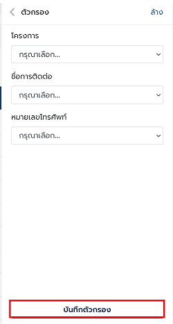<figcaption>
<strong>รูปภาพที่ 114</strong> หน้าจอจัดการการติดต่อของแต่ละโครงการ – ตัวกรอง
</figcaption></figure>

คลิกที่ “ล้าง” เพื่อล้างข้อมูลที่เลือกได้

<figure>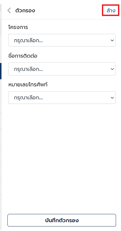<figcaption>
<strong>รูปภาพที่ 115</strong> หน้าจอจัดการการติดต่อของแต่ละโครงการ – ปุ่มล้างตัวกรอง
</figcaption></figure>

คลิกปุ่ม “<” เพื่อปิดตัวกรอง

<figure>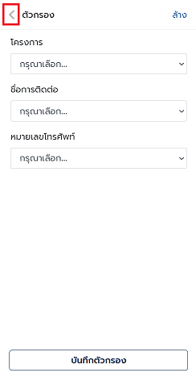<figcaption>
<strong>รูปภาพที่ 116</strong> หน้าจอจัดการการติดต่อของแต่ละโครงการ – ปุ่มย้อนกลับเพื่อปิดตัวกรอง
</figcaption></figure>

#### **6.1.3 การเพิ่มข้อมูลการติดต่อ**

การเพิ่มข้อมูลการติดต่อ คลิกปุ่ม “เพิ่มข้อมูลการติดต่อ”

<figure>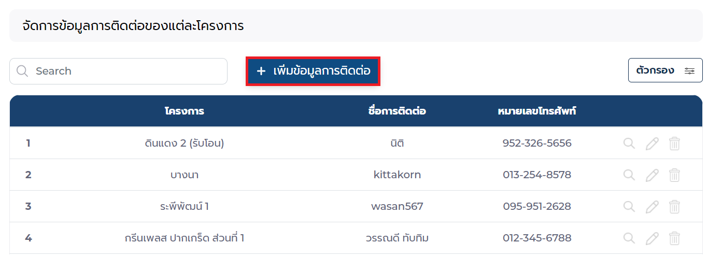<figcaption>
<strong>รูปภาพที่ 117</strong> หน้าจอจัดการการติดต่อของแต่ละโครงการ – ปุ่มเพิ่มข้อมูลการติดต่อ
</figcaption></figure>

ระบบจะแสดงหน้า เพิ่มข้อมูลการติดต่อ ผู้ใช้งานกรอกรายละเอียดข้อมูลการติดต่อ จากนั้นคลิกปุ่ม “บันทึก”

<figure>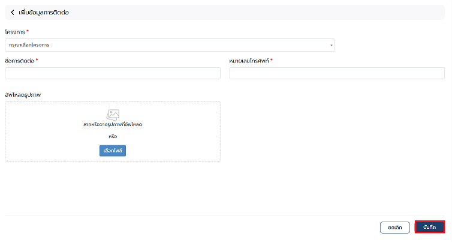<figcaption>
<strong>รูปภาพที่ 118</strong> หน้าจอจัดการการติดต่อของแต่ละโครงการ – การเพิ่มข้อมูลการติดต่อ
</figcaption></figure>

#### **6.1.4 การแก้ไขข้อมูลการติดต่อ**

คลิกไอคอน “ดินสอ”

<figure><figcaption>
<strong>รูปภาพที่ 119</strong> หน้าจอจัดการการติดต่อของแต่ละโครงการ – ปุ่มแก้ไขข้อมูลการติดต่อ
</figcaption></figure>

ระบบจะแสดงหน้าเพิ่มข้อมูลการติดต่อ ผู้ใช้งานแก้ไขข้อมูล จากนั้น คลิกปุ่ม “บันทึก” ระบบจะทำการแก้ไขข้อมูลการติดต่อ

<figure><figcaption>
<strong>รูปภาพที่ 120</strong> หน้าจอจัดการการติดต่อของแต่ละโครงการ – การแก้ไขข้อมูลการติดต่อ
</figcaption></figure>

#### **6.1.5 การดูรายละเอียดข้อมูลการติดต่อ**

ผู้ใช้งานสามารถดูรายละเอียดข้อมูลการติดต่อได้ โดยคลิกที่ไอคอน แว่นขยาย

<figure>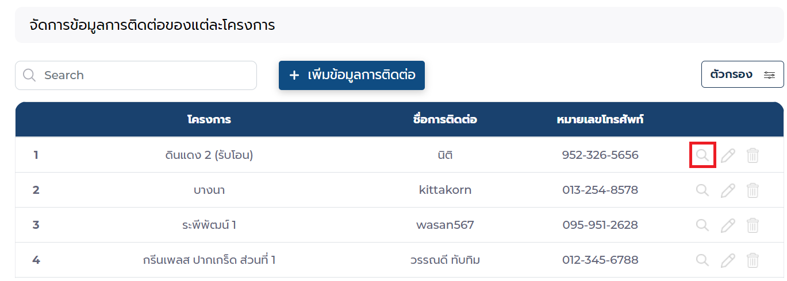<figcaption>
<strong>รูปภาพที่ 121</strong> หน้าจอจัดการการติดต่อของแต่ละโครงการ – ปุ่มแว่นขยายเพื่อดูข้อมูลการติดต่อ
</figcaption></figure>

ระบบจะแสดงหน้าเพิ่มข้อมูลการติดต่อ

<figure>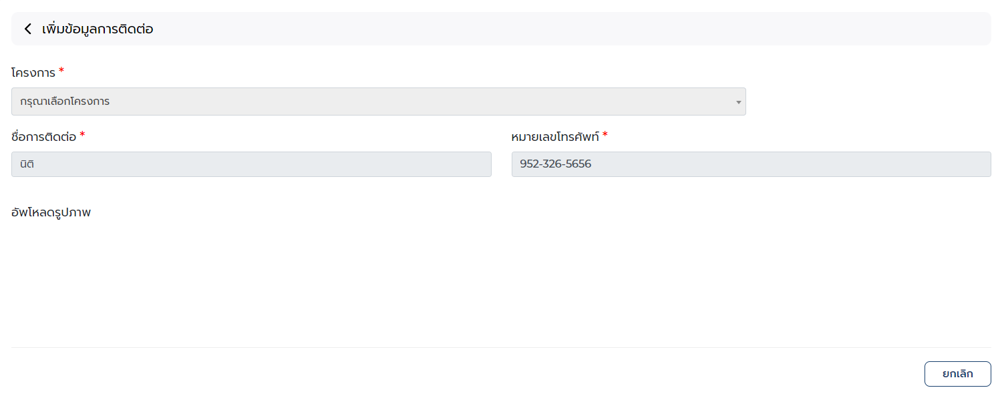<figcaption>
<strong>รูปภาพที่ 122</strong> หน้าจอจัดการการติดต่อของแต่ละโครงการ – การดูข้อมูลการติดต่อ
</figcaption></figure>

#### **6.1.6 การลบข้อมูลการติดต่อ**

ผู้ใช้งานสามารถลบข้อมูลการติดต่อได้ โดยคลิกที่ไอคอน “ถังขยะ”

<figure>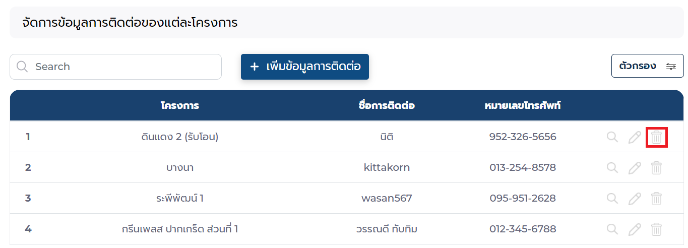<figcaption>
<strong>รูปภาพที่ 123</strong> หน้าจอจัดการการติดต่อของแต่ละโครงการ – การลบข้อมูลการติดต่อ
</figcaption></figure>

### 6.2 จัดการพัสดุ

ไปที่เมนูข้อมูลในโครงการ จากนั้นคลิก “จัดการพัสดุ”

<figure>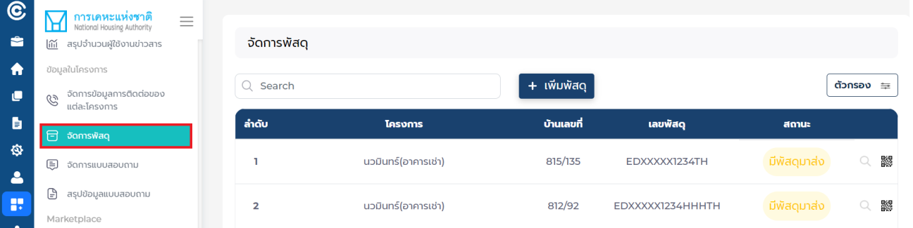<figcaption>
<strong>รูปภาพที่ 124</strong> หน้าจอจัดการพัสดุ
</figcaption></figure>

#### **6.2.1 การค้นหาพัสดุ**

ผู้ใช้งานสามารถระบุข้อมูลที่ต้องการค้นหา จากนั้นคลิกบริเวณอื่นเพื่อให้ระบบค้นหาข้อมูล

<figure>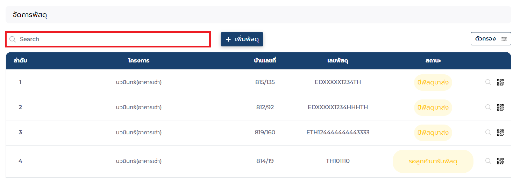<figcaption>
<strong>รูปภาพที่ 125</strong> หน้าจอจัดการพัสดุ – ช่องค้นหาพัสดุ
</figcaption></figure>

#### **6.2.2 ตัวกรองพัสดุ**

คลิกปุ่ม “ตัวกรอง” ระบบจะแสดงหน้าต่างป๊อบอัพ (Pop-up) ตัวกรอง

<figure>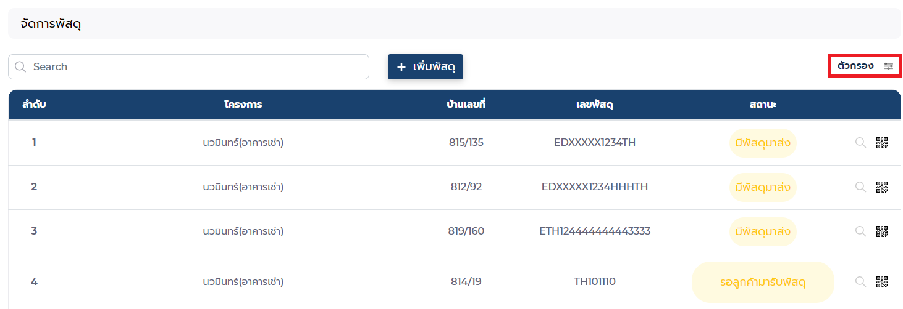<figcaption>
<strong>รูปภาพที่ 126</strong> หน้าจอจัดการพัสดุ – ปุ่มตัวกรอง
</figcaption></figure>

<figure>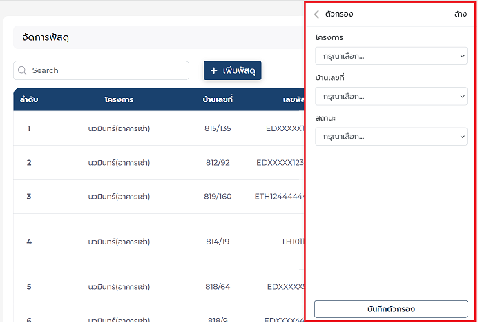<figcaption>
<strong>รูปภาพที่ 127</strong> หน้าจอจัดการพัสดุ – หน้าต่างป๊อบอัพ (Pop-up) ตัวกรอง
</figcaption></figure>

เลือกข้อมูลที่ต้องการกรอง จากนั้นคลิกปุ่ม “บันทึกตัวกรอง” ระบบจะกรองข้อมูลตามเงื่อนไขที่ระบุ

<figure>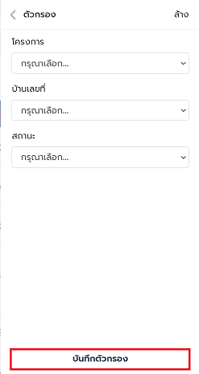<figcaption>
<strong>รูปภาพที่ 128</strong> หน้าจอจัดการพัสดุ – ตัวกรอง
</figcaption></figure>

คลิกที่ “ล้าง” เพื่อล้างข้อมูลที่เลือกได้

<figure>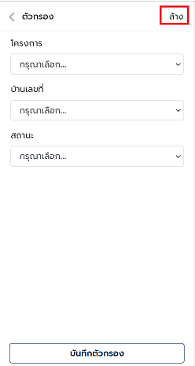<figcaption>
<strong>รูปภาพที่ 129</strong> หน้าจอจัดการพัสดุ – ปุ่มล้างตัวกรอง
</figcaption></figure>

คลิกปุ่ม “<” เพื่อปิดตัวกรอง

<figure>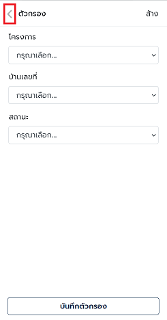<figcaption>
<strong>รูปภาพที่ 130</strong> หน้าจอจัดการพัสดุ – ปุ่มย้อนกลับเพื่อปิดตัวกรอง
</figcaption></figure>

#### **6.2.3 การเพิ่มพัสดุ**

การเพิ่มพัสดุ คลิกปุ่ม “เพิ่มพัสดุ”

<figure>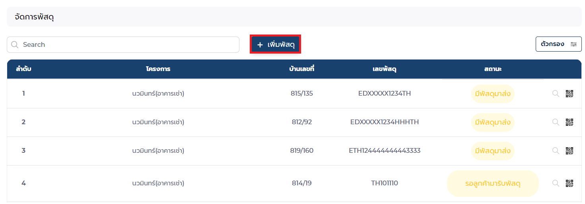<figcaption>
<strong>รูปภาพที่ 131</strong> หน้าจอจัดการพัสดุ – ปุ่มเพิ่มพัสดุ
</figcaption></figure>

ระบบจะแสดงหน้าเพิ่มพัสดุ ผู้ใช้งานกรอกรายละเอียดข้อมูลการติดต่อ จากนั้นคลิกปุ่ม “บันทึก”

<figure>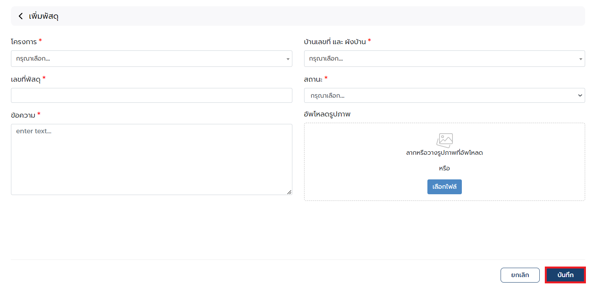<figcaption>
<strong>รูปภาพที่ 132</strong> หน้าจอจัดการพัสดุ – การเพิ่มพัสดุ
</figcaption></figure>

#### **6.2.4 การดูรายละเอียดพัสดุ**

ผู้ใช้งานสามารถดูรายละเอียดพัสดุได้ โดยคลิกที่ไอคอน ดินสอ

<figure>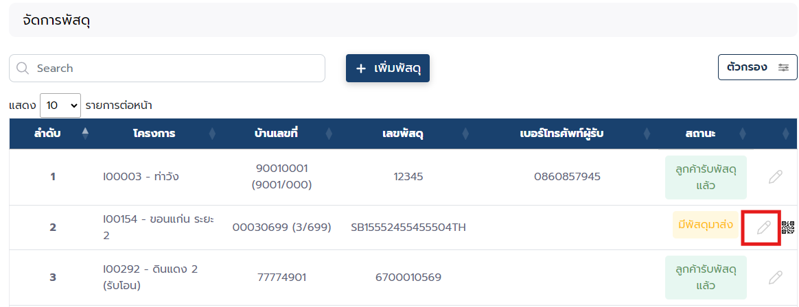<figcaption>
<strong>รูปภาพที่ 133</strong> หน้าจอจัดการพัสดุ – ปุ่มแว่นขยาย
</figcaption></figure>

ระบบจะแสดงหน้าแก้ไขพัสดุ ผู้ใช้งานแก้ไขรายละเอียดพัสดุ จากนั้นคลิกปุ่ม “บันทึก”

<figure>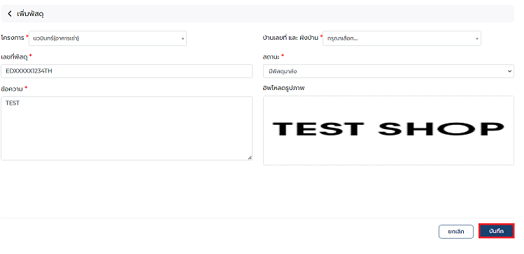<figcaption>
<strong>รูปภาพที่ 134</strong> หน้าจอจัดการพัสดุ – การแก้ไขพัสดุ
</figcaption></figure>

#### **6.2.5 QR Code**

คลิกไอคอน “QR Code”

<figure>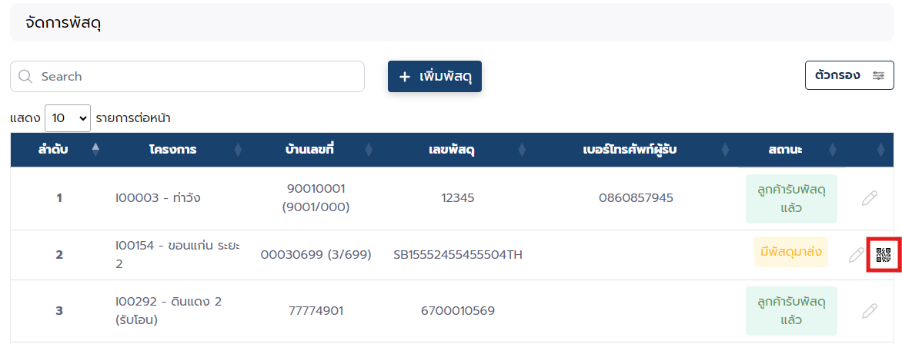<figcaption>
<strong>รูปภาพที่ 135</strong> หน้าจอจัดการพัสดุ – ไอคอน QR Code
</figcaption></figure>

ระบบจะแสดงหน้าต่างป๊อบอัพ (Pop-up) QR Code

<figure>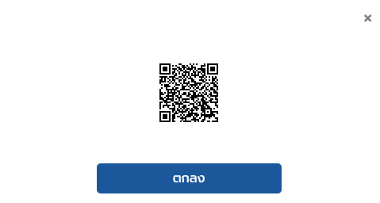<figcaption>
<strong>รูปภาพที่ 136</strong> หน้าจอจัดการพัสดุ – หน้าต่างป๊อบอัพ (Pop-up) QR Code
</figcaption></figure>

### 6.3 จัดการแบบสอบถาม

ไปที่เมนูข้อมูลในโครงการ จากนั้นคลิก “จัดการแบบสอบถาม”

<figure>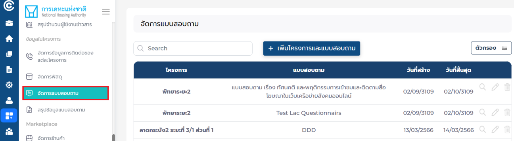<figcaption>
<strong>รูปภาพที่ 137</strong> หน้าจอจัดการแบบสอบถาม
</figcaption></figure>

#### **6.3.1 การค้นหาแบบสอบถาม**

ผู้ใช้งานสามารถระบุข้อมูลแบบสอบถามที่ต้องการค้นหา จากนั้นคลิกบริเวณอื่นเพื่อให้ระบบค้นหาข้อมูล

<figure>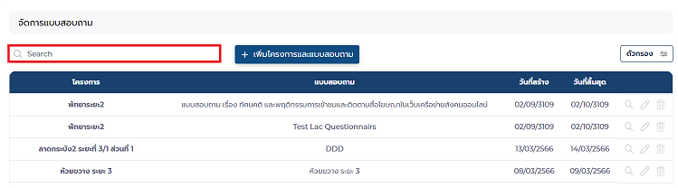<figcaption>
<strong>รูปภาพที่ 138</strong> หน้าจอจัดการแบบสอบถาม - ช่องค้นหา
</figcaption></figure>

#### **6.3.2 ตัวกรองแบบสอบถาม**

คลิกปุ่ม “ตัวกรอง” ระบบจะแสดงหน้าต่างป๊อบอัพ (Pop-up) ตัวกรอง

<figure>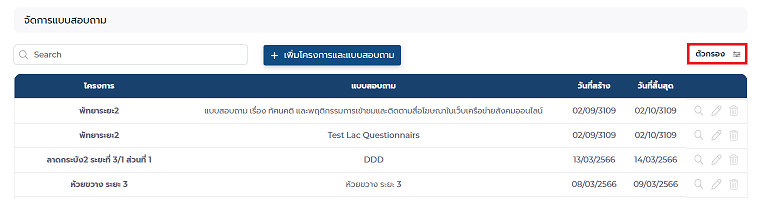<figcaption>
<strong>รูปภาพที่ 139</strong> หน้าจอจัดการแบบสอบถาม – ปุ่มตัวกรอง
</figcaption></figure>

<figure>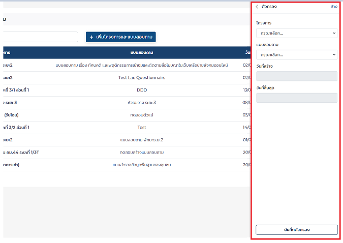<figcaption>
<strong>รูปภาพที่ 140</strong> หน้าจอจัดการแบบสอบถาม – หน้าต่างป๊อบอัพ (Pop-up) ตัวกรอง
</figcaption></figure>

เลือกข้อมูลที่ต้องการกรอง จากนั้นคลิกปุ่ม “บันทึกตัวกรอง” ระบบจะกรองข้อมูลตามเงื่อนไขที่ระบุ

<figure>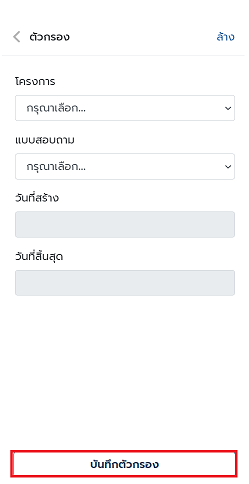<figcaption>
<strong>รูปภาพที่ 141</strong> หน้าจอจัดการแบบสอบถาม – ตัวกรอง
</figcaption></figure>

คลิกที่ “ล้าง” เพื่อล้างข้อมูลที่เลือกได้

<figure><figcaption>
<strong>รูปภาพที่ 142</strong> หน้าจอจัดการแบบสอบถาม – ปุ่มล้างตัวกรอง
</figcaption></figure>

คลิกปุ่ม “<” เพื่อปิดตัวกรอง

<figure>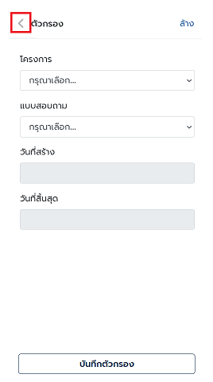<figcaption>
<strong>รูปภาพที่ 143</strong> หน้าจอจัดการแบบสอบถาม – ปุ่มย้อนกลับเพื่อปิดตัวกรอง
</figcaption></figure>

#### **6.3.3 การเพิ่มโครงการและแบบสอบถาม**

การเพิ่มเพิ่มโครงการและแบบสอบถาม คลิกปุ่ม “เพิ่มโครงการและแบบสอบถาม_”_

<figure>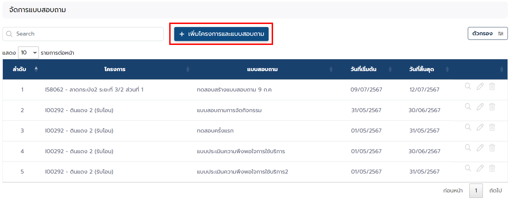<figcaption>
<strong>รูปภาพที่ 144</strong> หน้าจอจัดการแบบสอบถาม – ปุ่มเพิ่มโครงการและแบบสอบถาม
</figcaption></figure>

ระบบจะแสดงหน้า เพิ่มโครงการและแบบสอบถาม ผู้ใช้งานกรอกรายละเอียดโครงการและแบบสอบถาม จากนั้นคลิกปุ่ม “บันทึก”

<figure>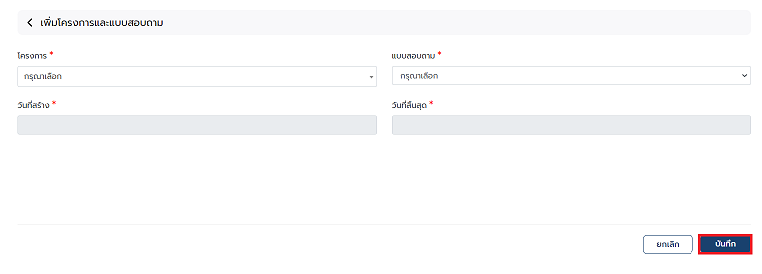<figcaption>
<strong>รูปภาพที่ 145</strong> หน้าจอจัดการแบบสอบถาม – การเพิ่มโครงการและแบบสอบถาม
</figcaption></figure>

#### **6.3.4 การแก้ไขแบบสอบถาม**

คลิกไอคอน “ดินสอ”

<figure><figcaption>
<strong>รูปภาพที่ 146</strong> หน้าจอจัดการแบบสอบถาม – ปุ่มแก้ไขโครงการและแบบสอบถาม
</figcaption></figure>

ระบบจะแสดงหน้าเพิ่มโครงการและแบบสอบถาม ผู้ใช้งานแก้ไขข้อมูล จากนั้น คลิกปุ่ม “บันทึก” ระบบจะทำการแก้ไขข้อมูลโครงการและแบบสอบถาม

<figure>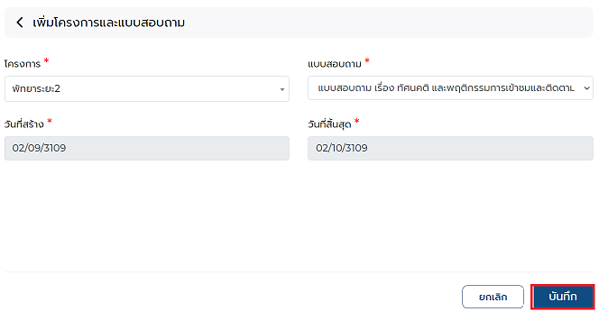<figcaption>
<strong>รูปภาพที่ 147</strong> หน้าจอจัดการแบบสอบถาม – การแก้ไขโครงการและแบบสอบถาม
</figcaption></figure>

#### **6.3.5 การดูรายละเอียดแบบสอบถาม**

ผู้ใช้งานสามารถดูรายละเอียดข้อมูลโครงการและแบบสอบถามได้ โดยคลิกที่ไอคอน แว่นขยาย

<figure>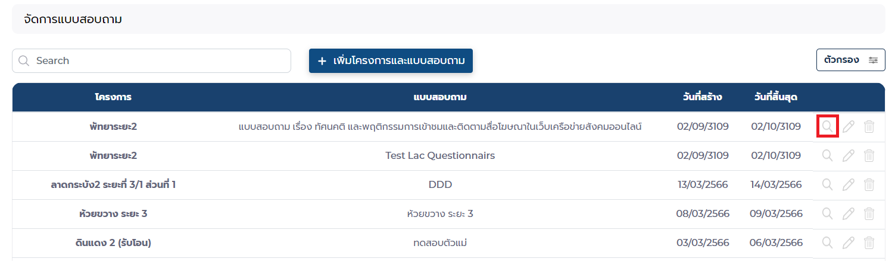<figcaption>
<strong>รูปภาพที่ 148</strong> หน้าจอจัดการแบบสอบถาม – ไอคอนแว่นขยาย
</figcaption></figure>

ระบบจะแสดงหน้าเพิ่มข้อมูลโครงการและแบบสอบถาม

<figure>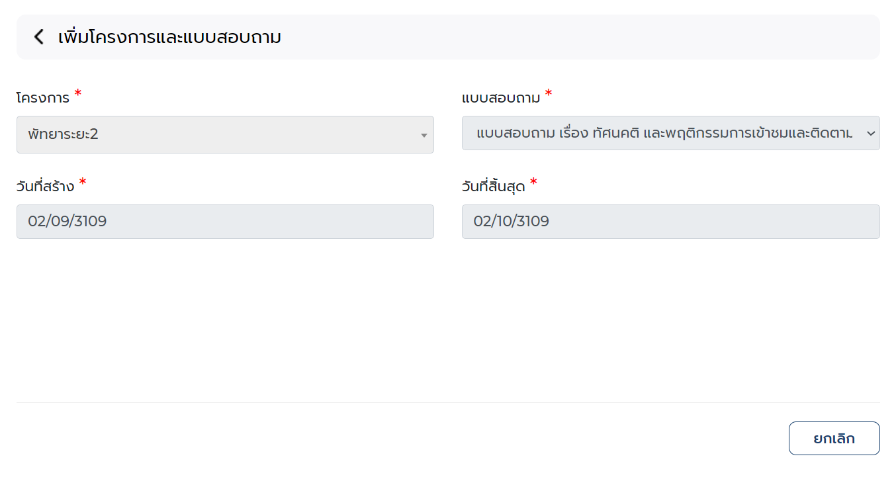<figcaption>
<strong>รูปภาพที่ 149</strong> หน้าจอจัดการแบบสอบถาม – ดูรายละเอียกโครงการและแบบสอบถาม
</figcaption></figure>

#### **6.3.6 การลบรายละเอียดแบบสอบถาม**

ผู้ใช้งานสามารถลบโครงการและแบบสอบถามได้ โดยคลิกที่ไอคอน “ถังขยะ”

<figure>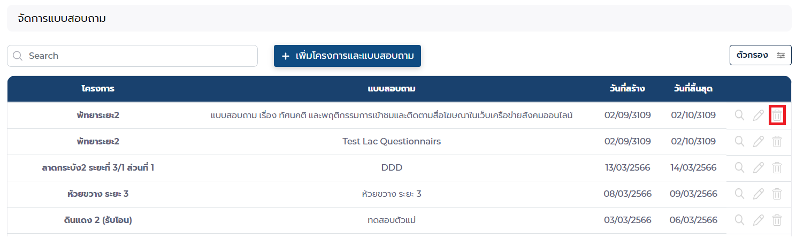<figcaption>
<strong>รูปภาพที่ 150</strong> หน้าจอจัดการแบบสอบถาม – ลบโครงการและแบบสอบถาม
</figcaption></figure>

### 6.4 สรุปข้อมูลแบบสอบถาม

ไปที่เมนูข้อมูลในโครงการ จากนั้นคลิก “สรุปข้อมูลแบบสอบถาม”

<figure>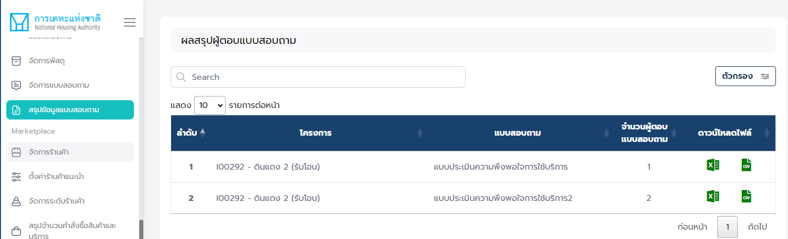<figcaption>
<strong>รูปภาพที่ 151</strong> หน้าจอสรุปข้อมูลแบบสอบถาม
</figcaption></figure>

#### **6.4.1 การค้นหาผู้ตอบแบบสอบถาม**

ผู้ใช้งานสามารถระบุข้อมูลที่ต้องการค้นหา จากนั้นคลิกบริเวณอื่นเพื่อให้ระบบค้นหาข้อมูล

<figure><figcaption>
<strong>รูปภาพที่ 152</strong> สรุปข้อมูลแบบสอบถาม – ช่องค้นหาโครงการ
</figcaption></figure>

#### **6.4.2 ตัวกรองผู้ตอบแบบสอบถาม**

คลิกปุ่ม “ตัวกรอง” ระบบจะแสดงหน้าต่างป๊อบอัพ (Pop-up) ตัวกรอง

<figure>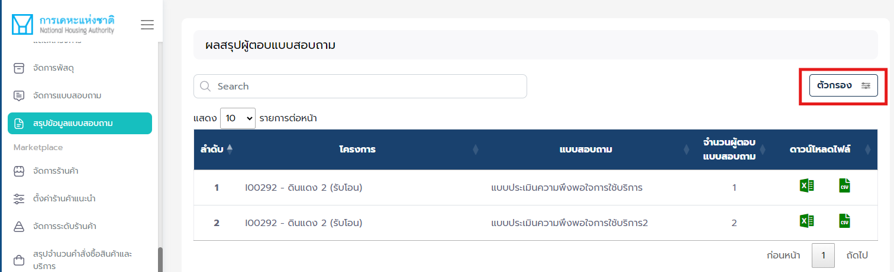<figcaption>
<strong>รูปภาพที่ 153</strong> หน้าจอสรุปข้อมูลแบบสอบถาม – ปุ่มตัวกรอง
</figcaption></figure>

<figure>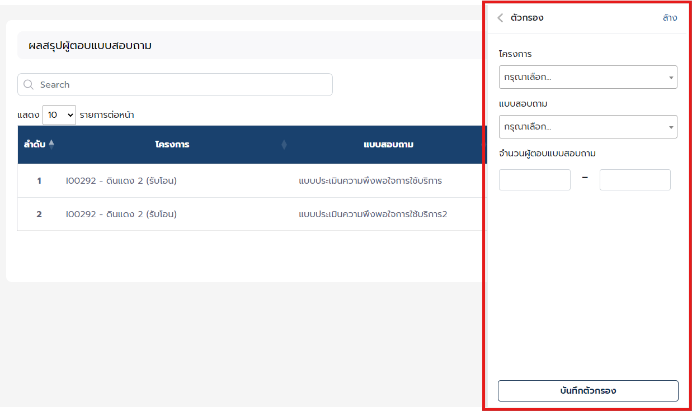<figcaption>
<strong>รูปภาพที่ 154</strong> หน้าจอสรุปข้อมูลแบบสอบถาม – หน้าต่างป๊อบอัพ (Pop-up) ตัวกรอง
</figcaption></figure>

เลือกข้อมูลที่ต้องการกรอง จากนั้นคลิกปุ่ม “บันทึกตัวกรอง” ระบบจะกรองข้อมูลตามเงื่อนไขที่ระบุ

<figure>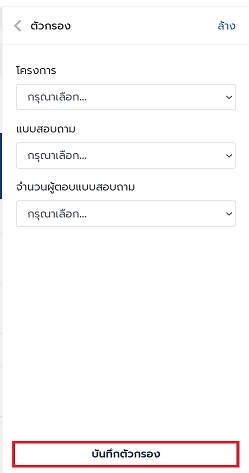<figcaption>
<strong>รูปภาพที่ 155</strong> หน้าจอสรุปข้อมูลแบบสอบถาม – ตัวกรอง
</figcaption></figure>

คลิกที่ “ล้าง” เพื่อล้างข้อมูลที่เลือกได้

<figure>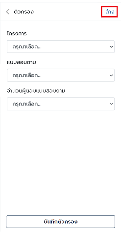<figcaption>
<strong>รูปภาพที่ 156</strong> หน้าจอสรุปข้อมูลแบบสอบถาม – ปุ่มล้างตัวกรอง
</figcaption></figure>

คลิกปุ่ม “<” เพื่อปิดตัวกรอง

<figure>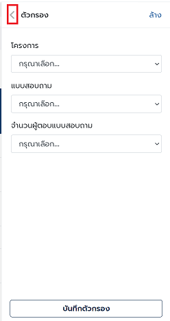<figcaption>
<strong>รูปภาพที่ 157</strong> หน้าจอสรุปข้อมูลแบบสอบถาม – ปุ่มย้อนกลับเพื่อปิดตัวกรอง
</figcaption></figure>

#### **6.4.3 การออกรายงาน (Export Excel)**

ผู้ใช้งานสามารถออกรายงานได้ โดยการคลิกปุ่มไอคอน “Excel” ด้านหลังโครงการที่ต้องการดาวน์โหลด

<figure>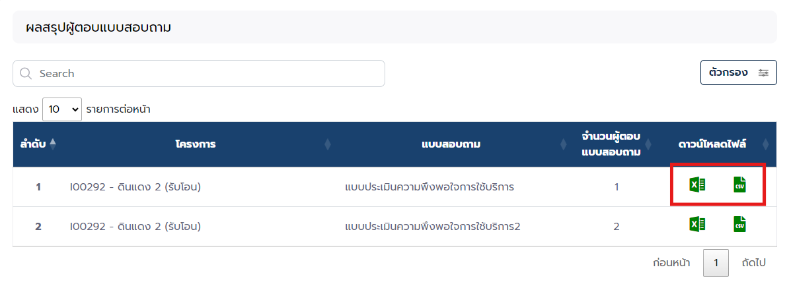<figcaption>
<strong>รูปภาพที่ 158</strong> หน้าจอสรุปข้อมูลแบบสอบถาม – ปุ่มออกรายงาน
</figcaption></figure>

#### **6.4.4 ผลสรุปผู้ตอบแบบสอบถาม**

ผู้ใช้งานสามารถดูผลสรุปผู้ตอบแบบสอบถามได้ที่ตารางผลสรุปผู้ตอบแบบสอบถาม

<figure>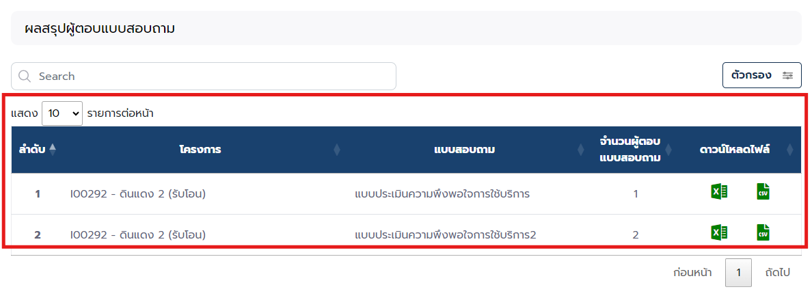<figcaption>
<strong>รูปภาพที่ 159</strong> หน้าจอสรุปข้อมูลแบบสอบถาม – ตารางผลสรุปผู้ตอบแบบสอบถาม
</figcaption></figure>

## **บทที่ 7 การใช้งานในส่วนของ Market Place**

### 7.1 จัดการร้านค้า

ไปที่เมนู Marketplace จากนั้นคลิก “จัดการร้านค้า”

<figure><figcaption>
<strong>รูปภาพที่ 160</strong> หน้าจอจัดการร้านค้า
</figcaption></figure>

#### **7.1.1 ค้นหาร้านค้า**

ผู้ใช้งานสามารถระบุข้อมูลที่ต้องการค้นหา จากนั้นคลิกบริเวณอื่นเพื่อให้ระบบค้นหาข้อมูล

<figure>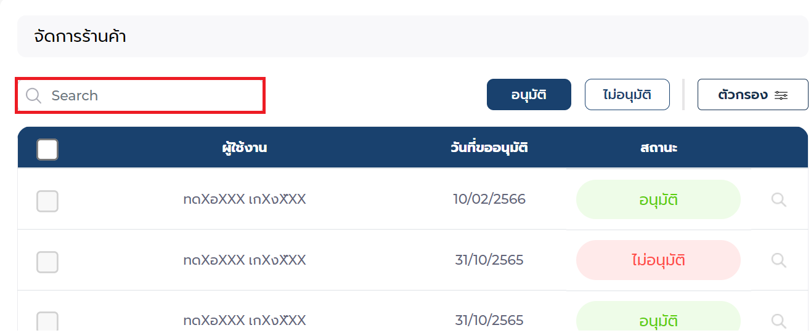<figcaption>
<strong>รูปภาพที่ 161</strong> หน้าจอจัดการร้านค้า – ช่องค้นหาร้านค้า
</figcaption></figure>

#### **7.1.2 ตัวกรองร้านค้า**

คลิกปุ่ม “ตัวกรอง” ระบบจะแสดงหน้าต่างป๊อบอัพ (Pop-up) ตัวกรอง

<figure>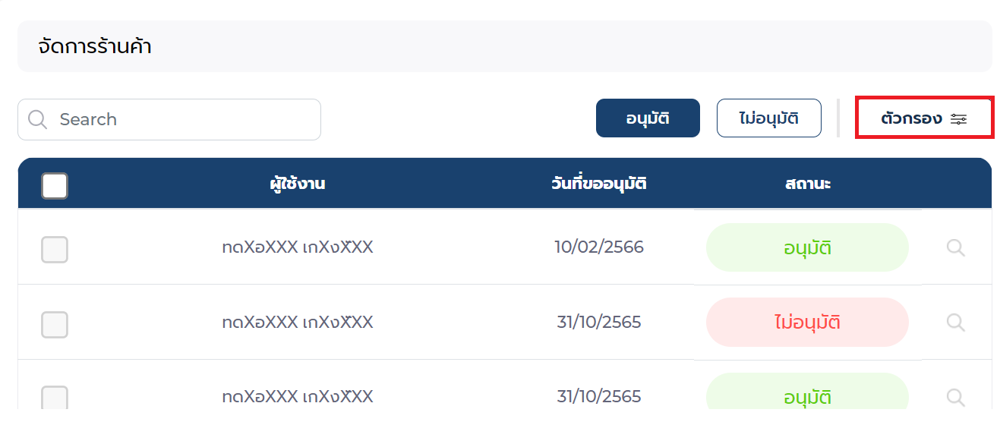<figcaption>
<strong>รูปภาพที่ 162</strong> หน้าจอจัดการร้านค้า – ปุ่มตัวกรอง
</figcaption></figure>

<figure>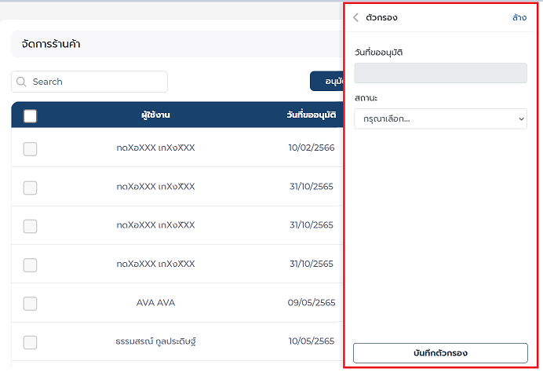<figcaption>
<strong>รูปภาพที่ 163</strong> หน้าจอจัดการร้านค้า – หน้าต่างป๊อบอัพ (Pop-up) ตัวกรอง
</figcaption></figure>

เลือกข้อมูลที่ต้องการกรอง จากนั้นคลิกปุ่ม “บันทึกตัวกรอง” ระบบจะกรองข้อมูลตามเงื่อนไขที่ระบุ

<figure>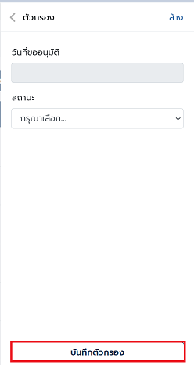<figcaption>
<strong>รูปภาพที่ 164</strong> หน้าจอจัดการร้านค้า – ตัวกรอง
</figcaption></figure>

คลิกที่ “ล้าง” เพื่อล้างข้อมูลที่เลือกได้

<figure>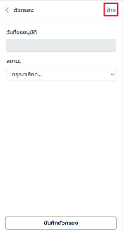<figcaption>
<strong>รูปภาพที่ 165</strong> หน้าจอจัดการร้านค้า – ปุ่มล้างตัวกรอง
</figcaption></figure>

คลิกปุ่ม “<” เพื่อปิดตัวกรอง

<figure>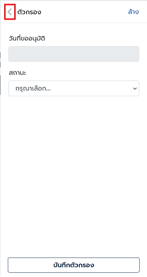<figcaption>
<strong>รูปภาพที่ 166</strong> หน้าจอจัดการร้านค้า – ปุ่มย้อนกลับเพื่อปิดตัวกรอง
</figcaption></figure>

#### **7.1.3 การอนุมัติและไม่อนุมัติร้านค้า**

**การอนุมัติ** ผู้ใช้งานคลิกเลือกรายการที่ต้องการ จากนั้น คลิกปุ่ม “อนุมัติ”

<figure>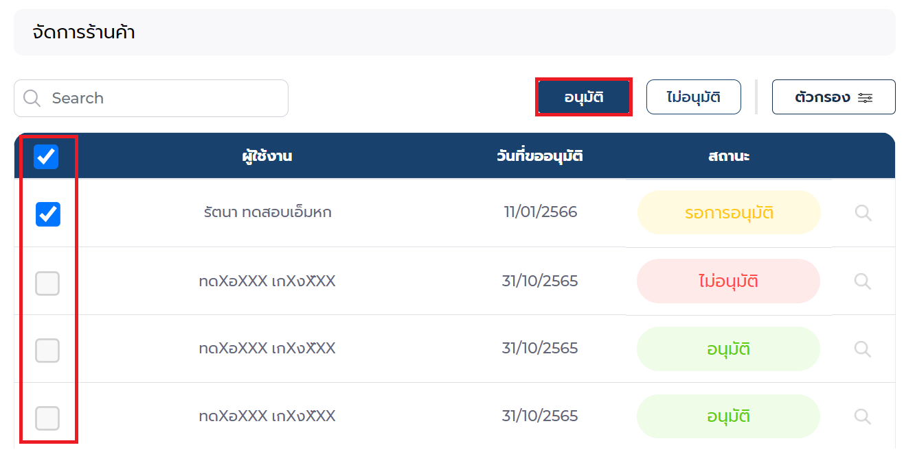<figcaption>
<strong>รูปภาพที่ 167</strong> หน้าจอจัดการร้านค้า – การอนุมัติร้านค้า
</figcaption></figure>

ระบบจะแสดงหน้าต่างป๊อบอัพ (Pop-up) ยืนยันการเปลี่ยนสถานะการใช้งาน จากนั้นคลิกปุ่ม “เปลี่ยน”

<figure>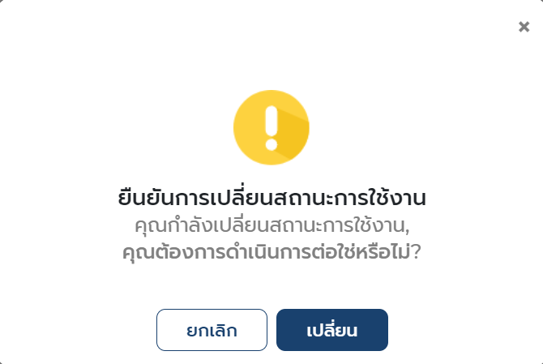<figcaption>
<strong>รูปภาพที่ 168</strong> หน้าจอจัดการร้านค้า – หน้าต่างป๊อบอัพ (Pop-up) ยืนยันการเปลี่ยนสถานะการใช้งาน (อนุมัติ)
</figcaption></figure>

**การไม่อนุมัติ** ผู้ใช้งานคลิกเลือกรายการที่ต้องการ จากนั้น คลิกปุ่ม “ไม่อนุมัติ”

<figure>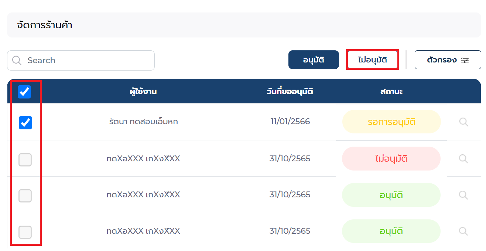<figcaption>
<strong>รูปภาพที่ 169</strong> หน้าจอจัดการร้านค้า – การไม่อนุมัติร้านค้า
</figcaption></figure>

ระบบจะแสดงหน้าต่างป๊อบอัพ (Pop-up) ยืนยันการเปลี่ยนสถานะการใช้งาน จากนั้นคลิกปุ่ม “เปลี่ยน”

<figure><figcaption>
<strong>รูปภาพที่ 170</strong> หน้าจอจัดการร้านค้า – หน้าต่างป๊อบอัพ (Pop-up) ยืนยันการเปลี่ยนสถานะการใช้งาน (ไม่อนุมัติ)
</figcaption></figure>

#### **7.1.4 การดูรายละเอียดร้านค้า**

ผู้ใช้งานสามารถดูรายละเอียดร้านค้าได้ โดยการคลิกที่ไอคอน “แว่นขยาย”

<figure>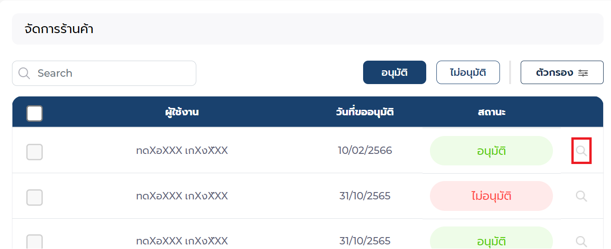<figcaption>
<strong>รูปภาพที่ 171</strong> หน้าจอจัดการร้านค้า – ดูรายละเอียดร้านค้า
</figcaption></figure>

### 7.2 ตั้งค่าร้านค้าแนะนำ

ไปที่เมนู Marketplace จากนั้นคลิก “ตั้งค่าร้านค้าแนะนำ”

<figure>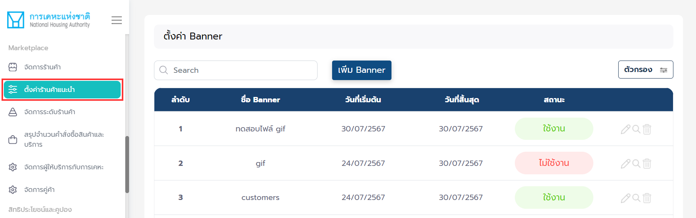<figcaption>
<strong>รูปภาพที่ 172</strong> หน้าจอตั้งค่าร้านค้าแนะนำ (ตั้งค่า Banner)
</figcaption></figure>

#### **7.2.1 การค้นหาร้านค้าแนะนำ**

ผู้ใช้งานสามารถระบุข้อมูลที่ต้องการค้นหา จากนั้นคลิกบริเวณอื่นเพื่อให้ระบบค้นหาข้อมูล

<figure>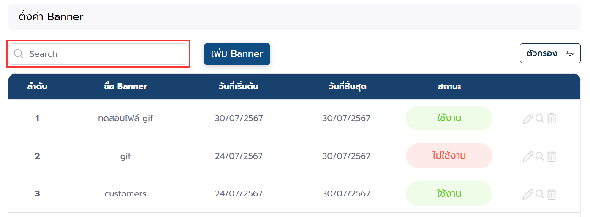<figcaption>
<strong>รูปภาพที่ 173</strong> หน้าจอตั้งค่า Banner – ช่องค้นหาชื่อ Banner
</figcaption></figure>

#### **7.2.2 ตัวกรองร้านค้าแนะนำ**

คลิกปุ่ม “ตัวกรอง” ระบบจะแสดงหน้าต่างป๊อบอัพ (Pop-up) ตัวกรอง

<figure>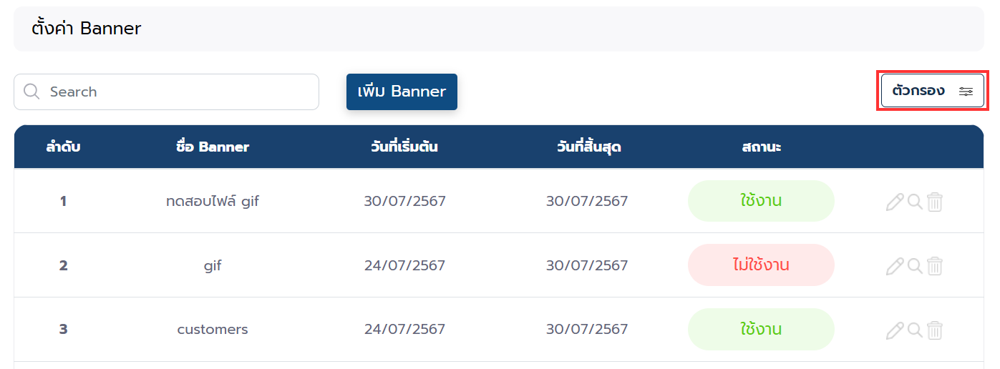<figcaption>
<strong>รูปภาพที่ 174</strong> หน้าจอตั้งค่า Banner – ปุ่มตัวกรอง
</figcaption></figure>

<figure>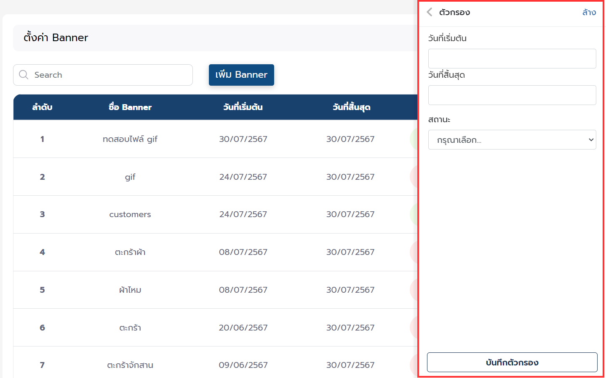<figcaption>
<strong>รูปภาพที่ 175</strong> หน้าจอตั้งค่า Banner – หน้าต่างตัวกรอง
</figcaption></figure>

เลือกข้อมูลที่ต้องการกรอง จากนั้นคลิกปุ่ม “บันทึกตัวกรอง” ระบบจะกรองข้อมูลตามเงื่อนไขที่ระบุ

<figure><figcaption>
<strong>รูปภาพที่ 176</strong> หน้าจอตั้งค่าร้านค้าแนะนำ – ตัวกรอง
</figcaption></figure>

คลิกที่ “ล้าง” เพื่อล้างข้อมูลที่เลือกได้

<figure>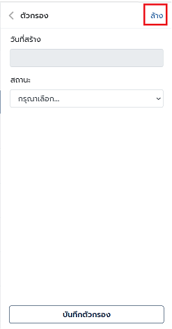<figcaption>
<strong>รูปภาพที่ 177</strong> หน้าจอตั้งค่าร้านค้าแนะนำ – ปุ่มล้างตัวกรอง
</figcaption></figure>

คลิกปุ่ม “<” เพื่อปิดตัวกรอง

<figure>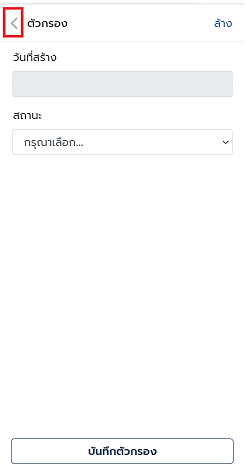<figcaption>
<strong>รูปภาพที่ 178</strong> หน้าจอตั้งค่าร้านค้าแนะนำ – ปุ่มย้อนกลับเพื่อปิดตัวกรอง
</figcaption></figure>

#### **7.2.3 การเพิ่มไฮไลท์**

คลิกปุ่ม “+เพิ่มไฮไลท์”

<figure>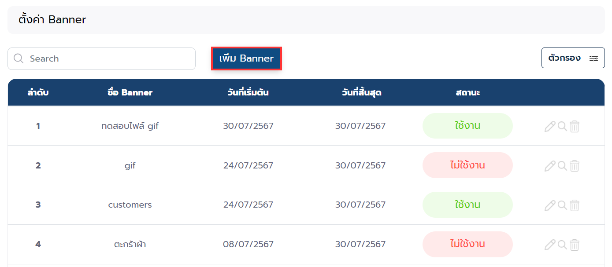<figcaption>
<strong>รูปภาพที่ 179</strong> หน้าจอตั้งค่าร้านค้าแนะนำ – ปุ่มเพิ่มไฮไลท์
</figcaption></figure>

ระบบจะแสดงหน้าเพิ่มไฮไลท์ Market Place ผู้ใช้งานกรอกรายละเอียดจากนั้นคลิกปุ่ม “บันทึก”

<figure>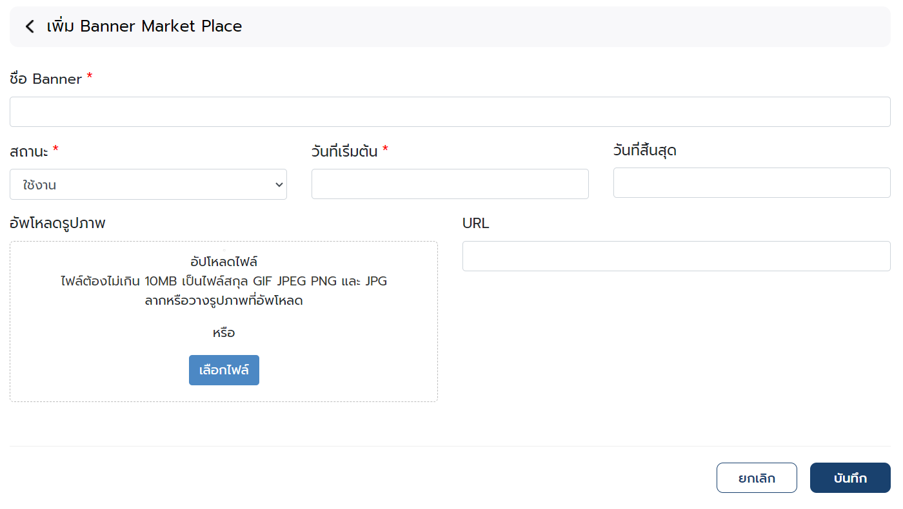<figcaption>
<strong>รูปภาพที่ 180</strong> หน้าจอตั้งค่าร้านค้าแนะนำ – การเพิ่มไฮไลท์ Marketplace
</figcaption></figure>

#### **7.2.4 การแก้ไขไฮไลท์ร้านค้าแนะนำ**

ผู้ใช้งานสามารถแก้ไขไฮไลท์ได้ โดยการคลิกที่ไอคอน “ดินสอ”

<figure>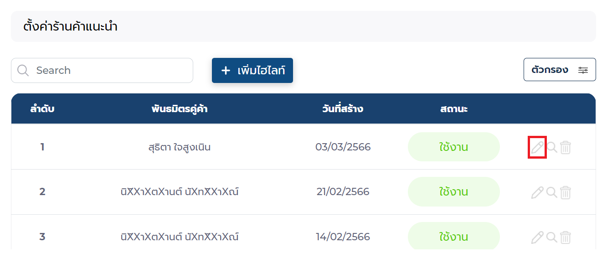<figcaption>
<strong>รูปภาพที่ 181</strong> หน้าจอตั้งค่าร้านค้าแนะนำ – ไอคอนดินสอแก้ไขไฮไลท์ Marketplace
</figcaption></figure>

ระบบจะแสดงหน้าเพิ่มไฮไลท์ Market Place ผู้ใช้งานแก้ไขรายละเอียดจากนั้นคลิกปุ่ม “บันทึก”

<figure>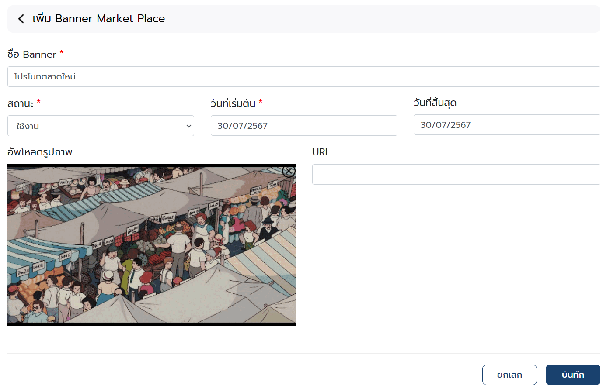<figcaption>
<strong>รูปภาพที่ 182</strong> หน้าจอตั้งค่าร้านค้าแนะนำ – การแก้ไขไฮไลท์ Marketplace
</figcaption></figure>

#### **7.2.5 การลบไฮไลท์ร้านค้าแนะนำ**

ผู้ใช้งานสามารถลบไฮไลท์ได้ โดยการคลิกที่ไอคอน “ถังขยะ”

<figure>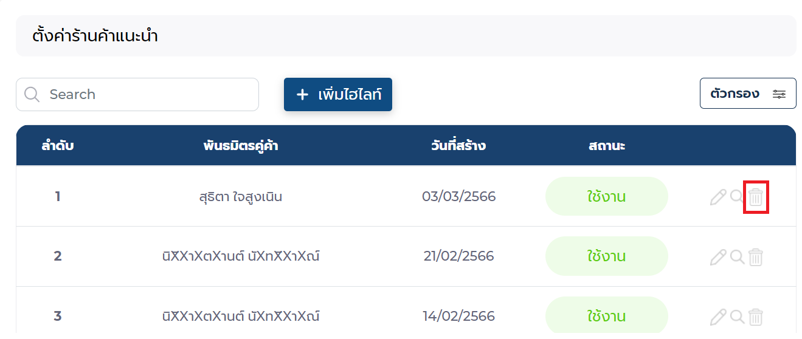<figcaption>
<strong>รูปภาพที่ 183</strong> หน้าจอตั้งค่าร้านค้าแนะนำ – การลบไฮไลท์ Marketplace
</figcaption></figure>

#### **7.2.6 การดูรายละเอียดร้านค้าแนะนำ**

ผู้ใช้งานสามารถดูราละเอียดร้านค้าแนะนำได้ โดยการคลิกที่ไอคอน “แว่นขยาย”

<figure>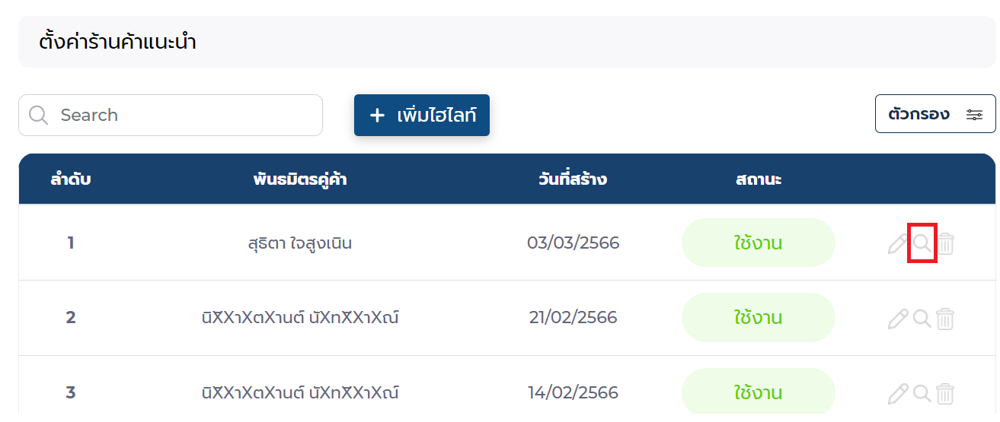<figcaption>
<strong>รูปภาพที่ 184</strong> หน้าจอตั้งค่าร้านค้าแนะนำ – การดูรายละเอียดไฮไลท์ Marketplace
</figcaption></figure>

### 7.3 จัดการระดับร้านค้า

ไปที่เมนู Marketplace จากนั้นคลิก “จัดการระดับร้านค้า”

<figure>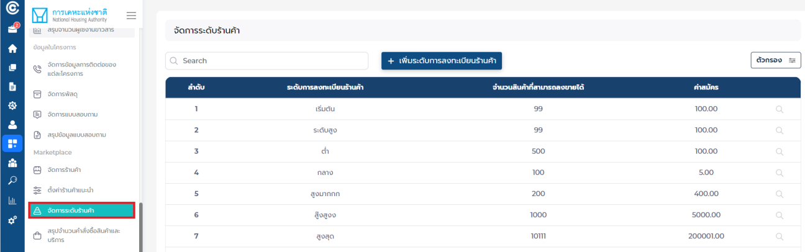<figcaption>
<strong>รูปภาพที่ 185</strong> หน้าจอจัดการระดับร้านค้า
</figcaption></figure>

#### **7.3.1 การค้นหาระดับการลงทะเบียนร้านค้า**

ผู้ใช้งานสามารถระบุข้อมูลที่ต้องการค้นหา จากนั้นคลิกบริเวณอื่นเพื่อให้ระบบค้นหาข้อมูล

<figure>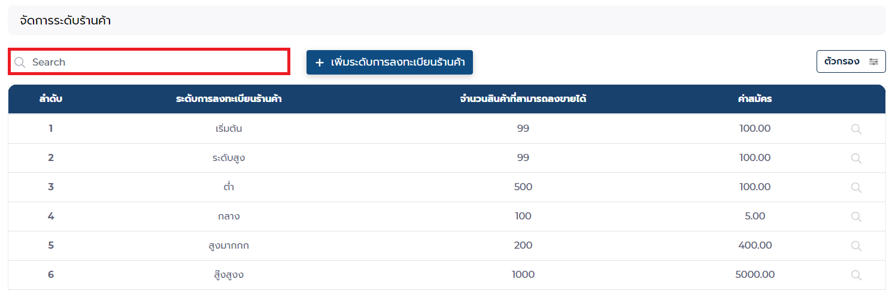<figcaption>
<strong>รูปภาพที่ 186</strong> หน้าจอจัดการระดับร้านค้า – ช่องค้นหา
</figcaption></figure>

#### **7.3.2 ตัวกรองระดับการลงทะเบียนร้านค้า**

คลิกปุ่ม “ตัวกรอง” ระบบจะแสดงหน้าต่างป๊อบอัพ (Pop-up) ตัวกรอง

<figure>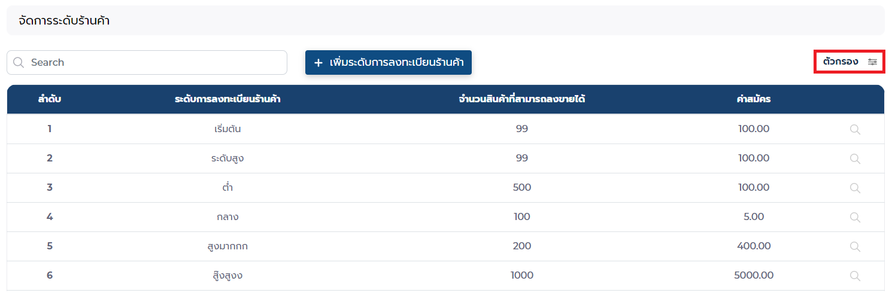<figcaption>
<strong>รูปภาพที่ 187</strong> หน้าจอจัดการระดับร้านค้า – ปุ่มตัวกรอง
</figcaption></figure>

<figure>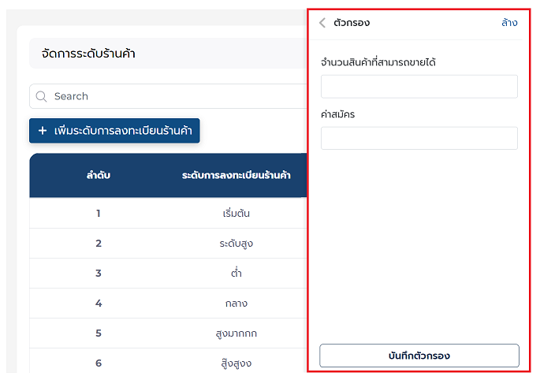<figcaption>
<strong>รูปภาพที่ 188</strong> หน้าจอจัดการระดับร้านค้า – หน้าต่างป๊อบอัพ (Pop-up) ตัวกรอง
</figcaption></figure>

เลือกข้อมูลที่ต้องการกรอง จากนั้นคลิกปุ่ม “บันทึกตัวกรอง” ระบบจะกรองข้อมูลตามเงื่อนไขที่ระบุ

<figure>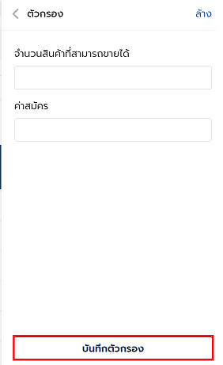<figcaption>
<strong>รูปภาพที่ 189</strong> หน้าจอจัดการระดับร้านค้า – ตัวกรอง
</figcaption></figure>

คลิกที่ “ล้าง” เพื่อล้างข้อมูลที่เลือกได้

<figure>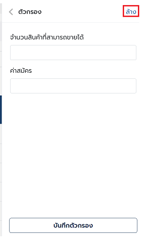<figcaption>
<strong>รูปภาพที่ 190</strong> หน้าจอจัดการระดับร้านค้า – ปุ่มล้างตัวกรอง
</figcaption></figure>

คลิกปุ่ม “<” เพื่อปิดตัวกรอง

<figure>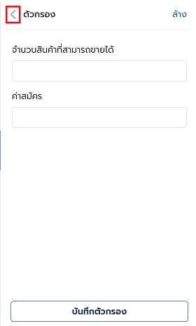<figcaption>
<strong>รูปภาพที่ 191</strong> หน้าจอหน้าจอจัดการระดับร้านค้า – ปุ่มย้อนกลับเพื่อปิดตัวกรอง
</figcaption></figure>

#### **7.3.3 การเพิ่มระดับการลงทะเบียนร้านค้า**

คลิกปุ่ม “เพิ่มระดับการลงทะเบียนร้านค้า”

<figure>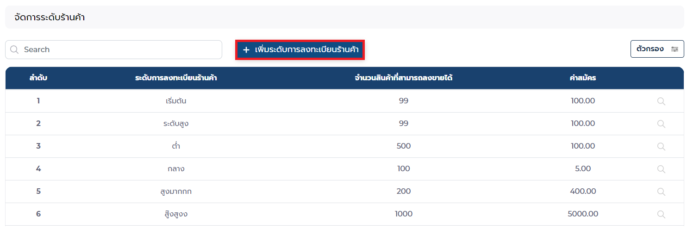<figcaption>
<strong>รูปภาพที่ 192</strong> หน้าจอจัดการระดับร้านค้า – ปุ่มเพิ่มระดับการลงทะเบียนร้านค้า
</figcaption></figure>

ระบบจะแสดงหน้าเพิ่มระดับการลงทะเบียนร้านค้า ผู้ใช้งานกรอกรายละเอียด จากนั้นคลิกปุ่ม “บันทึก”

<figure>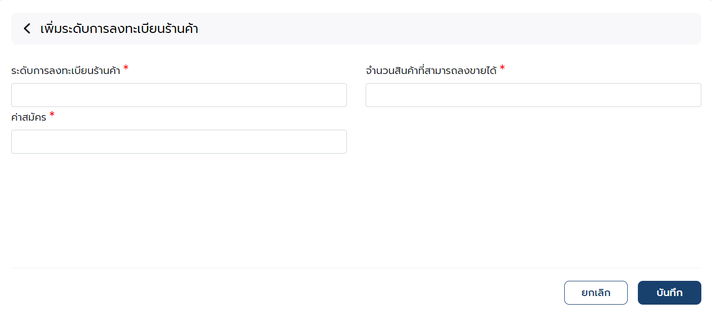<figcaption>
<strong>รูปภาพที่ 193</strong> หน้าจอจัดการระดับร้านค้า – การเพิ่มระดับการลงทะเบียนร้านค้า
</figcaption></figure>

**7.3.4 การดูรายละเอียดระดับการลงทะเบียนร้านค้า**

ผู้ใช้งานสามารถดูรายละเอียดระดับการลงทะเบียนร้านค้า โดยการคลิกที่ไอคอน “ แว่นขยาย”

<figure>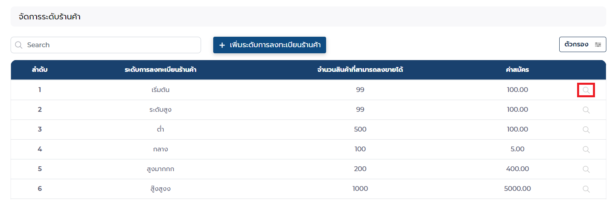<figcaption>
<strong>รูปภาพที่ 194</strong> หน้าจอจัดการระดับร้านค้า – การดูรายละเอียดระดับการลงทะเบียนร้านค้า
</figcaption></figure>

### 7.4 สรุปจำนวนคำสั่งซื้อสินค้าและบริการ

ไปที่เมนู Marketplace จากนั้นคลิก “สรุปจำนวนคำสั่งซื้อสินค้าและบริการ”

<figure>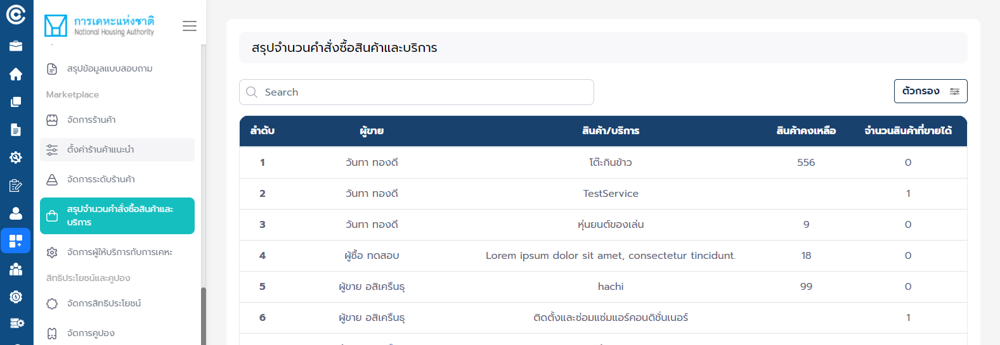<figcaption>
<strong>รูปภาพที่ 195</strong> หน้าจอสรุปจำนวนคำสั่งซื้อสินค้าและบริการ
</figcaption></figure>

**7.4.1 การค้นหาคำสั่งซื้อสินค้าและบริการ**

ผู้ใช้งานสามารถระบุข้อมูลที่ต้องการค้นหา จากนั้นคลิกบริเวณอื่นเพื่อให้ระบบค้นหาข้อมูล

<figure>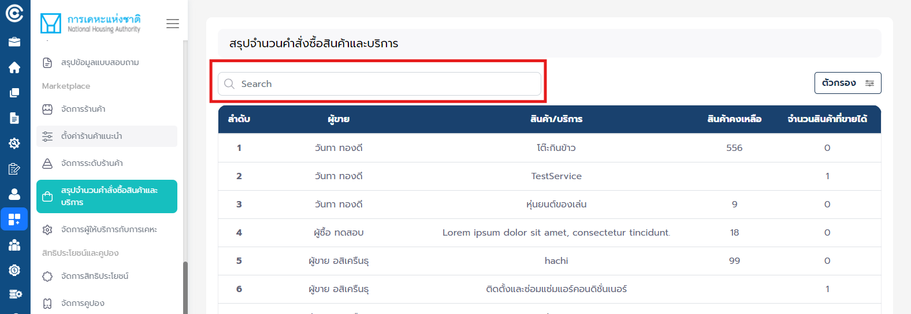<figcaption>
<strong>รูปภาพที่ 196</strong> สรุปจำนวนคำสั่งซื้อสินค้าและบริการ – ช่องค้นหาคำสั่งซื้อสินค้าและบริการ
</figcaption></figure>

**7.4.2 ตัวกรองคำสั่งซื้อสินค้าและบริการ**

คลิกปุ่ม “ตัวกรอง” ระบบจะแสดงหน้าต่างป๊อบอัพ (Pop-up) ตัวกรอง

<figure>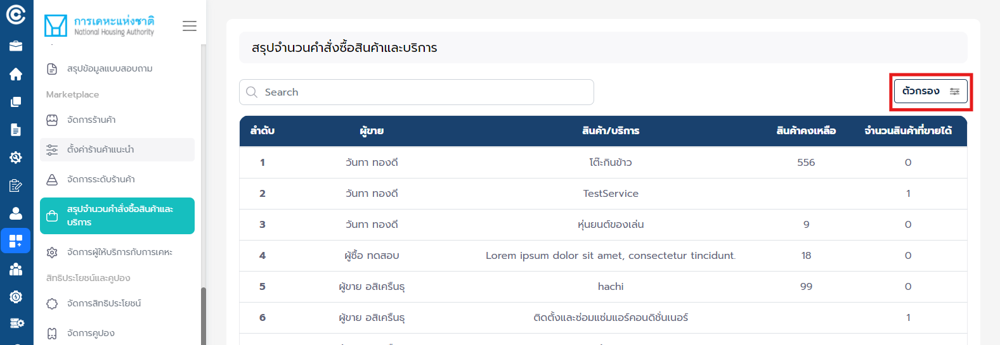<figcaption>
<strong>รูปภาพที่ 197</strong> สรุปจำนวนคำสั่งซื้อสินค้าและบริการ – ปุ่มตัวกรอง
</figcaption></figure>

<figure>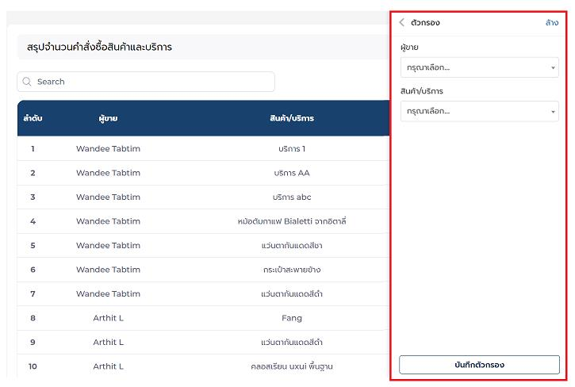<figcaption>
<strong>รูปภาพที่ 198</strong> หน้าจอสรุปจำนวนคำสั่งซื้อสินค้าและบริการ – หน้าต่างป๊อบอัพ (Pop-up) ตัวกรอง
</figcaption></figure>

เลือกข้อมูลที่ต้องการกรอง จากนั้นคลิกปุ่ม “บันทึกตัวกรอง” ระบบจะกรองข้อมูลตามเงื่อนไขที่ระบุ

<figure>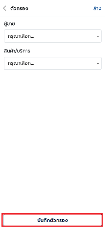<figcaption>
<strong>รูปภาพที่ 199</strong> หน้าจอสรุปจำนวนคำสั่งซื้อสินค้าและบริการ – ตัวกรอง
</figcaption></figure>

คลิกที่ “ล้าง” เพื่อล้างข้อมูลที่เลือกได้

<figure>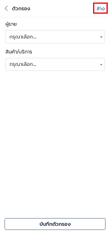<figcaption>
<strong>รูปภาพที่ 200</strong> หน้าจอสรุปจำนวนคำสั่งซื้อสินค้าและบริการ – ปุ่มล้างตัวกรอง
</figcaption></figure>

คลิกปุ่ม “<” เพื่อปิดตัวกรอง

<figure>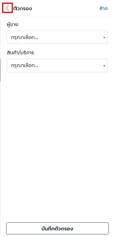<figcaption>
<strong>รูปภาพที่ 201</strong> หน้าจอสรุปจำนวนคำสั่งซื้อสินค้าและบริการ – ปุ่มย้อนกลับเพื่อปิดตัวกรอง
</figcaption></figure>

**7.4.3 สรุปจำนวนคำสั่งซื้อสินค้าและบริการ**

ผู้ใช้งานสามารถดูรายการสรุปคำสั่งซื้อสินค้าและบริการได้ที่ตารางสรุปคำสั่งซื้อสินค้าและบริการ

<figure>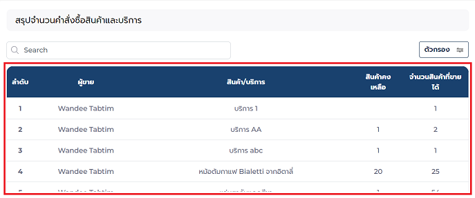<figcaption>
<strong>รูปภาพที่ 202</strong> หน้าจอสรุปจำนวนคำสั่งซื้อสินค้าและบริการ – ตารางสรุปคำสั่งซื้อสินค้าและบริการ
</figcaption></figure>

## **บทที่ 8 การใช้งานในส่วนของ สิทธิประโยชน์และคูปอง**

### 8.1 จัดการสิทธิประโยชน์

ไปที่เมนู สิทธิประโยชน์และคูปอง จากนั้นคลิก “จัดการสิทธิประโยชน์”

<figure>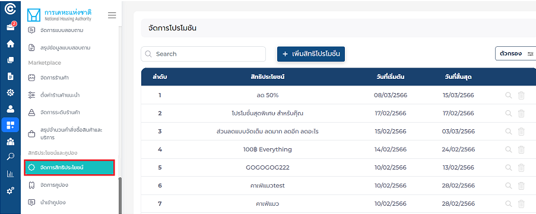<figcaption>
<strong>รูปภาพที่ 203</strong> หน้าจอจัดการสิทธิประโยชน์
</figcaption></figure>

#### **8.1.1 การค้นหาสิทธิประโยชน์**

ผู้ใช้งานสามารถระบุข้อมูลที่ต้องการค้นหา จากนั้นคลิกบริเวณอื่นเพื่อให้ระบบค้นหาข้อมูล

<figure>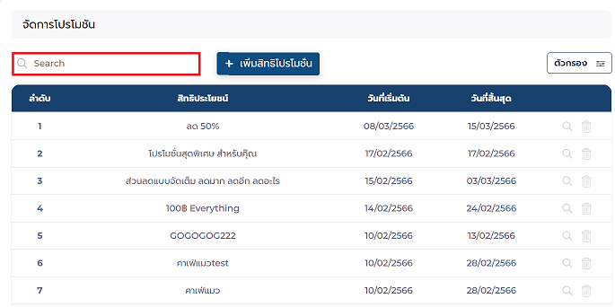<figcaption>
<strong>รูปภาพที่ 204</strong> หน้าจอจัดการสิทธิประโยชน์ – ช่องค้นหาสิทธิประโยชน์
</figcaption></figure>

#### **8.1.2 ตัวกรองสิทธิประโยชน์**

คลิกปุ่ม “ตัวกรอง” ระบบจะแสดงหน้าต่างป๊อบอัพ (Pop-up) ตัวกรอง

<figure>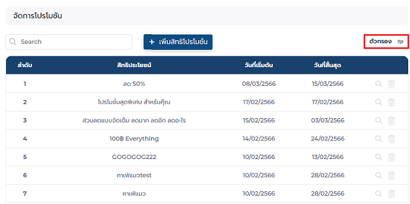<figcaption>
<strong>รูปภาพที่ 205</strong> หน้าจอจัดการสิทธิประโยชน์ – ปุ่มตัวกรอง
</figcaption></figure>

<figure>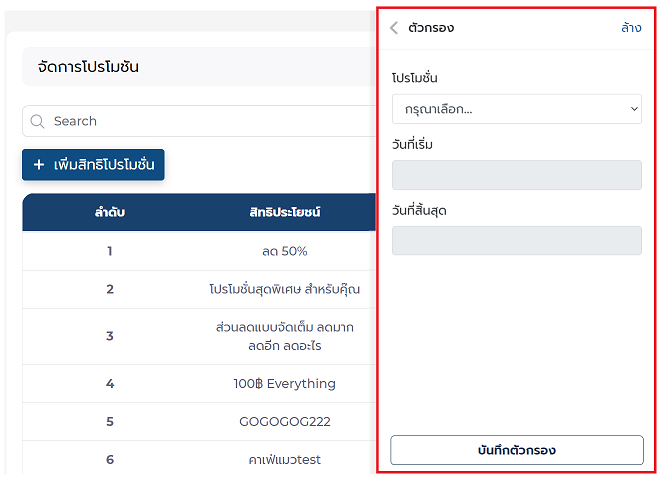<figcaption>
<strong>รูปภาพที่ 206</strong> หน้าจอจัดการสิทธิประโยชน์ – หน้าต่างป๊อบอัพ (Pop-up) ตัวกรอง
</figcaption></figure>

เลือกข้อมูลที่ต้องการกรอง จากนั้นคลิกปุ่ม “บันทึกตัวกรอง” ระบบจะกรองข้อมูลตามเงื่อนไขที่ระบุ

<figure><figcaption>
<strong>รูปภาพที่ 207</strong> หน้าจอจัดการสิทธิประโยชน์ – ตัวกรอง
</figcaption></figure>

คลิกที่ “ล้าง” เพื่อล้างข้อมูลที่เลือกได้

<figure>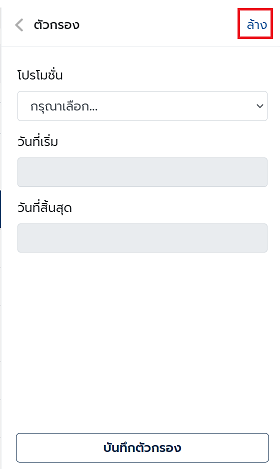<figcaption>
<strong>รูปภาพที่ 208</strong> หน้าจอจัดการสิทธิประโยชน์ – ปุ่มล้างตัวกรอง
</figcaption></figure>

คลิกปุ่ม “<” เพื่อปิดตัวกรอง

<figure>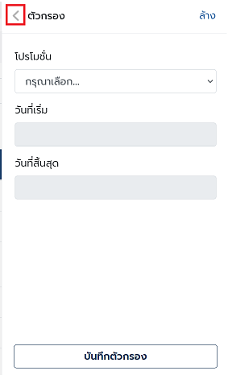<figcaption>
<strong>รูปภาพที่ 209</strong> หน้าจอจัดการสิทธิประโยชน์ – ปุ่มย้อนกลับเพื่อปิดตัวกรอง
</figcaption></figure>

#### **8.1.3 การเพิ่มสิทธิประโยชน์**

คลิกปุ่ม “+เพิ่มสิทธิโปรโมชั่น”

<figure>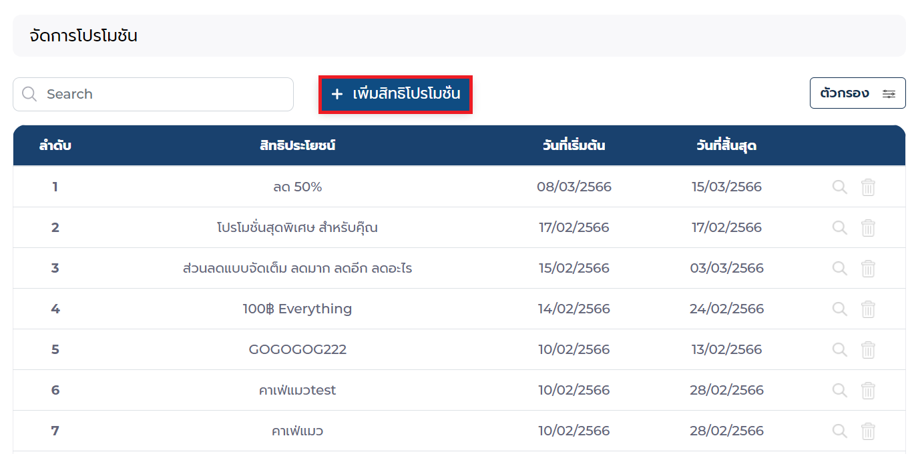<figcaption>
<strong>รูปภาพที่ 210</strong> หน้าจอจัดการสิทธิประโยชน์ – ปุ่มเพิ่มสิทธิโปรโมชั่น
</figcaption></figure>

ระบบจะแสดงหน้าเพิ่มสิทธิโปรโมชั่น ผู้ใช้งานกรอกรายละเอียด จากนั้นคลิกปุ่ม “บันทึก”

<figure>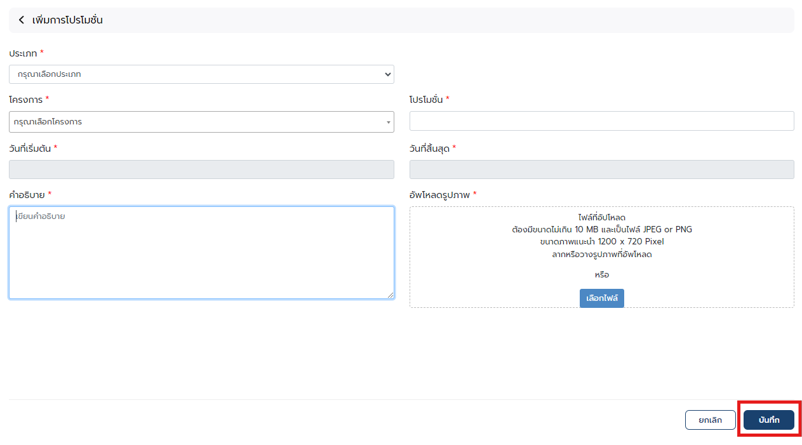<figcaption>
<strong>รูปภาพที่ 211</strong> หน้าจอจัดการสิทธิประโยชน์ – การเพิ่มสิทธิโปรโมชั่น
</figcaption></figure>

#### **8.1.4 การลบสิทธิประโยชน์**

ผู้ใช้งานสามารถลบสิทธิประโยชน์ได้ โดยการคลิกที่ไอคอน “ถังขยะ”

<figure>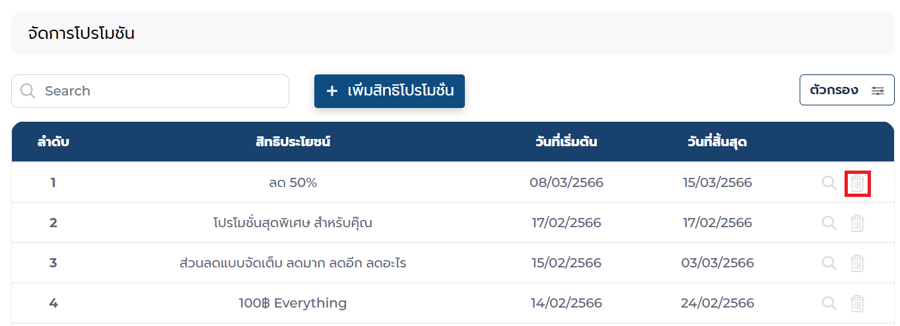<figcaption>
<strong>รูปภาพที่ 212</strong> หน้าจอจัดการสิทธิประโยชน์ – การลบสิทธิประโยชน์
</figcaption></figure>

#### **8.1.5 การดูรายละเอียดสิทธิประโยชน์**

ผู้ใช้งานสามารถดูรายละเอียดสิทธิประโยชน์ได้ โดยการคลิกที่ไอคอน “แว่นขยาย”

<figure>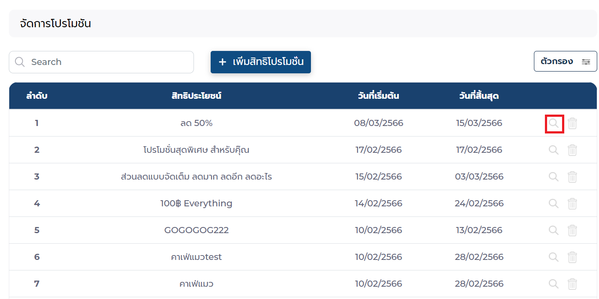<figcaption>
<strong>รูปภาพที่ 213</strong> หน้าจอจัดการสิทธิประโยชน์ – การดูรายละเอียดสิทธิประโยชน์
</figcaption></figure>

### 8.2 จัดการคูปอง

ไปที่เมนู สิทธิประโยชน์และคูปอง จากนั้นคลิก “จัดการคูปอง”

<figure>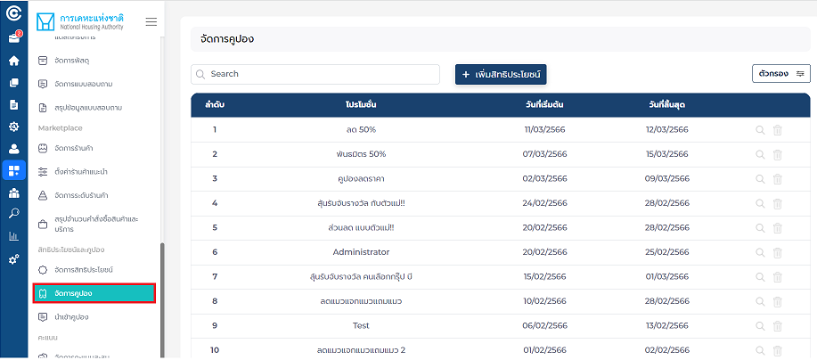<figcaption>
<strong>รูปภาพที่ 214</strong> หน้าจอจัดการคูปอง
</figcaption></figure>

#### **8.2.1 การค้นหาคูปอง**

ผู้ใช้งานสามารถระบุข้อมูลที่ต้องการค้นหา จากนั้นคลิกบริเวณอื่นเพื่อให้ระบบค้นหาข้อมูล

<figure>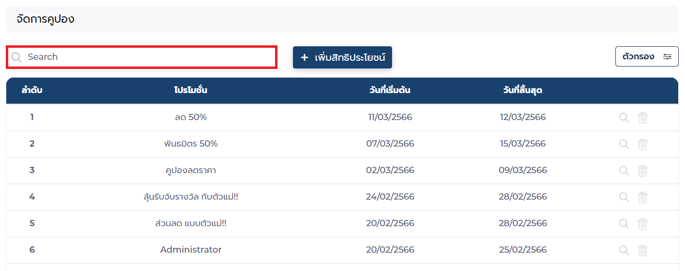<figcaption>
<strong>รูปภาพที่ 215</strong> หน้าจอจัดการคูปอง– ช่องค้นหาโปรโมชั่น
</figcaption></figure>

#### **8.2.2 ตัวกรองคูปอง**

คลิกปุ่ม “ตัวกรอง” ระบบจะแสดงหน้าต่างป๊อบอัพ (Pop-up) ตัวกรอง

<figure>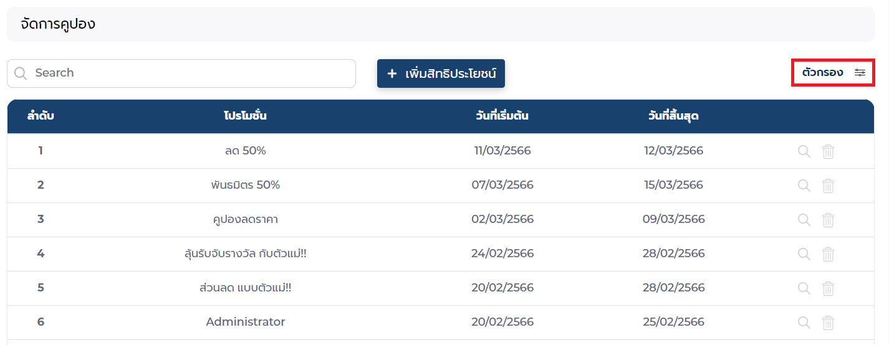<figcaption>
<strong>รูปภาพที่ 216</strong> หน้าจอจัดการคูปอง – ปุ่มตัวกรอง
</figcaption></figure>

<figure>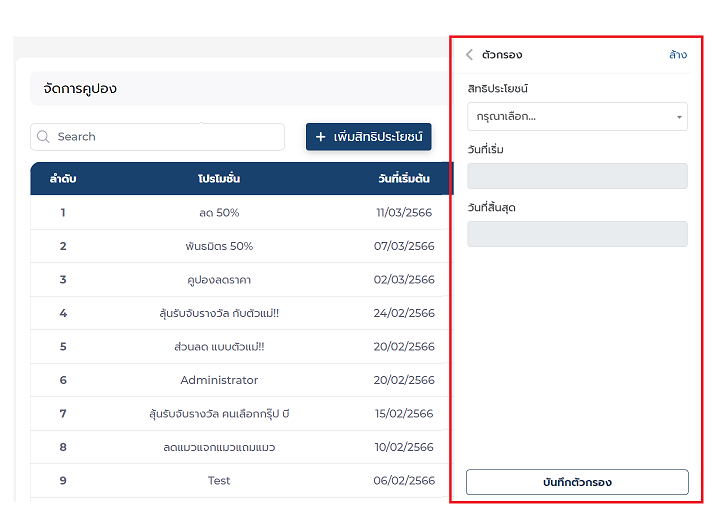<figcaption>
<strong>รูปภาพที่ 217</strong> หน้าจอจัดการคูปอง– หน้าต่างป๊อบอัพ (Pop-up) ตัวกรอง
</figcaption></figure>

เลือกข้อมูลที่ต้องการกรอง จากนั้นคลิกปุ่ม “บันทึกตัวกรอง” ระบบจะกรองข้อมูลตามเงื่อนไขที่ระบุ

<figure>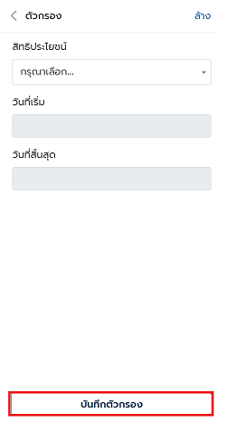<figcaption>
<strong>รูปภาพที่ 218</strong> หน้าจอจัดการคูปอง– ตัวกรอง
</figcaption></figure>

คลิกที่ “ล้าง” เพื่อล้างข้อมูลที่เลือกได้

<figure>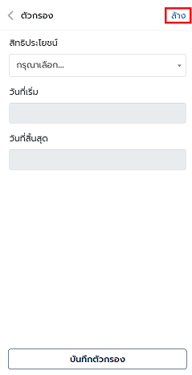<figcaption>
<strong>รูปภาพที่ 219</strong> หน้าจอจัดการคูปอง – ปุ่มล้างตัวกรอง
</figcaption></figure>

คลิกปุ่ม “<” เพื่อปิดตัวกรอง

<figure>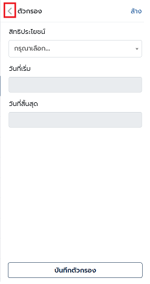<figcaption>
<strong>รูปภาพที่ 220</strong> หน้าจอจัดการคูปอง– ปุ่มย้อนกลับเพื่อปิดตัวกรอง
</figcaption></figure>

#### **8.2.3 การเพิ่มคูปอง**

คลิกปุ่ม “+เพิ่มสิทธิโปรโมชั่น”

<figure>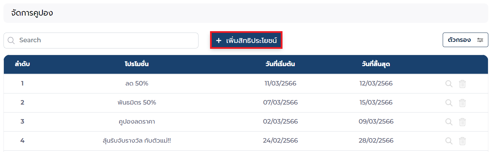<figcaption>
<strong>รูปภาพที่ 221</strong> หน้าจอจัดการคูปอง – ปุ่มเพิ่มสิทธิประโยชน์
</figcaption></figure>

ระบบจะแสดงหน้าเพิ่มสิทธิประโยชน์ ผู้ใช้งานกรอกรายละเอียด จากนั้นคลิกปุ่ม “บันทึก”

<figure><figcaption>
<strong>รูปภาพที่ 222</strong> หน้าจอจัดการคูปอง – การเพิ่มสิทธิประโยชน์
</figcaption></figure>

#### **8.2.4 การลบคูปอง**

ผู้ใช้งานสามารถลบโปรโมชั่นได้ โดยการคลิกที่ไอคอน “ถังขยะ”

<figure>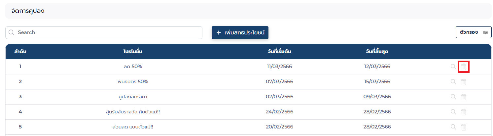<figcaption>
<strong>รูปภาพที่ 223</strong> หน้าจอจัดการคูปอง – ลบโปรโมชั่น
</figcaption></figure>

#### **8.2.5 การดูรายละเอียดคูปอง**

ผู้ใช้งานสามารถดูรายละเอียดโปรโมชั่นได้ โดยการคลิกที่ไอคอน “แว่นขยาย”

<figure>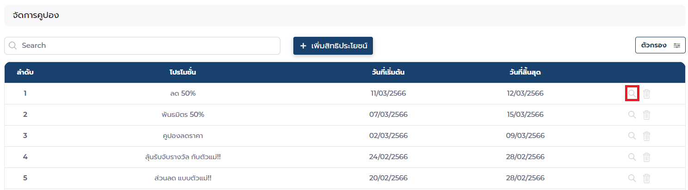<figcaption>
<strong>รูปภาพที่ 224</strong> หน้าจอจัดการคูปอง – การดูรายละเอียดโปรโมชั่น
</figcaption></figure>

### 8.3 นำเข้าคูปอง

ไปที่เมนู สิทธิประโยชน์และคูปอง จากนั้นคลิก “นำเข้าคูปอง”

<figure>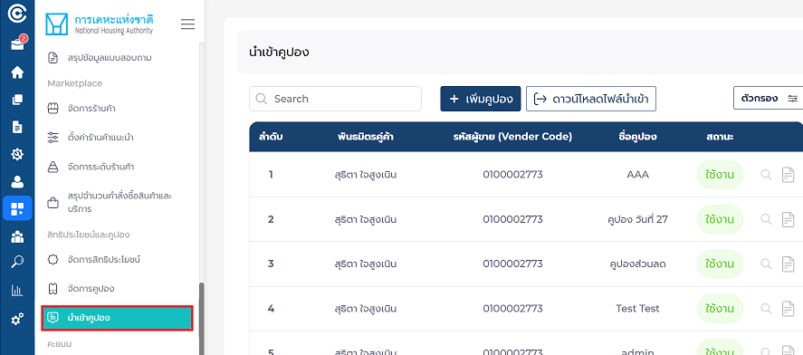<figcaption>
<strong>รูปภาพที่ 225</strong> หน้าจอนำเข้าคูปอง
</figcaption></figure>

#### **8.3.1 การค้นหาคูปอง**

ผู้ใช้งานสามารถระบุข้อมูลที่ต้องการค้นหา จากนั้นคลิกบริเวณอื่นเพื่อให้ระบบค้นหาข้อมูล

<figure>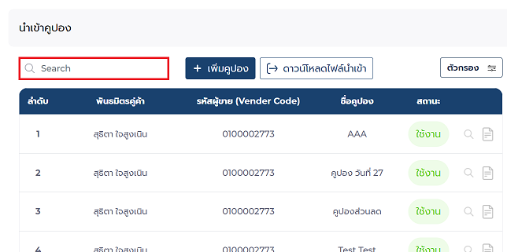<figcaption>
<strong>รูปภาพที่ 226</strong> หน้าจอนำเข้าคูปอง – ช่องค้นหา
</figcaption></figure>

#### **8.3.2 ตัวกรองคูปอง**

คลิกปุ่ม “ตัวกรอง” ระบบจะแสดงหน้าต่างป๊อบอัพ (Pop-up) ตัวกรอง

<figure>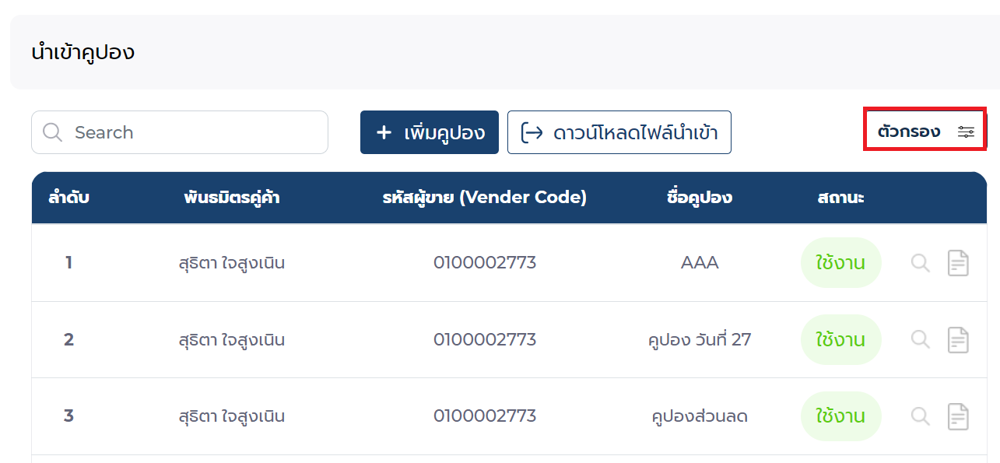<figcaption>
<strong>รูปภาพที่ 227</strong> หน้าจอนำเข้าคูปอง – ปุ่มตัวกรอง
</figcaption></figure>

<figure>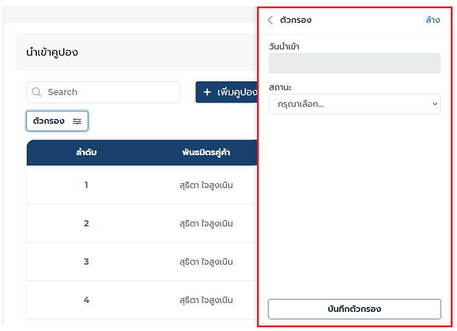<figcaption>
<strong>รูปภาพที่ 228</strong> หน้าจอนำเข้าคูปอง – หน้าต่างป๊อบอัพ (Pop-up) ตัวกรอง
</figcaption></figure>

เลือกข้อมูลที่ต้องการกรอง จากนั้นคลิกปุ่ม “บันทึกตัวกรอง” ระบบจะกรองข้อมูลตามเงื่อนไขที่ระบุ

<figure>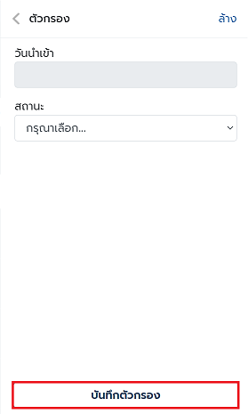<figcaption>
<strong>รูปภาพที่ 229</strong> หน้าจอนำเข้าคูปอง – ตัวกรอง
</figcaption></figure>

คลิกที่ “ล้าง” เพื่อล้างข้อมูลที่เลือกได้

<figure>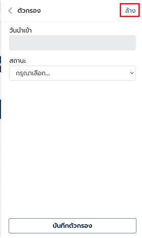<figcaption>
<strong>รูปภาพที่ 230</strong> หน้าจอนำเข้าคูปอง – ปุ่มล้างตัวกรอง
</figcaption></figure>

คลิกปุ่ม “<” เพื่อปิดตัวกรอง

<figure>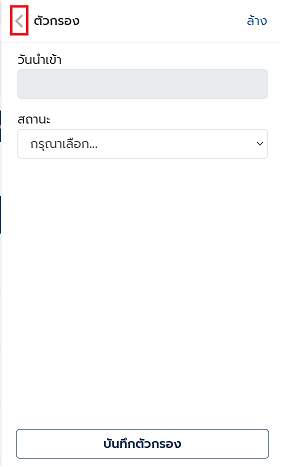<figcaption>
<strong>รูปภาพที่ 231</strong> หน้าจอนำเข้าคูปอง – ปุ่มย้อนกลับเพื่อปิดตัวกรอง
</figcaption></figure>

#### **8.3.3 การเพิ่มคูปอง**

คลิกปุ่ม “+เพิ่มคูปอง”

<figure>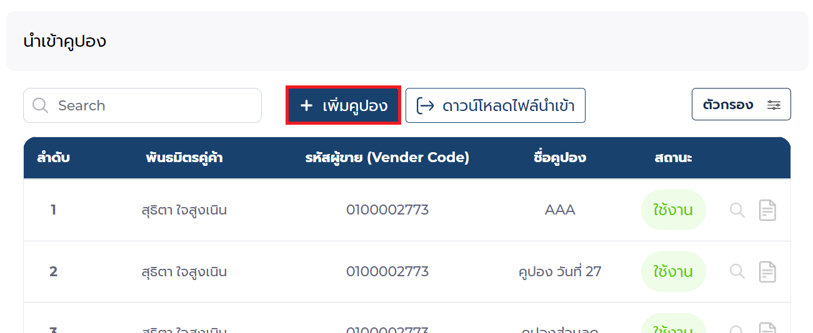<figcaption>
<strong>รูปภาพที่ 232</strong> หน้าจอนำเข้าคูปอง – ปุ่มเพิ่มคูปอง
</figcaption></figure>

ระบบจะแสดงหน้าเพิ่มคูปอง ผู้ใช้งานกรอกรายละเอียด จากนั้นคลิกปุ่ม “บันทึก”

<figure>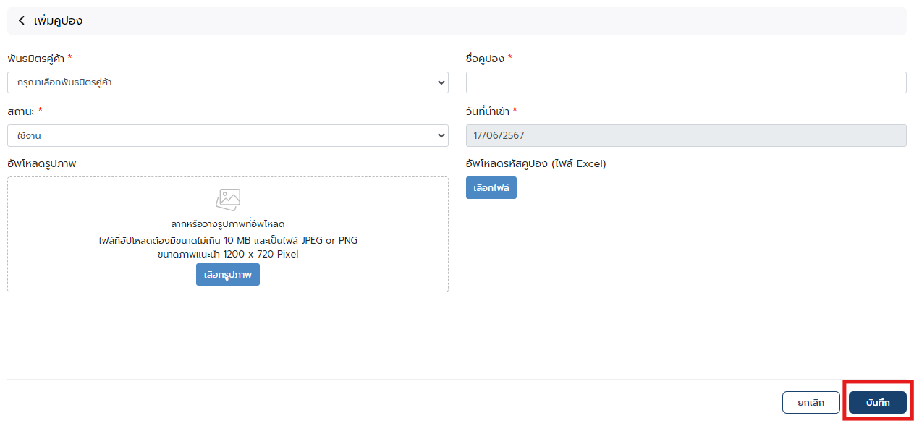<figcaption>
<strong>รูปภาพที่ 233</strong> หน้าจอนำเข้าคูปอง – การเพิ่มคูปอง
</figcaption></figure>

#### **8.3.4 การดูรายละเอียดคูปอง**

ผู้ใช้งานสามารถดูรายละเอียดคูปองได้ โดยการคลิกที่ไอคอน “แว่นขยาย”

<figure>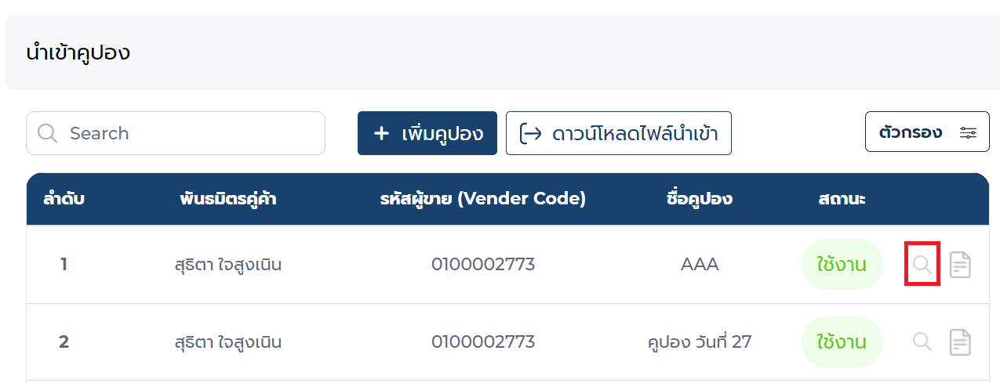<figcaption>
<strong>รูปภาพที่ 234</strong> หน้าจอนำเข้าคูปอง – การดูรายละเอียดคูปอง
</figcaption></figure>

#### **8.3.5 การดูรายการนำเข้าคูปอง**

ผู้ใช้งานสามารถดูรายการนำเข้าคูปองได้ โดยการคลิกที่ไอคอน “เอกสาร”

<figure>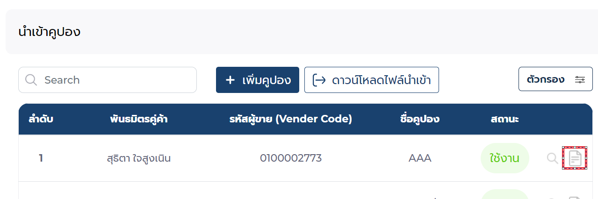<figcaption>
<strong>รูปภาพที่ 235</strong> หน้าจอนำเข้าคูปอง – การดูรายการนำเข้าคูปอง
</figcaption></figure>

ระบบจะแสดงหน้าต่างป็อบอัพ (Pop-up) รายการนำเข้าคูปอง ผู้ใช้งานสามารถดูรหัสคูปองและสถานะได้

<figure>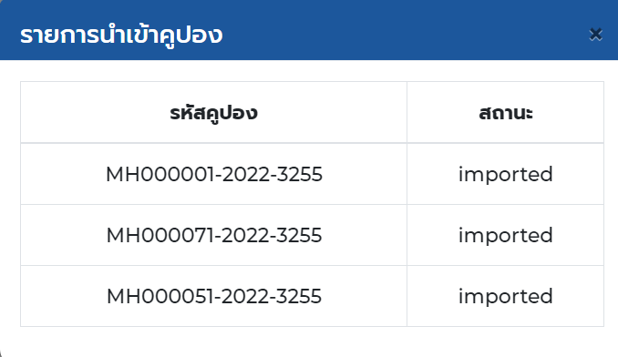<figcaption>
<strong>รูปภาพที่ 236</strong> หน้าจอนำเข้าคูปอง – หน้าต่างป็อบอัพ (Pop-up) รายการนำเข้าคูปอง
</figcaption></figure>

#### **8.3.6 การดาวน์โหลดไฟล์นำเข้าคูปอง**

ผู้ใช้งานสามารถดาวน์โหลดไฟล์นำเข้าคูปองได้ โดยการคลิกปุ่ม “ดาวน์โหลดไฟล์นำเข้า”

<figure>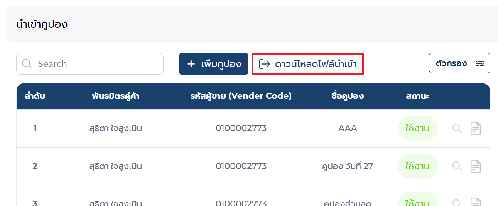<figcaption>
<strong>รูปภาพที่ 237</strong> หน้าจอนำเข้าคูปอง – การกาวน์โหลดไฟล์นำเข้าคูปอง
</figcaption></figure>

## **บทที่ 9 การใช้งานในส่วนของ คะแนน**

### 9.1 จัดการคะแนนสะสม

ไปที่เมนู คะแนน จากนั้นคลิก “จัดการคะแนนสะสม”

<figure>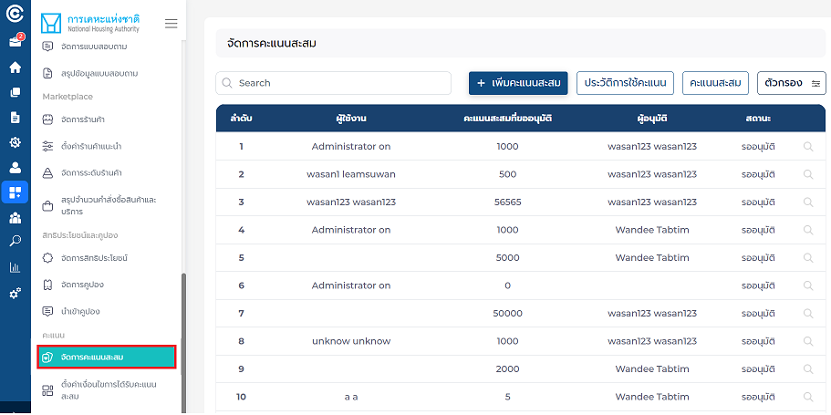<figcaption>
<strong>รูปภาพที่ 238</strong> หน้าจอจัดการคะแนนสะสม
</figcaption></figure>

#### **9.1.1 การค้นหาคะแนนสะสม**

ผู้ใช้งานสามารถระบุข้อมูลที่ต้องการค้นหา จากนั้นคลิกบริเวณอื่นเพื่อให้ระบบค้นหาข้อมูล

<figure>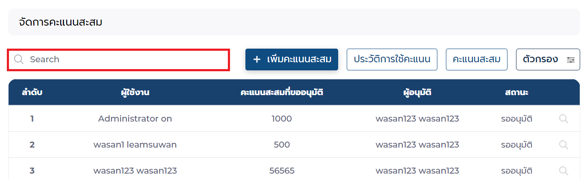<figcaption>
<strong>รูปภาพที่ 239</strong> หน้าจอจัดการคะแนนสะสม– ช่องค้นหา
</figcaption></figure>

#### **9.1.2 ตัวกรองคะแนนสะสม**

คลิกปุ่ม “ตัวกรอง” ระบบจะแสดงหน้าต่างป๊อบอัพ (Pop-up) ตัวกรอง

<figure>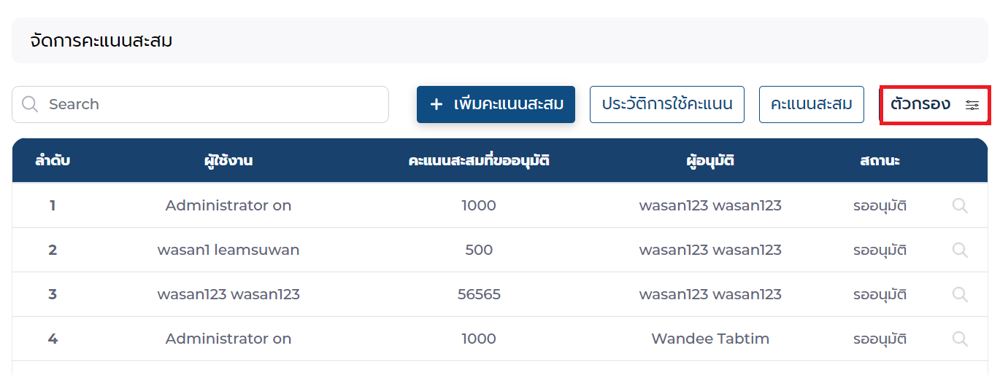<figcaption>
<strong>รูปภาพที่ 240</strong> หน้าจอจัดการคะแนนสะสม– ปุ่มตัวกรอง
</figcaption></figure>

<figure>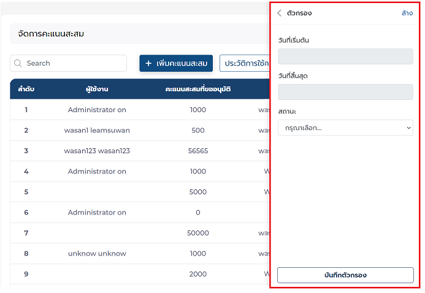<figcaption>
<strong>รูปภาพที่ 241</strong> หน้าจอจัดการคะแนนสะสม– หน้าต่างป๊อบอัพ (Pop-up) ตัวกรอง
</figcaption></figure>

เลือกข้อมูลที่ต้องการกรอง จากนั้นคลิกปุ่ม “บันทึกตัวกรอง” ระบบจะกรองข้อมูลตามเงื่อนไขที่ระบุ

<figure>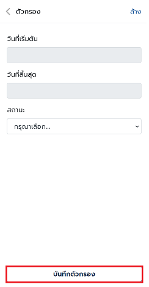<figcaption>
<strong>รูปภาพที่ 242</strong> หน้าจอจัดการคะแนนสะสม – ตัวกรอง
</figcaption></figure>

คลิกที่ “ล้าง” เพื่อล้างข้อมูลที่เลือกได้

<figure>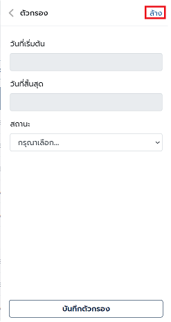<figcaption>
<strong>รูปภาพที่ 243</strong> หน้าจอจัดการคะแนนสะสม – ปุ่มล้างตัวกรอง
</figcaption></figure>

คลิกปุ่ม “<” เพื่อปิดตัวกรอง

<figure>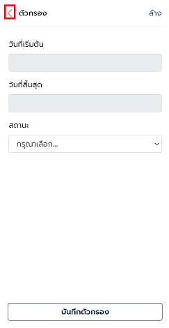<figcaption>
<strong>รูปภาพที่ 244</strong> หน้าจอจัดการคะแนนสะสม – ปุ่มย้อนกลับเพื่อปิดตัวกรอง
</figcaption></figure>

#### **9.1.3 การเพิ่มคะแนนสะสม**

คลิกปุ่ม “+เพิ่มคะแนนสะสม”

<figure>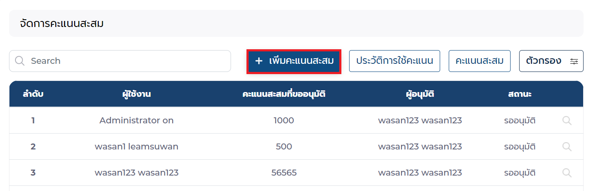<figcaption>
<strong>รูปภาพที่ 245</strong> หน้าจอจัดการคะแนนสะสม – ปุ่มเพิ่มคะแนนสะสม
</figcaption></figure>

ระบบจะแสดงหน้าเพิ่มคะแนนสะสม

ผู้ใช้งานกรอกรายละเอียด จากนั้นคลิกปุ่ม “บันทึก”

<figure>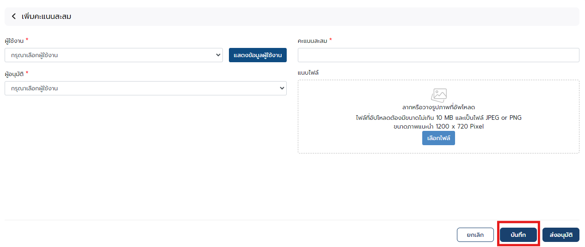<figcaption>
<strong>รูปภาพที่ 246</strong> หน้าจอจัดการคะแนนสะสม – การบันทึกคะแนนสะสม
</figcaption></figure>

ผู้ใช้งานกรอกรายละเอียด จากนั้นคลิกปุ่ม “ส่งอนุมัติ”

<figure>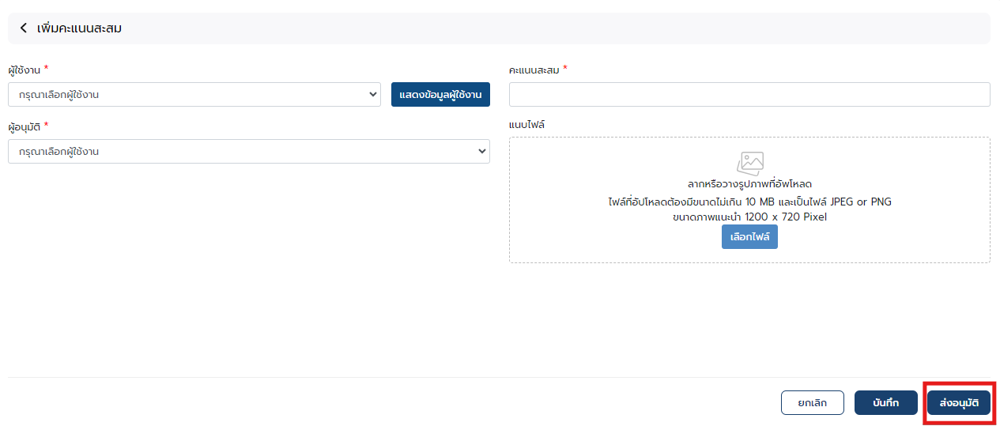<figcaption>
<strong>รูปภาพที่ 247</strong> หน้าจอจัดการคะแนนสะสม – การส่งอนุมัติคะแนนสะสม
</figcaption></figure>

#### **9.1.4 ประวัติการใช้คะแนนสะสม**

คลิกปุ่ม “ประวัติการใช้คะแนน”

<figure>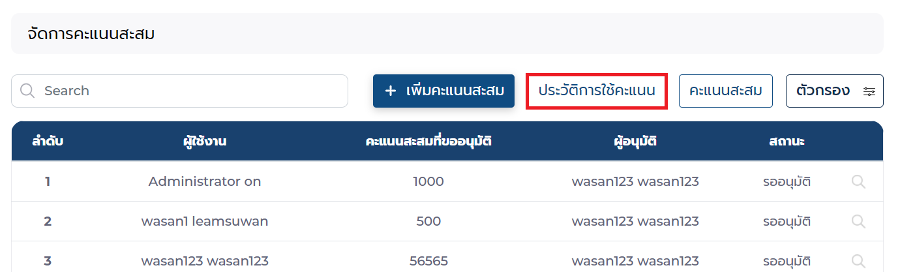<figcaption>
<strong>รูปภาพที่ 248</strong> หน้าจอจัดการคะแนนสะสม – ปุ่มประวัติการใช้คะแนนสะสม
</figcaption></figure>

ระบบจะแสดงหน้าประวัติการใช้คะแนนสะสม

<figure>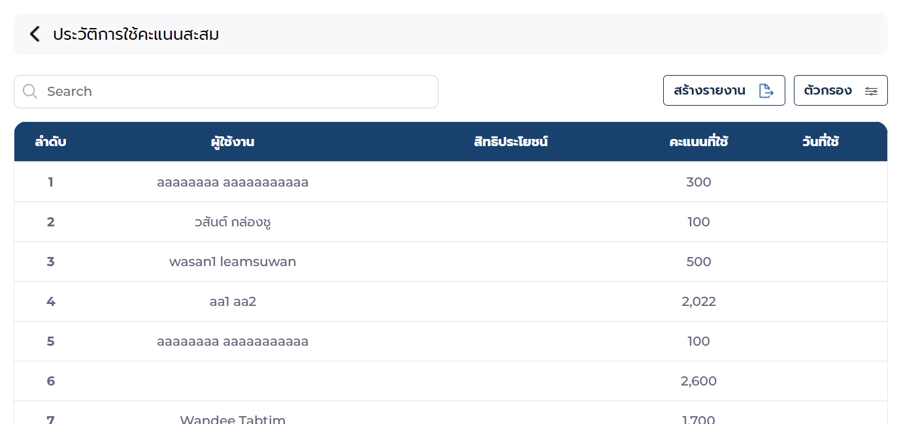<figcaption>
<strong>รูปภาพที่ 249</strong> หน้าจอจัดการคะแนนสะสม – ประวัติการใช้คะแนนสะสม
</figcaption></figure>

* การค้นหา

ผู้ใช้งานสามารถระบุข้อมูลที่ต้องการค้นหา จากนั้นคลิกบริเวณอื่นเพื่อให้ระบบค้นหาข้อมูล

<figure>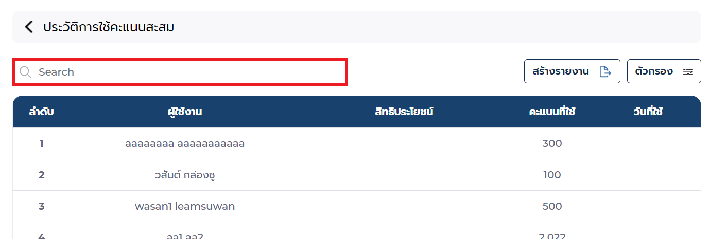<figcaption>
<strong>รูปภาพที่ 250</strong> หน้าจอประวัติการใช้คะแนนสะสม – ช่องค้นหา
</figcaption></figure>

* ตัวกรอง

คลิกปุ่ม “ตัวกรอง” ระบบจะแสดงหน้าต่างป๊อบอัพ (Pop-up) ตัวกรอง

<figure>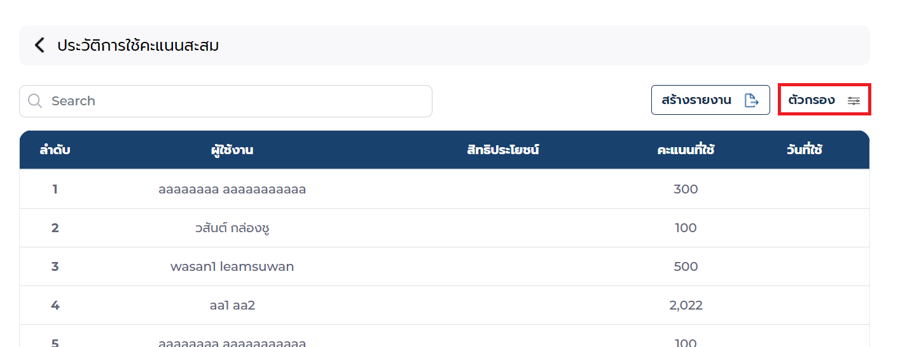<figcaption>
<strong>รูปภาพที่ 251</strong> หน้าจอประวัติการใช้คะแนนสะสม – ปุ่มตัวกรอง
</figcaption></figure>

<figure>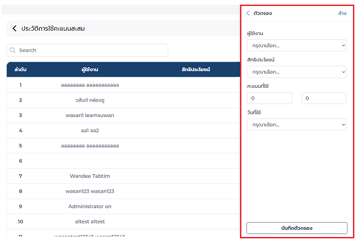<figcaption>
<strong>รูปภาพที่ 252</strong> หน้าจอประวัติการใช้คะแนนสะสม – หน้าต่างป๊อบอัพ (Pop-up) ตัวกรอง
</figcaption></figure>

เลือกข้อมูลที่ต้องการกรอง จากนั้นคลิกปุ่ม “บันทึกตัวกรอง” ระบบจะกรองข้อมูลตามเงื่อนไขที่ระบุ

<figure>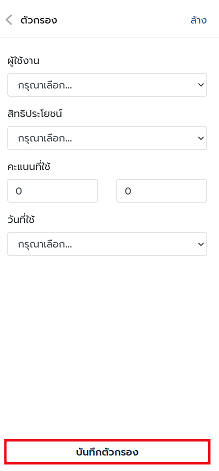<figcaption>
<strong>รูปภาพที่ 253</strong> หน้าจอประวัติการใช้คะแนนสะสม – ตัวกรอง
</figcaption></figure>

คลิกที่ “ล้าง” เพื่อล้างข้อมูลที่เลือกได้

<figure>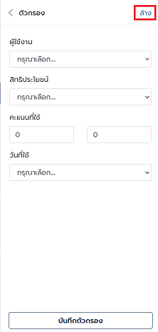<figcaption>
<strong>รูปภาพที่ 254</strong> หน้าจอประวัติการใช้คะแนนสะสม – ปุ่มล้างตัวกรอง
</figcaption></figure>

คลิกปุ่ม “<” เพื่อปิดตัวกรอง

<figure>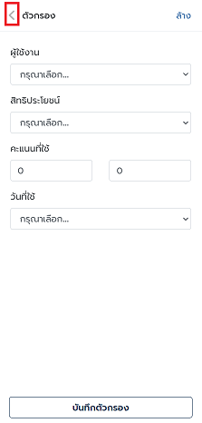<figcaption>
<strong>รูปภาพที่ 255</strong> หน้าจอประวัติการใช้คะแนนสะสม – ปุ่มย้อนกลับเพื่อปิดตัวกรอง
</figcaption></figure>

* การสร้างรายงาน

คลิกปุ่ม “สร้างรายงาน” ระบบจะทำการสร้างรายงานประวัติการใช้คะแนนสะสมเป็นไฟล์ .Excel

<figure>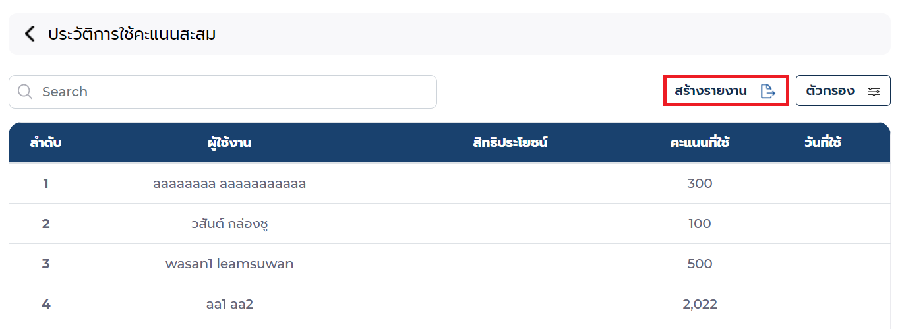<figcaption>
<strong>รูปภาพที่ 256</strong> หน้าจอประวัติการใช้คะแนนสะสม – สร้างรายงานประวัติการใช้คะแนนสะสม
</figcaption></figure>

#### **9.1.5 คะแนนสะสม**

คลิกปุ่ม “คะแนนสะสม”

<figure>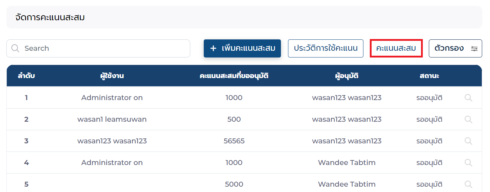<figcaption>
<strong>รูปภาพที่ 257</strong> หน้าจอจัดการคะแนนสะสม – ปุ่มคะแนนสะสม
</figcaption></figure>

ระบบจะแสดงหน้าคะแนนสะสม

<figure>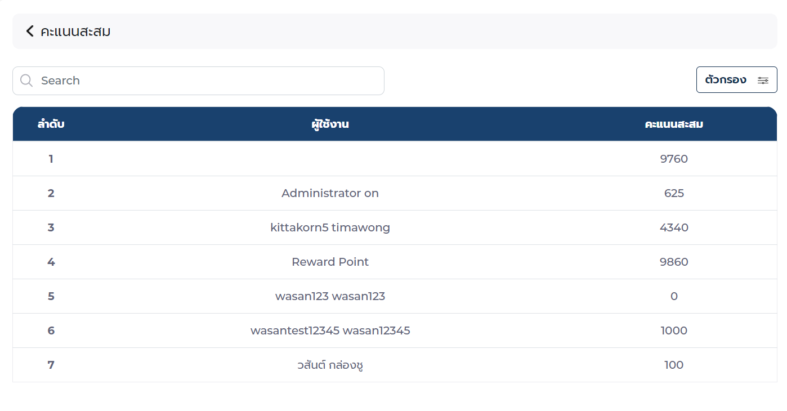<figcaption>
<strong>รูปภาพที่ 258</strong> หน้าจอจัคะแนนสะสม – คะแนนสะสม
</figcaption></figure>

* การค้นหา

ผู้ใช้งานสามารถระบุข้อมูลที่ต้องการค้นหา จากนั้นคลิกบริเวณอื่นเพื่อให้ระบบค้นหาข้อมูล

<figure>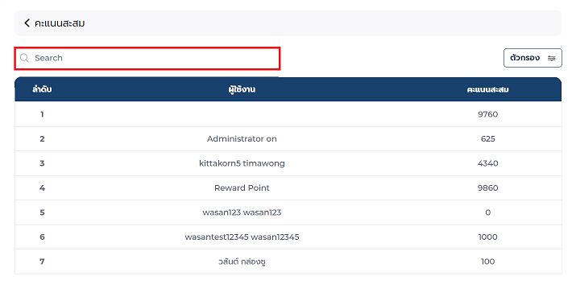<figcaption>
<strong>รูปภาพที่ 259</strong> หน้าจอคะแนนสะสม – ช่องค้นหา
</figcaption></figure>

* ตัวกรอง

คลิกปุ่ม “ตัวกรอง” ระบบจะแสดงหน้าต่างป๊อบอัพ (Pop-up) ตัวกรอง

<figure>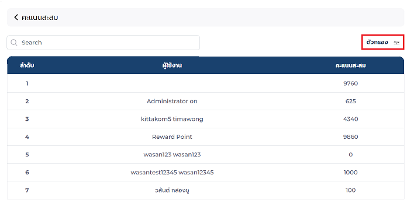<figcaption>
<strong>รูปภาพที่ 260</strong> หน้าจอคะแนนสะสม – ปุ่มตัวกรอง
</figcaption></figure>

<figure>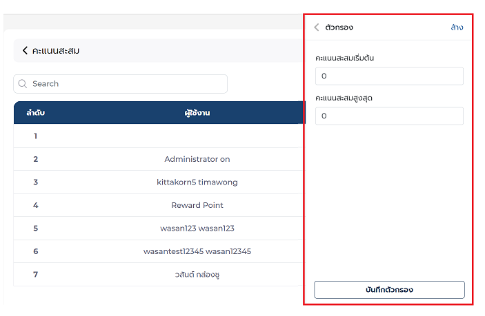<figcaption>
<strong>รูปภาพที่ 261</strong> หน้าจอคะแนนสะสม – หน้าต่างป๊อบอัพ (Pop-up) ตัวกรอง
</figcaption></figure>

เลือกข้อมูลที่ต้องการกรอง จากนั้นคลิกปุ่ม “บันทึกตัวกรอง” ระบบจะกรองข้อมูลตามเงื่อนไขที่ระบุ

<figure>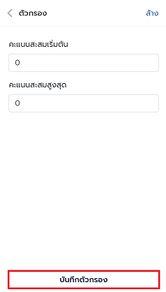<figcaption>
<strong>รูปภาพที่ 262</strong> หน้าจอคะแนนสะสม – ตัวกรอง
</figcaption></figure>

คลิกที่ “ล้าง” เพื่อล้างข้อมูลที่เลือกได้

<figure>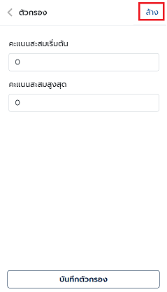<figcaption>
<strong>รูปภาพที่ 263</strong> หน้าจอคะแนนสะสม – ปุ่มล้างตัวกรอง
</figcaption></figure>

คลิกปุ่ม “<” เพื่อปิดตัวกรอง

<figure>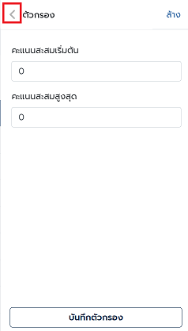<figcaption>
<strong>รูปภาพที่ 264</strong> หน้าจอคะแนนสะสม – ปุ่มย้อนกลับเพื่อปิดตัวกรอง
</figcaption></figure>

#### **9.1.6 การดูรายละเอียดคะแนนสะสม**

ผู้ใช้งานสามารถดูรายละเอียดคะแนนสะสมได้ โดยการคลิกที่ไอคอน “แว่นขยาย”

<figure>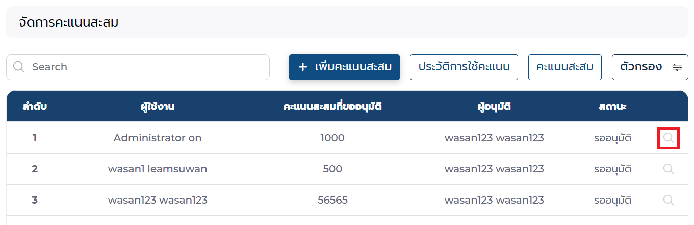<figcaption>
<strong>รูปภาพที่ 265</strong> หน้าจอจัดการคะแนนสะสม – การดูรายละเอียดคะแนนสะสม
</figcaption></figure>

### 9.2 ตั้งค่าเงื่อนไขการได้รับคะแนนสะสม

ไปที่เมนูคะแนน จากนั้นคลิก “ตั้งค่าเงื่อนไขการได้รับคะแนนสะสม”&#x20;

<figure>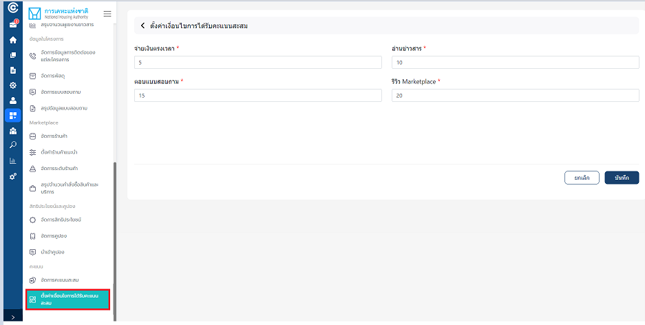<figcaption>
<strong>รูปภาพที่ 266</strong> หน้าจอตั้งค่าเงื่อนไขการได้รับคะแนนสะสม
</figcaption></figure>

ผู้ใช้งานกรอกรายละเอียดการตั้งค่าเงื่อนไขการได้รับคะแนนสะสม จากนั้นคลิกปุ่ม “บันทึก”

<figure>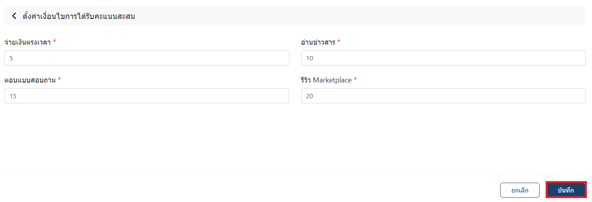<figcaption>
<strong>รูปภาพที่ 267</strong> หน้าจอตั้งค่าเงื่อนไขการได้รับคะแนนสะสม - กรอกรายละเอียดการตั้งค่า
</figcaption></figure>
