# ผู้ใช้งานทั่วไป

## บทที่ 1 **Landing Page**

### การใช้งาน Landing Page

ผู้ใช้งานเรียก Browser และเข้าใช้งานระบบที่ URL : [uat-dt.nha.co.th](https://uat-dt.nha.co.th/nha\_dt/LandingPage) ระบบบริการลูกค้าออนไลน์ (Customer Service) ระบบจะแสดงหน้า Landing Page โดยมีส่วนประกอบดังต่อไปนี้

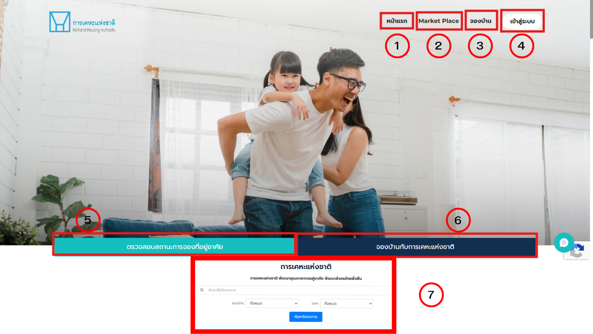

1. &#x20;เมนู หน้าแรก
2. เมนู Market Place
3. เมนู จองบ้าน
4. เมนู เข้าสู่ระบบ
5. เมนู ตรวจสอบสถานะการจองที่อยู่อาศัย
6. เมนู จองบ้านกับการเคหะแห่งชาติ
7. เมนู ค้นหาโครงการ

<figure><figcaption>
รูปภาพที่ 2 หน้าจอส่วนประกอบ Landing Page หมายเลข 8-10
</figcaption></figure>

8. แท็บโครงการแนะนำ
9. แท็บโครงการไฮไลท์
10. แท็บโครงการใกล้ฉัน

.png>)

11. แท็บข่าวการชาย
12. แท็บข่าวประชาสัมพันธ์
13. แท็บข่าวสารจากการเคหะแห่งชาติ

.png>)

14. แท็บลงทะเบียนความสนใจโครงการ เช่า
15. แท็บลงทะเบียนความสนใจโครงการ ซื้อ
16. หน้าแสดงผลสภาพอากาศ ค่าดัชนี

.png>)

17. ปุ่มติดต่อการเคหะแห่งชาติ
18. ปุ่มร้องเรียนทุจริต

.png>)

19. &#x20;โครงการแนะนำ สนใจจองสิทธิ์โครงการ

## **บทที่ 2 การเข้าใช้งานระบบ**

หัวข้อต่อไปนี้จะอธิบายถึงวิธีการเข้าใช้งาน และออกจากระบบบริการลูกค้าออนไลน์ (Customer Service)

### 2.1 การสมัครใช้งาน

การสมัครเข้าใช้งาน มีขั้นตอนการทำงานดังนี้

* ผู้ใช้งานเรียก Browser และเข้าใช้งานระบบที่ URL: [uat-dt.nha.co.th](https://uat-dt.nha.co.th/LandingPage) เพื่อเข้าใช้งานระบบบริการลูกค้าออนไลน์ (Customer Service) คลิก “เข้าสู่ระบบ”

.png>)

ระบบจะแสดงหน้าจอสำหรับการสมัครใช้งาน โดยจะต้องกรอกข้อมูลให้ครบถ้วน (ในส่วนของรหัสผ่านจำเป็นจะต้องมีตัวอักษรพิมพ์ใหญ่อย่างน้อย 1 ตัว และสัญลักษณ์พิเศษอย่างน้อย 1 ตัว เช่น <>?!@#$% เป็นต้น)

.png>)

ติ๊กเลือก ฉันได้อ่านและยอมรับเงื่อนไขของการใช้เว็บไซต์รวมถึงนโยบายความเป็นส่วนตัว

.png>)

คลิกปุ่ม “สมัคร” ระบบจะแสดงหน้าต่าง Pop up เพื่อยืนยันการแสดงข้อมูลแก่การเคหะแห่งขาติ (PDPA) ให้คลิกเปลี่ยนจาก Off ให้เป็น On ทุกหัวข้อ จากนั้นคลิก “สมัคร”

.png>)

รหัสยืนยันตัวตน จากนั้นตรวจสอบรหัส 6 หลักจากอีเมลหรือหมายเลขโทรศัพท์มือถือ และกรอกรหัสยืนยันตัวตน (OTP)

.png>)

.png>)

คลิกปุ่ม “ยืนยัน” ระบบจะแสดงหน้าต่างป๊อบอัพ ดังรูปที่ 11

* กรณีผู้ใช้งานทั่วไป คลิกปุ่ม “ไม่” ระบบจะแสดงหน้าต่างป๊อบอัพ (Pop-up) สมัครเรียบร้อยแล้ว เข้าใช้งานได้ทันที
* กรณีผู้ใช้งานเป็นลูกค้าที่มีสัญญากับการเคหะ คลิกปุ่ม “ใช่” ระบบจะแสดงหน้าต่างป๊อบอัพ (Pop-up) สมัครเรียบร้อยแล้ว เข้าใช้งานได้ทันที

### 2.2 การเข้าสู่ระบบ

การเข้าใช้งานระบบ มีขั้นตอนการทำงานดังนี้

* ผู้ใช้งานเรียก Browser และเข้าใช้งานระบบที่ URL: [uat-dt.nha.co.th](https://uat-dt.nha.co.th) เพื่อเข้าใช้งานระบบบริการลูกค้าออนไลน์ (Customer Service)

.png>)

* ผู้ใช้งานระบุอีเมลและรหัสผ่าน จากนั้นคลิกปุ่ม “เข้าสู่ระบบ”
* ถ้าระบุอีเมล และรหัสผ่านถูกต้อง ระบบจะแสดงหน้าหลักตามสิทธิของผู้ใช้
* ผู้ใช้งานสามารถติ๊ก “จำรหัสผ่าน” เพื่อให้ระบบสามารถจำรหัสผ่านเมื่อเข้าสู่ระบบครั้งถัดไป

.png>)

* ถ้าระบุอีเมล หรือรหัสผ่านไม่ถูกต้อง ระบบจะแสดงข้อความเตือน คือ “The username or password is incorrect” เพื่อให้ระบุค่าใหม่อีกครั้ง

.png>)

* ถ้าลืมรหัสผ่าน คลิกที่ “ลืมรหัสผ่าน” จากนั้นระบุอีเมล และกดส่ง โดยจะต้องเป็นอีเมลที่เคยสมัครสมาชิกกับการเคหะแล้วเท่านั้น ระบบจะแสดงหน้าต่างป๊อบอัพ (Pop-up) แจ้งเตือนส่งแล้ว จากนั้นให้ตรวจสอบอีเมลเพื่อตั้งค่ารหัสผ่านใหม่

.png>)

.png>)

* ผู้ใช้งานสามารถเข้าสู่ระบบด้วยบัญชีออนไลน์ (Social Media) โดยเชื่อมต่อกับช่องทางFacebook line และ Google ได้

.png>)

### 2.3 การออกจากระบบ

การออกจากระบบ สามารถทำได้โดย คลิกที่ “ไอคอนรูปโปรไฟล์” มุมบนขวาข้างชื่อผู้ใช้ จากนั้นคลิกปุ่ม “ออกจากระบบ” ระบบจะทำการออกจากระบบ และแสดงหน้าจอเข้าสู่ระบบต่อไป

.png>)

## **บทที่ 3 ข้อมูลผู้ใช้งาน**

หัวข้อต่อไปนี้จะอธิบายถึงการใช้งานในส่วนของข้อมูลผู้ใช้งาน

คลิกรูปโปรไฟล์ที่ด้านบนขวาของ ระบบบริการลูกค้าออนไลน์ (Customer Service) จากนั้นคลิกเลือก “ข้อมูลผู้ใช้งาน”

.png>)

### 3.1 ข้อมูลผู้ใช้งาน

ผู้ใช้งานสามารถตั้งค่าข้อมูลผู้ใช้งานได้ที่หัวข้อข้อมูลส่วนตัว

.png>)

1. แก้ไขรูปโปรไฟล์
2. แก้ไข ชื่อ/นามสกุล
3. แก้ไขเบอร์โทรศัพท์
4. รหัสประจำตัวประชาชน / เลขประจำตัวผู้เสียภาษี (ไม่สามารถแก้ไขได้ ต้องติดต่อการเคหะแห่งชาติ)
5. ที่อยู่อีเมล (ไม่สามารถแก้ไขได้ ต้องติดต่อการเคหะแห่งชาติ)

<figure>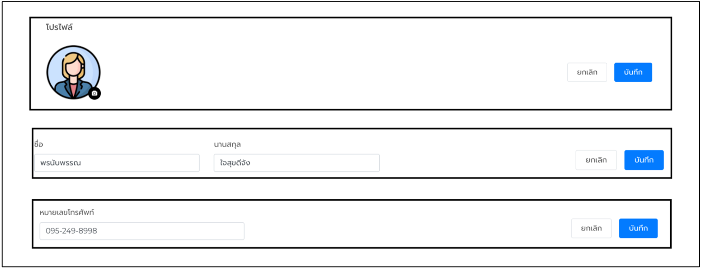<figcaption>
รูปภาพที่ 22 หน้าจอข้อมูลผู้ใช้งาน – ตั้งค่าข้อมูลส่วนตัว
</figcaption></figure>

เมื่อคลิกปุ่ม “แก้ไข” ให้ดำเนินการแก้ไขข้อมูล จากนั้นคลิกปุ่ม “บันทึก”

### 3.2 การบริการจัดการที่อยู่อาศัย

คลิกปุ่ม “บริหารจัดการข้อมูลที่อยู่อาศัย”

<figure>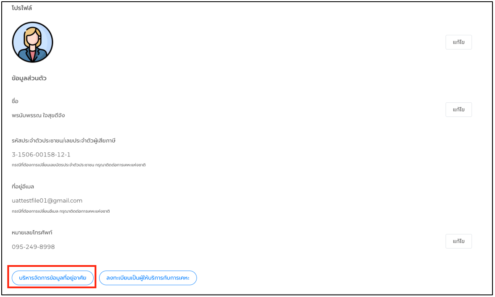<figcaption>
<strong>รูปภาพที่ 23</strong> หน้าจอข้อมูลผู้ใช้งาน - ปุ่มหน้าจอบริหารจัดการข้อมูลที่อยู่อาศัย
</figcaption></figure>

ระบบจะแสดงหน้าบริหารจัดการข้อมูลที่อยู่อาศัย ประกอบด้วย

1. ที่อยู่ตามทะเบียนบ้าน - โดยดึงข้อมูลมาจากบัตรประชาชน
2. ที่อยู่ปัจจุบัน - สามารถใช้ที่อยู่เดียวกับทะเบียนบ้านได้ โดยติ๊ก ใช้ที่อยู่ตามทะเบียนบ้าน
3. ที่อยู่จัดส่งเอกสาร - สามารถใช้ที่อยู่เดียวกับทะเบียนบ้านได้ โดยติ๊ก ใช้ที่อยู่ตามทะเบียนบ้าน

เมื่อแก้ไขข้อมูลที่อยู่เรียบร้อย คลิกปุ่ม “ บันทึก”

<figure>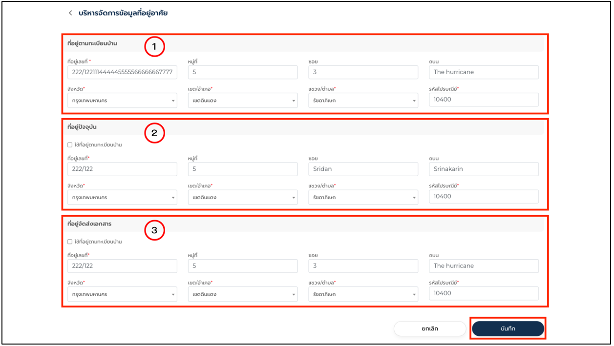<figcaption>
<strong>รูปภาพที่ 24</strong> หน้าจอข้อมูลผู้ใช้งาน – ตั้งค่าที่อยู่ตามทะเบียนบ้าน
</figcaption></figure>

### 3.3 การลงทะเบียนเป็นผู้ให้บริการกับการเคหะ

คลิกปุ่ม “ลงทะเบียนเป็นผู้ให้บริการกับการเคหะ”

<figure>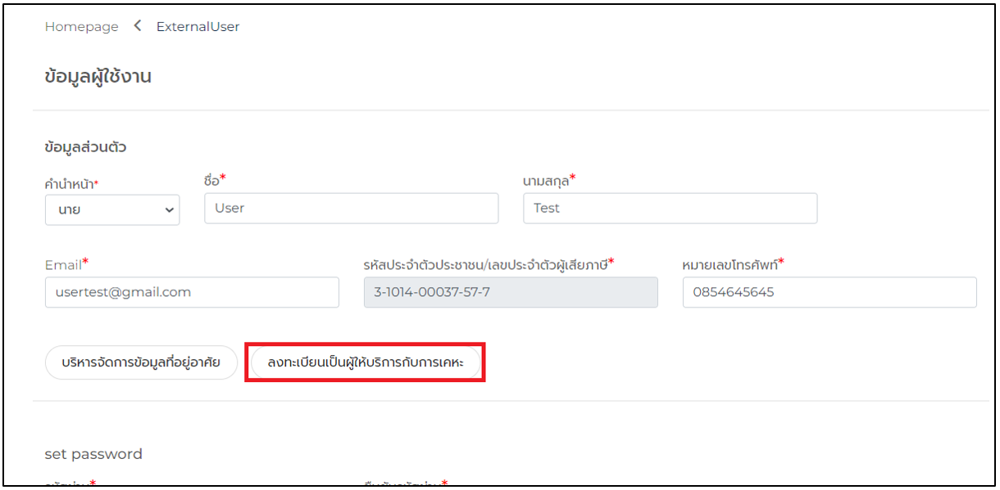<figcaption>
<strong>รูปภาพที่ 25</strong> หน้าจอข้อมูลผู้ใช้งาน – ปุ่มลงทะเบียนเป็นผู้ให้บริการกับการเคหะ
</figcaption></figure>

ระบบจะแสดงหน้าต่างป๊อบอัพ (Pop-up) ลงทะเบียนเป็นผู้ให้บริการกับการเคหะ ผู้ใช้งานกรอกรายละเอียด จากนั้นคลิกปุ่ม “บันทึก”

<figure>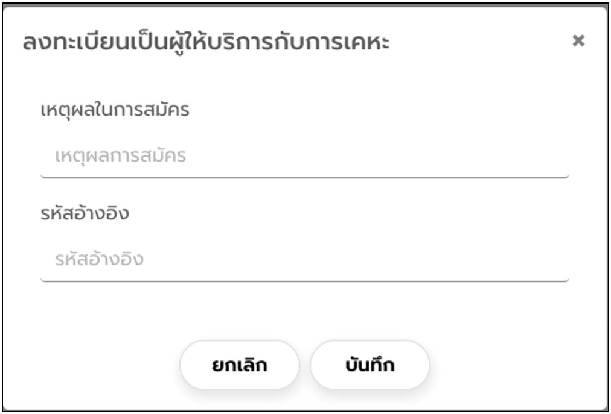<figcaption>
<strong>รูปภาพที่ 26</strong> หน้าจอข้อมูลผู้ใช้งาน – ลงทะเบียนเป็นผู้ให้บริการกับการเคหะ
</figcaption></figure>

### 3.4 การตั้งค่ารหัสผ่าน

ผู้ใช้งานสามารถตั้งค่ารหัสผ่านหรือเปลี่ยนรหัสผ่านใหม่ได้

<figure>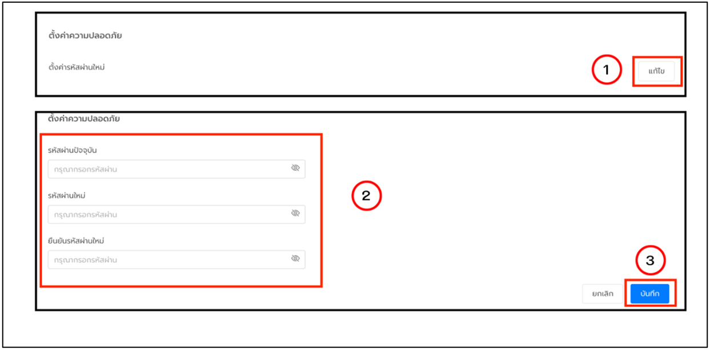<figcaption>
<strong>รูปภาพที่ 27</strong> หน้าจอข้อมูลผู้ใช้งาน – ตั้งค่ารหัสผ่าน
</figcaption></figure>

1. แก้ไข เพื่อ เปิดหน้าต่างสำหรับเปลี่ยนรหัสผ่าน
2. ใส่รหัสผ่านปัจจุบัน จากนั้นใส่รหัสผ่านใหม่ และ ยืนยันรหัสผ่านใหม่
3. เมื่อเปลี่ยนรหัสผ่านใหม่เรียบร้อย คลิกปุ่ม “บันทึก”

## **บทที่ 4 การใช้งานในส่วนของข่าวสาร**

หัวข้อต่อไปนี้จะอธิบายถึงการใช้งานในส่วนของข่าวสาร

### 4.1 การดูข่าวสารทั้งหมด

จากหน้า Landing Page เมื่อเลื่อนลงไปด้านล่าง จะเจอเมนูข่าวสาร สามารถคลิกไอคอน “<” และ “>” เพื่อเลื่อนดูข่าวสารต่างๆ หรือคลิก “เพิ่มเติม” เพื่อดู**ข่าวสารทั้งหมด** ในเมนูข่าวสารประชาสัมพันธ์

<figure>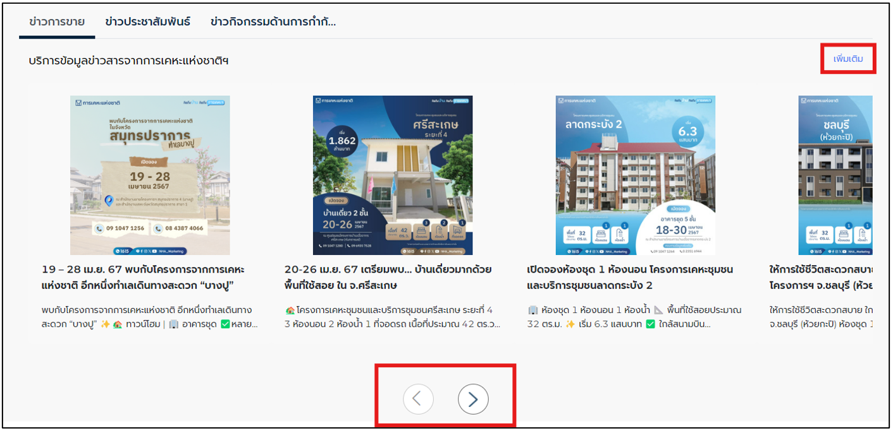<figcaption>
<strong>รูปภาพที่ 28</strong> หน้าจอการใช้งานข่าวสาร
</figcaption></figure>

**การค้นหาหัวข้อข่าว** ระบุข้อมูลในช่องค้นหาข่าว จากนั้นคลิกบริเวณอื่นเพื่อให้ระบบค้นหาข้อมูล

<figure>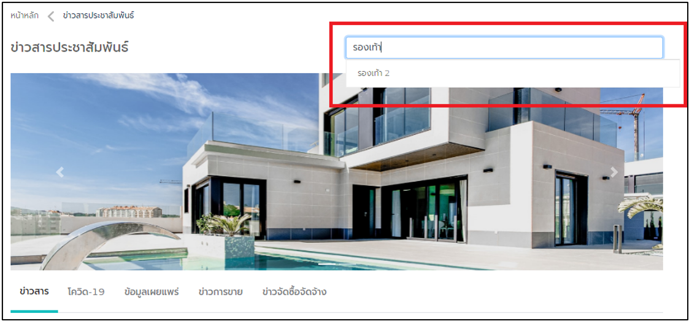<figcaption>
<strong>รูปภาพที่ 29</strong> หน้าจอการใช้งานข่าวสาร – ค้นหาหัวข้อข่าว
</figcaption></figure>

**เลือกแท็บ ข่าวสาร** เพื่อดูข่าวสารที่สนใจ

<figure>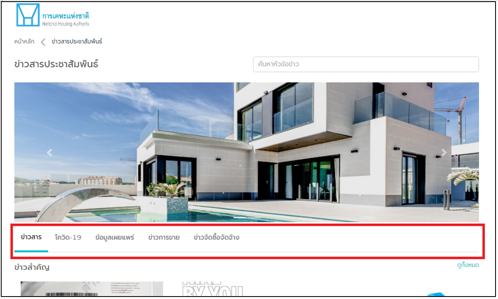<figcaption>
<strong>รูปภาพที่ 30</strong> หน้าจอการใช้งานข่าวสาร – แท็บข่าวสาร
</figcaption></figure>

**คลิกดูทั้งหมด** เพื่อดูข่าวสำคัญ หรือข่าวล่าสุดเพิ่มเติม

<figure>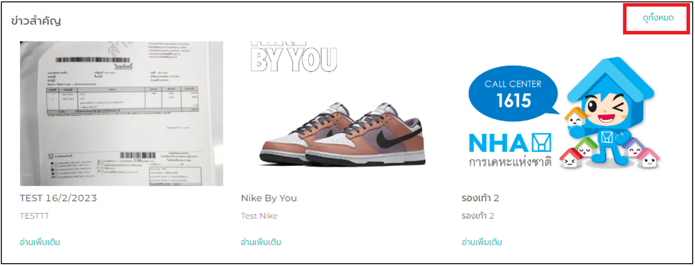<figcaption>
<strong>รูปภาพที่ 31</strong> หน้าจอการใช้งานข่าวสาร – ดูข่าวสารทั้งหมด
</figcaption></figure>

ระบบจะแสดงหน้าข่าวสำคัญ หรือข่าวล่าสุดทั้งหมด

<figure>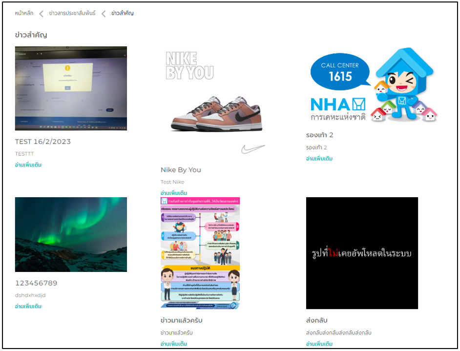<figcaption>
<strong>รูปภาพที่ 32</strong> หน้าจอการใช้งานข่าวสาร – รายการข่าวสำคัญทั้งหมด
</figcaption></figure>

### 4.2 รายละเอียดข่าวสาร

เลือกข่าวที่ต้องการ จากนั้นคลิก **“อ่านเพิ่มเติม”**

<figure>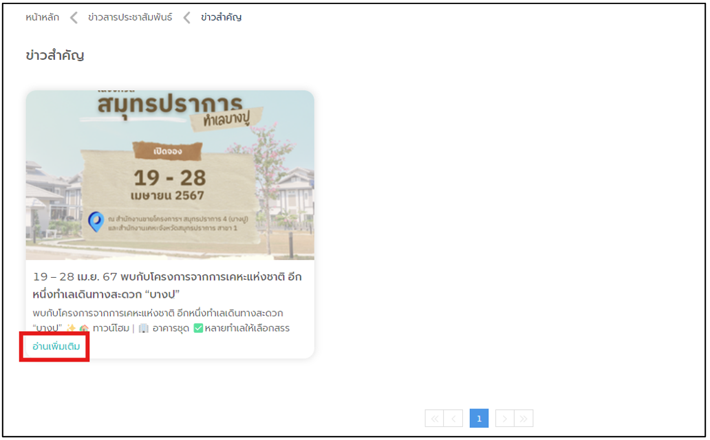<figcaption>
<strong>รูปภาพที่ 33</strong> หน้าจอการใช้งานข่าวสาร – รายการข่าวสาร
</figcaption></figure>

ระบบจะแสดงหน้ารายละเอียดข่าวสาร สามารถดูรูปภาพ/วิดิโอ อ่านรายละเอียดข่าวสาร กดหัวใจ กดแชร์ วันที่เริ่มต้น วันที่สิ้นสุด ประเภทข่าว และไฟล์แนบได้จากหน้านี้

<figure>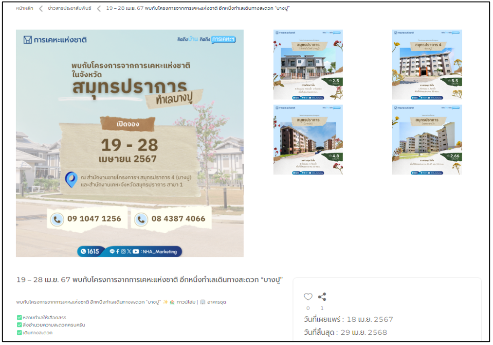<figcaption>
<strong>รูปภาพที่ 34</strong> หน้าจอการใช้งานข่าวสาร – รายละเอียดข่าวสาร
</figcaption></figure>

### 4.3 การแชร์ข่าว

เมื่อคลิกปุ่ม **“แชร์”** ระบบแสดงหน้าต่างป๊อบอัพ (Pop-up) การแชร์ สามารถแชร์ข่าวได้ผ่านช่องทาง Facebook, Twitter และ Email

<figure>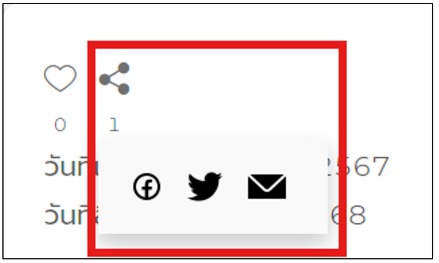<figcaption>
<strong>รูปภาพที่ 35</strong> หน้าจอการใช้งานข่าวสาร – ปุ่มแชร์ข่าว
</figcaption></figure>

## **บทที่ 5 การใช้งานในส่วนของการจองบ้าน**

หัวข้อต่อไปนี้จะอธิบายถึงการใช้งานในส่วนของการจองบ้าน

### 5.1 การค้นหาโครงการ

ผู้ใช้งานสามารถระบุข้อมูลโครงการที่ต้องการค้นหา จากนั้นคลิกบริเวณอื่นเพื่อให้ระบบค้นหาข้อมูล

<figure>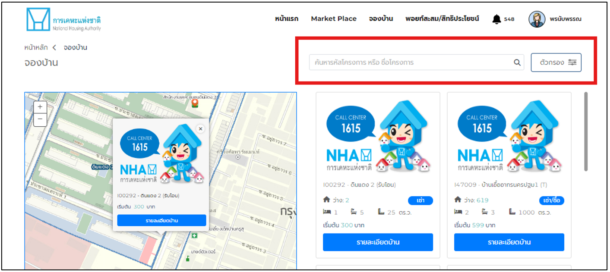<figcaption>
<strong>รูปภาพที่ 36</strong> หน้าจอการจองบ้าน – ช่องค้นหา
</figcaption></figure>

### 5.2 ตัวกรองโครงการ

**คลิกปุ่ม “ตัวกรอง”** ระบบจะแสดงหน้าต่างป๊อบอัพ (Pop-up) ตัวกรอง

<figure>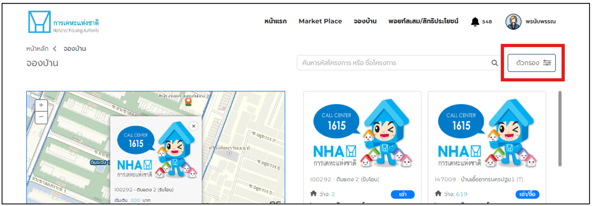<figcaption>
<strong>รูปภาพที่ 37</strong> หน้าจอการจองบ้าน – ปุ่มตัวกรอง
</figcaption></figure>

<figure>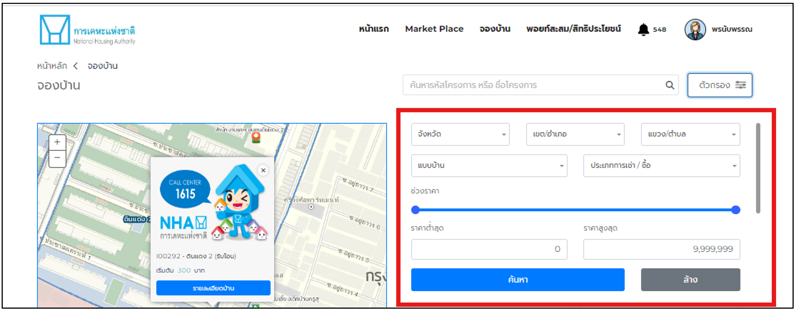<figcaption>
<strong>รูปภาพที่ 38</strong> หน้าจอการจองบ้าน – หน้าต่างป๊อบอัพ (Pop-up) ตัวกรอง
</figcaption></figure>

เลือกข้อมูลที่ต้องการกรอง จากนั้นคลิกปุ่ม “ค้นหา” ระบบจะกรองข้อมูลตามเงื่อนไขที่ระบุ และทางด้านขวาของหน้าจะจะแสดงแผนที่ของโครงการที่ค้นหาให้อัตโนมัติ

<figure>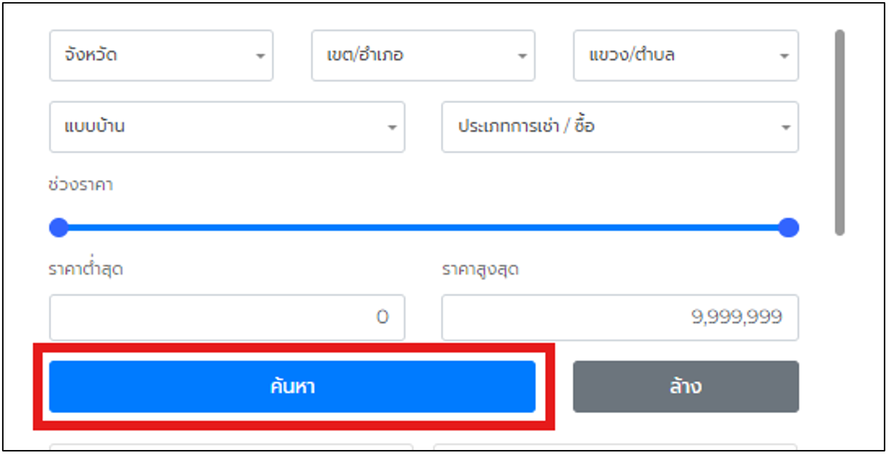<figcaption>
<strong>รูปภาพที่ 39</strong> หน้าจอการจองบ้าน – ตัวกรอง
</figcaption></figure>

ผู้ใช้งานสามารถ คลิก “ล้าง” เพื่อล้างข้อมูลที่เลือกได้

<figure><figcaption>
<strong>รูปภาพที่ 40</strong> หน้าจอการจองบ้าน – ปุ่มล้างตัวกรอง
</figcaption></figure>

คลิกปุ่ม “ตัวกรอง” เพื่อปิดตัวกรอง

<figure>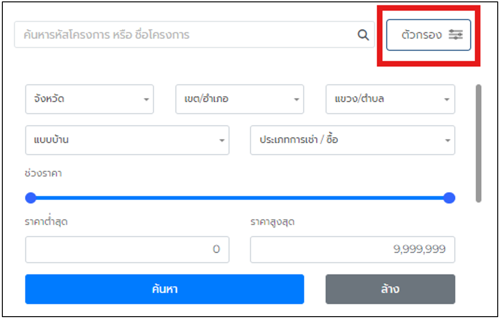<figcaption>
<strong>รูปภาพที่ 41</strong> หน้าจอการจองบ้าน – ปุ่ม”ตัวกรอง” กลับเพื่อปิดตัวกรอง
</figcaption></figure>

### 5.3 รายละเอียดการจองบ้าน

**คลิกปุ่ม “จองบ้าน”** หรือ **“จองบ้านกับการเคหะแห่งชาติ”** ที่หน้า Landing Page

<figure><figcaption>
<strong>รูปภาพที่ 42</strong> หน้าจอการจองบ้าน – ปุ่มจองบ้าน
</figcaption></figure>

ระบบจะแสดงหน้ารายละเอียดการจองบ้าน โดยจะแสดงรายการโครงการที่มีจำนวนบ้านว่าง

<figure>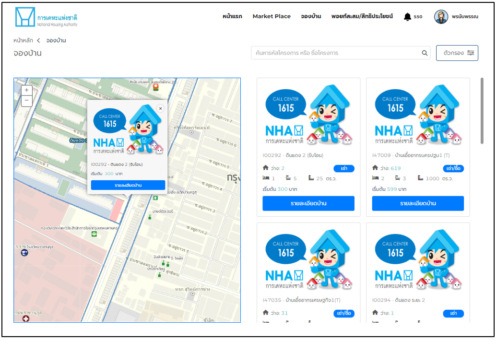<figcaption>
<strong>รูปภาพที่ 43</strong> หน้าจอรายละเอียดการจองบ้าน – แสดงรายการโครงการ
</figcaption></figure>

เลือกโครงการที่ต้องการจอง จากนั้น **คลิกปุ่ม “รายละเอียดบ้าน”**

<figure>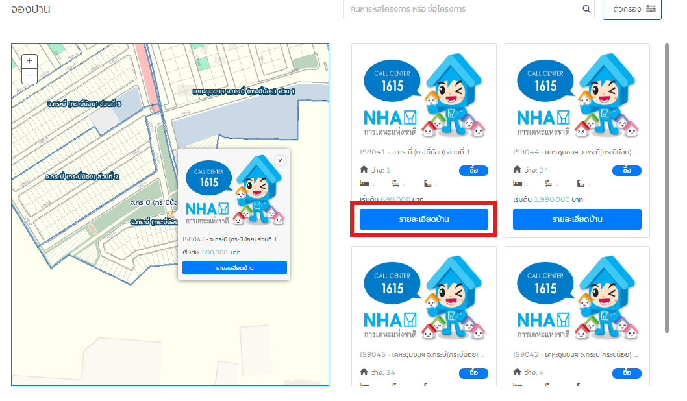<figcaption>
<strong>รูปภาพที่ 44</strong> หน้าจอรายละะเอียดการจองบ้าน – ปุ่มรายละเอียดบ้าน
</figcaption></figure>

ระบบจะแสดงหน้ารายละเอียดบ้าน โดยมีส่วนประกอบดังต่อไปนี้

<figure>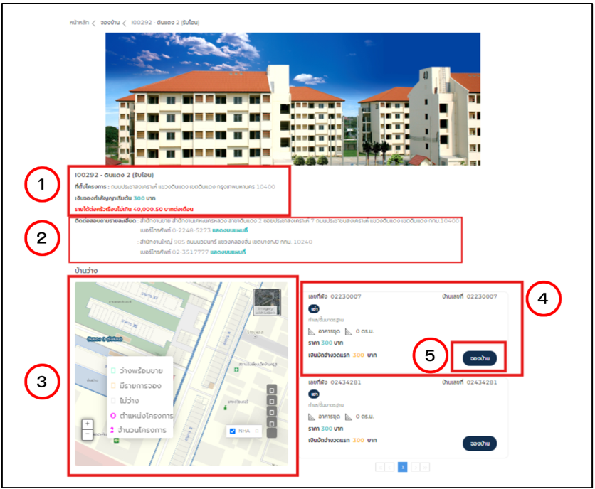<figcaption>
<strong>รูปภาพที่ 45</strong> หน้าจอรายละเอียดการจองบ้าน – แสดงรายการโครงการ
</figcaption></figure>

1. ชื่อโครงการ และรายละเอียดโครงการ Text Link “แสดงบนแผนที่”
2. รายละเอียดสอบถาม : สำนักงานใหญ่ / สำนักงานขาย
3. แผนที่แสดงตำแหน่งของโครงการ
4. แสดงรายละเอียดบ้าน
5. ปุ่ม “จองบ้าน”

ผู้ใช้งานสามารถ คลิกที่ Text Link **“แสดงบนแผนที่”** ระบบจะแสดงหน้าต่างป๊อบอัพ (Pop-up) แผนที่

<figure>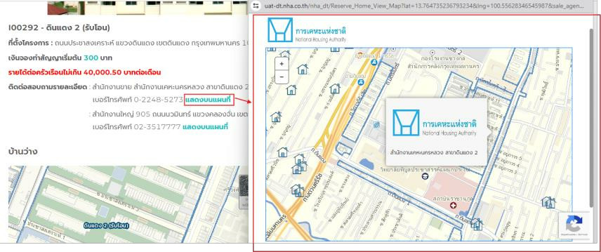<figcaption>
<strong>รูปภาพที่ 46</strong> หน้าจอรายละเอียดการจองบ้าน – Pop-up แสดงบนแผนที่
</figcaption></figure>

ผู้ใช้งานสามารถ คลิกที่ Text Link **"สำนักงานใหญ่"** ระบบจะแสดงหน้าต่างป๊อบอัพ (Pop-up) แผนที่สำนักงานใหญ่

<figure>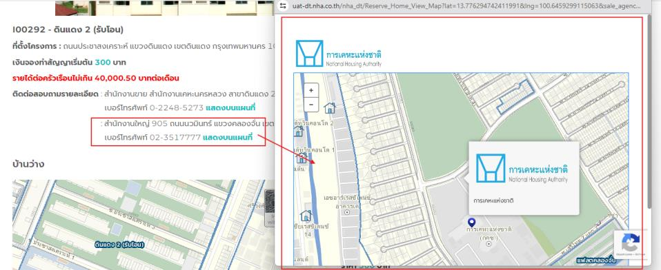<figcaption>
<strong>รูปภาพที่ 47</strong> หน้าจอรายละเอียดการจองบ้าน – Pop-up แผนที่สำนักงานใหญ่
</figcaption></figure>

เลือกการ์ดบ้านที่ต้องการ จากนั้นแผนที่จะแสดงตำแหน่งของบ้านที่เลือก

<figure>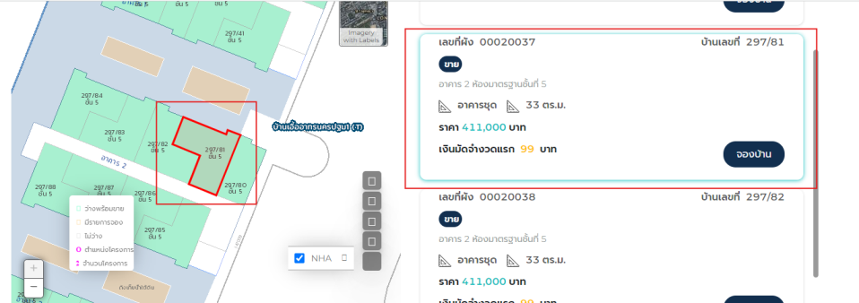<figcaption>
<strong>รูปภาพที่ 48</strong> หน้าจอรายละเอียดการจองบ้าน – แสดงตำแหน่งของบ้านที่เลือก
</figcaption></figure>

ผู้ใช้งานสามารถคลิกปุ่ม **“เลขหน้า”** เพื่อดูรายการเพิ่มเติมได้

<figure>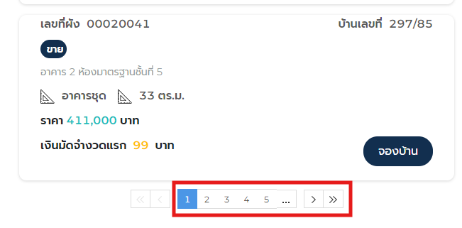<figcaption>
<strong>รูปภาพที่ 49</strong> หน้าจอรายละเอียดการจองบ้าน – ปุ่มเลขหน้าเลื่อนเพื่อดูรายการเพิ่มเติม
</figcaption></figure>

คลิกเลือกบ้านที่ต้องการจอง จากนั้น คลิกปุ่ม **“จองบ้าน”**

<figure><figcaption>
<strong>รูปภาพที่ 50</strong> หน้าจอรายละเอียดการจองบ้าน – ปุ่มจองบ้าน
</figcaption></figure>

ระบบแสดงหน้าต่างป๊อบอัพ (Pop-up) ทำสัญญาจองบ้าน จากนั้นกรอกรายละเอียดเพื่อทำสัญญาจองบ้าน จากนั้นคลิกปุ่ม “ต่อไป” จนถึงหน้าสุดท้ายคลิกปุ่ม “บันทึก”

<figure><figcaption>
<strong>รูปภาพที่ 51</strong> หน้าจอรายละเอียดการจองบ้าน – หน้าต่างป๊อบอัพ (Pop-up) ทำสัญญาจองบ้าน
</figcaption></figure>

ระบบจะแสดงหน้ายืนยันการจองบ้าน เพื่อสรุปรายละเอียดและยืนยันการจองบ้าน จากนั้นคลิกปุ่ม “ยืนยัน”

<figure><figcaption>
<strong>รูปภาพที่ 52</strong> หน้าจอรายละเอียดการจองบ้าน – หน้าต่างป๊อบอัพ (Pop-up) ยืนยันการจองบ้าน
</figcaption></figure>

กรอกรหัสยืนยันตัวตน (OTP)

<figure>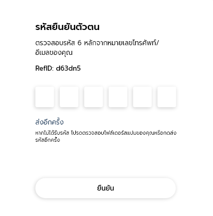<figcaption>
<strong>รูปภาพที่ 53</strong> หน้าจอรายละเอียดการจองบ้าน – หน้าต่างป๊อบอัพ (Pop-up)
</figcaption></figure>

<figure>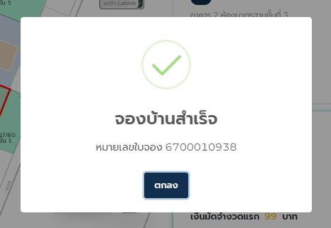<figcaption>
<strong>รูปภาพที่ 54</strong> ระบบจะแสดงหน้าต่างป๊อบอัพ (Pop-up) จองสำเร็จ
</figcaption></figure>

ระบบนำไปยังหน้าตรวจสอบการทำสัญญาเช่าที่อยู่อาศัย

### 5.4 ตรวจสอบสถานะการจองที่อยู่อาศัย

#### **5.4.1 ชำระเงิน**

* คลิก “ตรวจสอบสถานะการจองที่อยู่อาศัย” จากหน้า Landing Page หรือจากการกดจองบ้านสำเร็จ

<figure><figcaption>
<strong>รูปภาพที่ 55</strong> หน้าจอการชำระเงิน– ปุ่มตรวจสอบสถานะการทำสัญญาเช่าที่อยู่อาศัย
</figcaption></figure>

* การดูสถานะการชำระเงิน

<figure>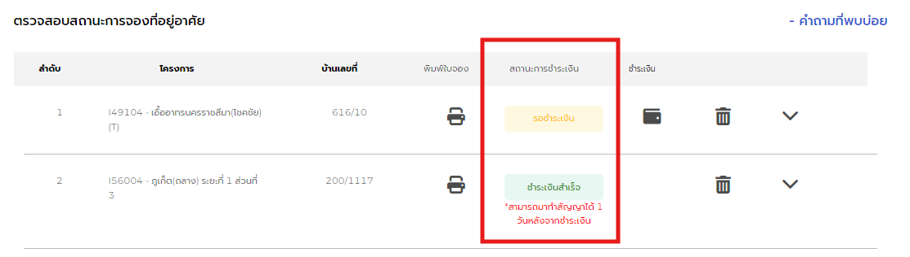<figcaption>
<strong>รูปภาพที่ 56</strong> หน้าจอการชำระเงิน – สถานะการชำระเงิน
</figcaption></figure>

* คลิกเลือกบ้านที่ต้องการชำระเงิน

<figure><figcaption>
<strong>รูปภาพที่ 57</strong> หน้าจอการชำระเงิน – โครงการที่รอชำระเงิน
</figcaption></figure>

1\. ชำระเงิน

2\. ยกเลิกใบจอง

3\. แสดงรายละเอียดของโครงการที่จอง จะปรากฎรายละเอียดด้านล่าง

คลิกที่ไอคอน หมายเลข 1 “ชำระเงิน”

<figure>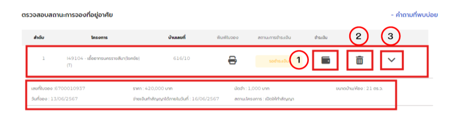<figcaption>
<strong>รูปภาพที่ 58</strong> หน้าจอการชำระเงิน – ไอคอนชำระเงิน
</figcaption></figure>

ระบบแสดงหน้าต่างป๊อบอัพ (Pop-up) ช่องทางการชำระเงิน เลือกข่องทางที่ต้องการ จากนั้นคลิก “ยืนยัน”

<figure>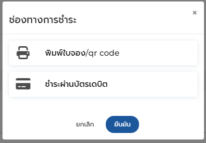<figcaption>
<strong>รูปภาพที่ 59</strong> หน้าจอการชำระเงิน – หน้าต่างป๊อบอัพ (Pop-up) ช่องทางการชำระเงิน
</figcaption></figure>

* ชำระผ่านบัตรเดบิต เลือกประเภทบัตร และกรอกข้อมูลบัตร จากนั้นคลิกปุ่ม “Submit”

<figure>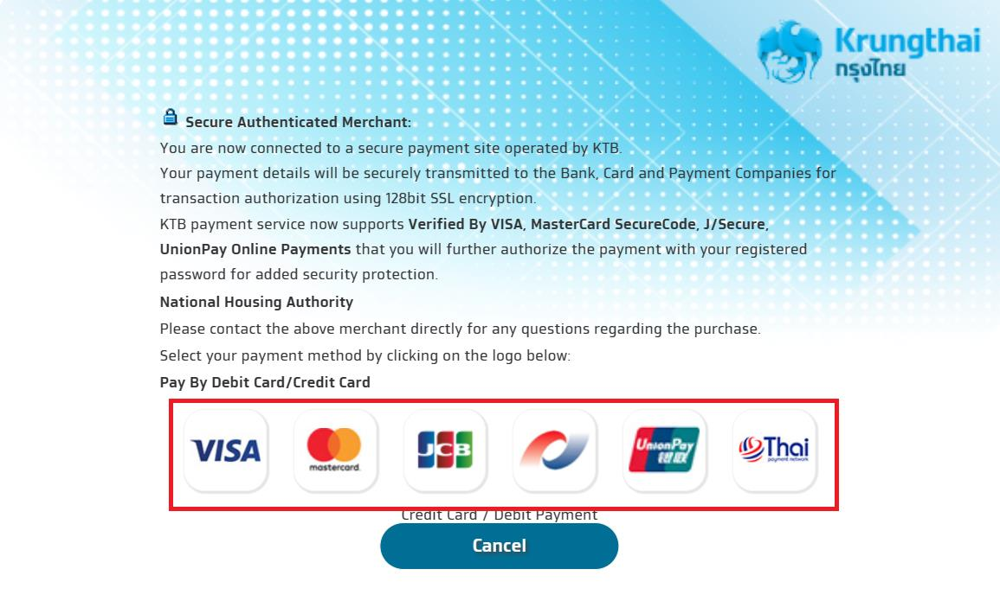<figcaption>
<strong>รูปภาพที่ 60</strong> หน้าจอการชำระเงิน – เลือกประเภทบัตรเดบิตช่องทางการชำระเงิน
</figcaption></figure>

<figure>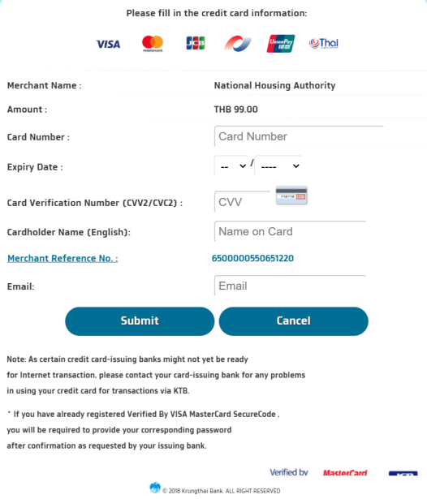<figcaption>
<strong>รูปภาพที่ 61</strong> หน้าจอการชำระเงิน – กรอกข้อมูลบัตรเดบิต
</figcaption></figure>

#### **5.4.2 พิมพ์ใบจอง**

* คลิก “พิมพ์ใบจอง / QR code”

ระบบจะทำการสร้างแบบฟอร์มชำระเงินเป็นไฟล์ .pdf ผู้ใช้งานสามารถดาวน์โหลดไฟล์เพื่อใช้ในการชำระเงินที่ตัวแทนชำระและธนาคารได้ หรือสามารถสแกน QR code เพื่อชำระผ่าน internet banking ได้

<figure><figcaption>
<strong>รูปภาพที่ 62</strong> หน้าจอการชำระเงิน – ใบจอง.pdf
</figcaption></figure>

#### 5.4.3 ยกเลิกใบจอง

* คลิกเลือกบ้านที่ต้องการยกเลิกการจอง
* คลิกปุ่มหมายเลข 2 “ยกเลิกใบจอง”

<figure>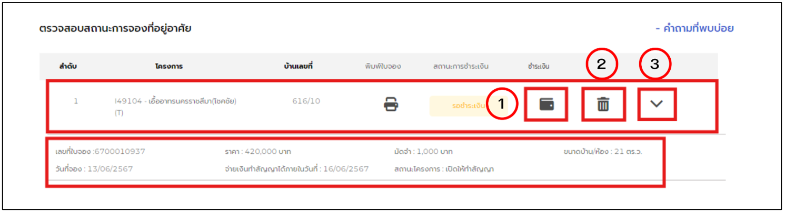<figcaption>
<strong>รูปภาพที่ 63</strong> หน้าจอการชำระเงิน – ปุ่มยกเลิกใบจอง
</figcaption></figure>

ระบบจะแสดงหน้าต่างป๊อบอัพ (Pop-up) ยืนยันการยกเลิกสัญญาเช่าที่อยู่อาศัย โดยให้เลือกเหตุผลในการยกเลิกใบจองก่อน จากนั้น คลิกปุ่ม “ยืนยัน” จากนั้นระบบจะทำการยกเลิกใบจอง

<figure><figcaption>
<strong>รูปภาพที่ 64</strong> หน้าจอการชำระเงิน – หน้าต่างป๊อบอัพ (Pop-up) ยืนยันการยกเลิกสัญญาเช่าที่อยู่อาศัย
</figcaption></figure>

## **บทที่ 6 การใช้งานในส่วนของลงทะเบียนความสนใจในโครงการ**

หัวข้อต่อไปนี้จะอธิบายถึงการใช้งานในส่วนของการจองสิทธิ์ลงทะเบียนความสนใจในโครงการ

### 6.1 การค้นหาโครงการ

ผู้ใช้งานเลื่อนหน้าต่างลงมาที่หัวข้อ “ลงทะเบียนความสนใจในโครงการ” ซึ่งเป็นโครงการที่อยู่ในระหว่างก่อนสร้าง หรือว่า เป็นโครงการที่สำรวจความต้องการ มีแผนที่จะสร้างโครงการ โดยเปิดให้ผู้สนใจจองสิทธิ์ก่อน โดยมีให้เลือกทั้งแบบ เช่า หรือ ซื้อ

<figure>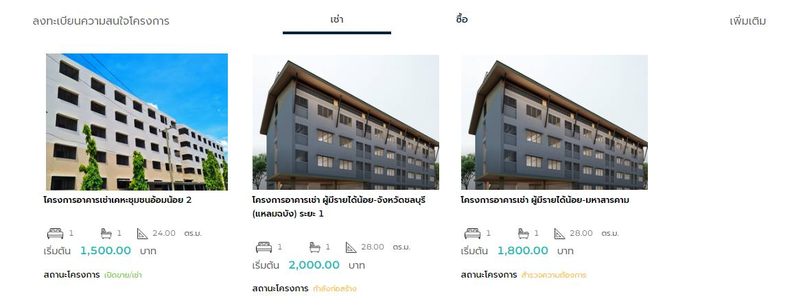<figcaption>
<strong>รูปภาพที่ 65</strong> หน้าจอลงทะเบียนความสนใจโครงการ – แสดงรายละเอียดโครงการ
</figcaption></figure>

### 6.2 ดูโครงการเพิ่มเติม

คลิกปุ่ม “เพิ่มเติม” ระบบจะแสดงโครงการที่เปิดให้จองสิทธิ์

<figure><figcaption>
<strong>รูปภาพที่ 66</strong> หน้าจอลงทะเบียนความสนใจโครงการ – ปุ่ม “เพิ่มเติม”
</figcaption></figure>

<figure>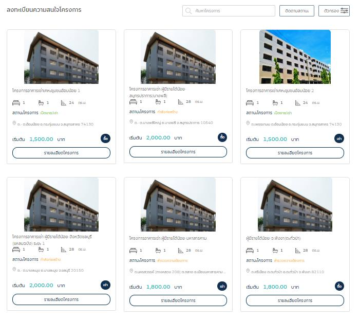<figcaption>
<strong>รูปภาพที่ 67</strong> หน้าจอลงทะเบียนความสนใจโครงการ – รายละเอียดโตรงการทั้งหมดที่เปิดให้จองสิทธิ์
</figcaption></figure>

ในหน้าจอนี้สามารถดูสถานะโครงการได้ว่า เปิดขาย/เช่า , กำลังก่อสร้าง , สำรวจความต้องการ เพื่อประกอบการตัดสินใจในการจอง นอกจากนี้ สามารถคลิกปุ่ม “รายละเอียดโครงการ” เพื่อดูข้อมูลโครงการที่สนใจเพิ่มเติม

### 6.3 ขั้นตอนการจองสิทธิ์โครงการ

เลือกโครงการที่ต้องการจองสิทธิ์ จากนั้น**คลิกปุ่ม “รายละเอียดโครงการ”**

<figure>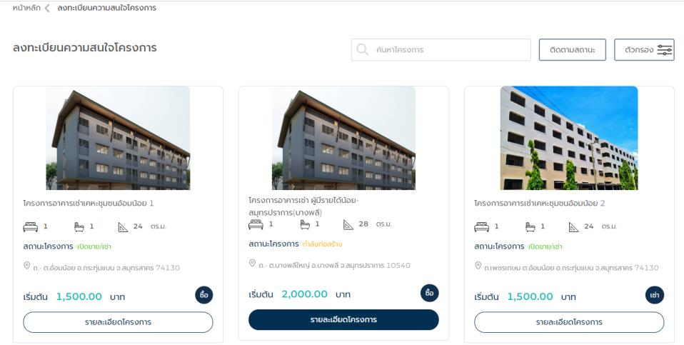<figcaption>
<strong>รูปภาพที่ 68</strong> หน้าจอการจองสิทธิ์โครงการ – ปุ่มรายละเอียดโครงการ
</figcaption></figure>

ระบบจะแสดงหน้ารายละเอียดโครงการ โดยมีส่วนประกอบดังนี้

<figure>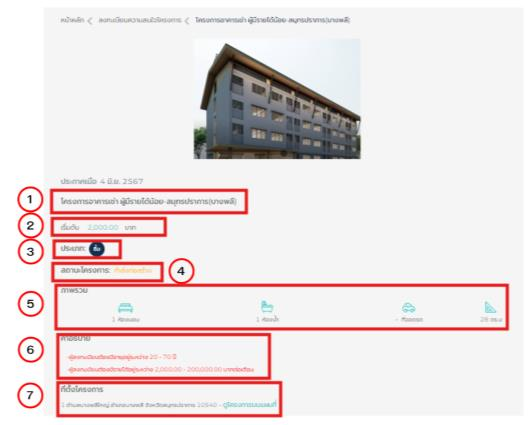<figcaption>
<strong>รูปภาพที่ 69</strong> หน้าจอการจองสิทธิ์โครงการ – รายละเอียดโครงการ หมายเลข 1-5
</figcaption></figure>

1. ชื่อโครงการ
2. ราคาเริ่มต้น
3. ประเภทโครงการ เช่า / ซื้อ
4. สถานะโครงการ
5. ภาพรวม
6. คำอธิบาย
7. ที่ตั้งโครงการ Text Link ดูโครงการบนแผนที่

<figure><figcaption>
<strong>รูปภาพที่ 70</strong> หน้าจอการจองสิทธิ์โครงการ – แบบแปลนโครงการในแต่ละชั้น
</figcaption></figure>

<figure>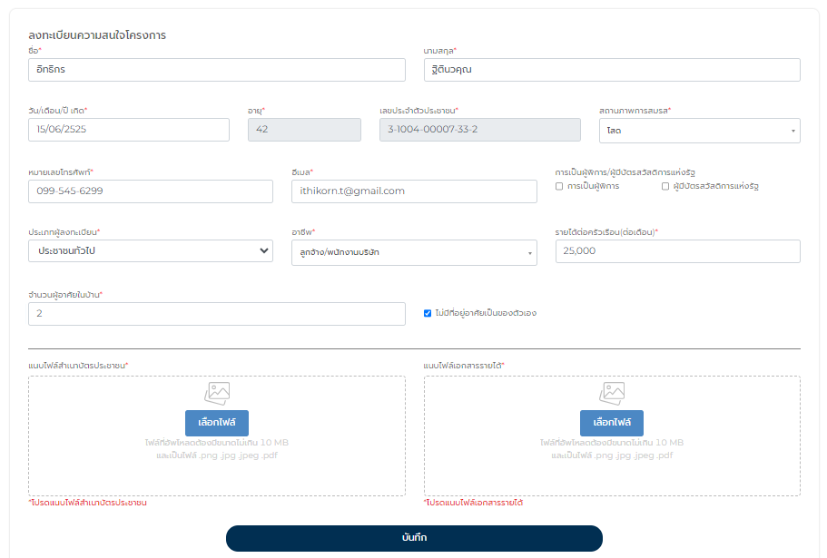<figcaption>
<strong>รูปภาพที่ 71</strong> หน้าจอการลงทะเบียนความสนใจในโครงการ
</figcaption></figure>

* **คลิกเลือกแบบแปลนชั้น**

<figure>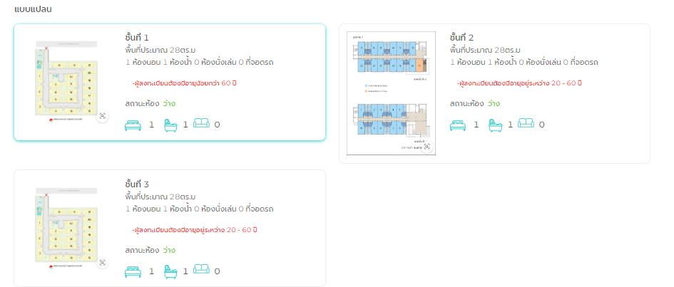<figcaption>
<strong>รูปภาพที่ 72</strong> หน้าจอการจองสิทธิ์โครงการ – แบบแปลนชั้น
</figcaption></figure>

* กรอกรายละเอียดการจองสิทธิ์โครงการ จากนั้น **คลิกปุ่ม “บันทึก”**

<figure>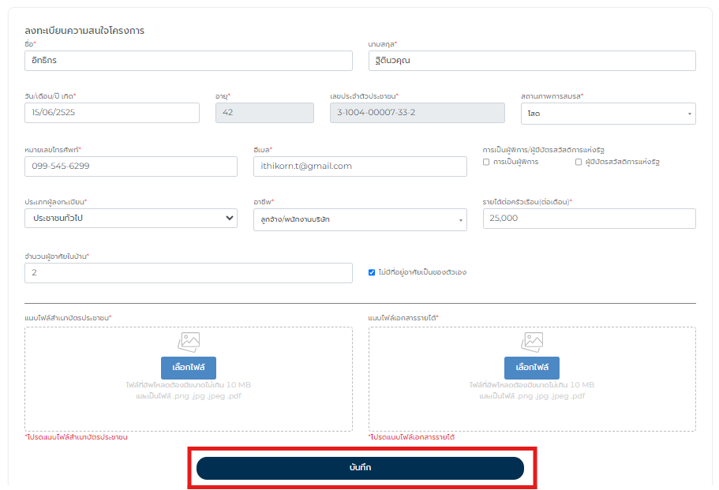<figcaption>
<strong>รูปภาพที่ 73</strong> หน้าจอการจองสิทธิ์โครงการ – กรอกรายละเอียดการจองสิทธิ์โครงการ
</figcaption></figure>

ระบบจะแสดงหน้าต่างป๊อบอัพ (Pop-up) ทำสัญญาลงทะเบียนโครงการสำเร็จ จากนั้นคลิกปุ่ม “ตกลง” ระบบจะทำการปิดหน้าต่างป๊อบอัพ (Pop-up)&#x20;

<figure>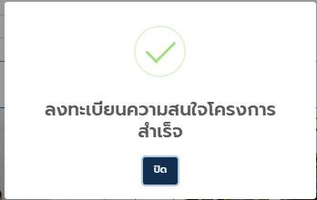<figcaption>
<strong>รูปภาพที่ 74</strong> หน้าจอการจองสิทธิ์โครงการ – หน้าต่างป๊อบอัพ (Pop-up) ลงทะเบียนความสนใจโครงการสำเร็จ
</figcaption></figure>

### 6.4 ติดตามสถานะการจองสิทธิ์โครงการ

**คลิกปุ่ม “ติดตามสถานะ”**

<figure>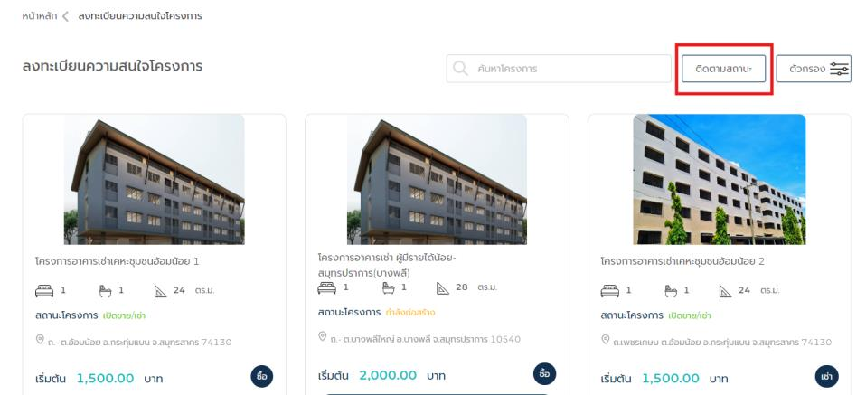<figcaption>
<strong>รูปภาพที่ 75</strong> หน้าจอการจองสิทธิ์โครงการ – ปุ่มติดตามสถานะจองสิทธิ์โครงการ
</figcaption></figure>

ระบบจะแสดงหน้าต่างป๊อบอัพ (Pop-up) ติดตามสถานะการจองสิทธิ์โครงการ ผู้ใช้งานสามารถติดตามสถานะการจองสิทธิ์โครงการได้

<figure>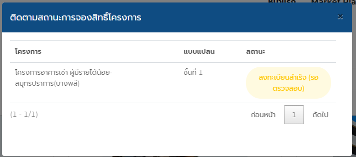<figcaption>
<strong>รูปภาพที่ 76</strong> หน้าจอการจองสิทธิ์โครงการ – หน้าต่างป๊อบอัพ (Pop-up) ติดตามสถานะการจองสิทธิ์โครงการ
</figcaption></figure>

## **บทที่ 7 การใช้งานในส่วนของการติดต่อสอบถาม**

หัวข้อต่อไปนี้จะอธิบายถึงการใช้งานในส่วนของการติดต่อสอบถาม

### 7.1 การติดต่อการเคหะแห่งชาติ

หน้า Landing Page เมื่อเลื่อนลงไปด้านล่าง จะเจอเมนูการติดต่อการเคหะแห่งชาติ คลิกปุ่ม **“ติดต่อการเคหะแห่งชาติ”** เพื่อติดต่อการเคหะแห่งชาติ

<figure><figcaption>
<strong>รูปภาพที่ 77</strong> หน้าจอการติดต่อการเคหะแห่งชาติ – การติดต่อการเคหะแห่งชาติ
</figcaption></figure>

กรอกรายละเอียดเรื่องที่จะติดต่อการเคหะแห่งชาติ

<figure>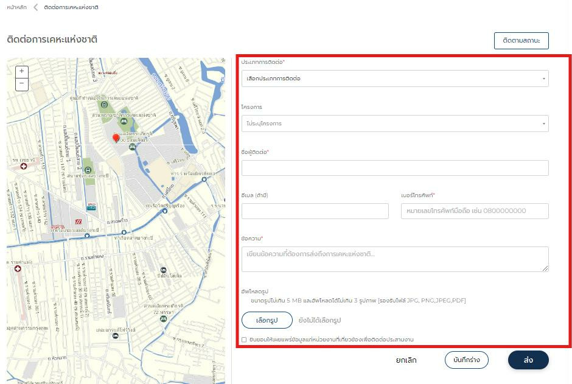<figcaption>
<strong>รูปภาพที่ 78</strong> หน้าจอการติดต่อการเคหะแห่งชาติ – กรอกรายละเอียดการติดต่อการเคหะแห่งชาติ
</figcaption></figure>

คลิกปุ่ม “บันทึกร่าง”

<figure>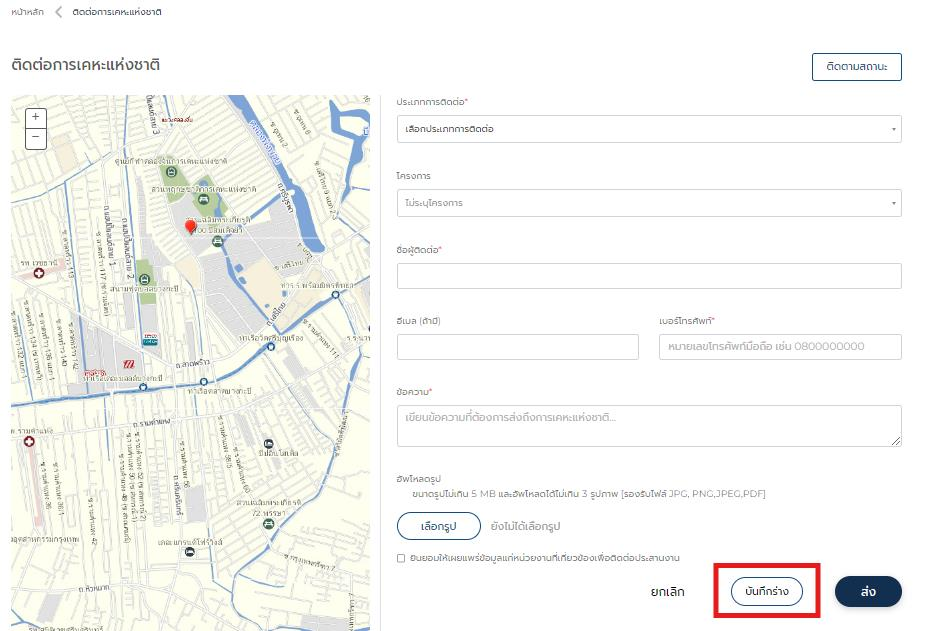<figcaption>
<strong>รูปภาพที่ 79</strong> หน้าจอการติดต่อการเคหะแห่งชาติ – ปุ่มบันทึกร่าง
</figcaption></figure>

ระบบแสดงหน้าต่างป๊อบอัพ (Pop-up) บันทึกร่างสำเร็จ คลิกปุ่ม “ตกลง” ระบบจะทำการบันทึกร่าง และแสดงหน้าจอ Landing Page ต่อไป

<figure>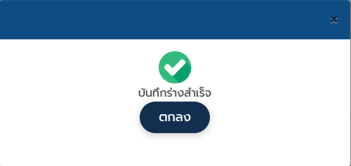<figcaption>
<strong>รูปภาพที่ 80</strong> หน้าจอการติดต่อการเคหะแห่งชาติ – หน้าต่างป๊อบอัพ (Pop-up) บันทึกร่างสำเร็จ
</figcaption></figure>

<figure>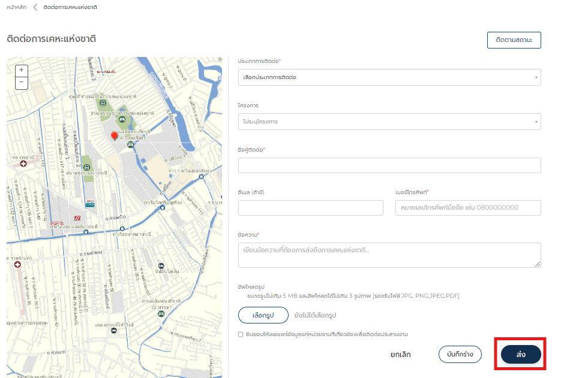<figcaption>
<strong>รูปภาพที่ 81</strong> หน้าจอการติดต่อการเคหะแห่งชาติ – การส่งข้อความเพื่อติดต่อการเคหะ
</figcaption></figure>

ระบบแสดงหน้าต่างป๊อบอัพ (Pop-up) ส่งข้อความติดต่อการเคหะแห่งชาติสำเร็จ คลิกปุ่ม “ตกลง” ระบบจะทำการส่งข้อความไปยังการเคหะแห่งชาติ และแสดงหน้าจอ Landing Page ต่อไป

<figure>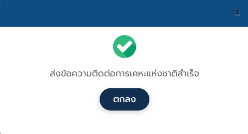<figcaption>
<strong>รูปภาพที่ 82</strong> หน้าจอการติดต่อการเคหะแห่งชาติ – หน้าต่างป๊อบอัพ (Pop-up) ส่งข้อความติดต่อการเคหะสำเร็จ
</figcaption></figure>

คลิกปุ่ม “ติดตามสถานะ”

<figure>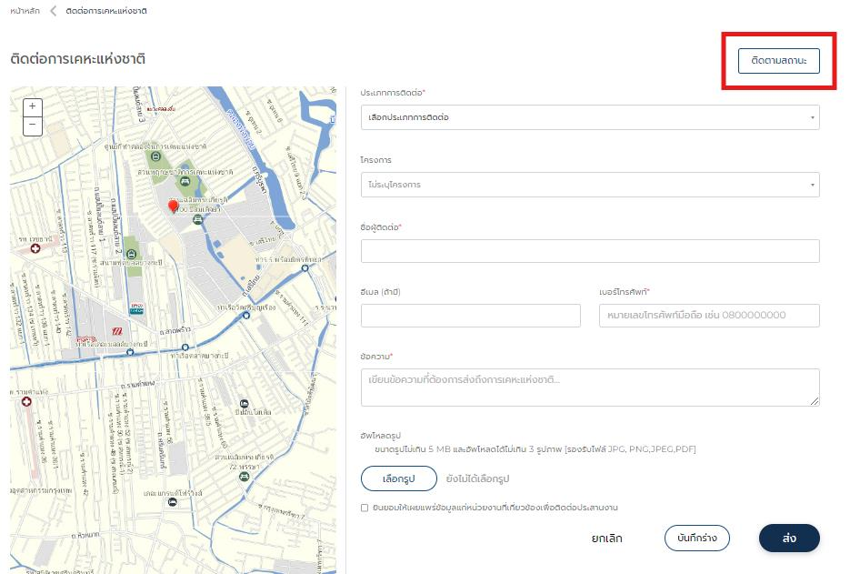<figcaption>
<strong>รูปภาพที่ 83</strong> หน้าจอการติดต่อการเคหะแห่งชาติ – การติดตามสถานะ
</figcaption></figure>

ระบบจะแสดงหน้าต่างป๊อบอัพ (Pop-up) ติดตามสถานะการติดต่อการเคหะ ผู้ใช้งานสามารถติดตามสถานะการติดต่อการเคหะได้

<figure>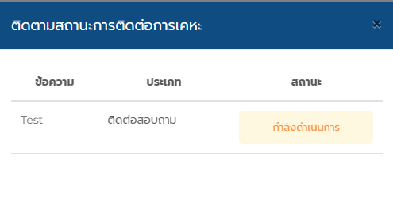<figcaption>
<strong>รูปภาพที่ 84</strong> หน้าจอการติดต่อการเคหะแห่งชาติ – หน้าต่างป๊อบอัพ (Pop-up) การติดตามสถานะการติดต่อการเคหะ
</figcaption></figure>

### 7.2 การร้องเรียนเรื่องทุจริต

จากหน้า Landing Page เมื่อเลื่อนเมาส์ลงไปด้านล่าง จะเจอเมนูการติดต่อการเคหะแห่งชาติ คลิกปุ่ม **“ร้องเรียนเรื่องทุจริต”** เพื่อติดต่อการเคหะแห่งชาติ

<figure><figcaption>
<strong>รูปภาพที่ 85</strong> หน้าจอการติดต่อการเคหะแห่งชาติ – การร้องเรียนเรื่องทุจริต
</figcaption></figure>

กรอกรายละเอียดเรื่องที่จะติดต่อการเคหะแห่งชาติ

<figure>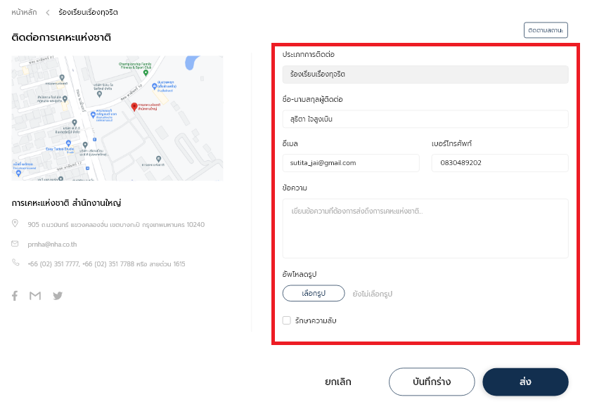<figcaption>
<strong>รูปภาพที่ 86</strong> หน้าจอการติดต่อการเคหะแห่งชาติ – กรอกรายละเอียดการร้องเรียนเรื่องทุจริต
</figcaption></figure>

คลิกปุ่ม “บันทึกร่าง”

<figure>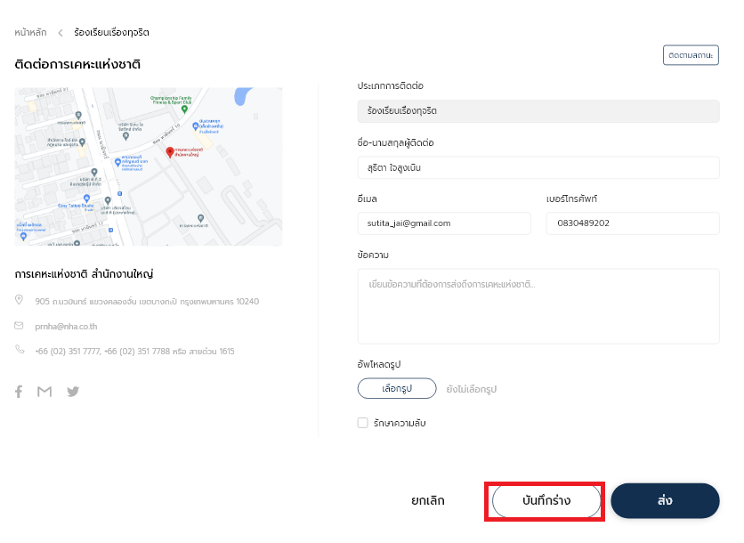<figcaption>
<strong>รูปภาพที่ 87</strong> หน้าจอการติดต่อการเคหะแห่งชาติ – การบันทึกร่าง
</figcaption></figure>

ระบบแสดงหน้าต่างป๊อบอัพ (Pop-up) บันทึกร่างสำเร็จ คลิกปุ่ม “ตกลง” ระบบจะทำการบันทึกร่าง และแสดงหน้าจอ Landing Page ต่อไป

<figure><figcaption>
<strong>รูปภาพที่ 88</strong> หน้าจอการติดต่อการเคหะแห่งชาติ – หน้าต่างป๊อบอัพ (Pop-up) การบันทึกร่างสำเร็จ
</figcaption></figure>

คลิกปุ่ม “ส่ง”

<figure>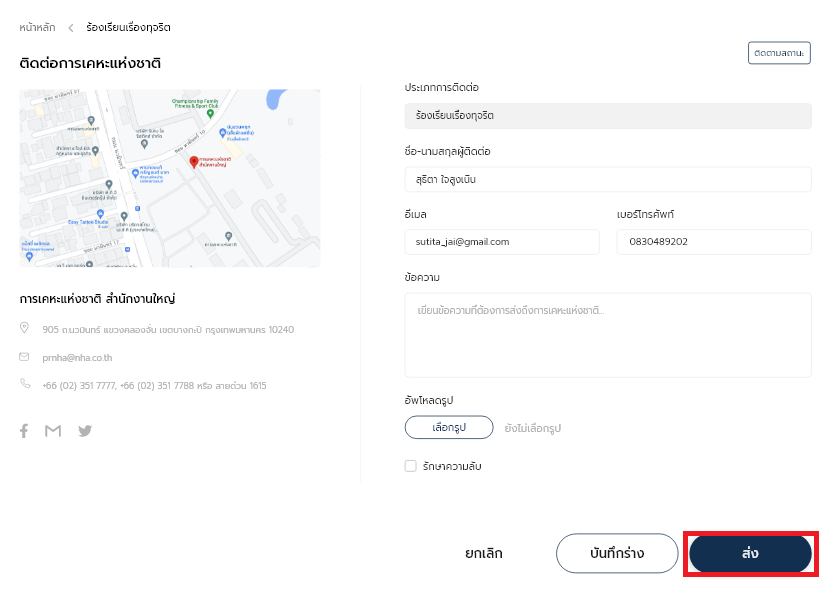<figcaption>
<strong>รูปภาพที่ 89</strong> หน้าจอการติดต่อการเคหะแห่งชาติ – ปุ่มส่งข้อความร้องเรียนเรื่องทุจริต
</figcaption></figure>

ระบบแสดงหน้าต่างป๊อบอัพ (Pop-up) ส่งข้อความร้องเรียนเรื่องทุจริตสำเร็จ คลิกปุ่ม “ตกลง” ระบบจะทำการส่งข้อความไปยังการเคหะแห่งชาติ และแสดงหน้าจอ Landing Page ต่อไป

<figure>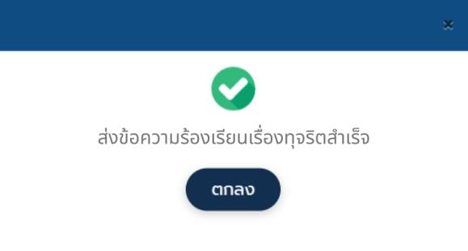<figcaption>
<strong>รูปภาพที่ 90</strong> หน้าจอการติดต่อการเคหะแห่งชาติ – หน้าต่างป๊อบอัพ (Pop-up) ส่งข้อความร้องเรียนเรื่องทุจริตสำเร็จ
</figcaption></figure>

คลิกปุ่ม “ติดตามสถานะ”

<figure>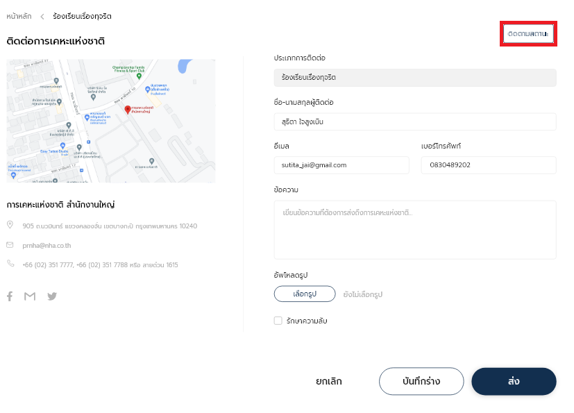<figcaption>
<strong>รูปภาพที่ 91</strong> หน้าจอการติดต่อการเคหะแห่งชาติ – การติดตามสถานะ
</figcaption></figure>

ระบบจะแสดงหน้าต่างป๊อบอัพ (Pop-up) ติดตามสถานะการติดต่อการเคหะ ผู้ใช้งานสามารถติดตามสถานะเรื่องร้องเรียนได้

<figure>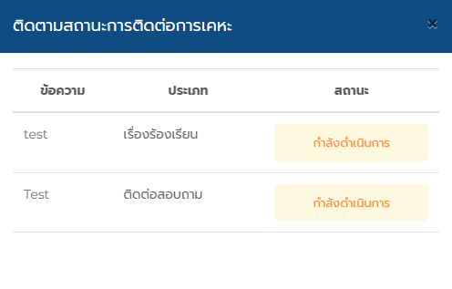<figcaption>
<strong>รูปภาพที่ 92</strong> หน้าจอการติดต่อการเคหะแห่งชาติ – การติดตามสถานะการติดต่อการเคหะ
</figcaption></figure>

## **บทที่ 8 การใช้งานในส่วนของ Marketplace ฝั่งผู้ซื้อ**

### 8.1 ค้นหาสินค้าและบริการใน Market Place

การค้นหาสินค้าและบริการ ระบุข้อมูลในช่องค้นหาสินค้า จากนั้นคลิกบริเวณอื่นเพื่อให้ระบบค้นหาข้อมูล

<figure>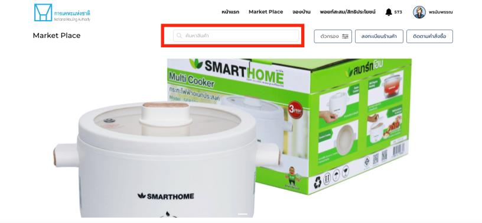<figcaption>
<strong>รูปภาพที่ 93</strong> หน้าจอการใช้งาน Marketplace ผู้ซื้อ – การค้นหาสินค้า
</figcaption></figure>

### 8.2 ตัวกรองสินค้าและบริการใน Market Place

คลิกปุ่ม “ตัวกรอง”

<figure>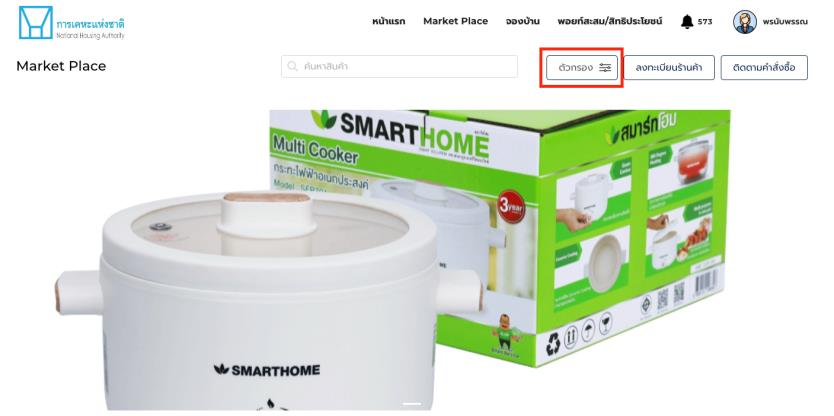<figcaption>
<strong>รูปภาพที่ 94</strong> หน้าจอการใช้งาน Marketplace ผู้ซื้อ – การกรองสินค้า
</figcaption></figure>

ระบบจะแสดงหน้าต่างป๊อบอัพ (Pop-up) ตัวกรอง

<figure>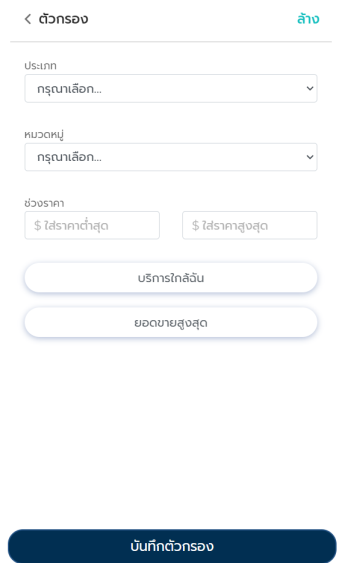<figcaption>
<strong>รูปภาพที่ 95</strong> หน้าจอการใช้งาน Marketplace ผู้ซื้อ – หน้าต่างป๊อบอัพ (Pop-up) ตัวกรอง
</figcaption></figure>

เลือกข้อมูลที่ต้องการกรอง จากนั้นคลิกปุ่ม “บันทึกตัวกรอง” ระบบจะกรองข้อมูลตามเงื่อนไขที่ระบุ

<figure>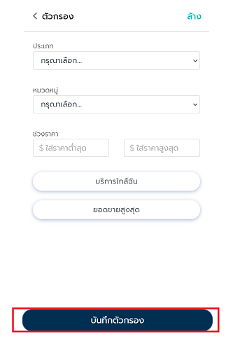<figcaption>
<strong>รูปภาพที่ 96</strong> หน้าจอการใช้งาน Marketplace ผู้ซื้อ – บันทึกตัวกรอง
</figcaption></figure>

ผู้ใช้งานสามารถ คลิก “ล้าง” เพื่อล้างข้อมูลที่เลือกได้

<figure>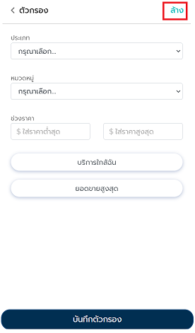<figcaption>
<strong>รูปภาพที่ 97</strong> หน้าจอการใช้งาน Marketplace ผู้ซื้อ – ปุ่มล้างตัวกรอง
</figcaption></figure>

คลิกปุ่ม “<” เพื่อปิดตัวกรอง

<figure>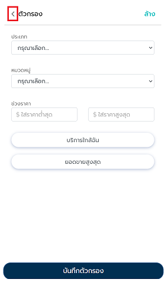<figcaption>
<strong>รูปภาพที่ 98</strong> หน้าจอการใช้งาน Marketplace ผู้ซื้อ – ปุ่มย้อนกลับเพื่อปิดตัวกรอง
</figcaption></figure>

### 8.3 สั่งซื้อสินค้าและบริการ

#### **8.3.1 แท็บ Home Service Market Place**

คลิกแท็บ “Home Service Market Place”

<figure>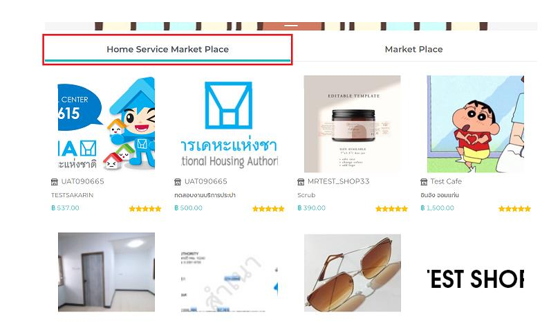<figcaption>
<strong>รูปภาพที่ 99</strong> หน้าจอการใช้งาน Marketplace ผู้ซื้อ – Home Service Market Place
</figcaption></figure>

คลิกเลือกสินค้าหรือบริการที่ต้องการ

<figure>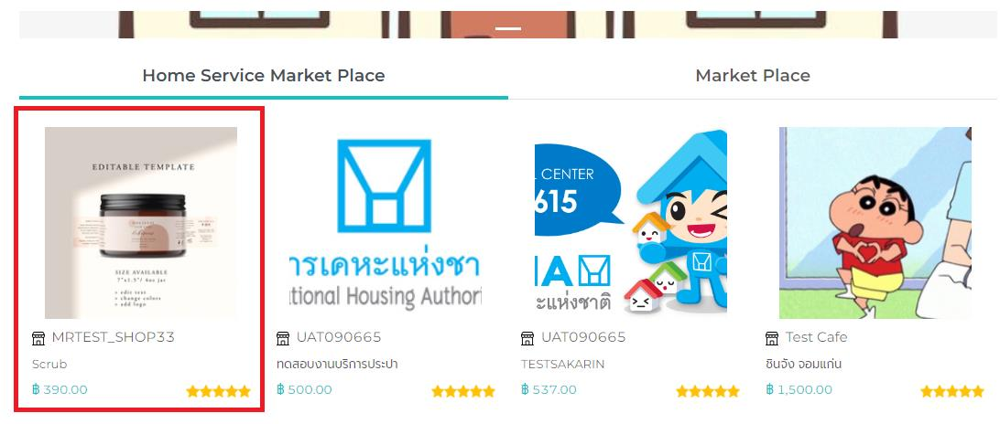<figcaption>
<strong>รูปภาพที่ 100</strong> หน้าจอการใช้งาน Marketplace ผู้ซื้อ – เลือกสินค้า
</figcaption></figure>

ระบุจำนวนสินค้าที่ต้องการ จากนั้นคลิกปุ่ม “สั่งซื้อสินค้า”

<figure>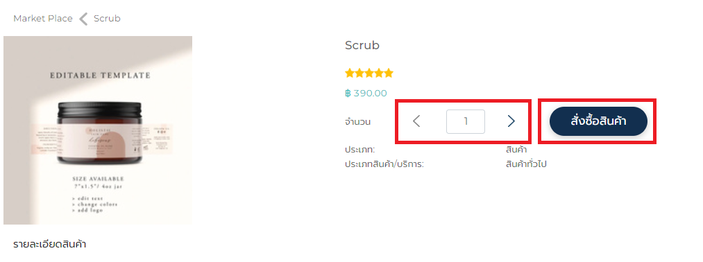<figcaption>
<strong>รูปภาพที่ 101</strong> หน้าจอการใช้งาน Marketplace ผู้ซื้อ – ระบุจำนวนสินค้า
</figcaption></figure>

ผู้ใช้งานสามารถเปลี่ยนที่อยู่สำหรับการจัดส่ง โดยการคลิกปุ่ม “เปลี่ยน”

<figure><figcaption>
<strong>รูปภาพที่ 102</strong> หน้าจอการใช้งาน Marketplace ผู้ซื้อ – ระบุจำนวนสินค้า
</figcaption></figure>

ระบบจะแสดงหน้าต่างป๊อบอัพ (Pop-up) ที่อยู่สำหรับการจัดส่ง ผู้ใช้งานสามารถเลือกที่อยู่ที่ต้องการจัดส่งได้ จากนั้นคลิกปุ่ม “ตกลง”

<figure>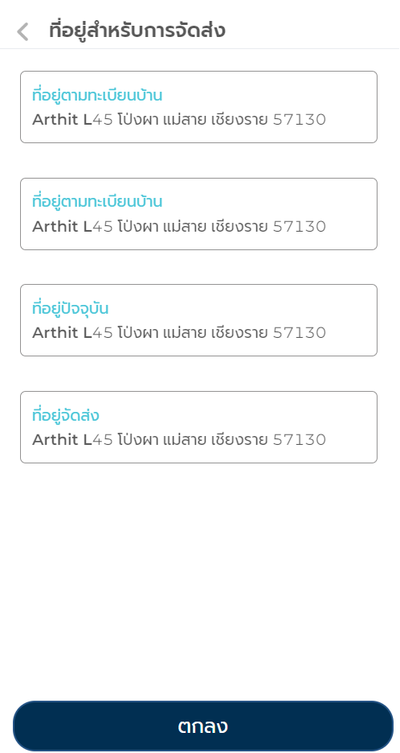<figcaption>
<strong>รูปภาพที่ 103</strong> หน้าจอการใช้งาน Marketplace ผู้ซื้อ – หน้าต่างป๊อบอัพ (Pop-up) ที่อยู่สำหรับการจัดส่ง
</figcaption></figure>

ผู้ใช้งานสามารถส่งข้อความถึงผู้ขายได้ที่ฟิลด์ “ฝากข้อความถึงผู้ขาย”

<figure>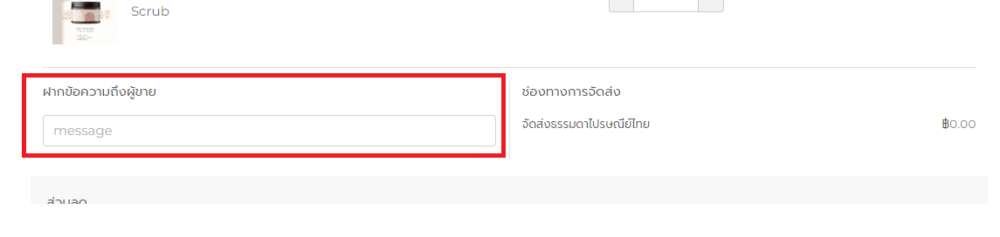<figcaption>
<strong>รูปภาพที่ 104</strong> หน้าจอการใช้งาน Marketplace ผู้ซื้อ – ฝากข้อความถึงผู้ขาย
</figcaption></figure>

ผู้ใช้งานสามารถดูช่องทางการจัดส่งได้ที่ฟิลด์ “ช่องทางการจัดส่ง”

<figure>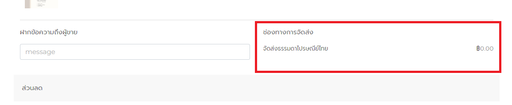<figcaption>
<strong>รูปภาพที่ 105</strong> หน้าจอการใช้งาน Marketplace ผู้ซื้อ – ช่องทางการจัดส่ง
</figcaption></figure>

ผู้ใช้งานสามารถเลือกใช้ส่วนลดที่แลกจาก คะแนนสะสม/สิทธิประโยชน์ ในการสั่งซื้อสินค้าและบริการได้

<figure>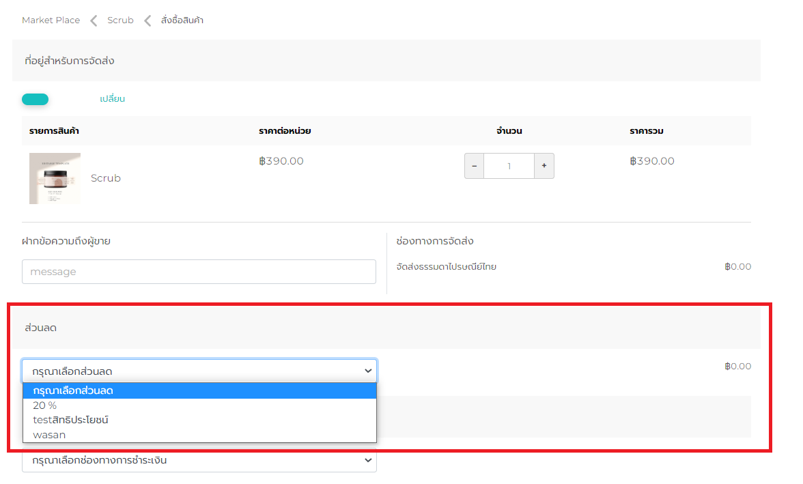<figcaption>
<strong>รูปภาพที่ 106</strong> หน้าจอคะแนนสะสม/สิทธิประโยชน์ – การใช้ส่วนลด
</figcaption></figure>

เลือกช่องทางการชำระเงิน

<figure>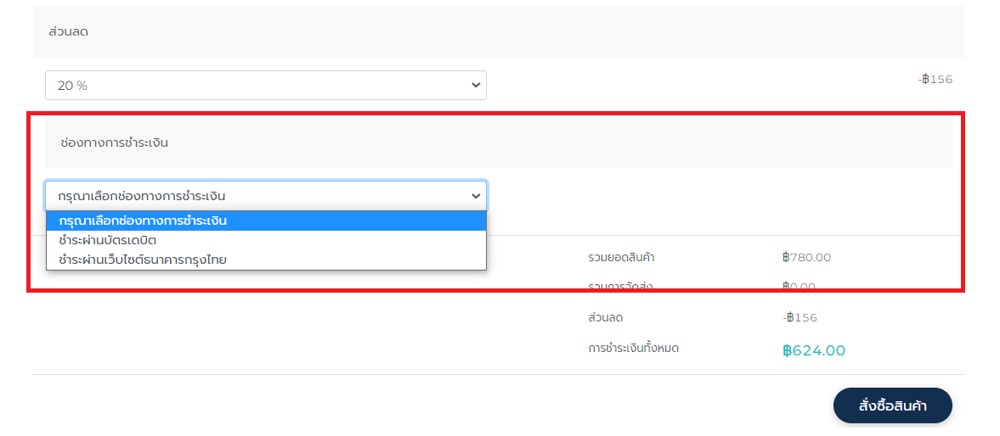<figcaption>
<strong>รูปภาพที่ 107</strong> หน้าจอการใช้งาน Marketplace ผู้ซื้อ – ช่องทางการชำระเงิน
</figcaption></figure>

คลิกปุ่ม “สั่งซื้อสินค้า”

<figure>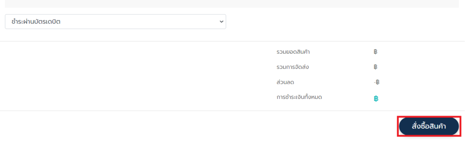<figcaption>
<strong>รูปภาพที่ 108</strong> หน้าจอการใช้งาน Marketplace ผู้ซื้อ – ปุ่มสั่งซื้อสินค้า
</figcaption></figure>

ระบบจะแสดงหน้าต่างป๊อบอัพ (Pop-up) ยืนยันการสั่งซื้อสินค้า คลิกปุ่ม “ยืนยัน”

<figure>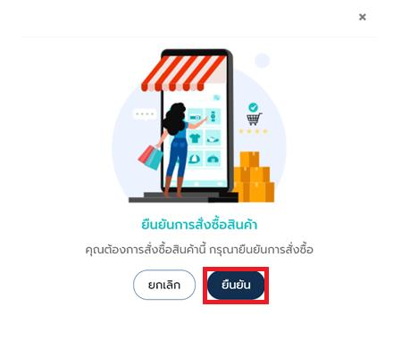<figcaption>
<strong>รูปภาพที่ 109</strong> หน้าจอการใช้งาน Marketplace ผู้ซื้อ – หน้าต่างป๊อบอัพ (Pop-up) ยืนยันการสั่งซื้อสินค้า
</figcaption></figure>

ระบบจะแสดงหน้าต่างป๊อบอัพ (Pop-up) สั่งซื้อสินค้าเสร็จสมบูรณ์ คลิกปุ่ม “ตกลง” ระบบจะนำไปยังหน้ารายละเอียดคำสั่งซื้อสินค้าและบริการ

<figure><figcaption>
<strong>รูปภาพที่ 110</strong> หน้าจอการใช้งาน Marketplace ผู้ซื้อ – หน้าต่างป๊อบอัพ (Pop-up) สั่งซื้อสินค้าเสร็จสมบูรณ์
</figcaption></figure>

หน้ารายละเอียดคำสั่งซื้อสินค้าและบริการ ผู้ใช้งานสามารถติดตามคำสั่งซื้อ ให้คะแนน/รีวิวสินค้า ชำระเงิน และยกเลิกคำสั่งซื้อได้ที่หน้านี้

<figure>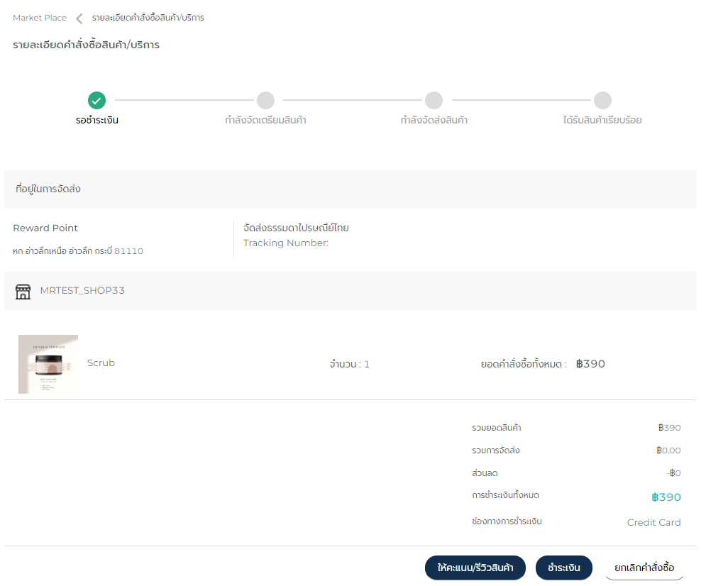<figcaption>
<strong>รูปภาพที่ 111</strong> หน้าจอการใช้งาน Marketplace ผู้ซื้อ – รายละเอียดคำสั่งซื้อสินค้า/บริการ
</figcaption></figure>

การให้คะแนน/รีวิวสินค้า คลิกปุ่ม “ให้คะแนน/รีวิวสินค้า”

<figure>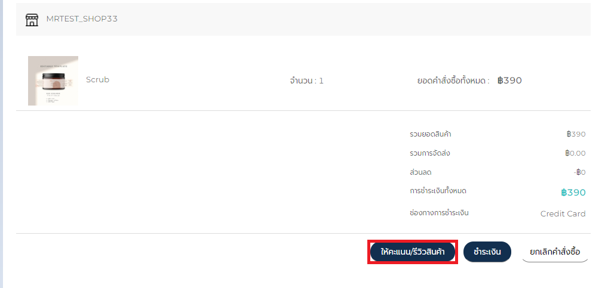<figcaption>
<strong>รูปภาพที่ 112</strong> หน้าจอการใช้งาน Marketplace ผู้ซื้อ – ให้คะแนน/รีวิวสินค้า
</figcaption></figure>

ระบบจะแสดงหน้าต่างป๊อบอัพ (Pop-up) ให้คะแนนและรีวิวสินค้าที่สั่งซื้อ ผู้ใช้งานสามารถให้คะแนน และระบุรายละเอียดรีวิวได้ จากนั้นคลิกปุ่ม “ยืนยัน”

<figure><figcaption>
<strong>รูปภาพที่ 113</strong> หน้าจอการใช้งาน Marketplace ผู้ซื้อ – ให้คะแนนและรีวิวสินค้าที่สั่งซื้อ
</figcaption></figure>

ผู้ใช้งานสามารถดูผลการรีวิวได้ที่ Review

<figure>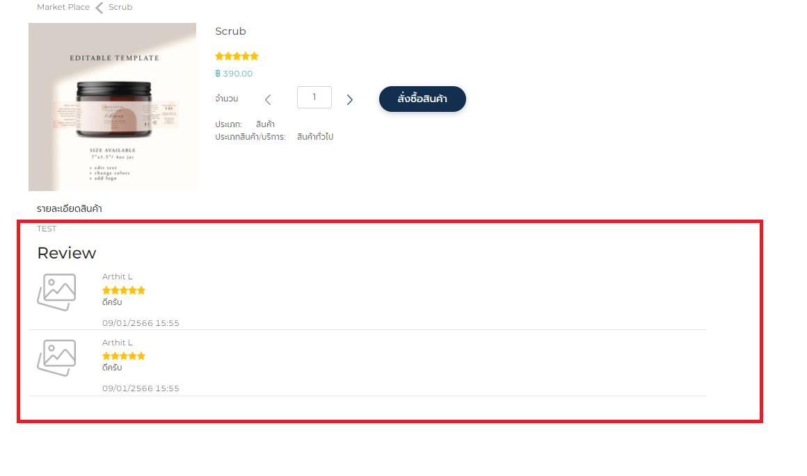<figcaption>
<strong>รูปภาพที่ 114</strong> หน้าจอการใช้งาน Marketplace ผู้ซื้อ – Review
</figcaption></figure>

การชำระเงิน คลิกปุ่ม “ชำระเงิน”

<figure>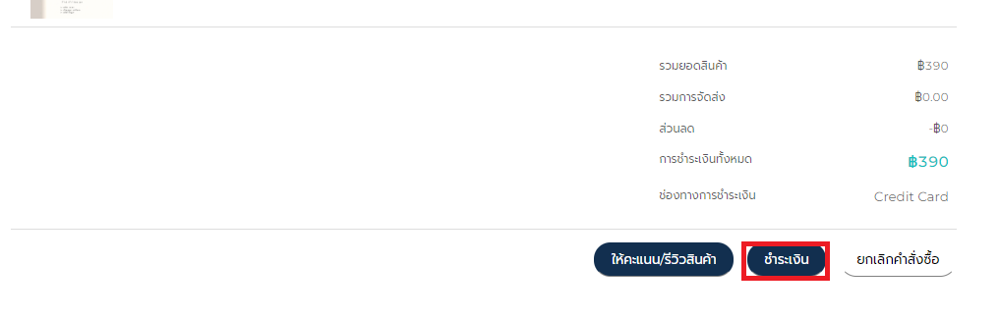<figcaption>
<strong>รูปภาพที่ 115</strong> หน้าจอการใช้งาน Marketplace ผู้ซื้อ – ชำระเงิน
</figcaption></figure>

การยกเลิกคำสั่งซื้อ คลิกปุ่ม “ยกเลิกคำสั่งซื้อ”

<figure>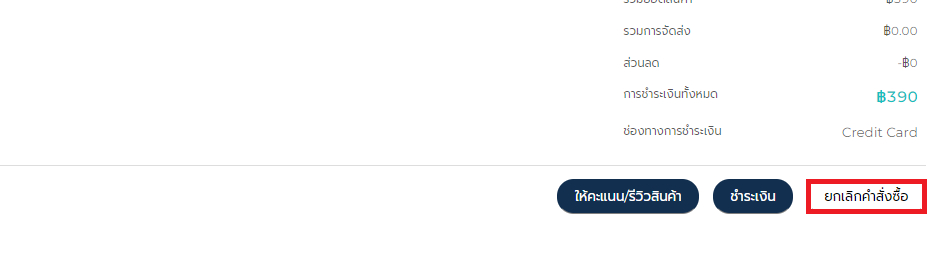<figcaption>
<strong>รูปภาพที่ 116</strong> หน้าจอการใช้งาน Marketplace ผู้ซื้อ – ยกเลิกคำสั่งซื้อ
</figcaption></figure>

ระบบจะแสดงหน้าต่างป๊อบอัพ (Pop-up) ยกเลิกคำสั่งซื้อ ผู้ใช้งานสามารถระบุเหตุผลการยกเลิก จากนั้นคลิกปุ่ม “ยืนยัน”

<figure>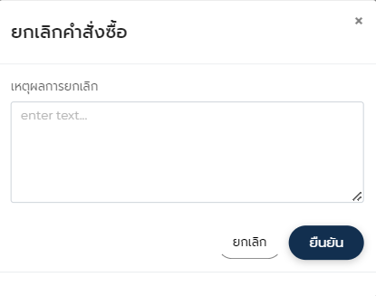<figcaption>
<strong>รูปภาพที่ 117</strong> หน้าจอการใช้งาน Marketplace ผู้ซื้อ – หน้าต่างป๊อบอัพ (Pop-up) ยกเลิกคำสั่งซื้อ
</figcaption></figure>

#### **8.3.2 แท็บ Market Place**

คลิกแท็บ “Market Place”

<figure>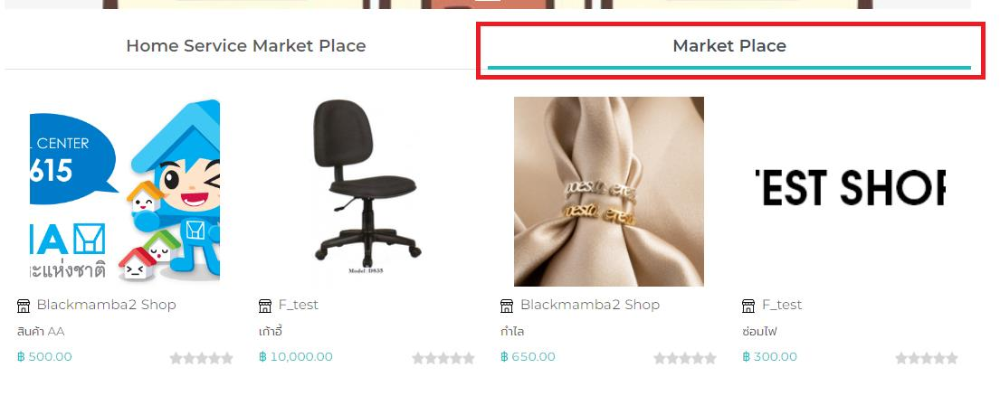<figcaption>
<strong>รูปภาพที่ 118</strong> หน้าจอการใช้งาน Marketplace ผู้ซื้อ – แท็บ Market Place
</figcaption></figure>

คลิกเลือกสินค้าและบริการที่ต้องการ ระบบจะแสดงรายละเอียดสินค้าและบริการ ผู้ใช้งานสามารถติดต่อสอบถามรายละเอียดสินค้าเพิ่มเติมได้ที่ “ข้อมูลการติดต่อร้านค้า”

<figure>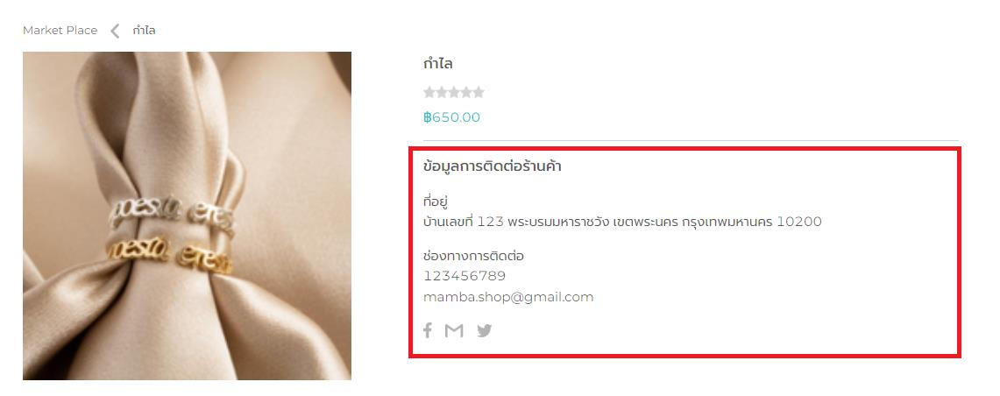<figcaption>
<strong>รูปภาพที่ 119</strong> หน้าจอการใช้งาน Marketplace ผู้ซื้อ – ข้อมูลการติดต่อร้านค้า
</figcaption></figure>

### 8.4 ติดตามคำสั่งซื้อสินค้าและบริการ

#### 8.4.1 การติดตามคำสั่งซื้อ

คลิกปุ่ม “ติดตามคำสั่งซื้อ”

<figure>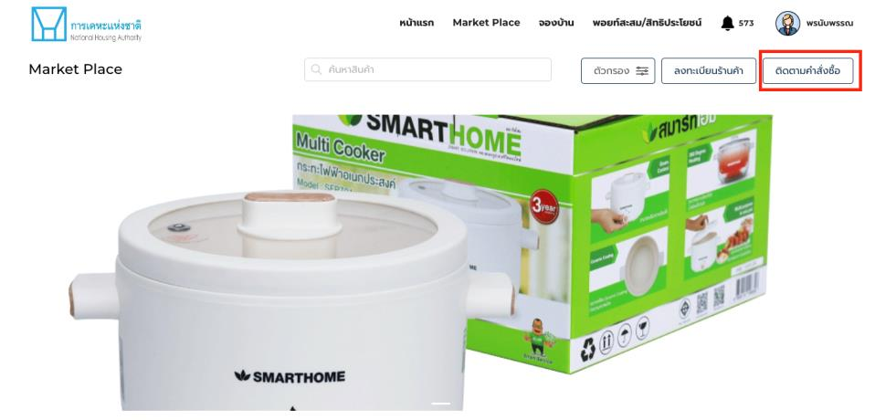<figcaption>
<strong>รูปภาพที่ 120</strong> หน้าจอการใช้งาน Marketplace ผู้ซื้อ – ปุ่มติดตามคำสั่งซื้อ
</figcaption></figure>

ระบบแสดงหน้ารายการคำสั่งซื้อ

<figure>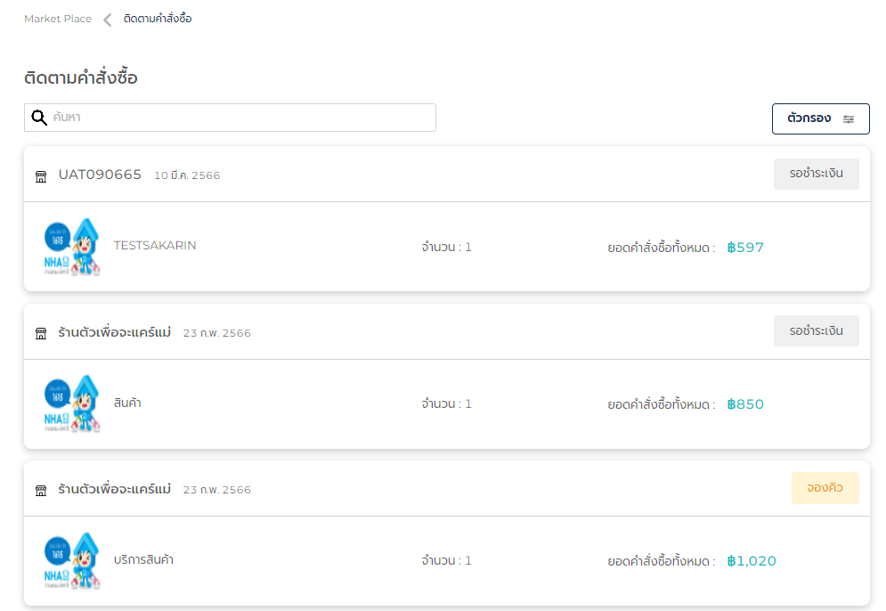<figcaption>
<strong>รูปภาพที่ 121</strong> หน้าจอการใช้งาน Marketplace ผู้ซื้อ – ติดตามคำสั่งซื้อ
</figcaption></figure>

#### 8.4.2 การค้นหาคำสั่งซื้อ

ผู้ใช้งานสามารถระบุข้อมูลโครงการที่ต้องการค้นหา จากนั้นคลิกบริเวณอื่นเพื่อให้ระบบค้นหาข้อมูล

<figure>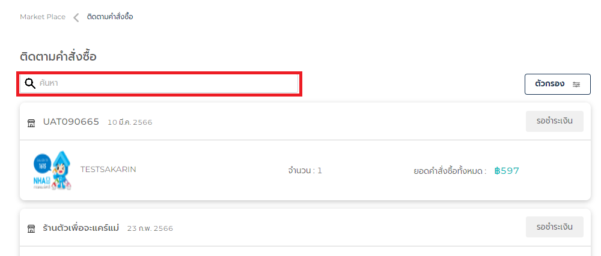<figcaption>
<strong>รูปภาพที่ 122</strong> หน้าจอการใช้งาน Marketplace ผู้ซื้อ – ค้นหาคำสั่งซื้อ
</figcaption></figure>

#### 8.4.3 การกรองคำสั่งซื้อ

คลิกปุ่ม “ตัวกรอง”

<figure>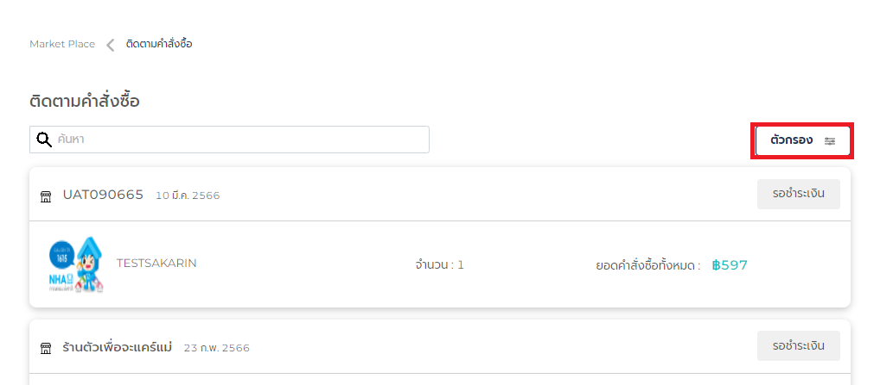<figcaption>
<strong>รูปภาพที่ 123</strong> หน้าจอการใช้งาน Marketplace ผู้ซื้อ – กรองคำสั่งซื้อ
</figcaption></figure>

ระบบจะแสดงหน้าต่างป๊อบอัพ (Pop-up) ตัวกรอง

<figure>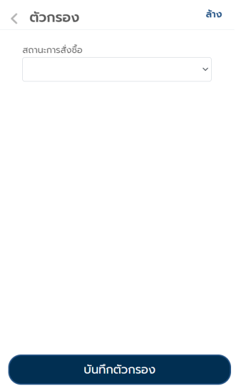<figcaption>
<strong>รูปภาพที่ 124</strong> หน้าจอการใช้งาน Marketplace ผู้ซื้อ – หน้าต่างป๊อบอัพ (Pop-up) ตัวกรอง
</figcaption></figure>

เลือกข้อมูลที่ต้องการกรอง จากนั้นคลิกปุ่ม “บันทึกตัวกรอง” ระบบจะกรองข้อมูลตามเงื่อนไขที่ระบุ

<figure>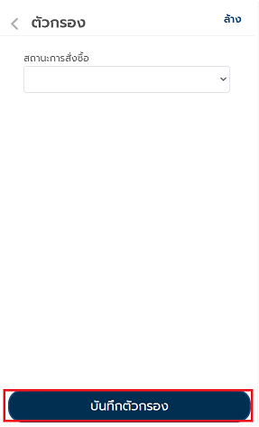<figcaption>
<strong>รูปภาพที่ 125</strong> หน้าจอการใช้งาน Marketplace ผู้ซื้อ – บันทึกตัวกรอง
</figcaption></figure>

ผู้ใช้งานสามารถ คลิก “ล้าง” เพื่อล้างข้อมูลที่เลือกได้

<figure>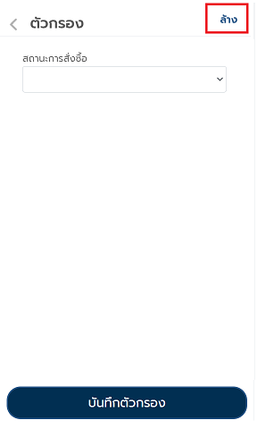<figcaption>
<strong>รูปภาพที่ 126</strong> หน้าจอการใช้งาน Marketplace ผู้ซื้อ – ปุ่มล้างตัวกรอง
</figcaption></figure>

คลิกปุ่ม “<” เพื่อปิดตัวกรอง

<figure>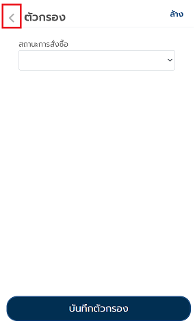<figcaption>
<strong>รูปภาพที่ 127</strong> หน้าจอการใช้งาน Marketplace ผู้ซื้อ – ปุ่มย้อนกลับเพื่อปิดตัวกรอง
</figcaption></figure>

#### 8.4.4 รายละเอียดคำสั่งซื้อสินค้า/บริการ

คลิก รายการคำสั่งซื้อที่ต้องการดูรายละเอียดเพิ่มเติม

<figure>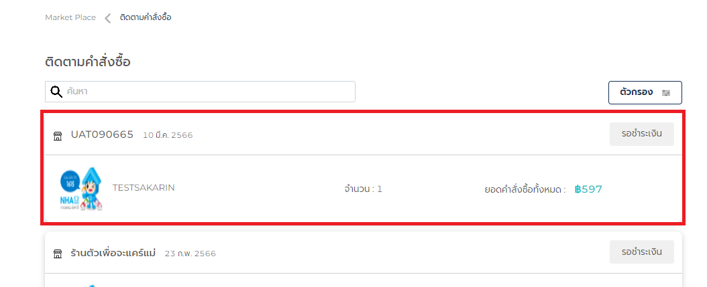<figcaption>
<strong>รูปภาพที่ 128</strong> หน้าจอการใช้งาน Marketplace ผู้ซื้อ – รายการคำสั่งซื้อ
</figcaption></figure>

ระบบแสดงหน้ารายละเอียดคำสั่งซื้อสินค้า/บริการ ผู้ใช้งานสามารถติดตามคำสั่งซื้อ ให้คะแนน/รีวิวสินค้า ชำระเงิน และยกเลิกคำสั่งซื้อได้ที่หน้านี้

<figure>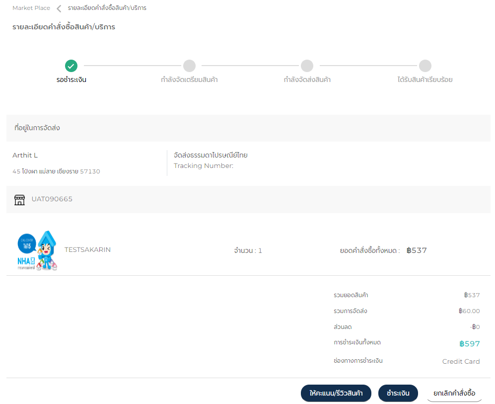<figcaption>
<strong>รูปภาพที่ 129</strong> หน้าจอการใช้งาน Marketplace ผู้ซื้อ – รายละเอียดคำสั่งซื้อสินค้า/บริการ
</figcaption></figure>

### 8.5 ลงทะเบียนร้านค้า

#### 8.5.1 การลงทะเบียนร้านค้า

คลิกปุ่ม “ลงทะเบียนร้านค้า”

<figure>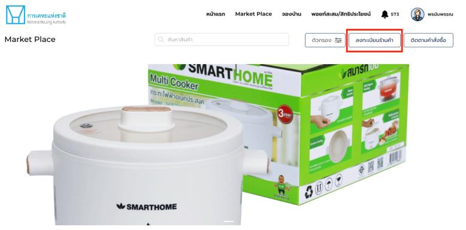<figcaption>
<strong>รูปภาพที่ 130</strong> หน้าจอการใช้งาน Marketplace ผู้ซื้อ – ปุ่มลงทะเบียนร้านค้า
</figcaption></figure>

ระบบจะแสดงหน้าลงทะเบียนร้านค้า ผู้ใช้งานกรอกรายละเอียดเพื่อลงทะเบียนร้านค้า จากนั้นคลิกปุ่ม “บันทึก”

<figure>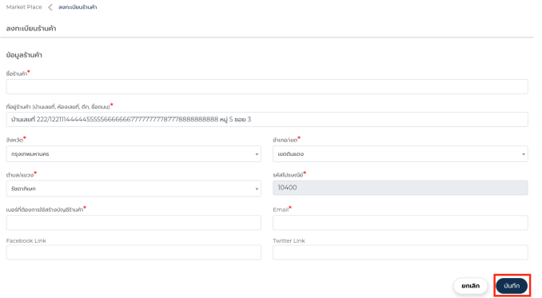<figcaption>
<strong>รูปภาพที่ 131</strong> หน้าจอการใช้งาน Marketplace ผู้ซื้อ – กรอกรายละเอียดลงทะเบียนร้านค้า
</figcaption></figure>

ระบบจะแสดงหน้าต่างป๊อบอัพ (Pop-up) ท่านต้องการลงทะเบียนร้านค้าหรือไม่ จากนั้นคลิกปุ่ม “ยืนยัน”

<figure>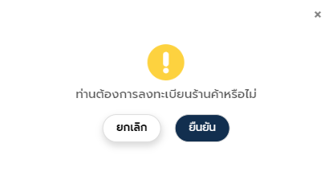<figcaption>
<strong>รูปภาพที่ 132</strong> หน้าจอการใช้งาน Marketplace ผู้ซื้อ – หน้าต่างป๊อบอัพ (Pop-up) ท่านต้องการลงทะเบียนร้านค้าหรือไม่
</figcaption></figure>

ระบบจะแสดงหน้าต่างป๊อบอัพ (Pop-up) การลงทะเบียนร้านค้าสำเร็จ จากนั้นคลิกปุ่ม “ตกลง” ระบบจะทำการส่งคำขออนุมัติการลงทะเบียนร้านค้า

<figure>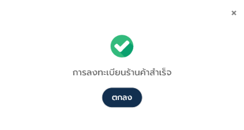<figcaption>
<strong>รูปภาพที่ 133</strong> หน้าจอการใช้งาน Marketplace ผู้ซื้อ – หน้าต่างป๊อบอัพ (Pop-up) การลงทะเบียนร้านค้าสำเร็จ
</figcaption></figure>

เมื่อผลการอนุมัติการลงทะเบียนสำเร็จ ระบบจะแสดงปุ่ม “การจัดการ” ที่มุมขวาบนของหน้า Market Place ผู้ใช้งานจะสามารถจัดการร้านค้าและจัดการคำสั่งซื้อได้

<figure>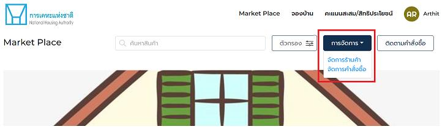<figcaption>
<strong>รูปภาพที่ 134</strong> หน้าจอการใช้งาน Marketplace ผู้ซื้อ – การจัดการค้านค้า
</figcaption></figure>

## **บทที่ 9 การใช้งานในส่วนของ Marketplace ฝั่งผู้ขาย**

### 9.1 การจัดการร้านค้า

คลิกปุ่ม “จัดการร้านค้า”

<figure>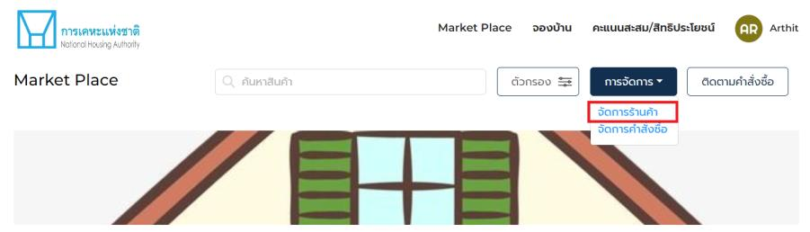<figcaption>
<strong>รูปภาพที่ 135</strong> หน้าจอการใช้งาน Marketplace ผู้ขาย – การจัดการร้านค้า
</figcaption></figure>

ระบบจะแสดงหน้าจัดการร้านสินค้า โดยมีส่วนประกอบดังต่อไปนี้

<figure><figcaption>
<strong>รูปภาพที่ 136</strong> หน้าจอการใช้งาน Marketplace ผู้ขาย – ช่องค้นหาสินค้า
</figcaption></figure>

1. ช่องค้นหา
2. ปุ่ม “+ เพิ่มสินค้า”
3. ตัวกรอง
4. ไอคอนดินสอ สำหรับการแก้ไขสินค้า
5. ไอคอนถังขยะ สำหรับการลบสินค้า

#### 9.1.1 การค้นหา

ผู้ใช้งานระบุข้อมูลที่ต้องการค้นหา จากนั้น**คลิกบริเวณอื่นเพื่อให้ระบบค้นหาข้อมูล**

<figure>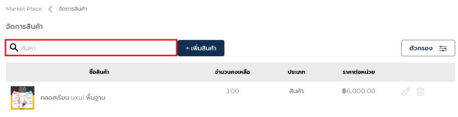<figcaption>
<strong>รูปภาพที่ 137</strong> หน้าจอการใช้งาน Marketplace ผู้ขาย – ช่องค้นหา
</figcaption></figure>

#### 9.1.2 การกรอง&#x20;

คลิกปุ่ม “ตัวกรอง” ระบบจะแสดงหน้าต่างป๊อบอัพ (Pop-up) ตัวกรอง

<figure>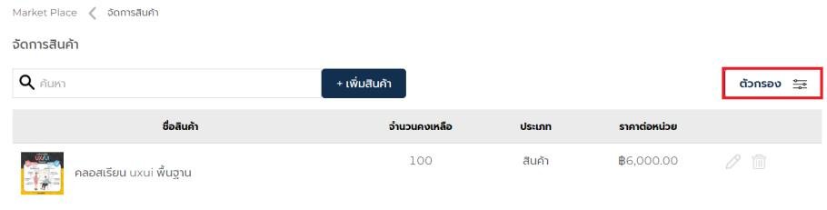<figcaption>
<strong>รูปภาพที่ 138</strong> หน้าจอการใช้งาน Marketplace ผู้ขาย – ปุ่มตัวกรอง
</figcaption></figure>

<figure>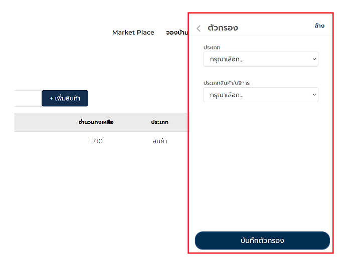<figcaption>
<strong>รูปภาพที่ 139</strong> หน้าจอการใช้งาน Marketplace ผู้ขาย – หน้าต่างป๊อบอัพ (Pop-up) ตัวกรอง
</figcaption></figure>

เลือกข้อมูลที่ต้องการกรอง จากนั้นคลิกปุ่ม “บันทึกตัวกรอง” ระบบจะกรองข้อมูลตามเงื่อนไขที่ระบุ

<figure>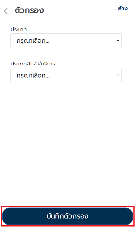<figcaption>
<strong>รูปภาพที่ 140</strong> หน้าจอการใช้งาน Marketplace ผู้ขาย – ตัวกรอง
</figcaption></figure>

คลิกที่ “ล้าง” เพื่อล้างข้อมูลที่เลือกได้

<figure><figcaption>
<strong>รูปภาพที่ 141</strong> หน้าจอการใช้งาน Marketplace ผู้ขาย – ปุ่มล้างตัวกรอง
</figcaption></figure>

คลิกปุ่ม “<” เพื่อปิดตัวกรอง

<figure><figcaption>
<strong>รูปภาพที่ 142</strong> หน้าจอการใช้งาน Marketplace ผู้ขาย – ปุ่มย้อนกลับเพื่อปิดตัวกรอง
</figcaption></figure>

#### 9.1.3 การเพิ่มสินค้า

คลิกปุ่ม “+ เพิ่มสินค้า”

<figure>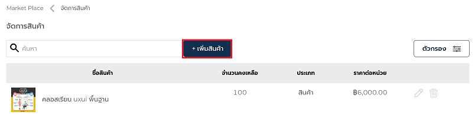<figcaption>
<strong>รูปภาพที่ 143</strong> หน้าจอการใช้งาน Marketplace ผู้ขาย – ปุ่ม + เพิ่มสินค้า
</figcaption></figure>

ระบบจะแสดงหน้ารายละเอียดสินค้า ผู้ใช้งานกรอกรายละเอียดสินค้าที่ต้องการเพิ่ม จากนั้นคลิกปุ่ม “บันทึก” เพื่อทำการเพิ่มสินค้า

<figure>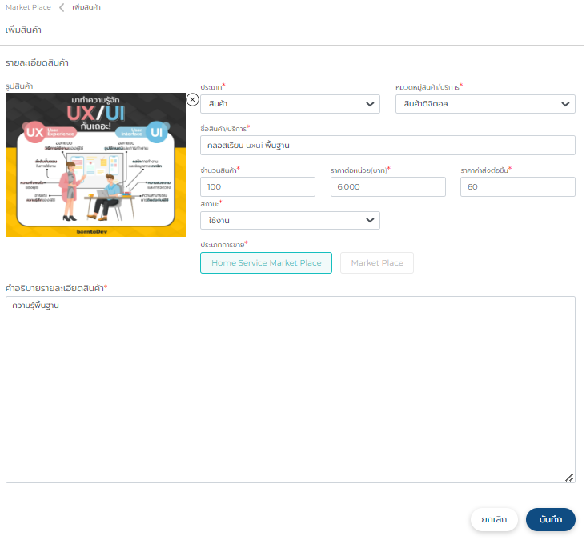<figcaption>
<strong>รูปภาพที่ 144</strong> หน้าจอการใช้งาน Marketplace ผู้ขาย – กรอกรายละเอียดเพื่อเพิ่มสินค้า
</figcaption></figure>

ระบบจะแสดงรายการสินค้าที่เพิ่มใหม่ที่หน้าจัดการสินค้า

<figure>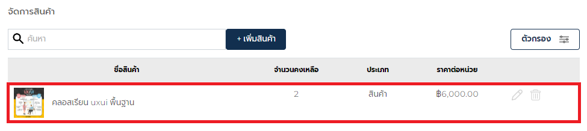<figcaption>
<strong>รูปภาพที่ 145</strong> หน้าจอการใช้งาน Marketplace ผู้ขาย – รายการสินค้าที่เพิ่มใหม่
</figcaption></figure>

#### 9.1.4 การแก้ไขสินค้า

คลิกไอคอนดินสอ

<figure><figcaption>
<strong>รูปภาพที่ 146</strong> หน้าจอการใช้งาน Marketplace ผู้ขาย – การแก้ไขสินค้า
</figcaption></figure>

#### 9.1.5 การลบสินค้า

คลิกไอคอนถังขยะ

<figure>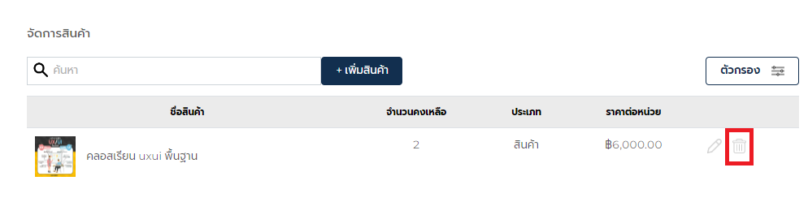<figcaption>
<strong>รูปภาพที่ 147</strong> หน้าจอการใช้งาน Marketplace ผู้ขาย – การลบสินค้า
</figcaption></figure>

### 9.2 การจัดการคำสังซื้อ

คลิกปุ่ม “จัดการคำสั่งซื้อ”

<figure>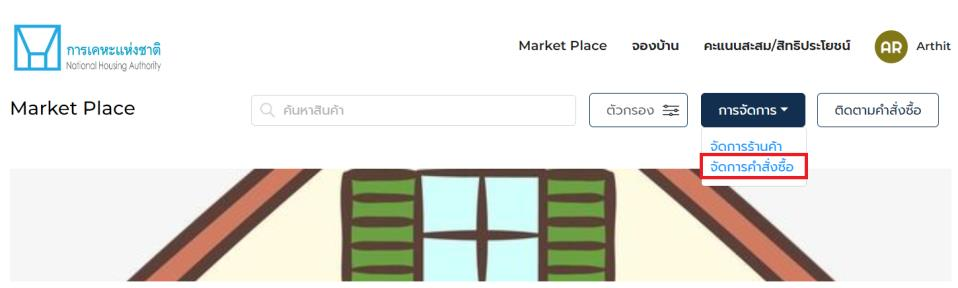<figcaption>
<strong>รูปภาพที่ 148</strong> หน้าจอการใช้งาน Marketplace ผู้ขาย – การจัดการคำสั่งซื้อ
</figcaption></figure>

ระบบจะแสดงหน้ารายการคำสั่งซื้อ โดยมีส่วนประกอบดังนี้

<figure>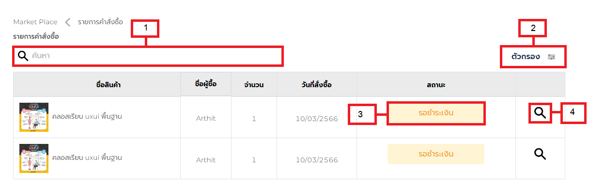<figcaption>
<strong>รูปภาพที่ 149</strong> หน้าจอการใช้งาน Marketplace ผู้ขาย – รายการคำสั่งซื้อ
</figcaption></figure>

1. ช่องค้นหา
2. ตัวกรอง
3. สถานะ
4. แว่นขยาย รายละเอียดคำสั่งซื้อ

#### 9.2.1 การค้นหา

ผู้ใช้งานระบุข้อมูลที่ต้องการค้นหา จากนั้นคลิกบริเวณอื่นเพื่อให้ระบบค้นหาข้อมูล

<figure>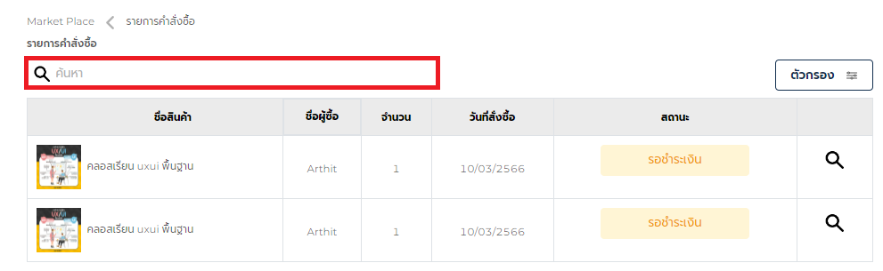<figcaption>
<strong>รูปภาพที่ 150</strong> หน้าจอการใช้งาน Marketplace ผู้ขาย – ช่องค้นหา
</figcaption></figure>

#### 9.2.2 การกรอง

คลิกปุ่ม “ตัวกรอง” ระบบจะแสดงหน้าต่างป๊อบอัพ (Pop-up) ตัวกรอง

<figure>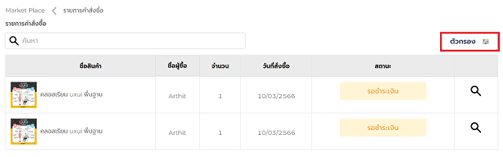<figcaption>
<strong>รูปภาพที่ 151</strong> หน้าจอการใช้งาน Marketplace ผู้ขาย – ปุ่มตัวกรอง
</figcaption></figure>

<figure>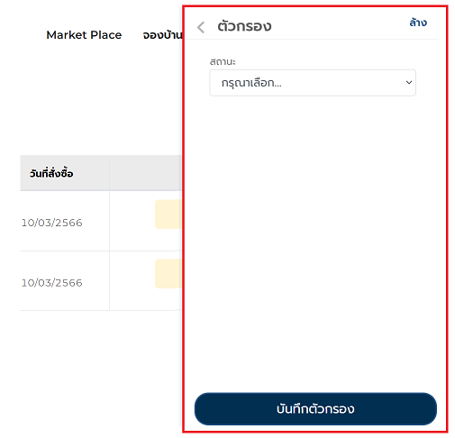<figcaption>
<strong>รูปภาพที่ 152</strong> หน้าจอการใช้งาน Marketplace ผู้ขาย – หน้าต่างป๊อบอัพ (Pop-up) ตัวกรอง
</figcaption></figure>

เลือกข้อมูลที่ต้องการกรอง จากนั้นคลิกปุ่ม “บันทึกตัวกรอง” ระบบจะกรองข้อมูลตามเงื่อนไขที่ระบุ

<figure>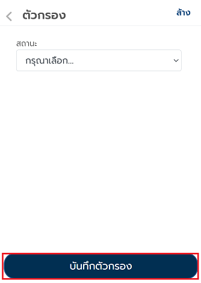<figcaption>
<strong>รูปภาพที่ 153</strong> หน้าจอการใช้งาน Marketplace ผู้ขาย – ตัวกรอง
</figcaption></figure>

คลิกที่ “ล้าง” เพื่อล้างข้อมูลที่เลือกได้

<figure>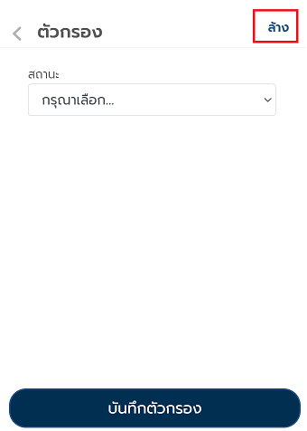<figcaption>
<strong>รูปภาพที่ 154</strong> หน้าจอการใช้งาน Marketplace ผู้ขาย – ปุ่มล้างตัวกรอง
</figcaption></figure>

คลิกปุ่ม “<” เพื่อปิดตัวกรอง

<figure>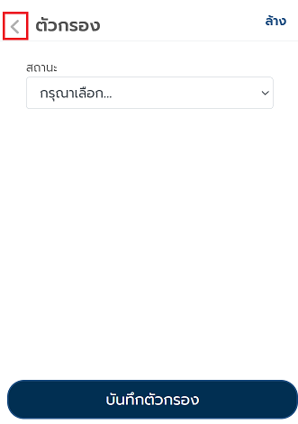<figcaption>
<strong>รูปภาพที่ 155</strong> หน้าจอการใช้งาน Marketplace ผู้ขาย – ปุ่มย้อนกลับเพื่อปิดตัวกรอง
</figcaption></figure>

#### 9.2.3 รายละเอียดคำสั่งซื้อ

คลิกไอคอน แว่นขยาย

<figure>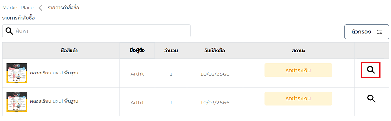<figcaption>
<strong>รูปภาพที่ 156</strong> หน้าจอการใช้งาน Marketplace ผู้ขาย – แว่นขยาย
</figcaption></figure>

ระบบจะแสดงหน้ารายละเอียดคำสั่งซื้อ โดยมีส่วนประกอบดังต่อไปนี้

<figure>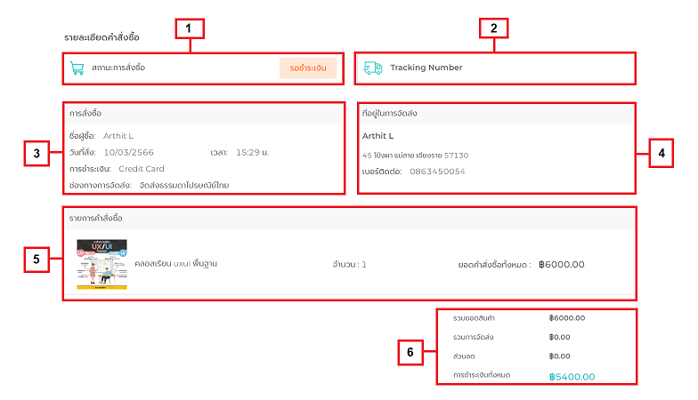<figcaption>
<strong>รูปภาพที่ 157</strong> หน้าจอการใช้งาน Marketplace ผู้ขาย – รายละเอียดคำสั่งซื้อ
</figcaption></figure>

1. สถานะคำสั่งซื้อ
2. Tracking Number
3. การสั่งซื้อ
4. ที่อยู่ในการจัดส่ง
5. รายการคำสั่งซื้อ
6. การชำระเงินทั้งหมด

## **บทที่ 10 การใช้งานในส่วนของ พอยท์สะสม/สิทธิประโยชน์**

หัวข้อต่อไปนี้จะอธิบายถึงการใช้งานในส่วนของคะแนนสะสมและสิทธิประโยชน์

### 10.1 คะแนนสะสม

คลิกปุ่ม “พอยท์สะสม/สิทธิประโยชน์”

<figure><figcaption>
<strong>รูปภาพที่ 158</strong> หน้าจอคะแนนสะสม/สิทธิประโยชน์ – ปุ่มพอยท์สะสม/สิทธิประโยชน์
</figcaption></figure>

ผู้ใช้งานสามารถดูคะแนนสะสมหรือพอยท์คงเหลือได้ ที่แท็บเมนู แลกของรางวัล/คูปอง

<figure>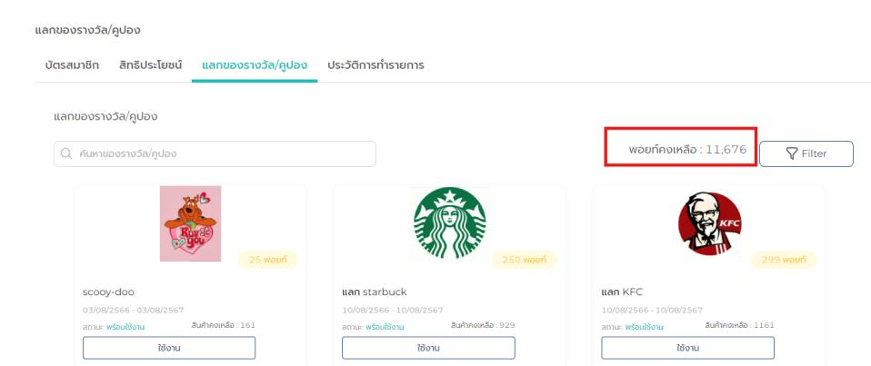<figcaption>
<strong>รูปภาพที่ 159</strong> หน้าจอคะแนนสะสม/สิทธิประโยชน์ – คะแนนสะสมหรือพอยท์คงเหลือ
</figcaption></figure>

### 10.2 สิทธิประโยชน์

ผู้ใช้งานสามารถคลิกปุ่ม **“แลกรับของรางวัล/คูปอง”** เพื่อใช้คะแนนสะสมแลกสิทธิประโยชน์ต่างๆได้โดย คลิก “ใช้งาน” ใต้สินค้าที่ต้องการแลกของรางวัล/ คูปอง

<figure><figcaption>
<strong>รูปภาพที่ 160</strong> หน้าจอพอยท์สะสม/สิทธิประโยชน์ – ปุ่มใช้งาน
</figcaption></figure>

จากนั้นคลิกแท็บเมนู “สิทธิประโยชน์” เพื่อใช้สิทธิแลกรับของรางวัล/คูปองที่กดมาเมื่อสักครู่

<figure>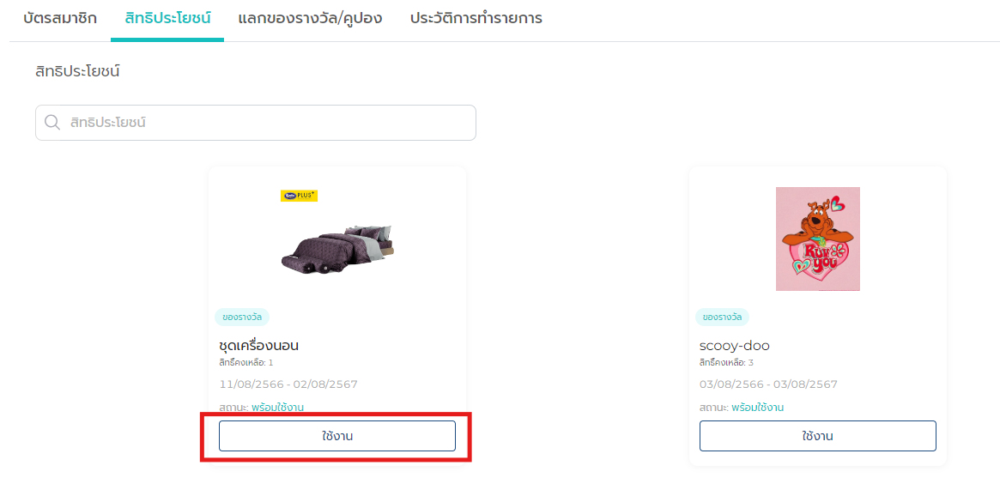<figcaption>
<strong>รูปภาพที่ 161</strong> หน้าจอพอยท์สะสม/สิทธิประโยชน์ – การใช้สิทธิ์แลกของรางวัล / คูปอง
</figcaption></figure>

ตรวจสอบ “ประวัติการทำรายการ” ในการแลกพอยท์สะสมได้ที่ แท็บเมนู “ประวัติการทำรายการ”

<figure>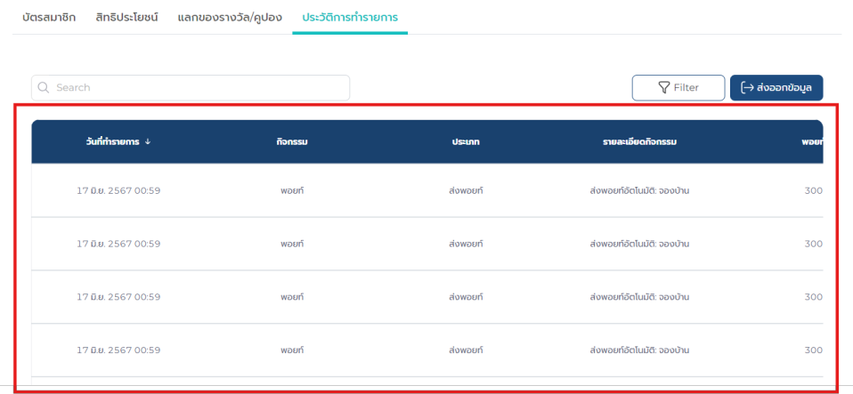<figcaption>
<strong>รูปภาพที่ 162</strong> หน้าจอ พอยท์สะสม/สิทธิประโยชน์ – ประวัติการทำรายการ
</figcaption></figure>

ผู้ใช้งานสามารถรายละเอียดของบัตรสมาชิกได้ดังนี้

* ประเภทบัตรสมาชิก
* พอยท์
* ชื่อสมาชิก
* สิทธิประโยชน์บัตรสมาชิก
* วันหมดอายุบัตรสมาชิก

<figure>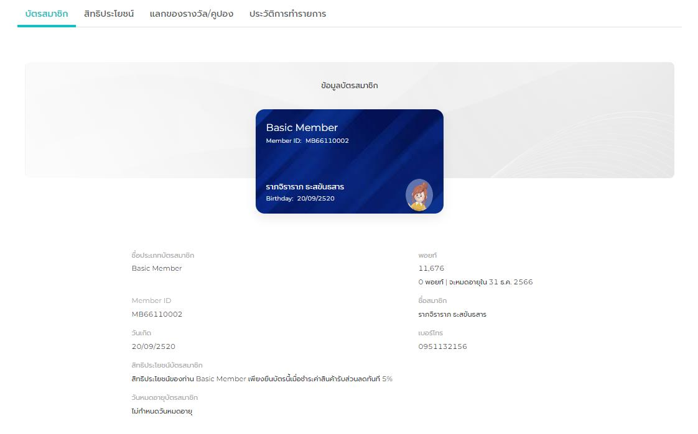<figcaption>
<strong>รูปภาพที่ 163</strong> หน้าจอพอยท์สะสม/สิทธิประโยชน์ – บัตรสมาชิก
</figcaption></figure>

## **บทที่ 11 ใบแจ้งหนี้/ใบเสร็จรับเงิน**

หัวข้อต่อไปนี้จะอธิบายถึงการใช้งานในส่วนของใบแจ้งหนี้/ใบเสร็จรับเงิน

คลิกรูปโปรไฟล์ที่ด้านบนขวาของ ระบบบริการลูกค้าออนไลน์ (Customer Service) จากนั้นคลิกเลือก “ใบแจ้งหนี้/ใบเสร็จรับเงิน”

<figure>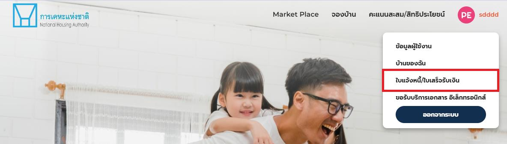<figcaption>
<strong>รูปภาพที่ 164</strong> หน้าจอใบแจ้งหนี้/ใบเสร็จรับเงิน
</figcaption></figure>

### 11.1 ใบแจ้งหนี้

คลิกไอคอน “เครื่องปริ้น”

<figure>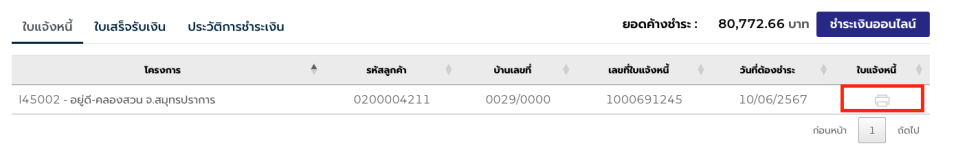<figcaption>
<strong>รูปภาพที่ 165</strong> หน้าจอใบแจ้งหนี้ – คลิกไอคอนเครื่องปริ้น
</figcaption></figure>

ระบบจะทำการสร้างใบแจ้งหนี้ เป็นไฟล์ .pdf แสดงรายละเอียดรายการที่ต้องชำระเงิน ผู้ใช้งานสามารถดาวน์โหลดไฟล์เพื่อใช้ในการชำระเงินที่ตัวแทนชำระและธนาคารได้

<figure>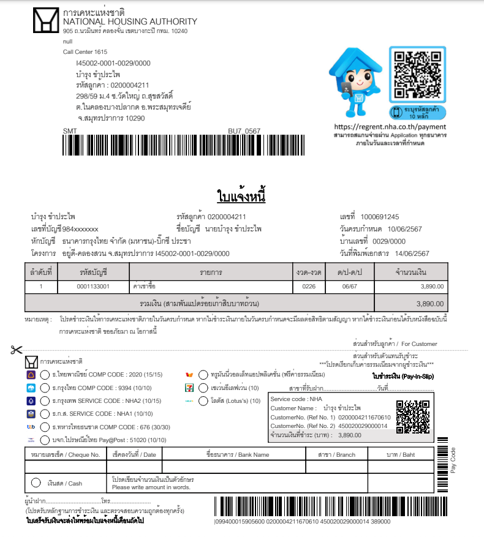<figcaption>
<strong>รูปภาพที่ 166</strong> หน้าจอใบแจ้งหนี้ – ใบแจ้งหนี้
</figcaption></figure>

### 11.2 ใบเสร็จรับเงิน

คลิกไอคอน “เครื่องปริ้น”

<figure>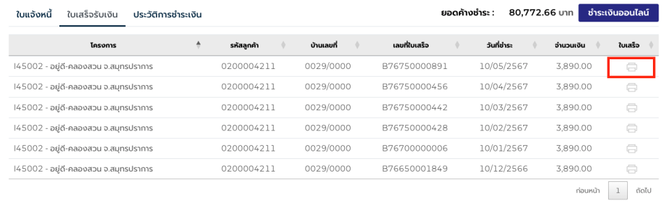<figcaption>
<strong>รูปภาพที่ 167</strong> หน้าจอใบเสร็จรับเงิน – คลิกไอคอนเครื่องปริ้น
</figcaption></figure>

ระบบจะทำการสร้างใบเสร็จรับเงิน เป็นไฟล์ .pdf แสดงรายละเอียดการชำระเงิน

<figure>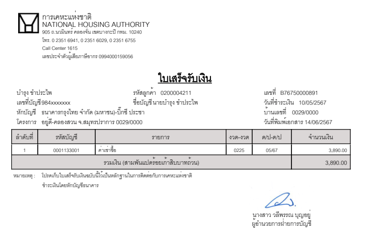<figcaption>
<strong>รูปภาพที่ 168</strong> หน้าจอการใบเสร็จรับเงิน – ใบเสร็จรับเงิน
</figcaption></figure>

### 11.3 การชำระเงิน

คลิกปุ่ม “ชำระเงินออนไลน์”

<figure>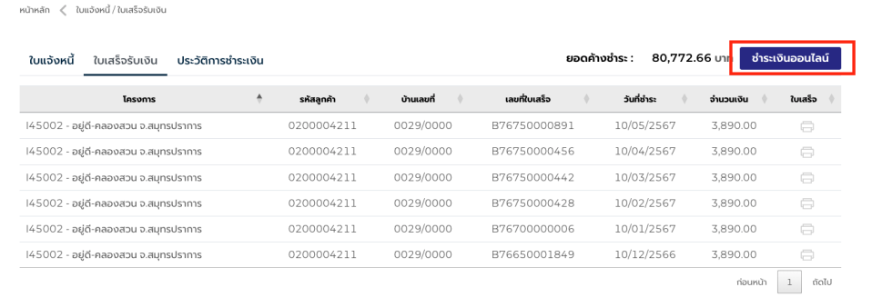<figcaption>
<strong>รูปภาพที่ 169</strong> หน้าจอใบแจ้งหนี้/ใบเสร็จรับเงิน – ชำระเงินออนไลน์
</figcaption></figure>

เลือกโครงการ และระบุจำนวนเงินที่ต้องการชำระ

สามารถชำระผ่านช่องทางดังนี้

* บัตรเคบิต
* QR code หรือ Barcode

<figure>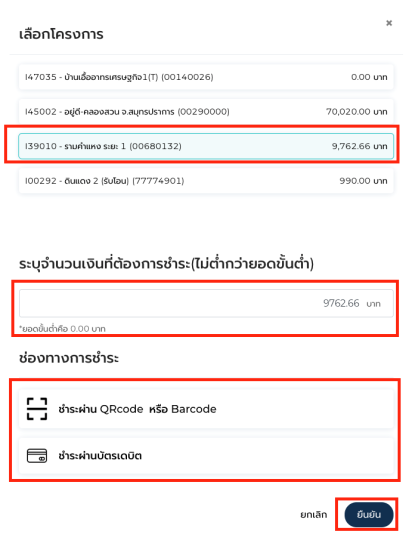<figcaption>
<strong>รูปภาพที่ 170</strong> หน้าจอใบแจ้งหนี้/ใบเสร็จรับเงิน – การชำระเงิน
</figcaption></figure>

## **บทที่ 12 บ้านของฉัน**

หัวข้อต่อไปนี้จะอธิบายถึงการใช้งานในส่วนของบ้านของฉัน

### 12.1 บ้านของฉัน

คลิกรูปโปรไฟล์ที่ด้านบนขวาของ ระบบบริการลูกค้าออนไลน์ (Customer Service) จากนั้นคลิกเลือก “บ้านของฉัน”

<figure><figcaption>
<strong>รูปภาพที่ 171</strong> หน้าจอบ้านของฉัน – บ้านของฉัน
</figcaption></figure>

ตารางบ้านของฉัน แสดงข้อมูลดังนี้

1. ข้อมูลโครงการ
2. พัสดุ
3. แบบสอบถาม
4. ติดต่อโครงการกรณีฉุกเฉิน
5. แสดงรายละเอียดสัญญาเช่า/ซื้อ

<figure><figcaption>
<strong>รูปภาพที่ 172</strong> หน้าจอบ้านของฉัน – ตารางแสดงข้อมูลบ้านของฉัน
</figcaption></figure>

<figure>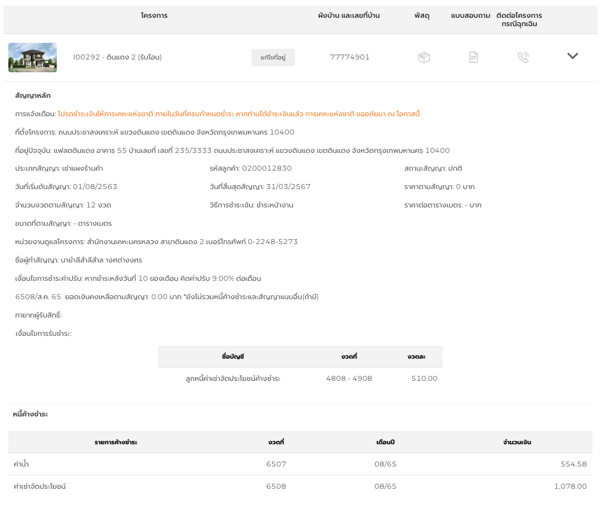<figcaption>
<strong>รูปภาพที่ 173</strong> หน้าจอบ้านของฉัน – หมายเลข 5 แสดงรายละเอียดสัญญาเช่า/ซื้อ
</figcaption></figure>

### 12.2 พัสดุ

คลิกไอคอน “พัสดุ” ระบบจะแสดงหน้าพัสดุ ผู้ใช้งานสามารถดูข้อมูลพัสดุของบ้านได้

ตารางพัสดุ แสดงข้อมูลดังนี้

* รับพัสดุ
* วันที่รับพัสดุ
* สถานะ
* เลขที่พัสดุ

<figure>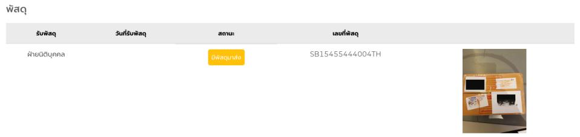<figcaption>
<strong>รูปภาพที่ 174</strong> หน้าจอบ้านของฉัน – ตารางแสดงข้อมูลพัสดุ
</figcaption></figure>

### 12.3 แบบสอบถาม

คลิกไอคอน “แบบสอบถาม” ระบบจะแสดงหน้าแบบสอบถาม ผู้ใช้งานสามารถดูข้อมูลแบบสอบถามได้

ตารางแบบสอบถาม แสดงข้อมูลดังนี้

* ลำดับ
* แบบสอบถาม
* สถานะ
* วันที่สร้าง
* วันที่สิ้นสุด
* ทำแบบสอบถาม

<figure>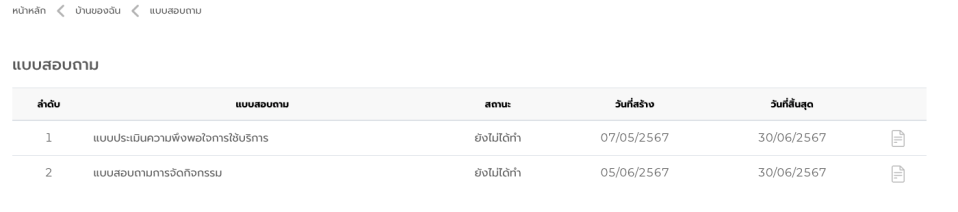<figcaption>
<strong>รูปภาพที่ 175</strong> หน้าจอบ้านของฉัน – ตารางแสดงข้อมูลแบบสอบถาม
</figcaption></figure>

<figure>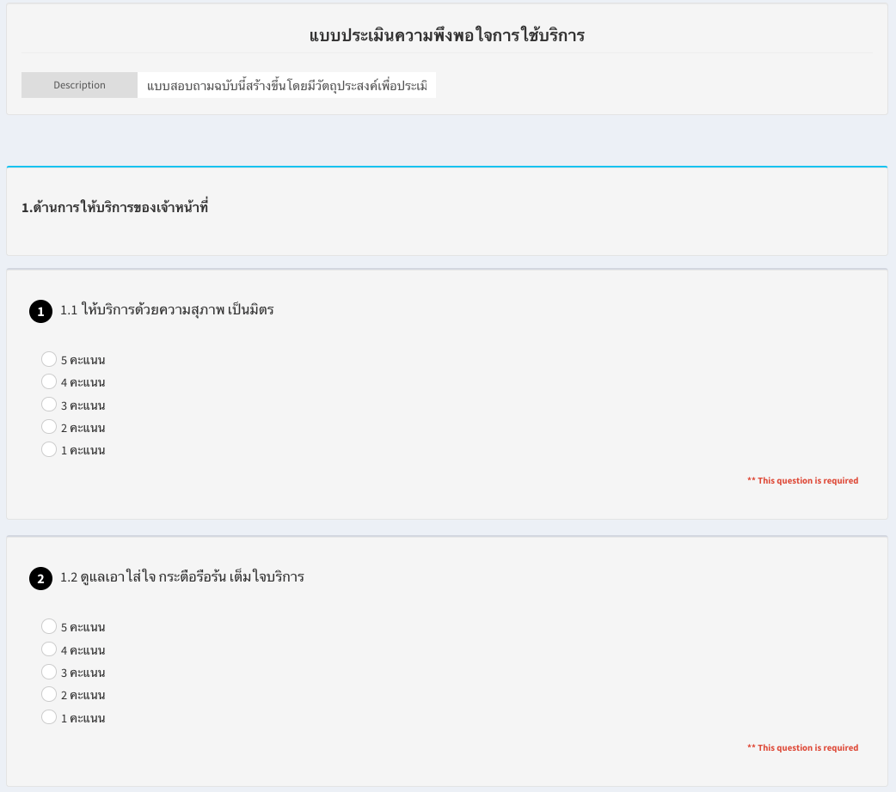<figcaption>
<strong>รูปภาพที่ 176</strong> หน้าจอบ้านของฉัน – ทำแบบสอบถาม
</figcaption></figure>

### 12.4 ติดต่อโครงการกรณีฉุกเฉิน

คลิกไอคอน “โทรศัพท์” ระบบจะแสดงหน้าติดต่อโครงการฉุกเฉิน ผู้ใช้งานสามารถดูข้อมูลการติดต่อโครงการกรณีฉุกเฉินได้ โดยข้อมูลการติดต่อโครงการกรณีฉุกเฉินประกอบด้วย

* นิติบุคคล
* เบอร์โทรศัพท์

<figure>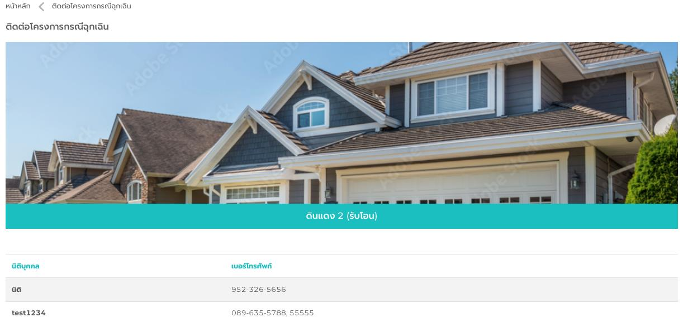<figcaption>
<strong>รูปภาพที่ 177</strong> หน้าจอบ้านของฉัน – ข้อมูลการติดต่อโครงการกรณีฉุกเฉิน
</figcaption></figure>

## **บทที่ 13 ขอรับบริการเอกสาร อิเล็กทรอนิกส์**

หัวข้อต่อไปนี้จะอธิบายถึงการใช้งานในส่วนของขอรับบริการเอกสาร อิเล็กทรอนิกส์

คลิกรูปโปรไฟล์มุมบนขวาของระบบบริการลูกค้าออนไลน์ (Customer Service) จากนั้นคลิกเลือก “ขอรับบริการเอกสาร อิเล็กทรอนิกส์”

<figure><figcaption>
<strong>รูปภาพที่ 178</strong> หน้าจอการขอรับเอกสาร อิเล็กทรอนิกส์ – ปุ่มขอรับเอกสาร อิเล็กทรอนิกส์
</figcaption></figure>

ระบบจะแสดงหน้าต่างป๊อบอัพ (Pop-up) ยืนยันการขอรับเอกสารอิเล็กทรอนิกส์ จากนั้นคลิกปุ่ม “ยืนยัน”

<figure>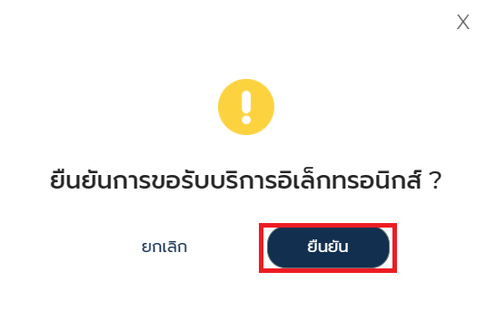<figcaption>
<strong>รูปภาพที่ 179</strong> หน้าจอการขอรับเอกสาร อิเล็กทรอนิกส์ – หน้าต่างป๊อบอัพ (Pop-up) ยืนยันการขอรับบริการอิเล็กทรอนิกส์
</figcaption></figure>

ระบบจะแสดงหน้าต่างป๊อบอัพ (Pop-up) แสดงข้อความ “การขอเอกสารเสร็จสมบูรณ์ ได้ส่งเอกสารทางอีเมลของคุณเรียบร้อยแล้ว” จากนั้นคลิกปุ่ม “ตกลง” ระบบจะทำการปิดหน้าต่างป๊อบอัพ (Pop-up) และแสดงหน้าจอ Landing Page ต่อไป

<figure>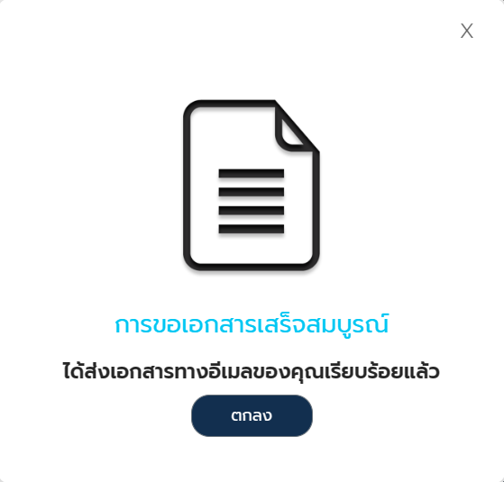<figcaption>
<strong>รูปภาพที่ 180</strong> หน้าจอการขอรับเอกสาร อิเล็กทรอนิกส์ – หน้าต่างป๊อบอัพ (Pop-up) การขอเอกสารเสร็จสมบูรณ์
</figcaption></figure>
