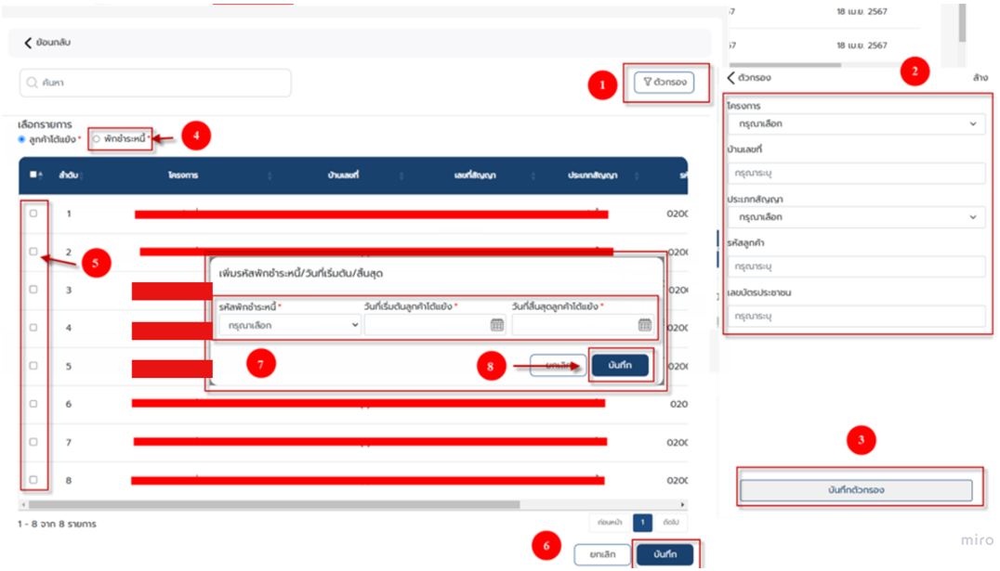
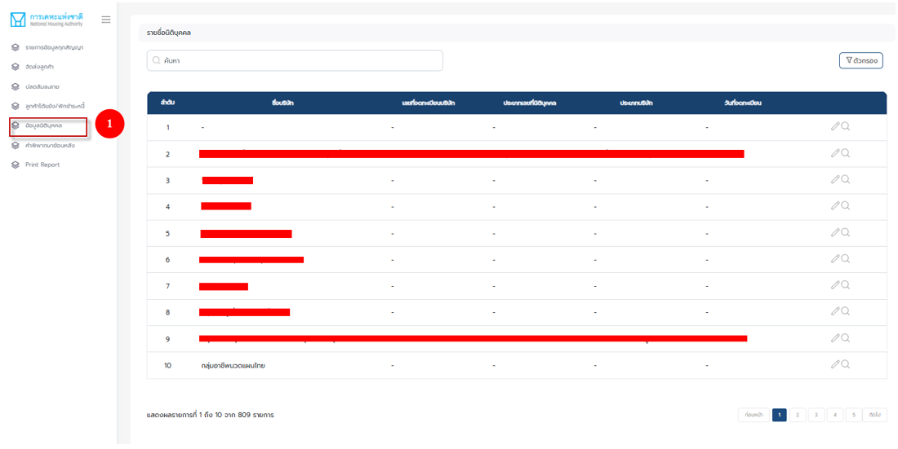
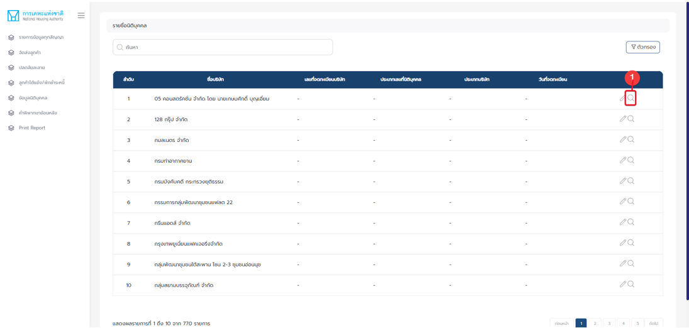
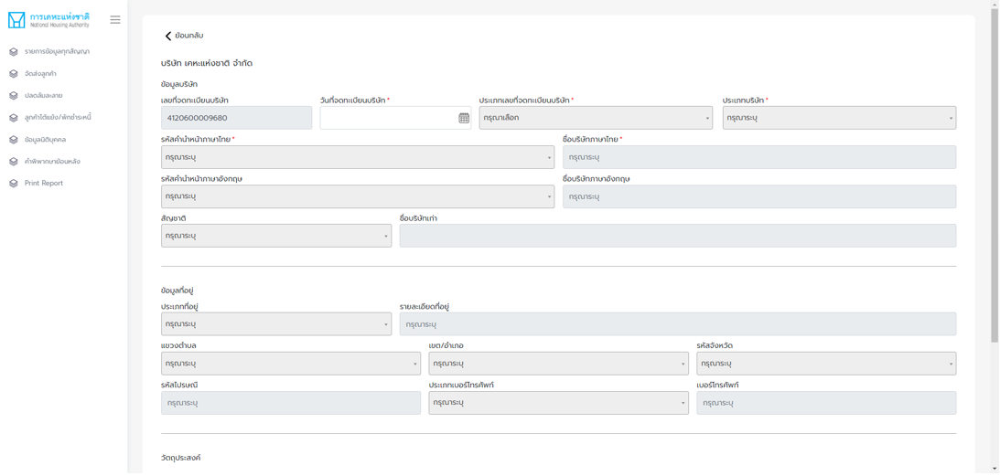
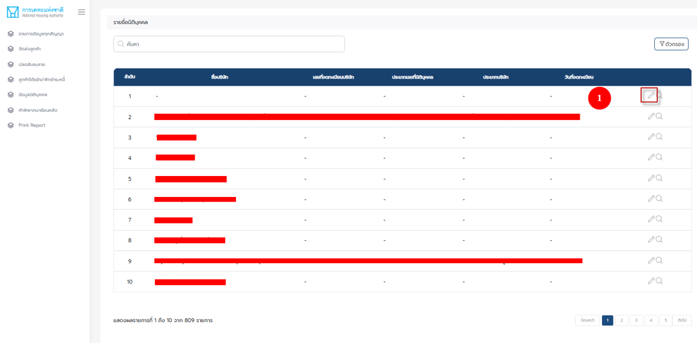
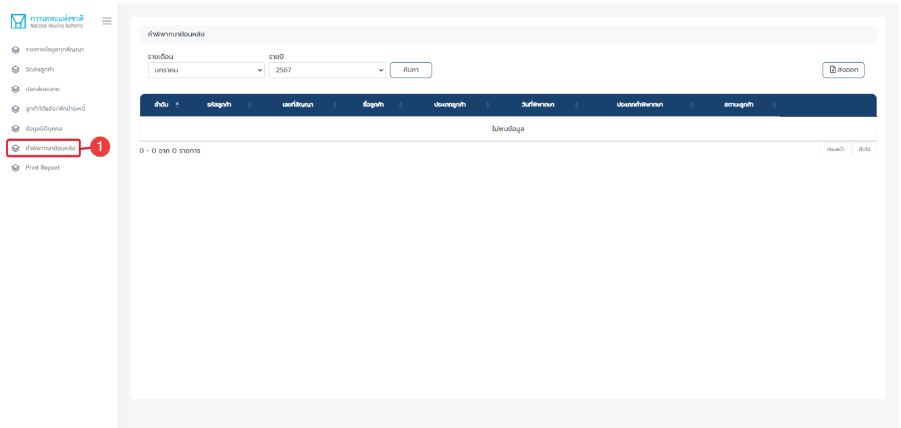
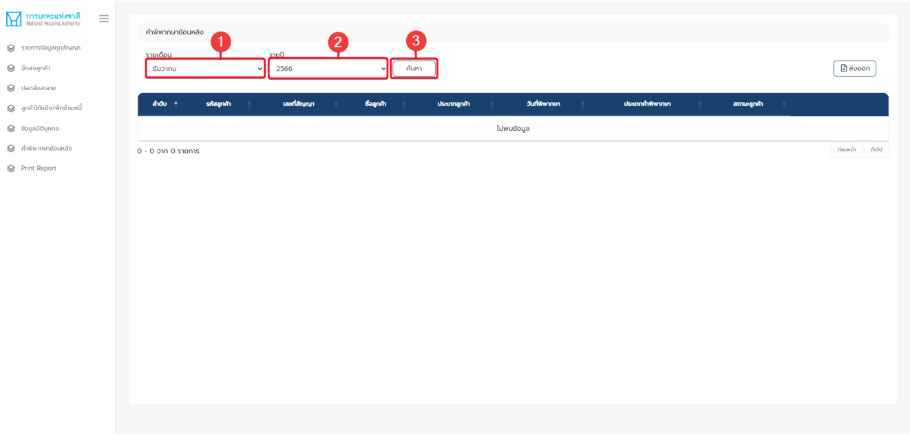
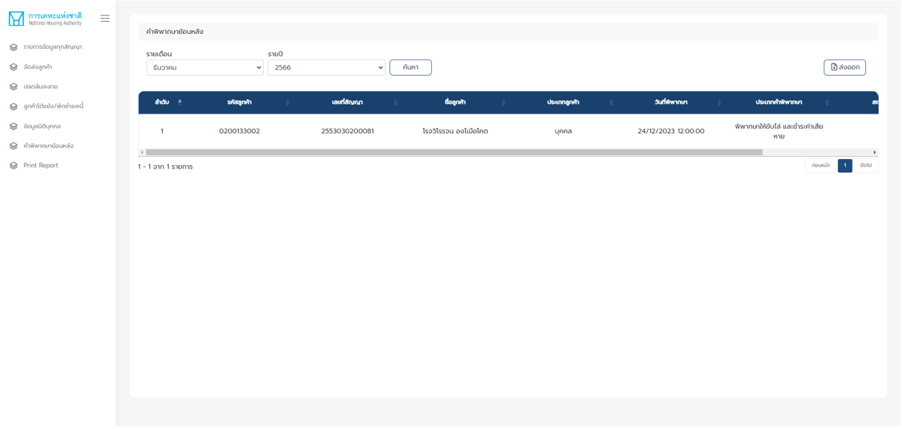
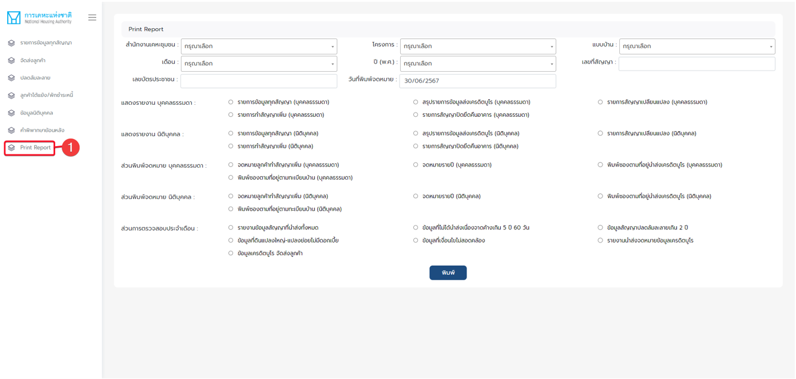

# ระบบเครดิตบูโร

## **บทที่ 1 บทนำ**

ระบบเครดิตบูโร จัดทำขึ้นเพื่อสรุปข้อมูลรายละเอียดประวัติการชำระเงินของลูกหนี้เพื่อนำส่งทางบริษัทเครดิตบูโร และเพื่อส่งเสริมวินัยทางการเงินของลูกหนี้ของเคหะแห่งชาติ โดยมีเมนูการใช้งานโดยสังเขป ดังนี้

1\. รายการข้อมูลทุกสัญญา เพื่อให้ผู้ใช้ดูสัญญาในระบบ

2\. ปลดล้มละลาย สำหรับให้ผู้ใช้ เพิ่มรายการปลดล้มละลาย และแก้ไขวันที่เริ่มต้นและสิ้นสุด

3\. ลูกค้าโต้แย้ง/พักชำระหนี้ สำหรับเพิ่มรายการลูกค้าโต้แย้ง หรือ พักชำระหนี้ และแก้ไข วันที่เริ่มต้น และสิ้นสุด

4\. ข้อมูลนิติบุคคล สำหรับแสดงผลและแก้ไขข้อมูลนิติบุคคลที่มีในระบบ

5\. คำพิพากษาย้อนหลัง สำหรับให้ผู้ใช้ตรวจสอบคำพิพากษาตามวันที่กำหนด

6\. Print report เมนูสำหรับให้ผู้ใช้ออกรายงาน

## **บทที่ 2 ระบบเครดิตบูโร**

### **2.1 เข้าสู่ระบบ** 

หน้าจอเข้าสู่ระบบ สำหรับผู้ใช้งาน

<figure><figcaption>
<strong>ภาพที่ 1 หน้าจอการเข้าสู่ระบบ สำหรับผู้ใช้งาน</strong>
</figcaption></figure>

1. URL สำหรับเข้าใช้งาน : [https://portal.nha.co.th/](https://portal.nha.co.th/)
2. กรอกชื่อผู้ใช้ : XXXXXX@nha.co.th
3. กรอกรหัสผ่าน : XXXXXXX
4. กดปุ่ม (เข้าสู่ระบบ)

### **2.2 หน้าจอหลัก สำหรับเลือกใช้งานเมนูต่าง ๆ ที่มีอยู่ในระบบ** 

<figure><figcaption>
<strong>ภาพที่ 2 หน้าจอหลัก</strong>
</figcaption></figure>

1. กดเมนูย่อย (แอปพลิเคชันของฉัน)

### **2.3 หน้าจอเมนูย่อย (แอปพลิเคชันของฉัน)** 

หน้าจอสำหรับการเลือกใช้งานแอปพลิเคชัน โดยจะแสดงแอปพลิเคชันต่างกัน ตาม role ของผู้ใช้งาน

<figure><figcaption>
<strong>ภาพที่ 3 หน้าจอการเลือกใช้งานแอปพลิเคชัน</strong>
</figcaption></figure>

### **2.4 เมนูรายการข้อมูลทุกสัญญา** 

ระบบแสดงหน้าจอ รายการข้อมูลสัญญาทั้งหมด ในปี และ เดือน นั้นๆ

<figure><figcaption>
<strong>ภาพที่ 4 หน้าจอ รายการข้อมูลสัญญาทั้งหมด</strong>
</figcaption></figure>

1. กดเมนู : รายการข้อมูลทุกสัญญา

### **2.5 เมนูรายการข้อมูลทุกสัญญา : การค้นหาข้อมูล (1)** 

การค้นหารายการสัญญา

<figure><figcaption>
<strong>ภาพที่ 5 การค้นหารายการสัญญา - รายการข้อมูลทุกสัญญา</strong>
</figcaption></figure>

1. กรอกประจำปี
2. กรอกประจำเดือน
3. กรอกลุ่มลูกค้า
4. กดปุ่ม ค้นหา

### **2.6 เมนูรายการข้อมูลทุกสัญญา : การค้นหาข้อมูล (2)** 

หน้าจอแสดงผลการค้นหาสัญญาประจำปี และ เดือน ตามที่ผู้ใช้งานระบุ

<figure><figcaption>
<strong>ภาพที่ 6 แสดงผลการค้นหา - รายการข้อมูลทุกสัญญา</strong>
</figcaption></figure>

ระบบจะแสดงรายการข้อมูลทุกสัญญาที่ตรงกับข้อมูลที่ผู้ใช้งานใช้ค้นหา

### **2.7 เมนูรายการข้อมูลทุกสัญญา : การล้างค่าค้นหา (1)** 

หน้าจอแสดงผลการล้างข้อมูลในช่อง ประจำปี และ ประจำเดือน เมื่อผู้ใช้กดปุ่มล้างค่า

<figure><figcaption>
<strong>ภาพที่ 7 ปุ่มล้างค่าการค้นหา - รายการข้อมูลทุกสัญญา</strong>
</figcaption></figure>

1. กดปุ่มล้างค่า

### **2.8 เมนูรายการข้อมูลทุกสัญญา : การล้างค่าค้นหา (2)** 

<figure><figcaption>
<strong>ภาพที่ 8 แสดงผลการล้างค่าการค้นหา - รายการข้อมูลทุกสัญญา</strong>
</figcaption></figure>

ระบบจะทำการล้างข้อมูลการค้นหาที่ผู้ใช้งานเคยกรอกไว้ให้เป็นค่า Default

### **2.9 เมนูจัดส่งลูกค้า** 

<figure><figcaption>
<strong>ภาพที่ 9 หน้าจอจัดส่งลูกค้า แถบข้อมูลเครดิตบูโร - การจัดส่งลูกค้า</strong>
</figcaption></figure>

1. ระบบจะทำการล้างข้อมูลการค้นหาที่ผู้ใช้งานเคยกรอกไว้ให้เป็นค่า Default

### **2.10 เมนูปลดล้มละลาย** 

ระบบแสดงหน้าจอรายการลูกค้าที่ปลดล้มละลาย

<figure><figcaption>
<strong>ภาพที่ 10 หน้าจอปลดล้มละลาย - ปลดล้มละลาย</strong>
</figcaption></figure>

1. กดเมนู : ปลดล้มละลาย

### **2.11 เมนูปลดล้มละลาย : เพิ่มรายการ (1)** 

<figure><figcaption>
<strong>ภาพที่ 11 ปุ่มเพิ่มรายการ - ปลดล้มละลาย</strong>
</figcaption></figure>

1. กดปุ่มเพิ่มรายการ

### **2.12 เข้าสู่เมนูปลดล้มละลาย : เพิ่มรายการ (2)** 

ระบบแสดงหน้าจอการเพิ่มลูกค้าปลดล้มละลาย สำหรับการเพิ่มลูกค้าปลดล้มละลาย

<figure><figcaption>
<strong>ภาพที่ 12 Pop up แสดงการเพิ่มลูกค้าปลดล้มละลาย - ปลดล้มละลาย</strong>
</figcaption></figure>

1. กรอกเลขบัตรประจำตัวประชาชน
2. เลือกประเภทลูกค้า
3. เลือกวันที่ปลดล้มละลาย
4. กดปุ่มบันทึก

### **2.13 เมนูปลดล้มละลาย : เพิ่มรายการ (3)** 

ระบบแสดงแจ้งเตือน เพื่อยืนยันการเพิ่มรายการปลดล้มละลาย

<figure><figcaption>
<strong>ภาพที่ 13 Pop up แสดงแจ้งเตือน ยืนยันการเพิ่มรายการลูกค้าปลดล้มละลาย - ปลดล้มละลาย</strong>
</figcaption></figure>

ระบบแจ้งเตือนยืนยันการเพิ่มรายการลูกค้าปลดล้มละลาย

1. กดปุ่ม ยืนยัน

### **2.14 เมนูปลดล้มละลาย : เพิ่มรายการ (4)** 

ระบบแสดงแจ้งเตือน หากผู้ใช้ระบุเลขบัตรประชาชน ที่ไม่ได้มีสัญญากับทางเคหะ

<figure><figcaption>
<strong>ภาพที่ 14 Pop up แสดงแจ้งเตือน การระบุเลขบัตรประชาชน ที่ไม่ได้มีสัญญากับทางเคหะ - ปลดล้มละลาย</strong>
</figcaption></figure>

หากเลขบัตรประชาชนไม่มีข้อมูลการทำสัญญากกับทางเคหะ ระบบจะแจ้งเตือนให้ตรวจสอบข้อมูลอีกครั้ง

### **2.15 เมนูปลดล้มละลาย : เพิ่มรายการ (5)** 

<figure><figcaption>
<strong>ภาพที่ 15 Pop up แสดงหน้าจอ การเพิ่มรายการลูกค้าปลดล้มละลาย - ปลดล้มละลาย</strong>
</figcaption></figure>

1. กรอกเลขบัตรประจำตัวประชาชน
2. เลือกประเภทลูกค้า
3. เลือกวันที่ปลดล้มละลาย
4. กดปุ่มบันทึก

### **2.16 เมนูปลดล้มละลาย : เพิ่มรายการ (6)** 

<figure><figcaption>
<strong>ภาพที่ 16 Pop up แสดงแจ้งเตือน ยืนยันการเพิ่มรายการลูกค้าปลดล้มละลาย - ปลดล้มละลาย</strong>
</figcaption></figure>

ระบบแจ้งเตือนยืนยันการเพิ่มรายการลูกค้าปลดล้มละลาย

1. กดปุ่ม ยืนยัน

### **2.17 เมนูปลดล้มละลาย : เพิ่มรายการ (7)** 

<figure><figcaption>
<strong>ภาพที่ 17 Pop up แสดงแจ้งเตือน เพิ่มรายการลูกค้าปลดล้มละลายสำเร็จ - ปลดล้มละลาย</strong>
</figcaption></figure>

ระบบแจ้งเตือนเพิ่มรายการลูกค้าปลดล้มละลายสำเร็จ

1. กดปุ่ม ยืนยัน

### **2.18 เมนูลูกค้าโต้แย้ง/พักชำระหนี้ : เพิ่มรายการ** 

<figure><figcaption>
<strong>ภาพที่ 18 ปุ่มเพิ่มรายการ - ลูกค้าโต้แย้ง/พักชำระหนี้</strong>
</figcaption></figure>

ระบบแสดงผลหน้าจอ แสดงรายชื่อลูกค้าที่มีการโต้แย้ง

1. กดเมนู : ลูกค้าโต้แย้ง/พักชำระหนี้
2. แสดงรายการ ลูกค้าโต้แย้ง / พักชำระหนี้
3. เพิ่มรายการ ลูกค้าโต้แย้ง / พักชำระหนี้

### **2.19 เมนูลูกค้าโต้แย้ง/พักชำระหนี้ : เพิ่มรายการลูกค้าโต้แย้ง** 

ระแบบแสดงหน้าจอการเพิ่มวันที่เริ่มต้น และสิ้นสุด ที่ลูกค้าโต้แย้ง

<figure><figcaption>
<strong>ภาพที่ 19 หน้าจอการเพิ่มรายการ - ลูกค้าโต้แย้ง/พักชำระหนี้</strong>
</figcaption></figure>

1. กดตัวกรอง เพื่อเลือกข้อมูล
2. กรอกข้อมูลที่ต้องการ
3. กดบันทึกตัวกรอง และระบบแสดงรายการ
4. เลือกรายการ ประเภทที่ต้องการ : ลูกค้าโต้แย้ง
5. เลือกรายชื่อลูกค้าที่ต้องการ
6. บันทึกรายการ
7. กรอกข้อมูลวันที่ลูกค้าโต้แย้ง
8. บันทึกรายการ

### **2.20 เมนูลูกค้าโต้แย้ง/พักชำระหนี้ : เพิ่มรายการพักชำระหนี้** 

การบันทึกวันที่เริ่มต้น และสิ้นสุดของลูกต้า ประเภทพักชำระหนี้

<figure><figcaption>
<strong>ภาพที่ 20</strong> หน้าจอการเพิ่มรายการพักชำระหนี้ - ลูกค้าโต้แย้ง/พักชำระหนี้
</figcaption></figure>

1. กดตัวกรอง เพื่อเลือกข้อมูล
2. กรอกข้อมูลที่ต้องการ
3. กดบันทึกตัวกรอง ระบบแสดงรายการ
4. เลือกรายการ ประเภทที่ต้องการ : พักชำระหนี้
5. เลือกรายชื่อลูกค้าที่ต้องการ
6. บันทึกรายการ
7. กรอกข้อมูลวันที่ลูกค้าโต้แย้ง
8. บันทึกรายการ

### **2.21 เมนูข้อมูลนิติบุคคล** 

หน้าจอแสดงข้อมูลนิติบุคคลที่อยู่ในระบบของการเคหะ

<figure><figcaption>
<strong>ภาพที่ 21</strong> หน้าจอแสดงข้อมูลนิติบุคคลที่อยู่ในระบบของการเคหะ - ข้อมูลนิติบุคคล
</figcaption></figure>

1. กดเมนู : ข้อมูลนิติบุคคล

### **2.22 เมนูข้อมูลนิติบุคคล** : ตรวจสอบข้อมูล (1) 

ระบบแสดงแถบรายชื่อนิติบุคคล

<figure><figcaption>
<strong>ภาพที่ 22</strong> แถบรายชื่อนิติบุคคล - ข้อมูลนิติบุคคล
</figcaption></figure>

1. กดปุ่มตรวจสอบ

### **2.23 เมนูข้อมูลนิติบุคคล : ตรวจสอบข้อมูล (2)** 

ระบบแสดงหน้าจอข้อมูลของนิติบุคคลที่ผู้ใช้งานเลือก

<figure><figcaption>
<strong>ภาพที่ 23</strong> แถบรายชื่อนิติบุคคล - ข้อมูลนิติบุคคล
</figcaption></figure>

ระบบแสดงรายละเอียดข้อมูลของบริษัท

### **2.24 เมนูข้อมูลนิติบุคคล : แก้ไขข้อมูล (1)** 

<figure><figcaption>
<strong>ภาพที่ 24</strong> ปุ่มแก้ไขข้อมูล - ข้อมูลนิติบุคคล
</figcaption></figure>

1. กด รูปดินสอ เพื่อแก้ไขข้อมูล

### **2.25 เมนูข้อมูลนิติบุคคล : แก้ไขข้อมูล (2)** 

แสดงหน้าจอการแก้ไขข้อมูลของนิติบุคคล ที่ผู้ใช้งานเลือก

<figure><figcaption>
<strong>ภาพที่ 25</strong> หน้าจอการแก้ไขข้อมูล - ข้อมูลนิติบุคคล
</figcaption></figure>

1. กรอกข้อมูล
2. บันทึกข้อมูล

### **2.26 เมนูคำพิพากษาย้อนหลัง** 

ระบบแสดงหน้าจอรายการคำพิพากษาย้อนหลัง

<figure><figcaption>
<strong>ภาพที่ 26</strong> หน้าจอรายการคำพิพากษาย้อนหลัง - คำพิพากษาย้อนหลัง
</figcaption></figure>

1. กดเมนู : คำพิพากษาย้อนหลัง

### **2.27 เมนูคำพิพากษาย้อนหลัง : ค้นหาข้อมูล (1)** 

การค้นหารายการคำพิพากษาย้อนหลังในระบบ

<figure><figcaption>
<strong>ภาพที่ 27</strong> การค้นหารายการ - คำพิพากษาย้อนหลัง
</figcaption></figure>

1. เลือกเดือน
2. เลือกปี
3. กดปุ่ม ค้นหา

### **2.28 เมนูคำพิพากษาย้อนหลัง : ค้นหาข้อมูล (2)** 

<figure><figcaption>
<strong>ภาพที่ 28</strong> แสดงผลการค้นหา - คำพิพากษาย้อนหลัง
</figcaption></figure>

ระบบแสดงหน้าจอผลการค้นหาคำพิพากษาย้อนหลัง

### **2.29 เมนูคำพิพากษาย้อนหลัง : การออกรายงาน** 

<figure><figcaption>
<strong>ภาพที่ 29</strong> การออกรายงาน - คำพิพากษาย้อนหลัง
</figcaption></figure>

หน้าจอสำหรับการออกรายงาน

1. กดเมนู : Print Report
