# คดีพิเศษ (ปกครอง)

## 1. ระบบมอบหมายงาน 

### 1.1 การเข้าสู่ระบบ 

ระบบจะแสดงหน้าจอ การเข้าสู่ระบบ โดยผู้ใช้งานจะต้องมีข้อมูล ชื่อผู้ใช้งานและรหัสผ่าน สามาเข้า URL Production ได้ที่ [portal.nha.co.th](https://portal.nha.co.th/)

<figure><figcaption>
<strong>รูปภาพที่ 1 การเข้าใช้งานแอปพลิเคชัน Center</strong>
</figcaption></figure>

1. ระบุชื่อผู้ใช้
2. ระบุรหัสผ่าน
3. กดปุ่มเข้าสู่ระบบ

<figure><figcaption>
<strong>รูปภาพที่ 2 เมนูระบบงาน</strong>
</figcaption></figure>

ส่วนที่ 1 – หน้าจอระบบงาน เป็นพื้นที่แสดงข้อมูลเนื้อหาของระบบงานต่างๆ เปลี่ยนไปตามระบบงานที่ใช้งาน

ส่วนที่ 2 – เมนูลัด เป็นเมนูทางด้านซ้าย ประกอบไปด้วย

<figure><figcaption></figcaption></figure>

\- เมนู Action Center / Notification : ข้อความแจ้งเตือน

<figure><figcaption></figcaption></figure>

_รูปภาพที่ 3_ หน้าจอแสดงผลเมนู Action Center / Notification : ข้อความแจ้งเตือน

<figure><figcaption></figcaption></figure>

\- เมนู Home : หน้าแรก

<figure><figcaption>
<strong>รูปภาพที่ 4 หน้าจอแสดงผลเมนู Home : หน้าแรก</strong>
</figcaption></figure>

<figure><figcaption></figcaption></figure>

\- เมนู Social Feed : ระบบฟีดสังคมออนไลน์

<figure><figcaption>
<strong>รูปภาพที่ 5 หน้าจอแสดงผลเมนู Social Feed : ระบบฟีดสังคมออนไลน์</strong>
</figcaption></figure>

<figure><figcaption></figcaption></figure>

\- เมนู Case Management / Task Management : ระบบมอบหมาย/ติดตามงาน

<figure><figcaption>
<strong>รูปภาพที่ 6 หน้าจอแสดงผลเมนู Case Management / Task Management : ระบบมอบหมาย/ติดตามงาน</strong>
</figcaption></figure>

<figure><figcaption></figcaption></figure>

\- เมนู Social Post : ระบบโพสต์สังคมออนไลน์

<figure><figcaption>
<strong>รูปภาพที่ 7 หน้าจอแสดงผลเมนู Social Post : ระบบโพสต์สังคมออนไลน์</strong>
</figcaption></figure>

<figure><figcaption></figcaption></figure>

\- เมนู All Apps : หน้าจอรวมระบบงานต่างๆ // สำหรับเข้าใช้งานระบบภายในต่างๆ

<figure><figcaption>
<strong>รูปภาพที่ 8 หน้าจอแสดงผลเมนู All Apps : หน้าจอรวมระบบงานต่างๆ // สำหรับเข้าใช้งานระบบภายในต่างๆ</strong>
</figcaption></figure>

<figure><figcaption></figcaption></figure>

\- เมนู Social Group : ระบบกลุ่มสังคมออนไลน์

<figure><figcaption>
<strong>รูปภาพที่ 9 หน้าจอแสดงผลเมนู Social Group : ระบบกลุ่มสังคมออนไลน์</strong>
</figcaption></figure>

<figure><figcaption></figcaption></figure>

\- เมนู Setting : การตั้งค่าข้อมูลผู้ใช้งานและอื่นๆ

<figure><figcaption>
<strong>รูปภาพที่ 10 หน้าจอแสดงผลเมนู Setting : การตั้งค่าข้อมูลผู้ใช้งานและอื่นๆ</strong>
</figcaption></figure>

### 1.2 ขั้นตอนการเปิดงานคดี 

หน่วยงานต้นเรื่องเป็นคนเปิดเรื่องรายงานคดี โดยที่สามารถระบุข้อมูลเพื่อเอาไปประกอบการฟ้องได้ และส่งไปให้กองต้นเรื่อง

<figure><figcaption>
<strong>รูปภาพที่ 11 หน้าจอระบบการเปิดงานคดี</strong>
</figcaption></figure>

กดที่ปุ่ม “ +”

<figure><figcaption>
<strong>รูปภาพที่ 12 หน้าจอเพิ่มเอกสารใหม่</strong>
</figcaption></figure>

1. เลือกที่แท็บ “เรื่อง”
2. เลือก Drop down ขั้นตอนการทำงานเป็น “ขอให้ฝ่ายกฎหมายดำเนินคดี”
3. กดที่ปุ่ม “บันทึก/ส่งงาน”

<figure><figcaption>
<strong>รูปภาพที่ 13 หน้าจอขั้นตอนการดำเนินงาน</strong>
</figcaption></figure>

1. กดที่ปุ่ม

<figure><figcaption></figcaption></figure>

ที่กล่องเปิดเรื่องงานคดีพิเศษ

<figure>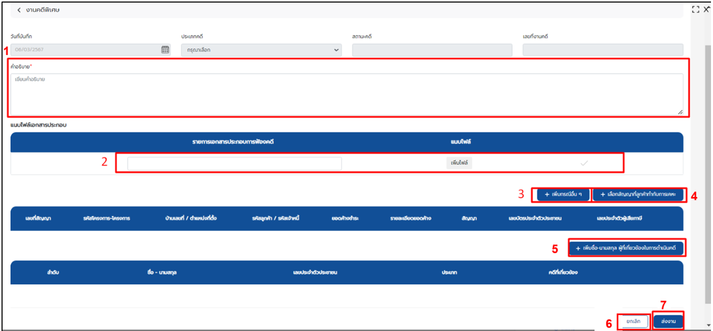<figcaption>
<strong>รูปภาพที่ 14</strong> หน้าจอสร้างงานคดีพิเศษและขออนุมัติ
</figcaption></figure>

1. ระบุฟิลด์ คำอธิบาย
2. กดที่ปุ่ม ชื่อรายการเอกสารประกอบการฟ้องคดี เพิ่มไฟล์เอกสาร PDF และกดที่ เครื่องหมายถูก
3. กดที่ปุ่ม “+ เพิ่มกรณีอื่นๆ”

<figure>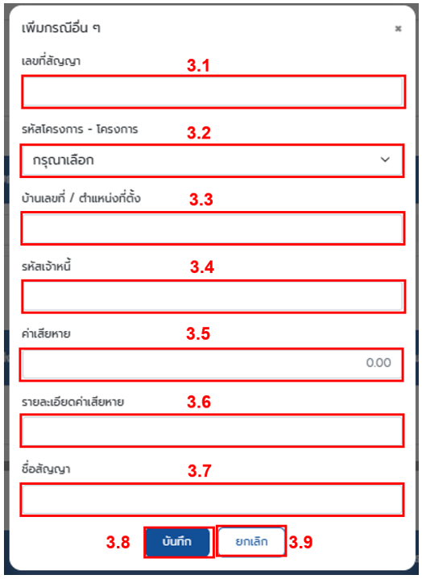<figcaption>
<strong>รูปภาพที่ 15</strong> หน้าจอ Pop-up เพิ่มกรณีอื่นๆ
</figcaption></figure>

3.1 กรอกข้อมูล “เลขที่สัญญา”

3.2 กรอกข้อมูล “รหัสโครงการ - โครงการ”

3.3 กรอกข้อมูล “บ้านเลขที่ / ตำแหน่งที่ตั้ง”

3.4 กรอกข้อมูล “รหัสเจ้าหนี้”

3.5 กรอกข้อมูล “ค่าเสียหาย”

3.6 กรอกข้อมูล “รายละเอียดค่าเสียหาย”

3.7 กรอกข้อมูล “ชื่อสัญญา”

3.8 ข้อมูลเรียบร้อย กดปุ่ม “บันทึก”

3.9 ไม่บันทึกข้อมูล กดปุ่ม “ยกเลิก”

4. กดที่ปุ่ม “+ เลือกสัญญาที่ลูกค้าทำกับการเคหะ”

<figure>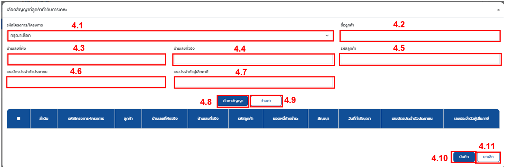<figcaption>
<strong>รูปภาพที่ 16</strong> หน้าจอ Pop-up เลือกสัญญาที่ลูกค้าทำกับการเคหะ
</figcaption></figure>

4.1 กรอกข้อมูล “รหัสโครงการ/โครงการ”

4.2 กรอกข้อมูล “ชื่อลูกค้า”

4.3 กรอกข้อมูล “บ้านเลขที่ผัง”

4.4 กรอกข้อมูล “บ้านเลขที่จริง”

4.5 กรอกข้อมูล “รหัสลูกค้า”

4.6 กรอกข้อมูล “เลขบัตรประจำตัวประชาชน”

4.7 กรอกข้อมูล “เลขประจำตัวผู้เสียภาษี”

4.8 กรอกข้อมูลเรียบร้อย กดปุ่ม “ค้นหาสัญญา”

4.9 ยกเลิกข้อมูล กดปุ่ม “ล้างค่า”

4.10 ข้อมูลเรียบร้อย กดปุ่ม “บันทึก”

4.11 ไม่บันทึกข้อมูล กดปุ่ม “ยกเลิก”

5. กดที่ปุ่ม “+ เพิ่มชื่อ - นามสกุล ผู้ที่เกี่ยวข้องในคดี”

<figure>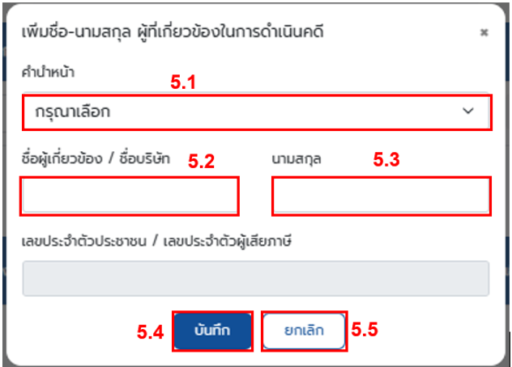<figcaption>
<strong>รูปภาพที่ 17</strong> หน้าจอ Pop-up เพิ่มชื่อ - นามสกุล ผู้ที่เกี่ยวข้องในคดี
</figcaption></figure>

5.1 กรอกข้อมูล “คำนำหน้า”

5.2 กรอกข้อมูล “ชื่อผู้เกี่ยวข้อง / ชื่อบริษัท”

5.3 กรอกข้อมูล “นามสกุล”

5.4 ข้อมูลเรียบร้อย กดปุ่ม “บันทึก”

5.5 ไม่บันทึกข้อมูล กดปุ่ม “ยกเลิก”

7. ไม่บันทึกข้อมูล กดปุ่ม “ยกเลิก”
8. ข้อมูลเรียบร้อย กดปุ่ม “ส่งงาน”

<figure>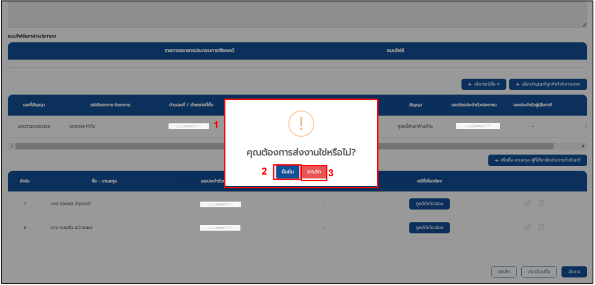<figcaption>
<strong>รูปภาพที่ 18</strong> หน้าจอ Pop-up ยืนยันการส่งงาน
</figcaption></figure>

1. ระบบจะแสดง Pop-up ยืนยันการส่งงาน
2. ข้อมูลเรียบร้อย กดปุ่ม “ยืนยัน”
3. ไม่บันทึกข้อมูล กดปุ่ม “ยกเลิก”

<figure>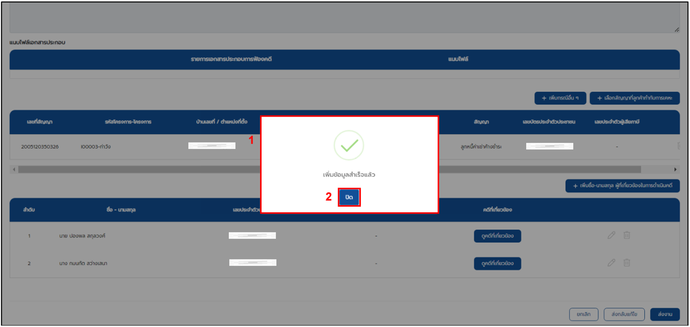<figcaption>
<strong>รูปภาพที่ 19</strong> หน้าจอ Pop-up ยืนยันการส่งงานสำเร็จ
</figcaption></figure>

1. ระบบจะแสดง Pop-up เพิ่มข้อมูลสำเร็จแล้ว
2. กดปุ่ม “ปิด”

### 1.3 ขั้นตอน หน่วยงานต้นเรื่อง : กอง พิจารณา ส่งกลับแก้ไข 

กองต้นเรื่องพิจารณาผลเป็นส่งกลับแก้ไข กรณีที่ข้อมูลไม่ถูกต้อง

<figure>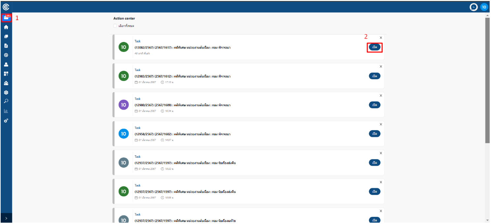<figcaption>
<strong>รูปภาพที่ 20</strong> หน้าจอแจ้งเตือนพิจารณาคดีพิเศษของหน่วยงานต้นเรื่อง : กอง
</figcaption></figure>

1. กดเลือกเมนู Action Center / Notification
2. กดที่ปุ่ม “เปิด” ที่คดีพิเศษ หน่วยงานต้นเรื่อง : กอง พิจารณา

<figure>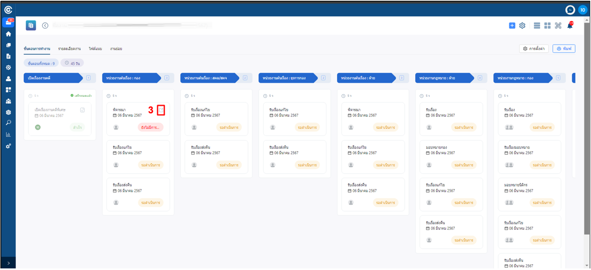<figcaption>
<strong>รูปภาพที่ 21</strong> หน่วยงานต้นเรื่อง : กอง ดำเนินการพิจารณาคดี
</figcaption></figure>

3. กดที่ปุ่ม

<figure><figcaption></figcaption></figure>

ที่ กล่องพิจารณา หน่วยงานต้นเรื่อง : กอง พิจารณา

<figure>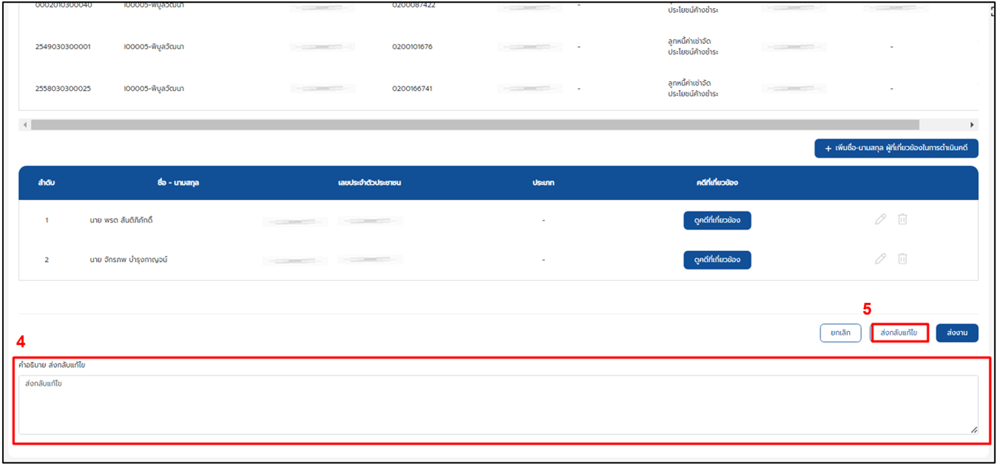<figcaption>
<strong>รูปภาพที่ 22</strong> หน้าจอพิจารณาคดีพิเศษ หน่วยงานต้นเรื่อง : กอง
</figcaption></figure>

4. ระบุคำอธิบาย “ส่งกลับแก้ไข”
5. กดที่ปุ่ม “ส่งกลับแก้ไข”

<figure>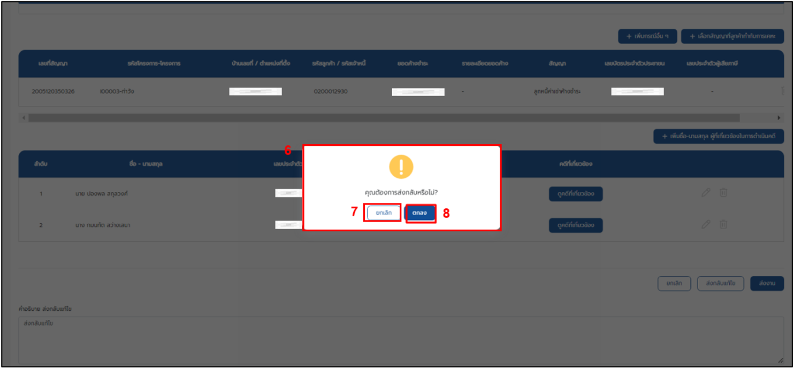<figcaption>
<strong>รูปภาพที่ 23</strong> หน้าจอ Pop-up ยืนยันการส่งกลับแก้ไข
</figcaption></figure>

6. ระบบจะขึ้น Pop-up ยืนยันการส่งกลับแก้ไข
7. ไม่บันทึกข้อมูล กดปุ่ม “ยกเลิก”
8. ข้อมูลเรียบร้อย กดปุ่ม “ตกลง”

<figure>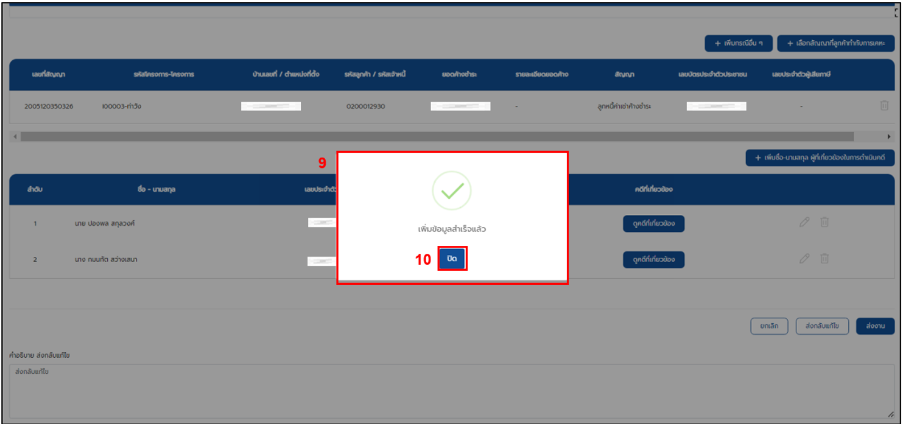<figcaption>
<strong>รูปภาพที่ 24</strong> หน้าจอ Pop-up ยืนยันการส่งกลับแก้ไขสำเร็จ
</figcaption></figure>

9. ระบบจะแสดง Pop-up เพิ่มข้อมูลสำเร็จแล้ว
10. กดปุ่ม “ปิด”

### 1.4 ขั้นตอน หน่วยงานต้นเรื่อง : สคล/สคจ รับเรื่องแก้ไข ส่งงาน 

หน่วยงานต้นเรื่องแก้ไขข้อมูลให้ถูกต้องและส่งกลับไปยังกองต้นเรื่อง

<figure>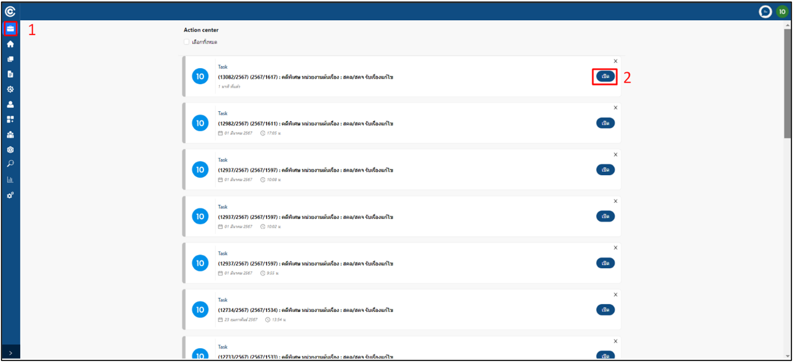<figcaption>
<strong>รูปภาพที่ 25</strong> หน้าจอแจ้งเตือนรับเรื่องแก้ไข ส่งงาน คดีพิเศษ หน่วยงานต้นเรื่อง : สคล/สคจ
</figcaption></figure>

1. กดเลือกเมนู Action Center / Notification
2. กดที่ปุ่ม “เปิด” ที่คดีพิเศษ หน่วยงานต้นเรื่อง : สคล/สคจ รับเรื่องแก้ไข

<figure>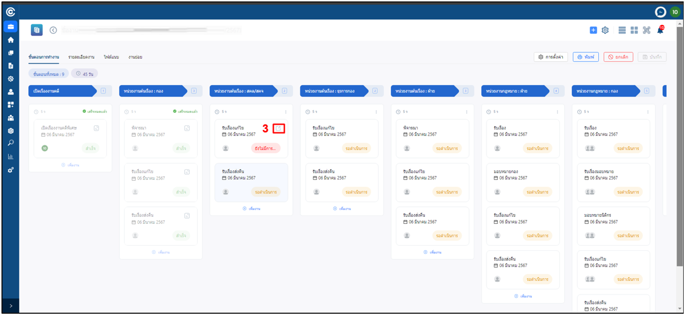<figcaption>
<strong>รูปภาพที่ 26</strong> หน่วยงานต้นเรื่อง : สคล/สคจ ดำเนินการพิจารณาคดีพิเศษ
</figcaption></figure>

3. กดที่ปุ่ม

<figure><figcaption></figcaption></figure>

ที่ กล่องพิจารณา หน่วยงานต้นเรื่อง : สคล/สคจ

<figure>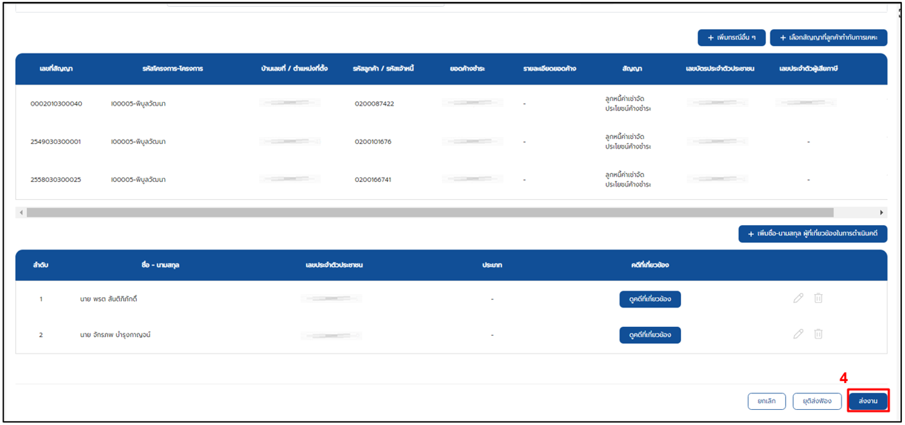<figcaption>
<strong>รูปภาพที่ 27</strong> หน้าจอพิจารณาคดีพิเศษ หน่วยงานต้นเรื่อง : สคล/สคจ
</figcaption></figure>

4. กดที่ปุ่ม “ส่งงาน”

<figure>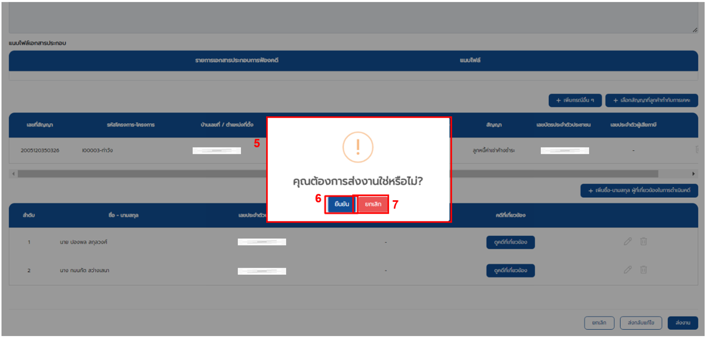<figcaption>
<strong>รูปภาพที่ 28</strong> หน้าจอ Pop-up ยืนยันการส่งงาน
</figcaption></figure>

5. ระบบจะแสดง Pop-up ยืนยันการส่งงาน
6. กดปุ่ม “ยืนยัน”
7. ไม่บันทึกข้อมูล กดปุ่ม “ยกเลิก”

<figure>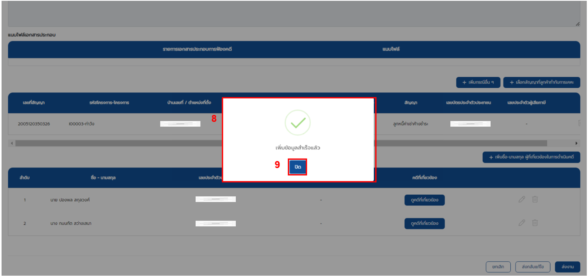<figcaption>
<strong>รูปภาพที่ 29</strong> หน้าจอ Pop-up ยืนยันการส่งงานสำเร็จ
</figcaption></figure>

8. ระบบจะแสดง Pop-up เพิ่มข้อมูลสำเร็จแล้ว
9. กดปุ่ม “ปิด”

### 1.5 ขั้นตอน คดีพิเศษ หน่วยงานต้นเรื่อง : กอง รับเรื่องส่งคืน ส่งงาน 

กรณีที่กองต้นเรื่องอนุมัติ กองต้นเรื่องสามารถส่งไปยังฝ่ายต้นเรื่องหรือกองกฎหมายได้ กรณีที่เลือกกองกฎหมายสามารถเลือกหน่วยงานได้

<figure>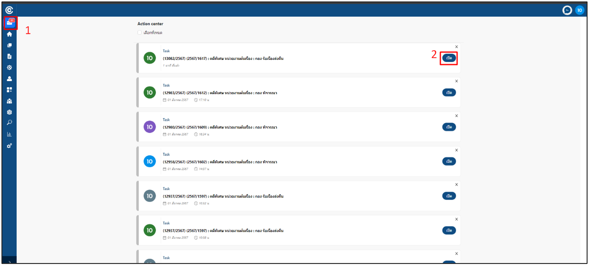<figcaption>
<strong>รูปภาพที่ 30</strong> หน้าจอแจ้งเตือนรับเรื่องส่งคืน ส่งงาน คดีพิเศษ หน่วยงานต้นเรื่อง : กอง
</figcaption></figure>

1. กดเลือกเมนู Action Center / Notification
2. กดที่ปุ่ม “เปิด” ที่คดีพิเศษ หน่วยงานต้นเรื่อง : กอง รับเรื่องส่งคืน

<figure>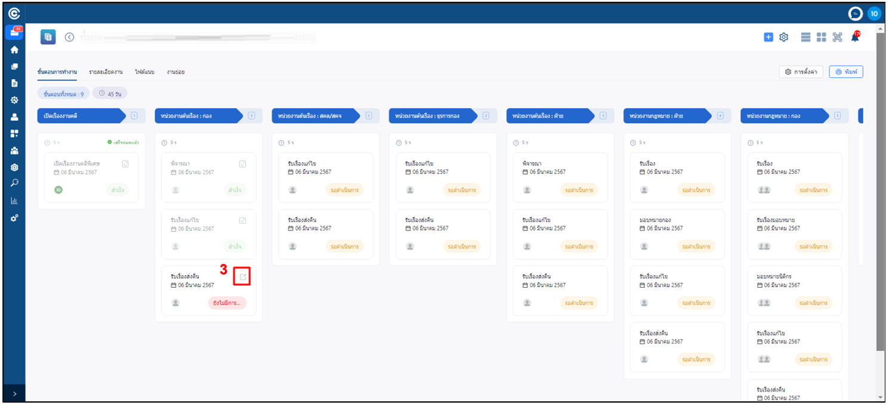<figcaption>
<strong>รูปภาพที่ 31</strong> หน่วยงานต้นเรื่อง : กอง ดำเนินการรับเรื่องส่งคืน
</figcaption></figure>

3. กดที่ปุ่ม

<figure><figcaption></figcaption></figure>

ที่กล่องรับเรื่องส่งคืน หน่วยงานต้นเรื่อง : กอง

<figure>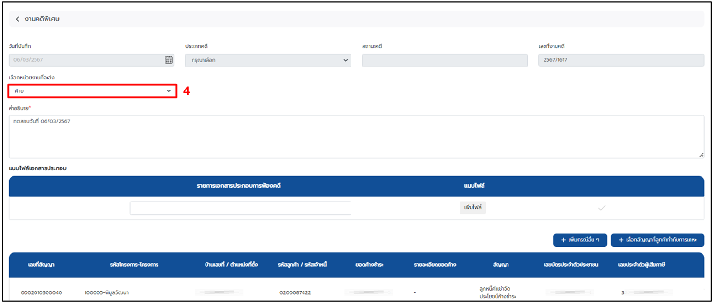<figcaption>
<strong>รูปภาพที่ 32</strong> หน้าจอรับเรื่องส่งคืน คดีพิเศษ หน่วยงานต้นเรื่อง : กอง
</figcaption></figure>

4. เลือกฟิลด์ Drop down เลือกหน่วยผู้รับผิดชอบเป็น “ฝ่าย”

<figure>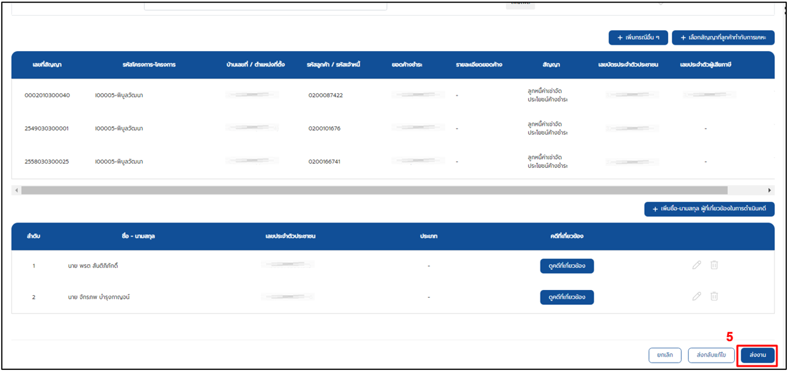<figcaption>
<strong>รูปภาพที่ 33</strong> หน้าจอรับเรื่องส่งคืน คดีพิเศษ หน่วยงานต้นเรื่อง : กอง (1)
</figcaption></figure>

5. กดปุ่ม “ส่งงาน”

<figure><figcaption>
<strong>รูปภาพที่ 34</strong> หน้าจอ Pop-up ยืนยันการส่งงาน
</figcaption></figure>

6. ระบบจะแสดง Pop-up ยืนยันการส่งงาน
7. กดปุ่ม “ยืนยัน”
8. ไม่บันทึกข้อมูล กดปุ่ม “ยกเลิก”

<figure>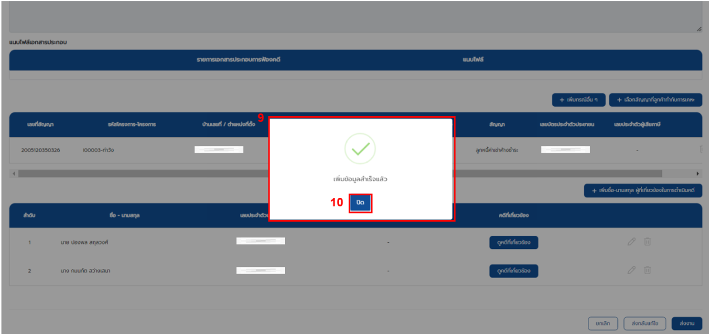<figcaption>
<strong>รูปภาพที่ 35</strong> หน้าจอ Pop-up ยืนยันการส่งงานสำเร็จ
</figcaption></figure>

9. ระบบจะแสดง Pop-up เพิ่มข้อมูลสำเร็จแล้ว
10. กดปุ่ม “ปิด”

### 1.6 ขั้นตอน หน่วยงานต้นเรื่อง : ฝ่าย พิจารณา ส่งกลับแก้ไข 

กองต้นเรื่องส่งให้ฝ่ายต้นเรื่องเพื่อให้ฝ่ายต้นเรื่องพิจารณาต่อ กรณีที่ข้อมูลไม่ถูกต้องฝ่ายต้นเรื่องจะส่งกลับแก้ไขไปยังกองต้นเรื่อง

<figure><figcaption>
<strong>รูปภาพที่ 36</strong> หน้าจอแจ้งเตือนพิจารณาคดีพิเศษของหน่วยงานต้นเรื่อง : ฝ่าย
</figcaption></figure>

1. กดเลือกเมนู Action Center / Notification
2. กดที่ปุ่ม “เปิด” ที่คดีพิเศษ คดีพิเศษ หน่วยงานต้นเรื่อง : ฝ่าย พิจารณา

<figure>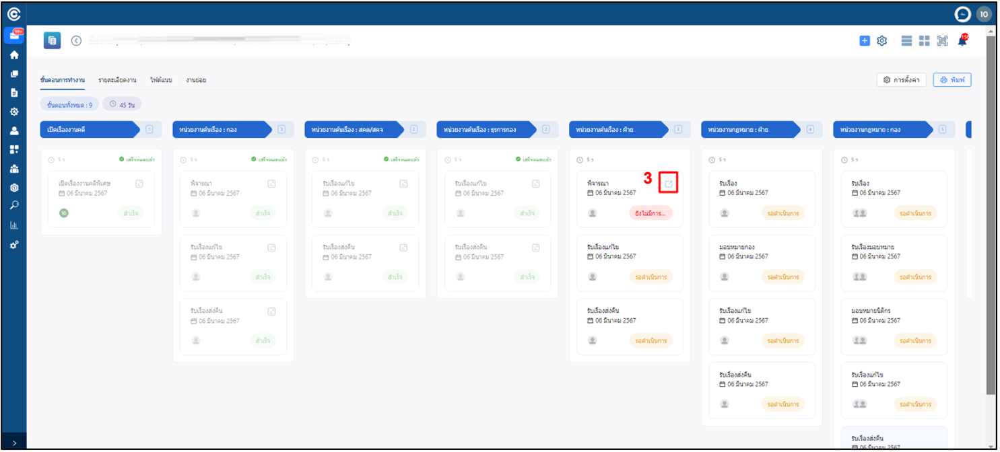<figcaption>
<strong>รูปภาพที่ 37</strong> หน่วยงานต้นเรื่อง : ฝ่าย ดำเนินการพิจารณาคดีพิเศษ
</figcaption></figure>

3. กดที่ปุ่ม

<figure><figcaption></figcaption></figure>

ที่ กล่องพิจารณา หน่วยงานต้นเรื่อง : ฝ่าย

<figure>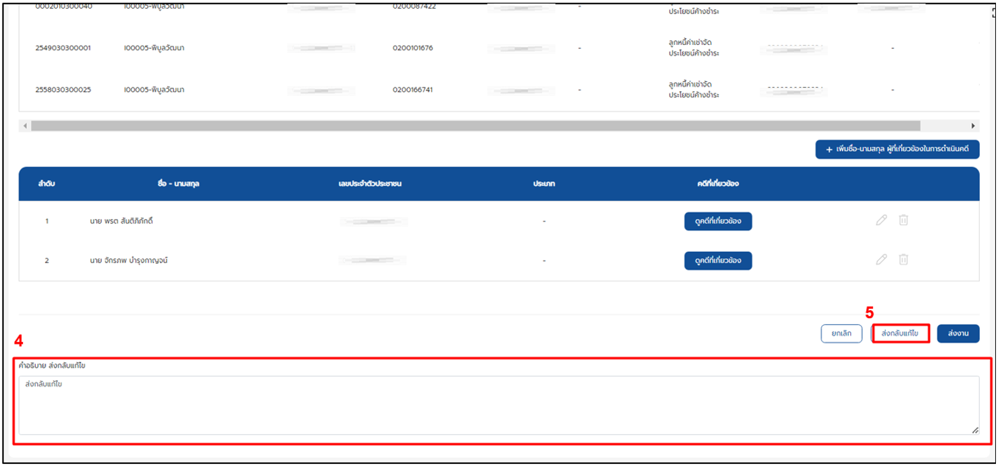<figcaption>
<strong>รูปภาพที่ 38</strong> ส่วนคำอธิบาย ส่งกลับแก้ไข
</figcaption></figure>

4. กดปุ่มส่งกลับแก้ไข แล้วระบุคำอธิบาย ส่งกลับแก้ไข
5. กดที่ปุ่ม “ส่งกลับแก้ไข” อีกครั้ง

<figure><figcaption>
<strong>รูปภาพที่ 39</strong> หน้าจอ Pop-up ยืนยันการส่งกลับแก้ไข
</figcaption></figure>

6. ระบบจะขึ้น Pop-up ยืนยันการส่งกลับแก้ไข
7. ไม่บันทึกข้อมูล กดปุ่ม “ยกเลิก”
8. กดปุ่ม “ตกลง”

<figure>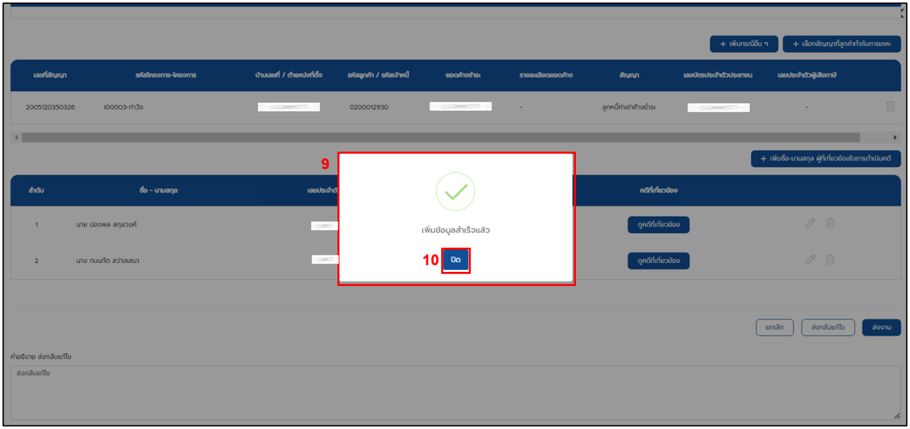<figcaption>
<strong>รูปภาพที่ 40</strong> หน้าจอ Pop-up ยืนยันการส่งกลับแก้ไขสำเร็จ
</figcaption></figure>

9. ระบบจะแสดง Pop-up เพิ่มข้อมูลสำเร็จแล้ว
10. กดปุ่ม “ปิด”

### 1.7 ขั้นตอน หน่วยงานต้นเรื่อง : กอง รับเรื่องแก้ไข ส่งงาน 

กองต้นเรื่องแก้ไขข้อมูลให้ถูกต้องและส่งกลับไปยังฝ่ายต้นเรื่อง

<figure><figcaption>
<strong>รูปภาพที่ 41</strong> หน้าจอแจ้งเตือนรับเรื่องแก้ไข ส่งงาน คดีพิเศษ หน่วยงานต้นเรื่อง: กอง
</figcaption></figure>

1. กดเลือกเมนู Action Center / Notification
2. กดที่ปุ่ม “เปิด” ที่คดีพิเศษ หน่วยงานต้นเรื่อง : กอง รับเรื่องแก้ไข

<figure>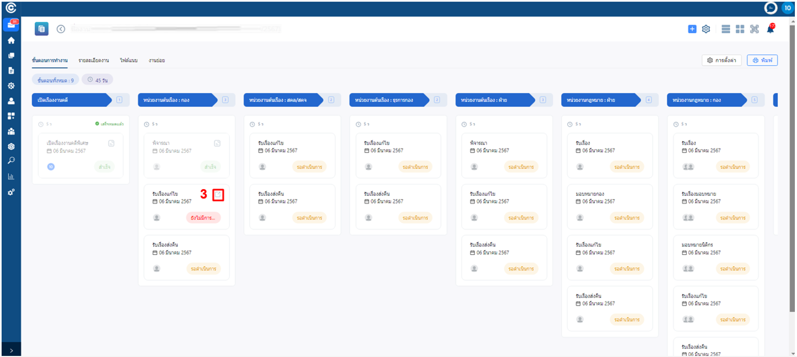<figcaption>
<strong>รูปภาพที่ 42</strong> หน่วยงานต้นเรื่อง : กอง ดำเนินการรับเรื่องแก้ไข
</figcaption></figure>

3. กดที่ปุ่ม

<figure><figcaption></figcaption></figure>

ที่ กล่องพิจารณา หน่วยงานต้นเรื่อง : กอง รับเรื่องแก้ไข

<figure>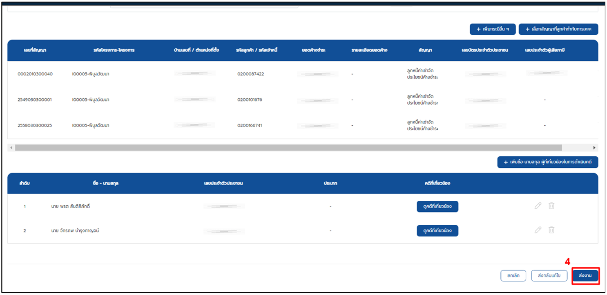<figcaption>
<strong>รูปภาพที่ 43</strong> หน้าจอพิจารณาคดีพิเศษ หน่วยงานต้นเรื่อง : กอง
</figcaption></figure>

4. กดที่ปุ่ม “ส่งงาน”

<figure>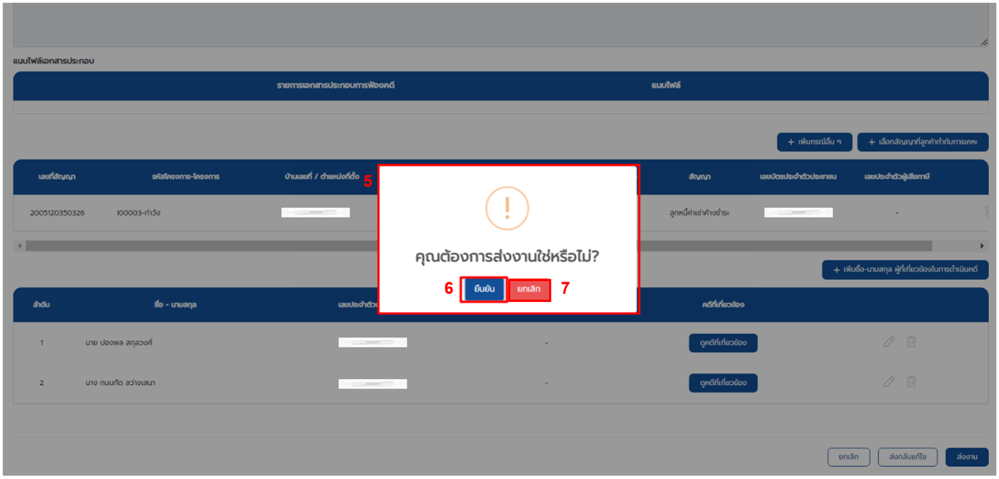<figcaption>
<strong>รูปภาพที่ 44</strong> หน้าจอ Pop-up ยืนยันการส่งกลับแก้ไข
</figcaption></figure>

5. ระบบจะแสดง Pop-up ยืนยันการส่งงาน
6. กดปุ่ม “ยืนยัน”
7. ไม่บันทึกข้อมูล กดปุ่ม “ยกเลิก”

<figure>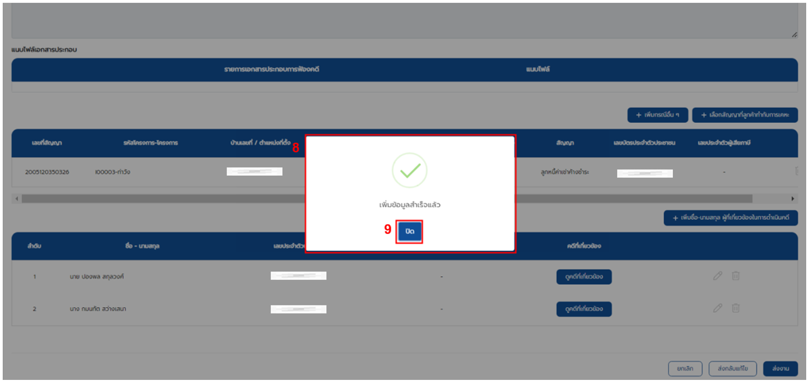<figcaption>
<strong>รูปภาพที่ 45</strong> หน้าจอ Pop-up ยืนยันการส่งกลับแก้ไขสำเร็จ
</figcaption></figure>

8. ระบบจะแสดง Pop-up เพิ่มข้อมูลสำเร็จแล้ว
9. กดปุ่ม “ปิด”

### 1.8 ขั้นตอน หน่วยงานต้นเรื่อง : ฝ่าย รับเรื่องส่งคืน ส่งงาน 

ฝ่ายต้นเรื่องจะตรวจสอบข้อมูลและส่งไปยังฝ่ายกฎหมาย

<figure>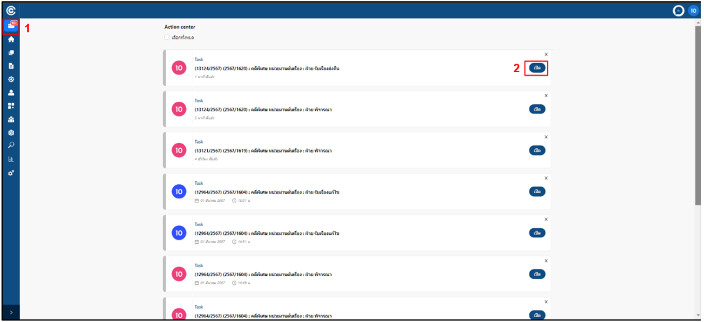<figcaption>
<strong>รูปภาพที่ 46</strong> หน้าจอแจ้งเตือนรับเรื่องส่งคืน ส่งงาน คดีพิเศษ หน่วยงานต้นเรื่อง : ฝ่าย
</figcaption></figure>

1. กดเลือกเมนู Action Center / Notification
2. กดที่ปุ่ม “เปิด” ที่คดีพิเศษหน่วยงานต้นเรื่อง : ฝ่าย รับเรื่องส่งคืน

<figure><figcaption>
<strong>รูปภาพที่ 47</strong> หน่วยงานต้นเรื่อง : ฝ่าย ดำเนินการรับเรื่องส่งคืน
</figcaption></figure>

3. กดที่ปุ่ม

<figure><figcaption></figcaption></figure>

ที่ กล่องพิจารณา หน่วยงานต้นเรื่อง : ฝ่าย รับเรื่องส่งคืน

<figure>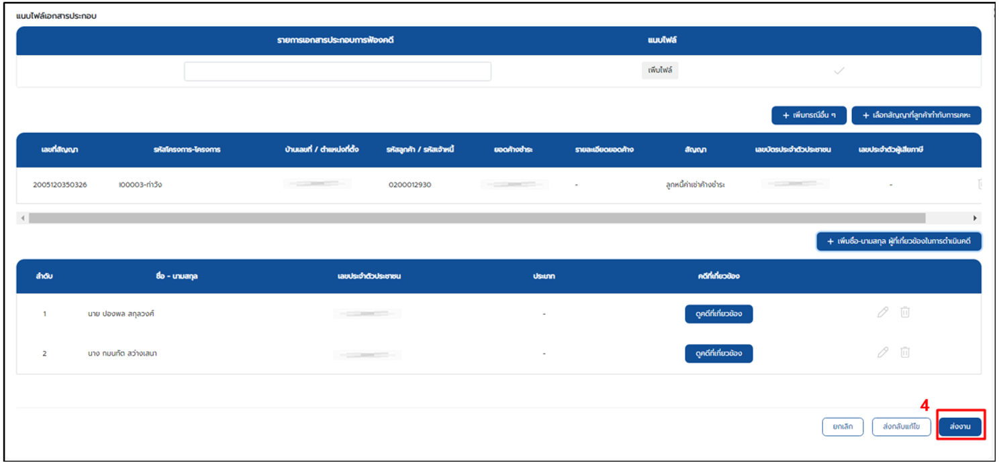<figcaption>
<strong>รูปภาพที่ 48</strong> หน้าจอรับเรื่องส่งคืน คดีพิเศษ หน่วยงานต้นเรื่อง : ฝ่าย
</figcaption></figure>

4. กดที่ปุ่ม “ส่งงาน”

<figure>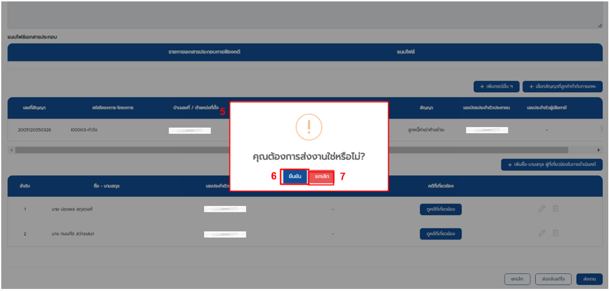<figcaption>
<strong>รูปภาพที่ 49</strong> หน้าจอ Pop-up ยืนยันการส่งกลับแก้ไข
</figcaption></figure>

5. ระบบจะแสดง Pop-up ยืนยันการส่งงาน
6. กดปุ่ม “ยืนยัน”
7. ไม่บันทึกข้อมูล กดปุ่ม “ยกเลิก”

<figure>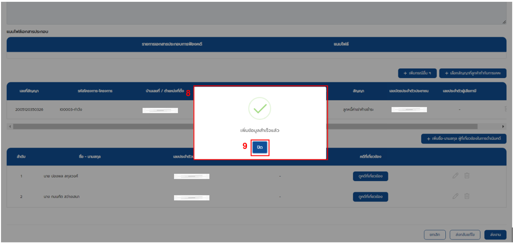<figcaption>
<strong>รูปภาพที่ 50</strong> หน้าจอ Pop-up ยืนยันการส่งกลับแก้ไขสำเร็จ
</figcaption></figure>

8. ระบบจะแสดง Pop-up เพิ่มข้อมูลสำเร็จแล้ว
9. กดปุ่ม “ปิด”

### 1.9 ขั้นตอน หน่วยงานกฏหมาย : ฝ่าย รับเรื่อง ส่งกลับแก้ไข 

ฝ่ายกฎหมายจะพิจารณาข้อมูล กรณีที่ข้อมูลไม่ถูกต้อง ฝ่ายกฎหมายจะส่งกลับไปยังฝ่ายต้นเรื่อง

<figure>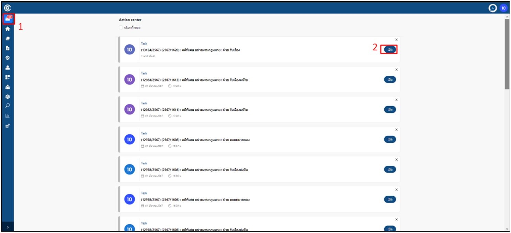<figcaption>
<strong>รูปภาพที่ 51</strong> หน้าจอแจ้งเตือนรับเรื่อง ส่งกลับแก้ไข คดีพิเศษ หน่วยงานกฎหมาย: ฝ่าย
</figcaption></figure>

1. กดเลือกเมนู Action Center / Notification
2. กดที่ปุ่ม “เปิด” ที่คดีพิเศษ หน่วยงานกฎหมาย : ฝ่าย รับเรื่อง

<figure>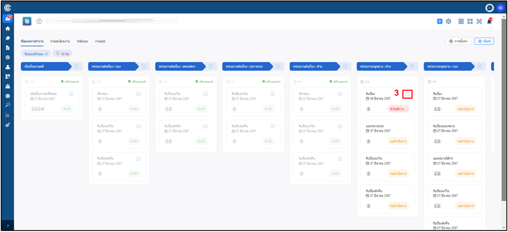<figcaption>
<strong>รูปภาพที่ 52</strong> หน่วยงานกฎหมาย : ฝ่าย ดำเนินการรับเรื่อง
</figcaption></figure>

3. กดที่ปุ่ม

<figure><figcaption></figcaption></figure>

ที่ กล่องพิจารณา หน่วยงานกฏหมาย: ฝ่าย รับเรื่อง

<figure>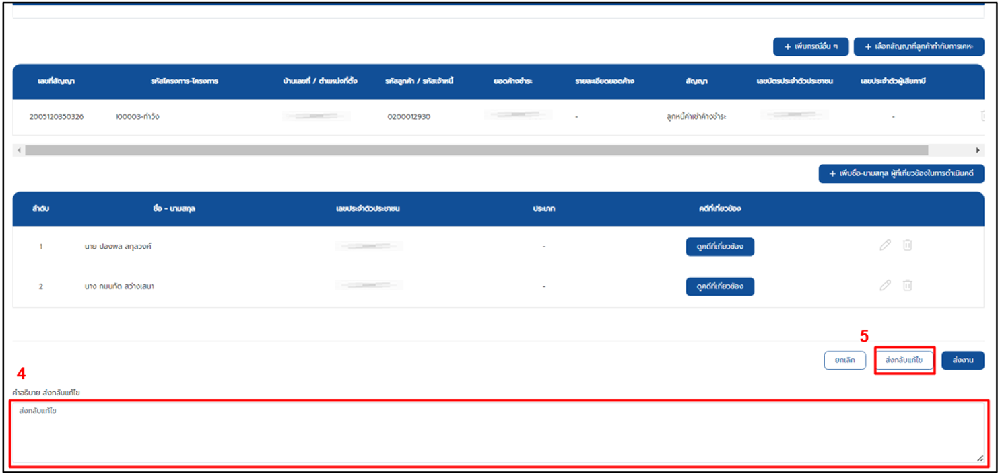<figcaption>
<strong>รูปภาพที่ 53</strong> ส่วนคำอธิบาย ส่งกลับแก้ไข
</figcaption></figure>

4. กดปุ่มส่งกลับแก้ไข แล้วระบุคำอธิบาย ส่งกลับแก้ไข
5. กดที่ปุ่ม “ส่งกลับแก้ไข” อีกครั้ง

<figure>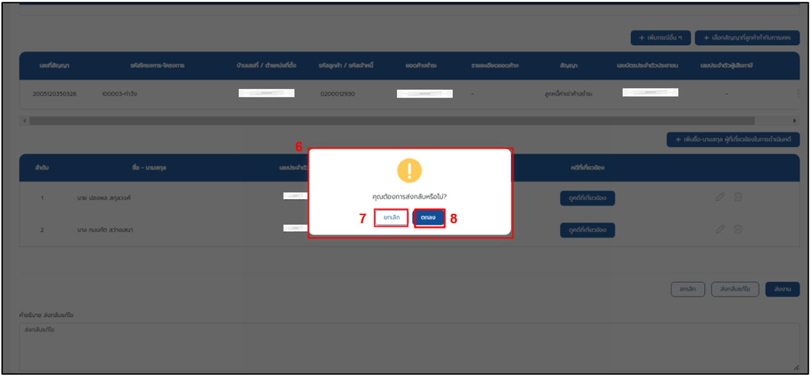<figcaption>
<strong>รูปภาพที่ 54</strong> หน้าจอ Pop-up ยืนยันการส่งกลับแก้ไข
</figcaption></figure>

6. ระบบจะขึ้น Pop-up ยืนยันการส่งกลับแก้ไข
7. ไม่บันทึกข้อมูล กดปุ่ม “ยกเลิก”
8. กดปุ่มตกลง

<figure>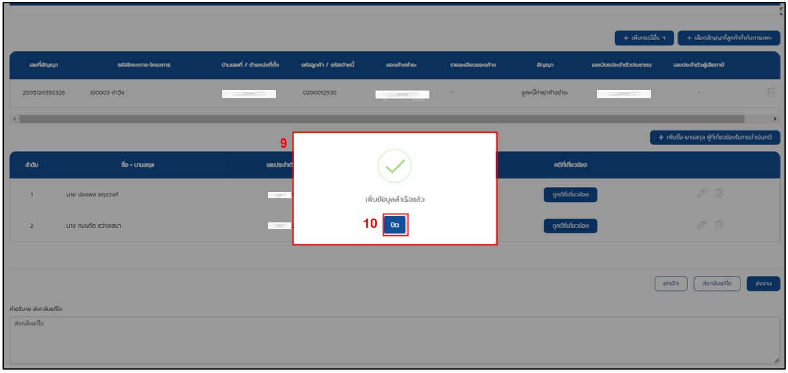<figcaption>
<strong>รูปภาพที่ 55</strong> หน้าจอ Pop-up ยืนยันการส่งกลับแก้ไขสำเร็จ
</figcaption></figure>

9. ระบบจะแสดง Pop-up เพิ่มข้อมูลสำเร็จแล้ว
10. กดปุ่ม “ปิด”

### 1.10 ขั้นตอน หน่วยงานต้นเรื่อง : ฝ่าย รับเรื่องแก้ไข ส่งงาน 

ฝ่ายต้นเรื่องแก้ไขแล้ว ฝ่ายต้นเรื่องส่งข้อมูลกลับไปยังฝ่ายกฎหมาย

<figure>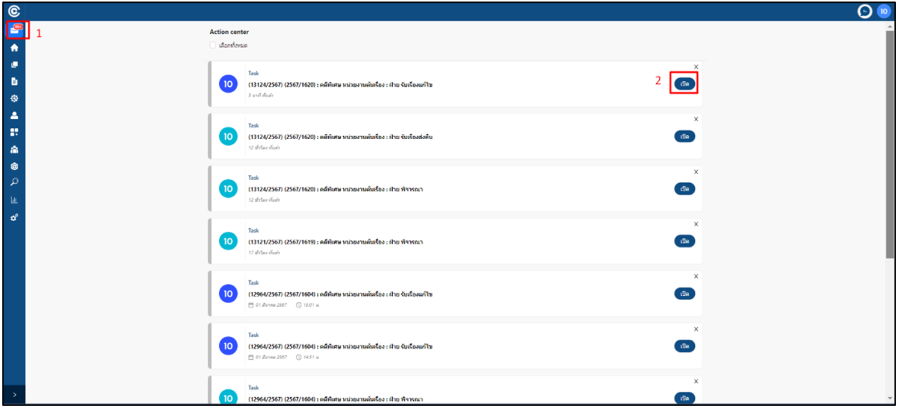<figcaption>
<strong>รูปภาพที่ 56</strong> หน้าจอแจ้งเตือนรับเรื่องแก้ไข คดีพิเศษ หน่วยงานต้นเรื่อง: ฝ่าย
</figcaption></figure>

1. กดเลือกเมนู Action Center / Notification
2. กดที่ปุ่ม “เปิด” ที่คดีพิเศษ หน่วยงานต้นเรื่อง : ฝ่าย รับเรื่องแก้ไข

<figure>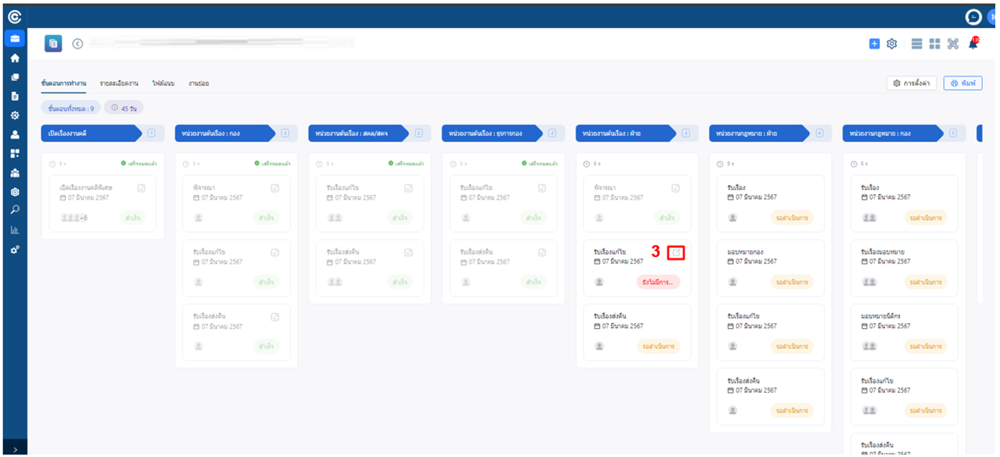<figcaption>
<strong>รูปภาพที่ 57</strong> หน่วยงานต้นเรื่อง : ฝ่าย ดำเนินการรับเรื่องแก้ไข
</figcaption></figure>

3. กดที่ปุ่ม

<figure><figcaption></figcaption></figure>

ที่ กล่องพิจารณา หน่วยงานต้นเรื่อง: ฝ่าย รับเรื่องแก้ไข

<figure>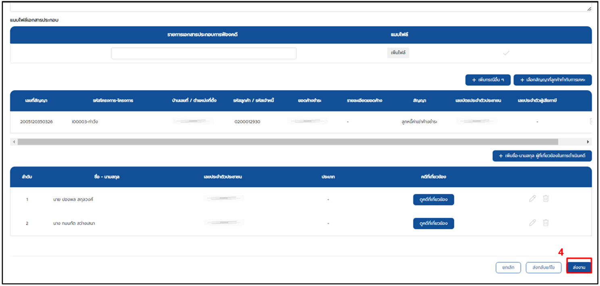<figcaption>
<strong>รูปภาพที่ 58</strong> หน้าจอรับเรื่องแก้ไข คดีพิเศษ หน่วยงานต้นเรื่อง : ฝ่าย
</figcaption></figure>

4. กดปุ่ม “ส่งงาน”

<figure>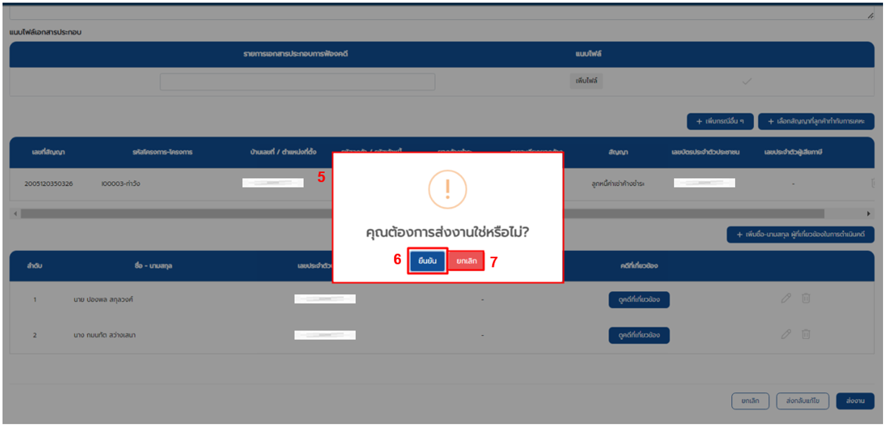<figcaption>
<strong>รูปภาพที่ 59</strong> หน้าจอ Pop-up ยืนยันการส่งกลับแก้ไข
</figcaption></figure>

5. ระบบแสดง Pop-up ยืนยันการส่งงาน
6. กดปุ่ม “ยืนยัน”
7. ไม่บันทึกข้อมูล กดปุ่ม “ยกเลิก”

<figure>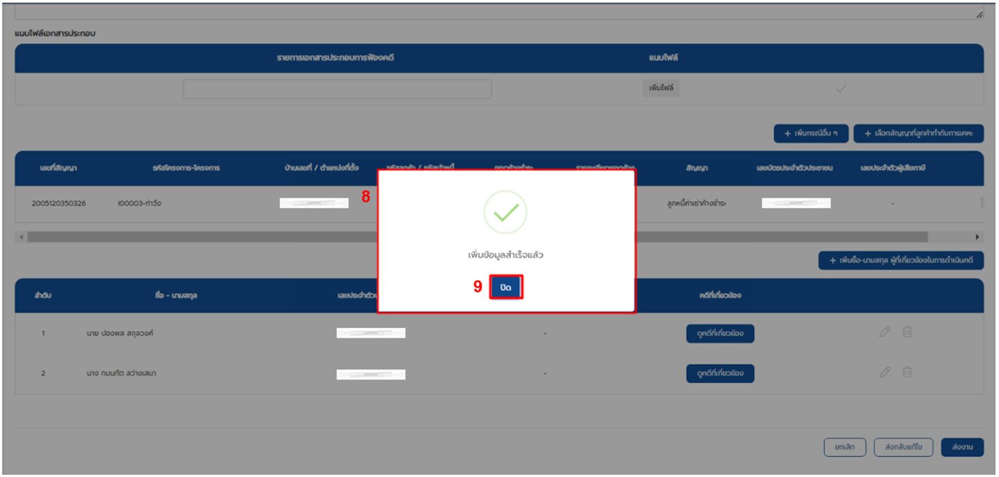<figcaption>
<strong>รูปภาพที่ 60</strong> หน้าจอ Pop-up ยืนยันการส่งกลับแก้ไขสำเร็จ
</figcaption></figure>

8. ระบบจะแสดง Pop-up เพิ่มข้อมูลสำเร็จแล้ว
9. กดปุ่ม “ปิด”

### 1.11 ขั้นตอน หน่วยงานกฎหมาย : ฝ่าย รับเรื่องส่งคืน ส่งงาน 

ฝ่ายกฎหมายได้รับเรื่องแล้ว

<figure>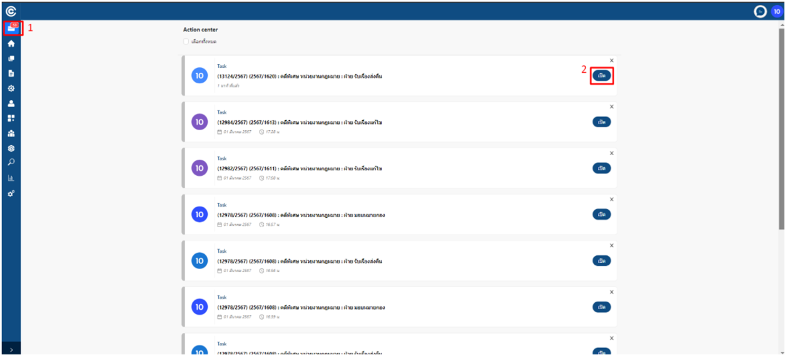<figcaption>
<strong>รูปภาพที่ 61</strong> หน้าจอแจ้งเตือนรับเรื่อง ส่งคืน ส่งงาน คดีพิเศษ หน่วยงานกฎหมาย : ฝ่าย
</figcaption></figure>

1. กดเลือกเมนู Action Center / Notification
2. กดที่ปุ่ม “เปิด” ที่คดีพิเศษ หน่วยงานกฏหมาย : ฝ่าย รับเรื่องส่งคืน

<figure>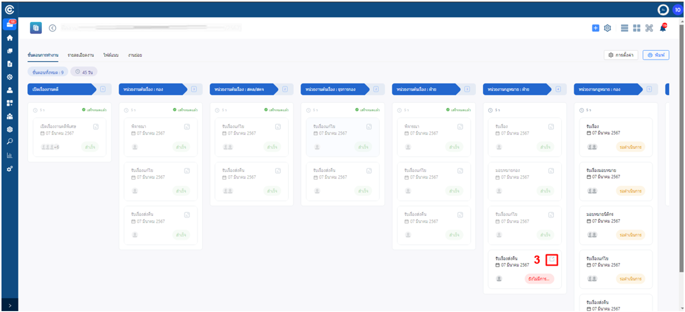<figcaption>
<strong>รูปภาพที่ 62</strong> หน่วยงานกฎหมาย : ฝ่าย ดำเนินการรับเรื่องส่งคืน
</figcaption></figure>

3. กดที่ปุ่ม

<figure><figcaption></figcaption></figure>

ที่ กล่องพิจารณา หน่วยงานกฏหมาย : ฝ่าย รับเรื่องส่งคืน

<figure>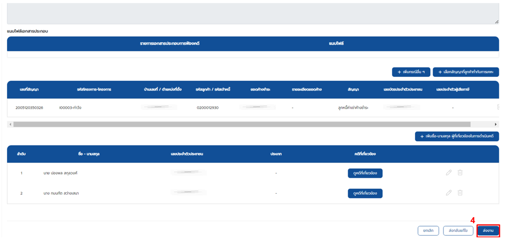<figcaption>
<strong>รูปภาพที่ 63</strong> หน้าจอรับเรื่องส่งคืน คดีพิเศษ หน่วยงานกฎหมาย : ฝ่าย
</figcaption></figure>

4. กดปุ่ม “ส่งงาน”

<figure><figcaption>
<strong>รูปภาพที่ 64</strong> หน้าจอ Pop-up ยืนยันการส่งกลับแก้ไข
</figcaption></figure>

5. ระบบจะแสดง Pop-up ยืนยันการส่งงาน
6. กดปุ่ม “ยืนยัน”
7. ไม่บันทึกข้อมูล กดปุ่ม “ยกเลิก”

<figure><figcaption>
<strong>รูปภาพที่ 65</strong> หน้าจอ Pop-up ยืนยันการส่งกลับแก้ไขสำเร็จ
</figcaption></figure>

8. ระบบจะแสดง Pop-up เพิ่มข้อมูลสำเร็จแล้ว
9. กดปุ่ม “ปิด”

### 1.12 ขั้นตอน หน่วยงานกฎหมาย : ฝ่าย มอบหมายกอง ส่งงาน 

ฝ่ายกฎหมายส่งให้กองกฎหมาย

<figure><figcaption>
<strong>รูปภาพที่ 66</strong> หน้าจอแจ้งเตือนมอบหมายกอง ส่งงาน คดีพิเศษ หน่วยงานกฎหมาย : ฝ่าย
</figcaption></figure>

1. กดเลือกเมนู Action Center / Notification
2. กดที่ปุ่ม “เปิด” ที่คดีพิเศษ หน่วยงานกฏหมาย : ฝ่าย มอบหมายกอง

<figure>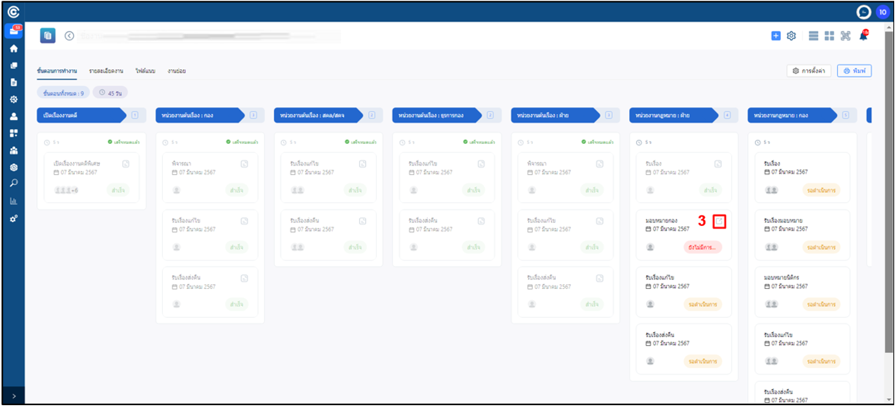<figcaption>
<strong>รูปภาพที่ 67</strong> หน่วยงานกฎหมาย : ฝ่าย ดำเนินการมอบหมายกอง
</figcaption></figure>

3. กดที่ปุ่ม

<figure><figcaption></figcaption></figure>

ที่ กล่องพิจารณา หน่วยงานกฏหมาย : ฝ่าย มอบหมายกอง

<figure>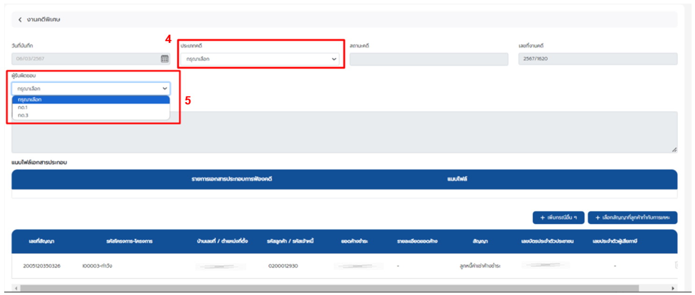<figcaption>
<strong>รูปภาพที่ 68</strong> หน้าจอมอบหมายกอง คดีพิเศษ หน่วยงานกฎหมาย : ฝ่าย
</figcaption></figure>

4. เลือก drop down “ประเภทคดี” ให้เป็น “คดีล้มละลาย”
5. เลือก drop down “ผู้รับผิดชอบ”

<figure>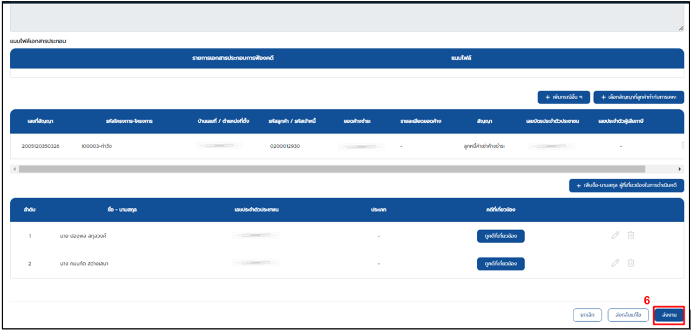<figcaption>
<strong>รูปภาพที่ 69</strong> หน้าจอมอบหมายกอง คดีพิเศษ หน่วยงานกฎหมาย : ฝ่าย (1)
</figcaption></figure>

6. กดปุ่ม “ส่งงาน”

<figure>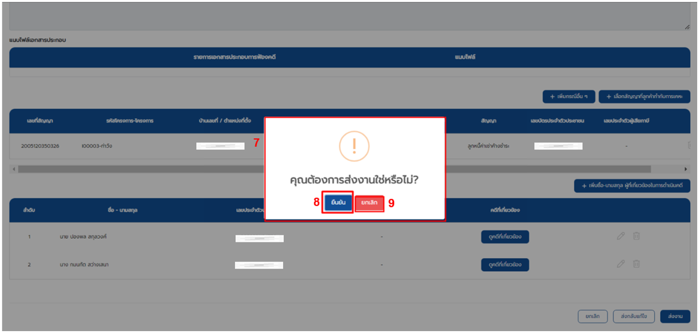<figcaption>
<strong>รูปภาพที่ 70</strong> หน้าจอ Pop-up ยืนยันการส่งกลับแก้ไข
</figcaption></figure>

7. ระบบจะแสดง Pop-up ยืนยันการส่งงาน
8. กดปุ่ม “ยืนยัน”
9. ไม่บันทึกข้อมูล กดปุ่ม “ยกเลิก”

<figure>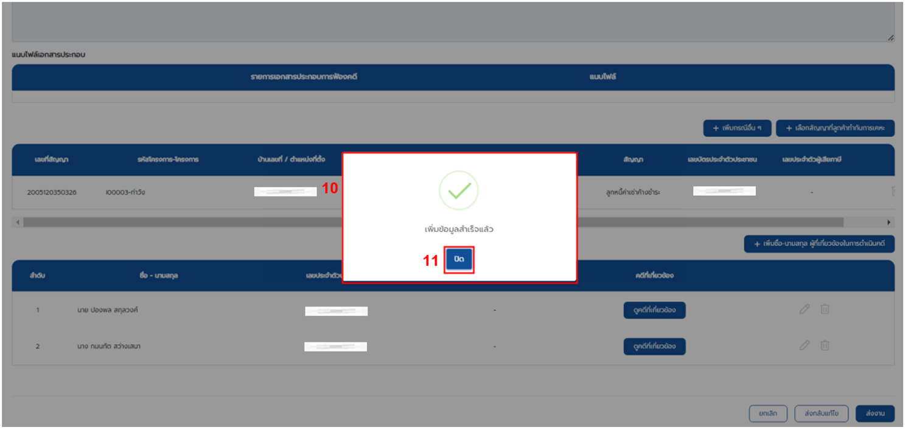<figcaption>
<strong>รูปภาพที่ 71</strong> หน้าจอ Pop-up ยืนยันการส่งกลับแก้ไขสำเร็จ
</figcaption></figure>

10. ระบบจะแสดง Pop-up เพิ่มข้อมูลสำเร็จแล้ว
11. กดปุ่ม “ปิด”

### 1.13 ขั้นตอน หน่วยงานกฏหมาย : กอง มอบหมายนิติกร ส่งกลับแก้ไข 

กองกฎหมายส่งกลับให้ฝ่ายกฎหมาย

<figure>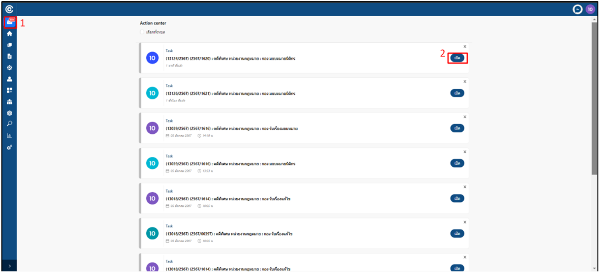<figcaption>
<strong>รูปภาพที่ 72</strong> หน้าจอแจ้งเตือนมอบหมายนิติกร ส่งกลับแก้ไข คดีพิเศษ หน่วยงานกฎหมาย : กอง
</figcaption></figure>

1. กดเลือกเมนู Action Center / Notification
2. กดที่ปุ่ม “เปิด” ที่คดีพิเศษ หน่วยงานกฏหมาย: กอง มอบหมายนิติกร

<figure>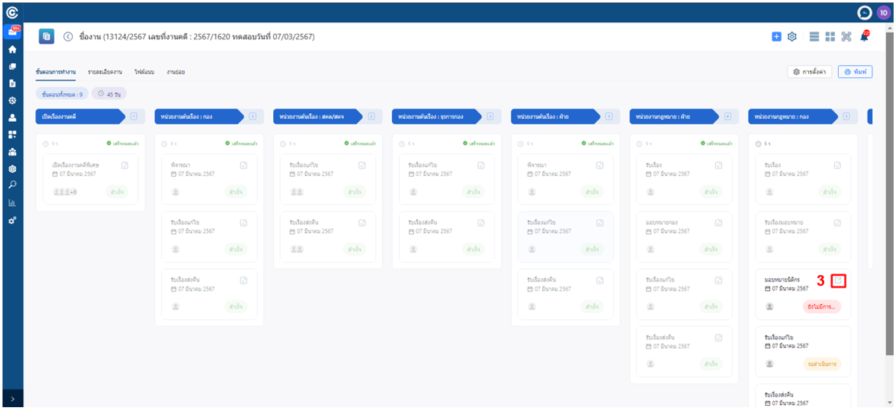<figcaption>
<strong>รูปภาพที่ 73</strong> หน่วยงานกฎหมาย : กอง ดำเนินการมอบหมายนิติกร
</figcaption></figure>

3. กดที่ปุ่ม

<figure><figcaption></figcaption></figure>

ที่ กล่องพิจารณา หน่วยงานกฏหมาย: กอง มอบหมายนิติกร

<figure>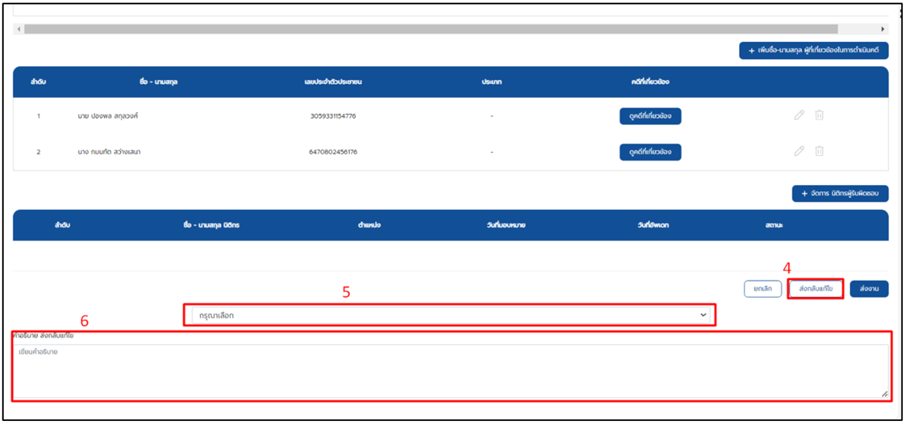<figcaption>
<strong>รูปภาพที่ 74</strong> หน้าจอมอบหมายนิติกร คดีพิเศษ หน่วยงานกฎหมาย : กอง
</figcaption></figure>

4. กดปุ่ม “ส่งกลับแก้ไข”
5. เลือก drop down หน่วยงานที่จะส่งกลับแก้ไข เช่น หน่วยงานก่อนหน้า / ฝ่าย / หน่วยงานต้นเรื่อง
6. ระบุคำอธิบายส่งกลับแก้ไข แล้วกดส่งกลับแก้ไขอีกครั้ง

<figure>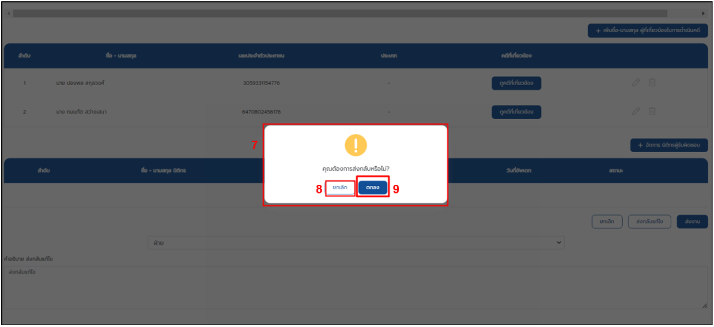<figcaption>
<strong>รูปภาพที่ 75</strong> หน้าจอ Pop-up ยืนยันการส่งกลับแก้ไข
</figcaption></figure>

7. ระบบจะแสดง Pop-up ยืนยันการส่งกลับแก้ไข
8. ไม่บันทึกข้อมูล กดปุ่ม “ยกเลิก”
9. กดปุ่ม “ตกลง”

<figure>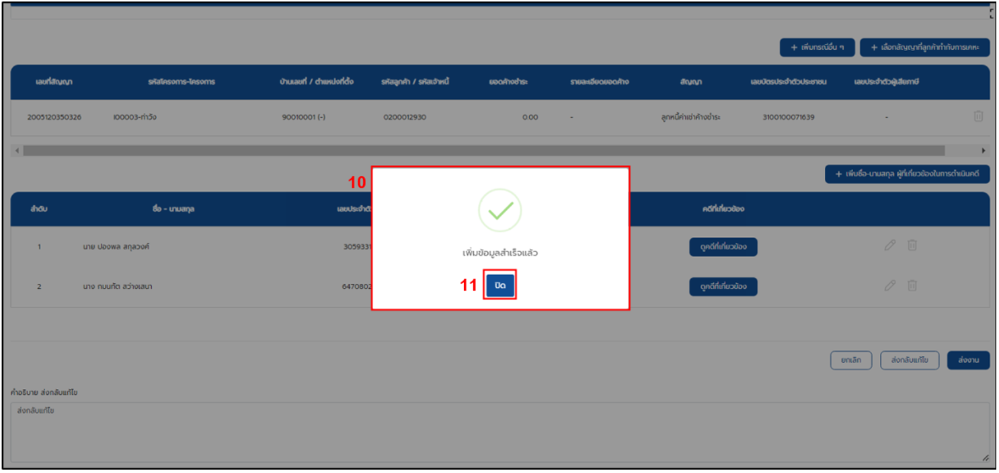<figcaption>
<strong>รูปภาพที่ 76</strong> หน้าจอ Pop-up ยืนยันการส่งกลับแก้ไขสำเร็จ
</figcaption></figure>

10. ระบบจะแสดง Pop-up เพิ่มข้อมูลสำเร็จแล้ว
11. กดปุ่ม “ปิด”

### 1.14 ขั้นตอน หน่วยงานกฏหมาย : ฝ่าย รับเรื่องแก้ไข ส่งงาน 

ฝ่ายกฎหมายแก้ไข และส่งกลับไปที่กองกฎหมายใหม่

<figure>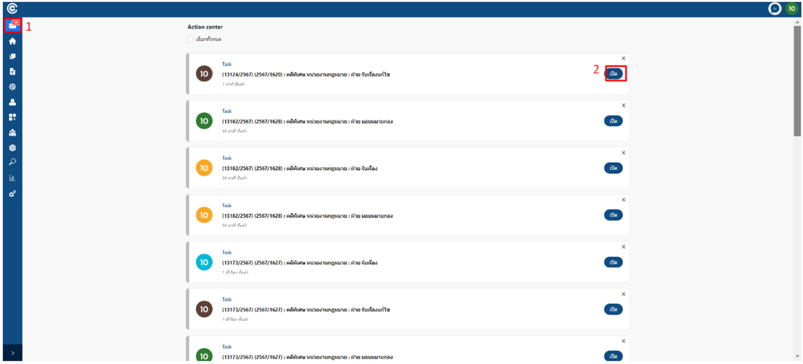<figcaption>
<strong>รูปภาพที่ 77</strong> หน้าจอแจ้งเตือนรับเรื่องแก้ไข ส่งงานคดีพิเศษ หน่วยงานกฎหมาย: ฝ่าย
</figcaption></figure>

1. กดเลือกเมนู Action Center / Notification
2. กดที่ปุ่ม “เปิด” ที่คดีพิเศษ หน่วยงานกฎหมาย : ฝ่าย รับเรื่องแก้ไข

<figure>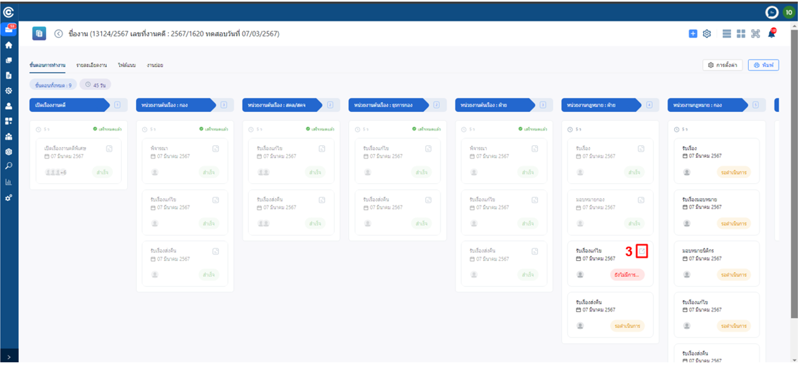<figcaption>
<strong>รูปภาพที่ 78</strong> หน่วยงานกฎหมาย : ฝ่าย ดำเนินการรับเรื่องแก้ไข
</figcaption></figure>

3. กดที่ปุ่ม

<figure><figcaption></figcaption></figure>

ที่ กล่องพิจารณา หน่วยงานกฎหมาย : ฝ่าย รับเรื่องแก้ไข

<figure>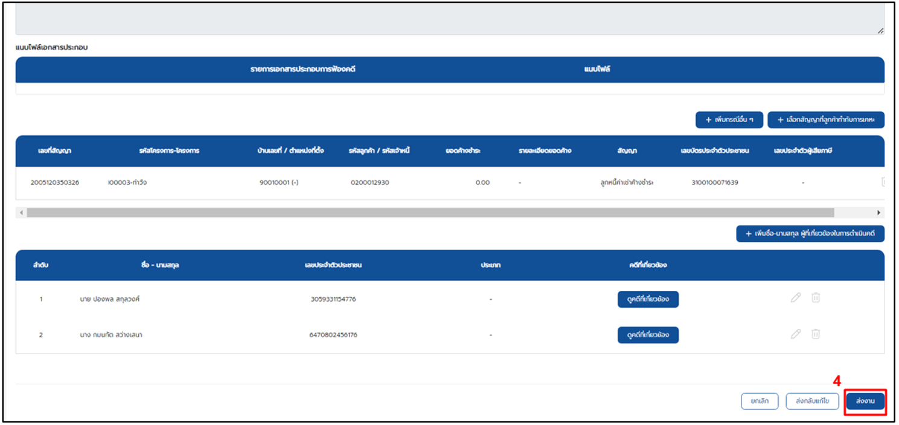<figcaption>
<strong>รูปภาพที่ 79</strong> หน้าจอรับเรื่องแก้ไข คดีพิเศษ หน่วยงานกฎหมาย : ฝ่าย
</figcaption></figure>

4. กดปุ่ม “ส่งงาน”

<figure>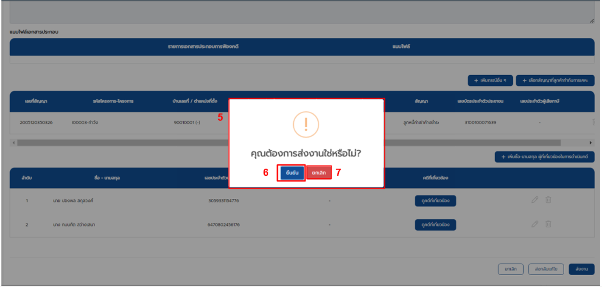<figcaption>
<strong>รูปภาพที่ 80</strong> หน้าจอ Pop-up ยืนยันการส่งกลับแก้ไข
</figcaption></figure>

5. ระบบแสดง Pop-up ยืนยันการส่งงาน
6. กดปุ่ม “ยืนยัน”
7. ไม่บันทึกข้อมูล กดปุ่ม “ยกเลิก”

<figure><figcaption>
<strong>รูปภาพที่ 81</strong> หน้าจอ Pop-up ยืนยันการส่งกลับแก้ไขสำเร็จ
</figcaption></figure>

8. ระบบจะแสดง Pop-up เพิ่มข้อมูลสำเร็จแล้ว
9. กดปุ่ม “ปิด”

### 1.15 ขั้นตอน หน่วยงานกฏหมาย : กอง รับเรื่อง ส่งงาน 

กองกฎหมายได้รับเรื่องจากกองต้นเรื่อง กองต้นเรื่องส่งกลับให้กองกฎหมาย

<figure>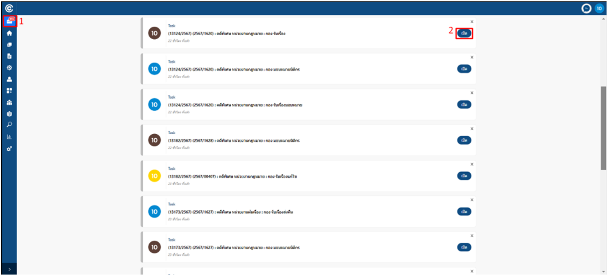<figcaption>
<strong>รูปภาพที่ 82</strong> หน้าจอแจ้งเตือนรับเรื่อง ส่งงานคดีพิเศษ หน่วยงานกฎหมาย : กอง
</figcaption></figure>

1. กดเลือกเมนู Action Center / Notification
2. กดที่ปุ่ม “เปิด” ที่คดีพิเศษ หน่วยงานกฎหมาย : กอง รับเรื่อง

<figure>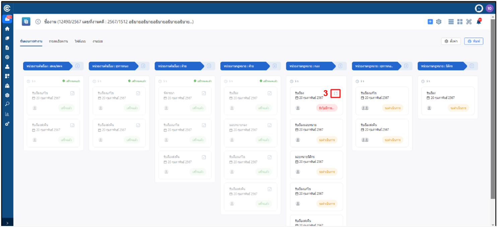<figcaption>
<strong>รูปภาพที่ 83</strong> หน่วยงานกฎหมาย : กอง ดำเนินการรับเรื่อง
</figcaption></figure>

3. กดที่ปุ่ม

<figure><figcaption></figcaption></figure>

ที่ กล่องพิจารณา หน่วยงานกฎหมาย : กอง รับเรื่อง

<figure>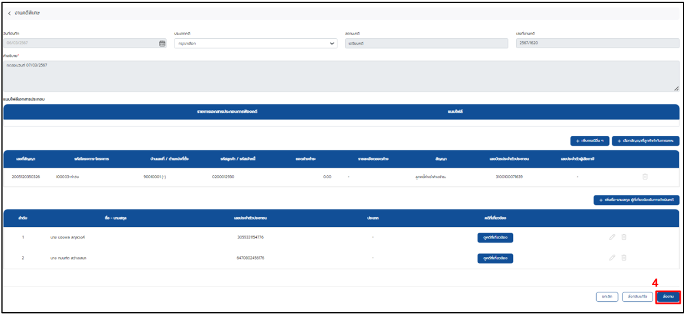<figcaption>
<strong>รูปภาพที่ 84</strong> หน้าจอรับเรื่อง คดีพิเศษ หน่วยงานกฎหมาย : กอง
</figcaption></figure>

4. กดปุ่ม “ส่งงาน”

<figure>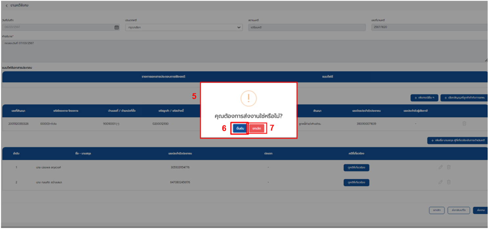<figcaption>
<strong>รูปภาพที่ 85</strong> หน้าจอ Pop-up ยืนยันการส่งกลับแก้ไข
</figcaption></figure>

5. ระบบแสดง Pop-up ยืนยันการส่งงาน
6. กดปุ่ม “ยืนยัน”
7. ไม่บันทึกข้อมูล กดปุ่ม “ยกเลิก”

<figure><figcaption>
<strong>รูปภาพที่ 86</strong> หน้าจอ Pop-up ยืนยันการส่งกลับแก้ไขสำเร็จ
</figcaption></figure>

8. ระบบจะแสดง Pop-up เพิ่มข้อมูลสำเร็จแล้ว
9. กดปุ่ม “ปิด”

### 1.16 ขั้นตอน หน่วยงานกฎหมาย : กอง รับเรื่องส่งมอบหมาย ส่งงาน 

ฝ่ายกฎหมายส่งเรื่องมายังกองกฎหมาย แล้วกองกฎหมายเลือกหน่วยงานของกองกฎหมาย

<figure>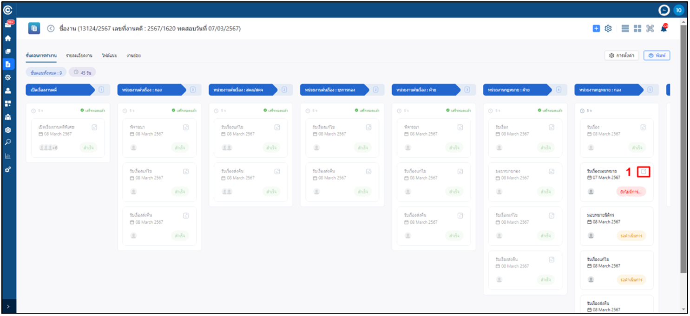<figcaption>
<strong>รูปภาพที่ 87</strong> หน้าจอแจ้งเตือนรับเรื่องส่งมอบหมาย ส่งงานคดีพิเศษ หน่วยงานกฎหมาย : กอง
</figcaption></figure>

1. กดที่ปุ่ม

<figure><figcaption></figcaption></figure>

ที่ กล่องพิจารณา หน่วยงานกฎหมาย : กอง รับเรื่องส่งมอบหมาย

<figure>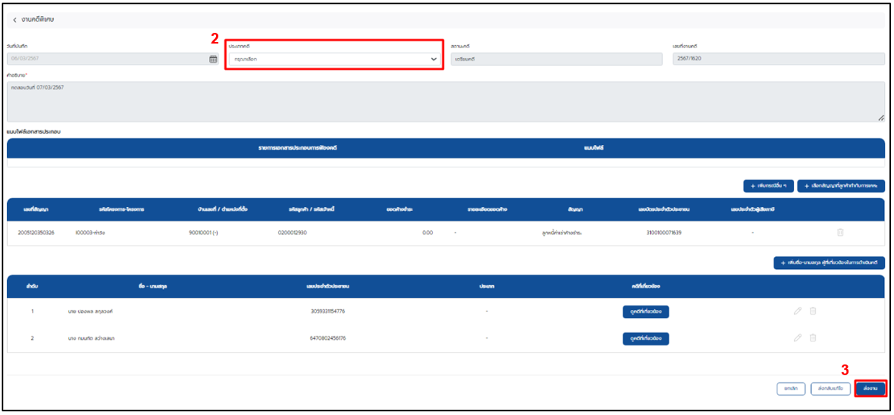<figcaption>
<strong>รูปภาพที่ 88</strong> หน้าจอมอบหมายงาน คดีพิเศษ หน่วยงานกฎหมาย : กอง
</figcaption></figure>

2. เลือก drop down “ประเภทคดี” ให้เป็น “คดีล้มละลาย”
3. กดปุ่ม “ส่งงาน”

<figure>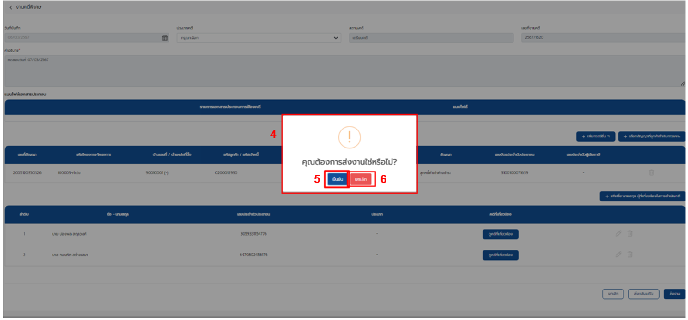<figcaption>
<strong>รูปภาพที่ 89</strong> หน้าจอ Pop-up ยืนยันการส่งกลับแก้ไข
</figcaption></figure>

4. ระบบแสดง Pop-up ยืนยันการส่งงาน
5. กดปุ่ม “ยืนยัน”
6. ไม่บันทึกข้อมูล กดปุ่ม “ยกเลิก”

<figure>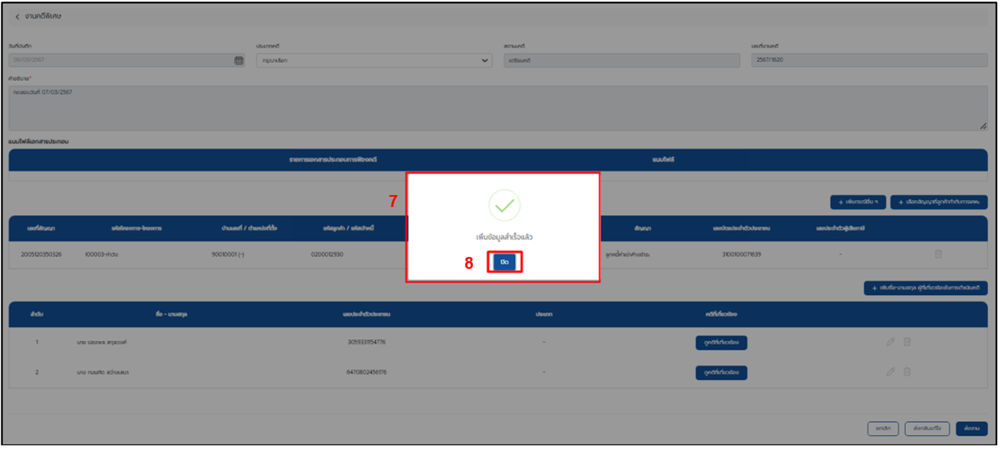<figcaption>
<strong>รูปภาพที่ 90</strong> หน้าจอ Pop-up ยืนยันการส่งกลับแก้ไขสำเร็จ
</figcaption></figure>

7. ระบบจะแสดง Pop-up เพิ่มข้อมูลสำเร็จแล้ว
8. กดปุ่ม “ปิด”

### 1.17 ขั้นตอน หน่วยงานกฏหมาย : กอง มอบหมายนิติกร ส่งงาน 

หน่วยงานกฎหมายเลือกนิติกร

<figure>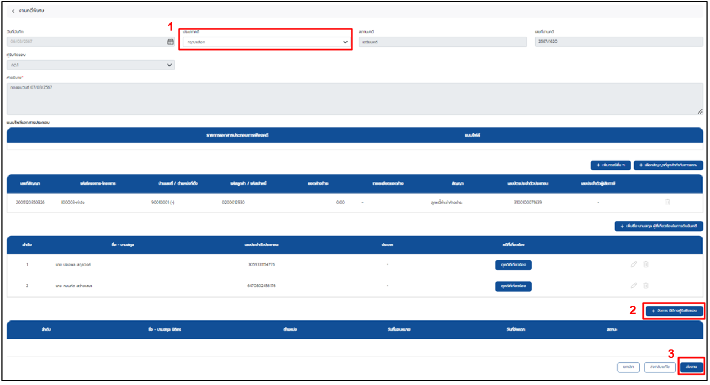<figcaption>
<strong>รูปภาพที่ 91</strong> หน้าจอมอบหมายนิติกร คดีพิเศษ หน่วยงานกฎหมาย : กอง
</figcaption></figure>

1. เลือก drop down “ประเภทคดี” ให้เป็น “คดีล้มละลาย”
2. เลือกปุ่ม “+ จัดการ นิติกรผู้รับผิดชอบ”

<figure>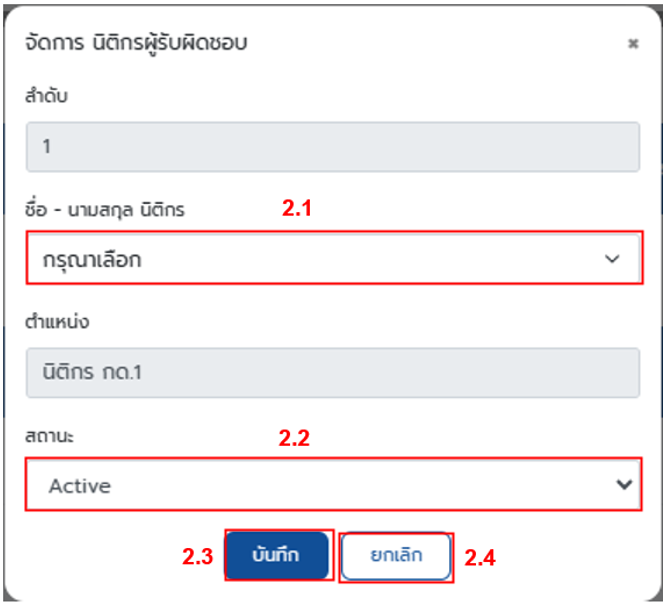<figcaption>
<strong>รูปภาพที่ 92</strong> หน้าจอ Pop-up จัดการ นิติกรผู้รับผิดชอบ
</figcaption></figure>

2.1 กรอกข้อมูล“ชื่อ – นามสกุล นิติกร”

2.2 กรอกข้อมูล“สถานะ”

2.3 ข้อมูลเรียบร้อย กดปุ่ม “บันทึก”

2.4 ไม่บันทึกข้อมูล กดปุ่ม “ยกเลิก”

3. กดปุ่ม “ส่งงาน”

<figure>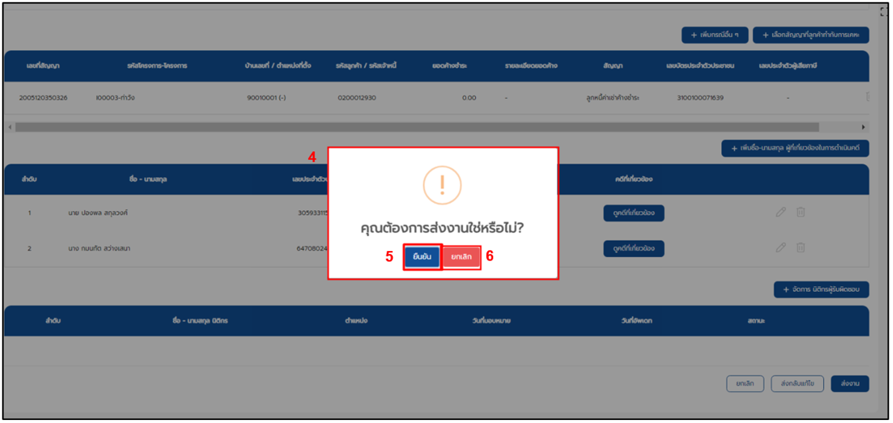<figcaption>
<strong>รูปภาพที่ 93</strong> หน้าจอ Pop-up ยืนยันการส่งงาน
</figcaption></figure>

4. ระบบแสดง Pop-up ยืนยันการส่งงาน
5. กดปุ่ม “ยืนยัน”
6. ไม่บันทึกข้อมูล กดปุ่ม “ยกเลิก”

<figure>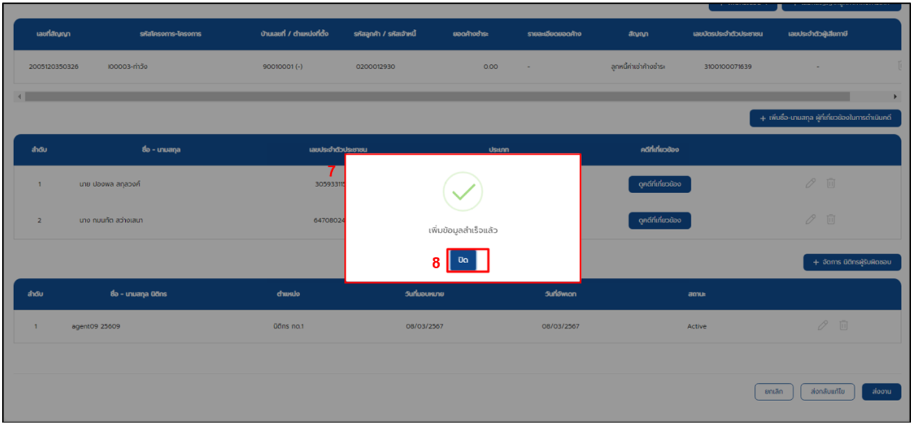<figcaption>
<strong>รูปภาพที่ 94</strong> หน้าจอ Pop-up ยืนยันการเพิ่มข้อมูลสำเร็จ
</figcaption></figure>

7. ระบบจะแสดง Pop-up เพิ่มข้อมูลสำเร็จแล้ว
8. กดปุ่ม “ปิด”

### 1.18 ขั้นตอน นิติกรรับเรื่อง ส่งกลับแก้ไข 

นิติกรส่งให้กับหัวหน้ากองกฎหมาย

<figure>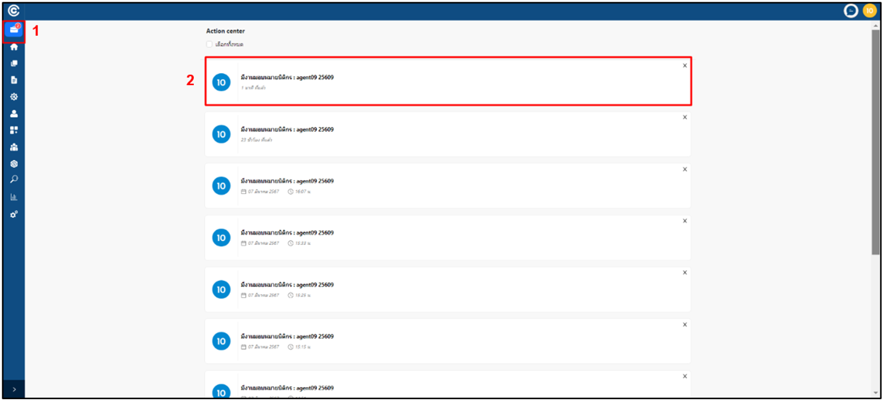<figcaption>
<strong>รูปภาพที่ 95</strong> หน้าจอแจ้งเตือนมอบหมายนิติกร
</figcaption></figure>

1. กดเลือกเมนู Action Center / Notification
2. กดที่กล่องแจ้งเตือนงานมอบหมายนิติกร

<figure>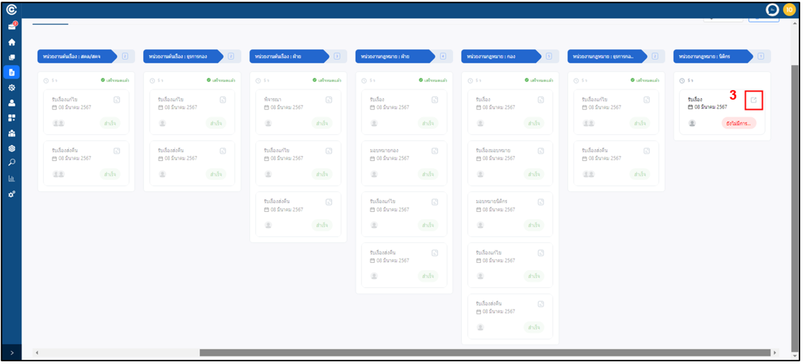<figcaption>
<strong>รูปภาพที่ 96</strong> นิติกรดำเนินการรับเรื่อง
</figcaption></figure>

3. กดที่ปุ่ม

<figure><figcaption></figcaption></figure>

ที่ กล่องพิจารณา นิติกร รับเรื่องส่งกลับแก้ไข

<figure>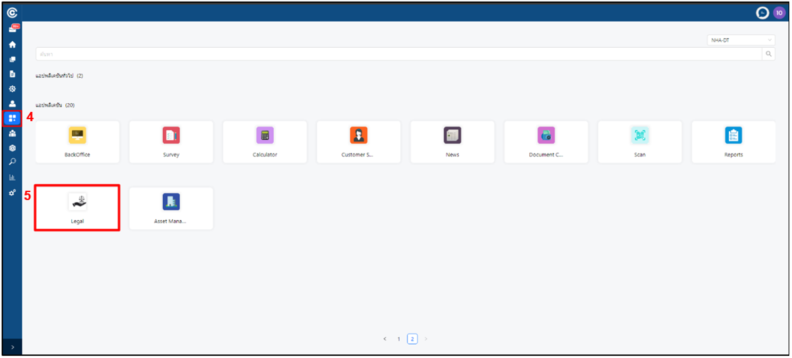<figcaption>
<strong>รูปภาพที่ 97</strong> เมนู Legal
</figcaption></figure>

4. กดที่เมนู แอปพลิเคชันของฉัน
5. กดที่เมนู Legal

<figure>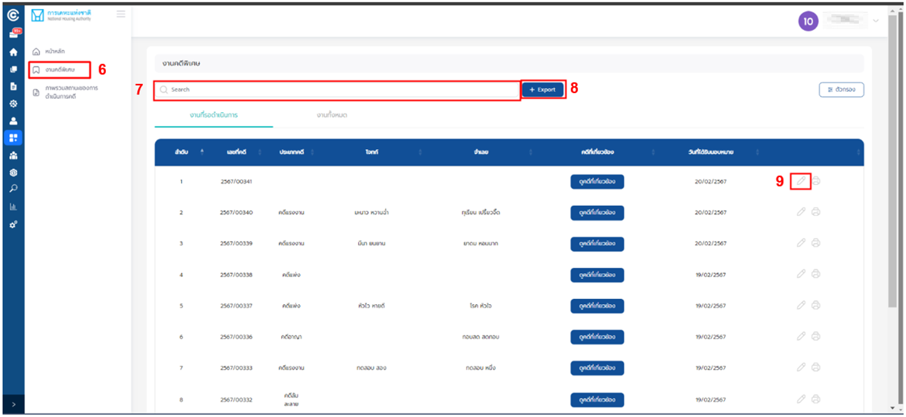<figcaption>
<strong>รูปภาพที่ 98</strong> หน้าจองานคดีพิเศษนิติกร
</figcaption></figure>

6. กดที่เมนู “งานคดิเศษ”
7. กรอกคำค้นหาในช่อง Search
8. ปุ่ม “+ Export”

<figure>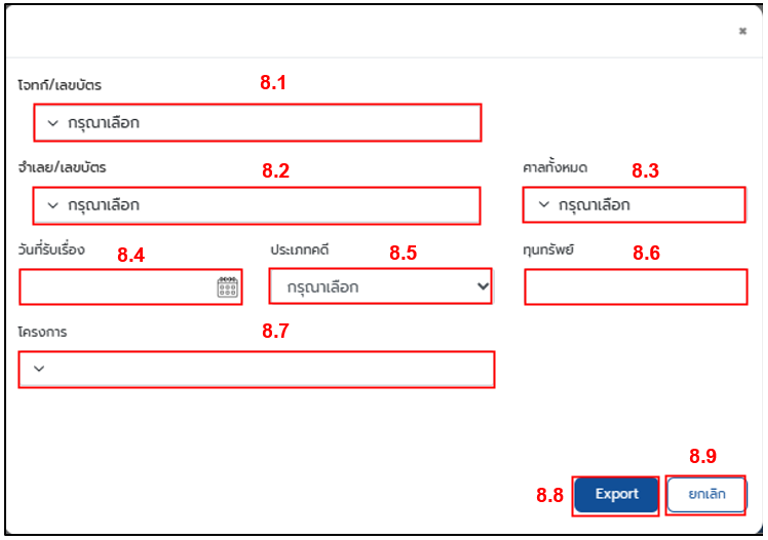<figcaption>
<strong>รูปภาพที่ 99</strong> หน้าจอ Pop-up “+ Export”
</figcaption></figure>

8.1 กรอกข้อมูล“โจทก์/เลขบัตร”

8.2 กรอกข้อมูล“จำเลย/เลขบัตร”

8.3 กรอกข้อมูล“ศาลทั้งหมด”

8.4 กรอกข้อมูล“วันที่รับเรื่อง”

8.5 กรอกข้อมูล“ประเภทคดี”

8.6 กรอกข้อมูล“ทุนทรัพย์”

8.7 กรอกข้อมูล“โครงการ”

8.8 ข้อมูลเรียบร้อย กดปุ่ม “Export”

8.9 ไม่บันทึกข้อมูล กดปุ่ม “ยกเลิก”

9. กดที่ปุ่มแก้ไข ท้ายรายการคดีพิเศษที่ต้องการ

<figure>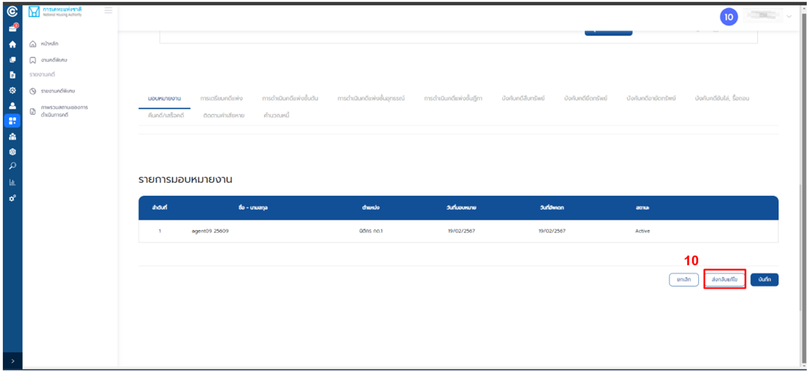<figcaption>
<strong>รูปภาพที่ 100</strong> หน้าจอแก้ไขงานคดีพิเศษนิติกร
</figcaption></figure>

10. กดที่ปุ่ม “ส่งกลับแก้ไข”

<figure>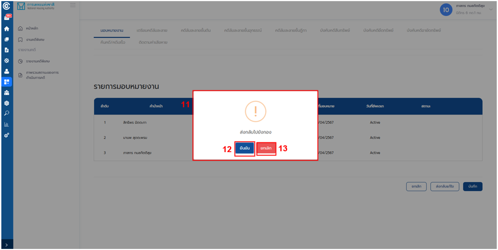<figcaption>
<strong>รูปภาพที่ 101</strong> หน้าจอ Pop-up ยืนยันการส่งกลับแก้ไข
</figcaption></figure>

11. ระบบแสดง Pop-up ยืนยันการส่งกลับแก้ไข
12. กดปุ่ม “ยืนยัน”
13. ไม่บันทึกข้อมูล กดปุ่ม “ยกเลิก”

<figure>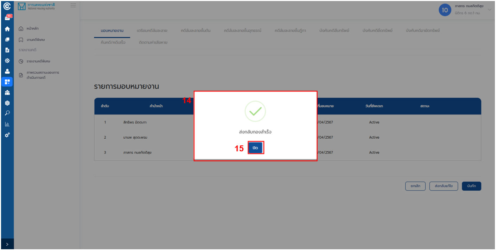<figcaption>
<strong>รูปภาพที่ 102</strong> หน้าจอ Pop-up ยืนยันการส่งกลับแก้ไขสำเร็จ
</figcaption></figure>

14. ระบบจะแสดง Pop-up ส่งกลับแก้ไขสำเร็จ
15. กดปุ่ม “ปิด”

### 1.19 ขั้นตอน หน่วยงานกฎหมาย : กอง รับเรื่องแก้ไข 

กองกฎหมายแก้ไข แล้วส่งกลับให้นิติกร

<figure>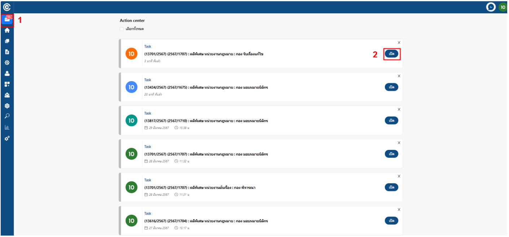<figcaption>
<strong>รูปภาพที่ 103</strong> หน้าจอแจ้งเตือนรับเรื่องแก้ไข ส่งงาน คดีพิเศษ หน่วยงานกฎหมาย : กอง
</figcaption></figure>

1. กดเลือกเมนู Action Center / Notification
2. กดที่ปุ่ม “เปิด” ที่คดีพิเศษ หน่วยงานกฎหมาย : กอง รับเรื่องแก้ไข

<figure>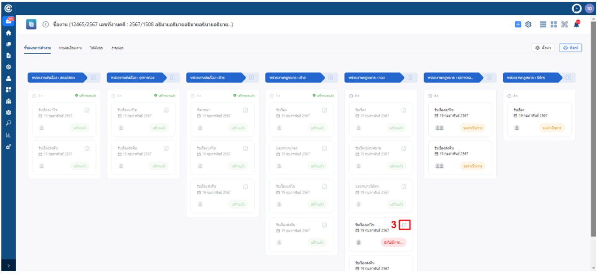<figcaption>
<strong>รูปภาพที่ 104</strong> หน่วยงานกฎหมาย : กอง ดำเนินการรับเรื่องแก้ไข
</figcaption></figure>

3. กดที่ปุ่ม

<figure><figcaption></figcaption></figure>

ที่ กล่องพิจารณา หน่วยงานกฎหมาย : กอง รับเรื่องแก้ไข

<figure>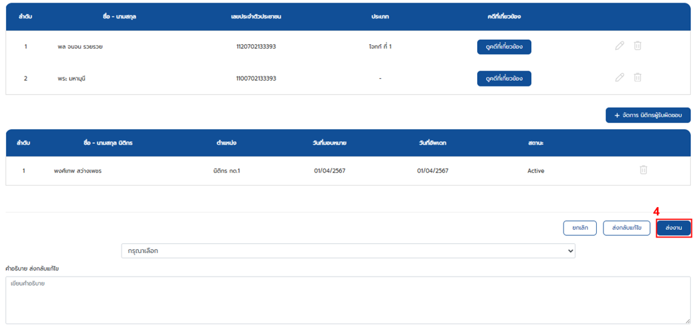<figcaption>
<strong>รูปภาพที่ 105</strong> หน้าจอพิจารณาคดีพิเศษ หน่วยงานต้นเรื่อง : กอง
</figcaption></figure>

4. กดที่ปุ่ม “ส่งงาน”

<figure>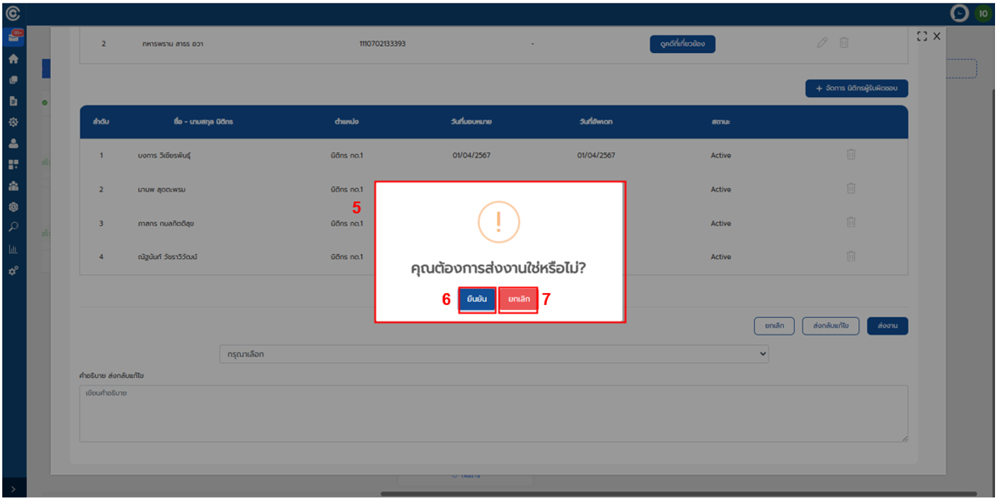<figcaption>
<strong>รูปภาพที่ 106</strong> หน้าจอ Pop-up ยืนยันการส่งกลับแก้ไข
</figcaption></figure>

5. ระบบจะแสดง Pop-up ยืนยันการส่งงาน
6. กดปุ่ม “ยืนยัน”
7. ไม่บันทึกข้อมูล กดปุ่ม “ยกเลิก”

<figure>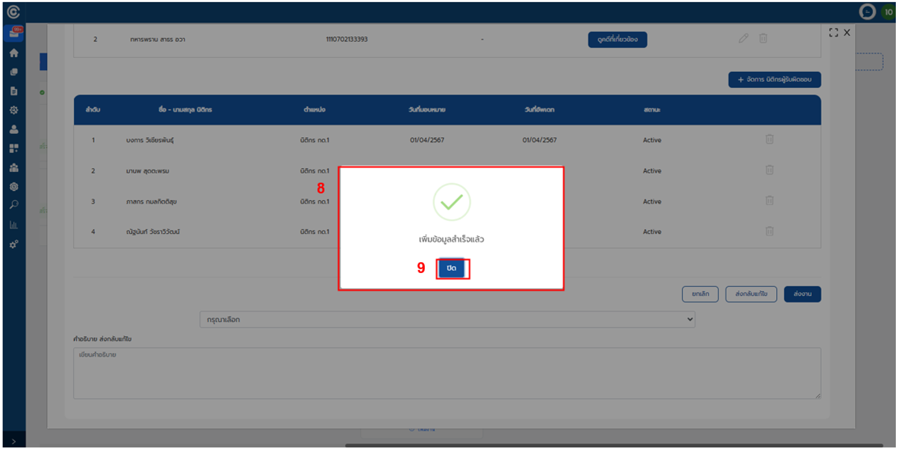<figcaption>
<strong>รูปภาพที่ 107</strong> หน้าจอ Pop-up ยืนยันการส่งกลับแก้ไขสำเร็จ
</figcaption></figure>

8. ระบบจะแสดง Pop-up เพิ่มข้อมูลสำเร็จแล้ว
9. กดปุ่ม “ปิด”

## 2. งานคดีพิเศษ คดีปกครอง 

<figure>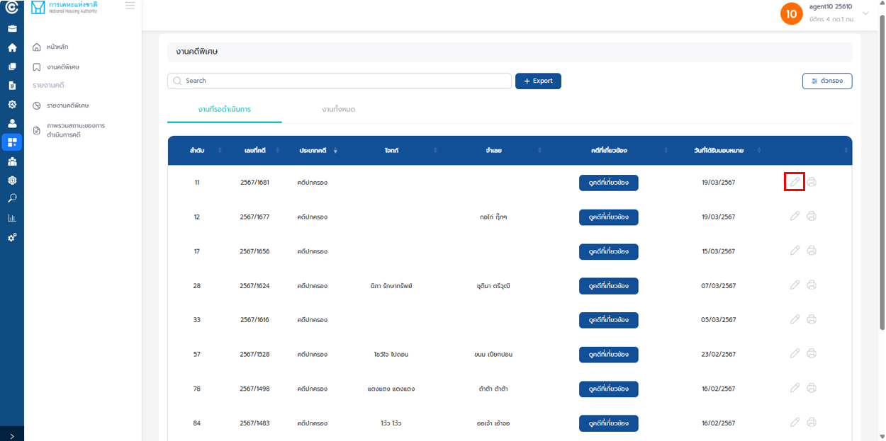<figcaption>
<strong>รูปภาพที่ 108</strong> หน้าจองานคดีพิเศษ
</figcaption></figure>

กดที่ปุ่ม (ไอคอน แก้ไข)

<figure><figcaption></figcaption></figure>

ท้ายรายการคดีพิเศษที่ต้องการ

1. เลือก drop down สถานะเอกสาร
2. กดเพิ่มกรณีอื่นๆ “+ เพิ่มกรณีอื่น ๆ”

<figure><figcaption>
<strong>รูปภาพที่ 110 หน้าจอ Pop-up เพิ่มกรณีอื่นๆ</strong>
</figcaption></figure>

2.1 กรอกข้อมูล “เลขที่สัญญา”

2.2 กรอกข้อมูล “รหัสโครงการ - โครงการ”

2.3 กรอกข้อมูล “บ้านเลขที่ / ตำแหน่งที่ตั้ง”

2.4 กรอกข้อมูล “รหัสเจ้าหนี้”

2.5 กรอกข้อมูล “ค่าเสียหาย”

2.6 กรอกข้อมูล “รายละเอียดค่าเสียหาย

2.7 กรอกข้อมูล “ชื่อสัญญา”

2.8 ข้อมูลเรียบร้อย กดปุ่ม “บันทึก”

2.9 ไม่บันทึกข้อมูล กดปุ่ม “ยกเลิก”

3. กดเพิ่มสัญญาที่ลูกค้าทำกับการเคหะ “+ เลือกสัญญาที่ลูกค้าทำกับการเคหะ”

<figure>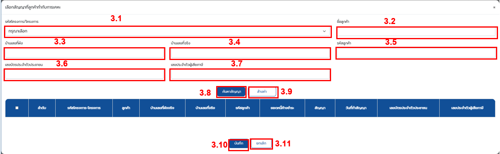<figcaption>
<strong>รูปภาพที่ 111</strong> หน้าจอ Pop-up เพิ่มสัญญาที่ลูกค้าทำกับการเคหะ
</figcaption></figure>

1.1 กรอกข้อมูล“รหัสโครงการ/โครงการ”

3.2 กรอกข้อมูล “ชื่อลูกค้า”

3.3 กรอกข้อมูล “บ้านเลขที่ผัง”

3.4 กรอกข้อมูล “บ้านเลขที่จริง”

3.5 กรอกข้อมูล “รหัสลูกค้า”

3.6 กรอกข้อมูล “เลขบัตรประจำตัวประชาชน”

3.7 กรอกข้อมูล “เลขประจำตัวผู้เสียภาษี”

3.8 กรอกข้อมูลเรียบร้อย กดปุ่ม “ค้นหาสัญญา”

3.9 ยกเลิกข้อมูล กดปุ่ม “ล้างค่า”

3.10 ข้อมูลเรียบร้อย กดปุ่ม “บันทึก”

3.11 ไม่บันทึกข้อมูล กดปุ่ม “ยกเลิก”

4. กดเพิ่มชื่อ-นามสกุล ผู้ที่เกี่ยวข้องในการดำเนินคดี “+ เพิ่มชื่อ-นามสกุล ผู้ที่เกี่ยวข้องในการดำเนินคดี”

<figure><figcaption>
<strong>รูปภาพที่ 112 หน้าจอ Pop-up เพิ่มชื่อ-นามสกุล ผู้ที่เกี่ยวข้องในการดำเนินคดี</strong>
</figcaption></figure>

4.1 กรอกข้อมูล “คำนำหน้า”

4.2 กรอกข้อมูล “ชื่อผู้เกี่ยวข้อง / ชื่อบริษัท”

4.3 กรอกข้อมูล “นามสกุล”

4.4 กรอกข้อมูล “ประเภท”

4.5 ข้อมูลเรียบร้อย กดปุ่ม “บันทึก”

4.6 ไม่บันทึกข้อมูล กดปุ่ม “ยกเลิก”

### 2.1 มอบหมายงาน 

ระบบจะแสดงข้อมูลนิติกรที่ได้รับมอบหมายงาน

1. เลือกที่เมนู “มอบหมายงาน”
2. ไม่บันทึกข้อมูล กดปุ่ม “ยกเลิก”
3. ส่งกลับไปยังผู้ส่ง กดปุ่ม “ส่งกลับแก้ไข”
4. ข้อมูลเรียบร้อย กดปุ่ม “บันทึก”

### 2.2 การเตรียมคดีปกครอง 

บันทึกข้อมูลการเตรียมคดีปกครอง เพื่อดำเนินคดี

<figure><figcaption>
<strong>รูปภาพที่ 114</strong> หน้าจอแสดงการเตรียมคดีปกครอง
</figcaption></figure>

1. เลือกที่เมนู “การเตรียมคดีปกครอง”
2. กรอกข้อมูล “ประเภททรัพย์”
3. กรอกข้อมูล “ฐานความผิด”
4. ฟิลด์ “หนี้ในระบบ (บาท)” คำนวณมาจาก เมนู “คำนวณหนี้”
5. กรอกข้อมูล “ค่าเสียหาย (บาท)”
6. กดปุ่ม “+ เพิ่มวันขอเอกสารเพิ่มเติม”

<figure><figcaption>
<strong>รูปภาพที่ 115 หน้าจอ Pop-up เพิ่มวันขอเอกสารเพิ่มเติม</strong>
</figcaption></figure>

6.1 กรอกข้อมูล “วันขอเอกสารเพิ่มเติม”

6.2 กรอกข้อมูล “วันที่ได้รับเอกสารเพิ่มเติม”

6.3 กรอกข้อมูล “สถานะเอกสาร”

6.4 กรอกข้อมูล “หมายเหตุ”

6.5 ข้อมูลเรียบร้อย กดปุ่ม “บันทึก”

6.6 ไม่บันทึกข้อมูล กดปุ่ม “ยกเลิก”

7. กรอกข้อมูล “สำนักงานอัยการผู้รับผิดชอบ”
8. กรอกข้อมูล “วันส่งเรื่องพนักงานอัยการ”
9. กดปุ่ม “+ เพิ่มวันพนักงานอัยการสอบข้อเท็จจริง”

<figure><figcaption>
<strong>รูปภาพที่ 116 หน้าจอ Pop-up เพิ่มวันที่พนักงานอัยการสอบข้อเท็จจริง</strong>
</figcaption></figure>

9.1 กรอกข้อมูล “วันที่พนักงานอัยการนัดสอบข้อเท็จจริง”

9.2 กรอกข้อมูล “หมายเหตุ”

9.3 ข้อมูลเรียบร้อย กดปุ่ม “บันทึก”

9.4 ไม่บันทึกข้อมูล กดปุ่ม “ยกเลิก”

10. กดปุ่ม “+ เพิ่มวันส่งเอกสารเพิ่มเติมต่อพนักงานอัยการ”

<figure><figcaption>
<strong>รูปภาพที่ 117 หน้าจอ Pop-up เพิ่มวันที่ส่งเอกสารเพิ่มเติมต่อพนักงานอัยการ</strong>
</figcaption></figure>

10.1 กรอกข้อมูล “วันที่ส่งเอกสารเพิ่มเติมต่อพนักงานอัยการ”

10.2 กรอกข้อมูล “สถานะเอกสาร”

10.3 กรอกข้อมูล “หมายเหตุ”

10.4 ข้อมูลเรียบร้อย กดปุ่ม “บันทึก”

10.5 ไม่บันทึกข้อมูล กดปุ่ม “ยกเลิก”

<figure><figcaption>
<strong>รูปภาพที่ 118 หน้าจอบังคับคดีสืบทรัพย์ (1)</strong>
</figcaption></figure>

11. กรอกข้อมูลชื่อไฟล์เอกสารประกอบการฟ้องคดี
12. แนบไฟล์ กดปุ่ม “เพิ่มไฟล์”
13. บันทึกแนบไฟล์ กด (ไอคอน เครื่องหมายถูก)

<figure><figcaption></figcaption></figure>

14. กรอกข้อมูล“หมายเหตุ”
15. ไม่บันทึกข้อมูล กดปุ่ม “ยกเลิก”
16. ข้อมูลเรียบร้อย กดปุ่ม “บันทึก”

### 2.3 การดำเนินคดีปกครองชั้นต้น 

บันทึกข้อมูลการดำเนินคดีปกครองชั้นต้น

1. เลือกที่เมนู “การดำเนินคดีปกครองชั้นต้น”
2. กรอกข้อมูล “วันยื่นฟ้อง”
3. กรอกข้อมูล “ศาล”
4. กรอกข้อมูล “หมายเลขคดีดำ”
5. กรอกข้อมูล “ทุนทรัพย์ (บาท)”
6. กดปุ่ม “+ เพิ่มวันยื่นคำให้การ”

<figure><figcaption>
<strong>รูปภาพที่ 120 หน้าจอ Pop-up เพิ่มวันยื่นคำให้การ</strong>
</figcaption></figure>

6.1 กรอกข้อมูล “วันยื่นคำให้การ”

6.2 กรอกข้อมูล “หมายเหตุ”

6.3 ข้อมูลเรียบร้อย กดปุ่ม “บันทึก”

6.4 ไม่บันทึกข้อมูล กดปุ่ม “ยกเลิก”

7. กรอกข้อมูล “วันสิ้นสุดแสวงหาข้อเท็จจริง”
8. กดปุ่ม “+ เพิ่มรายการวันนั่งพิจารณาคดีครั้งแรก”

<figure><figcaption>
<strong>รูปภาพที่ 121 หน้าจอ Pop-up เพิ่มรายการวันนั่งพิจารณาคดีครั้งแรก</strong>
</figcaption></figure>

8.1 กรอกข้อมูล “วันนั่งพิจารณาคดีครั้งแรก”

8.2 กรอกข้อมูล “หมายเหตุ”

8.3 ข้อมูลเรียบร้อย กดปุ่ม “บันทึก”

8.4 ไม่บันทึกข้อมูล กดปุ่ม “ยกเลิก”

9. กรอกข้อมูล “วันฟังคำพิพากษา”
10. กรอกข้อมูล “หมายเลขคดีแดง”
11. กรอกข้อมูล “คำพิพากษาโดยย่อ”
12. กรอกข้อมูล “หนี้ตามคำพิพากษา (บาท)”
13. กรอกข้อมูล “วันขอส่งคำบังคับ”

14. กดปุ่ม “+ เพิ่มรายการส่งคำบังคับ”

<figure><figcaption>
<strong>รูปภาพที่ 123 หน้าจอ Pop-up เพิ่มรายการส่งคำบังคับ</strong>
</figcaption></figure>

14.1 กรอกข้อมูล “ชื่อ-นามสกุล”

14.2 กรอกข้อมูล “วันส่งคำบังคับ”

14.3 กรอกข้อมูล “ส่งคำบังคับโดย”

14.4 ข้อมูลเรียบร้อย กดปุ่ม “บันทึก”

14.5 ไม่บันทึกข้อมูล กดปุ่ม “ยกเลิก”

15. กดปุ่ม “+ เพิ่มรายการคำร้อง”

<figure><figcaption>
<strong>รูปภาพที่ 124 หน้าจอ Pop-up เพิ่มรายการคำร้อง</strong>
</figcaption></figure>

15.1 กรอกข้อมูล “ชื่อ - นามสกุล”

15.2 กรอกข้อมูล “วันยื่นคำร้อง”

15.3 กรอกข้อมูล “ประเภทคำร้อง”

15.4 กรอกข้อมูล “วันที่ยื่นคำคัดค้าน”

15.5 กรอกข้อมูล “วันนัดไต่สวนคำร้อง”

15.6 กรอกข้อมูล “วันฟังคำสั่งศาล”

15.7 กรอกข้อมูล “คำสั่งศาลโดยย่อ”

15.8 กรอกข้อมูล “หมายเหตุ”

15.9 ข้อมูลเรียบร้อย กดปุ่ม “บันทึก”

15.10 ไม่บันทึกข้อมูล กดปุ่ม “ยกเลิก”

16. กรอกข้อมูลชื่อไฟล์เอกสารประกอบการฟ้องคดี
17. แนบไฟล์ กดปุ่ม “เพิ่มไฟล์”
18. บันทึกแนบไฟล์ กด (ไอคอน เครื่องหมายถูก)

<figure><figcaption></figcaption></figure>

19. กรอกข้อมูล “หมายเหตุ”
20. ไม่บันทึกข้อมูล กดปุ่ม “ยกเลิก”
21. ข้อมูลเรียบร้อย กดปุ่ม “บันทึก”

### 2.4 การดำเนินคดีปกครองชั้นสูงสุด 

บันทึกข้อมูลการดำเนินคดีปกครองชั้นสูงสุด

<figure><figcaption>
<strong>รูปภาพที่ 125 หน้าจอแสดงการดำเนินคดีปกครองชั้นอุทรณ์</strong>
</figcaption></figure>

1. เลือกที่เมนู“การดำเนินคดีปกครองชั้นสูงสุด”
2. กดปุ่ม “+ เพิ่มรายการยื่นอุทธรณ์”

<figure>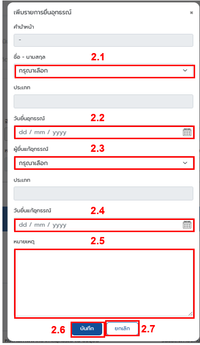<figcaption>
<strong>รูปภาพที่ 126</strong> หน้าจอ Pop-up เพิ่มรายการยื่นอุทธรณ์
</figcaption></figure>

2.1 กรอกข้อมูล “ชื่อ - นามสกุล”

2.2 กรอกข้อมูล “วันยื่นอุทธรณ์”

2.3 กรอกข้อมูล “ผู้ยื่นแก้อุทธรณ์”

2.4 กรอกข้อมูล “วันยื่นแก้อุทธรณ์”

2.5 กรอกข้อมูล “หมายเหตุ”

2.6 ข้อมูลเรียบร้อย กดปุ่ม “บันทึก”

2.7 ไม่บันทึกข้อมูล กดปุ่ม “ยกเลิก”

3. กรอกข้อมูล “วันฟังคำพิพากษาศาลปกครองสูงสุด”
4. กรอกข้อมูล “คำพิพากษาศาลปกครองสูงสุดโดยย่อ”
5. กรอกข้อมูล “หนี้ตามคำพิพากษาศาลปกครองสูงสุด”
6. กรอกข้อมูล “วันขอส่งคำบังคับ”

<figure>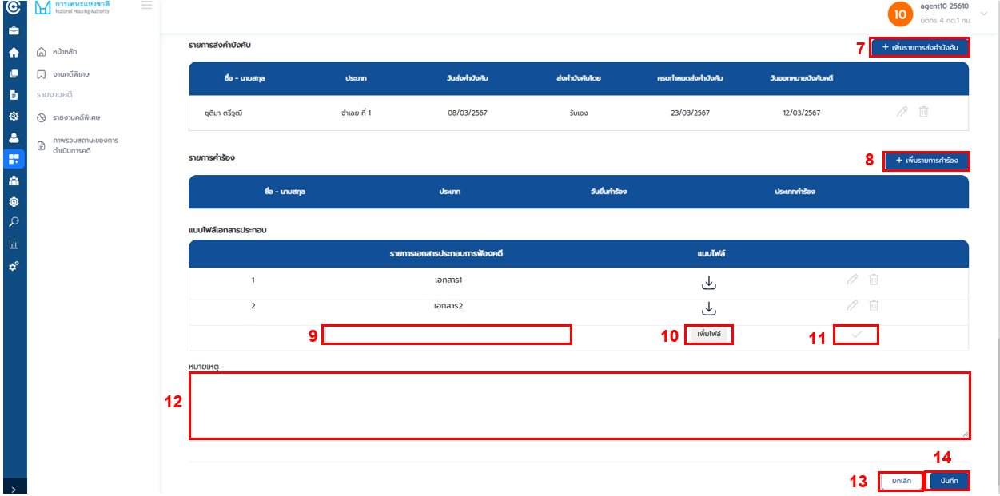<figcaption>
<strong>รูปภาพที่ 127</strong> หน้าจอแสดงการดำเนินคดีปกครองชั้นสูงสุด (1)
</figcaption></figure>

7. กดปุ่ม “+ เพิ่มรายการส่งคำบังคับ”

<figure>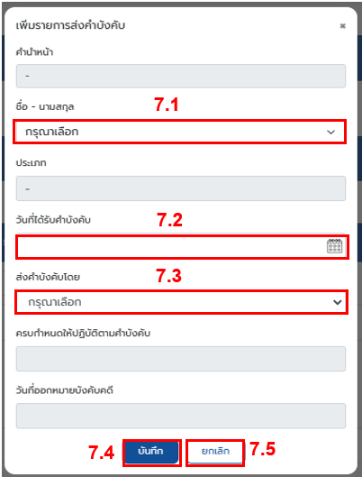<figcaption>
<strong>รูปภาพที่ 128</strong> หน้าจอ Pop-up เพิ่มรายการส่งคำบังคับ
</figcaption></figure>

7.1 กรอกข้อมูล “ผู้ยื่นแก้อุทธรณ์”

7.2 กรอกข้อมูล “วันยื่นแก้อุทธรณ์”

7.3 กรอกข้อมูล “หมายเหตุ”

7.4 ข้อมูลเรียบร้อย กดปุ่ม “บันทึก”

7.5 ไม่บันทึกข้อมูล กดปุ่ม “ยกเลิก”

8. กดปุ่ม “+ เพิ่มรายการคำร้อง”

<figure><figcaption>
<strong>รูปภาพที่ 129</strong> หน้าจอ Pop-up เพิ่มรายการคำร้อง
</figcaption></figure>

8.1 กรอกข้อมูล “ชื่อ - นามสกุล”

8.2 กรอกข้อมูล “วันยื่นคำร้อง”

8.3 กรอกข้อมูล “ประเภทคำร้อง”

8.4 กรอกข้อมูล “วันที่ยื่นคำคัดค้าน”

8.5 กรอกข้อมูล “วันนัดไต่สวนคำร้อง”

8.6 กรอกข้อมูล “วันฟังคำสั่งศาล”

8.7 กรอกข้อมูล “คำสั่งศาลโดยย่อ”

8.8 กรอกข้อมูล “หมายเหตุ”

8.9 ข้อมูลเรียบร้อย กดปุ่ม “บันทึก”

8.10 ไม่บันทึกข้อมูล กดปุ่ม “ยกเลิก”

9. กรอกข้อมูลชื่อไฟล์เอกสารประกอบการฟ้องคดี
10. แนบไฟล์ กดปุ่ม “เพิ่มไฟล์”
11. บันทึกแนบไฟล์ กด (ไอคอน เครื่องหมายถูก)

<figure><figcaption></figcaption></figure>

12. กรอกข้อมูล “หมายเหตุ”
13. ไม่บันทึกข้อมูล กดปุ่ม “ยกเลิก”
14. ข้อมูลเรียบร้อย กดปุ่ม “บันทึก”

### 2.5 บังคับคดีสืบทรัพย์ 

บันทึกข้อมูลบังคับคดีสืบทรัพย์

<figure><figcaption>
<strong>รูปภาพที่ 130</strong> หน้าจอบังคับคดีสืบทรัพย์
</figcaption></figure>

1. เลือกที่เมนู “บังคับคดีสืบทรัพย์”
2. กดปุ่ม “+ เพิ่มรายการสืบทรัพย์ (อสังหาริมทรัพย์)”

<figure>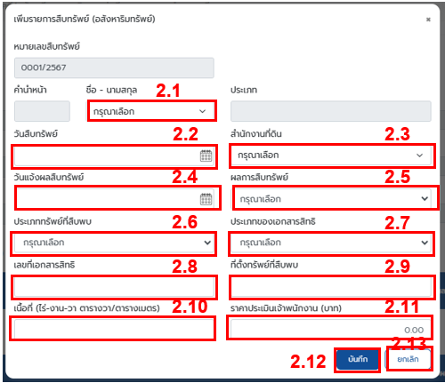<figcaption>
<strong>รูปภาพที่ 131</strong> หน้าจอ Pop-up เพิ่มรายการสืบทรัพย์ (อสังหาริมทรัพย์)
</figcaption></figure>

2.1 กรอกข้อมูล “ชื่อ - นามสกุล”

2.2 กรอกข้อมูล “วันสืบทรัพย์”

2.3 กรอกข้อมูล “สำนักงานที่ดิน”

2.4 กรอกข้อมูล “วันแจ้งผลสืบทรัพย์”

2.5 กรอกข้อมูล “ผลการสืบทรัพย์”

2.6 กรอกข้อมูล “ประเภททรัพย์ที่สืบพบ”

2.7 กรอกข้อมูล “ประเภทของเอกสารสิทธิ”

2.8 กรอกข้อมูล “เลขที่เอกสารสิทธิ”

2.9 กรอกข้อมูล “เลขที่เอกสารสิทธิ”

2.10 กรอกข้อมูล “ที่ตั้งทรัพย์ที่สืบพบ”

2.11 กรอกข้อมูล “เนื้อที่ (ไร่-งาน-วา ตารางวา/ตารางเมตร)”

2.12 ข้อมูลเรียบร้อย กดปุ่ม “บันทึก”

2.13 ไม่บันทึกข้อมูล กดปุ่ม “ยกเลิก”

3. กดปุ่ม “+ เพิ่มรายการสืบทรัพย์อื่น ๆ”

<figure>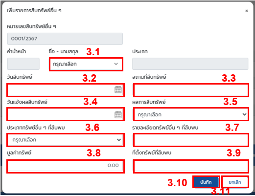<figcaption>
<strong>รูปภาพที่ 132</strong> หน้าจอ Pop-up เพิ่มรายการสืบทรัพย์อื่น ๆ
</figcaption></figure>

3.1 กรอกข้อมูล “ชื่อ - นามสกุล”

3.2 กรอกข้อมูล “วันสืบทรัพย์”

3.3 กรอกข้อมูล “สถานที่สืบทรัพย์”

3.4 กรอกข้อมูล “วันแจ้งผลสืบทรัพย์”

3.5 กรอกข้อมูล “ผลการสืบทรัพย์”

3.6 กรอกข้อมูล “ประเภททรัพย์อื่น ๆ ที่สืบพบ”

3.7 กรอกข้อมูล “รายละเอียดทรัพย์อื่น ๆ ที่สืบพบ”

3.8 กรอกข้อมูล “มูลค่าทรัพย์”

3.9 กรอกข้อมูล “ที่ตั้งทรัพย์ที่สืบพบ”

3.10 ข้อมูลเรียบร้อย กดปุ่ม “บันทึก”

3.11 ไม่บันทึกข้อมูล กดปุ่ม “ยกเลิก”

4. กดปุ่ม “+ เพิ่มรายการคำร้อง”

<figure>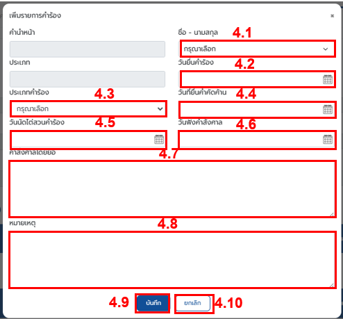<figcaption>
<strong>รูปภาพที่ 133</strong> หน้าจอ Pop-up เพิ่มรายการคำร้อง
</figcaption></figure>

4.1 กรอกข้อมูล “ชื่อ - นามสกุล”

4.2 กรอกข้อมูล “วันยื่นคำร้อง”

4.3 กรอกข้อมูล “ประเภทคำร้อง”

4.4 กรอกข้อมูล “วันที่ยื่นคำคัดค้าน”

4.5 กรอกข้อมูล “วันนัดไต่สวนคำร้อง”

4.6 กรอกข้อมูล “วันฟังคำสั่งศาล”

4.7 กรอกข้อมูล “คำสั่งศาลโดยย่อ”

4.8 กรอกข้อมูล “หมายเหตุ”

4.9 ข้อมูลเรียบร้อย กดปุ่ม “บันทึก”

4.10 ไม่บันทึกข้อมูล กดปุ่ม “ยกเลิก”

<figure>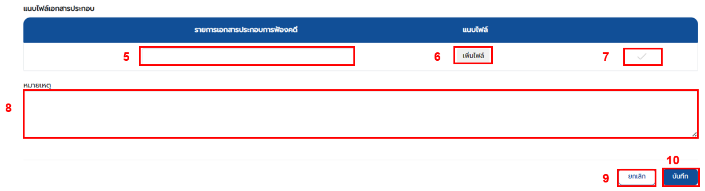<figcaption>
<strong>รูปภาพที่ 134</strong> หน้าจอบังคับคดีสืบทรัพย์ (1)
</figcaption></figure>

5. กรอกข้อมูลชื่อไฟล์เอกสารประกอบการฟ้องคดี
6. แนบไฟล์ กดปุ่ม “เพิ่มไฟล์”
7. บันทึกแนบไฟล์ กด (ไอคอน เครื่องหมายถูก)

<figure><figcaption></figcaption></figure>

8. กรอกข้อมูล“หมายเหตุ”
9. ไม่บันทึกข้อมูล กดปุ่ม “ยกเลิก”
10. ข้อมูลเรียบร้อย กดปุ่ม “บันทึก”

### 2.6 บังคับคดียึดทรัพย์ 

บันทึกข้อมูลบังคับคดียึดทรัพย์ โดยทรัพย์จะต้องเป็นอสังหาริมทรัพย์

<figure>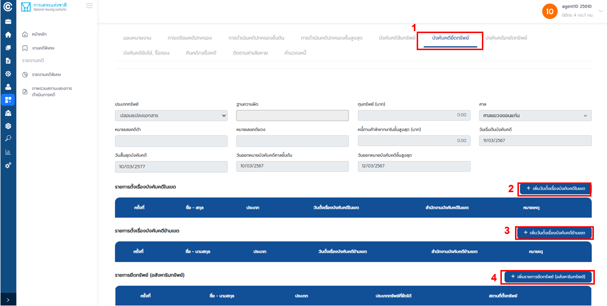<figcaption>
<strong>รูปภาพที่ 135</strong> หน้าจอบังคับคดียึดทรัพย์
</figcaption></figure>

1. เลือกที่เมนู “บังคับคดีสืบทรัพย์”
2. กดปุ่ม “+ เพิ่มวันตั้งเรื่องบังคับคดีในเขต”

<figure>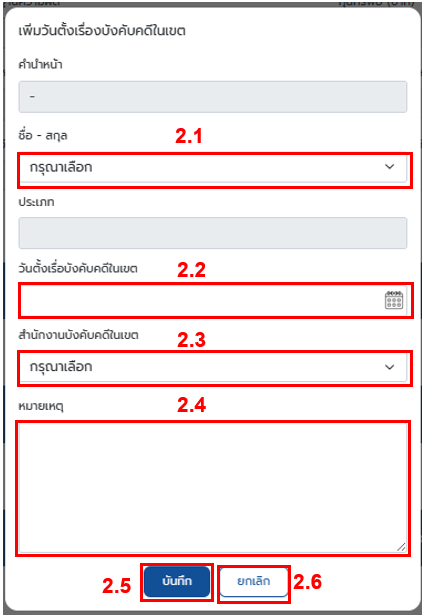<figcaption>
<strong>รูปภาพที่ 136</strong> หน้าจอ Pop-up เพิ่มวันตั้งเรื่องบังคับคดีในเขต
</figcaption></figure>

2.1 กรอกข้อมูล “ชื่อ - นามสกุล”

2.2 กรอกข้อมูล “วันตั้งเรื่อบังคับคดีในเขต”

2.3 กรอกข้อมูล “สำนักงานบังคับคดีในเขต”

2.4 กรอกข้อมูล “หมายเหตุ”

2.5 ข้อมูลเรียบร้อย กดปุ่ม “บันทึก”

2.6 ไม่บันทึกข้อมูล กดปุ่ม “ยกเลิก”

3. กดปุ่ม “+ เพิ่มวันตั้งเรื่องบังคับคดีข้ามเขต”

<figure>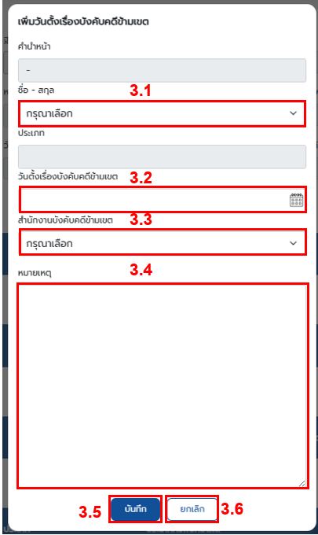<figcaption>
<strong>รูปภาพที่ 137</strong> หน้าจอ Pop-up เพิ่มวันตั้งเรื่องบังคับคดีข้ามเขต
</figcaption></figure>

3.1 กรอกข้อมูล “ชื่อ - นามสกุล”

3.2 กรอกข้อมูล “วันตั้งเรื่อบังคับคดีข้ามเขต”

3.3 กรอกข้อมูล “สำนักงานบังคับคดีข้ามเขต”

3.4 กรอกข้อมูล “หมายเหตุ”

3.5 ข้อมูลเรียบร้อย กดปุ่ม “บันทึก”

3.6 ไม่บันทึกข้อมูล กดปุ่ม “ยกเลิก”

4. กดปุ่ม “+ เพิ่มรายการยึดทรัพย์ (อสังหาริมทรัพย์)”

<figure>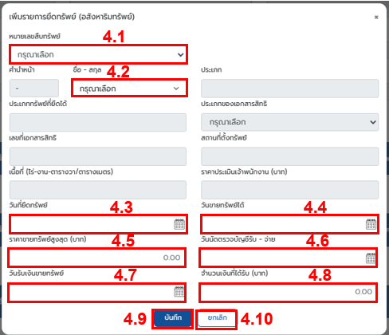<figcaption>
<strong>รูปภาพที่ 138</strong> หน้าจอ Pop-up เพิ่มรายการยึดทรัพย์ (อสังหาริมทรัพย์)
</figcaption></figure>

4.1 กรอกข้อมูล “หมายเลขสืบทรัพย์”

4.2 กรอกข้อมูล “ชื่อ - นามสกุล”

4.3 กรอกข้อมูล “วันที่ยึดทรัพย์”

4.4 กรอกข้อมูล “วันขายทรัพย์ได้”

4.5 กรอกข้อมูล “ราคาขายทรัพย์สูงสุด (บาท)”

4.6 กรอกข้อมูล “วันนัดตรวจบัญชีรับ - จ่าย”

4.7 กรอกข้อมูล “วันรับเงินขายทรัพย์”

4.8 กรอกข้อมูล “จำนวนเงินที่ได้รับ (บาท)”

4.9 ข้อมูลเรียบร้อย กดปุ่ม “บันทึก”

4.10 ไม่บันทึกข้อมูล กดปุ่ม “ยกเลิก”

<figure>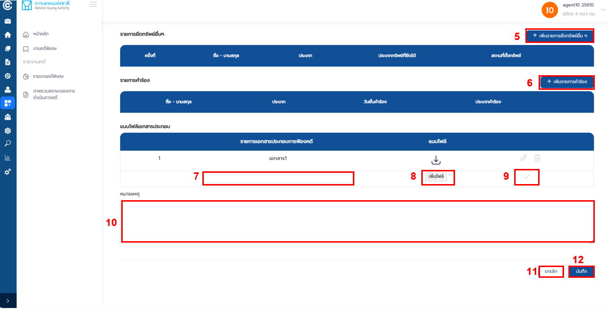<figcaption>
<strong>รูปภาพที่ 139</strong> หน้าจอบังคับคดียึดทรัพย์ (1)
</figcaption></figure>

5. กดปุ่ม “+ เพิ่มรายการยึดทรัพย์อื่น ๆ”

<figure>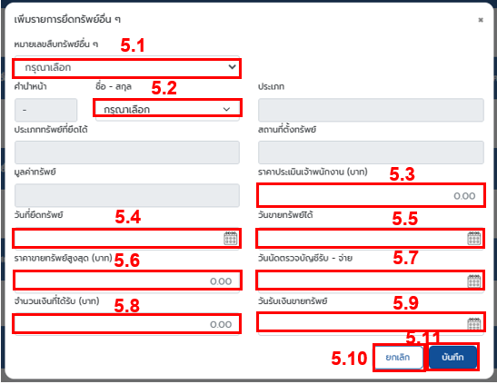<figcaption>
<strong>รูปภาพที่ 140</strong> หน้าจอ Pop-up เพิ่มรายการยึดทรัพย์อื่น ๆ
</figcaption></figure>

5.1 กรอกข้อมูล “หมายเลขสืบทรัพย์อื่น ๆ”

5.2 กรอกข้อมูล “ชื่อ - นามสกุล”

5.3 กรอกข้อมูล “ราคาประเมินเจ้าพนักงาน (บาท)”

5.4 กรอกข้อมูล “วันที่ยึดทรัพย์”

5.5 กรอกข้อมูล “วันขายทรัพย์ได้”

5.6 กรอกข้อมูล “ราคาขายทรัพย์สูงสุด (บาท)”

5.7 กรอกข้อมูล “วันนัดตรวจบัญชีรับ - จ่าย”

5.8 กรอกข้อมูล “วันรับเงินขายทรัพย์”

5.9 กรอกข้อมูล “จำนวนเงินที่ได้รับ (บาท)”

5.10 ไม่บันทึกข้อมูล กดปุ่ม “ยกเลิก”

5.11 ข้อมูลเรียบร้อย กดปุ่ม “บันทึก”

6. กดปุ่ม “+ เพิ่มรายการคำร้อง”

<figure>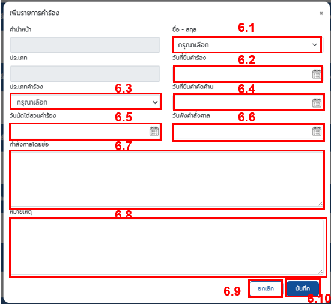<figcaption>
<strong>รูปภาพที่ 141</strong> หน้าจอ Pop-up เพิ่มรายการคำร้อง
</figcaption></figure>

6.1 กรอกข้อมูล “ชื่อ - นามสกุล”

6.2 กรอกข้อมูล “วันยื่นคำร้อง”

6.3 กรอกข้อมูล “ประเภทคำร้อง”

6.4 กรอกข้อมูล “วันที่ยื่นคำคัดค้าน

6.5 กรอกข้อมูล “วันนัดไต่สวนคำร้อง”

6.6 กรอกข้อมูล “วันฟังคำสั่งศาล”

6.7 กรอกข้อมูล “คำสั่งศาลโดยย่อ”

6.8 กรอกข้อมูล “หมายเหตุ”

6.9 ไม่บันทึกข้อมูล กดปุ่ม “ยกเลิก”

6.10 ข้อมูลเรียบร้อย กดปุ่ม “บันทึก”

7. กรอกข้อมูลชื่อไฟล์เอกสารประกอบการฟ้องคดี
8. แนบไฟล์ กดปุ่ม “เพิ่มไฟล์”
9. บันทึกแนบไฟล์ กด (ไอคอน เครื่องหมายถูก)

<figure><figcaption></figcaption></figure>

10. กรอกข้อมูล “หมายเหตุ”
11. ไม่บันทึกข้อมูล กดปุ่ม “ยกเลิก”
12. ข้อมูลเรียบร้อย กดปุ่ม “บันทึก”

### 2.7 บังคับคดีอายัดทรัพย์ 

การบันทึกข้อมูลบังคับคดีอายัดทรัพย์ โดยทรัพย์ต้องเป็นสังหา

<figure>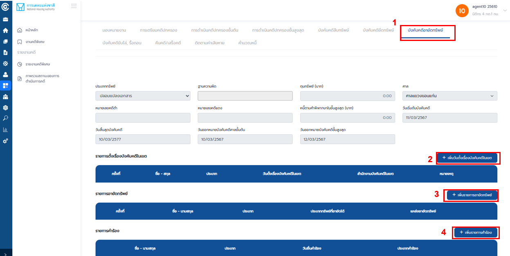<figcaption>
<strong>รูปภาพที่ 142</strong> หน้าจอบังคับคดีอายัดทรัพย์
</figcaption></figure>

1. เลือกที่เมนู “บังคับคดีอายัดทรัพย์”
2. กดปุ่ม “+ เพิ่มวันตั้งเรื่องบังคับคดีในเขต”

<figure>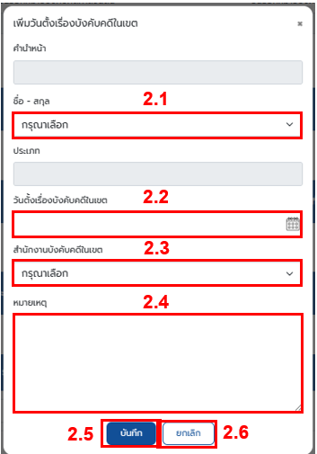<figcaption>
<strong>รูปภาพที่ 143</strong> หน้าจอ Pop-up เพิ่มวันตั้งเรื่องบังคับคดีในเขต
</figcaption></figure>

2.1 กรอกข้อมูล “ชื่อ - นามสกุล”

2.2 กรอกข้อมูล “วันตั้งเรื่อบังคับคดีในเขต”

2.3 กรอกข้อมูล “สำนักงานบังคับคดีในเขต”

2.4 กรอกข้อมูล “หมายเหตุ”

2.5 ข้อมูลเรียบร้อย กดปุ่ม “บันทึก”

2.6 ไม่บันทึกข้อมูล กดปุ่ม “ยกเลิก”

3. กดปุ่ม “+ เพิ่มรายการอายัดทรัพย์”

<figure>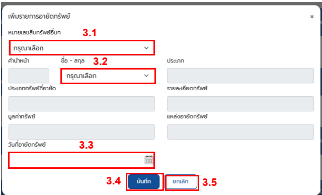<figcaption>
<strong>รูปภาพที่ 144</strong> หน้าจอ Pop-up เพิ่มรายการอายัดทรัพย์
</figcaption></figure>

3.1 กรอกข้อมูล “หมายเลขสืบทรัพย์อื่นๆ”

3.2 กรอกข้อมูล “ชื่อ - นามสกุล”

3.3 กรอกข้อมูล “วันที่อายัดทรัพย์”

3.4 ข้อมูลเรียบร้อย กดปุ่ม “บันทึก”

3.5 ไม่บันทึกข้อมูล กดปุ่ม “ยกเลิก”

4. กดปุ่ม “+ เพิ่มรายการคำร้อง”

<figure><figcaption>
<strong>รูปภาพที่ 145</strong> หน้าจอ Pop-up เพิ่มรายการคำร้อง
</figcaption></figure>

4.1 กรอกข้อมูล “ชื่อ - นามสกุล”

4.2 กรอกข้อมูล “วันยื่นคำร้อง”

4.3 กรอกข้อมูล “ประเภทคำร้อง”

4.4 กรอกข้อมูล “วันที่ยื่นคำคัดค้าน”

4.5 กรอกข้อมูล “วันนัดไต่สวนคำร้อง”

4.6 กรอกข้อมูล “วันฟังคำสั่งศาล”

4.7 กรอกข้อมูล “คำสั่งศาลโดยย่อ”

4.8 กรอกข้อมูล “หมายเหตุ”

4.9 ข้อมูลเรียบร้อย กดปุ่ม “บันทึก”

4.10 ไม่บันทึกข้อมูล กดปุ่ม “ยกเลิก”

<figure>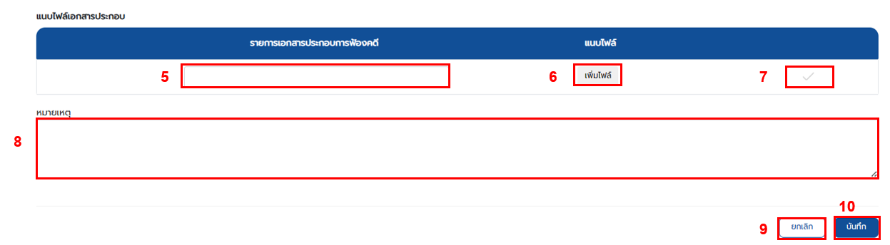<figcaption>
<strong>รูปภาพที่ 146</strong> หน้าจอบังคับคดีสืบทรัพย์ (1)
</figcaption></figure>

5. กรอกข้อมูลชื่อไฟล์เอกสารประกอบการฟ้องคดี
6. แนบไฟล์ กดปุ่ม “เพิ่มไฟล์”
7. บันทึกแนบไฟล์ กด (ไอคอน เครื่องหมายถูก)

<figure><figcaption></figcaption></figure>

8. กรอกข้อมูล“หมายเหตุ”
9. ไม่บันทึกข้อมูล กดปุ่ม “ยกเลิก”
10. ข้อมูลเรียบร้อย กดปุ่ม “บันทึก”

### 2.8 บังคับคดีขับไล่, รื้อถอน 

บันทึกข้อมูลคดีขับไล่, รื้อถอน กรณีที่เป็นพื้นที่ของ กคช. และมีการประกาศจับ

<figure>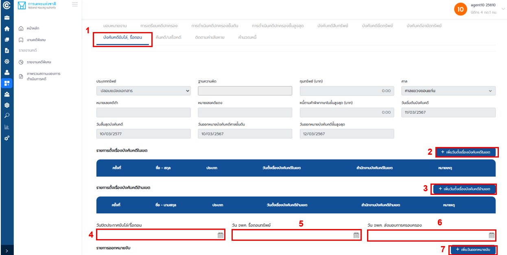<figcaption>
<strong>รูปภาพที่ 147</strong> หน้าจอบังคับคดีขับไล่, รื้อถอน
</figcaption></figure>

1. เลือกที่เมนู “บังคับคดีขับไล่, รื้อถอน”
2. กดปุ่ม “+ เพิ่มวันตั้งเรื่องบังคับคดีในเขต”

<figure>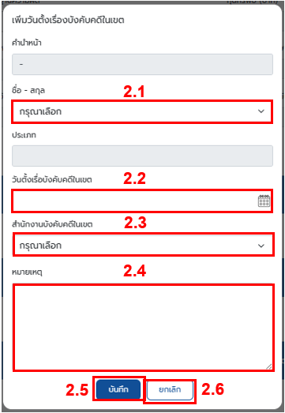<figcaption>
<strong>รูปภาพที่ 148</strong> หน้าจอ Pop-up เพิ่มวันตั้งเรื่องบังคับคดีในเขต
</figcaption></figure>

2.1 กรอกข้อมูล “ชื่อ - นามสกุล”

2.2 กรอกข้อมูล “วันตั้งเรื่อบังคับคดีในเขต”

2.3 กรอกข้อมูล “สำนักงานบังคับคดีในเขต”

2.4 กรอกข้อมูล “หมายเหตุ”

2.5 ข้อมูลเรียบร้อย กดปุ่ม “บันทึก”

2.6 ไม่บันทึกข้อมูล กดปุ่ม “ยกเลิก”

3. กดปุ่ม “+ เพิ่มวันตั้งเรื่องบังคับคดีข้ามเขต”

<figure>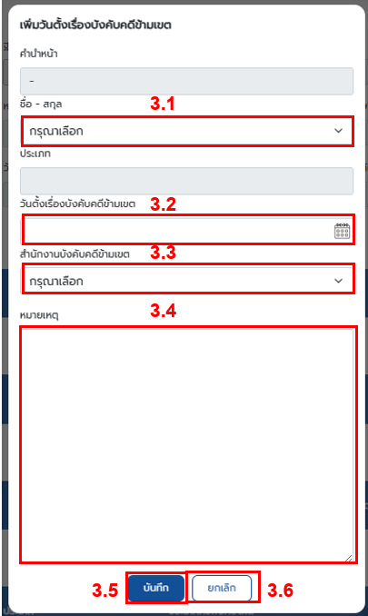<figcaption>
<strong>รูปภาพที่ 149</strong> หน้าจอ Pop-up เพิ่มวันตั้งเรื่องบังคับคดีข้ามเขต
</figcaption></figure>

3.1 กรอกข้อมูล “ชื่อ - นามสกุล”

3.2 กรอกข้อมูล “วันตั้งเรื่อบังคับคดีข้ามเขต”

3.3 กรอกข้อมูล “สำนักงานบังคับคดีข้ามเขต”

3.4 กรอกข้อมูล “หมายเหตุ”

3.5 ข้อมูลเรียบร้อย กดปุ่ม “บันทึก”

3.6 ไม่บันทึกข้อมูล กดปุ่ม “ยกเลิก”

4. กรอกข้อมูล “วันปิดประกาศขับไล่/รื้อถอน”
5. กรอกข้อมูล “วัน จพค. รื้อถอนทรัพย์”
6. กรอกข้อมูล “วัน จพค. ส่งมอบการครอบครอง
7. กดปุ่ม “+ เพิ่มรายการออกหมายจับ”

<figure>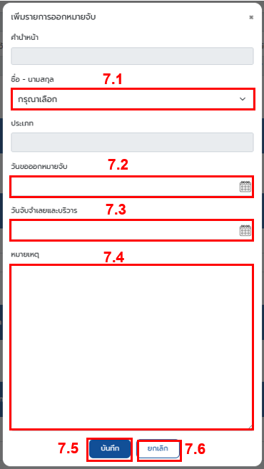<figcaption>
<strong>รูปภาพที่ 150</strong> หน้าจอ Pop-up เพิ่มรายการออกหมายจับ
</figcaption></figure>

7.1 กรอกข้อมูล “ชื่อ - นามสกุล”

7.2 กรอกข้อมูล “วันขอออกหมายจับ”

7.3 กรอกข้อมูล “วันจับจำเลยและบริวาร”

7.4 กรอกข้อมูล “หมายเหตุ”

7.5 ข้อมูลเรียบร้อย กดปุ่ม “บันทึก”

7.6 ไม่บันทึกข้อมูล กดปุ่ม “ยกเลิก”

<figure>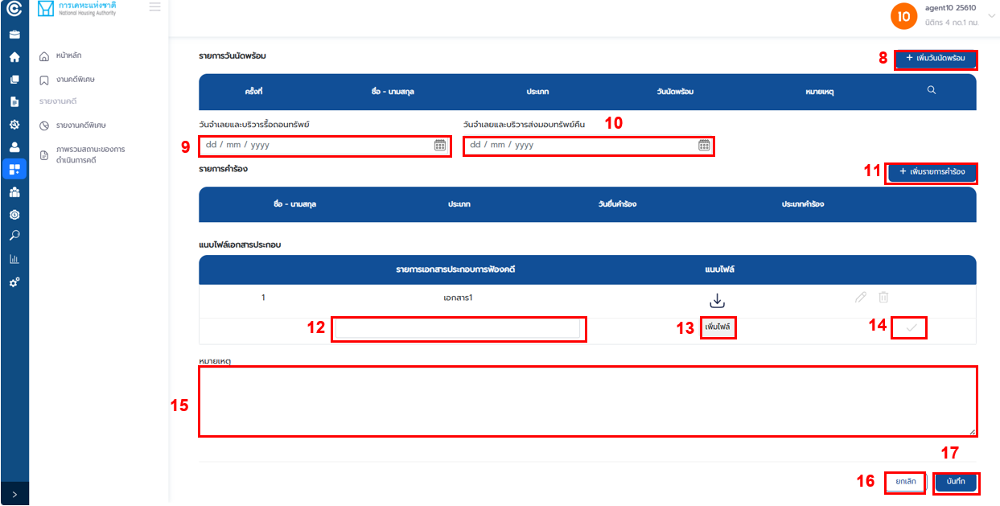<figcaption>
<strong>รูปภาพที่ 151</strong> หน้าจอรายการวันนัดพร้อม
</figcaption></figure>

8. กดปุ่ม “+ เพิ่มวันนัดพร้อม”

<figure>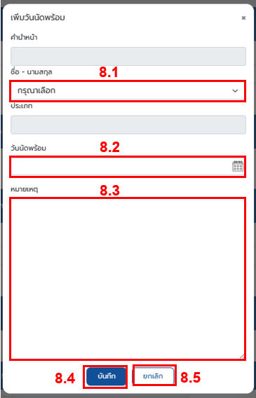<figcaption>
<strong>รูปภาพที่ 152</strong> หน้าจอ Pop-up เพิ่มวันนัดพร้อม
</figcaption></figure>

8.1 กรอกข้อมูล “ชื่อ - นามสกุล”

8.2 กรอกข้อมูล “วันนัดพร้อม”

8.3 กรอกข้อมูล “หมายเหตุ”

8.4 ข้อมูลเรียบร้อย กดปุ่ม “บันทึก”

8.5 ไม่บันทึกข้อมูล กดปุ่ม “ยกเลิก”

9. กรอกข้อมูล“วันจำเลยและบริวารรื้อถอนทรัพย์”
10. กรอกข้อมูล“วันจำเลยและบริวารส่งมอบทรัพย์คืน”
11. กดปุ่ม “+ เพิ่มรายการคำร้อง”

<figure>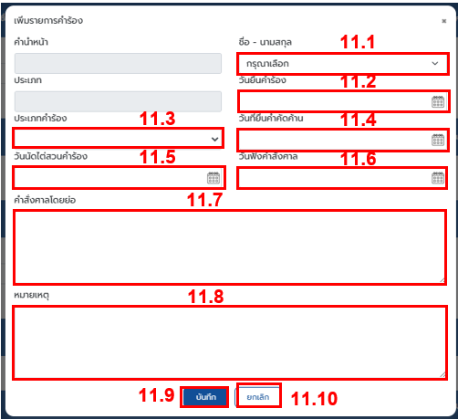<figcaption>
<strong>รูปภาพที่ 153</strong> หน้าจอ Pop-up เพิ่มรายการคำร้อง
</figcaption></figure>

11.1 กรอกข้อมูล “ชื่อ - นามสกุล”

11.2 กรอกข้อมูล “วันยื่นคำร้อง”

11.3 กรอกข้อมูล “ประเภทคำร้อง”

11.4 กรอกข้อมูล “วันที่ยื่นคำคัดค้าน”

11.5 กรอกข้อมูล “วันนัดไต่สวนคำร้อง”

11.6 กรอกข้อมูล “วันฟังคำสั่งศาล”

11.7 กรอกข้อมูล “คำสั่งศาลโดยย่อ”

11.8 กรอกข้อมูล “หมายเหตุ”

11.9 ข้อมูลเรียบร้อย กดปุ่ม “บันทึก”

11.10 ไม่บันทึกข้อมูล กดปุ่ม “ยกเลิก”

12. กรอกข้อมูลชื่อไฟล์เอกสารประกอบการฟ้องคดี
13. แนบไฟล์ กดปุ่ม “เพิ่มไฟล์”
14. บันทึกแนบไฟล์ กด (ไอคอน เครื่องหมายถูก)

<figure><figcaption></figcaption></figure>

15. กรอกข้อมูล “หมายเหตุ”
16. ไม่บันทึกข้อมูล กดปุ่ม “ยกเลิก”
17. ข้อมูลเรียบร้อย กดปุ่ม “บันทึก”

### 2.9 คืนคดี/เสร็จคดี 

บันทึกข้อมูลคืนคดี/เสร็จคดีี

<figure>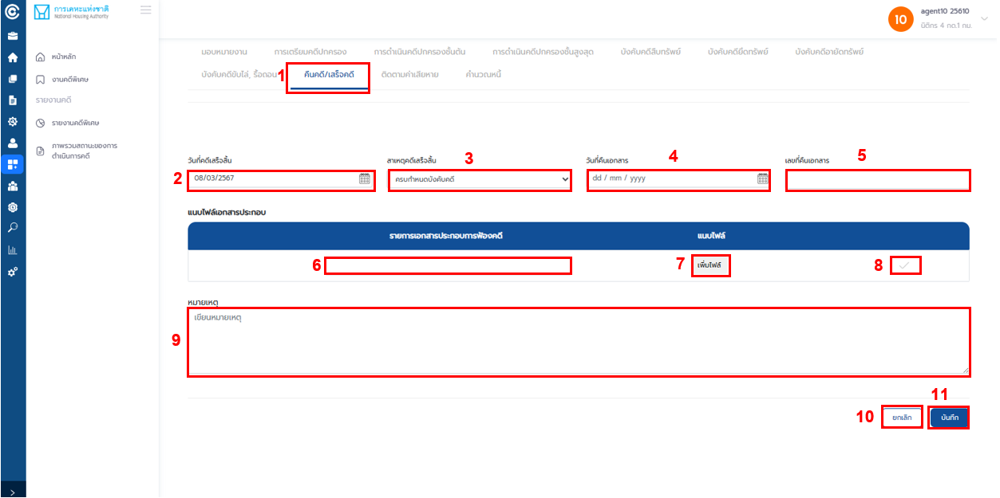<figcaption>
<strong>รูปภาพที่ 154</strong> หน้าจอคืนคดี/เสร็จคดี
</figcaption></figure>

1. เลือกที่เมนู “คืนคดี/เสร็จคดี”
2. กรอกข้อมูล “วันที่คดีเสร็จสิ้น”
3. กรอกข้อมูล “สาเหตุคดีเสร็จสิ้น”
4. กรอกข้อมูล “วันคืนเอกสาร”
5. กรอกข้อมูล “เลขที่คืนเอกสาร”
6. กรอกข้อมูลชื่อไฟล์เอกสารประกอบการฟ้องคดี
7. แนบไฟล์ กดปุ่ม “เพิ่มไฟล์”
8. บันทึกแนบไฟล์ กด (ไอคอน เครื่องหมายถูก)

<figure><figcaption></figcaption></figure>

9. กรอกข้อมูล “หมายเหตุ”
10. ไม่บันทึกข้อมูล กดปุ่ม “ยกเลิก”
11. ข้อมูลเรียบร้อย กดปุ่ม “บันทึก”

### 2.10 ติดตามค่าเสียหาย 

บันทึกข้อมูลบังคับคดีติดตามค่าเสียหาย โดยที่จะมีเรื่องของ กคช. รับเงิน/จ่ายเงิน และเงินวางศาล

<figure><figcaption>
<strong>รูปภาพที่ 155</strong> หน้าจอติดตามค่าเสียหาย
</figcaption></figure>

1. เลือกที่เมนู “ติดตามค่าเสียหาย”
2. กดปุ่ม “+ รายการ กคช. รับเงิน”

<figure>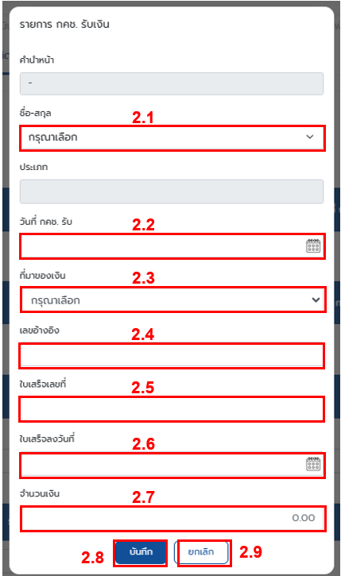<figcaption>
<strong>รูปภาพที่ 156</strong> หน้าจอ Pop-up เพิ่มรายการ กคช. รับเงิน
</figcaption></figure>

2.1 กรอกข้อมูล “ชื่อ - นามสกุล”

2.2 กรอกข้อมูล “วันที่ กคช. รับ”

2.3 กรอกข้อมูล “ที่มาของเงิน”

2.4 กรอกข้อมูล “เลขอ้างอิง”

2.5 กรอกข้อมูล “ใบเสร็จเลขที่”

2.6 กรอกข้อมูล “ใบเสร็จลงวันที่”

2.7 กรอกข้อมูล “จำนวนเงิน”

2.8 ข้อมูลเรียบร้อย กดปุ่ม “บันทึก”

2.9 ไม่บันทึกข้อมูล กดปุ่ม “ยกเลิก”

3. กดปุ่ม “+ รายการ กคช. จ่ายเงิน”

<figure>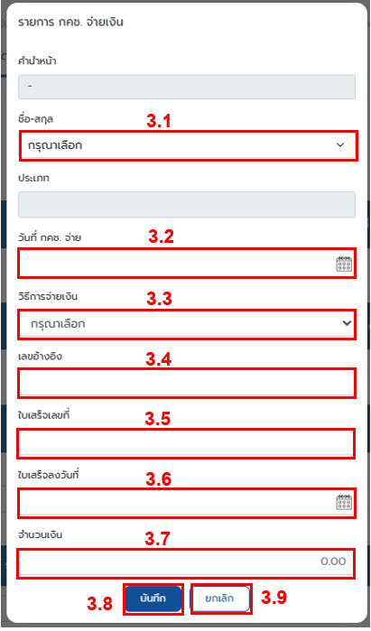<figcaption>
<strong>รูปภาพที่ 157</strong> หน้าจอ Pop-up เพิ่มรายการ กคช. จ่ายเงิน
</figcaption></figure>

3.1 กรอกข้อมูล “ชื่อ - นามสกุล”

3.2 กรอกข้อมูล “วันที่ กคช. จ่าย”

3.3 กรอกข้อมูล “วิธีการจ่ายเงิน”

3.4 กรอกข้อมูล “เลขอ้างอิง”

3.5 กรอกข้อมูล “ใบเสร็จเลขที่”

3.6 กรอกข้อมูล “ใบเสร็จลงวันที่”

3.7 กรอกข้อมูล “จำนวนเงิน”

3.8 ข้อมูลเรียบร้อย กดปุ่ม “บันทึก”

3.9 ไม่บันทึกข้อมูล กดปุ่ม “ยกเลิก”

4. กดปุ่ม “+ รายการ เงินวางศาล”

<figure>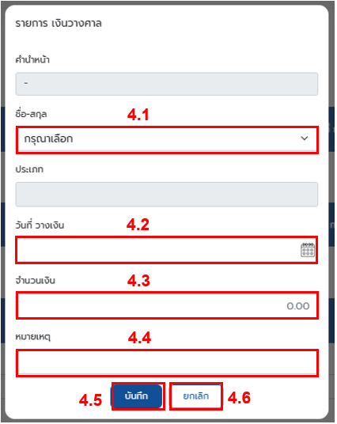<figcaption>
<strong>รูปภาพที่ 158</strong> หน้าจอ Pop-up เพิ่มรายการ เงินวางศาล
</figcaption></figure>

4.1 กรอกข้อมูล “ชื่อ - นามสกุล”

4.2 กรอกข้อมูล “วันที่ วางเงิน”

4.3 กรอกข้อมูล “จำนวนเงิน”

4.4 กรอกข้อมูล “หมายเหตุ”

4.5 ข้อมูลเรียบร้อย กดปุ่ม “บันทึก”

4.6 ไม่บันทึกข้อมูล กดปุ่ม “ยกเลิก”

5. กรอกข้อมูล “วันที่รับเงินวางศาล”
6. กรอกข้อมูล “จำนวนเงิน”

<figure>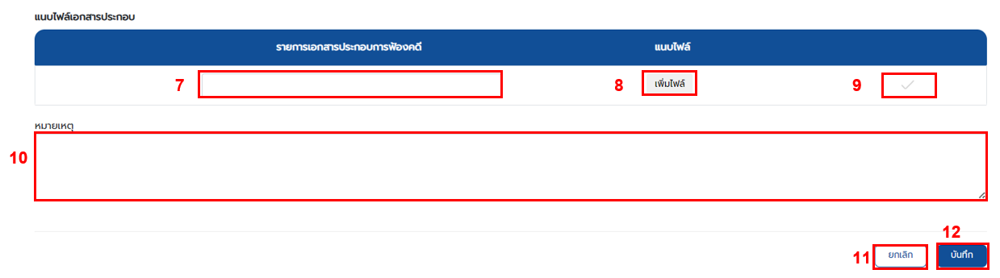<figcaption>
<strong>รูปภาพที่ 159</strong> หน้าจอบังคับคดีสืบทรัพย์ (1)
</figcaption></figure>

7. กรอกข้อมูลชื่อไฟล์เอกสารประกอบการฟ้องคดี
8. แนบไฟล์ กดปุ่ม “เพิ่มไฟล์”
9. บันทึกแนบไฟล์ กด (ไอคอน เครื่องหมายถูก)

<figure><figcaption></figcaption></figure>

10. กรอกข้อมูล “หมายเหตุ”
11. ไม่บันทึกข้อมูล กดปุ่ม “ยกเลิก”
12. ข้อมูลเรียบร้อย กดปุ่ม “บันทึก”

### 1.11 คำนวณหนี้ 

บันทึกข้อมูลบังคับคดีคำนวณหนี้ เป็นระบบที่จะคำนวณหนี้ตามข้อมูลในชั้นศาล และจะไปแสดงข้อมูลในชั้นศาลนั้นๆ

<figure><figcaption>
<strong>รูปภาพที่ 160</strong> หน้าจอคำนวณหนี้
</figcaption></figure>

1. เลือกที่เมนู “ติดตามค่าเสียหาย”
2. กดปุ่ม “+ รายการดอกเบี้ย”

<figure>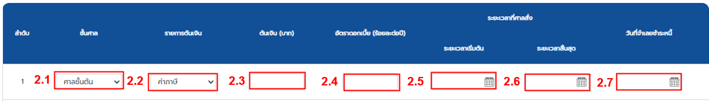<figcaption>
<strong>รูปภาพที่ 161</strong> ฟิลด์เพิ่มรายการดอกเบี้ย
</figcaption></figure>

2.1 กรอกข้อมูล “ชั้นศาล”

2.2 กรอกข้อมูล “รายการต้นเงิน”

2.3 กรอกข้อมูล “ต้นเงิน (บาท)”

2.4 กรอกข้อมูล “อัตราดอกเบี้ย (ร้อยละต่อปี)”

2.5 กรอกข้อมูล “ระยะเวลาที่ศาลสั่งเริ่มต้น”

2.6 กรอกข้อมูล “ระยะเวลาที่ศาลสั่งสิ้นสุด”

2.7 กรอกข้อมูล “วันที่จำเลยชำระหนี้”

3. กดปุ่ม “+ รายการค่าเสียหาย”

<figure>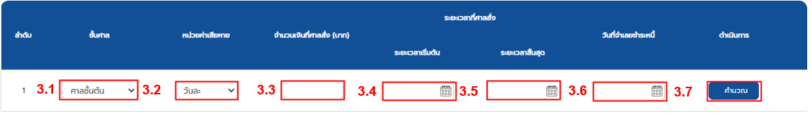<figcaption>
<strong>รูปภาพที่ 162</strong> ฟิลด์เพิ่มรายการค่าเสียหาย
</figcaption></figure>

3.1 กรอกข้อมูล “ชั้นศาล”

3.2 กรอกข้อมูล “หน่วยค่าเสียหาย”

3.3 กรอกข้อมูล “จำนวนเงินที่ศาลสั่ง (บาท)”

3.4 กรอกข้อมูล “ระยะเวลาที่ศาลสั่งเริ่มต้น”

3.5 กรอกข้อมูล “ระยะเวลาที่ศาลสั่งสิ้นสุด”

3.6 กรอกข้อมูล “วันที่จำเลยชำระหนี้”

3.7 กรอกข้อมูลเรียบร้อย กดปุ่ม “คำนวณ”

<figure>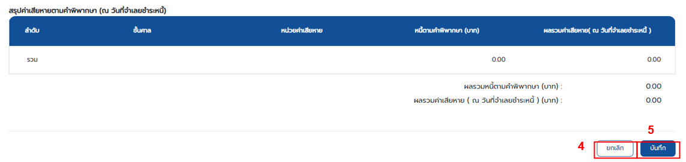<figcaption>
<strong>รูปภาพที่ 163</strong> หน้าจอคำนวณหนี้ (1)
</figcaption></figure>

4. ไม่บันทึกข้อมูล กดปุ่ม “ยกเลิก”
5. ข้อมูลเรียบร้อย กดปุ่ม “บันทึก”
