# ระบบจำหน่ายหนี้สูญ

## 1. บทนำ 

ระบบจำหน่ายหนี้เป็นสูญ จัดทำขึ้นเพื่อปฏิบัติงานการจำหน่ายลูกหนี้ออกจากบัญชีฉบับนี้ เพื่อให้บุคลากรในฝ่ายการบัญชี และ หน่วยงานที่เกี่ยวข้องสามารถปฏิบัติงานได้ถูกต้องตามข้อบังคับการเคหะแห่งชาติ ฉบับที่ 57 ว่าด้วย การจำหน่ายทรัพย์สินและลูกหนี้ออกจากบัญชี และระเบียบการเคหะแห่งชาติ ว่าด้วยวิธีปฏิบัติเกี่ยวกับการจำหน่ายทรัพย์สินและลูกหนี้ออกจากบัญชี พ.ศ. 2558 ข้อ 4 (3) ลูกหนี้ที่เรียกเก็บเงินไม่ได้ โดยหนี้นั้นยังไม่ขาดอายุความและมีหลักฐานโดยชัดแจ้งที่สามารถฟ้องลูกหนี้ได้ และ ข้อ 4 (4) ตามกรณีอื่นๆที่ผู้ว่าเห็นสมควร ส่งผลให้งบการเงินของการเคหะแห่งชาติมีความถูกต้อง และสะท้อนความเป็นจริง โดยระบบมีขึ้นตอนการทำงานแบบสังเขป ดังนี้

1. พนักงานทั่วไปเข้าสู่ระบบ สร้างข้อมูลจำหน่ายหนี้เป็นสูญ และส่งให้หัวหน้าหน่วยงาน (คล./คจ.) อนุมัติ
2. หัวหน้าหน่วยงาน (คล./คจ.) เข้าสู่ระบบ โดยสามารถส่งกลับแก้ไข หรือ อนุมัติงาน ที่พนักงานทั่วไปนำส่งมา
3. หลังจาก หัวหน้าหน่วยงาน (คล./คจ.) อนุมัติงานแล้ว พนักงานทั่วไปเข้าสู่ระบบ เพื่อ ส่งงานให้กองบริหารงานชุมชนอนุมัติ หรือแก้ไขงานที่ถูกส่งกลับ
4. กองบริหารชุมชน เข้าสู่ระบบ เพื่อตรวจสอบงาน และส่งกองบริหารงานกลางตรวจสอบ หรือส่งกลับแก้ไข งานที่พนักงานทั่วไปนำส่งมา
5. กองบริหารงานกลาง เข้าสู่ระบบ เพื่อตรวจสอบงาน และส่งกองบัญชีลูกหนี้ตรวจสอบ หรือส่งกลับแก้ไข งานที่กองบริหารงานชุมชนนำส่งมา
6. กองบัญชีลูกหนี้ เข้าสู่ระบบ เพื่อตรวจสอบงาน และขออนุมัติตัดหนี้ หรือส่งกลับแก้ไข งานที่กองบริหารงานกลางนำส่งมา
7. กองบัญชีลูกหนี้ ทำการอนุมัติตัดหนี้สูญ โดยเลือกเมนู อนุมัติตัดหนี้สูญ และกดประมวลผลขออนุมัติ ระบบจะเปลี่ยนรายการที่มีสถานะ ขออนุมัติตัดหนี้สูญ เป็นสถานะ อนุมัติตัดหนี้สูญ

## 2. ระบบจำหน่ายหนี้เป็นสูญ (Role : พนักงานทั่วไป) 

### 2.1 การเข้าสู่ระบบ 

หน้าจอสำหรับการเข้าสู่ระบบ สำหรับผู้ใช้งาน

.png>)

1. URL สำหรับเข้าใช้งาน : [https://portal.nha.co.th/](https://portal.nha.co.th/)
2. กรอกชื่อผู้ใช้ : XXXXXX@nha.co.th
3. กรอกรหัสผ่าน : XXXXXXX
4. กดปุ่ม (เข้าสู่ระบบ)

### 2.2 หน้าจอหลัก 

หน้าจอหลัก สำหรับเลือกใช้งานเมนูต่าง ๆ ที่มีอยู่ในระบบ

.png>)

1. กดเมนูย่อย (แอปพลิเคชันของฉัน)

### 2.3 หน้าจอเมนูย่อย (แอปพลิเคชันของฉัน) 

หน้าจอสำหรับการเลือกใช้งานแอปพลิเคชัน โดยจะแสดงต่างกัน ตาม role ของผู้ใช้งาน

.png>)

1. กดแอปพลิเคชัน (จำหน่ายหนี้สูญ)

### 2.4 หน้าจอแรกระบบจำหน่ายหนี้เป็นสูญ (Role : พนักงานทั่วไป) 

หน้าจอ จำหน่ายหนี้เป็นสูญ โดยจะแสดงเมนูย่อยของแอปพลิเคชันจำหน่ายหนี้เป็นสูญ ซึ่งจะแสดงผลต่างกัน ตาม role ของผู้ใช้

.png>)

1. เมนู ลูกหนี้ค้างชำระสถานะปิดสัญญา (หนี้เก่า)
2. กดเมนูจำหน่ายหนี้เป็นสูญ (สคล./สคจ./ฟม.)
3. เมนู รายงานจำหน่ายหนี้เป็นสูญ

### 2.5 เมนูจำหน่ายหนี้เป็นสูญ (สคล./สคจ./ฟม.) 

หน้าจอเมนูย่อย สำหรับการแสดงสัญญา ที่ถูกเลือกทำการจำหน่ายหนี้แล้ว หรือเพื่อสร้างงานใหม่

.png>)

1. Search Box (กล่องค้นหา): สำหรับการค้นหาข้อมูล
2. ปุ่ม Filter : สำหรับการกรองข้อมูล
3. ปุ่ม สร้างข้อมูล : สำหรับการสร้างข้อมูลจำหน่ายหนี้เป็นสูญ
4. การตรวจสอบรายการ จำหน่ายหนี้เป็นสูญ (สคล./สคจ./ฟม.) : สำหรับการตรวจสอบรายการจำหน่ายหนี้เป็นสูญที่มีสถานะ ส่งหัวหน้าหน่วยพิจารณาอนุมัติ หัวหน้าหน่วยอนุมัติ และส่งคืนกองบัญชีลูกหนี้
5. การลบข้อมูลรายการจำหน่ายหนี้เป็นสูญ (สคล./สคจ./ฟม.) : สำหรับการลบข้อมูลรายการจำหน่ายหนี้เป็นสูญที่มีสถานะ บันทึกร่าง และหัวหน้าหน่วยส่งกลับแก้ไข
6. การแก้ไขข้อมูล รายการจำหน่ายหนี้เป็นสูญ (สคล./สคจ./ฟม.) : สำหรับการแก้ไขข้อมูลรายการจำหน่ายหนี้เป็นสูญที่มีสถานะ บันทึกร่าง และหัวหน้าหน่วยส่งกลับแก้ไข

### 2.6 เมนูจำหน่ายหนี้เป็นสูญ (สคล./สคจ./ฟม.) :การสร้างข้อมูลจำหน่ายหนี้เป็นสูญ (1) 

แถบการแจ้งเตือน เพื่อแจ้งเตือนผู้ใช้ ก่อนที่จะมีการสร้างงานใหม่

.png>)

1. ปุ่ม ย้อนกลับ : สำหรับการย้อนกลับไปหน้าจอเมนูจำหน่ายหนี้เป็นสูญ (สคล./สคจ./ฟม.)
2. กดปุ่ม ถัดไป :สำหรับการดำเนินการในขั้นตอนถัดไป
3. Check Box (ดำเนินการตามแจ้งเตือนเรียบร้อย): สำหรับยืนยันดำเนินการตามแจ้งเตือน
4. ปุ่มออกจากหน้าสร้าง : สำหรับการย้อนกลับไปหน้าจอเมนู จำหน่ายหนี้เป็นสูญ (สคล./สคจ./ฟม.)

### 2.7 เมนูจำหน่ายหนี้เป็นสูญ (สคล./สคจ./ฟม.) : การสร้างข้อมูลจำหน่ายหนี้เป็นสูญ (2) 

แถบการแจ้งเตือน ในกรณีที่ผู้ใช้ ไม่ Check box ตามเงื่อนไข

.png>)

ถ้าหากผู้ใช้งานไม่กด Check Box (ดำเนินการตามแจ้งเตือนเรียบร้อย) และกดปุ่ม ถัดไป ระบบจะแจ้งเตือนให้ผู้ใช้งานยืนยันดำเนินการตามแจ้งเตือน

1. กดปุ่ม ตกลง

### 2.8 เมนูจำหน่ายหนี้เป็นสูญ (สคล./สคจ./ฟม.) : การสร้างข้อมูลจำหน่ายหนี้เป็นสูญ (3) 

ระบบแสดงสัญลักษณ์ checked box ในช่อง ดำเนินการตามแจ้งเตือนเรียบร้อย

.png>)

1. กด Check Box (ดำเนินการตามแจ้งเตือนเรียบร้อย)
2. กดปุ่ม ถัดไป

### 2.9 เมนูจำหน่ายหนี้เป็นสูญ (สคล./สคจ./ฟม.) : การสร้างข้อมูลจำหน่ายหนี้เป็นสูญ (4) 

แถบการเพิ่มสัญญาใหม่ เพื่อเพิ่มสัญญาที่จะจำหน่ายหนี้เป็นสูญ

.png>)

โดยหลังจากผ่านหน้าจอขั้นตอนการแจ้งเตือนจะเข้าสู่หน้าจอการเลือกสัญญา

1. ปุ่ม ย้อนกลับ : สำหรับการย้อนกลับไปหน้าจอเมนู จำหน่ายหนี้เป็นสูญ (สคล./สคจ./ฟม.)
2. ปุ่ม เพิ่มสัญญา : สำหรับเพิ่มสัญญาที่จะจำหน่ายหนี้เป็นสูญ
3. ปุ่ม ก่อนหน้า : สำหรับการย้อนกลับไปหน้าจอขั้นตอนการแจ้งเตือน
4. กดปุ่ม ถัดไป : สำหรับการดำเนินการในขั้นตอนถัดไป

### 2.10 เมนูจำหน่ายหนี้เป็นสูญ (สคล./สคจ./ฟม.) : การสร้างข้อมูลจำหน่ายหนี้เป็นสูญ (5) 

การแสดงแจ้งเตือน กรณีที่ผู้ใช้กดถัดไป โดยยังไม่ทำการเพิ่มสัญญา

.png>)

ถ้าหากผู้ใช้งานไม่เพิ่มสัญญา และกดปุ่ม ถัดไป ระบบจะแจ้งเตือนให้ผู้ใช้งานเลือกสัญญาที่ต้องการ

1. กดปุ่ม ตกลง

### 2.11 เมนูจำหน่ายหนี้เป็นสูญ (สคล./สคจ./ฟม.) : การสร้างข้อมูลจำหน่ายหนี้เป็นสูญ (6) 

.png>)

1. กดปุ่ม เพิ่มสัญญา

### 2.12  เมนูจำหน่ายหนี้เป็นสูญ (สคล./สคจ./ฟม.) : การสร้างข้อมูลจำหน่ายหนี้เป็นสูญ (7) 

หน้าจอแสดงผลสัญญาที่อยู่ในระบบ โดยสามารถระบุข้อมูลเพื่อค้นหาได้

.png>)

1. กดปุ่ม ค้นหา

### 2.13 เมนูจำหน่ายหนี้เป็นสูญ (สคล./สคจ./ฟม.) : การสร้างข้อมูลจำหน่ายหนี้เป็นสูญ (8) 

การแสดงแจ้งเตือน ในกรณีที่ผู้ใช้กดค้นหา โดยไม่ได้ระบุข้อมูล

.png>)

ถ้าหากผู้ใช้งานไม่ระบุข้อมูลอย่างน้อย 1 รายการ และกดปุ่ม ค้นหา ระบบจะแจ้งเตือนให้ผู้ใช้งานระบุข้อมูล

1. กดปุ่ม ตกลง

### 2.14 เมนูจำหน่ายหนี้เป็นสูญ (สคล./สคจ./ฟม.) : การสร้างข้อมูลจำหน่ายหนี้เป็นสูญ (9) 

ระบบแสดงหน้าจอสำหรับค้นหาสัญญา

.png>)

เลือกกรอกข้อมูลอย่างน้อย 1 รายการ

1. กรอกเลขที่บัตรประชาชน/เลขที่ผู้เสียภาษี :
2. เลือกโครงการ :
3. กรอกรหัสลูกค้า :
4. กรอกชื่อ – สกุล :
5. เลือกบ้านเลขที่ตามผัง :
6. เลือกบ้านเลขที่ตามจริง :
7. กดปุ่ม ค้นหา

### 2.15 เมนูจำหน่ายหนี้เป็นสูญ (สคล./สคจ./ฟม.) : การสร้างข้อมูลจำหน่ายหนี้เป็นสูญ (10) 

หน้าจอการแสดงผลการค้นหา หลังจากที่ผู้ใช้ระบุข้อมูลและกดค้นหา

.png>)

โดยหลังจากระบุข้อมูลและกดค้นหาระบบจะแสดงรายการข้อมูล

1. Check Box : สำหรับเลือกรายการสัญญา
2. กดปุ่มบันทึก : สำหรับการบันทึกข้อมูลสัญญาที่เลือก
3. ปุ่มยกเลิก : สำหรับยกเลิกการเลือกสัญญา

### 2.16  เมนูจำหน่ายหนี้เป็นสูญ (สคล./สคจ./ฟม.) : การสร้างข้อมูลจำหน่ายหนี้เป็นสูญ (10) 

การแสดงแจ้งเตือน กรณีที่ผู้ใช้กดบันทึก โดยไม่ Check box สัญญาใดเลย

.png>)

ถ้าหากผู้ใช้งานไม่เลือกสัญญาอย่างน้อย 1 รายการ และกดปุ่ม บันทึก ระบบจะแจ้งเตือนให้ผู้ใช้งานเลือกสัญญา

1. กดปุ่ม ตกลง

### 2.17 เมนูจำหน่ายหนี้เป็นสูญ (สคล./สคจ./ฟม.) : การสร้างข้อมูลจำหน่ายหนี้เป็นสูญ (11) 

.png>)

1. Check Box : สำหรับเลือกรายการสัญญา
2. กดปุ่มบันทึก : สำหรับการบันทึกข้อมูลสัญญาที่เลือก

### 2.18 เมนูจำหน่ายหนี้เป็นสูญ (สคล./สคจ./ฟม.) : การสร้างข้อมูลจำหน่ายหนี้เป็นสูญ (12) 

หน้าจอการแสดงผลสัญญา หลังจากผู้ใช้ Check box รายการสัญญา และกดบันทึก

.png>)

1. กดปุ่ม ถัดไป : สำหรับการดำเนินการในขั้นตอนถัดไป

### 2.19 เมนูจำหน่ายหนี้เป็นสูญ (สคล./สคจ./ฟม.) : การสร้างข้อมูลจำหน่ายหนี้เป็นสูญ (13) 

หน้าจอ รายการหนี้ค้างชำระ สำหรับแสดงผล และเพิ่มข้อมูล จำนวนเงินประกัน

.png>)

1. ข้อมูลจำนวนเงินประกันจาก SAP
2. ข้อมูลจำนวนเงินประกันเพิ่มเติม

### 2.20 เมนูจำหน่ายหนี้เป็นสูญ (สคล./สคจ./ฟม.) : การสร้างข้อมูลจำหน่ายหนี้เป็นสูญ (14) 

การแสดงข้อมูลยอดเงินประกันโครงการอื่น รวมยอดหนี้ตามประเภท GL ฯลฯ

<figure>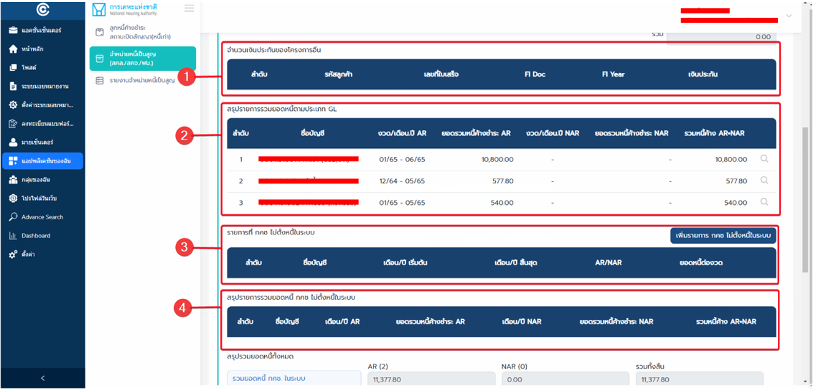<figcaption>
<strong>ภาพที่ 20</strong> แสดงข้อมูลรายการหนี้และรวมยอดหนี้ - หน้าจอเมนูย่อย จำหน่ายหนี้เป็นสูญ (สคล./สคจ./ฟม.)
</figcaption></figure>

1. ข้อมูลจำนวนเงินประกันของโครงการอื่น
2. ข้อมูลสรุปรายการรวมยอดหนี้ตามประเภท GL
3. ข้อมูลรายการที่ กคช. ไม่ตั้งหนี้ในระบบ
4. สรุปรายการรวมยอดหนี้ กคช. ไม่ตั้งหนี้ในระบบ

### 2.21 เมนูจำหน่ายหนี้เป็นสูญ (สคล./สคจ./ฟม.) : การสร้างข้อมูลจำหน่ายหนี้เป็นสูญ (15) 

หน้าจอการแสดงผลสรุปรวมยอดหนี้ และยอดคงเหลือโอนเงินประกัน ลดหนี้ค้าง / จำหน่ายหนี้สูญ

<figure>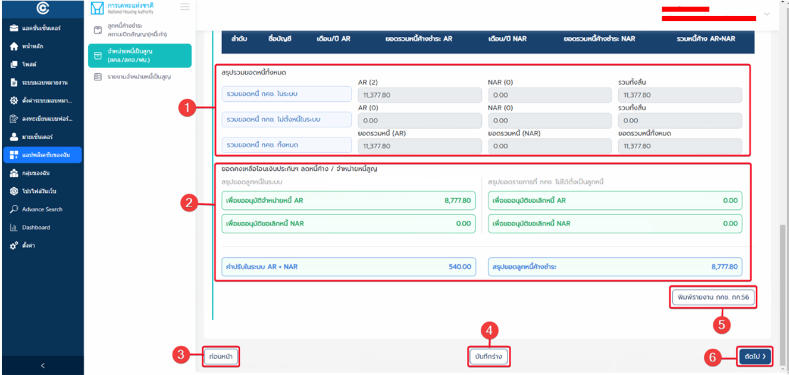<figcaption>
<strong>ภาพที่ 21</strong> แสดงผลสรุปรวมยอดหนี้ และยอดคงเหลือฯ - หน้าจอเมนูย่อย จำหน่ายหนี้เป็นสูญ (สคล./สคจ./ฟม.)
</figcaption></figure>

1. ข้อมูลสรุปรวมยอดหนี้ทั้งหมด
2. ข้อมูลยอดคงเหลือโอนเงินประกันฯ ลดหนี้ค้าง / จำหน่ายหนี้เป็นสูญ
3. ปุ่มก่อนหน้า : สำหรับย้อนกลับไปขั้นตอนก่อนหน้า
4. ปุ่มบันทึกร่าง : สำหรับบันทึกข้อมูล
5. กดปุ่มพิมพ์รายงาน กคช. กค.56 : สำหรับพิมพ์รายงาน
6. ปุ่ม ถัดไป : สำหรับดำเนินการขั้นตอนถัดไป

### 2.22 เมนูจำหน่ายหนี้เป็นสูญ (สคล./สคจ./ฟม.) : การสร้างข้อมูลจำหน่ายหนี้เป็นสูญ (16) 

การแสดงแจ้งเตือน กรณีที่ผู้ใช้กด พิมพ์รายงาน กค.กช.56 โดยยังไม่บันทึกร่าง

<figure>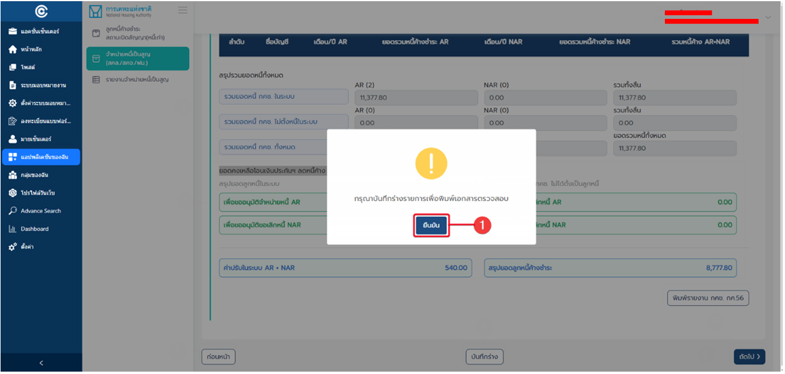<figcaption>
<strong>ภาพที่ 22</strong> Pop up แสดงแจ้งเตือนการบันทึกร่างรายการ - หน้าจอเมนูย่อย จำหน่ายหนี้เป็นสูญ (สคล./สคจ./ฟม.)
</figcaption></figure>

ถ้าหากผู้ใช้งานไม่บันทึกร่างข้อมูล และกดปุ่มถัดไประบบจะแจ้งเตือนให้ผู้ใช้งานกดบันทึกร่าง

1. กดปุ่ม ยืนยัน

### 2.23 เมนูจำหน่ายหนี้เป็นสูญ (สคล./สคจ./ฟม.) : การสร้างข้อมูลจำหน่ายหนี้เป็นสูญ (17) 

ระบบแสดง ปุ่มกดบันทึกร่าง เพื่อบันทึกการแก้ไขในแถบ รายการหนี้ค้างชำระ

<figure>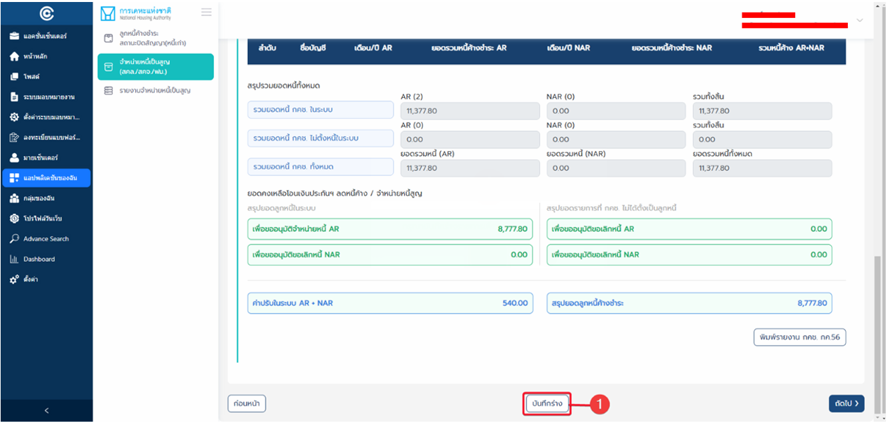<figcaption>
<strong>ภาพที่ 23</strong> ปุ่มบันทึกร่าง - หน้าจอเมนูย่อย จำหน่ายหนี้เป็นสูญ (สคล./สคจ./ฟม.)
</figcaption></figure>

1. กดปุ่มบันทึกร่าง : สำหรับบันทึกข้อมูล

### 2.24 เมนูจำหน่ายหนี้เป็นสูญ (สคล./สคจ./ฟม.) : การสร้างข้อมูลจำหน่ายหนี้เป็นสูญ (18) 

การแสดงแจ้งเตือน หลังจากผู้ใช้มีการบันทึกร่าง

<figure>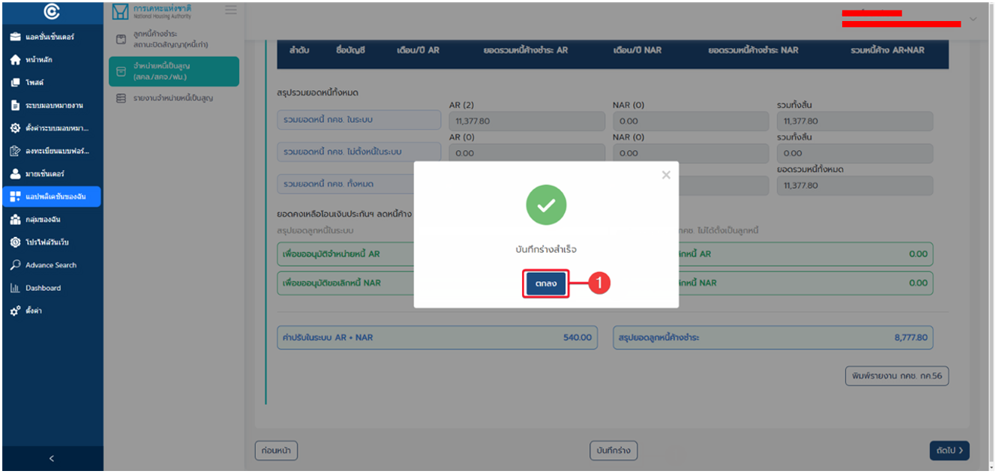<figcaption>
<strong>ภาพที่ 24</strong> Pop up แสดงแจ้งเตือน บันทึกร่างสำเร็จ - หน้าจอเมนูย่อย จำหน่ายหนี้เป็นสูญ (สคล./สคจ./ฟม.)
</figcaption></figure>

หลักจากผู้ใช้งานกดปุ่มบันทึกร่างระบบจะทำการบันทึกข้อมูล และแจ้งเตือนบันทึกข้อมูลสำเร็จ

1. กดปุ่ม ตกลง

### 2.25 เมนูจำหน่ายหนี้เป็นสูญ (สคล./สคจ./ฟม.) : การสร้างข้อมูลจำหน่ายหนี้เป็นสูญ (19) 

<figure>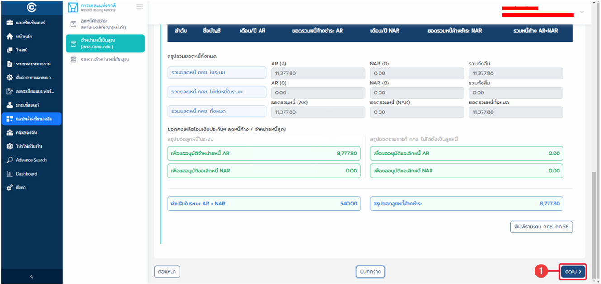<figcaption>
<strong>ภาพที่ 25</strong> ปุ่มถัดไป - หน้าจอเมนูย่อย จำหน่ายหนี้เป็นสูญ (สคล./สคจ./ฟม.)
</figcaption></figure>

1. ปุ่ม ถัดไป : สำหรับดำเนินการขั้นตอนถัดไป

### 2.26 เมนูจำหน่ายหนี้เป็นสูญ (สคล./สคจ./ฟม.) : การสร้างข้อมูลจำหน่ายหนี้เป็นสูญ (21) 

ระบบแสดงแถบการจัดการเอกสาร สำหรับพิมพ์เอกสาร แนบเอกสาร และส่งหัวหน้าหน่วยอนุมัติ

<figure>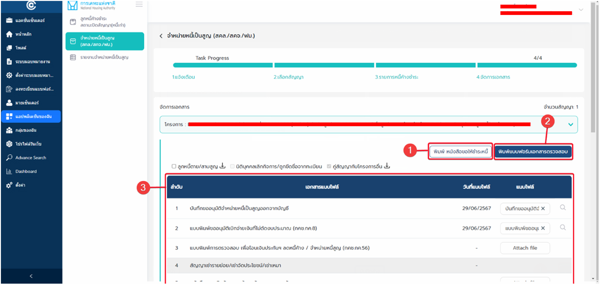<figcaption>
<strong>ภาพที่ 26</strong> แถบจัดการเอกสาร - หน้าจอเมนูย่อย จำหน่ายหนี้เป็นสูญ (สคล./สคจ./ฟม.)
</figcaption></figure>

1. ปุ่ม พิมพ์หนังสือขอให้ชำระหนี้ : สำหรับการพิมพ์หนังสือขอให้ชำระหนี้
2. ปุ่ม พิมพ์แบบฟอร์มเอกสารตรวจสอบ : สำหรับการพิมพ์แบบฟอร์มเอกสารตรวจสอบ
3. รายการเอกสารไฟล์แนบ : สำหรับแนบไฟล์ข้อมูล

### 2.27 เมนูจำหน่ายหนี้เป็นสูญ (สคล./สคจ./ฟม.) : การสร้างข้อมูลจำหน่ายหนี้เป็นสูญ (21) 

หน้าจอจะแสดงผลช่องสำหรับระบุหมายเหตุ เลขที่ส่งเอกสาร

<figure>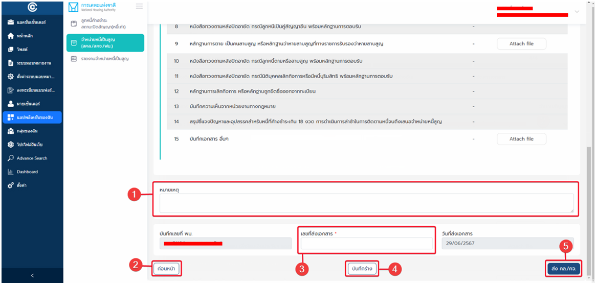<figcaption>
<strong>ภาพที่ 27</strong> ช่องระบุหมายเหตุและเลขที่เอกสาร - หน้าจอเมนูย่อย จำหน่ายหนี้เป็นสูญ (สคล./สคจ./ฟม.)
</figcaption></figure>

1. ข้อมูลหมายเหตุ : สำหรับการกรอกข้อมูลหมายเหตุเพิ่มเติม
2. ปุ่มก่อนหน้า : สำหรับย้อนกลับไปขั้นตอนก่อนหน้า
3. เลขที่ส่งเอกสาร : สำหรับกรอกข้อมูลเลขที่ส่งเอกสาร
4. ปุ่มบันทึกร่าง : สำหรับบันทึกข้อมูล
5. กดปุ่ม ส่ง คล./คจ. : สำหรับส่งข้อมูลไป คล./คจ.

### 2.28 เมนูจำหน่ายหนี้เป็นสูญ (สคล./สคจ./ฟม.) : การสร้างข้อมูลจำหน่ายหนี้เป็นสูญ (22) 

การแสดงแจ้งเตือน กรณีที่ผู้ใช้กด ส่ง คล./คจ. แต่แนบเอกสารไม่ครบ

<figure>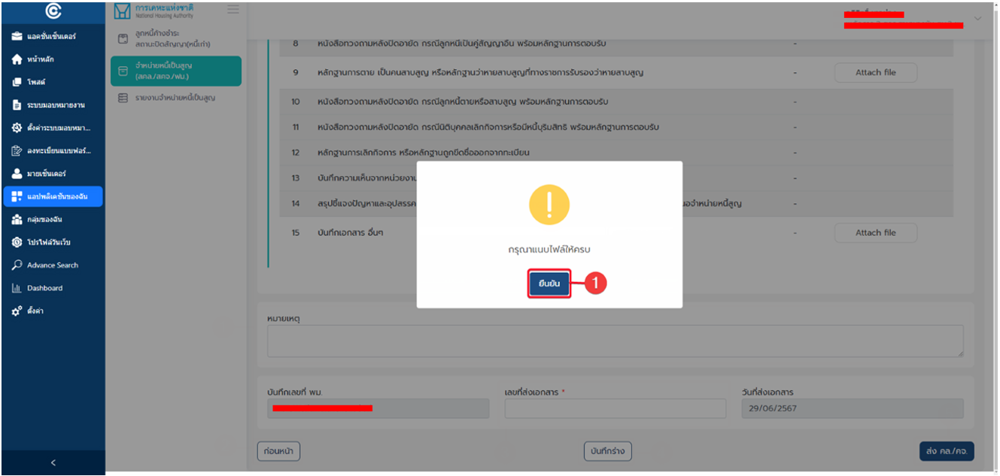<figcaption>
<strong>ภาพที่ 28</strong> Pop up แสดงแจ้งเตือน การแนบไฟล์ - หน้าจอเมนูย่อย จำหน่ายหนี้เป็นสูญ (สคล./สคจ./ฟม.)
</figcaption></figure>

ถ้าหากผู้ใช้งานใส่ไฟล์แนบไม่ครบ และกดปุ่มส่ง คล./คจ.ระบบจะแจ้งเตือนให้ผู้ใช้งานใส่ไฟล์แนบให้ครบ

1. กดปุ่ม ยืนยัน

### 2.29 เมนูจำหน่ายหนี้เป็นสูญ (สคล./สคจ./ฟม.) : การสร้างข้อมูลจำหน่ายหนี้เป็นสูญ (23) 

การแจ้งเตือน กรณีที่ผู้ใช้กด ส่ง คล./คจ. โดยไม่ระบุ บันทึกเลขที่ พม.

<figure><figcaption>
<strong>ภาพที่ 29</strong> Pop up แสดงแจ้งเตือน การกรอกข้อมูล - หน้าจอเมนูย่อย จำหน่ายหนี้เป็นสูญ (สคล./สคจ./ฟม.)
</figcaption></figure>

ถ้าหากผู้ใช้งานไม่กรอกข้อมูลเลขที่ส่งออกเอกสาร และกดปุ่มส่ง คล./คจ.ระบบจะแจ้งเตือนให้ผู้ใช้งานกรอกข้อมูลให้ครบถ้วน

<figure>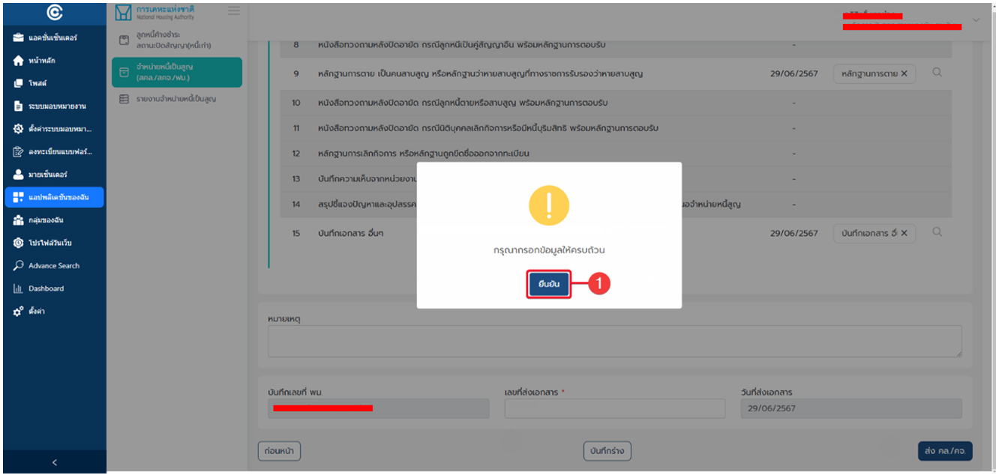<figcaption>
<strong>ภาพที่ 29-1</strong> Pop up แสดงแจ้งเตือน การกรอกข้อมูล - หน้าจอเมนูย่อย จำหน่ายหนี้เป็นสูญ (สคล./สคจ./ฟม.)
</figcaption></figure>

1. กดปุ่ม ยืนยัน

### 2.30 เมนูจำหน่ายหนี้เป็นสูญ (สคล./สคจ./ฟม.) : การสร้างข้อมูลจำหน่ายหนี้เป็นสูญ (24) 

<figure>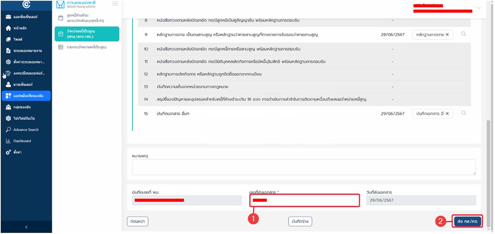<figcaption>
<strong>ภาพที่ 30</strong> การกรอกเลขที่ส่งเอกสาร - หน้าจอเมนูย่อย จำหน่ายหนี้เป็นสูญ (สคล./สคจ./ฟม.)
</figcaption></figure>

1. กรอกข้อมูลเลขที่ส่งเอกสาร : XXXXX
2. กดปุ่มส่ง คล./คจ.

### 2.31 เมนูจำหน่ายหนี้เป็นสูญ (สคล./สคจ./ฟม.) : การสร้างข้อมูลจำหน่ายหนี้เป็นสูญ (25) 

การแสดงแจ้งเตือน เพื่อยืนยันผู้ใช้ กรณีที่ผู้ใช้ต้องการส่งให้หัวหน้าหน่วยอนุมัติ

<figure>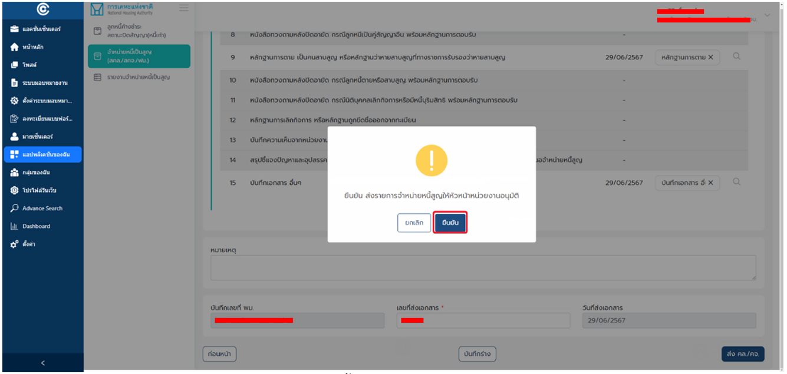<figcaption>
<strong>ภาพที่ 31</strong> Pop up แสดงแจ้งเตือน การยืนยันส่งรายการจำหน่ายหนี้สูญ - หน้าจอเมนูย่อย จำหน่ายหนี้เป็นสูญ (สคล./สคจ./ฟม.)
</figcaption></figure>

ระบบจะแจ้งเตือนยืนยัน ส่งรายการจำหน่ายหนี้เป็นสูญให้หัวหน้าหน่วยงานอนุมัติ

1. กดปุ่ม ยืนยัน

### 2.32 เมนูจำหน่ายหนี้เป็นสูญ (สคล./สคจ./ฟม.) : การสร้างข้อมูลจำหน่ายหนี้เป็นสูญ (26) 

ระบบแสดงแจ้งเตือนแจ้งผู้ใช้งาน ส่งเรื่องไปที่หัวหน้าหน่วยงานสำเร็จ

<figure>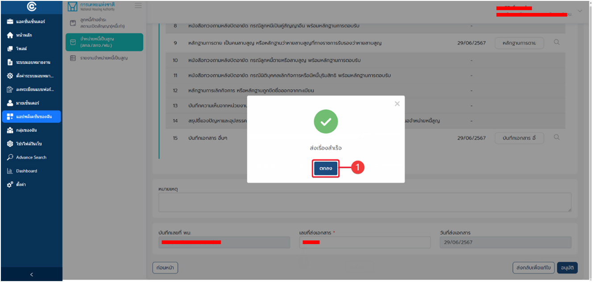<figcaption>
<strong>ภาพที่ 32</strong> Pop up แสดงแจ้งเตือน ส่งเรื่องสำเร็จ - หน้าจอเมนูย่อย จำหน่ายหนี้เป็นสูญ (สคล./สคจ./ฟม.)
</figcaption></figure>

ระบบจะแจ้งเตือนส่งเรื่องสำเร็จ

1. กดปุ่ม ตกลง

### 2.33  เมนูจำหน่ายหนี้เป็นสูญ (สคล./สคจ./ฟม.) : การสร้างข้อมูลจำหน่ายหนี้เป็นสูญ (27) 

หน้าจอแสดงผล เมื่อพนักงานทั่วไปกด ส่ง คล./คจ.

<figure>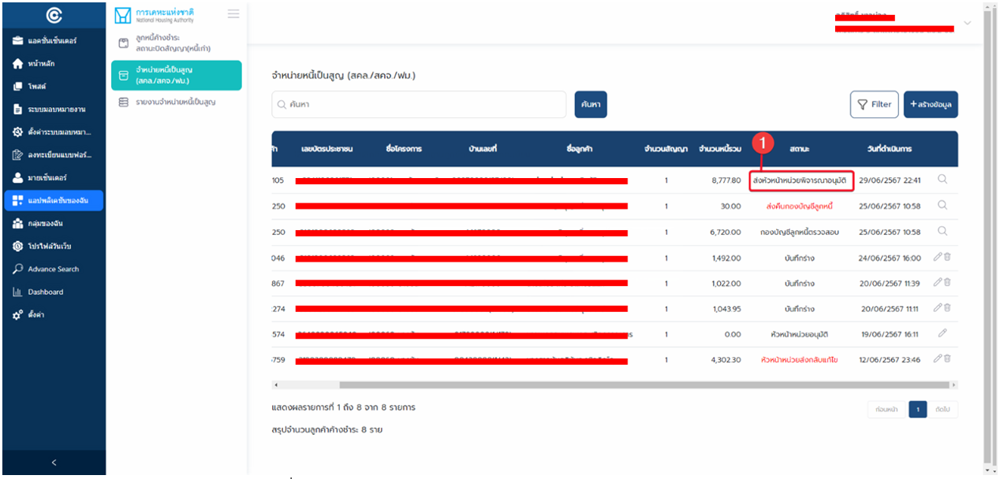<figcaption>
<strong>ภาพที่ 33</strong> การแสดงผล พนักงานทั่วไปกด ส่ง คล./คจ. - หน้าจอเมนูย่อย จำหน่ายหนี้เป็นสูญ (สคล./สคจ./ฟม.)
</figcaption></figure>

1. ระบบแสดงรายการที่ถูกสร้าง และมีสถานะเป็น ส่งหัวหน้าหน่วยพิจารณาอนุมัติ

## 3. ระบบจำหน่ายหนี้เป็นสูญ (Role : หัวหน้าหน่วยงาน) 

### 3.1 หน้าจอเข้าสู่ระบบ 

หน้าจอสำหรับเข้าสู่ระบบของผู้ใช้งาน

<figure>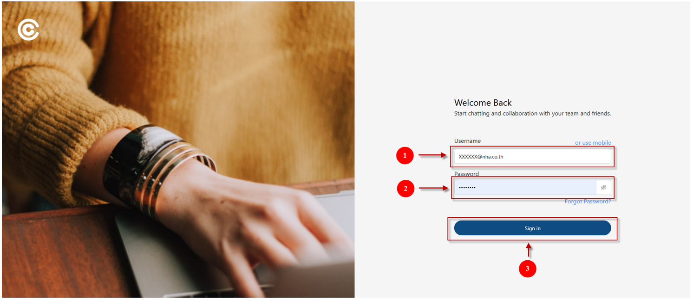<figcaption>
<strong>ภาพที่ 34</strong> หน้าจอการเข้าสู่ระบบ สำหรับผู้ใช้งาน
</figcaption></figure>

1. กรอกชื่อผู้ใช้ : XXXXXX@nha.co.th
2. กรอกรหัสผ่าน : XXXXXXX
3. กดปุ่ม (เข้าสู่ระบบ)

### 3.2 หน้าจอหลัก 

หน้าจอหลัก สำหรับเลือกใช้งานเมนูต่าง ๆ ที่มีอยู่ในระบบ

<figure>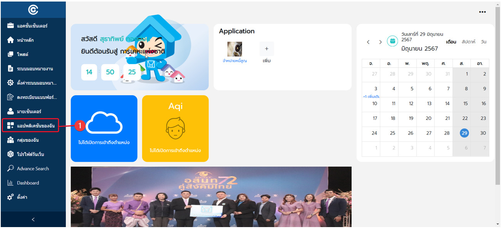<figcaption>
<strong>ภาพที่ 35</strong> หน้าจอหลัก
</figcaption></figure>

1. กดเมนูย่อย (แอปพลิเคชันของฉัน)

### 3.3 หน้าจอเมนูย่อย (แอปพลิเคชันของฉัน) 

หน้าจอสำหรับการเลือกใช้งานแอปพลิเคชัน โดยจะแสดงแอปพลิเคชันต่างกัน ตาม role ของผู้ใช้งาน

<figure>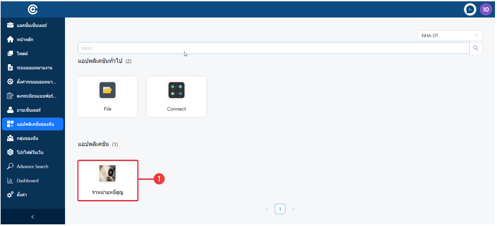<figcaption>
<strong>ภาพที่ 36</strong> หน้าจอการเลือกใช้งานแอปพลิเคชัน
</figcaption></figure>

1. กดแอปพลิเคชัน (จำหน่ายหนี้เป็นสูญ)

### 3.4 หน้าจอแรกระบบจำหน่ายหนี้เป็นสูญ (Role : เจ้าหน้าที่ทั่วไป) 

หน้าจอ จำหน่ายหนี้เป็นสูญ โดยจะแสดงเมนูย่อยของแอปพลิเคชันจำหน่ายหนี้เป็นสูญ ซึ่งจะแสดงผลเมนูต่างกัน ตาม role ของผู้ใช้

<figure><figcaption>
<strong>ภาพที่ 37</strong> หน้าจอ จำหน่ายหนี้เป็นสูญ
</figcaption></figure>

1. เมนู ลูกหนี้ค้างชำระสถานะปิดสัญญา (หนี้เก่า)
2. กดเมนู จำหน่ายหนี้เป็นสูญ (สคล./สคจ./ฟม.)
3. เมนู รายงานจำหน่ายหนี้เป็นสูญ

### 3.5 เมนูจำหน่ายหนี้เป็นสูญ (สคล./สคจ./ฟม.) 

หน้าจอเมนูย่อย สำหรับการแสดงสัญญา ที่พนักงานทั่วไปส่งขออนุมัติ และสัญญาที่หัวหน้าหน่วยงานส่งกลับแก้ไข หรืออนุมัติแล้ว

<figure><figcaption>
<strong>ภาพที่ 38</strong> หน้าจอเมนูย่อย การแสดงสัญญา - จำหน่ายหนี้เป็นสูญ (สคล./สคจ./ฟม.)
</figcaption></figure>

1. Search Box (กล่องค้นหา) : สำหรับการค้นหาข้อมูล
2. ปุ่ม Filter : สำหรับการกรองข้อมูล
3. กดการพิจารณารายการข้อมูลจำหน่ายหนี้เป็นสูญ (สคล./สคจ./ฟม.) : สำหรับการตรวจสอบรายการจำหน่ายหนี้เป็นสูญที่ มีสถานะ ส่งหัวหน้าพิจารณาอนุมัติ
4. การตรวจสอบรายการจำหน่ายหนี้เป็นสูญ (สคล./สคจ./ฟม.) : สำหรับการตรวจสอบรายการจำหน่ายหนี้เป็นสูญที่มีสถานะ หัวหน้าหน่วยนุมัติ และหัวหน้าหน่วยส่งกลับแก้ไข

### 3.6 เมนูจำหน่ายหนี้เป็นสูญ (สคล./สคจ./ฟม.) : การพิจารณาจากหัวหน้าหน่วย (1) 

ระบบแสดงแถบการแจ้งเตือน เพื่อแจ้งเตือนผู้ใช้ ก่อนจะมีอนุมัติข้อมูล

<figure>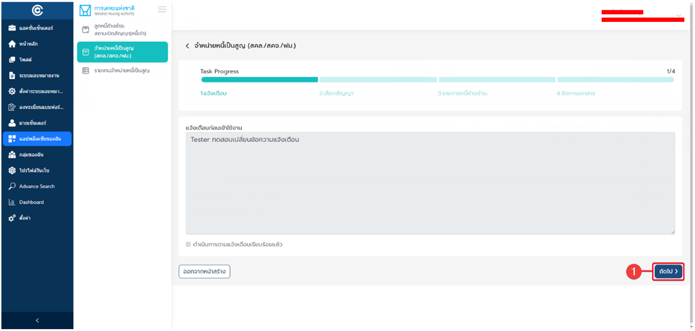<figcaption>
<strong>ภาพที่ 39</strong> ปุ่มดำเนินการและแถบการแจ้งเตือนก่อนการอนุมัติ - จำหน่ายหนี้เป็นสูญ (สคล./สคจ./ฟม.)
</figcaption></figure>

1. กดปุ่ม ถัดไป : สำหรับการพิจารณาตรวจสอบขั้นตอนถัดไป

### 3.7 เมนูจำหน่ายหนี้เป็นสูญ (สคล./สคจ./ฟม.) : การพิจารณาจากหัวหน้าหน่วย (2) 

ระบบจะแสดงผลสัญญา ที่พนักงานทั่วไปส่งข้อมูลมาขออนุมัติ

<figure>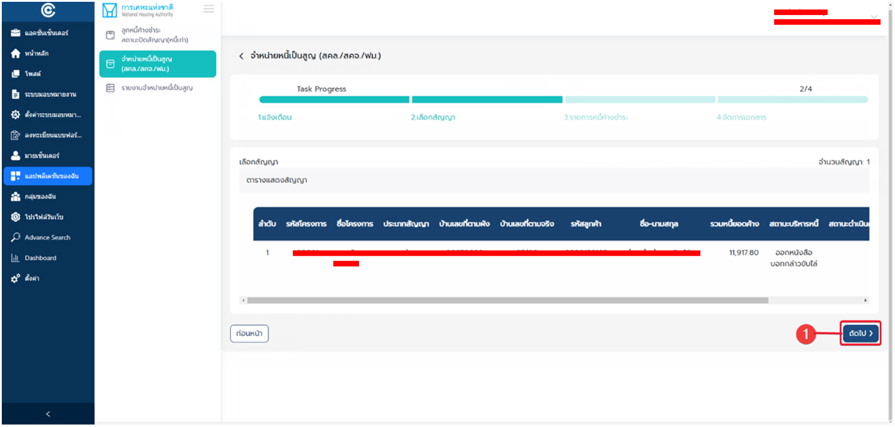<figcaption>
<strong>ภาพที่ 40</strong> ปุ่มดำเนินการและแถบการเลือกสัญญา - จำหน่ายหนี้เป็นสูญ (สคล./สคจ./ฟม.)
</figcaption></figure>

1. กดปุ่ม ถัดไป : สำหรับการพิจารณาตรวจสอบขั้นตอนถัดไป

### 3.8 เมนูจำหน่ายหนี้เป็นสูญ (สคล./สคจ./ฟม.) : การพิจารณาจากหัวหน้าหน่วย (3) 

ระบบจะแสดงผลหน้าจอ รายการหนี้ค้างชำระ เพื่อให้หัวหน้าหน่วย ตรวจสอบข้อมูล

<figure>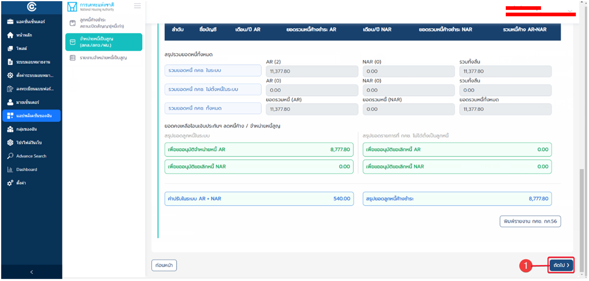<figcaption>
<strong>ภาพที่ 41</strong> รายการหนี้ค้างชำระ - จำหน่ายหนี้เป็นสูญ (สคล./สคจ./ฟม.)
</figcaption></figure>

1. กดปุ่ม ถัดไป : สำหรับการพิจารณาตรวจสอบขั้นตอนถัดไป

### 3.9 เมนูจำหน่ายหนี้เป็นสูญ (สคล./สคจ./ฟม.) : การพิจารณาจากหัวหน้าหน่วย (4) 

ระบบจะแสดงหน้าจอ จัดการเอกสาร เพื่อให้หัวหน้าหน่วยพิจารณาอนุมัติ หรือส่งกลับแก้ไข

<figure>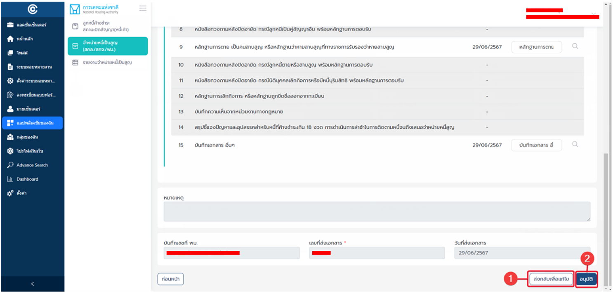<figcaption>
<strong>ภาพที่ 42</strong> การจัดการเอกสาร - จำหน่ายหนี้เป็นสูญ (สคล./สคจ./ฟม.)
</figcaption></figure>

1. ปุ่ม ส่งกลับเพื่อแก้ไข : สำหรับการส่งกลับเพื่อแก้ไขข้อมูลรายการจำหน่ายหนี้เป็นสูญ
2. กดปุ่ม อนุมัติ : สำหรับ XXX

### 3.10 เมนูจำหน่ายหนี้เป็นสูญ (สคล./สคจ./ฟม.) : การพิจารณาจากหัวหน้าหน่วย (5) 

ระบบแสดงแจ้งเตือนยืนยันการอนุมัติของหัวหน้าหน่วยงาน

<figure><figcaption>
<strong>ภาพที่ 43</strong> Pop up แสดงแจ้งเตือน ยืนยันอนุมัติ - หน้าจอเมนูย่อย จำหน่ายหนี้เป็นสูญ (สคล./สคจ./ฟม.)
</figcaption></figure>

ระบบจะแจ้งเตือนยืนยัน การอนุมัติ

1. กดปุ่ม ยืนยัน

### 3.11 เมนูจำหน่ายหนี้เป็นสูญ (สคล./สคจ./ฟม.) : การพิจารณาจากหัวหน้าหน่วย (6) 

ระบบแสดงแจ้งเตือนยืนยันการส่งข้อมูลสำเร็จ

<figure>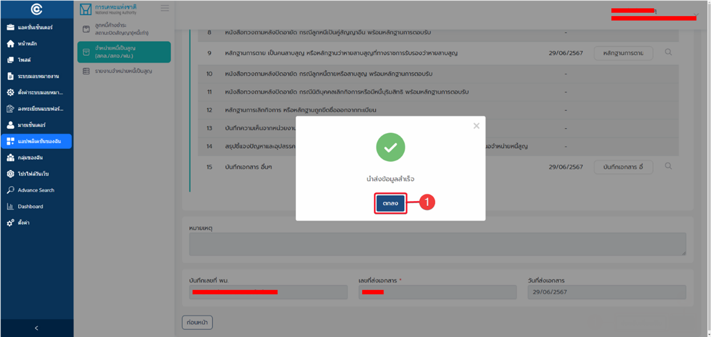<figcaption>
<strong>ภาพที่ 44</strong> Pop up แสดงแจ้งเตือน นำส่งข้อมูลสำเร็จ - หน้าจอเมนูย่อย จำหน่ายหนี้เป็นสูญ (สคล./สคจ./ฟม.)
</figcaption></figure>

ระบบจะแจ้งเตือนการนำส่งข้อมูลสำเร็จ

1. กดปุ่ม ตกลง

### 3.12 เมนูจำหน่ายหนี้เป็นสูญ (สคล./สคจ./ฟม.) : การพิจารณาจากหัวหน้าหน่วย (7) 

ระบบจะแสดงรายการสัญญาที่ทำการอนุมัติ

<figure>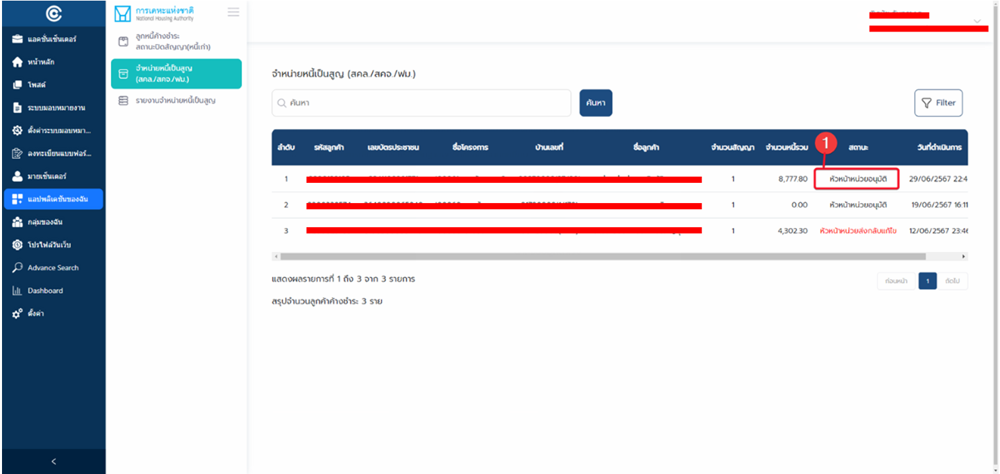<figcaption>
<strong>ภาพที่ 45</strong> รายการสัญญาที่ทำการอนุมัติ - หน้าจอเมนูย่อย จำหน่ายหนี้เป็นสูญ (สคล./สคจ./ฟม.)
</figcaption></figure>

1. ระบบเปลี่ยนสถานะรายการจำหน่ายหนี้เป็นสูญจาก ส่งหัวหน้าหน่วยพิจารณาอนุมัติ เป็นหัวหน้าหน่วยพิจารณาอนุมัติ

## 4. ระบบจำหน่ายหนี้เป็นสูญ (Role : ผู้ตรวจสอบ) 

### 4.1 หน้าจอเข้าสู่ระบบ 

หน้าจอสำหรับเข้าสู่ระบบของผู้ใช้งาน

<figure><figcaption>
<strong>ภาพที่ 46</strong> หน้าจอการเข้าสู่ระบบ สำหรับผู้ใช้งาน
</figcaption></figure>

1. กรอกชื่อผู้ใช้ : XXXXXX@nha.co.th
2. กรอกรหัสผ่าน : XXXXXXX
3. กดปุ่ม (เข้าสู่ระบบ)

### 4.2 หน้าจอหลัก 

หน้าจอหลัก สำหรับเลือกใช้งานเมนูต่าง ๆ ที่มีอยู่ในระบบ

<figure>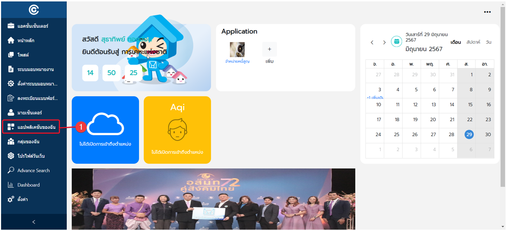<figcaption>
<strong>ภาพที่ 47</strong> หน้าจอหลัก
</figcaption></figure>

1. กดเมนูย่อย (แอปพลิเคชันของฉัน)

### 4.3 หน้าจอเมนูย่อย (แอปพลิเคชันของฉัน) 

หน้าจอสำหรับการเลือกใช้งานแอปพลิเคชัน โดยจะแสดงแอปพลิเคชันต่างกัน ตาม role ของผู้ใช้งาน

<figure><figcaption>
<strong>ภาพที่ 48</strong> หน้าจอการเลือกใช้งานแอปพลิเคชัน
</figcaption></figure>

1. กดแอปพลิเคชัน (จำหน่ายหนี้เป็นสูญ)

### 4.4 หน้าจอแรกระบบจำหน่ายหนี้เป็นสูญ (Role : กองบริหารงานชุมชน) 

ระบบแสดงหน้าจอ จำหน่ายหนี้เป็นสูญ โดยจะแสดงเมนูย่อยของแอปพลิเคชันจำหน่ายหนี้เป็นสูญ ซึ่งจะแสดงผลเมนูต่างกัน ตาม role ของผู้ใช้

<figure>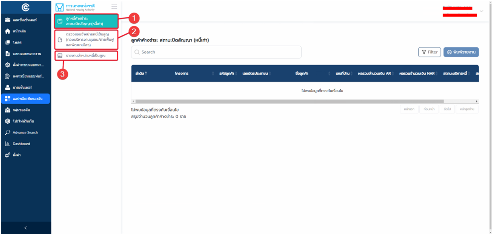<figcaption>
<strong>ภาพที่ 49</strong> หน้าจอ จำหน่ายหนี้เป็นสูญ
</figcaption></figure>

1. เมนู ลูกหนี้ค้างชำระสถานะปิดสัญญา (หนี้เก่า)
2. กดเมนู ตรวจสอบจำหน่ายหนี้เป็นสูญ (กองบริหารงานชุมชน/ผ่ายฟื้นฟูและพัฒนาเมือง)
3. เมนู รายงานจำหน่ายหนี้เป็นสูญ

### 4.5 เมนูตรวจสอบจำหน่ายหนี้เป็นสูญ (กองบริหารงานชุมชน/ฝ่ายฟื้นฟูและพัฒนาเมือง) : การตรวจสอบพิจารณากองบริหารชุมชนพิจารณา (1) 

ระบบแสดงหน้าจอตรวจสอบจำหน่ายหนี้เป็นสูญ และแสดงรายการที่มีการส่งมาจากพนักงานทั่วไป

<figure>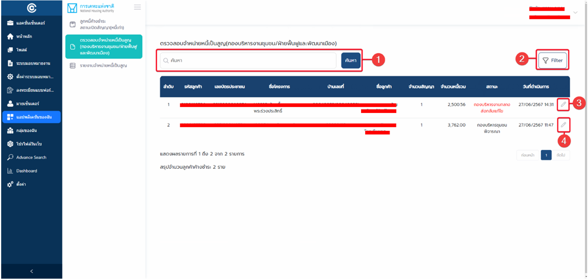<figcaption>
<strong>ภาพที่ 50</strong> หน้าจอเมนูย่อย ตรวจสอบจำหน่ายหนี้เป็นสูญ - จำหน่ายหนี้เป็นสูญ (กองบริหารงานชุมชน/ฝ่ายฟื้นฟูและพัฒนาเมือง)
</figcaption></figure>

1. Search Box (กล่องค้นหา) : สำหรับการค้นหาข้อมูล
2. ปุ่ม Filter : สำหรับการกรองข้อมูล
3. การตรวจสอบจำหน่ายหนี้เป็นสูญ(กองบริหารงานชุมชน/ฝ่ายฟื้นฟูและพัฒนาเมือง) : สำหรับการตรวจสอบจำหน่ายหนี้เป็นสูญ(กองบริหารงานชุมชน/ฝ่ายฟื้นฟูและพัฒนาเมือง)ที่มีสถานะ กองบริหารงานกลางส่งกลับแก้ไข
4. กดการตรวจสอบจำหน่ายหนี้เป็นสูญ(กองบริหารงานชุมชน/ฝ่ายฟื้นฟูและพัฒนาเมือง) : สำหรับการตรวจสอบจำหน่ายหนี้เป็นสูญ(กองบริหารงานชุมชน/ฝ่ายฟื้นฟูและพัฒนาเมือง)ที่มีสถานะ กองบริหารชุมชนพิจารณา

### 4.6 เมนูตรวจสอบจำหน่ายหนี้เป็นสูญ (กองบริหารงานชุมชน/ฝ่ายฟื้นฟูและพัฒนาเมือง) : การตรวจสอบพิจารณากองบริหารชุมชนพิจารณา (2) 

ระบบจะแสดงแถบ รายการหนี้ค้างชำระ เพื่อให้กองบริหารชุมชนตรวจสอบ

<figure><figcaption>
<strong>ภาพที่ 51</strong> แถบรายการหนี้ค้างชำระ - จำหน่ายหนี้เป็นสูญ (กองบริหารงานชุมชน/ฝ่ายฟื้นฟูและพัฒนาเมือง)
</figcaption></figure>

1. กดปุ่ม ถัดไป : สำหรับการพิจารณาตรวจสอบขั้นตอนถัดไป

### 4.7 เมนูตรวจสอบจำหน่ายหนี้เป็นสูญ (กองบริหารงานชุมชน/ฝ่ายฟื้นฟูและพัฒนาเมือง) : การตรวจสอบพิจารณากองบริหารชุมชนพิจารณา (3) 

ระบบแสดงแถบ จัดการเอกสาร เพื่อให้กองบริหารชุมชนดูและ ตรวจสอบเอกสาร อนุมัติ หรือส่งกลับแก้ไขงาน

<figure>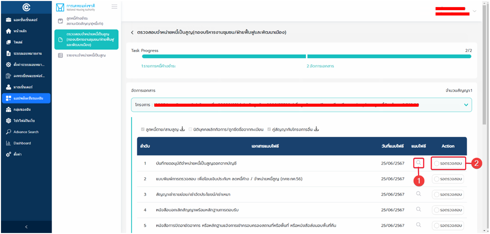<figcaption>
<strong>ภาพที่ 52</strong> แถบจัดการเอกสาร - จำหน่ายหนี้เป็นสูญ (กองบริหารงานชุมชน/ฝ่ายฟื้นฟูและพัฒนาเมือง)
</figcaption></figure>

1. ปุ่ม ตรวจสอบ : สำหรับการตรวจสอบเอกสารแนบ
2. ปุ่ม Check Action : สำหรับรายการที่ตรวจสอบข้อมูลไฟล์แนบเรียบร้อย

### 4.8 เมนูตรวจสอบจำหน่ายหนี้เป็นสูญ (กองบริหารงานชุมชน/ฝ่ายฟื้นฟูและพัฒนาเมือง) : การตรวจสอบพิจารณากองบริหารชุมชนพิจารณา (4) 

หน้าจอแสดงการส่งกองบริหารงานกลางตรวจสอบ

<figure>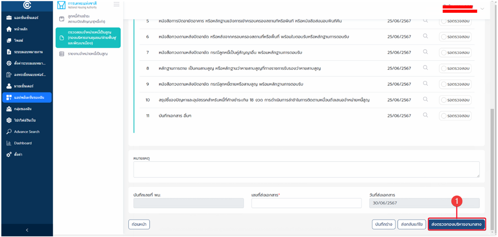<figcaption>
<strong>ภาพที่ 53</strong> การส่งกองบริหารงานกลางตรวจสอบ - จำหน่ายหนี้เป็นสูญ (กองบริหารงานชุมชน/ฝ่ายฟื้นฟูและพัฒนาเมือง)
</figcaption></figure>

1. กดปุ่ม ส่งตรวจกองบริหารงานกลาง : สำหรับการส่งตรวจบริหารงานกลาง

### 4.9 เมนูตรวจสอบจำหน่ายหนี้เป็นสูญ (กองบริหารงานชุมชน/ฝ่ายฟื้นฟูและพัฒนาเมือง) : การตรวจสอบพิจารณากองบริหารชุมชนพิจารณา (5) 

ระบบแสดงแจ้งเตือน กรณีที่ผู้ใช้กดส่งกองบริหารงานกลางตรวจสอบ โดยไม่ได้ระบุ เลขที่ส่งเอกสาร

<figure>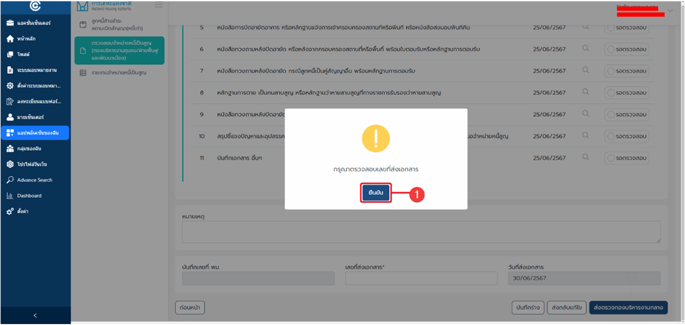<figcaption>
<strong>ภาพที่ 54</strong> Pop up แสดงแจ้งเตือน ระบุเลขที่ส่งเอกสาร - จำหน่ายหนี้เป็นสูญ (กองบริหารงานชุมชน/ฝ่ายฟื้นฟูและพัฒนาเมือง)
</figcaption></figure>

หากยังไม่มีการกรอกเลขที่ส่งเอกสาร และกดปุ่มส่งตรวจกองบริหารงานกลางระบบจะแจ้งเตือนให้ตรวจสอบเลขที่ส่งเอกสาร

1. กดปุ่ม ยืนยัน

### 4.10 เมนูตรวจสอบจำหน่ายหนี้เป็นสูญ (กองบริหารงานชุมชน/ฝ่ายฟื้นฟูและพัฒนาเมือง) : การตรวจสอบพิจารณากองบริหารชุมชนพิจารณา (6) 

<figure>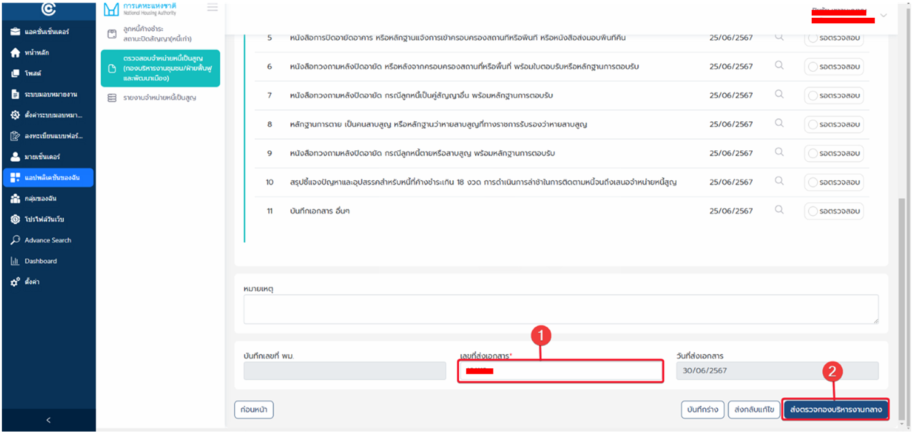<figcaption>
<strong>ภาพที่ 55</strong> การระบุเลขที่ส่งเอกสารและส่งตรวจกองบริหารงานกลาง - จำหน่ายหนี้เป็นสูญ (กองบริหารงานชุมชน/ฝ่ายฟื้นฟูและพัฒนาเมือง)
</figcaption></figure>

1. กรอกเลขที่ส่งเอกสาร : xxxxx
2. กดปุ่ม ส่งตรวจกองบริหารงานกลาง : สำหรับการส่งตรวจบริหารงบกลาง

### 4.11 เมนูตรวจสอบจำหน่ายหนี้เป็นสูญ (กองบริหารงานชุมชน/ฝ่ายฟื้นฟูและพัฒนาเมือง) : การตรวจสอบพิจารณากองบริหารชุมชนพิจารณา (7) 

ระบบแสดงแจ้งเตือน กรณีที่ผู้ใช้กดส่งกองบริหารงานกลางตรวจสอบ โดยไม่ได้ตรวจสอบเอกสาร

<figure>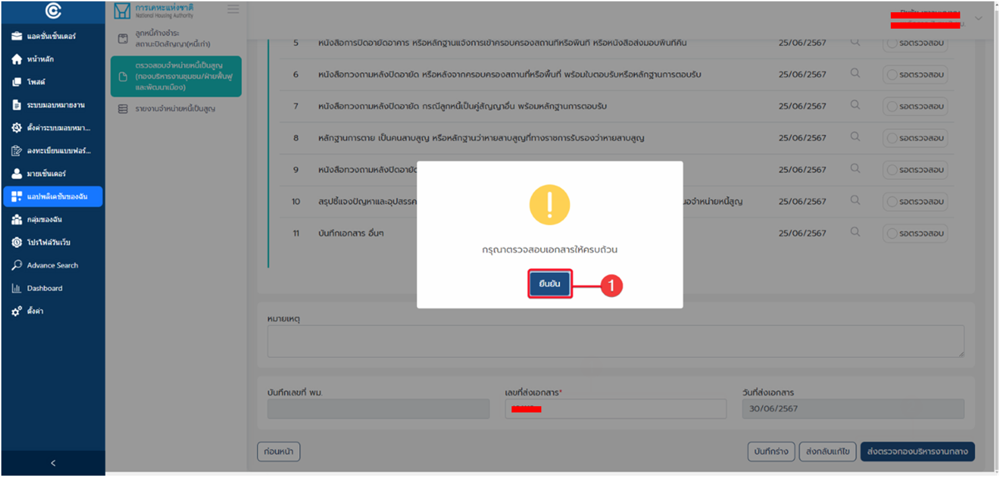<figcaption>
<strong>ภาพที่ 56</strong> Pop up แสดงแจ้งเตือน ตรวจสอบเอกสาร - จำหน่ายหนี้เป็นสูญ (กองบริหารงานชุมชน/ฝ่ายฟื้นฟูและพัฒนาเมือง)
</figcaption></figure>

หากผูใช้งานยังตรวจสอบเอกสารแนบไม่ครบถ้วน และกดปุ่มส่งตรวจกองบริหารงานกลางระบบจะแจ้งเตือนให้ตรวจสอบเอกสารให้ครบถ้วน

1. กดปุ่ม ยืนยัน

### 4.12 เมนูตรวจสอบจำหน่ายหนี้เป็นสูญ (กองบริหารงานชุมชน/ฝ่ายฟื้นฟูและพัฒนาเมือง) : การตรวจสอบพิจารณากองบริหารชุมชนพิจารณา (8) 

หน้าจอจะแสดงผลการตรวจสอบเอกสาร โดย Check Action จะเปลี่ยนเป็น ตรวจสอบแล้ว

<figure>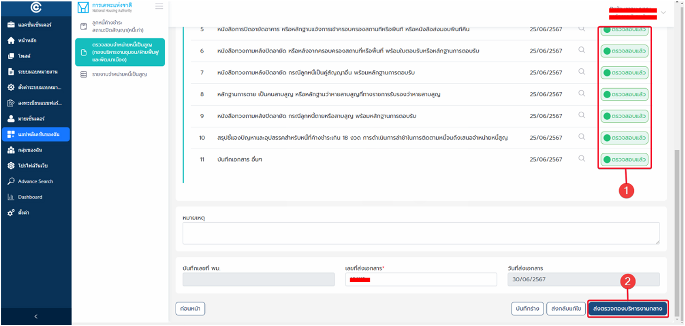<figcaption>
<strong>ภาพที่ 57</strong> แสดงผลการตรวจสอบเอกสาร - จำหน่ายหนี้เป็นสูญ (กองบริหารงานชุมชน/ฝ่ายฟื้นฟูและพัฒนาเมือง)
</figcaption></figure>

1. กดปุ่ม Check Action : ทุกรายการ
2. กดปุ่ม ส่งตรวจกองบริหารงานกลาง

### 4.13 เมนูตรวจสอบจำหน่ายหนี้เป็นสูญ (กองบริหารงานชุมชน/ฝ่ายฟื้นฟูและพัฒนาเมือง) : การตรวจสอบพิจารณากองบริหารชุมชนพิจารณา (9) 

หน้าจอแสดงผลแจ้งเตือน ยืนยันการส่งกองบริหารงานกลางตรวจสอบ

<figure>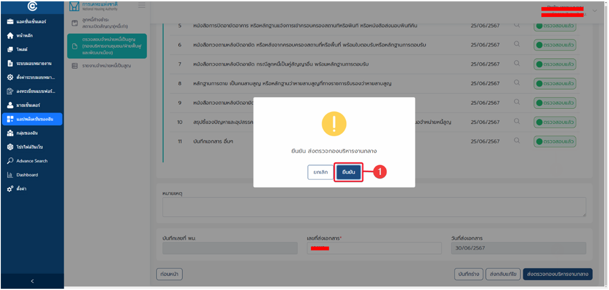<figcaption>
<strong>ภาพที่ 58</strong> Pop up แสดงแจ้งเตือน ยืนยันส่งตรวจกองบริหารงานกลาง - จำหน่ายหนี้เป็นสูญ (กองบริหารงานชุมชน/ฝ่ายฟื้นฟูและพัฒนาเมือง)
</figcaption></figure>

ระบบแจ้งเตือนต้องการยืนยันการส่งตรวจกองบริหารงากลางหรือไม่

1. กดปุ่ม ยืนยัน

### 4.14 เมนูตรวจสอบจำหน่ายหนี้เป็นสูญ (กองบริหารงานชุมชน/ฝ่ายฟื้นฟูและพัฒนาเมือง) : การตรวจสอบพิจารณากองบริหารชุมชนพิจารณา (10) 

ระบบจะแสดงผลแจ้งเตือน เพื่อยืนยันการส่งข้อมูลของผู้ใช้สำเร็จ

<figure>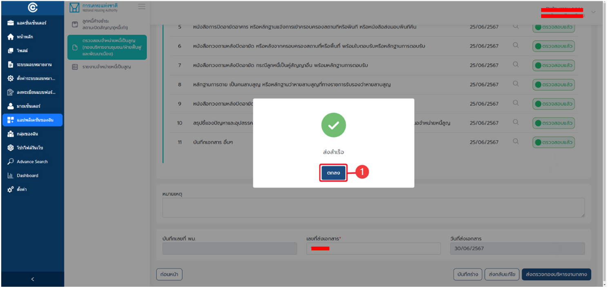<figcaption>
<strong>ภาพที่ 59</strong> Pop up แสดงแจ้งเตือน ส่งสำเร็จ - จำหน่ายหนี้เป็นสูญ (กองบริหารงานชุมชน/ฝ่ายฟื้นฟูและพัฒนาเมือง)
</figcaption></figure>

ระบบแจ้งเตือนการส่งข้อมูลสำเร็จ

1. กดปุ่ม ตกลง

## 5. จำหน่ายหนี้เป็นสูญ (Role : ผู้ตรวจสอบ) 

### 5.1 หน้าจอเข้าสู่ระบบ 

หน้าจอสำหรับเข้าสู่ระบบของผู้ใช้งาน

<figure><figcaption>
<strong>ภาพที่ 60</strong> หน้าจอการเข้าสู่ระบบ สำหรับผู้ใช้งาน
</figcaption></figure>

1. กรอกชื่อผู้ใช้ : XXXXXX@nha.co.th
2. กรอกรหัสผ่าน : XXXXXXXX
3. กดปุ่ม (เข้าสู่ระบบ)

### 5.2 หน้าจอหลัก 

หน้าจอหลัก สำหรับเลือกใช้งานเมนูต่าง ๆ ที่มีอยู่ในระบบ

<figure>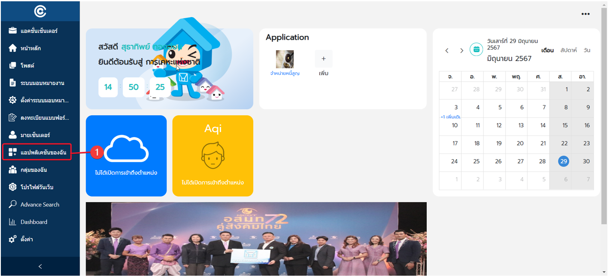<figcaption>
<strong>ภาพที่ 61</strong> หน้าจอหลัก
</figcaption></figure>

1. กดเมนูย่อย (แอปพลิเคชันของฉัน)

### 5.3 หน้าจอเมนูย่อย (แอปพลิเคชันของฉัน) 

หน้าจอสำหรับการเลือกใช้งานแอปพลิเคชัน โดยจะแสดงแอปพลิเคชันต่างกัน ตาม role ของผู้ใช้งาน

<figure>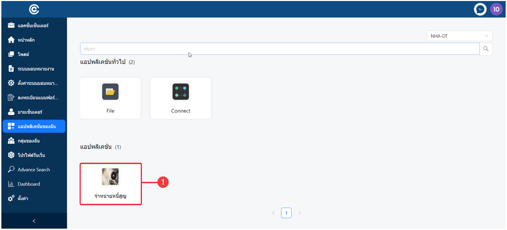<figcaption>
<strong>ภาพที่ 62</strong> หน้าจอการเลือกใช้งานแอปพลิเคชัน
</figcaption></figure>

1. กดแอปพลิเคชัน (จำหน่ายหนี้เป็นสูญ)

### 5.4 หน้าจอแรกระบบจำหน่ายหนี้เป็นสูญ (Role : กองบริหารงานกลาง) 

หน้าจอ จำหน่ายหนี้เป็นสูญ โดยจะแสดงเมนูย่อยของแอปพลิเคชันจำหน่ายหนี้เป็นสูญ ซึ่งจะแสดงผลเมนูต่างกัน ตาม role ของผู้ใช้

<figure>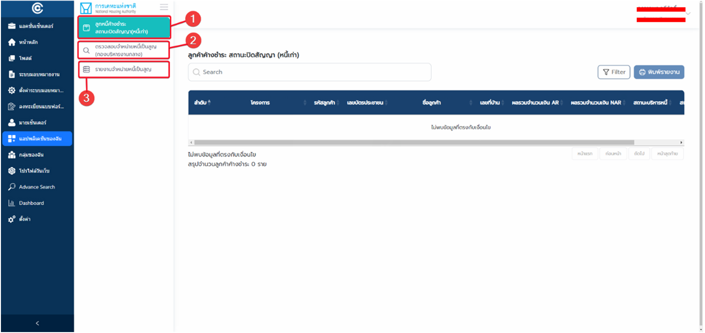<figcaption>
<strong>ภาพที่ 63</strong> หน้าจอ จำหน่ายหนี้เป็นสูญ
</figcaption></figure>

1. เมนู ลูกหนี้ค้างชำระสถานะปิดสัญญา (หนี้เก่า)
2. กดเมนู ตรวจสอบจำหน่ายหนี้เป็นสูญ (กองบริหารงานกลาง)
3. เมนู รายงานจำหน่ายหนี้เป็นสูญ

### 5.5 เมนูตรวจสอบจำหน่ายหนี้เป็นสูญ (กองบริหารงานกลาง) : การตรวจสอบพิจารณากองบริหารงานกลาง (1) 

หน้าจอเมนูย่อย สำหรับการแสดงสัญญา ที่ถูกส่งตรวจสอบมาจากกองบริหารงานชุมชน

<figure>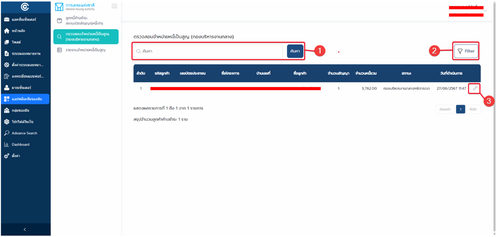<figcaption>
<strong>ภาพที่ 64</strong> หน้าจอเมนูย่อย การแสดงสัญญา - จำหน่ายหนี้เป็นสูญ (กองบริหารงานกลาง)
</figcaption></figure>

1. Search Box (กล่องค้นหา): สำหรับการค้นหาข้อมูล
2. ปุ่ม Filter : สำหรับการกรองข้อมูล
3. กดการตรวจสอบตรวจสอบจำหน่ายหนี้เป็นสูญ (กองบริหารงานกลาง) : สำหรับการตรวจสอบจำหน่ายหนี้เป็นสูญ (กองบริหารงานกลาง) ที่มีสถานะ กองบริหารงานกลางฯพิจารณา

### 5.6 เมนูตรวจสอบจำหน่ายหนี้เป็นสูญ (กองบริหารงานกลาง) : การตรวจสอบพิจารณากองบริหารงานกลาง (2) 

ระบบจะแสดงแถบ รายการหนี้ค้างชำระ เพื่อให้กองบริหารงานกลางตรวจสอบข้อมูล

<figure>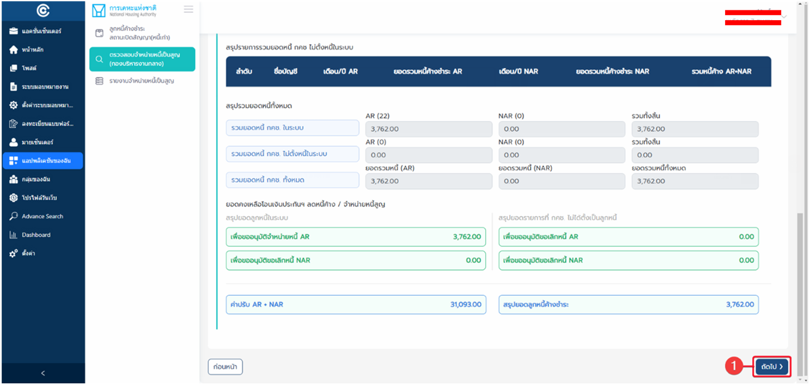<figcaption>
<strong>ภาพที่ 65</strong> แถบรายการหนี้ค้างชำระ - จำหน่ายหนี้เป็นสูญ (กองบริหารงานกลาง)
</figcaption></figure>

1. กดปุ่ม ถัดไป : สำหรับการพิจารณาตรวจสอบขั้นตอนถัดไป

### 5.7 เมนูตรวจสอบจำหน่ายหนี้เป็นสูญ (กองบริหารงานกลาง) : การตรวจสอบพิจารณากองบริหารงานกลาง (3) 

ระบบแสดงแถบ จัดการเอกสาร เพื่อให้กองบริหารงานกลางตรวจสอบเอกสาร

<figure>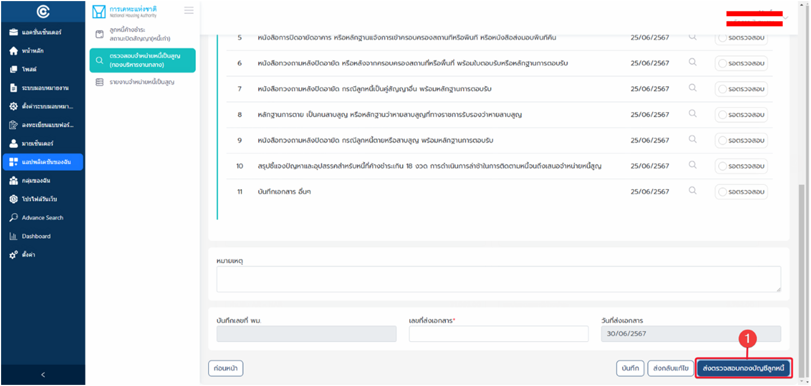<figcaption>
<strong>ภาพที่ 66</strong> แถบจัดการเอกสาร - จำหน่ายหนี้เป็นสูญ (กองบริหารงานกลาง)
</figcaption></figure>

1. กดปุ่ม ส่งตรวจกองบัญชีลูกหนี้ : สำหรับการส่งตรวจสอบกองบัญชีลูกหนี้

### 5.8 เมนูตรวจสอบจำหน่ายหนี้เป็นสูญ (กองบริหารงานกลาง) : การตรวจสอบพิจารณากองบริหารงานกลาง (4) 

ระบบแสดงแจ้งเตือน ในกรณีที่ผู้ใช้กด ส่งตรวจกองบัญชีลูกหนี้ โดยไม่ระบุเลขที่ส่งเอกสาร

<figure><figcaption>
<strong>ภาพที่ 67</strong> Pop up แสดงแจ้งเตือน ระบุเลขที่ส่งเอกสาร - หน้าจอเมนูย่อย จำหน่ายหนี้เป็นสูญ (กองบริหารงานกลาง)
</figcaption></figure>

หากยังไม่มีการกรอกเลขที่ส่งเอกสาร และกดปุ่มส่งตรวจสอบกองบัญชีลูกหนี้ ระบบจะแจ้งเตือนให้ตรวจสอบเลขที่ส่งเอกสาร

1. กดปุ่ม ยืนยัน

### 5.9 เมนูตรวจสอบจำหน่ายหนี้เป็นสูญ (กองบริหารงานกลาง) : การตรวจสอบพิจารณากองบริหารงานกลาง (5) 

ระบบแสดงแจ้งเตือน ในกรณีที่ผู้ใช้กด ส่งตรวจกองบัญชีลูกหนี้ โดยยังไม่ตรวจสอบเอกสาร

<figure>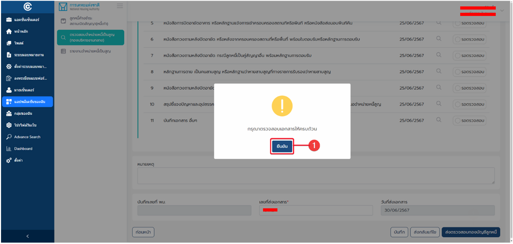<figcaption>
<strong>ภาพที่ 68</strong> Pop up แสดงแจ้งเตือน ตรวจสอบเอกสาร - หน้าจอเมนูย่อย จำหน่ายหนี้เป็นสูญ (กองบริหารงานกลาง)
</figcaption></figure>

หากผูใช้งานยังตรวจสอบเอกสารแนบไม่ครบถ้วน และกดปุ่มส่งตรวจสอบกองบัญชีลูกหนี้ระบบจะแจ้งเตือนให้ตรวจสอบเอกสารให้ครบถ้วน

1. กดปุ่ม ยืนยัน

### 5.10 เมนูตรวจสอบจำหน่ายหนี้เป็นสูญ (กองบริหารงานกลาง) : การตรวจสอบพิจารณากองบริหารงานกลาง (6) 

หน้าจอจะแสดงผลการตรวจสอบเอกสาร โดย Check Action จะถูกเปลี่ยนเป็น ตรวจสอบแล้ว

<figure>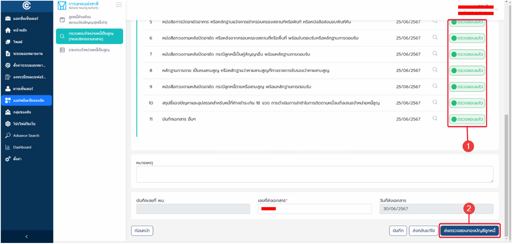<figcaption>
<strong>ภาพที่ 69</strong> แสดงผลการตรวจสอบเอกสาร - หน้าจอเมนูย่อย จำหน่ายหนี้เป็นสูญ (กองบริหารงานกลาง)
</figcaption></figure>

1. กดปุ่ม Check Action : ทุกรายการ
2. กดปุ่ม ส่งตรวจสอบกองบัญชีลูกหนี้

### 5.11 เมนูตรวจสอบจำหน่ายหนี้เป็นสูญ (กองบริหารงานกลาง) : การตรวจสอบพิจารณากองบริหารงานกลาง (7) 

ระบบแสดงแจ้งเตือนเพื่อยันยันผู้ใช้ ในการส่งงานไปให้กองบัญชีลูกหนี้ตรวจสอบ

<figure>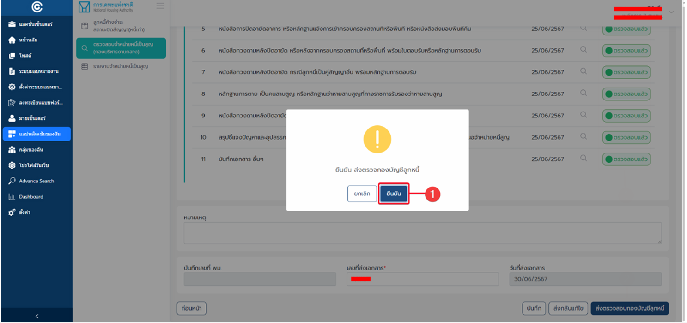<figcaption>
<strong>ภาพที่ 70</strong> Pop up แสดงแจ้งเตือน ยืนยัน ส่งตรวจกองบัญชีลูกหนี้ - หน้าจอเมนูย่อย จำหน่ายหนี้เป็นสูญ (กองบริหารงานกลาง)
</figcaption></figure>

ระบบแจ้งเตือนต้องการยืนยันการส่งตรวจกองบัญชีลูกหนี้หรือไม่

1. กดปุ่ม ยืนยัน

### 5.12 เมนูตรวจสอบจำหน่ายหนี้เป็นสูญ (กองบริหารงานกลาง) : การตรวจสอบพิจารณากองบริหารงานกลาง (8) 

ระบบแสดงแจ้งเตือน เพื่อยืนยันว่า ผู้ใช้ส่งตรวจสอบข้อมูลให้กับกองบัญชีลูกหนี้สำเร็จ

<figure>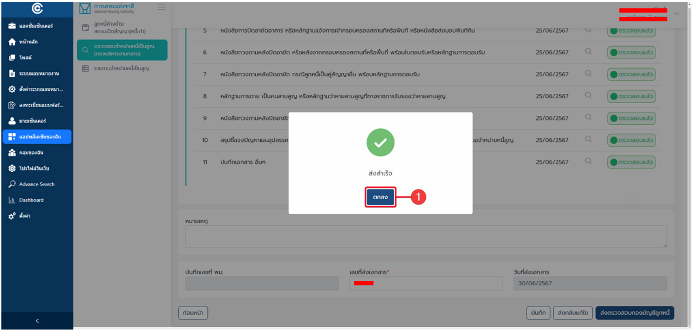<figcaption>
<strong>ภาพที่ 71</strong> Pop up แสดงแจ้งเตือน ส่งสำเร็จ - หน้าจอเมนูย่อย จำหน่ายหนี้เป็นสูญ (กองบริหารงานกลาง)
</figcaption></figure>

ระบบแจ้งเตือนการส่งข้อมูลสำเร็จ

1. กดปุ่ม ตกลง

## 6. ระบบจำหน่ายหนี้เป็นสูญ (Role : กองบัญชีลูกหนี้) 

### 6.1 การเข้าสู่ระบบ 

หน้าจอสำหรับเข้าสู่ระบบของผู้ใช้งาน

<figure><figcaption>
<strong>ภาพที่ 72</strong> หน้าจอการเข้าสู่ระบบ สำหรับผู้ใช้งาน
</figcaption></figure>

1. กรอกชื่อผู้ใช้ : XXXXXX@nha.co.th
2. กรอกรหัสผ่าน : XXXXXXX
3. กดปุ่ม (เข้าสู่ระบบ)

### 6.2 หน้าจอหลัก 

หน้าจอหลัก สำหรับเลือกใช้งานเมนูต่าง ๆ ที่มีอยู่ในระบบ

<figure><figcaption>
<strong>ภาพที่ 73</strong> หน้าจอหลัก
</figcaption></figure>

1. กดเมนูย่อย(แอปพลิเคชันของฉัน)

### 6.3 หน้าจอเมนูย่อย (แอปพลิเคชันของฉัน) 

หน้าจอสำหรับการเลือกใช้งานแอปพลิเคชัน โดยจะแสดงแอปพลิเคชันต่างกัน ตาม role ของผู้ใช้งาน

<figure><figcaption>
<strong>ภาพที่ 74</strong> หน้าจอการเลือกใช้งานแอปพลิเคชัน
</figcaption></figure>

1. กดแอปพลิเคชัน (จำหน่ายหนี้เป็นสูญ)

### 6.4 หน้าจอแรกระบบจำหน่ายหนี้เป็นสูญ (Role : กองบัญชีลูกหนี้) 

หน้าจอ จำหน่ายหนี้เป็นสูญ โดยจะแสดงเมนูย่อยของแอปพลิเคชันจำหน่ายหนี้เป็นสูญ ซึ่งจะแสดงผลเมนูต่างกัน ตาม role ของผู้ใช้

<figure>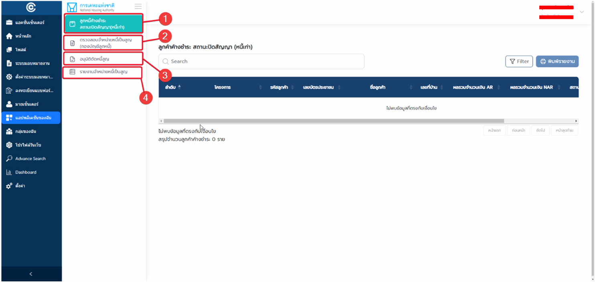<figcaption>
<strong>ภาพที่ 75</strong> หน้าจอ จำหน่ายหนี้เป็นสูญ
</figcaption></figure>

1. เมนู ลูกหนี้ค้างชำระสถานะปิดสัญญา (หนี้เก่า)
2. เมนู ตรวจสอบจำหน่ายหนี้เป็นสูญ (กองบัญชีลูกหนี้)
3. เมนู อนุมัติตัดหนี้สูญ
4. เมนู รายงานจำหน่ายหนี้เป็นสูญ

### 6.5 เมนูลูกหนี้ค้างชำระสถานะปิดสัญญา (หนี้เก่า) 

ระบบแสดงหน้าจอสำหรับการค้นหา ข้อมูลสัญญาสถานะปิดสัญญา

<figure>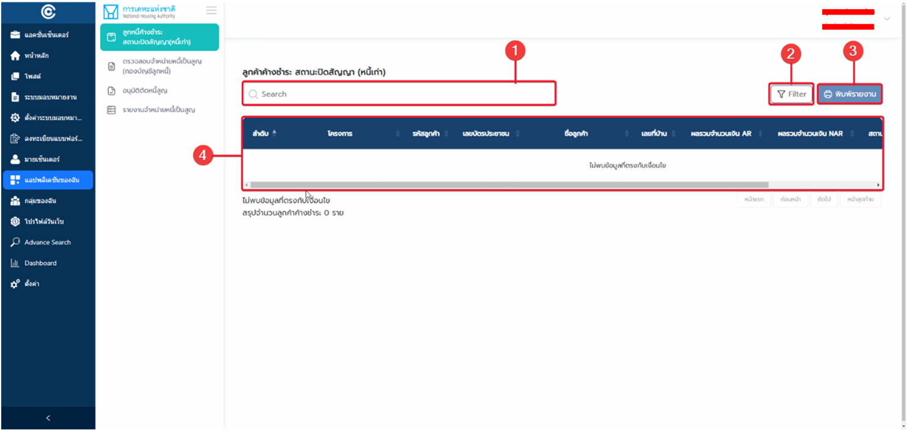<figcaption>
<strong>ภาพที่ 76</strong> หน้าจอการค้นหา - ลูกหนี้ค้างชำระสถานะปิดสัญญา (หนี้เก่า)
</figcaption></figure>

โดยหลังจากที่เข้าสู่หน้าจอครั้งแรกระบบจยังไม่แสดงข้อมูลรายการข้อมูล

1. Search Box (กล่องค้นห้าข้อมูล)
2. ปุ่มFilter (กรองข้อมูล)
3. ปุ่ม พิมพ์รายงาน (สำหรับดาวน์โหลดรายงาน)
4. ตารางแสดงรายการข้อมูล

### 6.6 เมนูลูกหนี้ค้างชำระสถานะปิดสัญญา (หนี้เก่า) : Filter (กรองข้อมูล) (1) 

ระบบจะแสดง ตัวกรอง เพื่อให้ผู้ใช้กรองข้อมูลที่ต้องการค้นหา

<figure>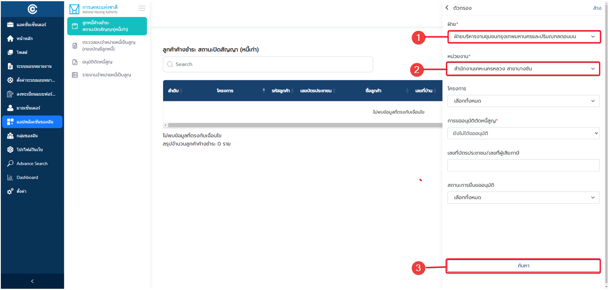<figcaption>
<strong>ภาพที่ 77</strong> ตัวกรองการค้นหาข้อมูล - ลูกหนี้ค้างชำระสถานะปิดสัญญา (หนี้เก่า)
</figcaption></figure>

ผู้ใช้งานสามารถกรองข้อมูลได้ โดยใช้ข้อมูลดังนี้

1. เลือกฝ่าย :
2. เลือกหน่วยงาน :
3. กดปุ่ม ค้นหา

### 6.7 เมนูลูกหนี้ค้างชำระสถานะปิดสัญญา (หนี้เก่า) : Filter (กรองข้อมูล) (2) 

ระบบแสดงผลการค้นหาข้อมูลสัญญา ที่ได้จากการกรองที่ตัวกรอง

<figure>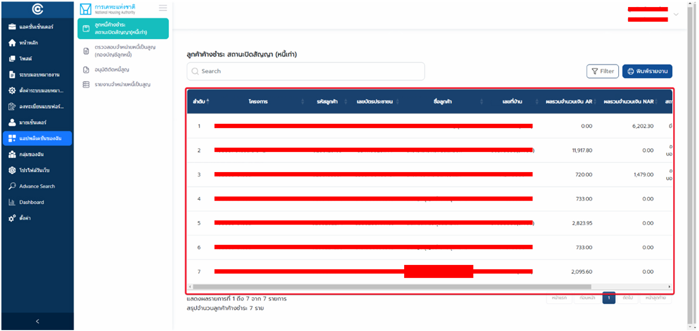<figcaption>
<strong>ภาพที่ 78</strong> แสดงผลการค้นหาข้อมูล - ลูกหนี้ค้างชำระสถานะปิดสัญญา (หนี้เก่า)
</figcaption></figure>

โดยหลังจากกรองข้อมูลระบบจะทำการค้นหาข้อมูลและแสดงรายการข้อมูล

### 6.8 เมนูลูกหนี้ค้างชำระสถานะปิดสัญญา (หนี้เก่า) : พิมพ์รายงาน (1) 

ระบบแสดงหน้าจอการดาวน์โหลดรายงาน ซึ่งจะพิมพ์รายงานออกมา เฉพาะสัญญาที่ถูกกรองออกมาแสดงที่หน้าจอ

<figure>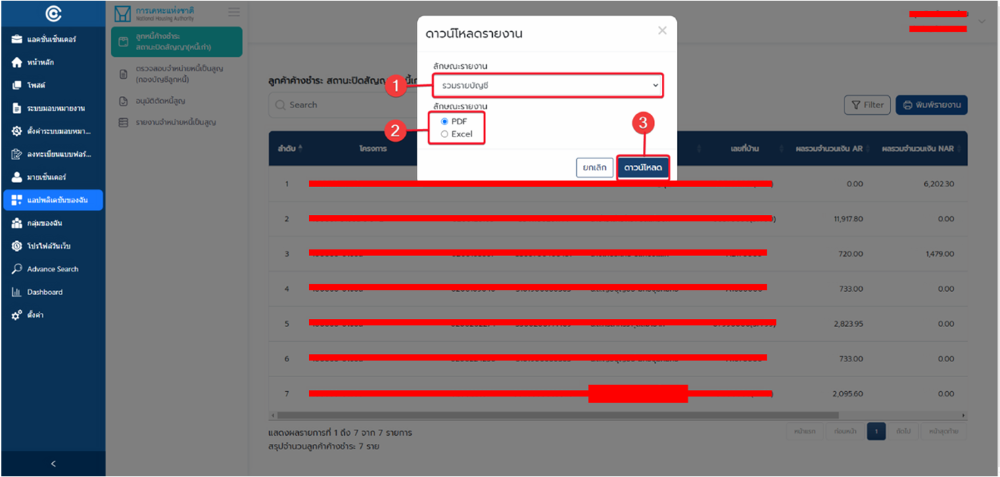<figcaption>
<strong>ภาพที่ 79</strong> Pop up แสดงตัวเลือกการดาวน์โหลดรายงาน - ลูกหนี้ค้างชำระสถานะปิดสัญญา (หนี้เก่า)
</figcaption></figure>

โดยหลังจากกดปุ่ม พิมพ์รายงาน ระบบแสดง Pop-Up ดาวน์โหลดรายงานโดยประกอบไปด้วยข้อมูล ดังนี้

1. ลักษณะรายงาน : รวมรายบัญชี
2. ลักษณะรายงาน : PDF
3. กดปุ่ม ดาวน์โหลด

### 6.9 เมนูลูกหนี้ค้างชำระสถานะปิดสัญญา (หนี้เก่า) : พิมพ์รายงาน (2) 

ระบบจะดาวน์โหลดรายงาน และแสดงผลรายงาน

<figure>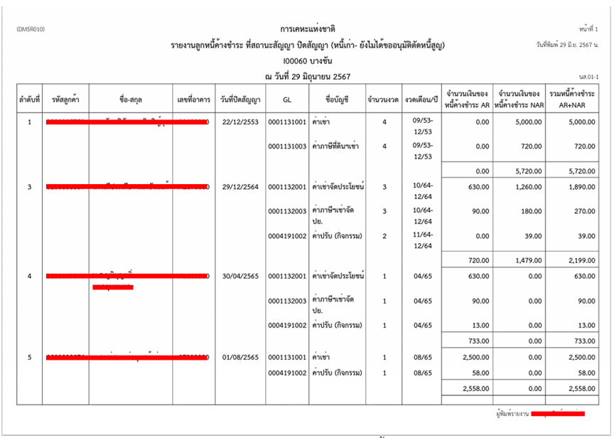<figcaption>
<strong>ภาพที่ 80</strong> การแสดงผลรายงาน - ลูกหนี้ค้างชำระสถานะปิดสัญญา (หนี้เก่า)
</figcaption></figure>

โดยหลังจากระบบทำการดาวน์โหลดไฟล์เสร็จแล้วจะมีรายละเอียด ดังนี้

### 6.10 เมนูอนุมัติตัดหนี้สูญ : ประมวลผลอนุมัติ (1) 

ระบบแสดงผลหน้าจอการอนุมัติตัดหนี้สูญ มีไว้สำหรับประมวลผลอนุมัติหรือส่งคืนสัญญา

<figure>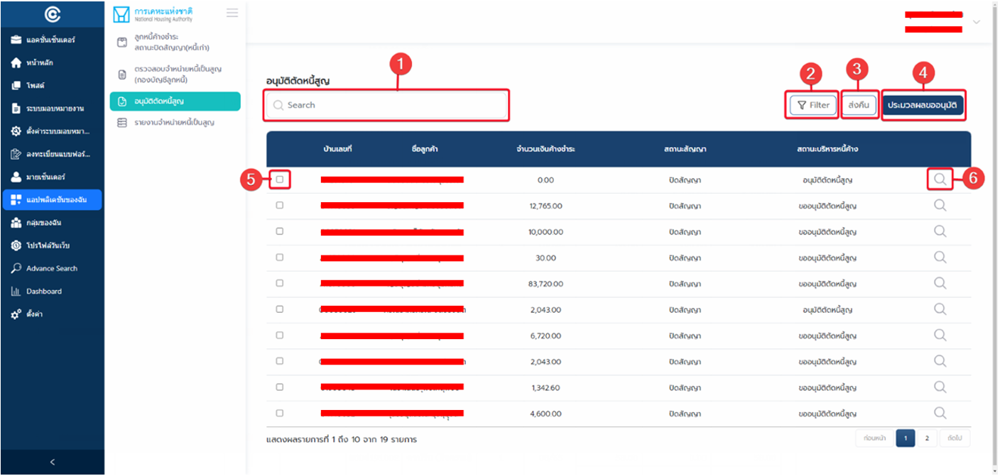<figcaption>
<strong>ภาพที่ 81</strong> หน้าจอการอนุมัติตัดหนี้สูญ - อนุมัติตัดหนี้สูญ (ประมวลผลอนุมัติ)
</figcaption></figure>

1. Search Box (กล่องค้นหา): สำหรับการค้นหาข้อมูล
2. ปุ่ม Filter : สำหรับการกรองข้อมูล
3. ปุ่ม ส่งคืน : สำหรับส่งคืนรายการที่ผู้ใช้งานเลือก
4. ปุ่มประมวลผลขออนุมัติ : สำหรับประมวลผลข้อมูลสถานะหนี้ค้างที่ระบบ SAP และปรับสถานะจากขออนุมัติตัดหนี้สูญเป็นอนุมัติตัดหนี้สูญ ให้เหมือนกับข้อมูล SAP
5. Check box: สำหรับเลือกรายการที่จะส่งคืน
6. ปุ่ม ตรวจสอบสัญญา : สำหรับการตรวจสอบข้อมูลบันทึกขออนุมัติตัดหนี้สูญ

### 6.11 เมนูอนุมัติตัดหนี้สูญ : ประมวลผลอนุมัติ (2) 

<figure>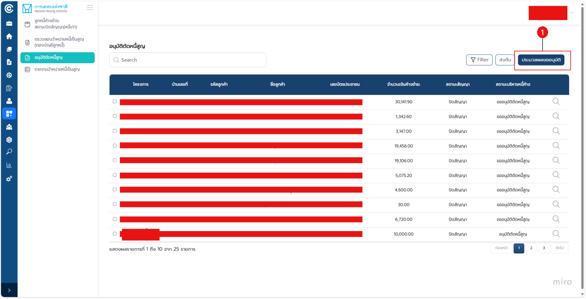<figcaption>
<strong>ภาพที่ 82</strong> ปุ่มประมวลผลอนุมัติตัดหนี้สูญ - อนุมัติตัดหนี้สูญ (ประมวลผลอนุมัติ)
</figcaption></figure>

1. กดปุ่ม ประมวลผลขออนุมัติ

### 6.12 เมนูอนุมัติตัดหนี้เป็นสูญ : ประมวลผลอนุมัติ (3) 

ระบบแสดงผลหน้าจอยืนยัน การประมวลผลอนุมัติตัดหนี้สูญ

<figure><figcaption>
<strong>ภาพที่ 83</strong> Pop up แสดงแจ้งเตือน ยืนยันการประมวลผล - อนุมัติตัดหนี้สูญ (ประมวลผลอนุมัติ)
</figcaption></figure>

1. เลือกวันที่ตัดหนี้สูญ
2. กรอกข้อมูลครั้งที่
3. กอกข้อมูลปี พ.ศ.
4. กดปุ่ม ยืนยัน

### 6.13 เมนูรายงานจำหน่ายหนี้เป็นสูญ : รายงานรายละเอียดลูกหนี้ (1) 

ระบบแสดงหน้าจอ รายงานจำหน่ายหนี้เป็นสูญ สำหรับออกรายงาน รายละเอียดลูกหนี้

<figure>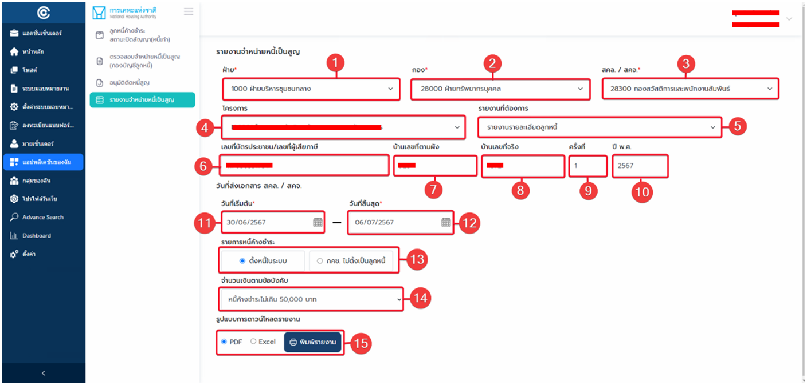<figcaption>
<strong>ภาพที่ 84</strong> หน้าจอออกรายงาน - รายงานจำหน่ายหนี้เป็นสูญ (รายงานรายละเอียดลูกหนี้)
</figcaption></figure>

1. เลือกฝ่าย :
2. เลือกกอง :
3. เลือก สคล./สคจ. :
4. เลือก โครงการ :
5. เลือก รายงานที่ต้องการ : รายงานแสดงรายละเอียดสถานะหนี้ปิดสัญญา
6. เลขที่บัตรประชาชน/เลขที่ผู้เสียภาษี :
7. บ้านเลขที่ตามผัง :
8. บ้านเลขที่จริง :
9. ครั้งที่ :
10. ปี พ.ศ. :
11. วันที่เริ่มต้น :
12. วันที่สิ้นสุด :
13. รายการหนี้ค้างชำระ :
14. จำนวนเงินตามข้อบังคับ :
15. รูปแบบการดาวน์โหลดรายงาน :

### 6.14 เมนูรายงานจำหน่ายหนี้เป็นสูญ : รายงานรายละเอียดลูกหนี้ (2) 

ระบบจะดาวน์โหลดเอกสาร และแสดงผลรายงาน รายละเอียดลูกหนี้

<figure>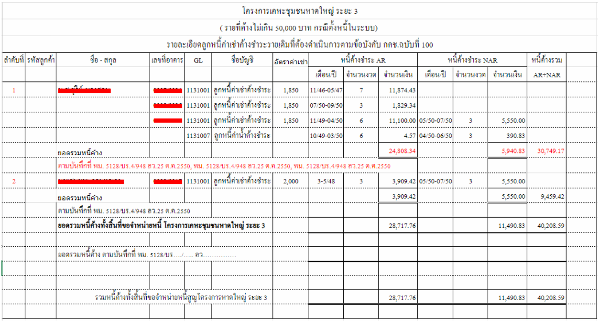<figcaption>
<strong>ภาพที่ 85</strong> แสดงผลรายงาน - รายงานจำหน่ายหนี้เป็นสูญ (รายงานรายละเอียดลูกหนี้)
</figcaption></figure>

ตัวอย่างรายงาน : รายงานรายละเอียดลูกหนี้

### 6.15 เมนูรายงานจำหน่ายหนี้เป็นสูญ : สรุปรายการส่งขออนุมัติตัดหนี้สูญ (1) 

ระบบแสดงหน้าจอ รายงานจำหน่ายหนี้เป็นสูญ สำหรับออกรายงาน สรุปรายการส่งขออนุมัติตัดหนี้สูญ

<figure>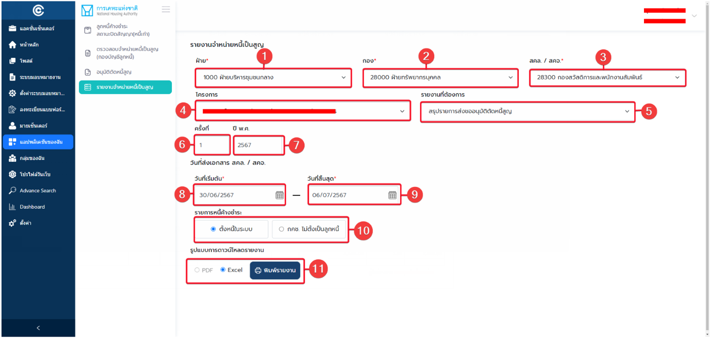<figcaption>
<strong>ภาพที่ 86</strong> หน้าจอออกรายงาน - รายงานจำหน่ายหนี้เป็นสูญ (สรุปรายการส่งขออนุมัติตัดหนี้สูญ)
</figcaption></figure>

1. เลือกฝ่าย : 1000 ฝ่ายบริหารชุมชนกลาง
2. เลือกกอง :
3. เลือก สคล./สคจ.
4. เลือก โครงการ
5. เลือก รายงานที่ต้องการ
6. ครั้งที่
7. ปี พ.ศ.
8. วันที่เริ่มต้น :
9. วันที่สิ้นสุด :
10. รายการหนี้ค้างชำระ
11. รูปแบบการดาวน์โหลดรายงาน

### 6.16 เมนูรายงานจำหน่ายหนี้เป็นสูญ : สรุปรายการส่งขออนุมัติตัดหนี้สูญ (2) 

ระบบจะดาวน์โหลดเอกสาร และแสดงผลรายงาน สรุปรายการส่งขออนุมัติตัดหนี้สูญ

<figure>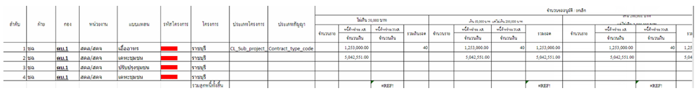<figcaption>
<strong>ภาพที่ 87</strong> แสดงผลรายงาน - รายงานจำหน่ายหนี้เป็นสูญ (สรุปรายการส่งขออนุมัติตัดหนี้สูญ)
</figcaption></figure>

ตัวอย่างรายงาน : สรุปรายการส่งขออนุมัติตัดหนี้สูญ

### 6.17 เมนูรายงานจำหน่ายหนี้เป็นสูญ :รายงานหนี้ค้างชำระที่ กคช. ไม่ได้ตั้งเป็นลูกหนี้ (1) 

ระบบแสดงหน้าจอ รายงานจำหน่ายหนี้เป็นสูญ สำหรับออกรายงาน หนี้ค้างชำระที่ กคช. ไม่ได้ตั้งเป็นลูกหนี้

<figure>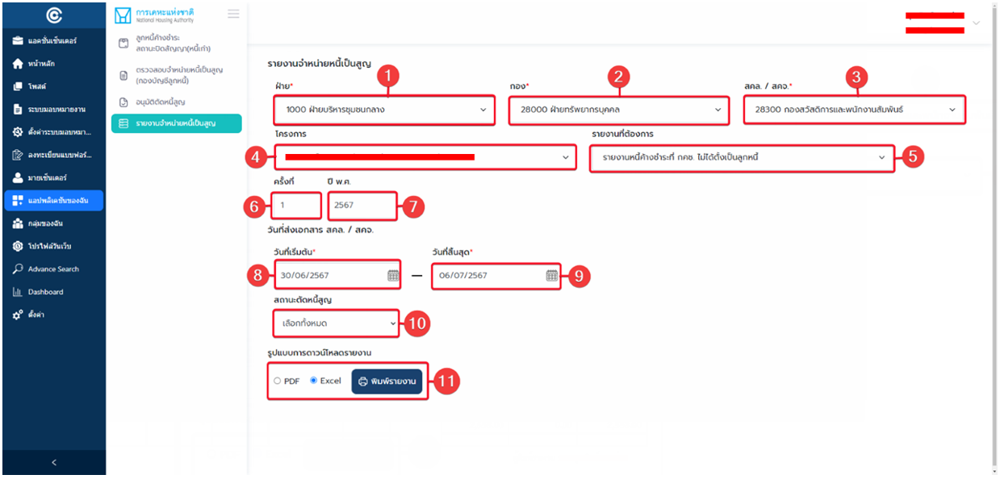<figcaption>
<strong>ภาพที่ 88</strong> หน้าจอออกรายงาน - รายงานจำหน่ายหนี้เป็นสูญ (รายงานหนี้ค้างชำระที่ กคช. ไม่ได้ตั้งเป็นลูกหนี้)
</figcaption></figure>

1. เลือกฝ่าย :
2. เลือกกอง
3. เลือก สคล./สคจ.
4. เลือก โครงการ
5. เลือก รายงานที่ต้องการ : รายงานหนี้ค้างชำระที่ กคช. ไม่ได้ตั้งเป็นลูกหนี้
6. ครั้งที่
7. ปี พ.ศ.
8. วันที่เริ่มต้น
9. วันที่สิ้นสุด
10. สถานะตัดหนี้สูญ
11. รูปแบบการดาวน์โหลดรายงาน

### 6.18 เมนูรายงานจำหน่ายหนี้เป็นสูญ : รายงานหนี้ค้างชำระที่ กคช. ไม่ได้ตั้งเป็นลูกหนี้ (2) 

ระบบจะดาวน์โหลดเอกสาร และแสดงผลรายงาน หนี้ค้างชำระที่ กคช. ไม่ได้ตั้งเป็นลูกหนี้

<figure>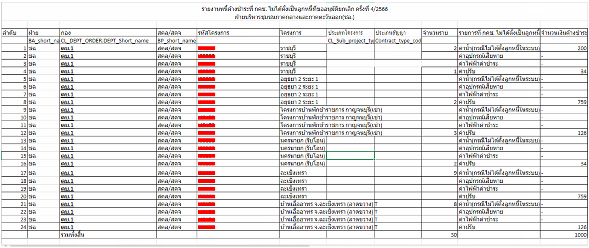<figcaption>
<strong>ภาพที่ 89</strong> แสดงผลรายงาน - รายงานจำหน่ายหนี้เป็นสูญ (รายงานหนี้ค้างชำระที่ กคช. ไม่ได้ตั้งเป็นลูกหนี้)
</figcaption></figure>

ตัวอย่างรายงาน : รายงานหนี้ค้างชำระที่ กคช. ไม่ได้ตั้งเป็นลูกหนี้

### 6.19 เมนูรายงานจำหน่ายหนี้เป็นสูญ : สรุปการขออนุมัติและการอนุมัติ ตัดหนี้สูญลูกหนี้ (1) 

ระบบแสดงหน้าจอ รายงานจำหน่ายหนี้เป็นสูญ สำหรับออกรายงาน สรุปการขออนุมัติและการอนุมัติ ตัดหนี้สูญลูกหนี้

<figure>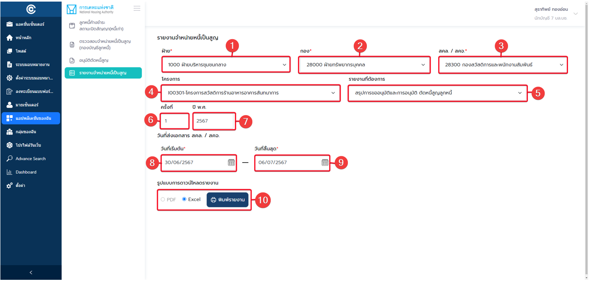<figcaption>
<strong>ภาพที่ 90</strong> หน้าจอออกรายงาน - รายงานจำหน่ายหนี้เป็นสูญ (สรุปการขออนุมัติและการอนุมัติ ตัดหนี้สูญลูกหนี้)
</figcaption></figure>

1. เลือกฝ่าย :
2. เลือกกอง :
3. เลือก สคล./สคจ. :
4. เลือก โครงการ :
5. เลือก รายงานที่ต้องการ : สรุปการขออนุมัติและการอนุมัติ ตัดหนี้สูญลูกหนี้
6. ครั้งที่ :
7. ปี พ.ศ. :
8. วันที่เริ่มต้น :
9. วันที่สิ้นสุด :
10. รูปแบบการดาวน์โหลดรายงาน :

### 6.20 เมนูรายงานจำหน่ายหนี้เป็นสูญ : สรุปการขออนุมัติและการอนุมัติ ตัดหนี้สูญลูกหนี้ (2) 

ระบบจะดาวน์โหลดเอกสาร และแสดงผลรายงาน สรุปการขออนุมัติและการอนุมัติ ตัดหนี้สูญลูกหนี้

<figure>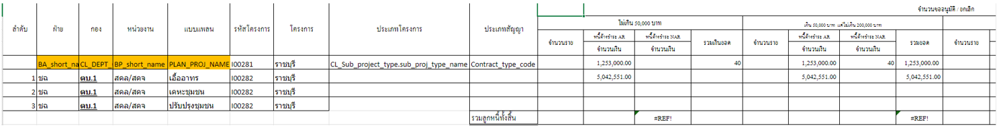<figcaption>
<strong>ภาพที่ 91</strong> แสดงผลรายงาน - รายงานจำหน่ายหนี้เป็นสูญ (สรุปการขออนุมัติและการอนุมัติ ตัดหนี้สูญลูกหนี้)
</figcaption></figure>

ตัวอย่างรายงาน : สรุปการขออนุมัติและการอนุมัติ ตัดหนี้สูญลูกหนี้

### 6.21 เมนูรายงานจำหน่ายหนี้เป็นสูญ : รายงานสรุปรายการหนี้ปิดสัญญา (1) 

ระบบแสดงหน้าจอ รายงานจำหน่ายหนี้เป็นสูญ สำหรับออกรายงาน สรุปรายการหนี้ปิดสัญญา

<figure>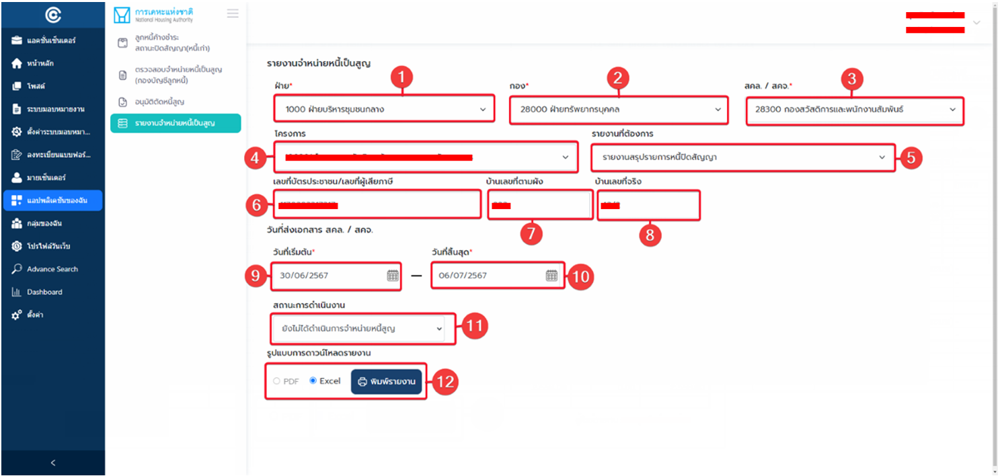<figcaption>
<strong>ภาพที่ 92</strong> หน้าจอออกรายงาน - รายงานจำหน่ายหนี้เป็นสูญ (รายงานสรุปรายการหนี้ปิดสัญญา)
</figcaption></figure>

1. เลือกฝ่าย :
2. เลือกกอง :
3. เลือก สคล./สคจ. :
4. เลือก โครงการ :
5. เลือก รายงานที่ต้องการ : รายงานสรุปรายการหนี้ปิดสัญญา
6. เลขที่บัตรประชาชน/เลขที่ผู้เสียภาษี :
7. บ้านเลขที่ตามผัง :
8. บ้านเลขที่จริง :
9. วันที่เริ่มต้น :
10. วันที่สิ้นสุด :
11. สถานะการดำเนินการ :
12. รูปแบบการดาวน์โหลดรายงาน :

### 6.22 เมนูรายงานจำหน่ายหนี้เป็นสูญ : รายงานสรุปรายการหนี้ปิดสัญญา (2) 

ระบบจะดาวน์โหลดเอกสาร และแสดงผลรายงาน สรุปรายการหนี้ปิดสัญญา

<figure>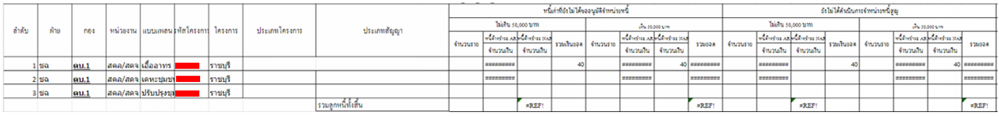<figcaption>
<strong>ภาพที่ 93</strong> แสดงผลรายงาน - รายงานจำหน่ายหนี้เป็นสูญ (รายงานสรุปรายการหนี้ปิดสัญญา)
</figcaption></figure>

ตัวอย่างรายงาน : รายงานสรุปรายการหนี้ปิดสัญญา

### 6.23 เมนูรายงานจำหน่ายหนี้เป็นสูญ : รายงานแสดงรายละเอียดหนี้ปิดสัญญา (1) 

ระบบแสดงหน้าจอ รายงานจำหน่ายหนี้เป็นสูญ สำหรับออกรายงาน แสดงรายละเอียดหนี้ปิดสัญญา

<figure>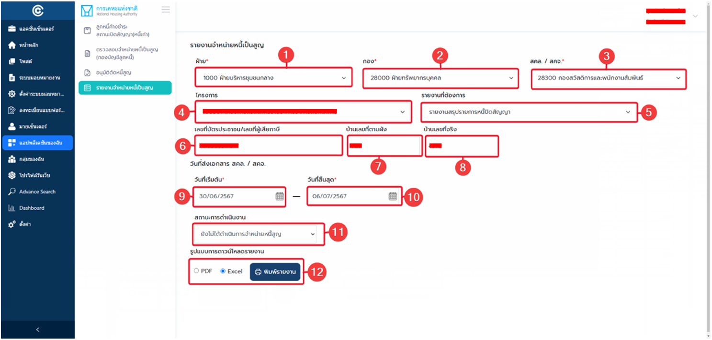<figcaption>
<strong>ภาพที่ 94</strong> หน้าจอออกรายงาน - รายงานจำหน่ายหนี้เป็นสูญ (รายงานแสดงรายละเอียดหนี้ปิดสัญญา)
</figcaption></figure>

1. เลือกฝ่าย :
2. เลือกกอง :
3. เลือก สคล./สคจ. :
4. เลือก โครงการ :
5. เลือก รายงานที่ต้องการ : รายงานแสดงรายละเอียดหนี้ปิดสัญญา
6. เลขที่บัตรประชาชน/เลขที่ผู้เสียภาษี :
7. บ้านเลขที่ตามผัง :
8. บ้านเลขที่จริง :
9. วันที่เริ่มต้น :
10. วันที่สิ้นสุด :
11. สถานะดำเนินการ :
12. รูปแบบการดาวน์โหลดรายงาน :

### 6.24 เมนูรายงานจำหน่ายหนี้เป็นสูญ : รายงานแสดงรายละเอียดหนี้ปิดสัญญา (2) 

ระบบจะดาวน์โหลดเอกสาร และแสดงผลรายงาน แสดงรายละเอียดหนี้ปิดสัญญา

<figure>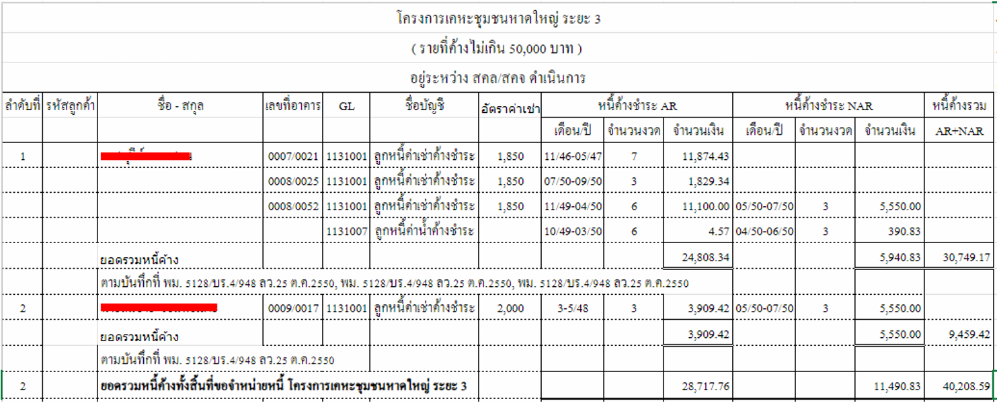<figcaption>
<strong>ภาพที่ 95</strong> แสดงผลรายงาน - รายงานจำหน่ายหนี้เป็นสูญ (รายงานแสดงรายละเอียดหนี้ปิดสัญญา)
</figcaption></figure>

ตัวอย่างรายงาน : รายงานแสดงรายละเอียดหนี้ปิดสัญญา

### 6.25 เมนูรายงานจำหน่ายหนี้เป็นสูญ : ระเบียบวาระที่ 4 พิจารณาการจำหน่ายหนี้เป็นสูญ (รายงานแสดงหนี้ไม่เกิน 1,000,000) (1) 

ระบบแสดงหน้าจอ รายงานจำหน่ายหนี้เป็นสูญ สำหรับออกรายงาน ระเบียบวาระที่ 4 พิจารณาการจำหน่ายหนี้เป็นสูญ (รายงานแสดงหนี้ไม่เกิน 1,000,000)

<figure>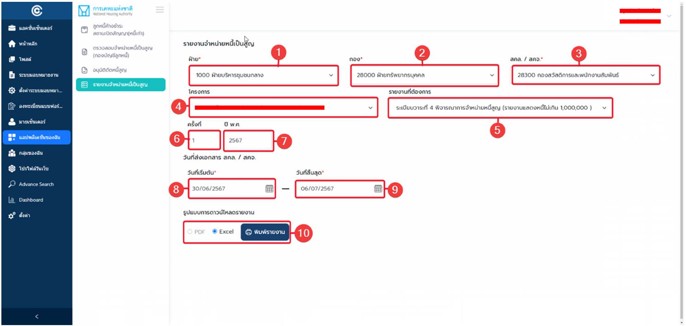<figcaption>
<strong>ภาพที่ 96</strong> หน้าจอออกรายงาน - รายงานจำหน่ายหนี้เป็นสูญ (ระเบียบวาระที่ 4 พิจารณาการจำหน่ายหนี้เป็นสูญ (รายงานแสดงหนี้ไม่เกิน 1,000,000))
</figcaption></figure>

1. เลือกฝ่าย :
2. เลือกกอง :
3. เลือก สคล./สคจ. :
4. เลือก โครงการ :
5. เลือก รายงานที่ต้องการ : ระเบียบวาระที่ 4 พิจารณาการจำหน่ายหนี้เป็นสูญ (รายงานแสดงหนี้ไม่เกิน 1,000,000)
6. ครั้งที่ :
7. ปี พ.ศ. :
8. วันที่เริ่มต้น :
9. วันที่สิ้นสุด :
10. รูปแบบการดาวน์โหลดรายงาน :

### 6.26 เมนูรายงานจำหน่ายหนี้เป็นสูญ : ระเบียบวาระที่ 4 พิจารณาการจำหน่ายหนี้เป็นสูญ (รายงานแสดงหนี้ไม่เกิน 1,000,000) (2) 

ระบบจะดาวน์โหลดเอกสาร และแสดงผลรายงาน ระเบียบวาระที่ 4 พิจารณาการจำหน่ายหนี้เป็นสูญ (รายงานแสดงหนี้ไม่เกิน 1,000,000)

<figure>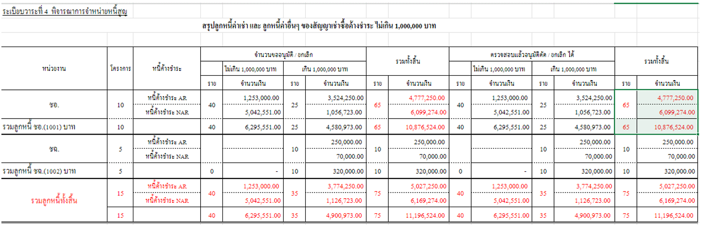<figcaption>
<strong>ภาพที่ 96</strong> แสดงผลรายงาน - รายงานจำหน่ายหนี้เป็นสูญ (ระเบียบวาระที่ 4 พิจารณาการจำหน่ายหนี้เป็นสูญ (รายงานแสดงหนี้ไม่เกิน 1,000,000))
</figcaption></figure>

ตัวอย่างรายงาน : ระเบียบวาระที่ 4 พิจารณาการจำหน่ายหนี้เป็นสูญ (รายงานแสดงหนี้ไม่เกิน 1,000,000)
