# คดีปกติ

## 1. บทนำ 

ระบบนี้จัดทำเพื่อให้ กคช. สามารถจัดการบริหารหนี้งานคดีปกติโดยที่ระบบจะสามารถดึงข้อมูลจากฐานข้อมูลในระบบ กคช. เพื่อในการบริหารจัดการหนี้ในระบบได้ ซึ่งจะมีหน่วยงานที่เกี่ยวข้องหลักๆคือ หน่วยงาน สคล./สคจ.ที่รับผิดชอบ หน่วยงานนิติกรผู้รับผิดชอบดำเนินคดีปกติโดยมีหลักการทำงานดังนี้

1. พนักงาน สคล./สคจ. สร้างหนังสือบอกเลิก และ ส่งขออนุมัติจากหัวหน้า
2. หัวหน้าทำการพิจารณา หนังสือบอกเลิก
3. พนักงาน สคล./สคจ. ทำกระบวนการเลิกสัญญา ส่งให้นิติกร
4. นิติกร พิจารณารับเรื่อง และ จัดการสำนักงงานทนาย และจ้างทนายดำเนินคดี
5. ทนายและนิติกร บันทึกข้อมูลการดำเนินคดี
6. นิติกรทำเรื่องเบิกจ่ายให้กับสำนักงงานทนายเมื่อมีการเบิกจ่าย

## 2. การเข้าสู่ระบบ 

ระบบจะแสดงหน้าจอ การเข้าสู่ระบบ โดยผู้ใช้งานจะต้องมีข้อมูล ชื่อผู้ใช้งานและรหัสผ่าน สามารถเข้า URL Production ได้ที่ [portal.nha.co.th](https://portal.nha.co.th/)

.png>)

1. ระบุชื่อผู้ใช้
2. ระบุรหัสผ่าน
3. กดปุ่มเข้าสู่ระบบ

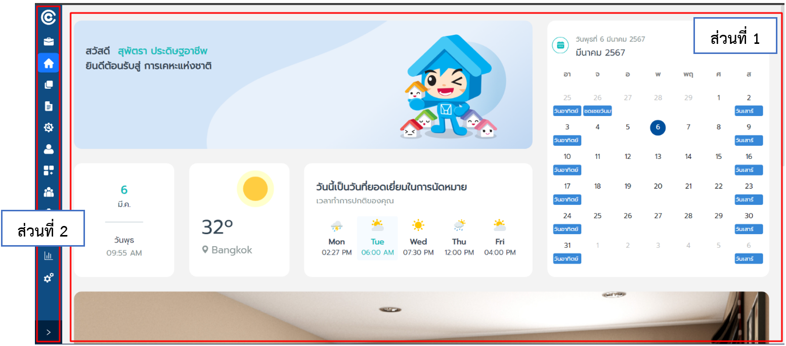

**ส่วนที่ 1** – หน้าจอระบบงาน เป็นพื้นที่แสดงข้อมูลเนื้อหาของระบบงานต่างๆ เปลี่ยนไปตามระบบงานที่ใช้งาน

**ส่วนที่ 2** – เมนูลัด เป็นเมนูทางด้านซ้าย ประกอบไปด้วย

.png>)

* &#x20;เมนู Action Center / Notification : ข้อความแจ้งเตือน

.png>)

<figure><figcaption></figcaption></figure>

* เมนู Home : หน้าแรก ระบบจะแสดงหน้าหลักของ Action Center

.png>)

.png>)

* เมนู Social Feed : ระบบฟีดสังคมออนไลน์

.png>)

.png>)

* เมนู Case Management / Task Management : ระบบมอบหมาย/ติดตามงาน

.png>)

.png>)

* เมนู Social Post : ระบบโพสต์สังคมออนไลน์

.png>)

.png>)

* เมนู All Apps : หน้าจอรวมระบบงานต่างๆ // สำหรับเข้าใช้งานระบบภายในต่าง ๆ

.png>)

.png>)

* เมนู Social Group : ระบบกลุ่มสังคมออนไลน์

.png>)

.png>)

* เมนู Setting : การตั้งค่าข้อมูลผู้ใช้งานและอื่นๆ

<figure><figcaption>
<strong>รูปภาพที่ 10</strong> หน้าจอแสดงผลเมนู Setting : การตั้งค่าข้อมูลผู้ใช้งานและอื่นๆ
</figcaption></figure>

## 3. ขั้นตอนกระบวนการเลิกสัญญา 

### 3.1 ขั้นตอนการออกหนังสือบอกเลิก 

เป็นขั้นตอนการสร้างหนังสือบอกเลิก โดยระบบจะดึงข้อมูลสัญญาลูกค้าใน กคช. ในฐานข้อมูลมาแสดงเพื่อโดยให้ พนักงงาน สคล./สคจ. เลือกสัญญาได้หลายสัญญา โดยมีเงื่อนไขที่ว่า พนักงงาน กับ หัวหน้า จะต้องอยู่ในโครงการที่รับผิดชอบ ระบบจะสร้างมาเป็นหนังสือบอกเลิก และส่งให้หัวหน้า สคล./สคจ. พิจารณาหนังสือบอกเลิก

<figure>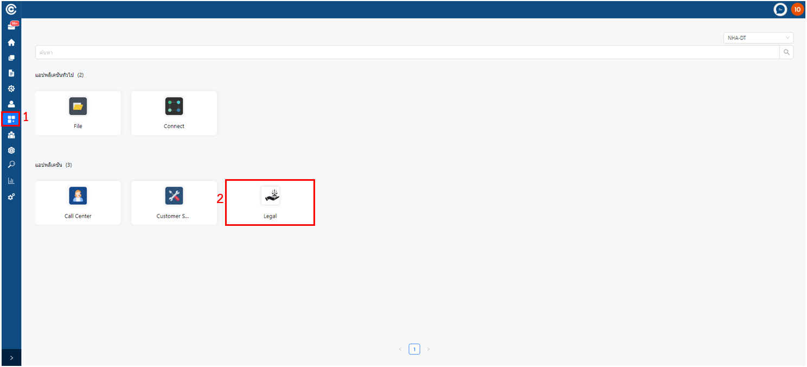<figcaption>
<strong>รูปภาพที่ 11</strong> เมนู Legal
</figcaption></figure>

1. กดที่เมนู แอปพลิเคชันของฉัน
2. กดที่เมนู Legal

<figure>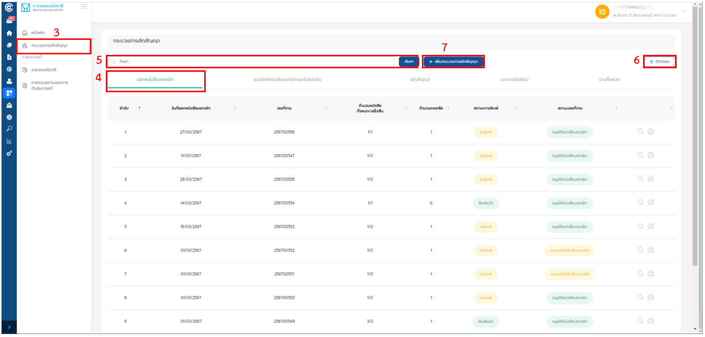<figcaption>
<strong>รูปภาพที่ 12</strong> หน้าจอแสดงเมนู ออกหนังสือบอกเลิก
</figcaption></figure>

3. กดที่เมนู กระบวนการเลิกสัญญา
4. กดที่เมนู ออกหนังสือบอกเลิก
5. กรอกคำค้นหาในช่อง “ค้นหา”
6. ปุ่ม “ตัวกรอง”

<figure>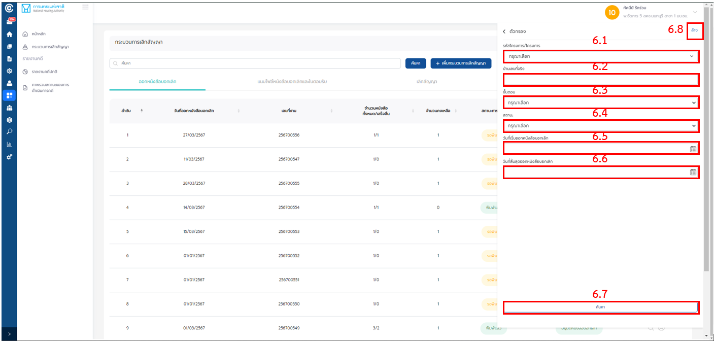<figcaption>
<strong>รูปภาพที่ 13</strong> หน้าจอ Pop-up “ตัวกรอง”
</figcaption></figure>

&#x20;       6.1 กรอกข้อมูล“รหัสโครงการ/โครงการ”

&#x20;       6.2 กรอกข้อมูล“บ้านเลขที่จริง”

&#x20;       6.3 กรอกข้อมูล“ขั้นตอน”

&#x20;       6.4 กรอกข้อมูล“สถานะ”

&#x20;       6.5 กรอกข้อมูล“วันที่เริ่มออกหนังสือบอกเลิก”

&#x20;       6.6 กรอกข้อมูล“วันที่สิ้นสุดออกหนังสือบอกเลิก”

&#x20;       6.7 กดปุ่ม“ค้นหา”

&#x20;       6.8 ลบข้อมูล กดปุ่ม“ล้าง”

7. กดปุ่ม “+ เพิ่มกระบวนการเลิกสัญญา”

<figure>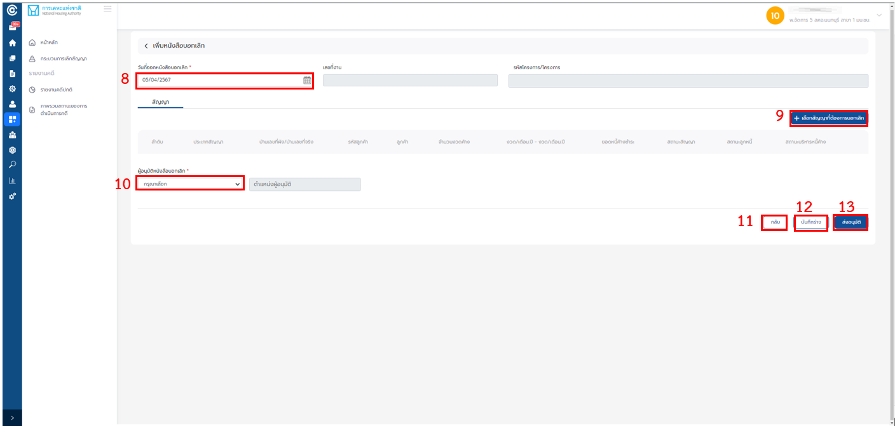<figcaption>
<strong>รูปภาพที่ 14</strong> หน้าจอ Pop-up เพิ่มกระบวนการเลิกสัญญา
</figcaption></figure>

8. กรอกข้อมูล “รหัสโครงการ/โครงการ”
9. กดปุ่ม “+ เลือกสัญญาที่ต้องการบอกเลิก”

<figure>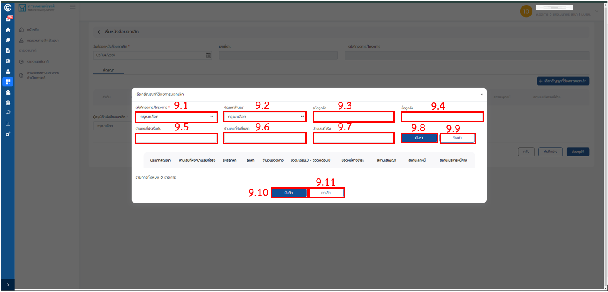<figcaption>
<strong>รูปภาพที่ 15</strong> หน้าจอ Pop-up เลือกสัญญาที่ต้องการบอกเลิก
</figcaption></figure>

&#x20;       9.1 กรอกข้อมูล“รหัสโครงการ/โครงการ”

&#x20;       9.2 กรอกข้อมูล“ประเภทสัญญา”

&#x20;       9.3 กรอกข้อมูล“รหัสลูกค้า”

&#x20;       9.4 กรอกข้อมูล“ชื่อลูกค้า”

&#x20;       9.5 กรอกข้อมูล“บ้านเลขที่ผังเริ่มต้น”

&#x20;       9.6 กรอกข้อมูล“บ้านเลขที่ผังสิ้นสุด”

&#x20;       9.7 กรอกข้อมูล“บ้านเลขที่จริง”

&#x20;       9.8 ข้อมูลเรียบร้อย กดปุ่ม “ค้นหา”

&#x20;       9.9 ไม่ต้องการค้นหา กดปุ่ม “ล้างค่า”

&#x20;       9.10 ข้อมูลเรียบร้อย กดปุ่ม “บันทึก”

&#x20;       9.11 ไม่บันทึกข้อมูล กดปุ่ม “ยกเลิก”

10. กรอกข้อมูล  “ผู้อนุมัติหนังสือบอกเลิก”
11. ไม่บันทึกข้อมูล กดปุ่ม “กลับ”
12. บันทึกข้อมูลยังไม่พร้อมส่ง กดปุ่ม “บันทึกร่าง”
13. ข้อมูลเรียบร้อยพร้อมส่ง กดปุ่ม “ส่งอนุมัติ”

<figure>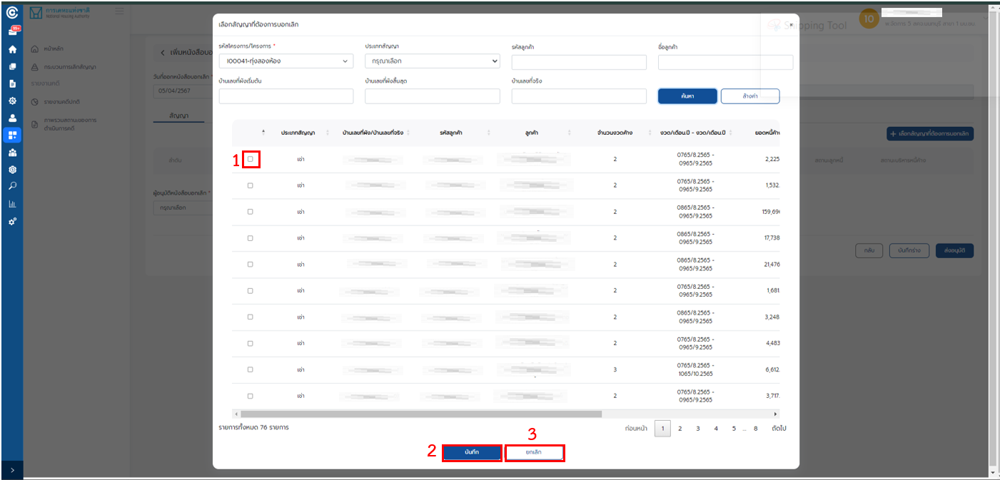<figcaption>
<strong>รูปภาพที่ 16</strong> หน้าจอ Pop-up เลือกสัญญาที่ต้องการบอกเลิก (1)
</figcaption></figure>

1. กดเลือกข้อมูลที่ต้องการ
2. ข้อมูลเรียบร้อย กดปุ่ม “บันทึก”
3. ไม่บันทึกข้อมูล กดปุ่ม “ยกเลิก”

<figure><figcaption>
<strong>รูปภาพที่ 17</strong> หน้าจอ Pop-up ยืนยันการบันทึกข้อมูลสำเร็จ
</figcaption></figure>

กดปุ่ม “ตกลง”

<figure>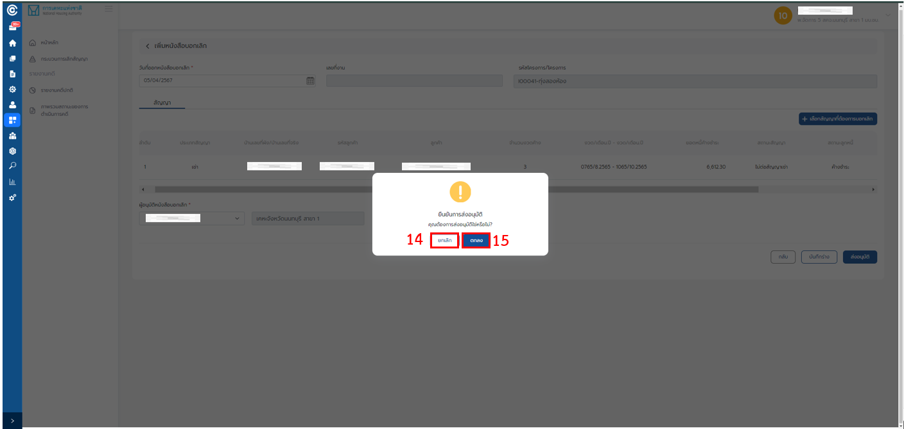<figcaption>
<strong>รูปภาพที่ 18</strong> หน้าจอ Pop-up ยืนยันการส่งอนุมัติ
</figcaption></figure>

14. ไม่ส่งอนุมัติ กดปุ่ม “ยกเลิก”
15. ส่งอนุมัติ กดปุ่ม “ตกลง”

<figure>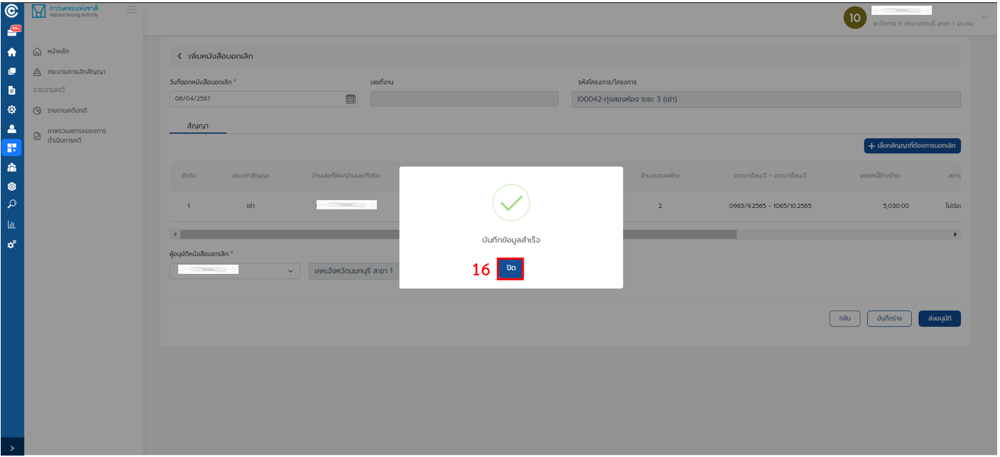<figcaption>
<strong>รูปภาพที่ 19</strong> หน้าจอ Pop-up ยืนยันการส่งอนุมัติสำเร็จ
</figcaption></figure>

16. กดปุ่ม “ปิด”

### 3.2 ขั้นตอนการพิจารณาอนุมัติหนังสือบอกเลิก 

เป็นขั้นตอนการทำงานของหัวหน้า สคล./สคจ. ที่ต้องพิจารณาหนังสือบอกเลิก ที่ทาง พนักงงานสคล./สคจ. ส่งขออนุมัติ โดยระบบจะแจ้งเตือนไปยังหัวหน้าเพื่อให้ทราบ และเข้าไปใน Task งานของนั้นๆเพื่อพิจารณา

<figure>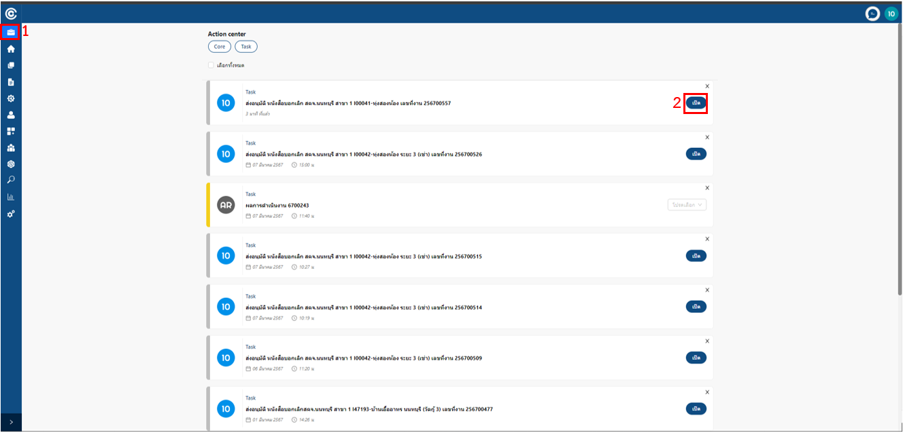<figcaption>
<strong>รูปภาพที่ 20</strong> หน้าจอแจ้งเตือนส่งอนุมัติหนังสือบอกเลิก
</figcaption></figure>

1. กดเลือกเมนู Action Center / Notification
2. กดปุ่ม “เปิด” ที่ส่งอนุมัติหนังสือบอกเลิก

<figure>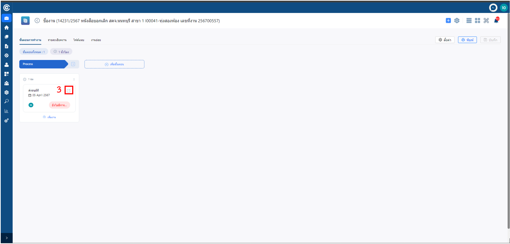<figcaption>
<strong>รูปภาพที่ 21</strong> หัวหน้าสคล./สคจ. ดำเนินการรับเรื่องอนุมัติหนังสือบอกเลิก
</figcaption></figure>

3. กดปุ่ม (ไอคอน Pop-up)

<figure><figcaption></figcaption></figure>

&#x20;       ที่ กล่องพิจารณา อนุมัติหนังสือบอกเลิก

<figure>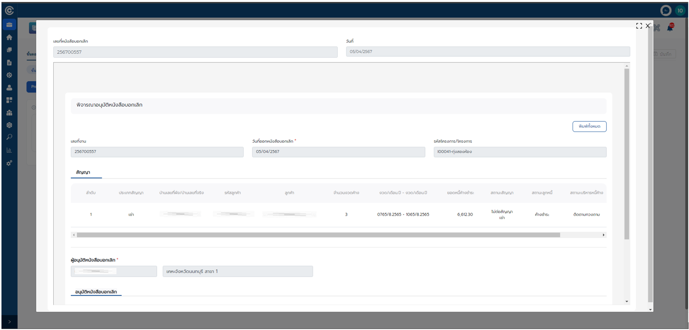<figcaption>
<strong>รูปภาพที่ 22</strong> หน้าจอรับเรื่องอนุมัติหนังสือบอกเลิก
</figcaption></figure>

4. กดเลือก “สถานะ”

<figure>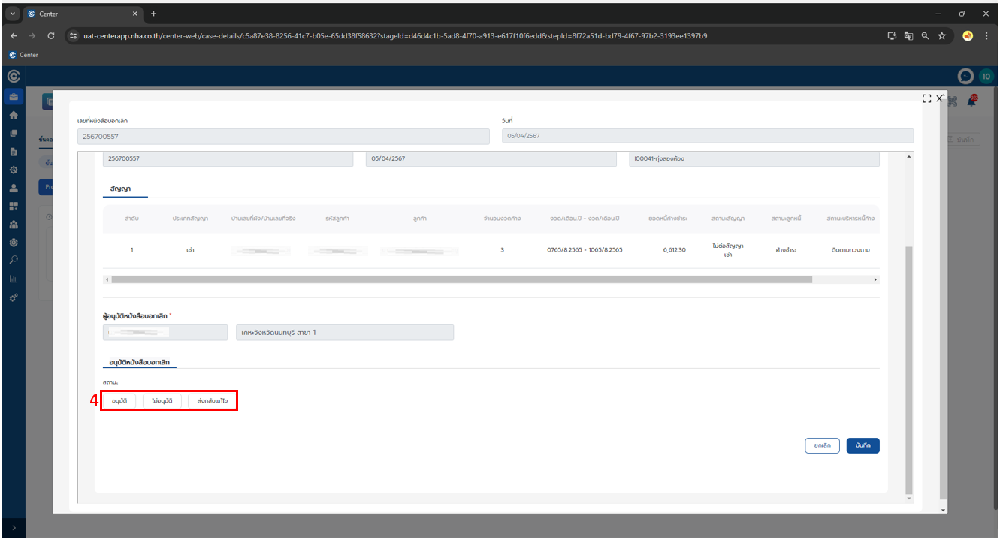<figcaption>
<strong>รูปภาพที่ 23</strong> หน้าจอรับเรื่องอนุมัติหนังสือบอกเลิก (1)
</figcaption></figure>

<figure>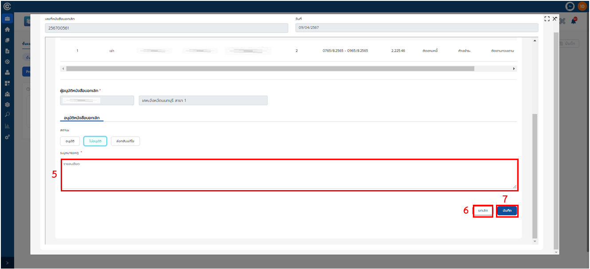<figcaption>
<strong>รูปภาพที่ 24</strong> หน้าจอรับเรื่องอนุมัติหนังสือบอกเลิก (2)
</figcaption></figure>

5. หากเลือกสถานะ “ไม่อนุมัติ” และ ส่งกลับแก้ไข จะต้องกรอกข้อมูล “หมายเหตุ”
6. ไม่บันทึกข้อมูล กดปุ่ม “ยกเลิก”
7. ข้อมูลเรียบร้อยกดปุ่ม “ยืนยัน”

<figure>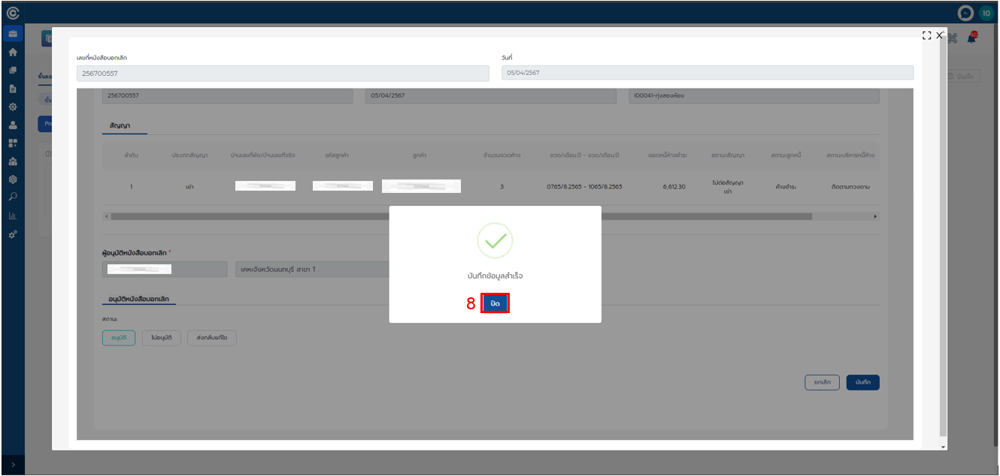<figcaption>
<strong>รูปภาพที่ 25</strong> หน้าจอ Pop-up ยืนยันการพิจารณาส่งอนุมัติสำเร็จ
</figcaption></figure>

8. กดปุ่ม “ปิด”

### 3.3 ขั้นตอนการแนบไฟล์หนังสือบอกเลิกและใบตอบรับ 

เป็นขั้นตอนหลังจากที่หัวหน้า สคล./สคจ. อนุมัติหนังสือบอกเลิกแล้ว ระบบจะแจ้งเตือนไปยัง พนักงงาน สคล./สคจ. เพื่อทำการแนบไฟล์หหนังสือบอกเลิก โดยจะเป็นการแนบไฟล์เอกสารบอกเลิกและใบตอบรับ พร้อมกับระบุวันที่ได้รับใบตอบรับด้วย เมื่อดำเนินการขั้นตอนนี้เสร็จข้อมูลจะหายและไปอยู่ในแท็บเลิกสัญญา

<figure>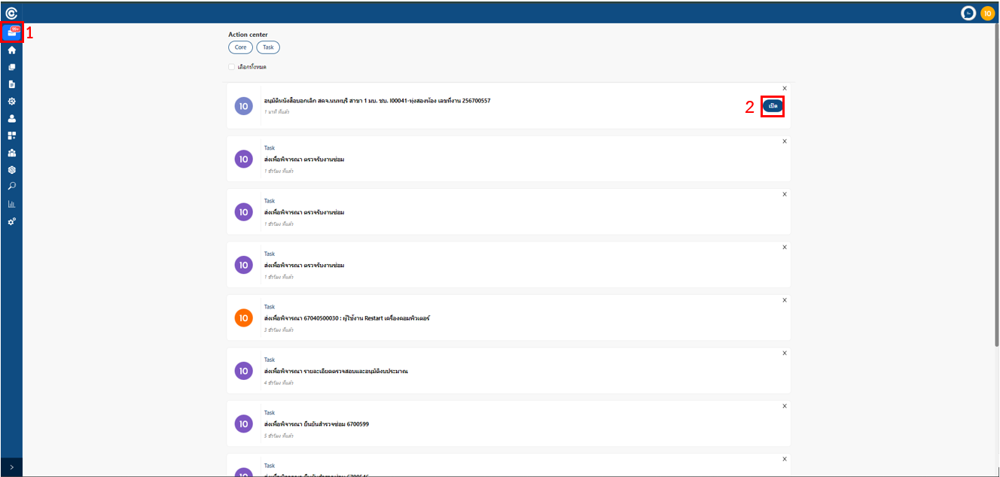<figcaption>
<strong>รูปภาพที่ 26</strong> หน้าจอแจ้งเตือนอนุมัติหนังสือบอกเลิก
</figcaption></figure>

1. กดเลือกเมนู Action Center / Notification
2. กดปุ่ม “เปิด” ที่อนุมัติหนังสือบอกเลิก

<figure>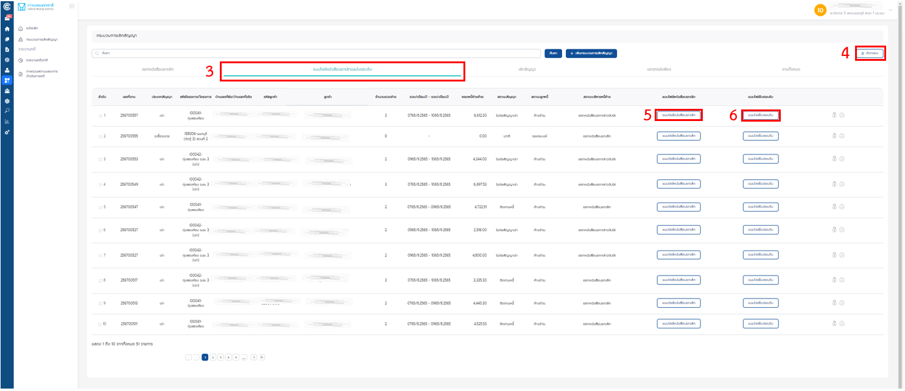<figcaption>
<strong>รูปภาพที่ 27</strong> หน้าจอแสดงเมนู แนบไฟล์หนังสือบอกเลิกและใบตอบรับ
</figcaption></figure>

3. กดที่เมนู แนบไฟล์หนังสือบอกเลิกและใบตอบรับ
4. ปุ่ม “ตัวกรอง”

<figure>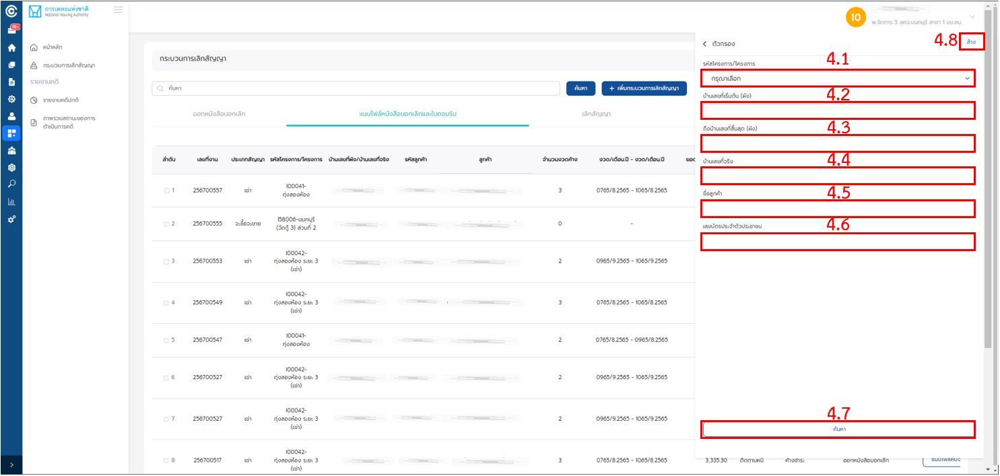<figcaption>
<strong>รูปภาพที่ 28</strong> หน้าจอ Pop-up “ตัวกรอง”
</figcaption></figure>

&#x20;       4.1  กรอกข้อมูล“รหัสโครงการ/โครงการ”

&#x20;       4.2  กรอกข้อมูล“บ้านเลขที่เริ่มต้น (ผัง)”

&#x20;       4.3  กรอกข้อมูล“ถึงบ้านเลขที่สิ้นสุด (ผัง)”

&#x20;       4.4  กรอกข้อมูล“บ้านเลขที่จริง”

&#x20;       4.5  กรอกข้อมูล“ชื่อลูกค้า”

&#x20;       4.6  กรอกข้อมูล“เลขบัตรประจำตัวประชาชน”

&#x20;       4.7  กดปุ่ม“ค้นหา”

&#x20;       4.8  ลบข้อมูล กดปุ่ม“ล้าง”

5. ปุ่ม “แนบไฟล์หนังสือบอกเลิกสัญญา”

<figure>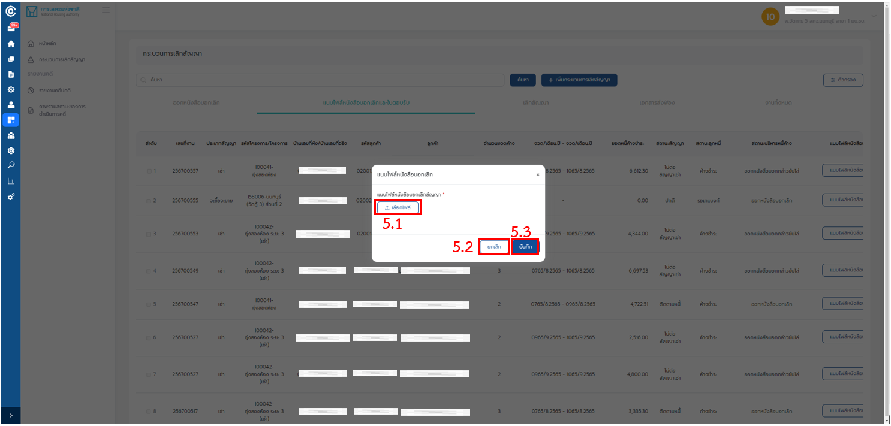<figcaption>
<strong>รูปภาพที่ 29</strong> หน้าจอ Pop-up “แนบไฟล์หนังสือบอกเลิกสัญญา”
</figcaption></figure>

&#x20;       5.1  แนบไฟล์ กดปุ่ม “เลือกไฟล์”

&#x20;       5.2  ไม่บันทึกข้อมูล กดปุ่ม “ยกเลิก”

&#x20;       5.3  ข้อมูลเรียบร้อย กดปุ่ม “บันทึก”

6. ปุ่ม “แนบไฟล์ใบตอบรับ”

<figure>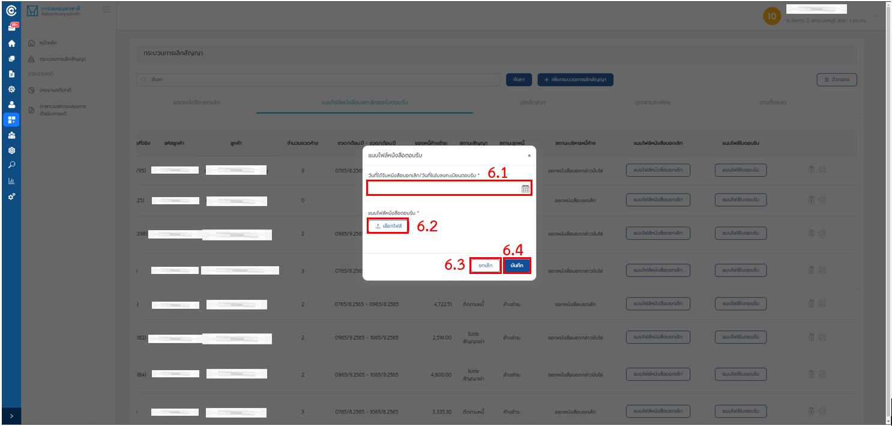<figcaption>
<strong>รูปภาพที่ 30</strong> หน้าจอ Pop-up “แนบไฟล์หนังสือตอบรับ
</figcaption></figure>

&#x20;       6.1 กรอกข้อมูล“วันที่ได้รับหนังสือบอกเลิก/วันที่ในใบลงทะเบียนตอบรับ”

&#x20;       6.2 แนบไฟล์ กดปุ่ม “เลือกไฟล์”

&#x20;       6.3 ไม่บันทึกข้อมูล กดปุ่ม “ยกเลิก”

&#x20;       6.4 ข้อมูลเรียบร้อย กดปุ่ม “บันทึก”

<figure>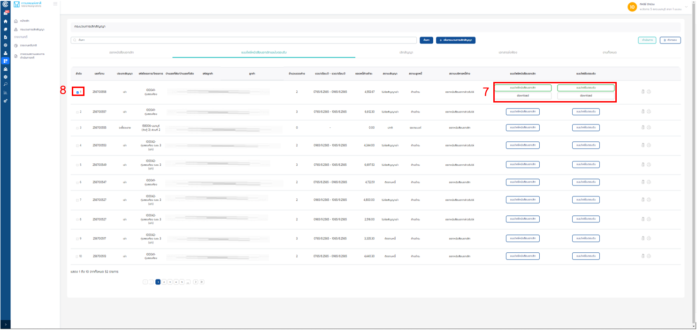<figcaption>
<strong>รูปภาพที่ 31</strong> หน้าจอแสดงเมนู แนบไฟล์หนังสือบอกเลิกและใบตอบรับ (1)
</figcaption></figure>

7. เมื่อแนบไฟล์เรียบร้อยแล้วจะขึ้นสีเขียว
8. จึงจะสามารถกดเลือกในช่องสี่เหลี่ยมด้านหน้าสุดได้

### 3.4 ขั้นตอนการเลิกสัญญา 

เป็นขั้นตอนหลังจากที่ดำเนินการใบตอบรับแล้ว จะอยู่ขั้นตอนเลิกสัญญา โดยพนักงงาน สคล./สคจ.เป็นคนกำหนดวันที่เลิกสัญญา ไม่เกิน 30 วัน หลังจากวันที่ได้รับใบตอบรับ กรณีที่เกิน 30 วันที่กำหนด ระบบจะเลิกสัญญา โดยอัตโนมัติ เมื่อดำเนินการเสร็จแล้วข้อมูลจะหายไปและไปอยู่ในแท็บเอกสารส่งฟ้อง

<figure>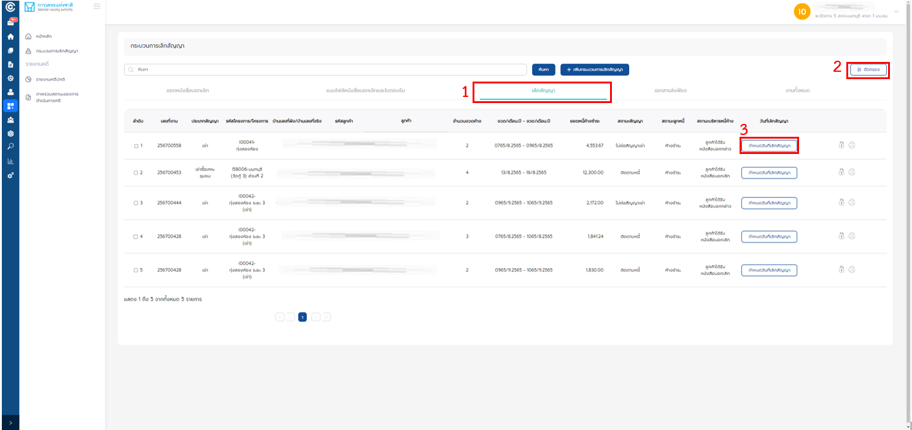<figcaption>
<strong>รูปภาพที่ 32</strong> หน้าจอแสดงเมนู เลิกสัญญา
</figcaption></figure>

1. กดที่เมนู เลิกสัญญา
2. ปุ่ม “ตัวกรอง”

<figure>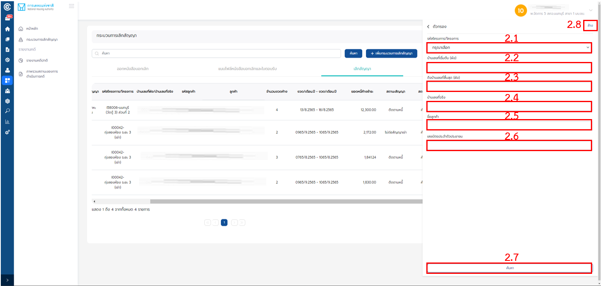<figcaption>
<strong>รูปภาพที่ 33</strong> หน้าจอ Pop-up “ตัวกรอง”
</figcaption></figure>

&#x20;       2.1 กรอกข้อมูล“รหัสโครงการ/โครงการ”

&#x20;       2.2 กรอกข้อมูล“บ้านเลขที่เริ่มต้น (ผัง)”

&#x20;       2.3 กรอกข้อมูล“ถึงบ้านเลขที่สิ้นสุด (ผัง)”

&#x20;       2.4 กรอกข้อมูล“บ้านเลขที่จริง”

&#x20;       2.5 กรอกข้อมูล“ชื่อลูกค้า”

&#x20;       2.6 กรอก        ข้อมูล“เลขบัตรประจำตัวประชาชน”

&#x20;       2.7 กดปุ่ม“ค้นหา”

&#x20;       2.8 ลบข้อมูล กดปุ่ม“ล้าง”

3. ปุ่ม “กำหนดวันที่เลิกสัญญา”

<figure>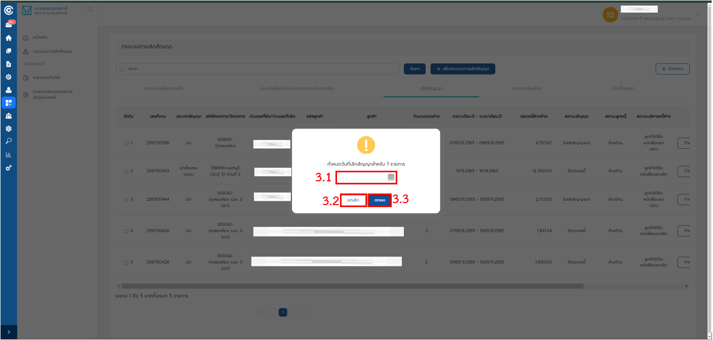<figcaption>
<strong>รูปภาพที่ 34</strong> หน้าจอ Pop-up “กำหนดวันที่เลิกสัญญา”
</figcaption></figure>

&#x20;       3.1 กรอกข้อมูล “วันที่เลิกสัญญาสำหรับ 1 รายการ”

&#x20;       3.2 ไม่บันทึกข้อมูล กดปุ่ม “ยกเลิก”

&#x20;       3.3 ข้อมูลเรียบร้อย กดปุ่ม “ตกลง”

<figure>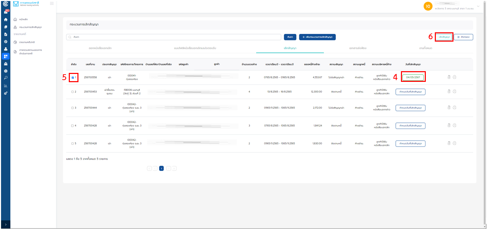<figcaption>
<strong>รูปภาพที่ 35</strong> หน้าจอแสดงเมนู เลิกสัญญา (1)
</figcaption></figure>

4. เมื่อกำหนดวันที่เรียบร้อยแล้วจะขึ้นสีเขียว
5. กดเลือกข้อมูลที่ต้องการเลิกสัญญาในช่องสี่เหลี่ยมด้านหน้าสุด
6. กดปุ่ม “เลิกสัญญา”

<figure>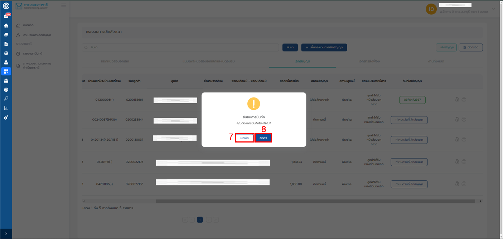<figcaption>
<strong>รูปภาพที่ 36</strong> หน้าจอ Pop-up ยืนยันการบันทึก
</figcaption></figure>

7. ไม่บันทึกข้อมูล กดปุ่ม “ยกเลิก”
8. บันทึกข้อมูล กดปุ่ม “ตกลง”

<figure>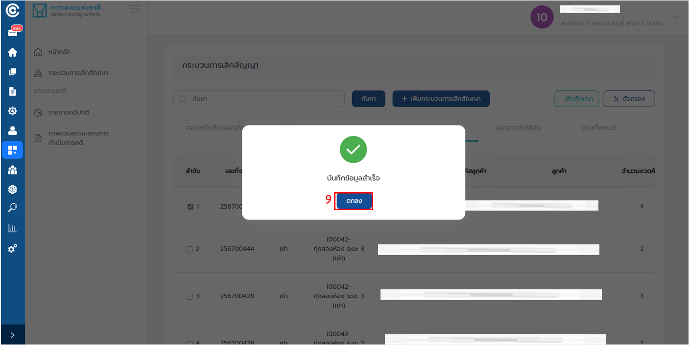<figcaption>
<strong>รูปภาพที่ 37</strong> หน้าจอ Pop-up ยืนยันการบันทึกสำเร็จ
</figcaption></figure>

9. กดปุ่ม “ตกลง”

### 3.5 ขั้นตอนเอกสารส่งฟ้อง 

เป็นขั้นตอนหลังจากเลิกสัญญาไปแล้ว ข้อมูลจะมาแสดงที่แท็บงานเอกสารส่งฟ้อง โดยพนังงาน สคล./สคจ. จะแนบไฟล์เอกสาร ซึ่งระบบจะแสดงเอกสารประกอบส่งฟ้องตามประเภทสัญญานั้นๆ เมื่อแนบไฟล์เสร็จแล้วสามารถบันทึกร่าง หรือ ส่งเอกสารส่งฟ้องให้กับนิติกรได้

<figure>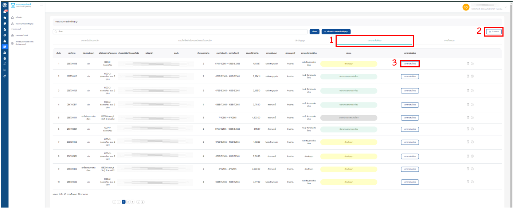<figcaption>
<strong>รูปภาพที่ 38</strong> หน้าจอแสดงเมนู เอกสารส่งฟ้อง
</figcaption></figure>

1. กดที่เมนู เอกสารส่งฟ้อง
2. ปุ่ม “ตัวกรอง”

<figure>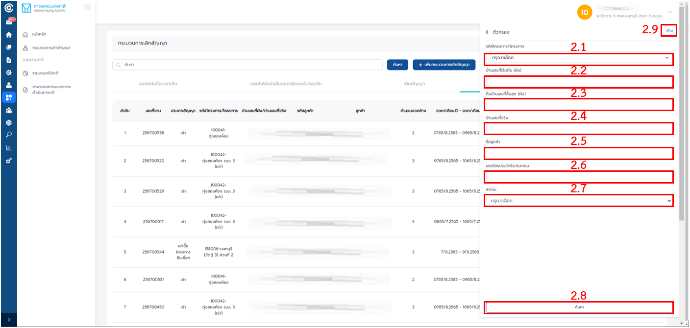<figcaption>
<strong>รูปภาพที่ 39</strong> หน้าจอ Pop-up “ตัวกรอง”
</figcaption></figure>

&#x20;       2.1 กรอกข้อมูล “รหัสโครงการ/โครงการ”

&#x20;       2.2 กรอกข้อมูล “บ้านเลขที่เริ่มต้น (ผัง)”

&#x20;       2.3 กรอกข้อมูล “ถึงบ้านเลขที่สิ้นสุด (ผัง)”

&#x20;       2.4 กรอกข้อมูล “บ้านเลขที่จริง”

&#x20;       2.5 กรอกข้อมูล “ชื่อลูกค้า”

&#x20;       2.6 กรอกข้อมูล “เลขบัตรประจำตัวประชาชน”

&#x20;       2.7 กรอกข้อมูล “สถานะ”

&#x20;       2.8 กดปุ่ม “ค้นหา”

&#x20;       2.9 ลบข้อมูล กดปุ่ม “ล้าง”

3. ปุ่ม “เอกสารส่งฟ้อง”

<figure>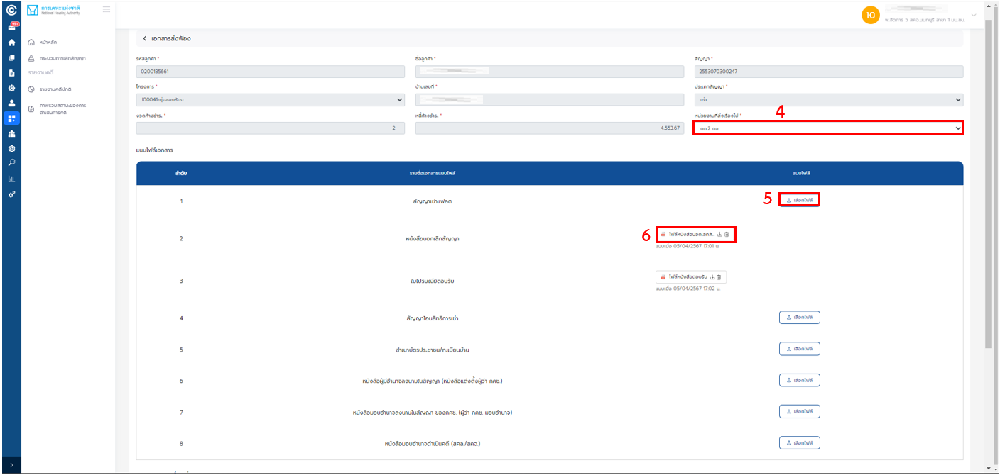<figcaption>
<strong>รูปภาพที่ 40</strong> หน้าจอแสดงเมนู เอกสารส่งฟ้อง (1)
</figcaption></figure>

4. กรอกข้อมูล“หน่วยงานที่ส่งเรื่องไป”
5. แนบไฟล์ กดปุ่ม “เลือกไฟล์”
6. แนบไฟล์แล้ว

<figure>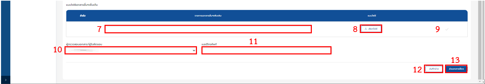<figcaption>
<strong>รูปภาพที่ 41</strong> หน้าจอแสดงเมนู เอกสารส่งฟ้อง (2)
</figcaption></figure>

7. กรอกข้อมูลชื่อไฟล์เอกสารอื่นๆเพิ่มเติม
8. แนบไฟล์ กดปุ่ม “เลือกไฟล์”
9. บันทึกแนบไฟล์ กดไอคอน “”
10. กรอกข้อมูล“ผู้ตรวจสอบเอกสาร/ผู้รับผิดชอบ”
11. กรอกข้อมูล“เบอร์โทรศัพท์”
12. บันทึกข้อมูลยังไม่พร้อมส่ง กดปุ่ม “บันทึกร่าง”
13. ข้อมูลเรียบร้อยพร้อมส่ง กดปุ่ม “ส่งเอกสารฟ้อง”

<figure><figcaption>
<strong>รูปภาพที่ 42</strong> หน้าจอ Pop-up ยืนยันการบันทึกร่างข้อมูลสำเร็จ
</figcaption></figure>

กดปุ่ม “ตกลง”

<figure>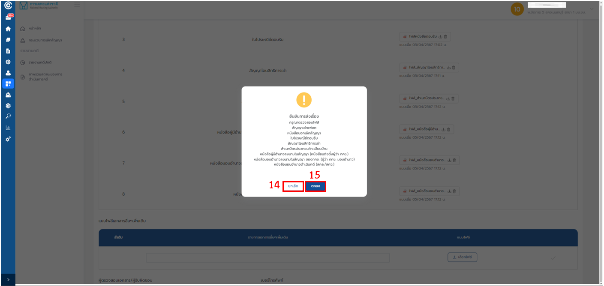<figcaption>
<strong>รูปภาพที่ 43</strong> หน้าจอ Pop-up ยืนยันการส่งเรื่อง
</figcaption></figure>

14. ไม่ส่งเรื่อง กดปุ่ม “ยกเลิก”
15. ส่งเรื่อง กดปุ่ม “ตกลง”

<figure>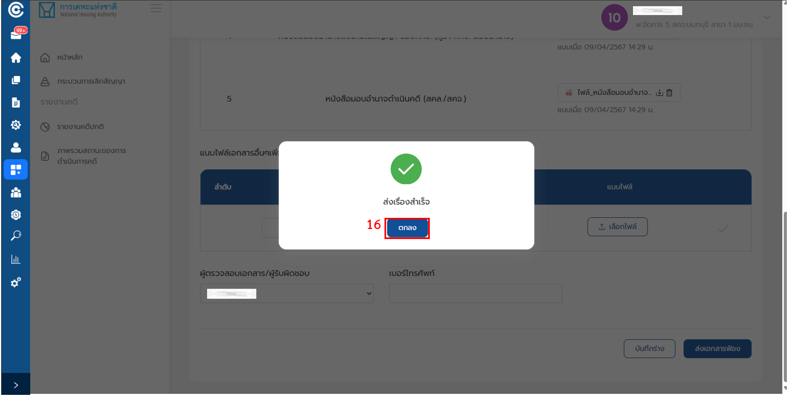<figcaption>
<strong>รูปภาพที่ 44</strong> หน้าจอ Pop-up ยืนยันการส่งเรื่องสำเร็จ
</figcaption></figure>

16. กดปุ่ม “ตกลง”

### 3.6 เมนู งานทั้งหมด 

เป็นแท็บที่แสดงข้อมูลทั้งหมดในกระบวนการเลิกสัญญา

<figure>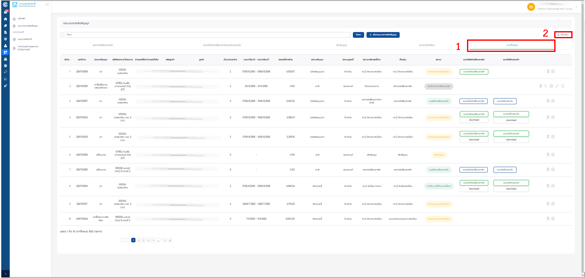<figcaption>
<strong>รูปภาพที่ 45</strong> หน้าจอแสดงเมนู งานทั้งหมด
</figcaption></figure>

1. กดที่เมนู งานทั้งหมด
2. ปุ่ม “ตัวกรอง”

<figure>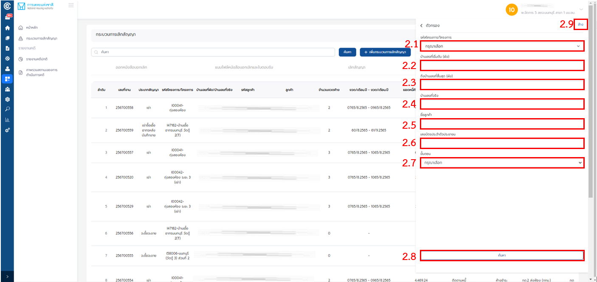<figcaption>
<strong>รูปภาพที่ 46</strong> หน้าจอ Pop-up “ตัวกรอง”
</figcaption></figure>

&#x20;       2.1 กรอกข้อมูล “รหัสโครงการ/โครงการ”

&#x20;       2.2 กรอกข้อมูล “บ้านเลขที่เริ่มต้น (ผัง)”

&#x20;       2.3 กรอกข้อมูล “ถึงบ้านเลขที่สิ้นสุด (ผัง)”

&#x20;       2.4 กรอกข้อมูล “บ้านเลขที่จริง”

&#x20;       2.5 กรอกข้อมูล “ชื่อลูกค้า”

&#x20;       2.6 กรอกข้อมูล “เลขบัตรประจำตัวประชาชน”

&#x20;       2.7 กรอกข้อมูล “ขั้นตอน”

&#x20;       2.8 กดปุ่ม “ค้นหา”

&#x20;       2.9 ลบข้อมูล กดปุ่ม “ล้าง”

### 3.7 มอบหมายนิติกร 

ระบบจะแจ้งเตือนไปยังนิติกรให้ทราบว่ามีงานจาก สคล./สคจ. ส่งเอกสารส่งฟ้องมา โดยที่นิติกรสามารถเข้ามาดูรายละเอียดเอกสารส่งฟ้องและพิจารณาได้

<figure>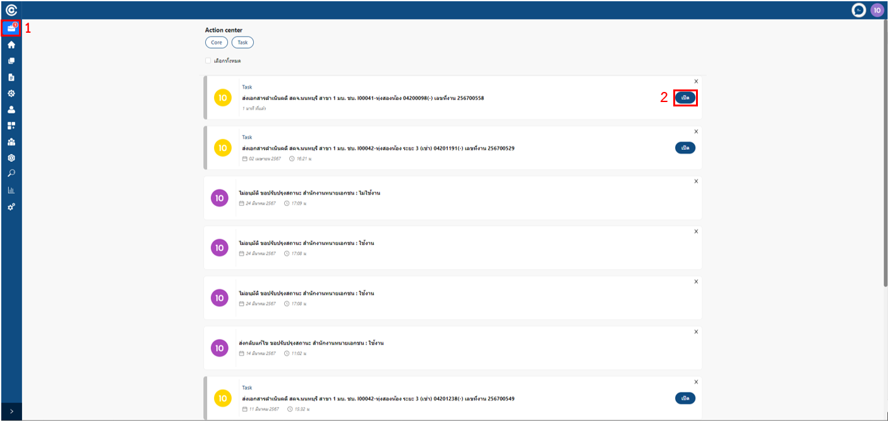<figcaption>
<strong>รูปภาพที่ 47</strong> หน้าจอแจ้งเตือนส่งเอกสารดำเนินคดี
</figcaption></figure>

1. กดเลือกเมนู Action Center / Notification
2. กดปุ่ม “เปิด” ที่ส่งเอกสารดำเนินคดี

<figure>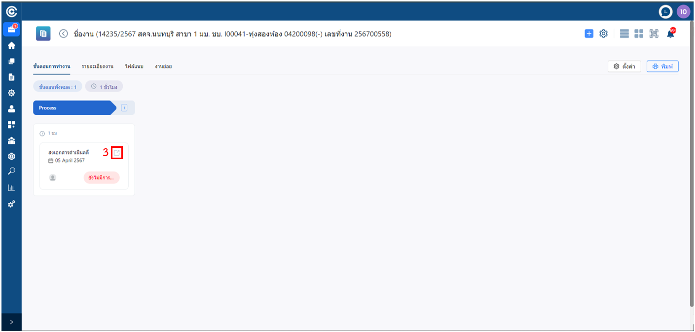<figcaption>
<strong>รูปภาพที่ 48</strong> ดำเนินการรับเรื่องส่งเอกสารดำเนินคดี
</figcaption></figure>

3. กดปุ่ม  (ไอคอน Pop-up)

<figure><figcaption></figcaption></figure>

&#x20;       ที่ กล่องพิจารณา อนุมัติหนังสือบอกเลิก

<figure>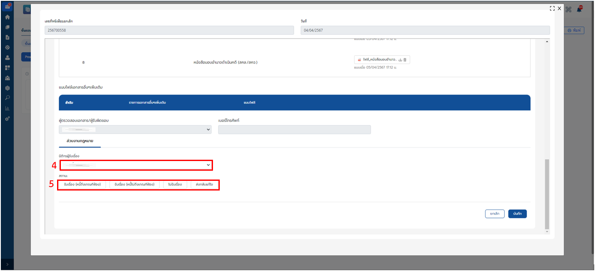<figcaption>
<strong>รูปภาพที่ 49</strong> หน้าจอรับเรื่องส่งเอกสารดำเนินคดี
</figcaption></figure>

4. กรอกข้อมูล“นิติกรผู้รับเรื่อง”
5. กดเลือก“สถานะ”

<figure>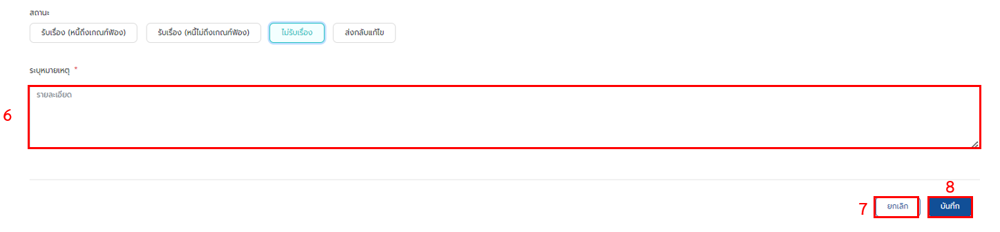<figcaption>
<strong>รูปภาพที่ 50</strong> หน้าจอรับเรื่องส่งเอกสารดำเนินคดี (1)
</figcaption></figure>

6. หากเลือกสถานะ “ไม่รับเรื่อง” และ ส่งกลับแก้ไข จะต้องกรอกข้อมูล “หมายเหตุ”
7. ไม่บันทึกข้อมูล กดปุ่ม “ยกเลิก”
8. ข้อมูลเรียบร้อยกดปุ่ม “บันทึก”

<figure>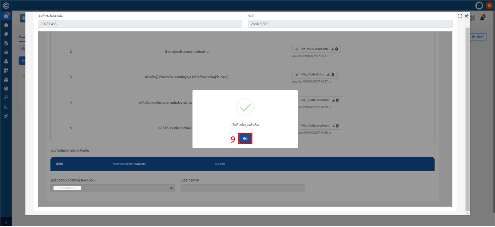<figcaption>
<strong>รูปภาพที่ 51</strong> หน้าจอ Pop-up ยืนยันบันทึกข้อมูลสำเร็จ
</figcaption></figure>

9. กดปุ่ม “ปิด”

## 4. จัดการสำนักงานทนายเอกชน 

นิติกรสามารถเพิ่มข้อมูล สำนักงานทนายความ และ ทนายความได้เพิ่มทำการจ้างทำคดีต่อไป

### 4.1 สร้าง Account ทนาย 

นิติกรสามารถจัดการข้อมูลทนายได้ โดยสามารถกำหนดสำนักงานได้ว่าทนายอยู่ในสำนักงานไหน หลังจากเพิ่มทนายเข้ามาในระบบแล้ว นั้นระบบจะส่งข้อความไปยังทนายความผ่าน E-mail เพื่อให้ทนายทราบ ผู้ใช้งานและรหัสในการเข้าสู่ระบบ

<figure>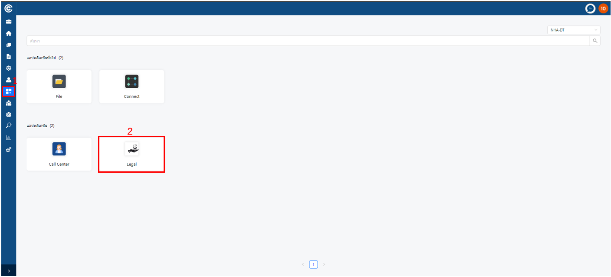<figcaption>
<strong>รูปภาพที่ 52</strong> เมนู Legal
</figcaption></figure>

1. กดที่เมนู แอปพลิเคชันของฉัน
2. กดที่เมนู Legal

<figure>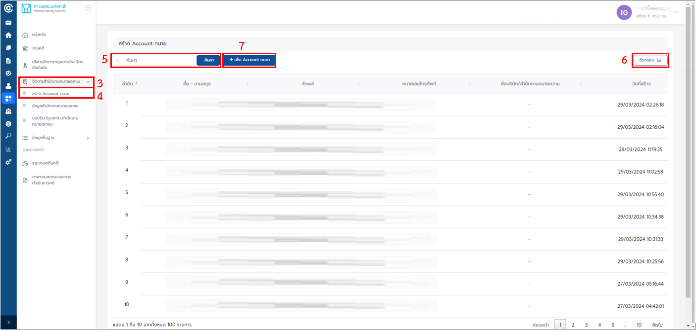<figcaption>
<strong>รูปภาพที่ 53</strong> หน้าจอแสดงเมนู สร้าง Account ทนาย
</figcaption></figure>

3. กดที่เมนู จัดการสำนักงานทนายเอกชน
4. กดที่เมนู สร้าง Account ทนาย
5. กรอกคำค้นหาในช่อง “ค้นหา”
6. ปุ่ม “ตัวกรอง”

<figure>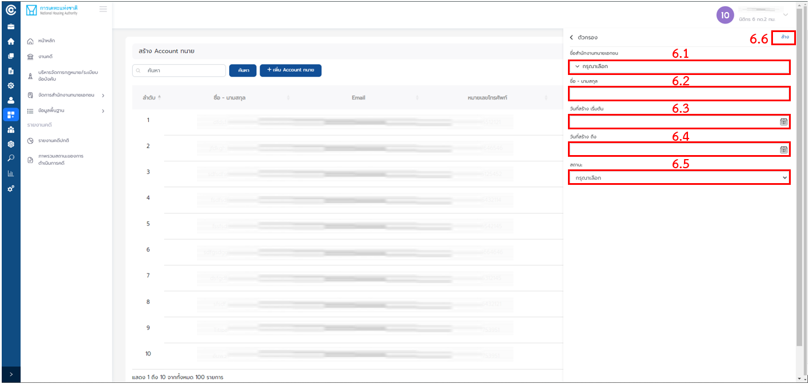<figcaption>
<strong>รูปภาพที่ 54</strong> หน้าจอ Pop-up “ตัวกรอง”
</figcaption></figure>

&#x20;       6.1 กรอกข้อมูล “ชื่อสำนักงานทนายเอกชน”

&#x20;       6.2 กรอกข้อมูล “ชื่อ - นามสกุล”

&#x20;       6.3 กรอกข้อมูล “วันที่สร้าง เริ่มต้น”

&#x20;       6.4 กรอกข้อมูล “วันที่สร้าง ถึง”

&#x20;       6.5 กรอกข้อมูล “สถานะ”

&#x20;       6.6 ลบข้อมูล กดปุ่ม“ล้าง”

7. กดปุ่ม “+ เพิ่ม Account ทนาย”

<figure>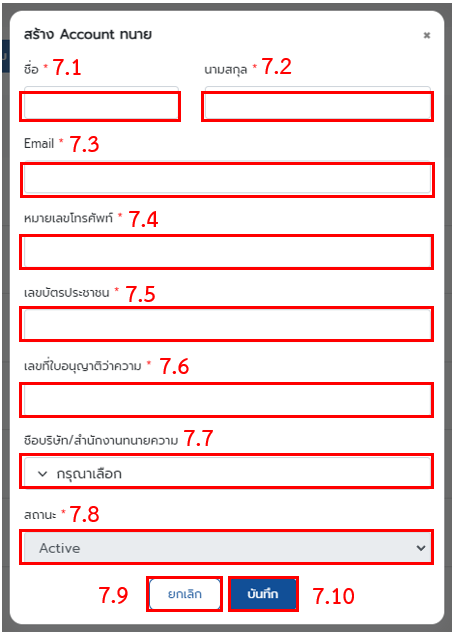<figcaption>
<strong>รูปภาพที่ 55</strong> หน้าจอ Pop-up สร้าง Account ทนาย
</figcaption></figure>

&#x20;       7.1 กรอกข้อมูล “ชื่อ”

&#x20;       7.2 กรอกข้อมูล “นามสกุล”

&#x20;       7.3 กรอกข้อมูล “Email”

&#x20;       7.4 กรอกข้อมูล “หมายเลขโทรศัพท์”

&#x20;       7.5 กรอกข้อมูล “เลขบัตรประชาชน”

&#x20;       7.6 กรอกข้อมูล “เลขที่ใบอนุญาติว่าความ”

&#x20;       7.7 ระบุ สำนักงงานทนายความ

&#x20;       7.8 กรอกข้อมูล “สถานะ”

&#x20;       7.9 ไม่บันทึกข้อมูล กดปุ่ม “ยกเลิก”

&#x20;       7.10 ข้อมูลเรียบร้อยกดปุ่ม “บันทึก”

<figure>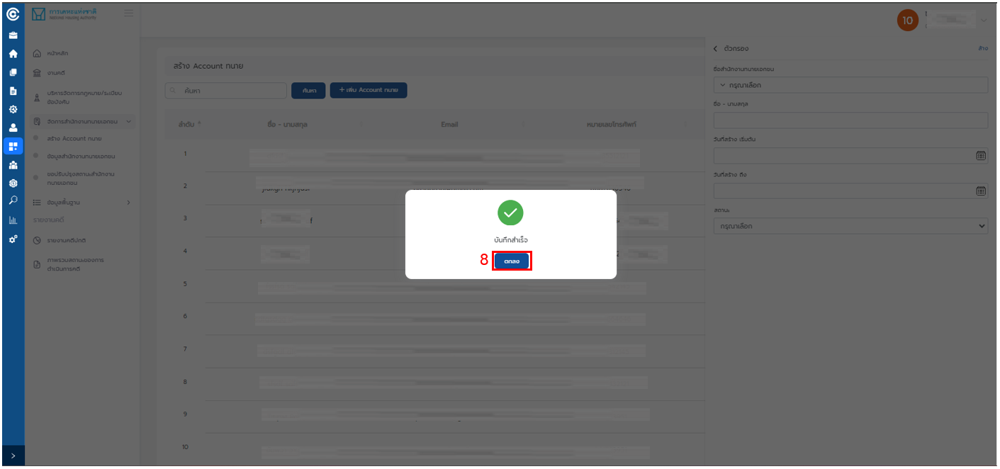<figcaption>
<strong>รูปภาพที่ 56</strong> หน้าจอ Pop-up บันทึกข้อมูลสำเร็จ
</figcaption></figure>

8. กดปุ่ม “ตกลง”

<figure>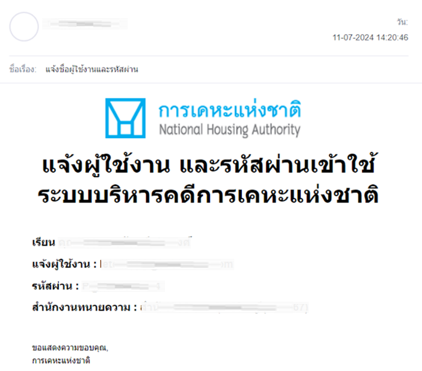<figcaption>
<strong>รูปภาพที่ 57</strong> หน้าจอแจ้งเตือน Email แจ้งชื่อผู้ใช้งานและรหัสผ่าน
</figcaption></figure>

### 4.2 ข้อมูลสำนักงานทนายเอกชน 

นิติกรสามารถจัดการข้อมูลสำนักงานทนายได้ โดยจะระบุข้อมูลสำนักงานพร้อมกับข้อมูลสัญญาจ้างที่ทำไว้ระหว่าง กคช. กับ สำนักงานทนาย

<figure>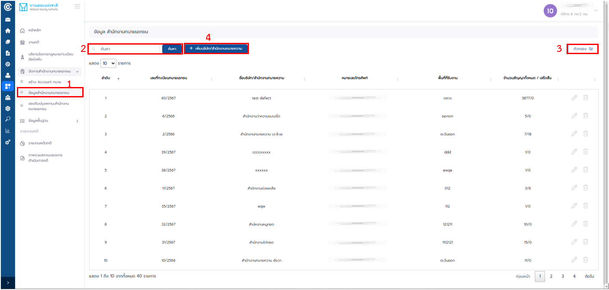<figcaption>
<strong>รูปภาพที่ 58</strong> หน้าจอแสดงเมนู ข้อมูลสำนักงานทนายเอกชน
</figcaption></figure>

1. กดที่เมนู ข้อมูลสำนักงานทนายเอกชน
2. กรอกคำค้นหาในช่อง “ค้นหา”
3. ปุ่ม “ตัวกรอง”

<figure>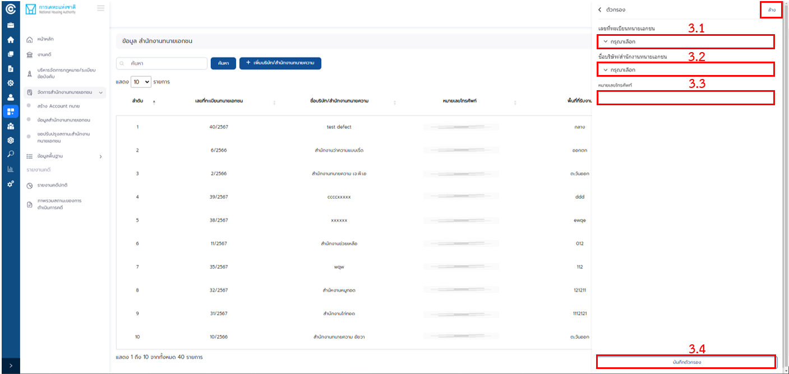<figcaption>
<strong>รูปภาพที่ 59</strong> หน้าจอ Pop-up “ตัวกรอง”
</figcaption></figure>

&#x20;       3.1 กรอกข้อมูล “เลขที่ทะเบียนทนายเอกชน”

&#x20;       3.2 กรอกข้อมูล “ชื่อบริษัท/สำนักงานทนายเอกชน”

&#x20;       3.3 กรอกข้อมูล “หมายเลขโทรศัพท์”

&#x20;       3.4 กดปุ่ม “บันทึกตัวกรอง”

&#x20;       3.5 ลบข้อมูล กดปุ่ม “ล้าง”

4. กดปุ่ม “+ เพิ่มบริษัท/สำนักงานทนายความ”

<figure><figcaption>
<strong>รูปภาพที่ 60</strong> หน้าจอเพิ่มบริษัท/สำนักงานทนายความ
</figcaption></figure>

&#x20;       4.1 กรอกข้อมูล “ชื่อบริษัท/สำนักงานทนายความ”

&#x20;       4.2 กรอกข้อมูล “เลขที่บริษัท/เลขที่บัตรประชาชน”

&#x20;       4.3 แสดงเลขที่ทะเบียนทนายเอกชน

&#x20;       4.4 กรอกข้อมูล “Vendor Code”

&#x20;       4.5 กรอกข้อมูล “หมายเลขโทรศัพท์”

&#x20;       4.6 แสดง สถานะ

&#x20;       4.7 กรอกข้อมูล “ที่อยู่สำนักงาน”

&#x20;       4.8 กรอกข้อมูล “พื้นที่รับงาน (ภาค)”

&#x20;       4.9 กรอกข้อมูล “ชื่อหัวหน้าสำนักงาน/กรรมการ ณ วันขึ้นทะเบียน”

&#x20;       4.10 กรอกข้อมูล “หมายเหตุ”

&#x20;       4.11 แท็บ ทนายความ แสดงข้อมูลทนายความที่อยู่ในสำนักงานนั้น ๆ

<figure>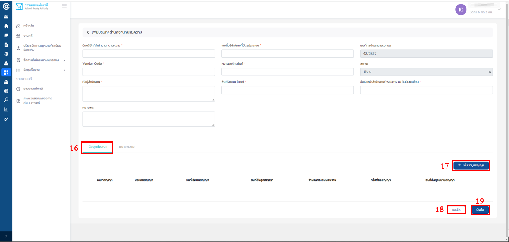<figcaption>
<strong>รูปภาพที่ 61</strong> หน้าจอเพิ่มบริษัท/สำนักงานทนายความ (1)
</figcaption></figure>

16. กดที่เมนู ทนายความ
17. กดปุ่ม “+ เพิ่มข้อมูลสัญญา”

<figure>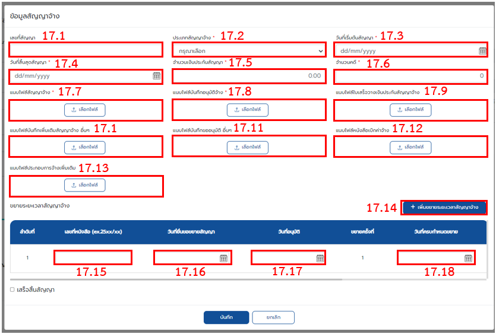<figcaption>
<strong>รูปภาพที่ 62</strong> หน้าจอ Pop-up ข้อมูลสัญญาจ้าง
</figcaption></figure>

&#x20;       17.1 กรอกข้อมูล “เลขที่สัญญา”

&#x20;       17.2 กรอกข้อมูล “ประเภทสัญญาจ้าง”

&#x20;       17.3 กรอกข้อมูล “วันที่เริ่มต้นสัญญา”

&#x20;       17.4 กรอกข้อมูล “วันที่สิ้นสุดสัญญา”

&#x20;       17.5 กรอกข้อมูล “จำนวนเงินประกันสัญญา”

&#x20;       17.6 กรอกข้อมูล “จำนวนคดี”

&#x20;       17.7 แนบไฟล์สัญญาจ้าง กดปุ่ม “เลือกไฟล์”

&#x20;       17.8 แนบไฟล์บันทึกอนุมัติจ้าง กดปุ่ม “เลือกไฟล์”

&#x20;       17.9 แนบไฟล์ใบเสร็จวางเงินประกันสัญญาจ้าง กดปุ่ม “เลือกไฟล์”

&#x20;       17.10 แนบไฟล์บันทึกเพิ่มเติมสัญญาจ้าง อื่นๆ กดปุ่ม “เลือกไฟล์”

&#x20;       17.11 แนบไฟล์บันทึกขออนุมัติ อื่นๆ กดปุ่ม “เลือกไฟล์”

&#x20;       17.12 แนบไฟล์หนังสือเบิกค่าจ้าง กดปุ่ม “เลือกไฟล์”

&#x20;       17.13 แนบไฟล์ประกอบการจ้างเพิ่มเติม กดปุ่ม “เลือกไฟล์”

&#x20;       17.14 กดปุ่ม “+ เพิ่มขยายระยะเวลาสัญญาจ้าง”

&#x20;       17.15 กรอกข้อมูล “เลขที่หนังสือ”

&#x20;       17.16 กรอกข้อมูล “วันที่ยื่นขอขยายสัญญา”

&#x20;       17.17 กรอกข้อมูล “วันที่อนุมัติ”

&#x20;       17.18 กรอกข้อมูล “วันที่ครบกำหนดขยาย”

<figure><figcaption>
<strong>รูปภาพที่ 63</strong> หน้าจอ Pop-up ข้อมูลสัญญาจ้าง (1)
</figcaption></figure>

&#x20;       17.19 กดปุ่ม “แนบไฟล์ขยายระยะเวลาสัญญาจ้าง”

&#x20;       17.20 กดปุ่ม (ไอคอน ลบ)

<figure><figcaption></figcaption></figure>

&#x20;                  เพื่อลบข้อมูล

<figure>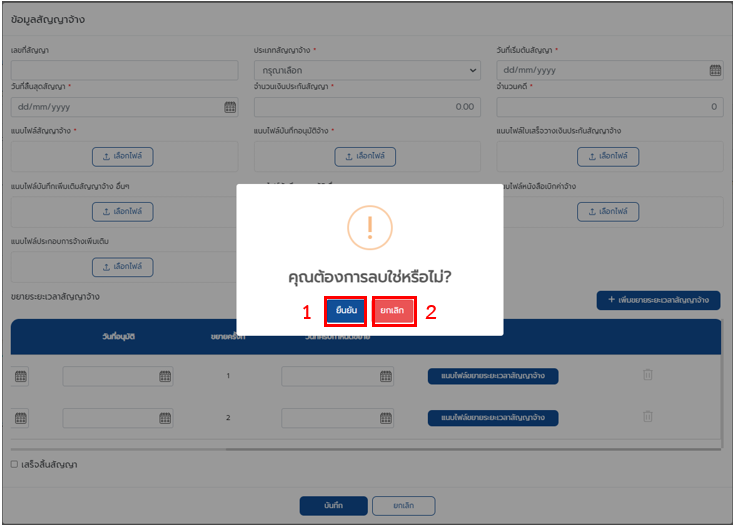<figcaption>
<strong>รูปภาพที่ 64</strong> หน้าจอ Pop-up ยืนยันลบข้อมูล
</figcaption></figure>

&#x20;                  17.20.1 ต้องการลบข้อมูล กดปุ่ม “ยืนยัน”

&#x20;                  17.20.2 ไม่ต้องการลบข้อมูล กดปุ่ม “ยกเลิก”

&#x20;       17.21 “เสร็จสิ้นสัญญา” กดเลือกช่องสี่เหลี่ยม

&#x20;       17.22 ข้อมูลเรียบร้อยกดปุ่ม “บันทึก”

&#x20;       17.23 ไม่บันทึกข้อมูล กดปุ่ม “ยกเลิก”

<figure><figcaption>
<strong>รูปภาพที่ 65</strong> หน้าจอ Pop-up ยืนยันการบันทึกข้อมูล
</figcaption></figure>

18. ไม่บันทึกข้อมูล กดปุ่ม “ยกเลิก”
19. ข้อมูลเรียบร้อยกดปุ่ม “บันทึก”

<figure>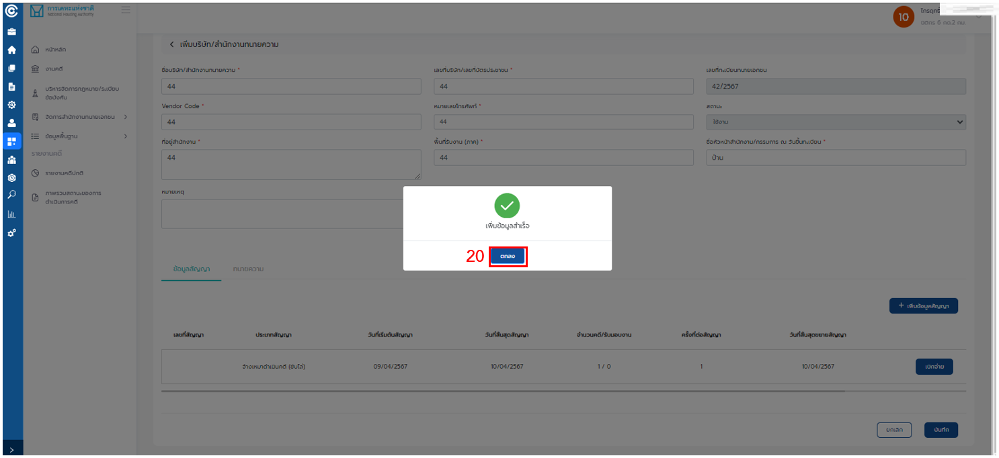<figcaption>
<strong>รูปภาพที่ 66</strong> หน้าจอ Pop-up ยืนยันการบันทึกข้อมูลสำเร็จ
</figcaption></figure>

20. &#x20;กดปุ่ม “ตกลง”

### 4.3 ขอปรับปรุงสถานะ สำนักงานทนายเอกชน 

นิติกรทำเรื่องปรับปรุงสถานะ 3 สถานะ ได้แก่

1. ใช้งาน
2. พักรับงาน (ไม่รับงานคดี)
3. แบล็กลิสต์

<figure>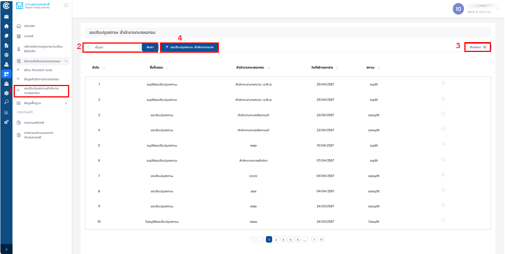<figcaption>
<strong>รูปภาพที่ 67</strong> หน้าจอแสดงเมนู ขอปรับปรุงสถานะ สำนักงานทนายเอกชน
</figcaption></figure>

1. กดที่เมนู ขอปรับปรุงสถานะ สำนักงานทนายเอกชน
2. กรอกคำค้นหาในช่อง “ค้นหา”
3. ปุ่ม “ตัวกรอง”

<figure>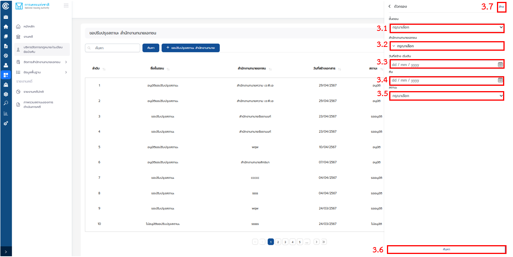<figcaption>
<strong>รูปภาพที่ 68</strong> หน้าจอ Pop-up “ตัวกรอง”
</figcaption></figure>

&#x20;       3.1 กรอกข้อมูล “ขั้นตอน”

&#x20;       3.2 กรอกข้อมูล “สำนักงานทนายเอกชน”

&#x20;       3.3 กรอกข้อมูล “วันที่สร้าง เริ่มต้น”

&#x20;       3.4 กรอกข้อมูล “ถึง”

&#x20;       3.5 กรอกข้อมูล “สถานะ”

&#x20;       3.6 กดปุ่ม “ค้นหา”

&#x20;       3.7 ลบข้อมูล กดปุ่ม “ล้าง”

4. กดปุ่ม “+ ขอปรับปรุงสถานะ สำนักงานทนายเอกชน”

<figure>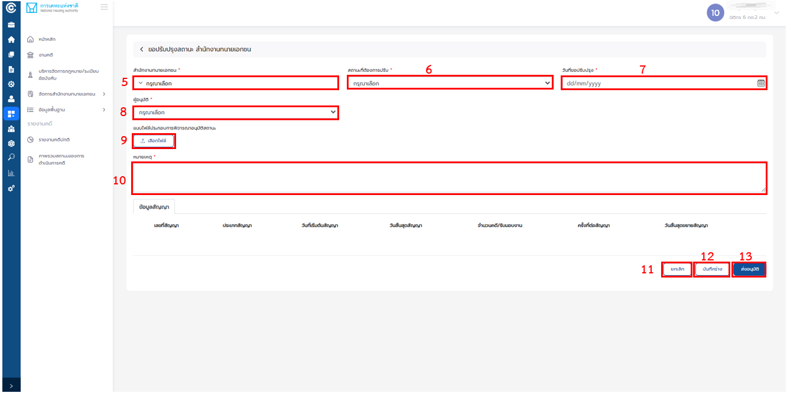<figcaption>
<strong>รูปภาพที่ 69</strong> หน้าจอเพิ่มบริษัท/สำนักงานทนายความ
</figcaption></figure>

5. กรอกข้อมูล “สำนักงานทนายความ”
6. กรอกข้อมูล “สถานะที่ต้องการปรับ”
7. กรอกข้อมูล “วันที่ขอปรับปรุง”
8. กรอกข้อมูล “ผู้อนุมัติ”
9. แนบไฟล์ประกอบการพิจารณาอนุมัติสถานะ กดปุ่ม “เลือกไฟล์”
10. กรอกข้อมูล “หมายเหตุ”
11. ไม่บันทึกข้อมูล กดปุ่ม “ยกเลิก”
12. บันทึกข้อมูล กดปุ่ม “บันทึกร่าง”
13. ข้อมูลเรียบร้อยกดปุ่ม “ส่งอนุมัติ”

## 5. งานคดี 

จะเป็นขั้นตอนหลังจากที่นิติกรรับเรื่องมาจาก สคล./สคจ. มาแล้ว

### 5.1 นิติกรรับเรื่อง 

นิติกรรับเรื่องฟ้องโดยจะมีการแสดงข้อมูลต่างๆ ของลูกหนี้ และนิติกรสามารถจ้างทนายเพื่อดำเนินคดีต่อไปได้

<figure>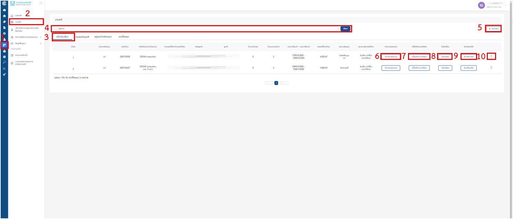<figcaption>
<strong>รูปภาพที่ 70</strong> หน้าจอแสดงเมนู นิติกรรับเรื่อง
</figcaption></figure>

1. กดที่เมนู แอปพลิเคชันของฉัน
2. กดที่เมนู งานคดี
3. กดที่เมนู นิติกรรับเรื่อง
4. กรอกคำค้นหาในช่อง “ค้นหา”
5. ปุ่ม “ตัวกรอง”

<figure>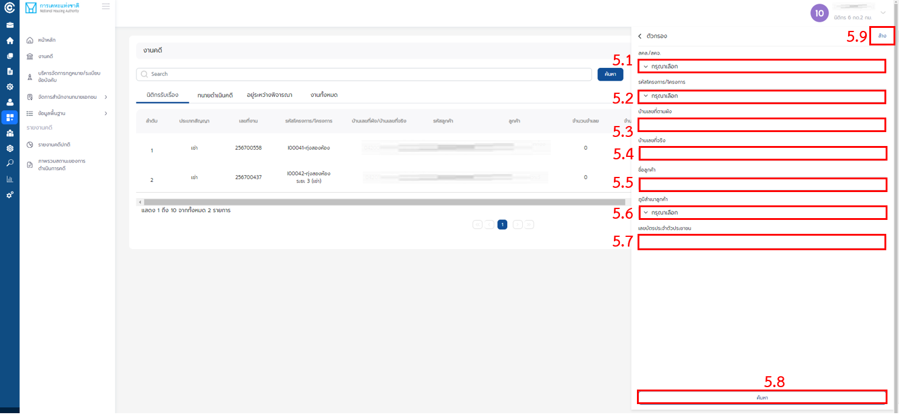<figcaption>
<strong>รูปภาพที่ 71</strong> หน้าจอ Pop-up “ตัวกรอง”
</figcaption></figure>

&#x20;       5.1 กรอกข้อมูล “สคล./สคจ.”

&#x20;       5.2 กรอกข้อมูล “รหัสโครงการ/โครงการ”

&#x20;       5.3 กรอกข้อมูล “บ้านเลขที่ตามผัง”

&#x20;       5.4 กรอกข้อมูล “บ้านเลขที่จริง”

&#x20;       5.5 กรอก ข้อมูล “ชื่อลูกค้า”

&#x20;       5.6 กรอกข้อมูล “ภูมิลำเนาลูกค้า”

&#x20;       5.7 กรอกข้อมูล “เลขบัตรประจำตัวประชาชน”

&#x20;       5.8 กดปุ่ม “ค้นหา”

&#x20;       5.9 ลบข้อมูล กดปุ่ม “ล้าง”

6. ปุ่ม “จ้างทนายเอกชน”

<figure>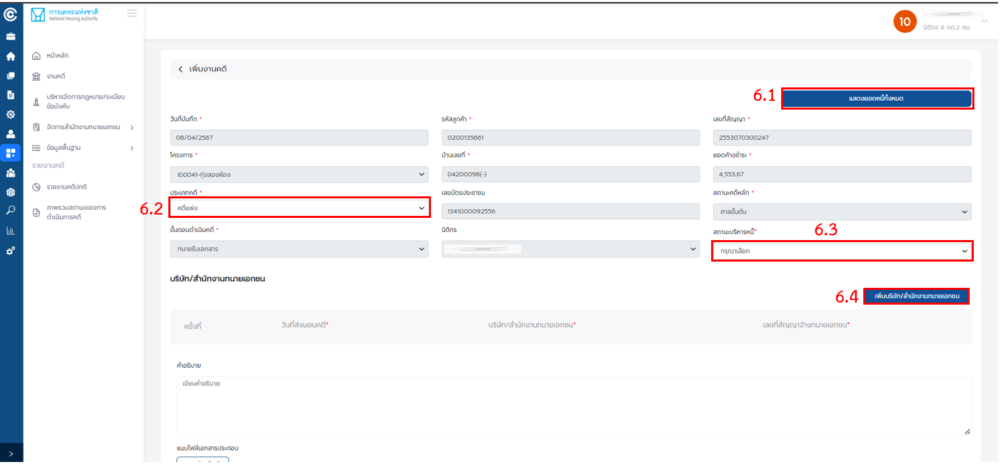<figcaption>
<strong>รูปภาพที่ 72</strong> หน้าจอจ้างทนายเอกชน
</figcaption></figure>

&#x20;       6.1 กดปุ่ม “แสดงยอดหนี้ทั้งหมด”

<figure><figcaption>
<strong>รูปภาพที่ 73</strong> หน้าจอแสดงยอดหนี้ทั้งหมด
</figcaption></figure>

&#x20;       6.2 กรอกข้อมูล “ประเภทคดี”

&#x20;       6.3 กรอกข้อมูล “สถานะบริหารหนี้”

&#x20;       6.4 กดปุ่ม “เพิ่มบริษัท/สำนักงานทนายเอกชน”

<figure>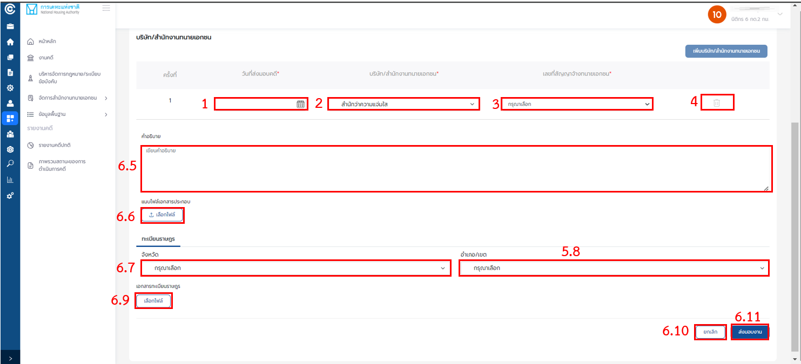<figcaption>
<strong>รูปภาพที่ 74</strong> หน้าจอจ้างทนายเอกชน (1)
</figcaption></figure>

&#x20;                  6.4.1 กรอกข้อมูล“วันที่ส่งมอบคดี”

&#x20;                  6.4.2 กรอกข้อมูล“บริษัท/สำนักงานทนายเอกชน”

&#x20;                  6.4.3 กรอกข้อมูล“เลขที่สัญญาจ้างทนายเอกชน”

&#x20;                  6.4.4 กดปุ่ม (ไอคอน ลบ)

<figure><figcaption></figcaption></figure>

&#x20;                           เพื่อลบข้อมูล

&#x20;       6.5 กรอกข้อมูล “คำอธิบาย”

&#x20;       6.6 แนบไฟล์เอกสารประกอบ กดปุ่ม “เลือกไฟล์”

&#x20;       6.7 กรอกข้อมูล “จังหวัด”

&#x20;       6.8 กรอกข้อมูล “อำเภอ/เขต”

&#x20;       6.9 แนบไฟล์เอกสารทะเบียนราษฎร กดปุ่ม “เลือกไฟล์”

&#x20;       6.10 ไม่บันทึกข้อมูล กดปุ่ม “ยกเลิก”

&#x20;       6.11 ข้อมูลเรียบร้อยกดปุ่ม “ส่งมอบงาน”

7. ปุ่ม “หนี้ไม่ถึงเกณฑ์ฟ้อง”

<figure><figcaption>
<strong>รูปภาพที่ 75</strong> หน้าจอ Pop-up “หนี้ไม่ถึงเกณฑ์ฟ้อง”
</figcaption></figure>

&#x20;       7.1 ไม่บันทึกข้อมูล กดปุ่ม “ยกเลิก”

&#x20;       7.2 ข้อมูลเรียบร้อยกดปุ่ม “ตกลง”

8. ปุ่ม “ไม่รับเรื่อง”

<figure><figcaption>
<strong>รูปภาพที่ 76</strong> หน้าจอ Pop-up “ไม่รับเรื่อง”
</figcaption></figure>

&#x20;       8.1 กรอกข้อมูล“หมายเหตุ”

&#x20;       8.2 ไม่บันทึกข้อมูล กดปุ่ม “ยกเลิก”

&#x20;       8.3 ข้อมูลเรียบร้อยกดปุ่ม “ตกลง”

9. ปุ่ม “ส่งกลับแก้ไข”

<figure>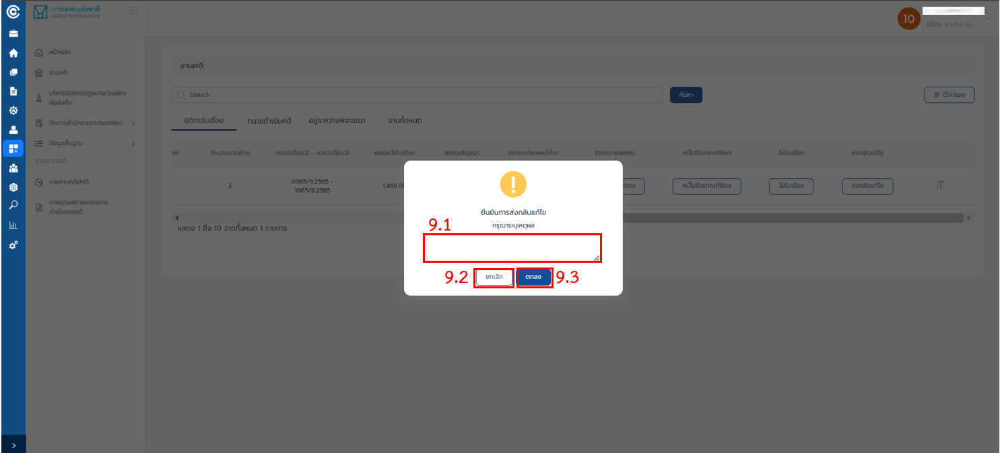<figcaption>
<strong>รูปภาพที่ 77</strong> หน้าจอ Pop-up “ส่งกลับแก้ไข”
</figcaption></figure>

&#x20;       9.1 กรอกข้อมูล“หมายเหตุ”

&#x20;       9.2 ไม่บันทึกข้อมูล กดปุ่ม “ยกเลิก”

&#x20;       9.3 ข้อมูลเรียบร้อยกดปุ่ม “ตกลง”

10. ปุ่ม (ไอคอน ถุงเงิน)

<figure><figcaption></figcaption></figure>

&#x20;       เพื่อ “แสดงยอดหนี้ค้างชำระ” มีรายละเอียดดังนี้

<figure>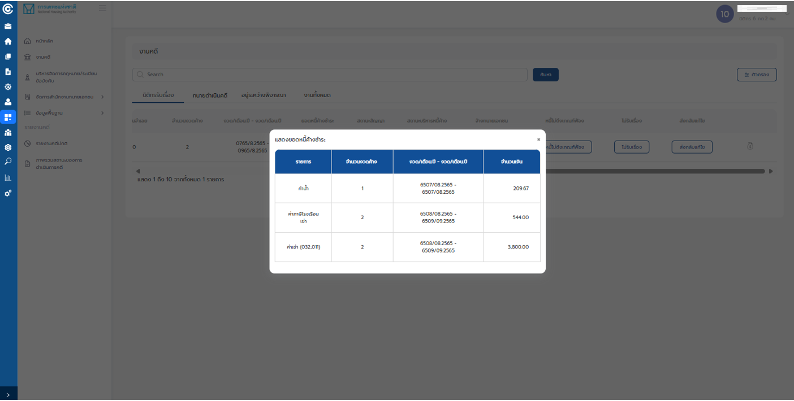<figcaption>
<strong>รูปภาพที่ 78</strong> หน้าจอแสดงยอดหนี้ค้างชำระ
</figcaption></figure>

&#x20;       10.1 รายการ

&#x20;       10.2 จำนวนงวดค้าง

&#x20;       10.3 งวด/เดือน.ปี - งวด/เดือน.ปี

&#x20;       10.4 จำนวนเงิน

### 5.2 ทนายดำเนินคดี 

หลังที่นิติกรจ้างทนายความแล้ว ข้อมูลจะแสดงขึ้นมา

<figure>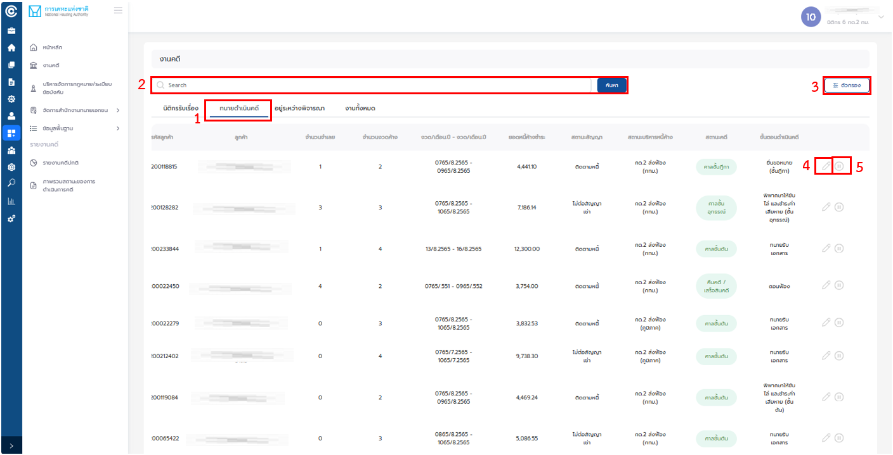<figcaption>
<strong>รูปภาพที่ 79</strong> หน้าจอแสดงเมนู ทนายดำเนินคดี
</figcaption></figure>

1. กดที่เมนู ทนายดำเนินคดี
2. กรอกคำค้นหาในช่อง “ค้นหา”
3. ปุ่ม “ตัวกรอง”

<figure><figcaption>
<strong>รูปภาพที่ 80</strong> หน้าจอ Pop-up “ตัวกรอง”
</figcaption></figure>

&#x20;       3.1 กรอกข้อมูล  “สคล./สคจ.”

&#x20;       3.2 กรอกข้อมูล  “รหัสโครงการ/โครงการ”

&#x20;       3.3 กรอกข้อมูล “บ้านเลขที่ตามผัง”

&#x20;       3.4 กรอกข้อมูล “บ้านเลขที่จริง”

&#x20;       3.5 กรอกข้อมูล “ชื่อลูกค้า”

&#x20;       3.6 กรอกข้อมูล “ภูมิลำเนาลูกค้า”

&#x20;       3.7 กรอกข้อมูล “เลขบัตรประจำตัวประชาชน”

&#x20;       3.8 กรอกข้อมูล “ขั้นตอนดำเนินคดี”

&#x20;       3.9 กรอกข้อมูล “สถานะคดี”

&#x20;       3.10 กดปุ่ม “ค้นหา”

&#x20;       3.11 ลบข้อมูล กดปุ่ม “ล้าง”

4. กดปุ่ม (ไอคอน แก้ไข)

<figure><figcaption></figcaption></figure>

&#x20;      เพื่อ “แก้ไข”

<figure>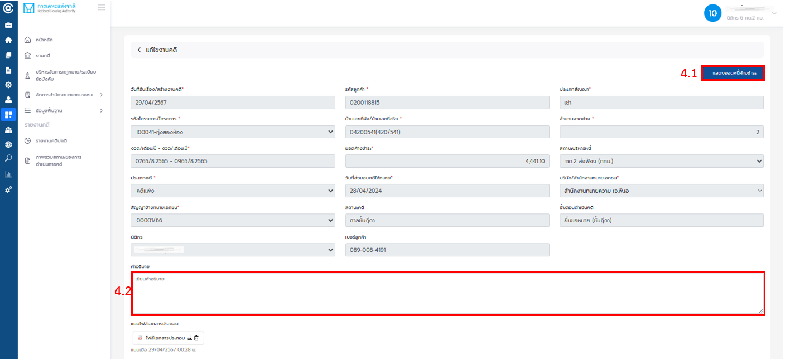<figcaption>
<strong>รูปภาพที่ 81</strong> หน้าจอแสดงเมนู แก้ไขงานคดี
</figcaption></figure>

&#x20;       4.1 กดปุ่ม “แสดงยอดหนี้ค้างชำระ”

&#x20;       4.2 กรอกข้อมูล “คำอธิบาย”

<figure>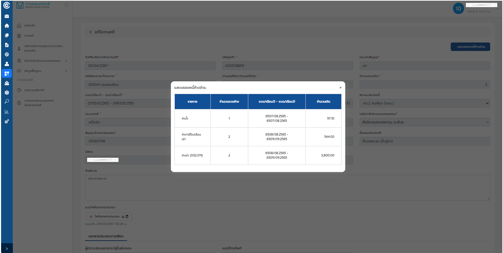<figcaption>
<strong>รูปภาพที่ 82</strong> หน้าจอแสดงยอดหนี้ค้างชำระ
</figcaption></figure>

<figure>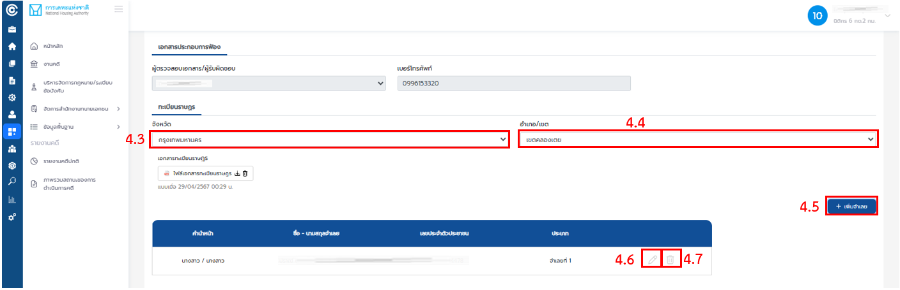<figcaption>
<strong>รูปภาพที่ 83</strong> หน้าจอแก้ไขงานคดี
</figcaption></figure>

&#x20;       4.3 กรอกข้อมูล “คำอธิบาย”

&#x20;       4.4 กรอกข้อมูล “คำอธิบาย”

&#x20;       4.5 กดปุ่ม “+ เพิ่มจำเลย”

<figure>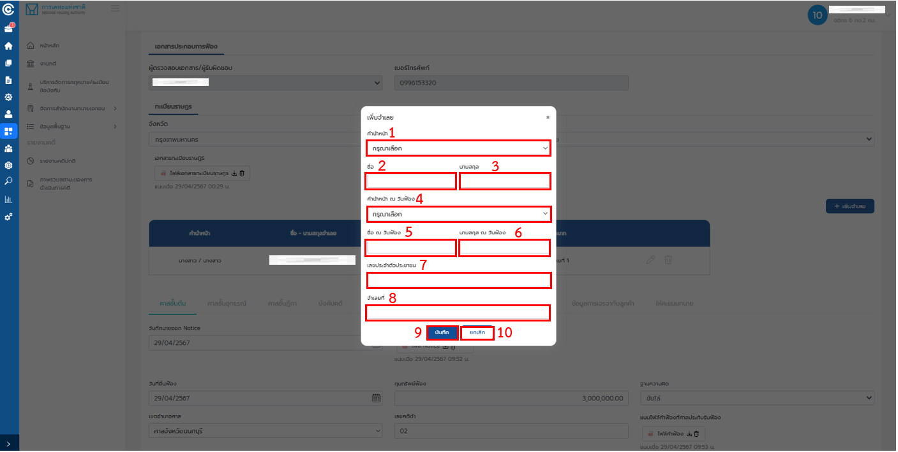<figcaption>
<strong>รูปภาพที่ 84</strong> หน้าจอ Pop-up เพิ่มจำเลย
</figcaption></figure>

&#x20;              4.5.1 กรอกข้อมูล “คำนำหน้า”

&#x20;              4.5.2 กรอกข้อมูล “ชื่อ”

&#x20;              4.5.3 กรอกข้อมูล “นามสกุล”

&#x20;              4.5.4 กรอกข้อมูล “คำนำหน้า ณ วันฟ้อง”

&#x20;              4.5.5 กรอกข้อมูล “ชื่อ ณ วันฟ้อง”

&#x20;              4.5.6 กรอกข้อมูล “นามสกุล ณ วันฟ้อง”

&#x20;              4.5.7 กรอกข้อมูล “เลขประจำตัวประชาชน”

&#x20;              4.5.8 กรอกข้อมูล “จำเลยที่”

&#x20;              4.5.9 ข้อมูลเรียบร้อยกดปุ่ม “บันทึก”

&#x20;              4.5.10 ไม่บันทึกข้อมูล กดปุ่ม “ยกเลิก”

&#x20;       4.6 กดปุ่ม  (ไอคอน แก้ไข)

<figure><figcaption></figcaption></figure>

&#x20;             เพื่อ “แก้ไข”

&#x20;       4.7 กดปุ่ม  (ไอคอน ลบ)

<figure><figcaption></figcaption></figure>

&#x20;             เพื่อ “ลบ”

5. กดปุ่ม (ไอคอน หยุด)

<figure><figcaption></figcaption></figure>

&#x20;       เพื่อ “พักการดำเนินคดี”

#### **5.2.1 ศาลชั้นต้น**

บันทึกข้อมูลศาลชั้นต้น

<figure>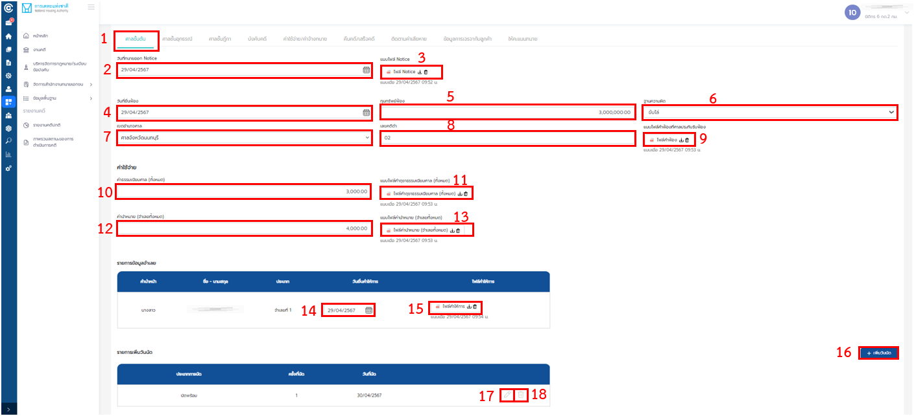<figcaption>
<strong>รูปภาพที่ 85</strong> หน้าจอแสดงเมนู ศาลชั้นต้น
</figcaption></figure>

1. กดที่เมนู ศาลชั้นต้น
2. กรอกข้อมูล“วันที่ทนายออก Notice”
3. แนบไฟล์ Notice
4. กรอกข้อมูล“วันที่ยื่นฟ้อง”
5. กรอกข้อมูล“ทุนทรัพย์ฟ้อง”
6. กรอกข้อมูล“ฐานความผิด”
7. กรอกข้อมูล“เขตอำนาจศาล”
8. กรอกข้อมูล“เลขคดีดำ”
9. แนบไฟล์คำฟ้องที่ศาลประทับรับฟ้อง
10. กรอกข้อมูล“ค่าธรรมเนียมศาล (ทั้งหมด)”
11. แนบไฟล์คำฤชาธรรมเนียมศาล (ทั้งหมด)
12. กรอกข้อมูล“ค่านำหมาย (จำเลยทั้งหมด)”
13. แนบไฟล์ค่านำหมาย (จำเลยทั้งหมด)
14. กรอกข้อมูล“วันยื่นคำให้การ”
15. แนบไฟล์คำให้การ
16. กดปุ่ม “+ เพิ่มวันนัด”

<figure>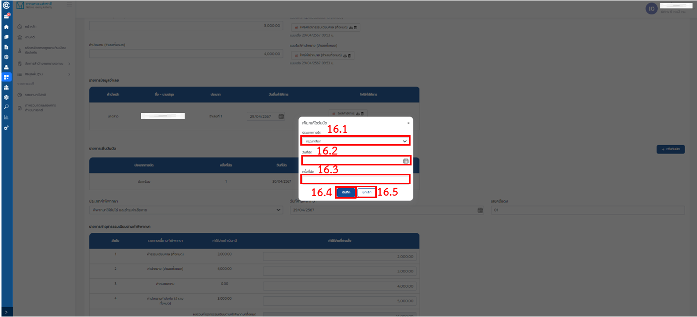<figcaption>
<strong>รูปภาพที่ 86</strong> หน้าจอ Pop-up เพิ่ม/แก้ไขวันนัด
</figcaption></figure>

&#x20;       16.1 กรอกข้อมูล “ประเภทการนัด”

&#x20;       16.2 กรอกข้อมูล “วันที่นัด”

&#x20;       16.3 กรอกข้อมูล “ครั้งที่นัด”

&#x20;       16.4 ข้อมูลเรียบร้อยกดปุ่ม “บันทึก”

&#x20;       16.5 ไม่บันทึกข้อมูล กดปุ่ม “ยกเลิก”

17. กดปุ่ม  (ไอคอน แก้ไข)

<figure><figcaption></figcaption></figure>

&#x20;         เพื่อ “แก้ไข”

18. กดปุ่ม  (ไอคอน ลบ)

<figure><figcaption></figcaption></figure>

&#x20;       เพื่อ “ลบ”

<figure>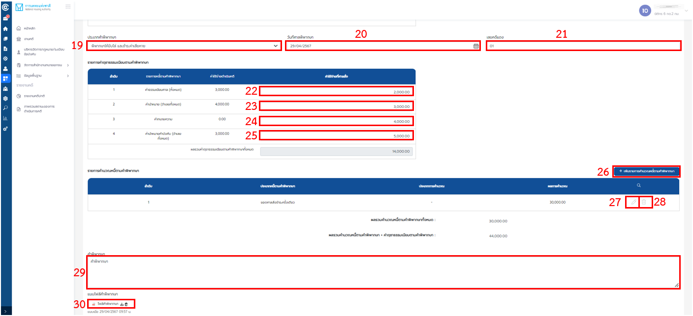<figcaption>
<strong>รูปภาพที่ 87</strong> หน้าจอแสดงเมนู ศาลชั้นต้น (1)
</figcaption></figure>

19. กรอกข้อมูล  “ประเภทคำพิพากษา”
20. &#x20;กรอกข้อมูล “วันที่ศาลพิพากษา”
21. กรอกข้อมูล “เลขคดีแดง”
22. &#x20;กรอกข้อมูล “ค่าธรรมเนียมศาล (ทั้งหมด)”
23. &#x20;กรอกข้อมูล “ค่านำหมาย (จำเลยทั้งหมด)”
24. &#x20;กรอกข้อมูล “ค่าทนายความ”
25. &#x20;กรอกข้อมูล “ค่านำหมายคำบังคับ (จำเลยทั้งหมด)”
26. &#x20;กดปุ่ม “+ เพิ่มรายการคำนวณหนี้ตามคำพิพากษา”

<figure>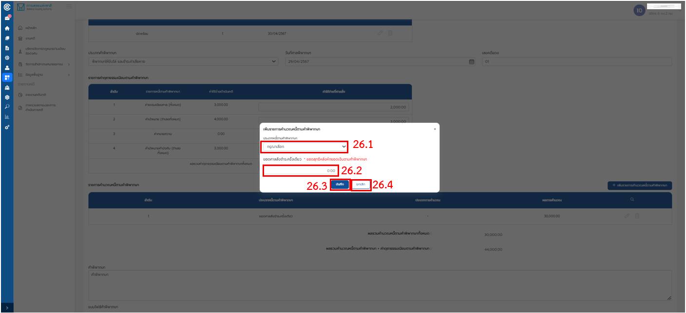<figcaption>
<strong>รูปภาพที่ 88</strong> หน้าจอ Pop-up เพิ่มรายการคำนวณหนี้ตามคำพิพากษา
</figcaption></figure>

&#x20;       26.1 กรอกข้อมูล “ประเภทหนี้ตามคำพิพากษา”

&#x20;       26.2 กรอกข้อมูล “ยอดศาลสั่งชำระครั้งเดียว”

&#x20;       26.3 ข้อมูลเรียบร้อยกดปุ่ม “บันทึก”

&#x20;       26.4 ไม่บันทึกข้อมูล กดปุ่ม “ยกเลิก”

27. &#x20;กดปุ่ม (ไอคอน แก้ไข)

<figure><figcaption></figcaption></figure>

&#x20;       เพื่อ “แก้ไข”

28. กดปุ่ม (ไอคอน ลบ)

<figure><figcaption></figcaption></figure>

&#x20;       เพื่อ “ลบ”

29. &#x20;กรอกข้อมูล“คำพิพากษา”
30. &#x20;แนบไฟล์คำพิพากษา

<figure>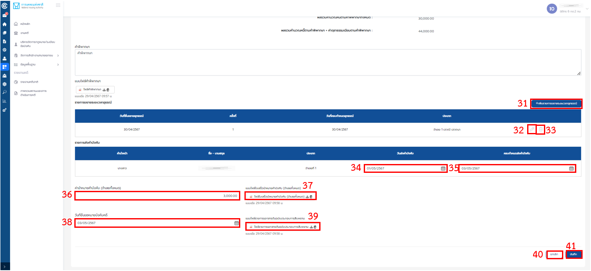<figcaption>
<strong>รูปภาพที่ 89</strong> หน้าจอแสดงเมนู ศาลชั้นต้น (2)
</figcaption></figure>

31. กดปุ่ม “+ เพิ่มรายการขยายระยะเวลาอุทธรณ์”

<figure>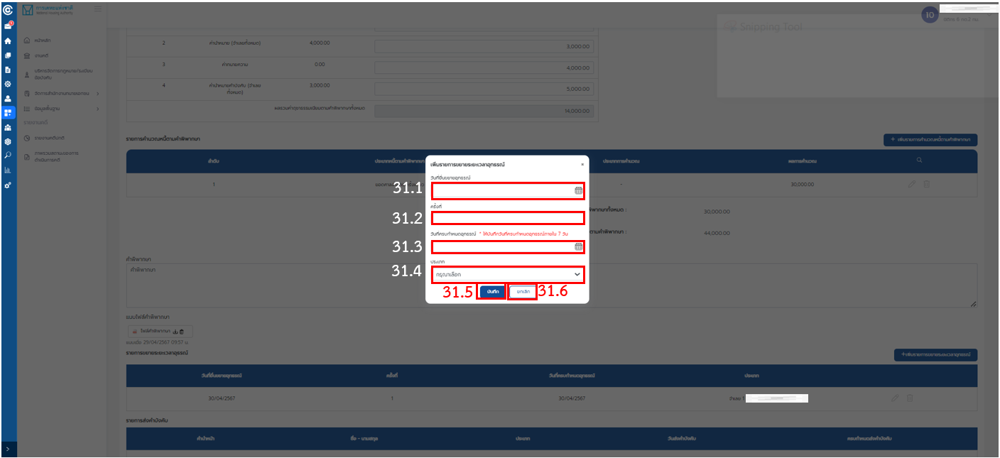<figcaption>
<strong>รูปภาพที่ 90</strong> หน้าจอ Pop-up เพิ่มรายการขยายระยะเวลาอุทธรณ์
</figcaption></figure>

&#x20;       31.1 กรอกข้อมูล “วันที่ยื่นขยายอุทธรณ์”

&#x20;       31.2 กรอกข้อมูล “ครั้งที่”

&#x20;       31.3 กรอกข้อมูล “วันที่ครบกำหนดอุทธรณ์”

&#x20;       31.4 กรอกข้อมูล “ประเภท”

&#x20;       31.5 ข้อมูลเรียบร้อยกดปุ่ม “บันทึก”

&#x20;       31.6 ไม่บันทึกข้อมูล กดปุ่ม “ยกเลิก”

32. &#x20;กดปุ่ม (ไอคอน แก้ไข)

<figure><figcaption></figcaption></figure>

&#x20;       เพื่อ “แก้ไข”

33. กดปุ่ม (ไอคอน ลบ)

<figure><figcaption></figcaption></figure>

&#x20;       เพื่อ “ลบ”

34. &#x20;กรอกข้อมูล “วันส่งคำบังคับ”
35. &#x20;กรอกข้อมูล “ครบกำหนดส่งคำบังคับ”
36. &#x20;กรอกข้อมูล “ค่านำหมายคำบังคับ (จำเลยทั้งหมด)”
37. &#x20;แนบไฟล์ใบเสร็จนำหมายคำบังคับ (จำเลยทั้งหมด)
38. &#x20;กรอกข้อมูล “วันที่ยื่นขอหมายบังคับคดี”
39. &#x20;แนบไฟล์รายการเอกสารต้นฉบับประกอบการสืบพยาน
40. ไม่บันทึกข้อมูล กดปุ่ม “ยกเลิก”
41. ข้อมูลเรียบร้อยกดปุ่ม “บันทึก”

<figure>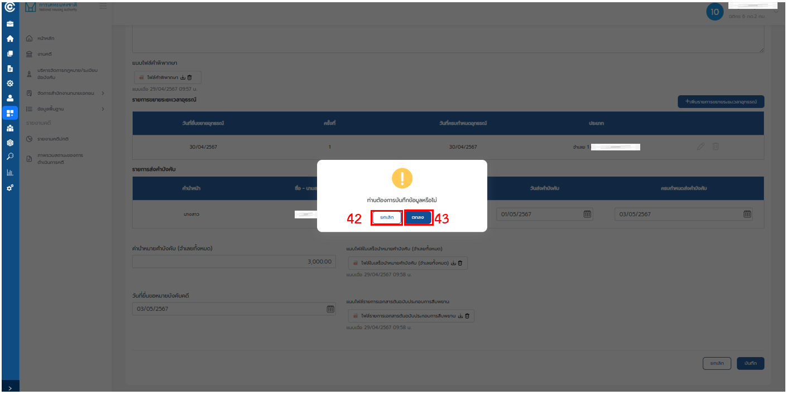<figcaption>
<strong>รูปภาพที่ 91</strong> หน้าจอ Pop-up ยืนยันการบันทึกข้อมูล
</figcaption></figure>

42. ไม่บันทึกข้อมูล กดปุ่ม “ยกเลิก”
43. ข้อมูลเรียบร้อยกดปุ่ม “บันทึก”

<figure>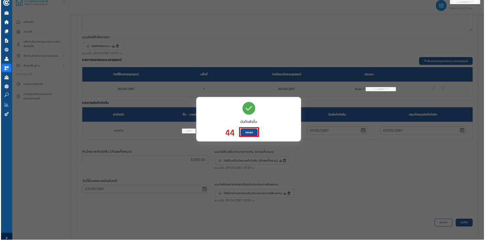<figcaption>
<strong>รูปภาพที่ 92</strong> หน้าจอ Pop-up ยืนยันการบันทึกข้อมูลสำเร็จ
</figcaption></figure>

44. กดปุ่ม “ตกลง”

#### **5.2.2 ศาลชั้นอุทธรณ์**

บันทึกข้อมูลศาลชั้นอุทธรณ์

<figure>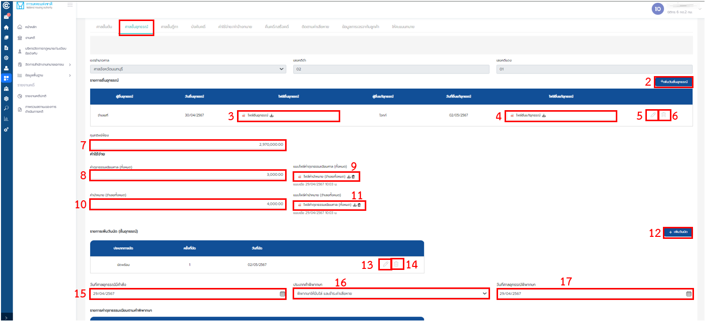<figcaption>
<strong>รูปภาพที่ 93</strong> หน้าจอแสดงเมนู ศาลชั้นอุทธรณ์
</figcaption></figure>

1. กดที่เมนู ศาลชั้นอุทธรณ์
2. กดปุ่ม “+ เพิ่มวันยื่นอุทธรณ์”

<figure>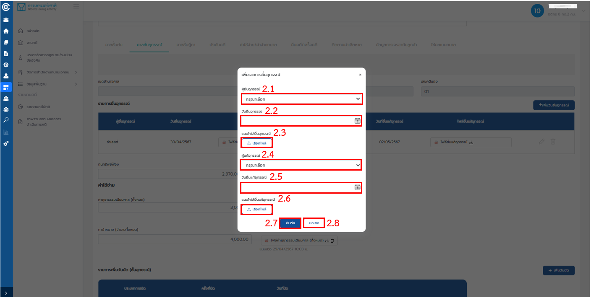<figcaption>
<strong>รูปภาพที่ 94</strong> หน้าจอ Pop-up เพิ่มรายการยื่นอุทธรณ์
</figcaption></figure>

&#x20;       2.1 กรอกข้อมูล “ผู้ยื่นอุทธรณ์”

&#x20;       2.2 กรอกข้อมูล “วันยื่นอุทธรณ์”

&#x20;       2.3 แนบไฟล์ยื่นอุทธรณ์

&#x20;       2.4 กรอกข้อมูล “ผู้แก้อุทธรณ์”

&#x20;       2.5 กรอกข้อมูล “วันยื่นแก้อุทธรณ์”

&#x20;       2.6 แนบไฟล์ยื่นแก้อุทธรณ์

&#x20;       2.7 ข้อมูลเรียบร้อยกดปุ่ม “บันทึก”

&#x20;       2.8 ไม่บันทึกข้อมูล กดปุ่ม “ยกเลิก”

3. แนบไฟล์ยื่นอุทธรณ์
4. แนบไฟล์ยื่นแก้อุทธรณ์
5.  กดปุ่ม (ไอคอน แก้ไข)

    <figure><figcaption></figcaption></figure>

    เพื่อ “แก้ไข”
6.  &#x20;กดปุ่ม (ไอคอน ลบ)

    <figure><figcaption></figcaption></figure>

    เพื่อ “ลบ”
7. กรอกข้อมูล “ทุนทรัพย์ฟ้อง”
8. กรอกข้อมูล “ค่าฤชาธรรมเนียมศาล (ทั้งหมด)”
9. แนบไฟล์คำฤชาธรรมเนียมศาล (ทั้งหมด)
10. กรอกข้อมูล “ค่านำหมาย (จำเลยทั้งหมด)”
11. แนบไฟล์ค่านำหมาย (จำเลยทั้งหมด)
12. กดปุ่ม “+ เพิ่มวันนัด”

<figure><figcaption>
<strong>รูปภาพที่ 95</strong> หน้าจอ Pop-up เพิ่ม/แก้ไขวันนัด
</figcaption></figure>

&#x20;       12.1 กรอกข้อมูล“ประเภทการนัด”

&#x20;       12.2 กรอกข้อมูล“วันที่นัด”

&#x20;       12.3 กรอกข้อมูล“ครั้งที่นัด”

&#x20;       12.4 ข้อมูลเรียบร้อยกดปุ่ม “บันทึก”

&#x20;       12.5 ไม่บันทึกข้อมูล กดปุ่ม “ยกเลิก”

13. กดปุ่ม (ไอคอน แก้ไข)

<figure><figcaption></figcaption></figure>

&#x20;       เพื่อ “แก้ไข”

14. กดปุ่ม (ไอคอน ลบ)

<figure><figcaption></figcaption></figure>

&#x20;       เพื่อ “ลบ”

15. กรอกข้อมูล “วันที่ศาลอุทธรณ์มีคำสั่ง”
16. กรอกข้อมูล “ประเภทคำพิพากษา”
17. กรอกข้อมูล “วันที่ศาลอุทธรณ์พิพากษา”

<figure>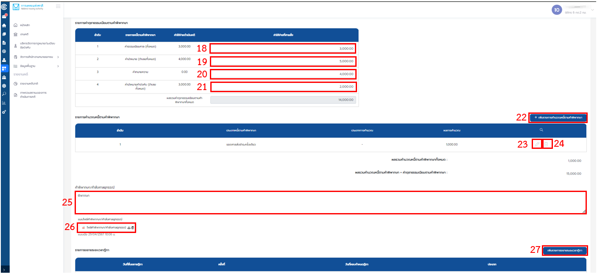<figcaption>
<strong>รูปภาพที่ 96</strong> หน้าจอแสดงเมนู ศาลชั้นอุทธรณ์ (1)
</figcaption></figure>

18. กรอกข้อมูล “ค่าธรรมเนียมศาล (ทั้งหมด)”
19. กรอกข้อมูล “ค่านำหมาย (จำเลยทั้งหมด)”
20. กรอกข้อมูล “ค่าทนายความ”
21. กรอกข้อมูล “ค่านำหมายคำบังคับ (จำเลยทั้งหมด)”
22. กดปุ่ม “+ เพิ่มรายการคำนวณหนี้ตามคำพิพากษา”

<figure>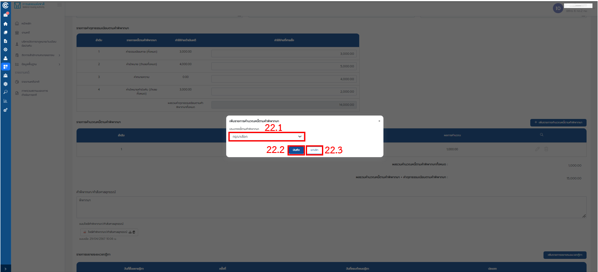<figcaption>
<strong>รูปภาพที่ 97</strong> หน้าจอ Pop-up เพิ่มรายการคำนวณหนี้ตามคำพิพากษา
</figcaption></figure>

&#x20;       22.1 กรอกข้อมูล “ประเภทหนี้ตามคำพิพากษา”

&#x20;       22.2 ข้อมูลเรียบร้อยกดปุ่ม “บันทึก”

&#x20;       22.3 ไม่บันทึกข้อมูล กดปุ่ม “ยกเลิก”

23. กดปุ่ม (ไอคอน แก้ไข)

<figure><figcaption></figcaption></figure>

&#x20;       เพื่อ “แก้ไข”

24. กดปุ่ม (ไอคอน ลบ)

<figure><figcaption></figcaption></figure>

&#x20;       เพื่อ “ลบ”

25. &#x20;กรอกข้อมูล “คำพิพากษา/คำสั่งศาลอุทธรณ์”
26. &#x20;แนบไฟล์คำพิพากษา/คำสั่งศาลอุทธรณ์
27. &#x20;กดปุ่ม “+ เพิ่มรายการขยายระยะเวลาฎีกา”

<figure>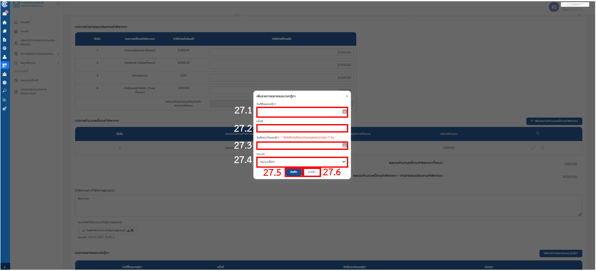<figcaption>
<strong>รูปภาพที่ 98</strong> หน้าจอ Pop-up เพิ่มรายการขยายระยะเวลาฎีกา
</figcaption></figure>

&#x20;       27.1 กรอกข้อมูล “วันที่ยื่นขยายอุทธรณ์”

&#x20;       27.2 กรอกข้อมูล “ครั้งที่”

&#x20;       27.3 กรอกข้อมูล “วันที่ครบกำหนดฎีกา”

&#x20;       27.4 กรอกข้อมูล “ประเภท”

&#x20;       27.5 ข้อมูลเรียบร้อยกดปุ่ม “บันทึก”

&#x20;       27.6 ไม่บันทึกข้อมูล กดปุ่ม “ยกเลิก”

<figure>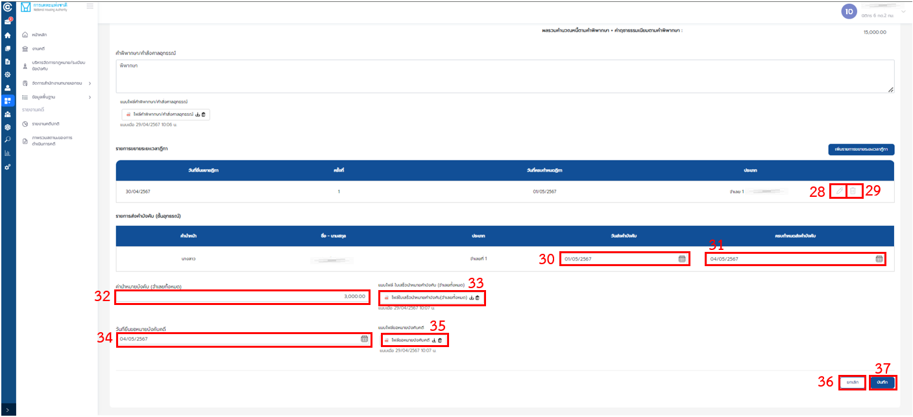<figcaption>
<strong>รูปภาพที่ 99</strong> หน้าจอแสดงเมนู ศาลชั้นอุทธรณ์ (2)
</figcaption></figure>

28. กดปุ่ม (ไอคอน แก้ไข)

    <figure><figcaption></figcaption></figure>

    เพื่อ “แก้ไข”
29. &#x20;กดปุ่ม (ไอคอน ลบ)

    <figure><figcaption></figcaption></figure>

    เพื่อ “ลบ”
30. &#x20;กรอกข้อมูล “วันส่งคำบังคับ”
31. กรอกข้อมูล “ครบกำหนดส่งคำบังคับ”
32. &#x20;กรอกข้อมูล “ค่านำหมายคำบังคับ (จำเลยทั้งหมด)”
33. &#x20;แนบไฟล์ใบเสร็จนำหมายคำบังคับ (จำเลยทั้งหมด)
34. &#x20;กรอกข้อมูล “วันที่ยื่นขอหมายบังคับคดี”
35. &#x20;แนบไฟล์ขอหมายบังคับคดี
36. &#x20;ไม่บันทึกข้อมูล กดปุ่ม “ยกเลิก”
37. ข้อมูลเรียบร้อยกดปุ่ม “บันทึก”

<figure>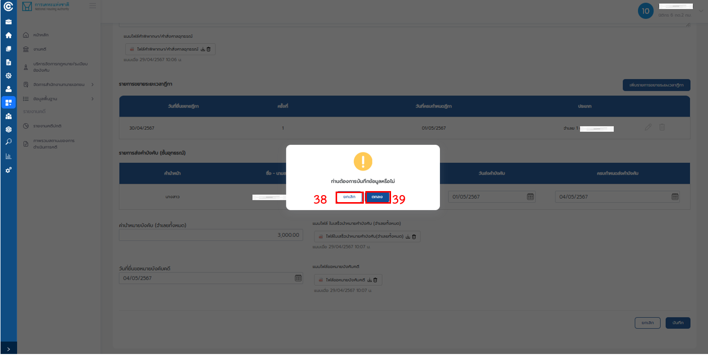<figcaption>
<strong>รูปภาพที่ 100</strong> หน้าจอ Pop-up ยืนยันการบันทึกข้อมูล
</figcaption></figure>

38. ไม่บันทึกข้อมูล กดปุ่ม “ยกเลิก”
39. ข้อมูลเรียบร้อยกดปุ่ม “บันทึก”

<figure>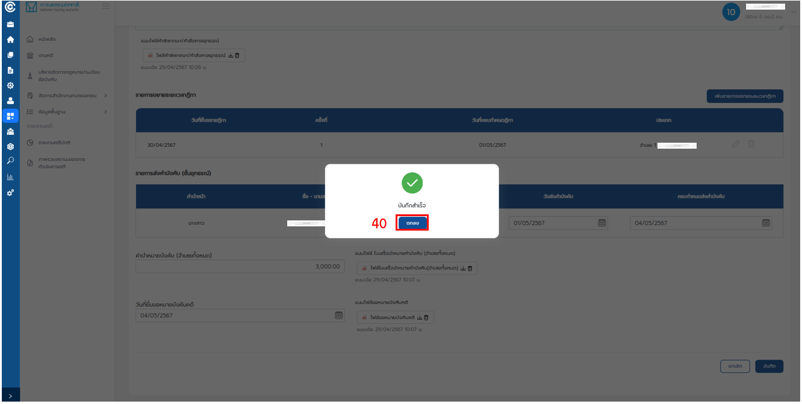<figcaption>
<strong>รูปภาพที่ 101</strong> หน้าจอ Pop-up ยืนยันการบันทึกข้อมูลสำเร็จ
</figcaption></figure>

40. &#x20;กดปุ่ม “ตกลง”

#### **5.2.3 ศาลชั้นฎีกา**

บันทึกข้อมูลศาลชั้นฎีกา

<figure>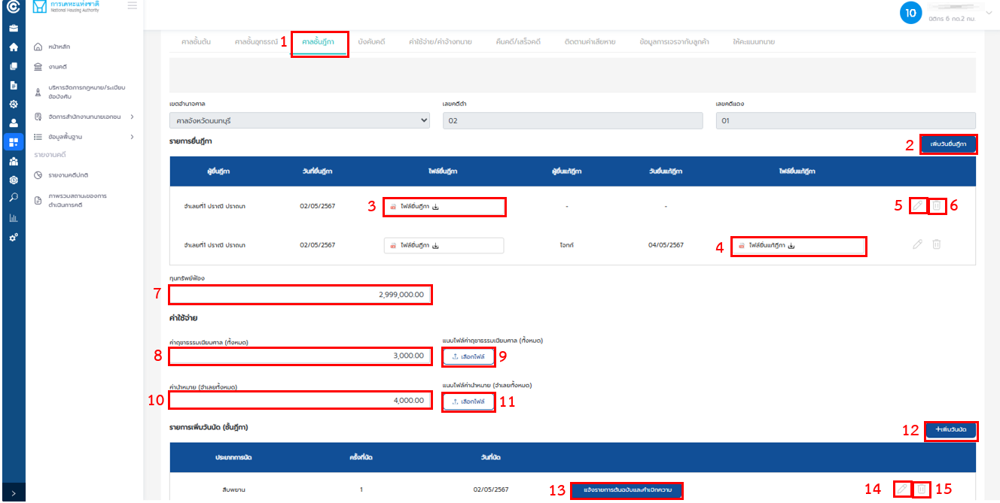<figcaption>
<strong>รูปภาพที่ 102</strong> หน้าจอแสดงเมนู ศาลชั้นฎีกา
</figcaption></figure>

1. กดที่เมนู ศาลชั้นฎีกา
2. กดปุ่ม “+ เพิ่มวันยื่นฎีกา”

<figure>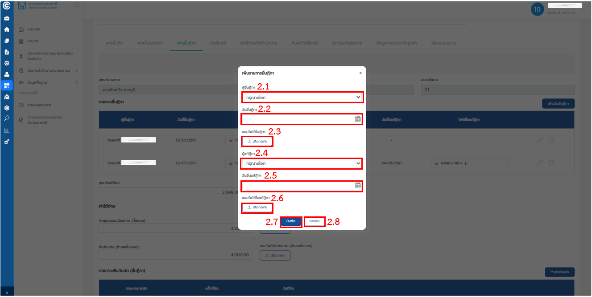<figcaption>
<strong>รูปภาพที่ 103</strong> หน้าจอ Pop-up เพิ่มรายการยื่นฎีกา
</figcaption></figure>

&#x20;       2.1 กรอกข้อมูล “ผู้ยื่นฎีกา”

&#x20;       2.2 กรอกข้อมูล “วันยื่นฎีกา”

&#x20;       2.3 แนบไฟล์ยื่นฎีกา

&#x20;       2.4 กรอกข้อมูล “ผู้แก้ฎีกา”

&#x20;       2.5 กรอกข้อมูล “วันยื่นแก้ฎีกา”

&#x20;       2.6 แนบไฟล์ยื่นแก้ฎีกา

&#x20;       2.7 ข้อมูลเรียบร้อยกดปุ่ม “บันทึก”

&#x20;       2.8 ไม่บันทึกข้อมูล กดปุ่ม “ยกเลิก”

3. แนบไฟล์ยื่นฎีกา
4. แนบไฟล์ยื่นแก้ฎีกา
5. กดปุ่ม  เพื่อ “แก้ไข”
6. กดปุ่ม  เพื่อ “ลบ”
7. กรอกข้อมูล“ทุนทรัพย์ฟ้อง”
8. กรอกข้อมูล“ค่าฤชาธรรมเนียมศาล (ทั้งหมด)”
9. แนบไฟล์คำฤชาธรรมเนียมศาล (ทั้งหมด)
10. กรอกข้อมูล“ค่านำหมาย (จำเลยทั้งหมด)”
11. แนบไฟล์ค่านำหมาย (จำเลยทั้งหมด)
12. กดปุ่ม “+ เพิ่มวันนัด”

<figure>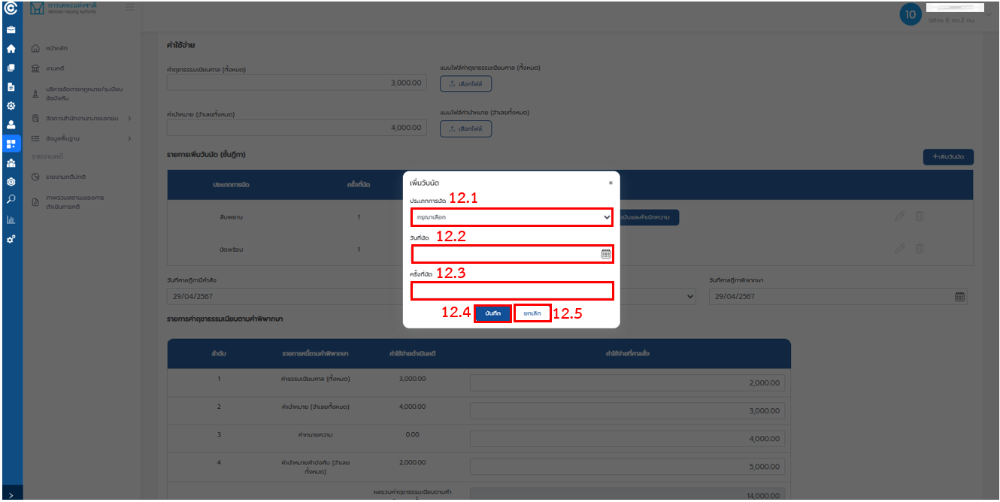<figcaption>
<strong>รูปภาพที่ 104</strong> หน้าจอ Pop-up เพิ่มวันนัด
</figcaption></figure>

&#x20;       12.1 กรอกข้อมูล“ประเภทการนัด”

&#x20;       12.2 กรอกข้อมูล“วันที่นัด”

&#x20;       12.3 กรอกข้อมูล“ครั้งที่นัด”

&#x20;       12.4 ข้อมูลเรียบร้อยกดปุ่ม “บันทึก”

&#x20;       12.5 ไม่บันทึกข้อมูล กดปุ่ม “ยกเลิก”

13. กดปุ่ม “+ แจ้งรายการต้นฉบับและคำเบิกความ”

<figure>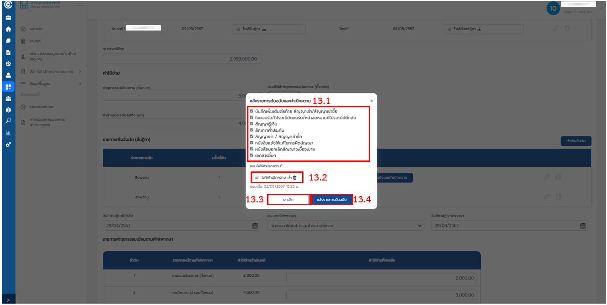<figcaption>
<strong>รูปภาพที่ 105</strong> หน้าจอ Pop-up แจ้งรายการต้นฉบับและคำเบิกความ
</figcaption></figure>

&#x20;       13.1 เลือกข้อมูล “แจ้งรายการต้นฉบับและคำเบิกความ”

&#x20;       13.2 แนบไฟล์คำเบิกความ

&#x20;       13.3 ไม่บันทึกข้อมูล กดปุ่ม “ยกเลิก”

&#x20;       13.4 ข้อมูลเรียบร้อยกดปุ่ม “แจ้งรายการต้นฉบับ”

14. กดปุ่ม (ไอคอน แก้ไข)

<figure><figcaption></figcaption></figure>

&#x20;       เพื่อ “แก้ไข”

15. &#x20;กดปุ่ม (ไอคอน ลบ)

<figure><figcaption></figcaption></figure>

&#x20;       เพื่อ “ลบ”

<figure>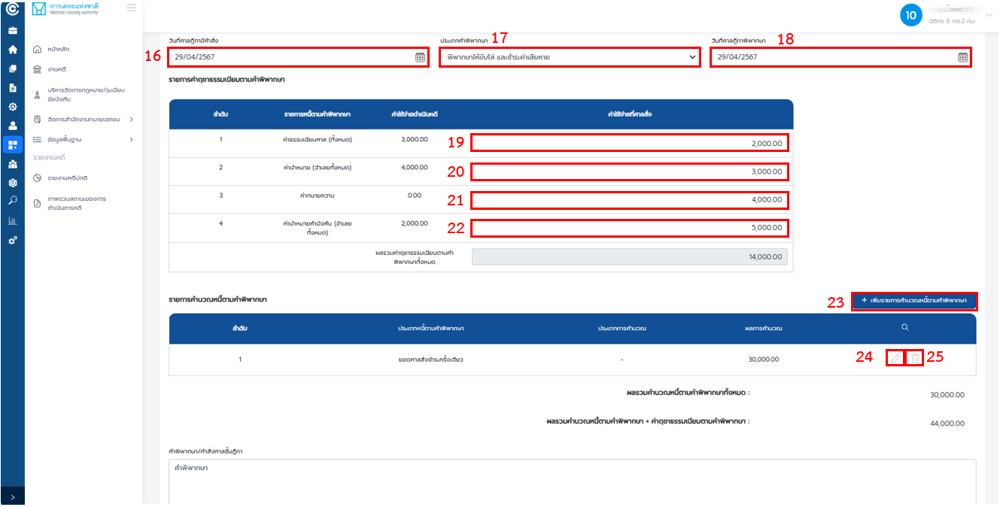<figcaption>
<strong>รูปภาพที่ 106</strong> หน้าจอแสดงเมนู ศาลชั้นฎีกา (1)
</figcaption></figure>

16. กรอกข้อมูล “วันที่ศาลอุทธรณ์มีคำสั่ง”
17. กรอกข้อมูล “ประเภทคำพิพากษา”
18. กรอกข้อมูล “วันที่ศาลอุทธรณ์พิพากษา”
19. กรอกข้อมูล “ค่าธรรมเนียมศาล (ทั้งหมด)”
20. &#x20;กรอกข้อมูล “ค่านำหมาย (จำเลยทั้งหมด)”
21. &#x20;กรอกข้อมูล “ค่าทนายความ”
22. &#x20;กรอกข้อมูล “ค่านำหมายคำบังคับ (จำเลยทั้งหมด)”
23. &#x20;กดปุ่ม “+ เพิ่มรายการคำนวณหนี้ตามคำพิพากษา”

<figure>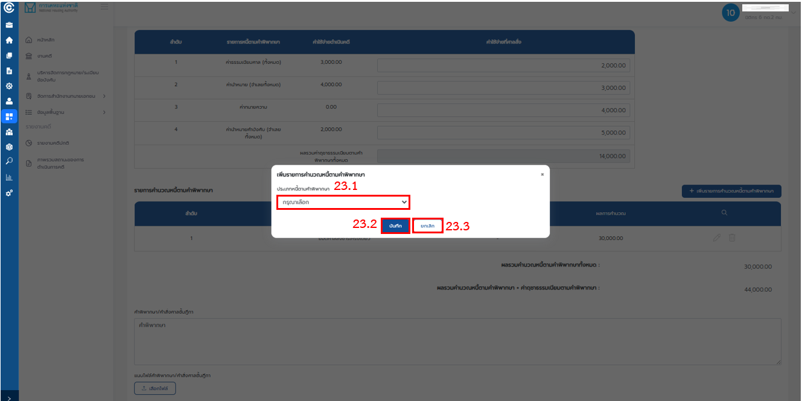<figcaption>
<strong>รูปภาพที่ 107</strong> หน้าจอ Pop-up เพิ่มรายการคำนวณหนี้ตามคำพิพากษา
</figcaption></figure>

&#x20;       23.1 กรอกข้อมูล “ประเภทหนี้ตามคำพิพากษา”

&#x20;       23.2 ข้อมูลเรียบร้อยกดปุ่ม “บันทึก”

&#x20;       23.3 ไม่บันทึกข้อมูล กดปุ่ม “ยกเลิก”

24. &#x20;กดปุ่ม (ไอคอน แก้ไข)

<figure><figcaption></figcaption></figure>

&#x20;       เพื่อ “แก้ไข”

25. &#x20;กดปุ่ม (ไอคอน ลบ)

<figure><figcaption></figcaption></figure>

&#x20;       เพื่อ “ลบ”

<figure><figcaption>
<strong>รูปภาพที่ 108</strong> หน้าจอแสดงเมนู ศาลชั้นฎีกา (2)
</figcaption></figure>

26. &#x20;กรอกข้อมูล “คำพิพากษา/คำสั่งศาลชั้นฎีกา”
27. &#x20;แนบไฟล์คำพิพากษา/คำสั่งศาลชั้นฎีกา
28. &#x20;กรอกข้อมูล “วันส่งคำบังคับ”
29. &#x20;กรอกข้อมูล “ครบกำหนดส่งคำบังคับ”
30. &#x20;กรอกข้อมูล “ค่านำหมายคำบังคับ (จำเลยทั้งหมด)”
31. &#x20;แนบไฟล์ใบเสร็จนำหมายคำบังคับ (จำเลยทั้งหมด)
32. &#x20;กรอกข้อมูล “วันที่ยื่นขอหมายบังคับคดี”
33. &#x20;แนบไฟล์ขอหมายบังคับคดี
34. &#x20;ไม่บันทึกข้อมูล กดปุ่ม “ยกเลิก”
35. ข้อมูลเรียบร้อยกดปุ่ม “บันทึก”

<figure><figcaption>
<strong>รูปภาพที่ 109</strong> หน้าจอ Pop-up ยืนยันการบันทึกข้อมูล
</figcaption></figure>

36. &#x20;ไม่บันทึกข้อมูล กดปุ่ม “ยกเลิก”
37. &#x20;ข้อมูลเรียบร้อยกดปุ่ม “บันทึก”

#### **5.2.4 บังคับคดี**

จะเกิดจากศาลมีคำสั่งชำระค่าเสียหาย

<figure>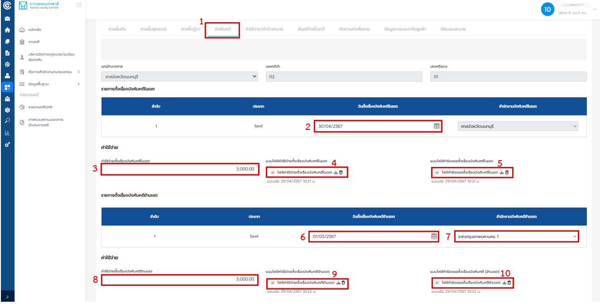<figcaption>
<strong>รูปภาพที่ 110</strong> หน้าจอแสดงเมนู บังคับคดี
</figcaption></figure>

1. กดที่เมนู บังคับคดี
2. กรอกข้อมูล “วันตั้งเรื่องบังคับคดีในเขต”
3. กรอกข้อมูล “ค่าใช้จ่ายตั้งเรื่องบังคับคดีในเขต”
4. แนบไฟล์ค่าใช้จ่ายตั้งเรื่องบังคับคดีในเขต
5. แนบไฟล์คำร้องขอตั้งเรื่องบังคับคดีในเขต
6. กรอกข้อมูล “วันตั้งเรื่องบังคับคดีข้ามเขต”
7. กรอกข้อมูล “สำนักงานบังคับคดีข้ามเขต”
8. กรอกข้อมูล “ค่าใช้จ่ายตั้งเรื่องบังคับคดีข้ามเขต”
9. แนบไฟล์ค่าใช้จ่ายตั้งเรื่องบังคับคดีข้ามเขต
10. แนบไฟล์คำร้องขอตั้งเรื่องบังคับคดี (ข้ามเขต)

<figure>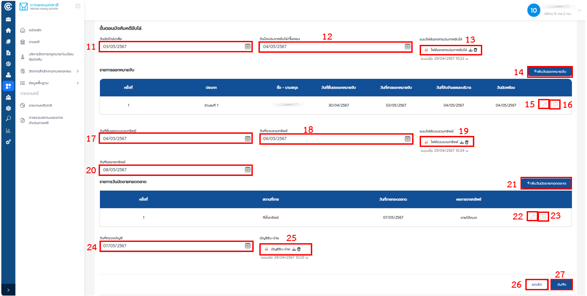<figcaption>
<strong>รูปภาพที่ 111</strong> หน้าจอแสดงเมนู บังคับคดี (1)
</figcaption></figure>

11. กรอกข้อมูล “วันนัดไกล่เกลี่ย”
12. กรอกข้อมูล “วันปิดประกาศขับไล่/รื้อถอน”
13. แนบไฟล์เอกสารประกาศขับไล่
14. กดปุ่ม “+ เพิ่มวันออกหมายจับ”

<figure>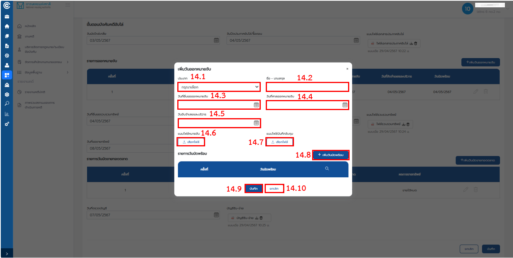<figcaption>
<strong>รูปภาพที่ 112</strong> หน้าจอ Pop-up เพิ่มวันออกหมายจับ
</figcaption></figure>

&#x20;       14.1 กรอกข้อมูล “ประเภท”

&#x20;       14.2 กรอกข้อมูล “ชื่อ - นามสกุล”

&#x20;       14.3 กรอกข้อมูล “วันที่ยื่นขอออกหมายจับ”

&#x20;       14.4 กรอกข้อมูล “วันที่ศาลออกหมายจับ”

&#x20;       14.5 กรอกข้อมูล “วันจับจำเลยและบริวาร”

&#x20;       14.6 แนบไฟล์หมายจับ

&#x20;       14.7 แนบไฟล์บันทึกจับกุม

&#x20;       14.8 กดปุ่ม “+ เพิ่มวันนัดพร้อม”

<figure>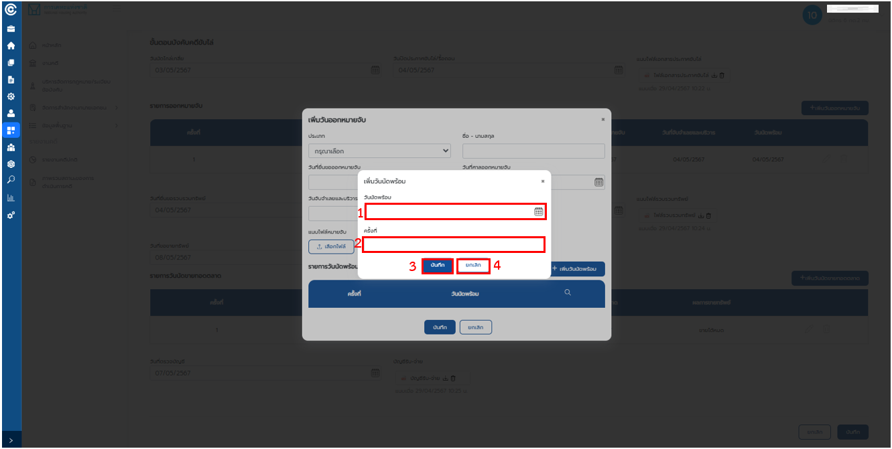<figcaption>
<strong>รูปภาพที่ 113</strong> หน้าจอ Pop-up เพิ่มวันนัดพร้อม
</figcaption></figure>

&#x20;                14.8.1 กรอกข้อมูล “วันนัดพร้อม”

&#x20;                14.8.2 กรอกข้อมูล “ครั้งที่”

&#x20;                14.8.3 ข้อมูลเรียบร้อยกดปุ่ม “บันทึก”

&#x20;                14.8.4 ไม่บันทึกข้อมูล กดปุ่ม “ยกเลิก”

&#x20;       14.9 ไม่บันทึกข้อมูล กดปุ่ม “ยกเลิก”

&#x20;       14.10 ข้อมูลเรียบร้อยกดปุ่ม “บันทึก”

15. กดปุ่ม (ไอคอน แก้ไข)

<figure><figcaption></figcaption></figure>

&#x20;       เพื่อ “แก้ไข”

16. &#x20;กดปุ่ม (ไอคอน ลบ)

<figure><figcaption></figcaption></figure>

&#x20;       เพื่อ “ลบ”

17. กรอกข้อมูล “วันที่ยื่นขอรวบรวมทรัพย์”
18. กรอกข้อมูล “วันที่รวบรวมทรัพย์”
19. แนบไฟล์รวบรวมทรัพย์
20. กรอกข้อมูล “วันที่ขอขายทรัพย์”
21. กดปุ่ม “+ เพิ่มวันนัดขายทอดตลาด”

<figure>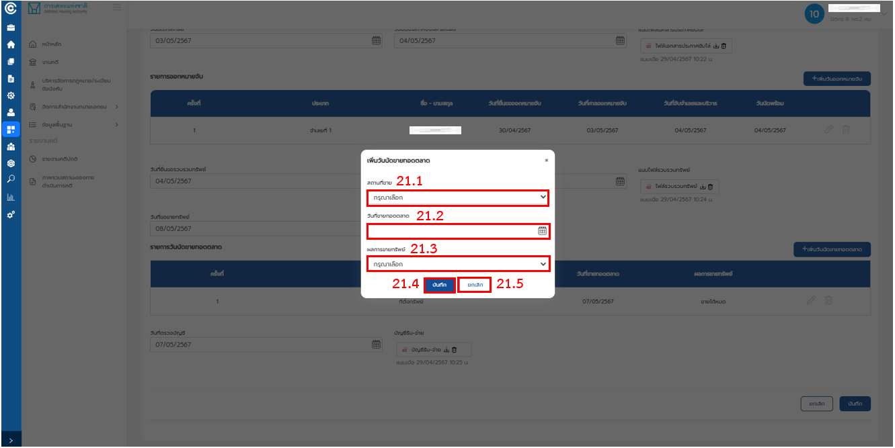<figcaption>
<strong>รูปภาพที่ 114</strong> หน้าจอ Pop-up เพิ่มวันนัดขายทอดตลาด
</figcaption></figure>

&#x20;        21.1 กรอกข้อมูล “สถานที่ขาย”

&#x20;        21.2 กรอกข้อมูล “วันที่ขายทอดตลาด”

&#x20;        21.3 กรอกข้อมูล “ผลการขายทรัพย์”

&#x20;        21.4 ข้อมูลเรียบร้อยกดปุ่ม “บันทึก”

&#x20;        21.5 ไม่บันทึกข้อมูล กดปุ่ม “ยกเลิก”

22. &#x20;กดปุ่ม (ไอคอน แก้ไข)

<figure><figcaption></figcaption></figure>

&#x20;        เพื่อ “แก้ไข”

23. &#x20;กดปุ่ม (ไอคอน ลบ)

<figure><figcaption></figcaption></figure>

&#x20;        เพื่อ “ลบ”

24. กรอกข้อมูล “วันที่ตรวจบัญชี”
25. แนบไฟล์บัญชีรับ-จ่าย
26. ไม่บันทึกข้อมูล กดปุ่ม “ยกเลิก”
27. ข้อมูลเรียบร้อยกดปุ่ม “บันทึก”

<figure>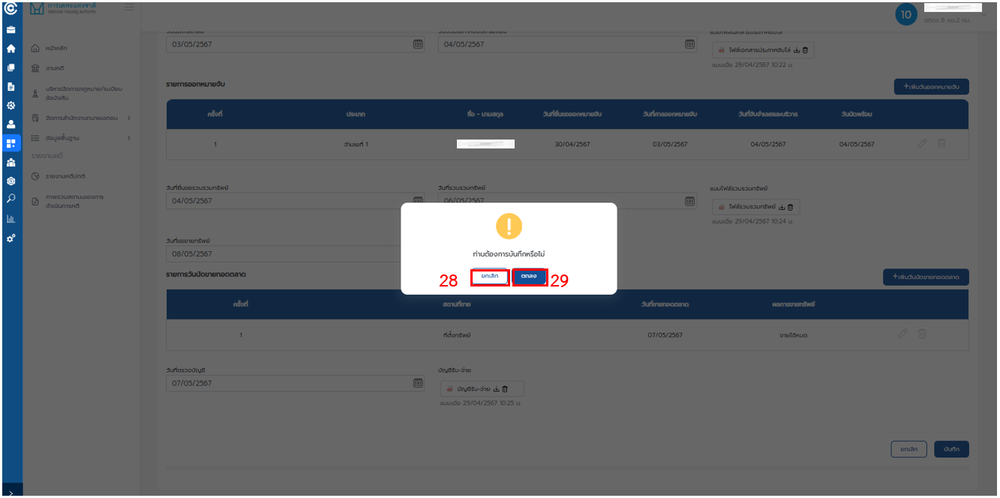<figcaption>
<strong>รูปภาพที่ 115</strong> หน้าจอ Pop-up ยืนยันการบันทึกข้อมูล
</figcaption></figure>

28. ไม่บันทึกข้อมูล กดปุ่ม “ยกเลิก”
29. &#x20;ข้อมูลเรียบร้อยกดปุ่ม “บันทึก”

<figure>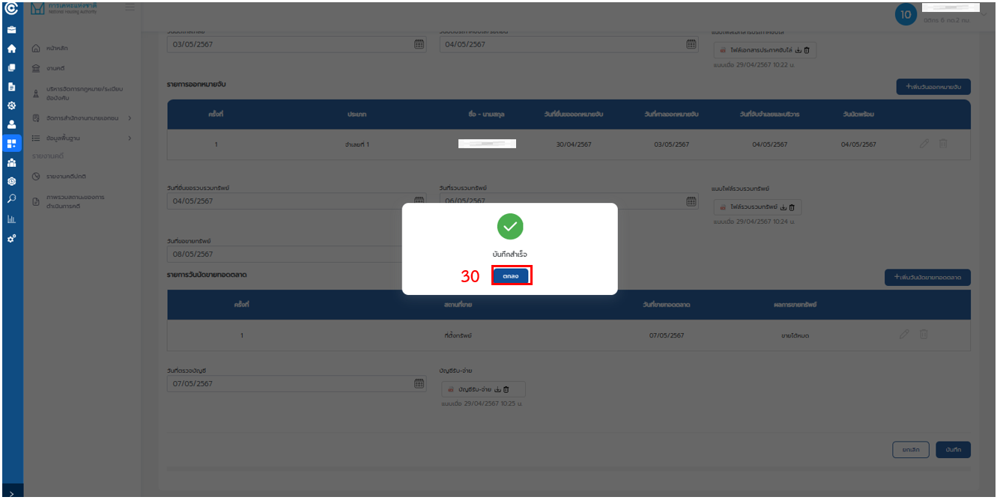<figcaption>
<strong>รูปภาพที่ 116</strong> หน้าจอ Pop-up ยืนยันการบันทึกข้อมูลสำเร็จ
</figcaption></figure>

30. &#x20;กดปุ่ม “ตกลง”

#### **5.2.5 ค่าใช้จ่าย/ค่าจ้างทนาย**

แสดงข้อมูลค่าใช้จ่าย / ค่าจ้างทนาย ทั้งหมดในชั้นศาลและการเบิกจ่าย

<figure>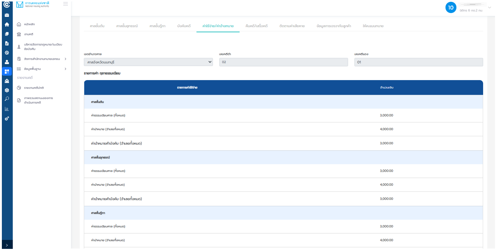<figcaption>
<strong>รูปภาพที่ 117</strong> หน้าจอแสดงเมนู ค่าใช้จ่าย/ค่าจ้างทนาย
</figcaption></figure>

<figure>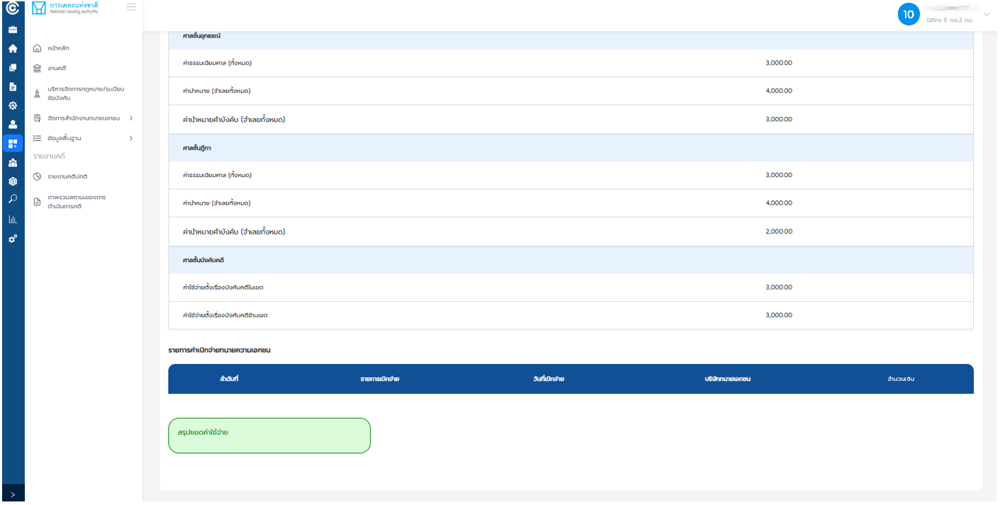<figcaption>
<strong>รูปภาพที่ 118</strong> หน้าจอแสดงเมนู ค่าใช้จ่าย/ค่าจ้างทนาย (1)
</figcaption></figure>

#### **5.2.6 คืนคดี/เสร็จคดี**

ให้บันทึกข้อมูลรายละเอียด โดยสามารถระบุสาเหตุที่เสร็จคดีได้

<figure><figcaption>
<strong>รูปภาพที่ 119</strong> หน้าจอแสดงเมนู คืนคดี/เสร็จคดี
</figcaption></figure>

1. กดที่เมนู คืนคดี/เสร็จคดี
2. กรอกข้อมูล “สาเหตุส่งมอบงาน”
3. กรอกข้อมูล “วันที่สาเหตุส่งมอบงาน”
4. กรอกข้อมูล “วันที่ทนายส่งมอบงาน”
5. กรอกข้อมูล “วันที่ถอนฟ้อง”
6. แนบไฟล์ใบเสร็จค่าทนาย/สัญญา
7. แนบไฟล์ใบปิดอายัด
8. กรอกข้อมูล “วันที่รับคืน/รับมอบงาน”
9. แนบไฟล์คำร้องถอนฟ้อง
10. กรอกข้อมูล “หมายเหตุ”
11. ไม่บันทึกข้อมูล กดปุ่ม “ยกเลิก”
12. ข้อมูลเรียบร้อยกดปุ่ม “บันทึก”

<figure>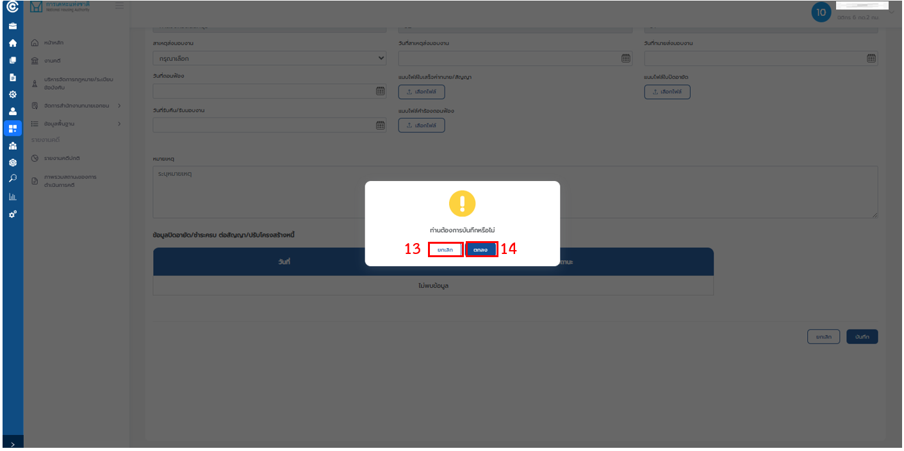<figcaption>
<strong>รูปภาพที่ 120</strong> หน้าจอ Pop-up ยืนยันการบันทึกข้อมูล
</figcaption></figure>

13. ไม่บันทึกข้อมูล กดปุ่ม “ยกเลิก”
14. ข้อมูลเรียบร้อยกดปุ่ม “บันทึก”

<figure>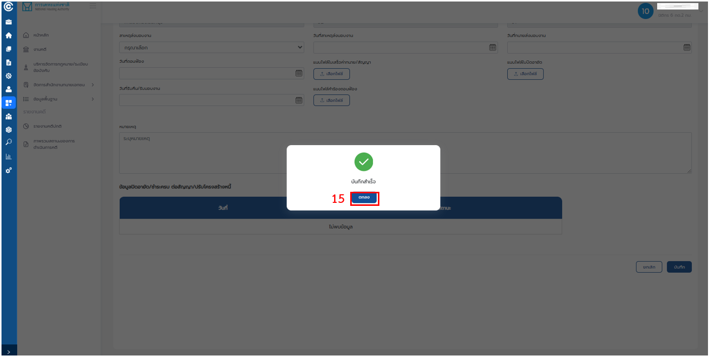<figcaption>
<strong>รูปภาพที่ 121</strong> หน้าจอ Pop-up ยืนยันการบันทึกข้อมูลสำเร็จ
</figcaption></figure>

15. กดปุ่ม “ตกลง”

#### **5.2.7 ติดตามค่าเสียหาย**

ระบบจะดึงข้อมูลจากฝั่ง กคช. มาแสดง และแสดงข้อมูลการเปิดจ่ายของสำนักงานนั้น ๆ

<figure>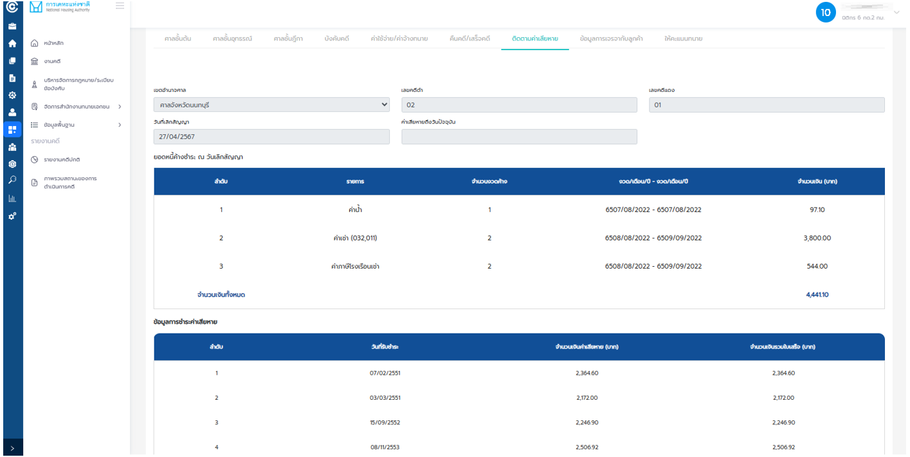<figcaption>
<strong>รูปภาพที่ 122</strong> หน้าจอแสดงเมนู ติดตามค่าเสียหาย
</figcaption></figure>

<figure>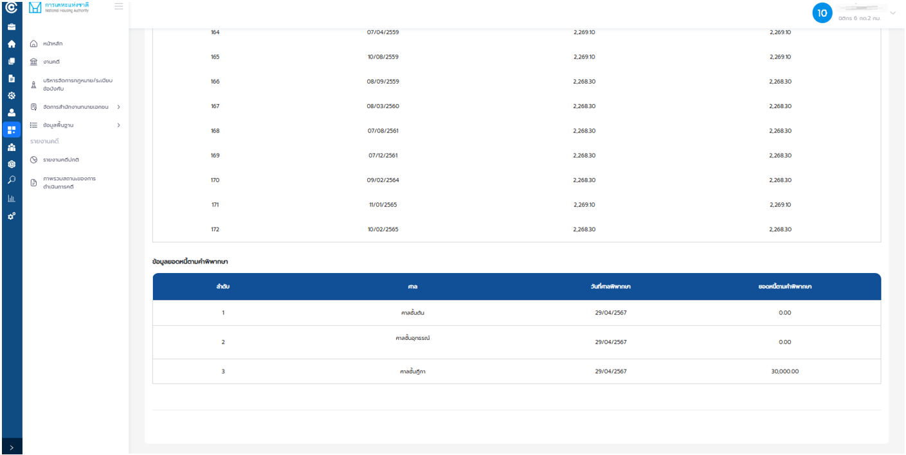<figcaption>
<strong>รูปภาพที่ 123</strong> หน้าจอแสดงเมนู ติดตามค่าเสียหาย (1)
</figcaption></figure>

#### **5.2.8 ข้อมูลการเจรจากับลูกค้า**

ระบบจะดึงข้อมูลจากฝั่ง กคช. มาแสดง

<figure>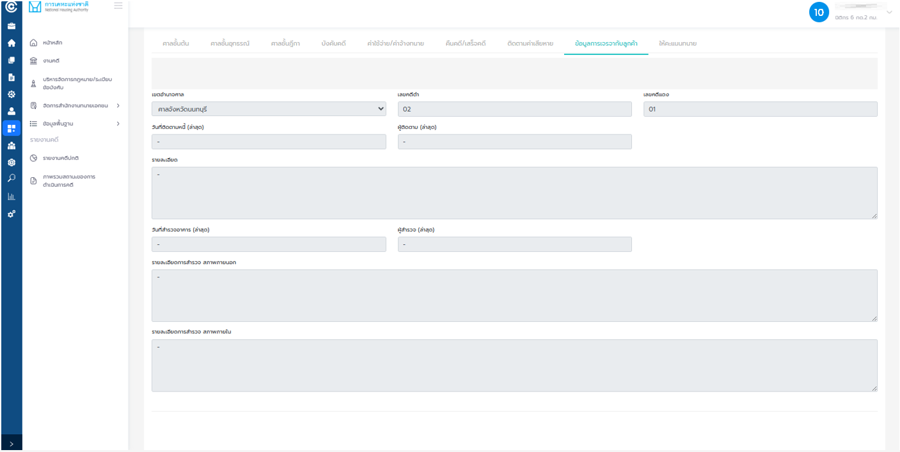<figcaption>
<strong>รูปภาพที่ 124</strong> หน้าจอแสดงเมนู ข้อมูลการเจรจากับลูกค้า
</figcaption></figure>

#### **5.2.9 ให้คะแนนทนาย**

นิติกรสามารถให้คะแนนทนายได้

<figure>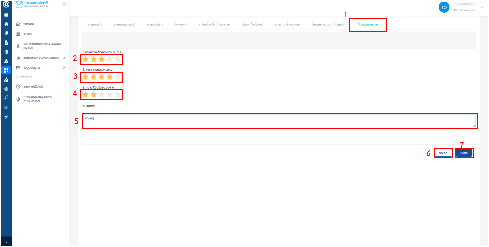<figcaption>
<strong>รูปภาพที่ 125</strong> หน้าจอแสดงเมนู ให้คะแนนทนาย
</figcaption></figure>

1. กดที่เมนู ให้คะแนนทนาย
2. กรอกข้อมูลให้คะแนนทนายหัวข้อเรื่อง “ความรวดเร็วในการดำเนินการ”
3. กรอกข้อมูลให้คะแนนทนายหัวข้อเรื่อง “การติดต่อประสานงาน”
4. กรอกข้อมูลให้คะแนนทนายหัวข้อเรื่อง “ความเรียบร้อยของงาน”
5. กรอกข้อมูล “หมายเหตุ”
6. ไม่บันทึกข้อมูล กดปุ่ม “ยกเลิก”
7. ข้อมูลเรียบร้อยกดปุ่ม “บันทึก”

<figure>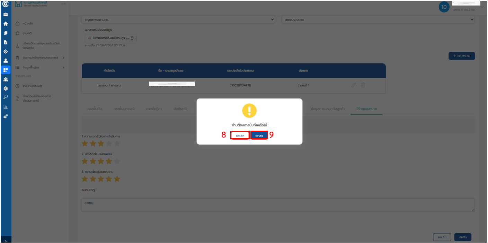<figcaption>
<strong>รูปภาพที่ 126</strong> หน้าจอ Pop-up ยืนยันการบันทึกข้อมูล
</figcaption></figure>

8. ไม่บันทึกข้อมูล กดปุ่ม “ยกเลิก”
9. ข้อมูลเรียบร้อยกดปุ่ม “บันทึก”

<figure>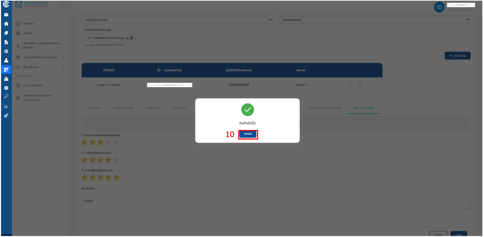<figcaption>
<strong>รูปภาพที่ 127</strong> หน้าจอ Pop-up ยืนยันการบันทึกข้อมูลสำเร็จ
</figcaption></figure>

10. &#x20;กดปุ่ม “ตกลง”

### 5.3 อยู่ระหว่างพิจารณา 

ระบบจะแสดงข้อมูลที่นิติกรรับเรื่องเกณฑ์ไม่ถึงฟ้อง และ คดีที่ถูกพักการดำเนินคดี พร้อมทั้งแสดงข้อมูลงานคดี

<figure>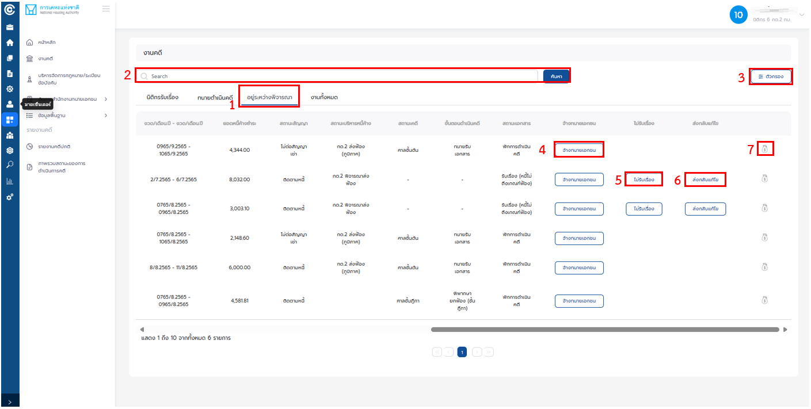<figcaption>
<strong>รูปภาพที่ 128</strong> หน้าจอแสดงเมนู อยู่ระหว่างพิจารณา
</figcaption></figure>

1. กดที่เมนู อยู่ระหว่างพิจารณา
2. กรอกคำค้นหาในช่อง “ค้นหา”
3. ปุ่ม “ตัวกรอง”

<figure>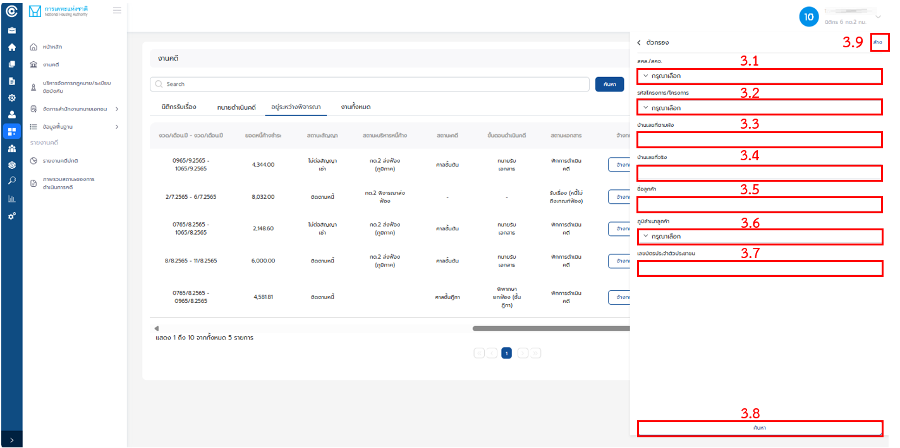<figcaption>
<strong>รูปภาพที่ 129</strong> หน้าจอ Pop-up “ตัวกรอง”
</figcaption></figure>

&#x20;       3.1 กรอกข้อมูล “สคล./สคจ.”

&#x20;       3.2 กรอกข้อมูล “รหัสโครงการ/โครงการ”

&#x20;       3.3 กรอกข้อมูล “บ้านเลขที่ตามผัง”

&#x20;       3.4 กรอกข้อมูล “บ้านเลขที่จริง”

&#x20;       3.5 กรอกข้อมูล “ชื่อลูกค้า”

&#x20;       3.6 กรอกข้อมูล “ภูมิลำเนาลูกค้า”

&#x20;       3.7 กรอกข้อมูล “เลขบัตรประจำตัวประชาชน”

&#x20;       3.8 กดปุ่ม “ค้นหา”

&#x20;       3.9 ลบข้อมูล กดปุ่ม “ล้าง”

4. ปุ่ม “จ้างทนายเอกชน”

<figure>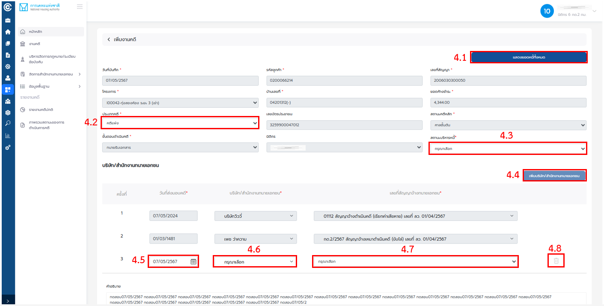<figcaption>
<strong>รูปภาพที่ 130</strong> หน้าจอจ้างทนายเอกชน
</figcaption></figure>

&#x20;       4.1 กดปุ่ม “แสดงยอดหนี้ทั้งหมด”

<figure>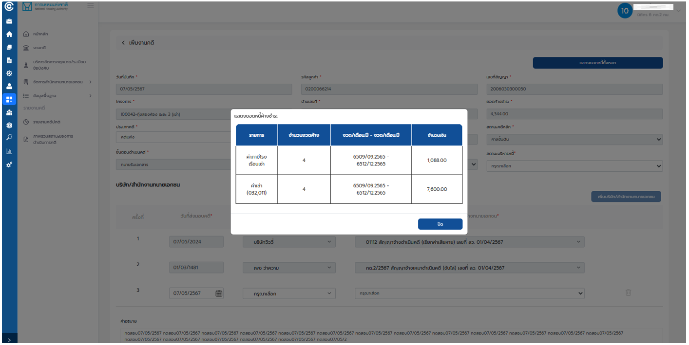<figcaption>
<strong>รูปภาพที่ 131</strong> หน้าจอแสดงยอดหนี้ค้างชำระ
</figcaption></figure>

&#x20;       4.2 กรอกข้อมูล “ประเภทคดี”

&#x20;       4.3 กรอกข้อมูล “สถานะบริหารหนี้”

&#x20;       4.4 ปุ่ม “เพิ่มบริษัท/สำนักงานทนายเอกชน”

&#x20;       4.5 กรอกข้อมูล “วันที่ส่งมอบคดี”

&#x20;       4.6 กรอกข้อมูล “บริษัท/สำนักงานทนายเอกชน”

&#x20;       4.7 กรอกข้อมูล “เลขที่สัญญาจ้างทนายเอกชน”

&#x20;       4.8 กดปุ่ม  (ไอคอน ลบ)

<figure><figcaption></figcaption></figure>

&#x20;             เพื่อ “ลบ”

<figure><figcaption>
<strong>รูปภาพที่ 132</strong> หน้าจอจ้างทนายเอกชน (1)
</figcaption></figure>

&#x20;       4.9 กรอกข้อมูล “คำอธิบาย”

&#x20;       4.10 แนบไฟล์เอกสารประกอบ

&#x20;       4.11 กรอกข้อมูล “จังหวัด”

&#x20;       4.12 กรอกข้อมูล “อำเภอ/เขต”

&#x20;       4.13 แนบเอกสารทะเบียนราษฎร

&#x20;       4.14 ไม่บันทึกข้อมูล กดปุ่ม “ยกเลิก”

&#x20;       4.15 ข้อมูลเรียบร้อยกดปุ่ม “ส่งมอบงาน”

<figure>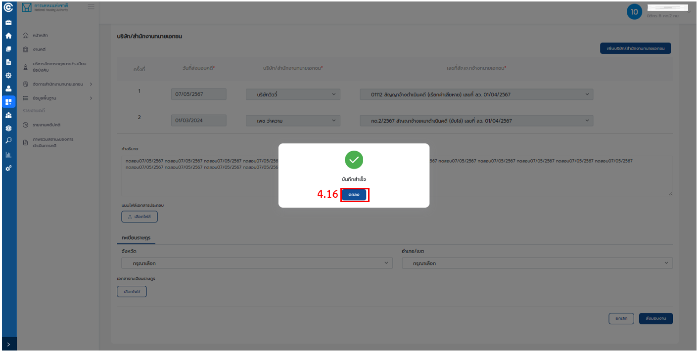<figcaption>
<strong>รูปภาพที่ 133</strong> หน้าจอ Pop-up ยืนยันการบันทึกข้อมูลสำเร็จ
</figcaption></figure>

&#x20;       4.16 กดปุ่ม “ตกลง”

5. ปุ่ม “ไม่รับเรื่อง”

<figure>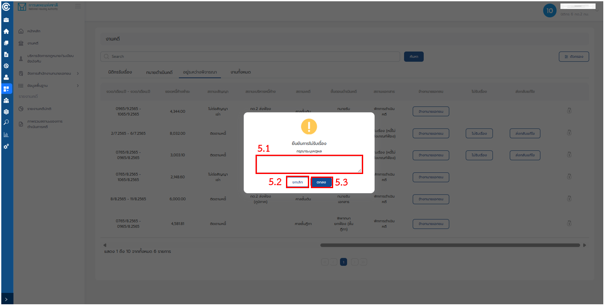<figcaption>
<strong>รูปภาพที่ 134</strong> หน้าจอ Pop-up ยืนยันการไม่รับเรื่อง
</figcaption></figure>

&#x20;       5.1 กรอกข้อมูล “เหตุผล”

&#x20;       5.2 ไม่บันทึกข้อมูล กดปุ่ม “ยกเลิก”

&#x20;       5.3 ข้อมูลเรียบร้อยกดปุ่ม “ตกลง”

<figure><figcaption>
<strong>รูปภาพที่ 135</strong> หน้าจอ Pop-up ยืนยันการบันทึกข้อมูลสำเร็จ
</figcaption></figure>

&#x20;       5.4 กดปุ่ม “ปิด”

6. ปุ่ม “ส่งกลับแก้ไข”

<figure>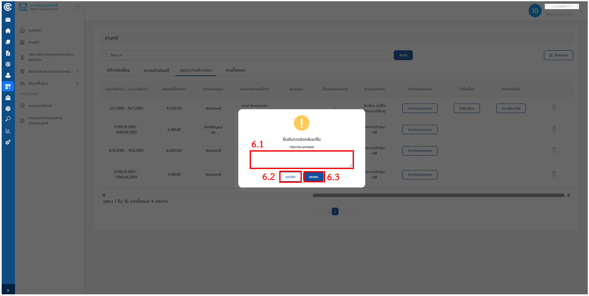<figcaption>
<strong>รูปภาพที่ 136</strong> หน้าจอ Pop-up ยืนยันการส่งกลับแก้ไข
</figcaption></figure>

&#x20;      6.1 กรอกข้อมูล “เหตุผล”

&#x20;      6.3 ไม่บันทึกข้อมูล กดปุ่ม “ยกเลิก”

&#x20;      6.2 ข้อมูลเรียบร้อยกดปุ่ม “ตกลง”

<figure>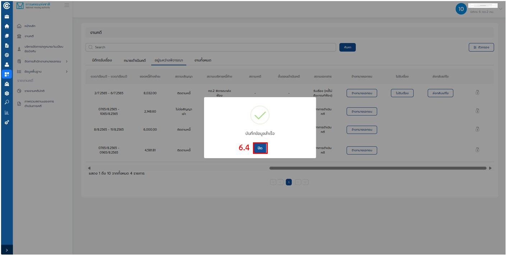<figcaption>
<strong>รูปภาพที่ 137</strong> หน้าจอ Pop-up ยืนยันการบันทึกข้อมูลสำเร็จ
</figcaption></figure>

&#x20;      6.4 กดปุ่ม “ตกลง”

7. กดปุ่ม  (ไอคอน ถุงเงิน)

<figure><figcaption></figcaption></figure>

&#x20;      เพื่อ “แสดงยอดหนี้ค้างชำระ”

<figure>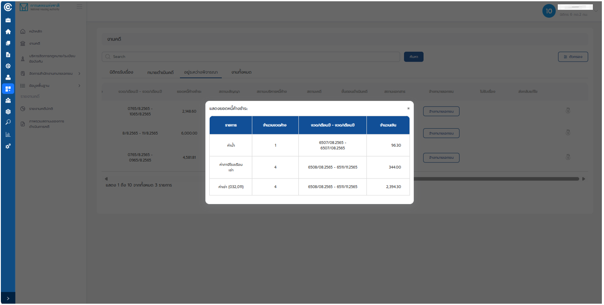<figcaption>
<strong>รูปภาพที่ 138</strong> หน้าจอแสดงยอดหนี้ค้างชำระ
</figcaption></figure>

### 5.4 งานทั้งหมด 

ระบบแสดงข้อมูลงานคดีทั้งหมด ของนิติกรผู้รับผิดชอบนั้น

<figure>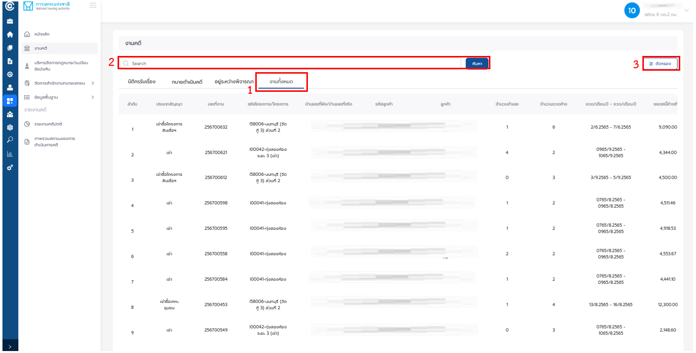<figcaption>
<strong>รูปภาพที่ 139</strong> หน้าจอแสดงเมนู งานทั้งหมด
</figcaption></figure>

1. กดที่เมนู อยู่ระหว่างพิจารณา
2. กรอกคำค้นหาในช่อง “ค้นหา”
3. ปุ่ม “ตัวกรอง”

<figure>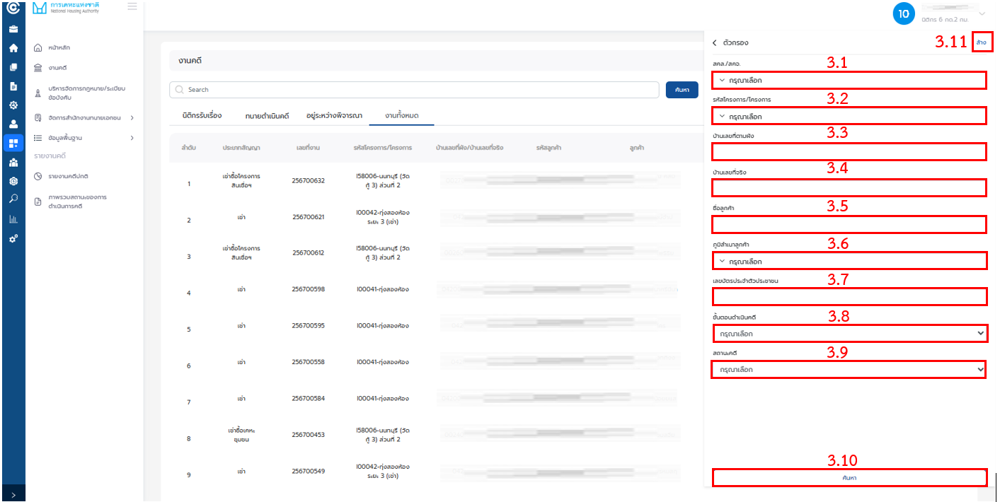<figcaption>
<strong>รูปภาพที่ 140</strong> หน้าจอ Pop-up “ตัวกรอง”
</figcaption></figure>

&#x20;      3.1 กรอกข้อมูล “สคล./สคจ.”

&#x20;      3.2 กรอกข้อมูล “รหัสโครงการ/โครงการ”

&#x20;      3.3 กรอกข้อมูล “บ้านเลขที่ตามผัง”

&#x20;      3.4 กรอกข้อมูล “บ้านเลขที่จริง”

&#x20;      3.5 กรอกข้อมูล “ชื่อลูกค้า”

&#x20;      3.6 กรอกข้อมูล “ภูมิลำเนาลูกค้า”

&#x20;      3.7 กรอกข้อมูล “เลขบัตรประจำตัวประชาชน”

&#x20;      3.8 กรอกข้อมูล “ขั้นตอนดำเนินคดี”

&#x20;      3.9 กรอกข้อมูล “สถานะคดี”

&#x20;      3.10 กดปุ่ม “ค้นหา”

&#x20;      3.11 ลบข้อมูล กดปุ่ม“ล้าง”
